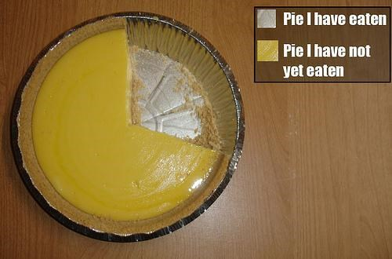
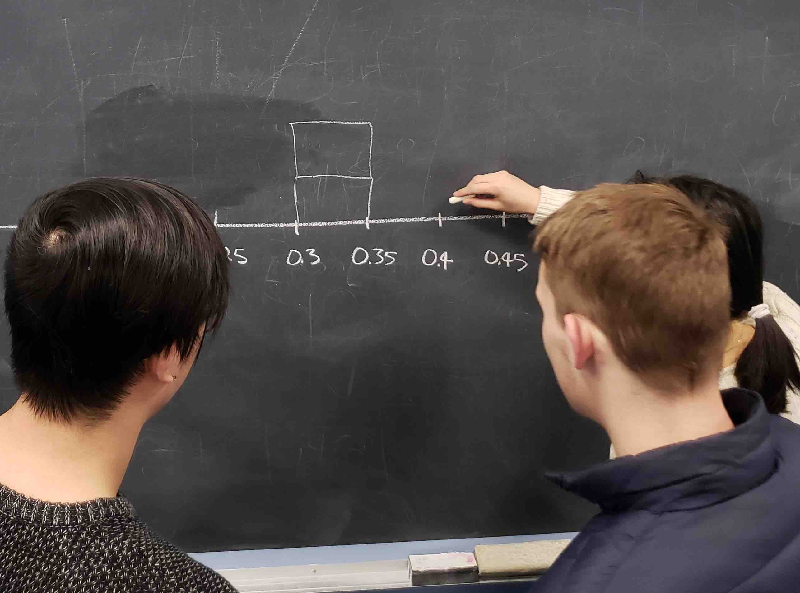
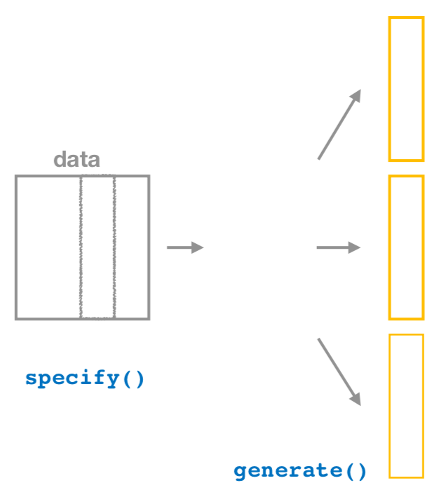

--- 
title: "HR Analytics in R"
author: "Hendrik Feddersen"
date: "`r format(Sys.time(), '%B %d, %Y')`"
knit: "bookdown::render_book"
biblio-style: apalike
bibliography:
- bib/books.bib
- bib/packages.bib
- bib/articles.bib
colorlinks: yes
apple-touch-icon: images/logos/favicons/apple-touch-icon.png
description: "An open-source self-training book to assist you in your journey to sustainable HR Analytics"
documentclass: krantz
favicon: images/logos/favicons/favicon.ico
fontsize: 12pt, krantz2
github-repo: Hendrik147/HR_Analytics_in_R_book
graphics: yes
link-citations: yes
lof: yes
lot: yes
monofont: "Source Code Pro"
monofontoptions: "Scale=0.7"
site: bookdown::bookdown_site
subtitle: Common tasks achieved with the power of R
always_allow_html: yes
url: 'https\://hranalytics.netlify.com/'
cover-image: images/logos/book_cover.png
---

<!-- For use only in PDF, is skipped in HTML -->
\mainmatter

```{r set-options, include=FALSE}
# Trigger for travis-ci rebuild: toc

# Current version information: Date here should match the date in the YAML above.
# Remove .9000 tag and set date to release date when releasing
version <- "0.5.0"
date <- format(Sys.time(), '%B %d, %Y')

# Set output options
if(knitr:::is_html_output())
  options(width = 80)
if(knitr:::is_latex_output())
  options(width = 60)
options(digits = 7, bookdown.clean_book = TRUE, knitr.kable.NA = 'NA')
knitr::opts_chunk$set(
  tidy = FALSE, 
  out.width = '\\textwidth', 
  fig.align = "center", 
  comment = NA
) 

# CRAN packages needed
needed_CRAN_pkgs <- c(
  # Data packages:
  "nycflights13", "ggplot2movies", "fivethirtyeight", "gapminder", "ISLR",
  
  # Explicitly used packages:
  "tidyverse", "rmarkdown", "knitr", "janitor", "skimr",
  "infer", "moderndive","googleway","rebus",
  
  # Internally used packages:
  "webshot", "mvtnorm", "remotes", "devtools", "dygraphs", "gridExtra",
  "kableExtra", "googledrive"
  ) 

new_pkgs <- needed_CRAN_pkgs[!(needed_CRAN_pkgs %in% installed.packages())]
if(length(new_pkgs)) {
  install.packages(new_pkgs, repos = "http://cran.rstudio.com")
}

# GitHub packages needed
if(!"patchwork" %in% installed.packages()){
  # patchwork as of 2018-07-20 needs dev version of ggplot2:
  remotes::install_github("tidyverse/ggplot2")
  remotes::install_github("thomasp85/patchwork")
}

# To be included until new version with gg_parallel_slopes() is on CRAN
remotes::install_github("moderndive/moderndive")

if(!"gt" %in% installed.packages())
  remotes::install_github("rstudio/gt")

# Check that phantomjs is installed to create screenshots of apps
if(is.null(webshot:::find_phantom()))
  webshot::install_phantomjs()

# Automatically create a bib database for R packages
knitr::write_bib(
  c(.packages(), "bookdown", "knitr", "rmarkdown", "nycflights13",
    "ggplot2", "webshot", "dygraphs", "dplyr",
    "ggplot2movies", "fivethirtyeight", "tibble", "readr", "tidyr",
    "janitor", "infer", "skimr", "kableExtra"
  ),
  "bib/packages.bib"
)

# Add all simulation results here
dir.create("rds")

# Add all knitr::purl()'ed chapter R scripts here
dir.create("docs")
system("rm -rf docs/scripts/")
dir.create("docs/scripts")
system("R CMD batch purl.R")
system("rm purl.Rout")

# Copy all needed csv and txt files to docs/
# Should switch to use purrr here at some point
dir.create("docs/data")
file.copy("data/dem_score.csv", "docs/data/dem_score.csv", overwrite = TRUE)
file.copy("data/dem_score.xlsx", "docs/data/dem_score.xlsx", overwrite = TRUE)
file.copy("data/le_mess.csv", "docs/data/le_mess.csv", overwrite = TRUE)
file.copy("data/ideology.csv", "docs/data/ideology.csv", overwrite = TRUE)
# For Appendix B
file.copy("data/ageAtMar.csv", "docs/data/ageAtMar.csv", overwrite = TRUE)
file.copy("data/offshore.csv", "docs/data/offshore.csv", overwrite = TRUE)
file.copy("data/cleSac.txt", "docs/data/cleSac.txt", overwrite = TRUE)
file.copy("data/zinc_tidy.csv", "docs/data/zinc_tidy.csv", overwrite = TRUE)

# Make sure all images copy to docs folder
dir.create("docs/images")
system("cp -r images/* docs/images/")
# Copy previous_versions/ to docs/previous_versions/
# Should switch to use purrr here at some point
dir.create("docs/previous_versions/")
system("cp -r previous_versions/* docs/previous_versions/")

# For some reason logo needs to be done separately.
# Loaded in _includes/logo.html
file.copy("images/logos/hranalytics.jpg", "docs/hranalytics.jpg", overwrite = TRUE)

# Copy pdf file if needed
if(file.exists("ismaykim.pdf"))
  file.copy("ismaykim.pdf", "docs/ismaykim.pdf", overwrite = TRUE)

```

```{r images, include=FALSE}
include_image <- function(path,                           
                          html_opts = "width=45%", 
                          latex_opts = html_opts,
                          alt_text = ""){
  if(knitr:::is_html_output()){
    glue::glue("{{ {html_opts} }}")
  } else if(knitr:::is_latex_output()){
    glue::glue("{{ {latex_opts} }}")    
  }
}

image_link <- function(path,
                       link,
                       html_opts = "height: 200px;",
                       latex_opts = "width=0.2\\textwidth",
                       alt_text = "",
                       centering = TRUE){
  if(knitr:::is_html_output()){
    if(centering){
      glue::glue('
      <center><a target="_blank" class="page-link" href="{link}"></a></center>')
    } else {
      glue::glue('
      <a target="_blank" class="page-link" href="{link}"></a>')
    }
  }
  else if(knitr:::is_latex_output()){
    if(centering){
      glue::glue('\\begin{{center}}
        \\href{{{link}}}{{\\includegraphics[{latex_opts}]{{{path}}}}}
        \\end{{center}}')
    } else
      glue::glue('\\href{{{link}}}{{\\includegraphics[{latex_opts}]{{{path}}}}}')
  }
}
```


# Introduction {#intro}


***

```{block, type='learncheck', purl=FALSE}
**Please note that you are currently looking at the latest version of "HR Analytics in R". However, since work is still in progress it is subject to frequent change.**
```

The intention of this book is to encourage more 'data driven' decisions in HR. HR Analytics is not anymore a nice-to-have addon but rather the way HR practitioners should conduct HR decision making in the future. Where applicable, human judgement is 'added' onto a rigorous analysis of the data done in the first place.

To achieve this ideal world, I need to equip you with some fundamental knowledge of R and RStudio, which are open-source tools for data scientists. I am well aware that on one side you want to do something for your career in HR, however you are most likely completely new to coding.

**Help! I’m new to R and RStudio. I’m completely new to coding! What shall I do?** 

<!-- https://cran.r-project.org/Rlogo.svg -->
<!-- https://www.rstudio.com/wp-content/uploads/2014/07/RStudio-Logo-Blue-Gradient.png -->

<center>
`r include_image("images/Rlogo.png", html_opts = "height=100px", latex_opts = "height=20%")`        \hfill &emsp; &emsp; &emsp; &emsp; `r include_image("images/RStudio-Logo-Blue-Gradient.png", html_opts = "height=100px", latex_opts = "height=20%")`
</center>

<!--

&nbsp;&nbsp;&nbsp;&nbsp;&nbsp;

-->

If you're asking yourself this question, then you have come to the right place! There is no better moment to ride the wave of disruptions taking place now in HR.

* *Are you looking to learn about HR Analytics utilising the power of R"? Then start with our [Introduction for Students](#sec:intro-for-students).*
* *Are you looking to contribute to "HR Analytics in R"? Then click [here](#sec:connect-contribute) for information on how.*
* *Are you curious about the publishing of this book? Then click [here](#sec:about-book) for more information on the open-source technology, in particular R Markdown and the bookdown package.*

This is version `r version` of "HR Analytics in R" published on `r date`. While a PDF version of this book can be found [here](hrnalyticsinr.pdf){target="_blank"}, this is very much a work in progress with many things that still need to be fixed. I appreciate your patience. 


***


## Introduction for students {#sec:intro-for-students}

This book assumes no prerequisites: no algebra, no calculus, and no prior programming/coding experience. This is intended to be a gentle introduction to the practice of analyzing data and answering questions using data the way data scientists, statisticians and other researchers would. 

### Working with the material {#workingwithmaterials .unnumbered}

You can work your way through the materials by clicking on the arrows to the left and right at the bottom of each page. Alternatively, there is a collapsible contents bar on the left hand side.

If you need to find something specific, you can use the search icon. Typing in a word or phrase will filter the contents bar to relevant sections.

The book by default renders black sans serif on a white background. You can use the A to amend the appearance of the book to make it easier to process, whether that’s a larger font, a serif font, or a different colour scheme.

The edit button takes you straight to github, where you can propose editorial changes.

### Conventions {#conventions .unnumbered}

Throughout this book various conventions will be used.

In terms of basic formatting:

* This is standard text.
* `This is code or a symbol`
* *This is a Keyboard Key!*
* **This is the first time I mention something important**

This is a book about coding, so expect code blocks. Code blocks will typically look like this:

```{r}
"this is a code block"
```

Directly underneath it, normally starting with two hash symbols (##) is the result of the code executing.

```{r}
## [1] 'this is a code block'`
```

There will also be callouts throughout the book. Some are for information, some expect you to do things.

Anything written here should be read carefully before proceeding.

This is a tip relating to what I’ve just said.

This is kind of like a tip but is for when you’re getting into trouble and need help.

This is something I recommend you do as you’re reading.

In Figure \@ref(fig:moderndive-figure) I present a flowchart of what you'll cover in this book. You'll first get started with data in Chapter \@ref(getting-started), where you'll learn about the difference between R and RStudio, start coding in R, understand what R packages are, and explore your first dataset: all domestic departure flights from a New York City airport in 2013. Then

1. **Data science**: You'll assemble your data science toolbox using `tidyverse` packages. In particular:
    + Ch.\@ref(viz): Visualizing data via the `ggplot2` package.
    + Ch.\@ref(tidy): Understanding the concept of "tidy" data as a standardized data input format for all packages in the `tidyverse`
    + Ch.\@ref(wrangling): Wrangling data via the `dplyr` package.
1. **Data modeling**: Using these data science tools and helper functions from the `moderndive` package, you'll start performing data modeling. In particular:
    + Ch.\@ref(regression): Constructing basic regression models.
    + Ch.\@ref(multiple-regression): Constructing multiple regression models.
1. **Statistical inference**: Once again using your newly acquired data science tools, I'll unpack statistical inference using the `infer` package. In particular:
    + Ch.\@ref(sampling): Understanding the role that sampling variability plays in statistical inference using both tactile and virtual simulations of sampling from a "bowl" with an unknown proportion of red balls.
    + Ch.\@ref(confidence-intervals): Building confidence intervals.
    + Ch.\@ref(hypothesis-testing): Conducting hypothesis tests.
1. **Data modeling revisited**: Armed with your new understanding of statistical inference, you'll revisit and review the models you constructed in Ch.\@ref(regression) & Ch.\@ref(multiple-regression). In particular:
    + Ch.\@ref(inference-for-regression): Interpreting both the statistical and practice significance of the results of the models.
    + Ch.\@ref(thinking-with-data): I'll end the introductory chapters with a discussion on what it means to "think with data" and present an example case study data analysis of house prices in Seattle.
1. **HR Analytics - data driven decision making**: The intention is to provide real tangible examples of the application of data science to HR, to illustrate the data science process in the HR context, and to show that the scope mentioned previously in this article, isn't just theoretical - it's real. The last and most important module shall illustrate current best practices of a structured process of thinking and analysis. 


```{r moderndive-figure, echo=FALSE, fig.align='center', fig.cap="ModernDive Flowchart", fig.width=8}
knitr::include_graphics("images/flowcharts/flowchart/flowchart.002.png")
```


### What you will learn from this book {#subsec:learning-goals}

I hope that by the end of this book, you'll have learned

1. How to use R to explore data.  
1. How to answer statistical questions using tools like confidence intervals and hypothesis tests. 
1. How to effectively create "data stories" using these tools. 

What do I mean by data stories? I mean any analysis involving data that engages the reader in answering questions with careful visuals and thoughtful discussion, such as [How strong is the relationship between per capita income and crime in Chicago neighborhoods?](http://rpubs.com/ry_lisa_elana/chicago) and [How many f**ks does Quentin Tarantino give (as measured by the amount of swearing in his films)?](https://ismayc.github.io/soc301_s2017/group_projects/group4.html).  Further discussions on data stories can be found in this [Think With Google article](https://www.thinkwithgoogle.com/marketing-resources/data-measurement/tell-meaningful-stories-with-data/).  

For other examples of data stories constructed by students like yourselves, look at the final projects for two courses that have previously used ModernDive:

* Middlebury College [MATH 116 Introduction to Statistical and Data Sciences](https://rudeboybert.github.io/MATH116/PS/final_project/final_project_outline.html#past_examples) using student collected data.
* Pacific University [SOC 301 Social Statistics](https://ismayc.github.io/soc301_s2017/group-projects/index.html) using data from the [fivethirtyeight R package](https://cran.r-project.org/web/packages/fivethirtyeight/vignettes/fivethirtyeight.html).

This book will help you develop your "data science toolbox", including tools such as data visualization, data formatting, data wrangling, and data modeling using regression. With these tools, you'll be able to perform the entirety of the "data/science pipeline" while building data communication skills (see Subsection \@ref(subsec:pipeline) for more details). 

In particular, this book will lean heavily on data visualization.  In today's world, we are bombarded with graphics that attempt to convey ideas.  I will explore what makes a good graphic and what the standard ways are to convey relationships with data.  You'll also see the use of visualization to introduce concepts like mean, median, standard deviation, distributions, etc.  In general, I'll use visualization as a way of building almost all of the ideas in this book.

To impart the statistical lessons in this book, I have intentionally minimized the number of mathematical formulas used and instead have focused on developing a conceptual understanding via data visualization, statistical computing, and simulations.  I hope this is a more intuitive experience than the way statistics has traditionally been taught in the past and how it is commonly perceived.

Finally, you'll learn the importance of literate programming.  By this I mean you'll learn how to write code that is useful not just for a computer to execute but also for readers to understand exactly what your analysis is doing and how you did it.  This is part of a greater effort to encourage reproducible research (see Subsection \@ref(subsec:reproducible) for more details). Hal Abelson coined the phrase that I will follow throughout this book:

> "Programs must be written for people to read, and only incidentally for machines to execute."

I understand that there may be challenging moments as you learn to program.  Both of us continue to struggle and find ourselves often using web searches to find answers and reach out to colleagues for help.  In the long run though, we all can solve problems faster and more elegantly via programming.  I wrote this book as our way to help you get started and you should know that there is a huge community of R users that are always happy to help everyone along as well.  This community exists in particular on the internet on various forums and websites such as [stackoverflow.com](https://stackoverflow.com/).

### Data/science pipeline {#subsec:pipeline}

You may think of statistics as just being a bunch of numbers.  I commonly hear the phrase "statistician" when listening to broadcasts of sporting events.  Statistics (in particular, data analysis), in addition to describing numbers like with baseball batting averages, plays a vital role in all of the sciences.  You'll commonly hear the phrase "statistically significant" thrown around in the media.  You'll see articles that say "Science now shows that chocolate is good for you."  Underpinning these claims is data analysis.  By the end of this book, you'll be able to better understand whether these claims should be trusted or whether we should be wary.  Inside data analysis are many sub-fields that I will discuss throughout this book (though not necessarily in this order):

- data collection
- data wrangling
- data visualization
- data modeling
- inference
- correlation and regression
- interpretation of results
- data communication/storytelling

These sub-fields are summarized in what Grolemund and Wickham term the ["Data/Science Pipeline"](http://r4ds.had.co.nz/explore-intro.html) in Figure \@ref(fig:pipeline-figure).

```{r pipeline-figure, echo=FALSE, fig.align='center', fig.cap="Data/Science Pipeline"}
knitr::include_graphics("images/tidy1.png")
```

I will begin by digging into the gray **Understand** portion of the cycle with data visualization, then with a discussion on what is meant by tidy data and data wrangling, and then conclude by talking about interpreting and discussing the results of our models via **Communication**.  These steps are vital to any statistical analysis.  But why should you care about statistics?  "Why did they make me take this class?"

There's a reason so many fields require a statistics course. Scientific knowledge grows through an understanding of statistical significance and data analysis. You needn't be intimidated by statistics.  It's not the beast that it used to be and, paired with computation, you'll see how reproducible research in the sciences particularly increases scientific knowledge.

### Reproducible research {#subsec:reproducible}

> "The most important tool is the _mindset_, when starting, that the end product will be reproducible." – Keith Baggerly

Another goal of this book is to help readers understand the importance of reproducible analyses. The hope is to get readers into the habit of making their analyses reproducible from the very beginning.  This means I'll be trying to help you build new habits.  This will take practice and be difficult at times. You'll see just why it is so important for you to keep track of your code and well-document it to help yourself later and any potential collaborators as well.  

Copying and pasting results from one program into a word processor is not the way that efficient and effective scientific research is conducted.  It's much more important for time to be spent on data collection and data analysis and not on copying and pasting plots back and forth across a variety of programs.

In a traditional analyses if an error was made with the original data, we'd need to step through the entire process again:  recreate the plots and copy and paste all of the new plots and our statistical analysis into your document.  This is error prone and a frustrating use of time.  I'll see how to use R Markdown to get away from this tedious activity so that we can spend more time doing science.

> "We are talking about _computational_ reproducibility." - Yihui Xie

Reproducibility means a lot of things in terms of different scientific fields.  Are experiments conducted in a way that another researcher could follow the steps and get similar results?  In this book, I will focus on what is known as **computational reproducibility**.  This refers to being able to pass all of one's data analysis, data-sets, and conclusions to someone else and have them get exactly the same results on their machine.  This allows for time to be spent interpreting results and considering assumptions instead of the more error prone way of starting from scratch or following a list of steps that may be different from machine to machine.

<!--
Additionally, this book will focus on computational thinking, data thinking, and inferential thinking. I'll see throughout the book how these three modes of thinking can build effective ways to work with, to describe, and to convey statistical knowledge.  
-->

### Final note for students

At this point, if you are interested in instructor perspectives on this book, ways to contribute and collaborate, or the technical details of this book's construction and publishing, then continue with the rest of the chapter below.  Otherwise, let's get started with R and RStudio in Chapter \@ref(getting-started)!


***


## Introduction for instructors {#sec:intro-instructors}

This book is inspired by the following books:

- "Mathematical Statistics with Resampling and R" [@hester2011],
- "OpenIntro: Intro Stat with Randomization and Simulation" [@isrs2014], and 
- "R for Data Science" [@rds2016].


The first book, while designed for upper-level undergraduates and graduate students, provides an excellent resource on how to use resampling to impart statistical concepts like sampling distributions using computation instead of large-sample approximations and other mathematical formulas.  The last two books are free options to learning introductory statistics and data science, providing an alternative to the many traditionally expensive introductory statistics textbooks. 

When looking over the large number of introductory statistics textbooks that currently exist, I found that there wasn't one that incorporated many newly developed R packages directly into the text, in particular the many packages included in the [`tidyverse`](http://tidyverse.org/) collection of packages, such as `ggplot2`, `dplyr`, `tidyr`, and `broom`. Additionally, there wasn't an open-source and easily reproducible textbook available that exposed new learners all of three of the learning goals listed at the outset of Subsection \@ref(subsec:learning-goals).

### Who is this book for?

This book is intended for instructors of traditional introductory statistics classes using RStudio, either the desktop or server version, who would like to inject more data science topics into their syllabus. I assume that students taking the class will have no prior algebra, calculus, nor programming/coding experience.

Here are some principles and beliefs I kept in mind while writing this text. If you agree with them, this might be the book for you.

1. **Blur the lines between lecture and lab**
    + With increased availability and accessibility of laptops and open-source non-proprietary statistical software, the strict dichotomy between lab and lecture can be loosened.
    + It's much harder for students to understand the importance of using software if they only use it once a week or less.  They forget the syntax in much the same way someone learning a foreign language forgets the rules. Frequent reinforcement is key.
1. **Focus on the entire data/science research pipeline**
    + I believe that the entirety of Grolemund and Wickham's [data/science pipeline](http://r4ds.had.co.nz/introduction.html) should be taught.
    + I believe in ["minimizing prerequisites to research"](https://arxiv.org/abs/1507.05346): students should be answering questions with data as soon as possible.
1. **It's all about the data**
    + I leverage R packages for rich, real, and realistic data-sets that at the same time are easy-to-load into R, such as the `nycflights13` and `fivethirtyeight` packages.
    + I believe that [data visualization is a gateway drug for statistics](http://escholarship.org/uc/item/84v3774z) and that the Grammar of Graphics as implemented in the `ggplot2` package is the best way to impart such lessons. However, I often hear: "You can't teach `ggplot2` for data visualization in intro stats!" I, like [David Robinson](http://varianceexplained.org/r/teach_ggplot2_to_beginners/), are much more optimistic.
    + `dplyr` has made data wrangling much more [accessible](http://chance.amstat.org/2015/04/setting-the-stage/) to novices, and hence much more interesting data-sets can be explored. 
1. **Use simulation/resampling to introduce statistical inference, not probability/mathematical formulas**
    + Instead of using formulas, large-sample approximations, and probability tables, statistical concepts using resampling-based inference.
    + This allows for a de-emphasis of traditional probability topics, freeing up room in the syllabus for other topics.
1. **Early exposure to analytics and computing**
    + Computing skills are essential to working with data in the 21st century even for HR managers. Given this fact, I feel that an early exposure to computing can only be of benefit to the whole HR community.
    + I am not teaching a course on coding/programming per se, but rather just enough of the computational and algorithmic thinking necessary for performing a data analysis in HR.
1. **Complete reproducibility and customisability**
    + I am frustrated when people talk about HR Analytics, without giving the source code and the data itself. I give you the source code for all examples as well as the whole book!
    + If you want you can even use my book as a starting point and customise for your own non-profit training. For more about how to make this book your own, see [About this Book](#sec:about-book).


***


## Connect and contribute {#sec:connect-contribute}

If you would like to connect with "HR Analytics in R", check out the following links:

* If you would like to receive periodic updates about HR Analytics, then please sign up for my [mailing list](https://hranalytics.live/signup/). You will receive receive bi-weekly notififications about my new blog posts.
* Please feel free to contact me at [info@hranalytics.live](mailto:info@hranalytics.live) .
* I am on Twitter at [h_feddersen](https://twitter.com/h_feddersen).

If you would like to contribute to "HR Analytics in R", there are many ways! Let's all work together to make this book as great as possible for as many students as possible!

* Please let me know if you find any errors, typos, or areas from improvement on my [GitHub issue page](https://github.com/Hendrik147/HR_Analytics_in_R_book/issues) page. I will fix it as soon as possible.
* If you are familiar with GitHub and would like to contribute even more, please see Section \@ref(sec:about-book) below.

I would like to thank [Moderndive](https://github.com/moderndive/moderndive_book) for their inspirational presentation at a recent R user conference and for their generous example on how to set up a bookdown book and for their introductory pages on how to start using R.


***


## About this book {#sec:about-book}

This book was written using RStudio's [bookdown](https://bookdown.org/) package by Yihui Xie [@R-bookdown]. This package simplifies the publishing of books by having all content written in [R Markdown](http://rmarkdown.rstudio.com/html_document_format.html).

* **Latest published version, still in development** The most up-to-date version, which is still in development is available at [https://hranalyticslive.netlify.com/](https://hranalyticslive.netlify.com/)
* **Source code** The bookdown/R Markdown source code for the latest version of "HR Analytics in R" is available on Hendrik Feddersen's [GitHub repository page](https://github.com/Hendrik147/HR_Analytics_in_R_book)
* **Usage** You can share this material with colleagues or for non-commercial purposes but you can’t resell or incorporate them into stuff you make money from. 
    + As a symbol of gratitude, I would expect you at least to sign up for my [mailing list](https://hranalytics.live/signup/). 
    + If you think my material is awesome and want to use it for commercial purposes, please contact me at [info@hranalytics.live](mailto:info@hranalytics.live)

* **Licence** This work is licensed under a Creative Commons
    Attribution-NonCommercial 4.0 International License.
    
    

***


## About the author {#sec:about-authors}

Who am I?

`r include_image(path = "images/Photo HF Snappy.jpg", html_opts = "height=200px", latex_opts = "width=40%")`

<!-- -->

* I am Hendrik Feddersen, a long-standing HR practitioner passionate about HR Analytics and living in Amsterdam, Netherlands.

    + Email: [info@hranalytics.live](mailto:info@hranalytics.live)
    + Webpage: <https://hranalytics.live/>
    + Twitter: [h_feddersen](https://twitter.com/h_feddersen)
    + GitHub: <https://github.com/Hendrik147>


<!--
### Colophon 

* "HR Analytics in R" is written using the Attribution-NonCommercial-ShareAlike 4.0 International (CC BY-NC-SA 4.0); more information on this license is available [here](https://creativecommons.org/licenses/by-nc-sa/4.0/).
* "HR Analytics in R" uses the following versions of R packages (and their dependent packages):
-->


```{r colophon, echo=FALSE, eval=FALSE}
library(kableExtra)
knitr::kable(devtools::session_info(needed_pkgs)$packages, 
             booktabs = TRUE,
             longtable = TRUE) %>% 
  kable_styling(font_size = ifelse(knitr:::is_latex_output(), 10, 16),
                latex_options = c("HOLD_position"))
```

<!--chapter:end:index.Rmd-->

# Getting Started with Data in R {#getting-started}

```{r getting_started, include=FALSE, purl=FALSE}
chap <- 2
lc <- 0
rq <- 0
# **`r paste0("(LC", chap, ".", (lc <- lc + 1), ")")`**
# **`r paste0("(RQ", chap, ".", (rq <- rq + 1), ")")`**

knitr::opts_chunk$set(
  tidy = FALSE, 
  out.width = '\\textwidth', 
  fig.height = 4,
  fig.align='center',
  warning = FALSE
)

options(scipen = 99, digits = 3)

# Set random number generator see value for replicable pseudorandomness. Why 76?
# https://www.youtube.com/watch?v=xjJ7FheCkCU
set.seed(76)
```

Before we can start exploring data in R, there are some key concepts to understand first:

1. What are R and RStudio?
2. How do I code in R?
3. What are R packages?

We'll introduce these concepts in upcoming Sections \@ref(r-rstudio)-\@ref(packages). If you are already somewhat familiar with these concepts, feel free to skip to Section \@ref(nycflights13) where we'll introduce our first data set: all domestic flights departing a New York City airport in 2013. This is a dataset we will explore in depth in this book.


***


## What are R and RStudio? {#r-rstudio}

For much of this book, we will assume that you are using R via RStudio. First time users often confuse the two. At its simplest:

* R is like a car's engine.
* RStudio is like a car's dashboard.

R: Engine            |  RStudio: Dashboard 
:-------------------------:|:-------------------------:
{ height=1.7in }  |  { height=1.7in }

More precisely, R is a programming language that runs computations while RStudio is an *integrated development environment (IDE)* that provides an interface by adding many convenient features and tools. So just as the way of having access to a speedometer, rearview mirrors, and a navigation system makes driving much easier, using RStudio's interface makes using R much easier as well. 


### Installing R and RStudio

> **Note about RStudio Server**: If your instructor has provided you with a link and access to RStudio Server, then you can skip this section. We do recommend though after a few months of working on the RStudio Server that you return to these instructions.

You will first need to download and install both R and RStudio (Desktop version) on your computer. 

1. **You must do this first:** [Download and install R](https://cran.r-project.org/).
    + Click on the download link corresponding to your computer's operating system.
1. **You must do this second:** [Download and install RStudio](https://www.rstudio.com/products/rstudio/download3/).
    + Scroll down to "Installers for Supported Platforms"
    + Click on the download link corresponding to your computer's operating system.


### Using R via RStudio

Recall our car analogy from above. Much as we don't drive a car by interacting directly with the engine but rather by interacting with elements on the car's dashboard, we won't be using R directly but rather we will use RStudio's interface. After you install R and RStudio on your computer, you'll have two new programs AKA applications you can open. We will always work in RStudio and not R. In other words:

R: Do not open this          |  RStudio: Open this
:-------------------------:|:-------------------------:
`r include_image("images/Rlogo.png", html_opts = "width=25%")`  | `r include_image("images/RStudio-Ball.png", html_opts = "width=20%")`

After you open RStudio, you should see the following:


Note the three panes, which are three panels dividing the screen: The *Console pane*, the *Files pane*, and the *Environment pane*. Over the course of this chapter, you'll come to learn what purpose each of these panes serve. 


***


## How do I code in R? {#code}

Now that you're set up with R and RStudio, you are probably asking yourself "OK. Now how do I use R?" The first thing to note as that unlike other statistical software programs like Excel, STATA, or SAS that provide [point and click](https://en.wikipedia.org/wiki/Point_and_click) interfaces, R is an [interpreted language](https://en.wikipedia.org/wiki/Interpreted_language), meaning you have to enter in R commands written in R code. In other words, you have to code/program in R. Note that we'll use the terms "coding" and "programming" interchangeably in this book.

While it is not required to be a seasoned coder/computer programmer to use R, there is still a set of basic programming concepts that R users need to understand. Consequently, while this book is not a book on programming, you will still learn just enough of these basic programming concepts needed to explore and analyze data effectively.


### Basic programming concepts and terminology {#programming-concepts}

We now introduce some basic programming concepts and terminology that you'll learn as you go. Note that in this book, we will use a different font to distinguish regular font from `computer_code`.

It is important to note that while these tutorials serve as excellent introductions, a single pass through them is insufficient for long-term learning and retention. The ultimate tools for long-term learning and retention are "learning by doing" and repetition, something we will have you do over the course of the entire book and we encourage this process as much as possible as you learn any new skill.

* Basics:
    + Console: where you enter in commands
    + Objects: where values are saved, how to assign values to objects.
    + Data types: integers, doubles/numerics, logicals, characters.  
* Vectors: a series of values. These are created using the `c()` function where `c()` stands for "combine" or "concatenate". For example: `c(6, 11, 13, 31, 90, 92)`.
* Factors: *Categorical data* (as opposed to *numerical data*) are represented in R as `factor`s.
* Data frames: Data frames are analogous to rectangular spreadsheets: they are representations of datasets in R where the rows correspond *observations* and the columns correspond to *variables* that describe the observations. We will revisit this later in Section \@ref(nycflights13).
* Conditionals:
    + Testing for equality in R using `==` (and not `=` which is typically used for assignment). Ex: `2 + 1 == 3` compares `2 + 1` to `3` and is correct R syntax, while `2 + 1 = 3` is not and is incorrect R syntax.
    + Boolean algebra: `TRUE/FALSE` statements and mathematical operators such as `<` (less than), `<=` (less than or equal), and `!=` (not equal to).
    + Logical operators: `&` representing "and", `|` representing "or". Ex: `(2 + 1 == 3) & (2 + 1 == 4)` returns `FALSE` while `(2 + 1 == 3) | (2 + 1 == 4)` returns `TRUE`.
* Functions: Functions take in inputs (called *arguments*) and return outputs. You either manually specify a function's arguments or use the function's *defaults*.

This list is by no means an exhaustive list of all the programming concepts and terminology needed to become a savvy R user; such a list would be so large it wouldn't be very useful, especially for novices. Rather, we feel this is the bare minimum you need to know before you get started; the rest we feel you can learn as you go.  Remember that your knowledge of all of these concepts will build as you get better and better at "speaking R" and getting used to its syntax.


### Errors, warnings, and messages

One slightly confusing part of R is how it reports errors, warnings, and messages. The default theme in RStudio colors errors, warnings, and messages in red, which makes them seem like you did something wrong. However, seeing red text in the console *is not always bad.*

R will show red text in the console in three different situations:

* **Errors**: When the red text is a legitimate error, it will be prefaced with "Error in…" and try to explain what went wrong. Generally when there's an error, the code will not run. For example, as shown in Subsection \@ref(package-use) below if you see `Error in ggplot(...) : could not find function "ggplot"`, it means that the `ggplot()` function is not accessible because the package was not loaded with `library(ggplot2)`, and thus you cannot use it.
* **Warnings**: When the red text is a warning, it will be prefaced with "Warning:" and try to explain why there's a warning. Generally your code will still work, but with some caveats. For example, you see in Chapter \@ref(viz) if you plot a scatterplot and one of the rows in your data frame is missing a value, you will see this warning: `Warning: Removed 1 rows containing missing values (geom_point)`. R will still make the scatterplot with all the remaining values, but it's warning you that one of the points isn't there.
* **Messages**: When the red text doesn't start with either "Error" or "Warning", it's *just a friendly message*. You'll see these messages when you load some packages like the `dplyr` package in Subsection \@ref(package-loading) below, or when you read data saved in spreadsheet files with `read_csv()` as you'll see in Chapter \@ref(tidy). These are helpful diagnostic messages and they don't stop your code from working. 

Remember, when you see red text in the console, *don't panic*. It doesn't necessarily mean anything is wrong. 

* If the text starts with "Error", figure out what's causing it. <span style="color:red">Think of errors as a red traffic light: something is wrong!</span>
* If the text starts with "Warning", figure out if it's something to worry about. For instance, if you get a warning about missing values in a scatterplot and you know there are missing values, you're fine. If that's surprising, look at your data and see what's missing. <span style="color:gold">Think of warnings as a yellow traffic light: everything is working fine, but watch out/pay attention.</span>
* Otherwise the text is just a message. Read it, wave back at R, and thank it for talking to you. <span style="color:green">Think of messages as a green traffic light: everything is working fine.</span>


### Tips on learning to code

Learning to code/program is very much like learning a foreign language, it can be very daunting and frustrating at first. Such frustrations are very common and it is very normal to feel discouraged as you learn. However just as with learning a foreign language, if you put in the effort and are not afraid to make mistakes, anybody can learn. 

Here are a few useful tips to keep in mind as you learn to program:

* **Remember that computers are not actually that smart**: You may think your computer or smartphone are "smart," but really people spent a lot of time and energy designing them to appear "smart." Rather you have to tell a computer everything it needs to do. Furthermore the instructions you give your computer can't have any mistakes in them, nor can they be ambiguous in any way.
* **Take the "copy, paste, and tweak" approach**: Especially when learning your first programming language, it is often much easier to taking existing code that you know works and modify it to suit your ends, rather than trying to write new code from scratch. We call this the *copy, paste, and tweak* approach. So early on, we suggest not trying to write code from memory, but rather take existing examples we have provided you, then copy, paste, and tweak them to suit your goals. Don't be afraid to play around!
* **The best way to learn to code is by doing**: Rather than learning to code for its own sake, we feel that learning to code goes much smoother when you have a goal in mind or when you are working on a particular project, like analyzing data that you are interested in. 
* **Practice is key**:  Just as the only method to improving your foreign language skills is through practice, practice, and practice; so also the only method to improving your coding is through practice, practice, and practice. Don't worry however; we'll give you plenty of opportunities to do so!


***


## What are R packages? {#packages}

Another point of confusion with many new R users is the idea of an R package. R packages extend the functionality of R by providing additional functions, data, and documentation. They are written by a world-wide community of R users and can be downloaded for free from the internet. For example, among the many packages we will use in this book are:

* The `ggplot2` package for data visualization in Chapter \@ref(viz).
* The `dplyr` package for data wrangling in Chapter \@ref(wrangling).
* The `moderndive` package that accompanies this book. 
* The `infer` package for "tidy" and transparent statistical inference in Chapters \@ref(confidence-intervals), \@ref(hypothesis-testing), and \@ref(inference-for-regression).

A good analogy for R packages is they are like apps you can download onto a mobile phone:

R: A new phone           |  R Packages: Apps you can download
:-------------------------:|:-------------------------:
{ height=1.5in } |  { height=1.5in }

So R is like a new mobile phone: while it has a certain amount of features when you use it for the first time, it doesn't have everything. R packages are like the apps you can download onto your phone from Apple's App Store or Android's Google Play. 

Let's continue this analogy by considering the Instagram app for editing and sharing pictures. Say you have purchased a new phone and you would like to share a recent photo you have taken on Instagram. You need to:

1. *Install the app*: Since your phone is new and does not include the Instagram app, you need to download the app from either the App Store or Google Play. You do this once and you're set. You might do this again in the future any time there is an update to the app.
1. *Open the app*: After you've installed Instagram, you need to open the app.

Once Instagram is open on your phone, you can then proceed to share your photo with your friends and family. The process is very similar for using an R package. You need to:

1. *Install the package*: This is like installing an app on your phone. Most packages are not installed by default when you install R and RStudio. Thus if you want to use a package for the first time, you need to install it first. Once you've installed a package, you likely won't install it again unless you want to update it to a newer version.
1. *"Load" the package*: "Loading" a package is like opening an app on your phone. Packages are not "loaded" by default when you start RStudio on your computer; you need to "load" each package you want to use every time you start RStudio.

Let's now show you how to perform these two steps for the `ggplot2` package for data visualization.


### Package installation {#package-installation}

> **Note about RStudio Server**: If your instructor has provided you with a link and access to RStudio Server, you probably will not need to install packages, as they have likely been pre-installed for you by your instructor. That being said, it is still a good idea to know this process for later on when you are not using RStudio Server, but rather RStudio Desktop on your own computer.

There are two ways to install an R package. For example, to install the `ggplot2` package:

1. **Easy way**: In the Files pane of RStudio:
    a) Click on the "Packages" tab
    a) Click on "Install"
    a) Type the name of the package under "Packages (separate multiple with space or comma):" In this case, type `ggplot2`
    a) Click "Install"  
     { height=4in }
1. **Slightly harder way**: An alternative but slightly less convenient way to install a package is by typing `install.packages("ggplot2")` in the Console pane of RStudio and hitting enter. Note you must include the quotation marks.

Much like an app on your phone, you only have to install a package once. However, if you want to update an already installed package to a newer version, you need to re-install it by repeating the above steps.

```{block lc2-0, type='learncheck'}
**_Learning check_**
```
**`r paste0("(LC", chap, ".", (lc <- lc + 1), ")")`** Repeat the above installing steps, but for the `dplyr`, `nycflights13`, and `knitr` packages. This will install the earlier mentioned `dplyr` package, the `nycflights13` package containing data on all domestic flights leaving a NYC airport in 2013, and the `knitr` package for writing reports in R. 
```{block, type='learncheck'}
```
 

### Package loading {#package-loading}

Recall that after you've installed a package, you need to "load" it, in other words open it. We do this by using the `library()` command. For example, to load the `ggplot2` package, run the following code in the Console pane. What do we mean by "run the following code"? Either type or copy & paste the following code into the Console pane and then hit the enter key. 

```{r, eval=FALSE}
library(ggplot2)
```

If after running the above code, a blinking cursor returns next to the `>` "prompt" sign, it means you were successful and the `ggplot2` package is now loaded and ready to use. If however, you get a red "error message" that reads...

```
Error in library(ggplot2) : there is no package called ‘ggplot2’
```

... it means that you didn't successfully install it. In that case, go back to the previous subsection "Package installation" and install it. 

```{block lc2-1, type='learncheck'}
**_Learning check_**
```
**`r paste0("(LC", chap, ".", (lc <- lc + 1), ")")`** "Load" the `dplyr`, `nycflights13`, and `knitr` packages as well by repeating the above steps.
```{block, type='learncheck'}
```
 

### Package use {#package-use}

One extremely common mistake new R users make when wanting to use particular packages is they forget to "load" them first by using the `library()` command we just saw. Remember: *you have to load each package you want to use every time you start RStudio.* If you don't first "load" a package, but attempt to use one of its features, you'll see an error message similar to:

```
Error: could not find function
```

R is telling you that you are trying to use a function in a package that has not yet been "loaded." Almost all new users forget do this when starting out, and it is a little annoying to get used. However, you'll remember with practice.  


***


## Explore your first datasets {#nycflights13}

Let's put everything we've learned so far into practice and start exploring some real data! Data comes to us in a variety of formats, from pictures to text to numbers.  Throughout this book, we'll focus on datasets that are saved in "spreadsheet"-type format; this is probably the most common way data are collected and saved in many fields.  Remember from Subsection \@ref(programming-concepts) that these "spreadsheet"-type datasets are called _data frames_ in R; we will focus on working with data saved as data frames throughout this book.

Let's first load all the packages needed for this chapter, assuming you've already installed them. Read Section \@ref(packages) for information on how to install and load R packages if you haven't already.

```{r message=FALSE}
library(nycflights13)
library(dplyr)
library(knitr)
```

At the beginning of all subsequent chapters in this text, we'll always have a list of packages that you should have installed and loaded to work with that chapter's R code. 

### `nycflights13` package

Many of us have flown on airplanes or know someone who has. Air travel has become an ever-present aspect in many people's lives.  If you live in or are visiting a relatively large city and you walk around that city's airport, you see gates showing flight information from many different airlines.  And you will frequently see that some flights are delayed because of a variety of conditions. Are there ways that we can avoid having to deal with these flight delays?  

We'd all like to arrive at our destinations on time whenever possible. (Unless you secretly love hanging out at airports.  If you are one of these people, pretend for the moment that you are very much anticipating being at your final destination.)  Throughout this book, we're going to analyze data related to flights contained in the `nycflights13` package [@R-nycflights13]. Specifically, this package contains five data sets saved in five separate data frames with information about all domestic flights departing from New York City in 2013. These include Newark Liberty International (EWR), John F. Kennedy International (JFK), and LaGuardia (LGA) airports:

* `flights`: Information on all `r scales::comma(nrow(nycflights13::flights))` flights
* `airlines`: A table matching airline names and their two letter IATA airline codes (also known as carrier codes) for `r nrow(nycflights13::airlines)` airline companies
* `planes`: Information about each of `r scales::comma(nrow(nycflights13::planes))` physical aircraft used.
* `weather`: Hourly meteorological data for each of the three NYC airports. This data frame has `r scales::comma(nrow(nycflights13::weather))` rows, roughly corresponding to the 365 $\times$ 24 $\times$ 3 = 26,280 possible hourly measurements one can observe at three locations over the course of a year.
* `airports`: Airport names, codes, and locations for `r scales::comma(nrow(nycflights13::airports))` destination airports.

### `flights` data frame

We will begin by exploring the `flights` data frame that is included in the `nycflights13` package and getting an idea of its structure. Run the following code in your console (either by typing it or cutting & pasting it): it loads in the `flights` dataset into your Console. Note depending on the size of your monitor, the output may vary slightly. 

```{r load_flights}
flights
```

Let's unpack this output:

* `A tibble: 336,776 x 19`: A `tibble` is a kind of data frame used in R. This particular data frame has
    + `336,776` rows
    + `19` columns corresponding to 19 variables describing each observation
* `year month day dep_time sched_dep_time dep_delay arr_time` are different columns, in other words variables, of this data frame.
* We then have the first 10 rows of observations corresponding to 10 flights.
* `... with 336,766 more rows, and 11 more variables:` indicating to us that 336,766 more rows of data and 11 more variables could not fit in this screen.

Unfortunately, this output does not allow us to explore the data very well. Let's look at different tools to explore data frames.

### Exploring data frames {#exploredataframes}

Among the many ways of getting a feel for the data contained in a data frame such as `flights`, we present three functions that take as their "argument", in other words their input, the data frame in question. We also include a fourth method for exploring one particular column of a data frame:

1. Using the `View()` function built for use in RStudio. We will use this the most.
1. Using the `glimpse()` function, which is included in the `dplyr` package.
1. Using the `kable()` function,  which is included in the `knitr` package.
1. Using the `$` operator to view a single variable in a data frame.

**1. `View()`**:

Run `View(flights)` in your Console in RStudio, either by typing it or cutting & pasting it into the Console pane, and explore this data frame in the resulting pop-up viewer. You should get into the habit of always `View`ing any data frames that come your way.  Note the capital "V" in `View`.  R is case-sensitive so you'll receive an error is you run `view(flights)` instead of `View(flights)`.

```{block lc2-2, type='learncheck'}
**_Learning check_**
```

**`r paste0("(LC", chap, ".", (lc <- lc + 1), ")")`** What does any *ONE* row in this `flights` dataset refer to?

- A. Data on an airline 
- B. Data on a flight
- C. Data on an airport
- D. Data on multiple flights

```{block, type='learncheck'}
```

By running `View(flights)`, we see the different *variables* listed in the columns and we see that there are different types of variables.  Some of the variables like `distance`, `day`, and `arr_delay` are what we will call *quantitative* variables. These variables are numerical in nature.  Other variables here are *categorical*.

Note that if you look in the leftmost column of the `View(flights)` output, you will see a column of numbers.  These are the row numbers of the dataset.  If you glance across a row with the same number, say row 5, you can get an idea of what each row corresponds to.  In other words, this will allow you to identify what object is being referred to in a given row.  This is often called the *observational unit*.  The observational unit in this example is an individual flight departing New York City in 2013.  You can identify the observational unit by determining what "thing" is being measured or described by each of the variables. We'll talk more about observational units in Section \@ref(identification-vs-measurement-variables) on *identification* and *measurement* variables below.

**2. `glimpse()`**:

The second way to explore a data frame is using the `glimpse()` function included in the `dplyr` package. Thus, you can only use the `glimpse()` function after you've loaded the `dplyr` package. This function provides us with an alternative method for exploring a data frame than the `View()` function:

```{r}
glimpse(flights)
```

We see that `glimpse()` will give you the first few entries of each variable in a row after the variable.  In addition, the *data type* (see Subsection \@ref(programming-concepts)) of the variable is given immediately after each variable's name inside `< >`.  Here, `int` and `dbl` refer to "integer" and "double", which are computer coding terminology for quantitative/numerical variables.  In contrast, `chr` refers to "character", which is computer terminology for text data. Text data, such as the `carrier` or `origin` of a flight, are categorical variables. The `time_hour` variable is an example of one more type of data type: `dttm`. As you may suspect, this variable corresponds to a specific date and time of day. However, we won't work with dates in this class and leave it to a more advanced book on data science. 

```{block lc2-3, type='learncheck'}
**_Learning check_**
```

**`r paste0("(LC", chap, ".", (lc <- lc + 1), ")")`** What are some examples in this dataset of **categorical** variables?  What makes them different than **quantitative** variables?

```{block, type='learncheck'}
```

**3. `kable()`**:

The final way to explore the entirety of a data frame is using the `kable()` function from the `knitr` package. Let's explore the different carrier codes for all the airlines in our dataset two ways. Run both of these lines of code in your Console:

```{r eval=FALSE}
airlines
kable(airlines)
```

At first glance, it may not appear that there is much difference in the outputs. However when using tools for document production such as [R Markdown](http://rmarkdown.rstudio.com/lesson-1.html), the latter code produces output that is much more legible and reader-friendly. 

**4. `$` operator**

Lastly, the `$` operator allows us to explore a single variable within a data frame. For example, run the following in your console

```{r eval=FALSE}
airlines
airlines$name
```

We used the `$` operator to extract only the `name` variable and return it as a vector of length 16. We will only be occasionally exploring data frames using this operator, instead favoring the `View()` and `glimpse()` functions.


### Identification & measurement variables {#identification-vs-measurement-variables}

There is a subtle difference between the kinds of variables that you will encounter in data frames: *identification variables* and *measurement variables*.  For example, let's explore the `airports` data frame by showing the output of `glimpse(airports)` below:

```{r}
glimpse(airports)
```

The variables `faa` and `name` are what we will call *identification variables*: variables that uniquely identify each observational unit. They are mainly used to provide a unique name to each observational unit i.e. row, thereby allowing us to uniquely identify them. `faa` gives the unique code provided by the FAA for that airport, while the `name` variable gives the longer more natural name of the airport.  The remaining variables (`lat`, `lon`, `alt`, `tz`, `dst`, `tzone`) are often called *measurement* or *characteristic* variables: variables that describe properties of each observational unit, in other words each observation in each row. For example, `lat` and `long` describe the latitude and longitude of each airport. 

Furthermore, sometimes a single variable might not be enough to uniquely identify each observational unit: combinations of variables might be needed. While it is not an absolute rule, for organizational purposes it is considered good practice to have your identification variables in the left-most columns of your data frame.

```{block lc3-3c, type='learncheck'}
**_Learning check_**
```

**`r paste0("(LC", chap, ".", (lc <- lc + 1), ")")`** What properties of the observational unit do each of `lat`, `lon`, `alt`, `tz`, `dst`, and `tzone` describe for the `airports` data frame?  Note that you may want to use `?airports` to get more information.

**`r paste0("(LC", chap, ".", (lc <- lc + 1), ")")`** Provide the names of variables in a data frame with at least three variables in which one of them is an identification variable and the other two are not.  In other words, create your own tidy data frame that matches these conditions.

```{block, type='learncheck', purl=FALSE}
```


### Help files

Another nice feature of R is the help system.  You can get help in R by entering a `?` before the name of a function or data frame in question and you will be presented with a page showing the documentation.  For example, let's look at the help file for the `flights` data frame:

```{r eval=FALSE}
?flights
```

A help file should pop-up in the Help pane of RStudio. If you have questions about a function or data frame included in an R package, you should get in the habit of consulting the help file right away.


***


## Conclusion

We've given you what we feel are the most essential concepts to know before you can start exploring data in R. Is this chapter exhaustive? Absolutely not. To try to include everything in this chapter would make the chapter so large it wouldn't be useful! 


### Additional resources

If you are completely new to the world of coding, R, and RStudio and feel you could benefit from a more detailed introduction, we suggest you check out ModernDive co-author Chester Ismay's [Getting used to R, RStudio, and R Markdown](https://rbasics.netlify.com/) short book [@usedtor2016], which includes screencast recordings that you can follow along and pause as you learn. Furthermore, there is an introduction to R Markdown, a tool used for reproducible research in R.

<center>
{ height=3.5in }
</center>

### What's to come?

As we stated earlier however, the best way to learn R is to learn by doing. We now start the "data science" portion of the book in Chapter \@ref(viz) with what we feel is the most important tool in a data scientist's toolbox: data visualization. We will continue to explore the data included in the `nycflights13` package through data visualization. We'll see that data visualization is a powerful tool to add to our toolbox for data exploring that provides additional insight to what the `View()` and `glimpse()` functions can provide. 

```{r echo=FALSE, fig.cap="ModernDive flowchart", out.width='110%', fig.align='center'}
knitr::include_graphics("images/flowcharts/flowchart/flowchart.004.png")
```

<!--chapter:end:02-getting-started.Rmd-->

# (PART) Data Science via the tidyverse {-}

# Data Visualization {#viz}

```{r visualization, include=FALSE, purl=FALSE}
chap <- 3
lc <- 0
rq <- 0
# **`r paste0("(LC", chap, ".", (lc <- lc + 1), ")")`**
# **`r paste0("(RQ", chap, ".", (rq <- rq + 1), ")")`**

knitr::opts_chunk$set(
  tidy = FALSE, 
  out.width = '\\textwidth', 
  fig.height = 4,
  fig.align='center',
  warning = FALSE
)

options(scipen = 99, digits = 3)

# In knitr::kable printing replace all NA's with blanks
options(knitr.kable.NA = '')

# Set random number generator see value for replicable pseudorandomness. Why 76?
# https://www.youtube.com/watch?v=xjJ7FheCkCU
set.seed(76)
```

We begin the development of your data science toolbox with data visualization. By visualizing our data, we gain valuable insights that we couldn't initially see from just looking at the raw data in spreadsheet form.  We will use the `ggplot2` package as it provides an easy way to customize your plots. `ggplot2` is rooted in the data visualization theory known as _The Grammar of Graphics_ [@wilkinson2005].

At the most basic level, graphics/plots/charts (we use these terms interchangeably in this book) provide a nice way for us to get a sense for how quantitative variables compare in terms of their center (where the values tend to be located) and their spread (how they vary around the center).  Graphics should be designed to emphasize the findings and insight you want your audience to understand.  This does however require a balancing act.  On the one hand, you want to highlight as many meaningful relationships and interesting findings as possible; on the other you don't want to include so many as to overwhelm your audience.  

As we will see, plots/graphics also help us to identify patterns and outliers in our data.  We will see that a common extension of these ideas is to compare the *distribution* of one quantitative variable (i.e., what the spread of a variable looks like or how the variable is *distributed* in terms of its values) as we go across the levels of a different categorical variable.


### Needed packages {-}

Let's load all the packages needed for this chapter (this assumes you've already installed them). Read Section \@ref(packages) for information on how to install and load R packages.

```{r message=FALSE}
library(nycflights13)
library(ggplot2)
library(dplyr)
```

```{r message=FALSE, warning=FALSE, echo=FALSE}
# Packages needed internally, but not in text.
library(gapminder)
library(knitr)
library(kableExtra)
library(readr)
```


***


## The Grammar of Graphics {#grammarofgraphics}

We begin with a discussion of a theoretical framework for data visualization known as "The Grammar of Graphics," which serves as the foundation for the `ggplot2` package. Think of how we construct sentences in English to form sentences by combining different elements, like nouns, verbs, particles, subjects, objects, etc. However, we can't just combine these elements in any arbitrary order; we must do so following a set of rules known as a linguistic grammar. Similarly to a linguistic grammar, "The Grammar of Graphics" define a set of rules for constructing *statistical graphics* by combining different types of *layers*. This grammar was created by Leland Wilkinson [@wilkinson2005] and has been implemented in a variety of data visualization software including R. 

### Components of the Grammar

In short, the grammar tells us that:

> **A statistical graphic is a `mapping` of `data` variables to `aes`thetic attributes of `geom`etric objects.**

Specifically, we can break a graphic into the following three essential components:

1. `data`: the data set composed of variables that we map.
1. `geom`: the geometric object in question. This refers to the type of object we can observe in a plot. For example: points, lines, and bars.
1. `aes`: aesthetic attributes of the geometric object. For example, x/y position, color, shape, and size.  Each assigned aesthetic attribute can be mapped to a variable in our data set.

You might be wondering why we wrote the terms `data`, `geom`, and `aes` in a computer code type font. We'll see very shortly that we'll specify the elements of the grammar in R using these terms. However, let's first break down the grammar with an example.

### Gapminder data {#gapminder}

```{r, echo=FALSE}
gapminder_2007 <- gapminder %>% 
  filter(year == 2007) %>% 
  select(-year) %>% 
  rename(
    Country = country,
    Continent = continent,
    `Life Expectancy` = lifeExp,
    `Population` = pop,
    `GDP per Capita` = gdpPercap
  )
```

In February 2006, a statistician named Hans Rosling gave a TED talk titled ["The best stats you've ever seen"](https://www.ted.com/talks/hans_rosling_shows_the_best_stats_you_ve_ever_seen) where he presented global economic, health, and development data from the website [gapminder.org](http://www.gapminder.org/tools/#_locale_id=en;&chart-type=bubbles). For example, for the `r nrow(gapminder_2007)` countries included from 2007, let's consider only the first 6 countries when listed alphabetically in Table \@ref(tab:gapminder-2007).

```{r gapminder-2007, echo=FALSE}
gapminder_2007 %>% 
  head() %>% 
  kable(
    digits=2,
    caption = "Gapminder 2007 Data: First 6 of 142 countries", 
    booktabs = TRUE
  ) %>% 
  kable_styling(font_size = ifelse(knitr:::is_latex_output(), 10, 16),
                latex_options = c("HOLD_position"))
```

Each row in this table corresponds to a country in 2007. For each row, we have 5 columns:

1. **Country**: Name of country.
1. **Continent**: Which of the five continents the country is part of. (Note that "Americas" includes countries in both North and South America and that Antarctica is excluded.)
1. **Life Expectancy**: Life expectancy in years.
1. **Population**: Number of people living in the country.
1. **GDP per Capita**: Gross domestic product (in US dollars).

Now consider Figure \@ref(fig:gapminder), which plots this data for all `r nrow(gapminder_2007)` countries in the data.

<!--
Note that R will deal with large numbers using scientific notation.  So in the legend for "Population", 1.25e+09 is 1.25 $\times$ 10^9^ = 1,250,000,000 = 1.25 billion. 
-->

```{r gapminder, echo=FALSE, fig.cap="Life Expectancy over GDP per Capita in 2007"}
ggplot(data = gapminder_2007, mapping = aes(x=`GDP per Capita`, y=`Life Expectancy`, size=Population, col=Continent)) +
  geom_point() +
  labs(x = "GDP per capita", y = "Life expectancy")
```

Let's view this plot through the grammar of graphics:

1. The `data` variable **GDP per Capita** gets mapped to the `x`-position `aes`thetic of the points.
1. The `data` variable **Life Expectancy** gets mapped to the `y`-position `aes`thetic of the points.
1. The `data` variable **Population** gets mapped to the `size` `aes`thetic of the points.
1. The `data` variable **Continent** gets mapped to the `color` `aes`thetic of the points.

We'll see shortly that `data` corresponds to the particular data frame where our data is saved and a "data variable" corresponds to a particular column in the data frame. Furthermore, the type of `geom`etric object considered in this plot are points. That being said, while in this example we are considering points, graphics are not limited to just points. Other plots involve lines while others involve bars. 

Let's summarize the three essential components of the Grammar in Table \@ref(tab:summary-table-gapminder).

```{r summary-table-gapminder, echo=FALSE}
tibble(
  `data variable` = c("GDP per Capita", "Life Expectancy", "Population", "Continent"),
  aes = c("x", "y", "size", "color"),
  geom = c("point", "point", "point", "point")
) %>% 
  kable(
    caption = "Summary of Grammar of Graphics for this plot", 
    booktabs = TRUE
  ) %>% 
  kable_styling(font_size = ifelse(knitr:::is_latex_output(), 10, 16),
                latex_options = c("HOLD_position"))
```

### Other components

There are other components of the Grammar of Graphics we can control as well.  As you start to delve deeper into the Grammar of Graphics, you'll start to encounter these topics more frequently. In this book however, we'll keep things simple and only work with the two additional components listed below:

- `facet`ing breaks up a plot into small multiples corresponding to the levels of another variable (Section \@ref(facets))
- `position` adjustments for barplots (Section \@ref(geombar))

<!--
- `scales` that both
    + convert *data units* to *physical units* the computer can display. For example, apply a log-transformation on one of the axes to focus on multiplicative rather than additive changes.
    + draw a legend and/or axes, which provide an inverse mapping to make it possible to read the original data values from the graph.
- `coord`inate system for x/y values: typically `cartesian`, but can also be `map` or `polar`.
- `stat`istical transformations: this includes smoothing, binning values into a histogram, or no transformation at all (known as the `"identity"` transformation).
-->

Other more complex components like `scales` and `coord`inate systems are left for a more advanced text such as [R for Data Science](http://r4ds.had.co.nz/data-visualisation.html#aesthetic-mappings) [@rds2016].  Generally speaking, the Grammar of Graphics allows for a high degree of customization of plots and also a consistent framework for easily updating and modifying them.

### ggplot2 package

In this book, we will be using the `ggplot2` package for data visualization, which is an implementation of the Grammar of Graphics for R [@R-ggplot2]. As we noted earlier, a lot of the previous section was written in a computer code type font. This is because the various components of the Grammar of Graphics are specified in the `ggplot()` function included in the `ggplot2` package, which expects at a minimum as arguments (i.e. inputs):

* The data frame where the variables exist: the `data` argument.
* The mapping of the variables to aesthetic attributes: the `mapping` argument which specifies the `aes`thetic attributes involved.

After we've specified these components, we then add *layers* to the plot using the `+` sign. The most essential layer to add to a plot is the layer that specifies which type of `geom`etric object we want the plot to involve: points, lines, bars, and others. Other layers we can add to a plot include layers specifying the plot title, axes labels, visual themes for the plots, and facets (which we'll see in Section \@ref(facets)).

Let's now put the theory of the Grammar of Graphics into practice.


***


## Five Named Graphs - The 5NG {#FiveNG}

In order to keep things simple, we will only focus on five different types of graphics in this book, each with a commonly given name.  We term these "five named graphs" the **5NG**:

1. scatterplots
1. linegraphs
1. boxplots
1. histograms
1. barplots

We will discuss some variations of these plots, but with this basic repertoire of graphics in your toolbox you can visualize a wide array of different variable types. Note that certain plots are only appropriate for categorical variables and while others are only appropriate for quantitative variables. You'll want to quiz yourself often as we go along on which plot makes sense a given a particular problem or data set.


***


## 5NG#1: Scatterplots {#scatterplots}

The simplest of the 5NG are *scatterplots*, also called bivariate plots. They allow you to visualize the relationship between two numerical variables. While you may already be familiar with scatterplots, let's view them through the lens of the Grammar of Graphics. Specifically, we will visualize the relationship between the following two numerical variables in the `flights` data frame included in the `nycflights13` package:

1. `dep_delay`: departure delay on the horizontal "x" axis and
1. `arr_delay`: arrival delay on the vertical "y" axis

for Alaska Airlines flights leaving NYC in 2013. This requires paring down the data from all 336,776 flights that left NYC in 2013, to only the 714 *Alaska Airlines* flights that left NYC in 2013.

What this means computationally is: we'll take the `flights` data frame, extract only the 714 rows corresponding to Alaska Airlines flights, and save this in a new data frame called `alaska_flights`. Run the code below to do this: 

```{r}
alaska_flights <- flights %>% 
  filter(carrier == "AS")
```

For now we suggest you ignore how this code works; we'll explain this in detail in Chapter \@ref(wrangling) when we cover data wrangling. However, convince yourself that this code does what it is supposed to by running `View(alaska_flights)`: it creates a new data frame `alaska_flights` consisting of only the 714 Alaska Airlines flights.

We'll see later in Chapter \@ref(wrangling) on data wrangling that this code uses the `dplyr` package for data wrangling to achieve our goal: it takes the `flights` data frame and `filter`s it to only return the rows where `carrier` is equal to `"AS"`, Alaska Airlines' carrier code. Other examples of carrier codes include "AA" for American Airlines and "UA" for United Airlines. Recall from Section \@ref(code) that testing for equality is specified with `==` and not `=`. Fasten your seat belts and sit tight for now however, we'll introduce these ideas more fully in Chapter \@ref(wrangling).

```{block lc-alaska_flights, type='learncheck', purl=FALSE}
**_Learning check_**
```

**`r paste0("(LC", chap, ".", (lc <- lc + 1), ")")`**  Take a look at both the `flights` and `alaska_flights` data frames by running `View(flights)` and `View(alaska_flights)`. In what respect do these data frames differ?

```{block, type='learncheck', purl=FALSE}
```

### Scatterplots via geom_point {#geompoint}

Let's now go over the code that will create the desired scatterplot, keeping in mind our discussion on the Grammar of Graphics in Section \@ref(grammarofgraphics). We'll be using the `ggplot()` function included in the `ggplot2` package. 

```{r, eval = FALSE}
ggplot(data = alaska_flights, mapping = aes(x = dep_delay, y = arr_delay)) + 
  geom_point()
```

Let's break this down piece-by-piece:

* Within the `ggplot()` function, we specify two of the components of the Grammar of Graphics as arguments (i.e. inputs):
    1. The `data` frame to be `alaska_flights` by setting `data = alaska_flights`.
    1. The `aes`thetic `mapping` by setting `aes(x = dep_delay, y = arr_delay)`. Specifically:
        * the variable `dep_delay` maps to the `x` position aesthetic
        * the variable `arr_delay` maps to the `y` position aesthetic
* We add a layer to the `ggplot()` function call using the `+` sign. The layer in question specifies the third component of the grammar:  the `geom`etric object. In this case the geometric object are points, set by specifying `geom_point()`.

After running the above code, you'll notice two outputs: a warning message and the graphic shown in Figure \@ref(fig:noalpha). Let's first unpack the warning message:

```{r noalpha, fig.cap="Arrival Delays vs Departure Delays for Alaska Airlines flights from NYC in 2013", warning=TRUE, echo=FALSE}
ggplot(data = alaska_flights, mapping = aes(x = dep_delay, y = arr_delay)) + 
  geom_point()
```

After running the above code, R returns a warning message alerting us to the fact that 5 rows were ignored due to them being missing. For 5 rows either the value for `dep_delay` or `arr_delay` or both were missing (recorded in R as `NA`), and thus these rows were ignored in our plot. Turning our attention to the resulting scatterplot in Figure \@ref(fig:noalpha), we see that a positive relationship exists between `dep_delay` and `arr_delay`: as departure delays increase, arrival delays tend to also increase.  We also note the large mass of points clustered near (0, 0).

Before we continue, let's consider a few more notes on the layers in the above code that generated the scatterplot:

* Note that the `+` sign comes at the end of lines, and not at the beginning.  You'll get an error in R if you put it at the beginning.
* When adding layers to a plot, you are encouraged to start a new line after the `+` so that the code for each layer is on a new line.  As we add more and more layers to plots, you'll see this will greatly improve the legibility of your code.
* To stress the importance of adding layers in particular the layer specifying the `geom`etric object, consider Figure \@ref(fig:nolayers) where no layers are added. A not very useful plot!

```{r nolayers, fig.cap="Plot with No Layers"}
ggplot(data = alaska_flights, mapping = aes(x = dep_delay, y = arr_delay))
```

```{block lc-scatterplots, type='learncheck', purl=FALSE}
**_Learning check_**
```

**`r paste0("(LC", chap, ".", (lc <- lc + 1), ")")`**  What are some practical reasons why `dep_delay` and `arr_delay` have a positive relationship?

**`r paste0("(LC", chap, ".", (lc <- lc + 1), ")")`**  What variables (not necessarily in the `flights` data frame) would you expect to have a negative correlation (i.e. a negative relationship) with `dep_delay`? Why? Remember that we are focusing on numerical variables here.

**`r paste0("(LC", chap, ".", (lc <- lc + 1), ")")`** Why do you believe there is a cluster of points near (0, 0)? What does (0, 0) correspond to in terms of the Alaskan flights?

**`r paste0("(LC", chap, ".", (lc <- lc + 1), ")")`** What are some other features of the plot that stand out to you?

**`r paste0("(LC", chap, ".", (lc <- lc + 1), ")")`** Create a new scatterplot using different variables in the `alaska_flights` data frame by modifying the example above.

```{block, type='learncheck', purl=FALSE}
```

### Over-plotting {#overplotting}

The large mass of points near (0, 0) in Figure \@ref(fig:noalpha) can cause some confusion as it is hard to tell the true number of points that are plotted.  This is the result of a phenomenon called *overplotting*.  As one may guess, this corresponds to values being plotted on top of each other _over_ and _over_ again.  It is often difficult to know just how many values are plotted in this way when looking at a basic scatterplot as we have here. There are two methods to address the issue of overplotting:

1. By adjusting the transparency of the points.
1. By adding a little random "jitter", or random "nudges", to each of the points.

**Method 1: Changing the transparency**

The first way of addressing overplotting is by changing the transparency of the points by using the `alpha` argument in `geom_point()`.  By default, this value is set to `1`.  We can change this to any value between `0` and `1`, where `0` sets the points to be 100% transparent and `1` sets the points to be 100% opaque. Note how the following code is identical to the code in Section \@ref(scatterplots) that created the scatterplot with overplotting, but with `alpha = 0.2` added to the `geom_point()`:

```{r alpha, fig.cap="Delay scatterplot with alpha=0.2"}
ggplot(data = alaska_flights, mapping = aes(x = dep_delay, y = arr_delay)) + 
  geom_point(alpha = 0.2)
```

The key feature to note in Figure \@ref(fig:alpha) is that the transparency of the points is cumulative: areas with a high-degree of overplotting are darker, whereas areas with a lower degree are less dark. Note furthermore that there is no `aes()` surrounding `alpha = 0.2`.  This is because we are not mapping a variable to an aesthetic attribute, but rather merely changing the default setting of `alpha`. In fact, you'll receive an error if you try to change the second line above to read `geom_point(aes(alpha = 0.2))`.

**Method 2: Jittering the points**

The second way of addressing overplotting is by *jittering* all the points, in other words give each point a small nudge in a random direction. You can think of "jittering" as shaking the points around a bit on the plot. Let's illustrate using a simple example first. Say we have a data frame `jitter_example` with 4 rows of identical value 0 for both `x` and `y`:

```{r jitter-example-df, echo=FALSE}
jitter_example <- tibble(
  x = c(0, 0, 0, 0),
  y = c(0, 0, 0, 0)
)
jitter_example
```

We display the resulting scatterplot in Figure \@ref(fig:jitter-example-plot-1); observe that the 4 points are superimposed on top of each other. While we know there are 4 values being plotted, this fact might not be apparent to others.

```{r jitter-example-plot-1, fig.cap="Regular scatterplot of jitter example data", echo=FALSE}
ggplot(data = jitter_example, mapping = aes(x = x, y = y)) + 
  geom_point() +
  coord_cartesian(xlim = c(-0.025, 0.025), ylim = c(-0.025, 0.025)) + 
  labs(title = "Regular scatterplot")
```

In Figure \@ref(fig:jitter-example-plot-2) we instead display a *jittered scatterplot* where each point is given a random "nudge." It is now plainly evident that this plot involves four points. Keep in mind that jittering is strictly a visualization tool; even after creating a jittered scatterplot, the original values saved in `jitter_example` remain unchanged. 

```{r jitter-example-plot-2, fig.cap="Jittered scatterplot of jitter example data", echo=FALSE}
ggplot(data = jitter_example, mapping = aes(x = x, y = y)) + 
  geom_jitter(width = 0.01, height = 0.01) +
  coord_cartesian(xlim = c(-0.025, 0.025), ylim = c(-0.025, 0.025)) + 
  labs(title = "Jittered scatterplot")
```

To create a jittered scatterplot, instead of using `geom_point()`, we use `geom_jitter()`. To specify how much jitter to add, we adjust the `width` and `height` arguments.  This corresponds to how hard you'd like to shake the plot in units corresponding to those for both the horizontal and vertical variables (in this case minutes). 

```{r jitter, fig.cap="Jittered delay scatterplot"}
ggplot(data = alaska_flights, mapping = aes(x = dep_delay, y = arr_delay)) + 
  geom_jitter(width = 30, height = 30)
```

Observe how the above code is identical to the code that created the scatterplot with overplotting in Subsection \@ref(geompoint), but with `geom_point()` replaced with `geom_jitter()`. 

The resulting plot in Figure \@ref(fig:jitter) helps us a little bit in getting a sense for the overplotting, but with a relatively large data set like this one (`r nrow(alaska_flights)` flights), it can be argued that changing the transparency of the points by setting `alpha` proved more effective. In terms of how much jitter one should add using the `width` and `height` arguments, it is important to add just enough jitter to break any overlap in points, but not so much that we completely alter the overall pattern in points. 

```{block lc-overplotting, type='learncheck', purl=FALSE}
**_Learning check_**
```

**`r paste0("(LC", chap, ".", (lc <- lc + 1), ")")`**  Why is setting the `alpha` argument value useful with scatterplots? What further information does it give you that a regular scatterplot cannot?

**`r paste0("(LC", chap, ".", (lc <- lc + 1), ")")`** After viewing the Figure \@ref(fig:alpha) above, give an approximate range of arrival delays and departure delays that occur the most frequently.  How has that region changed compared to when you observed the same plot without the `alpha = 0.2` set in Figure \@ref(fig:noalpha)?

```{block, type='learncheck', purl=FALSE}
```


### Summary

Scatterplots display the relationship between two numerical variables.  They are among the most commonly used plots because they can provide an immediate way to see the trend in one variable versus another.  However, if you try to create a scatterplot where either one of the two variables is not numerical, you might get strange results.  Be careful! 

With medium to large data sets, you may need to play around with the different modifications one can make to a scatterplot. This tweaking is often a fun part of data visualization, since you'll have the chance to see different relationships come about as you make subtle changes to your plots.

<!--
2019/1/28 note: Add example here using size or color aesthetic?
-->


***


## 5NG#2: Linegraphs {#linegraphs}

The next of the five named graphs are linegraphs. Linegraphs show the relationship between two numerical variables when the variable on the x-axis, also called the *explanatory* variable, is of a sequential nature; in other words there is an inherent ordering to the variable. The most common example of linegraphs have some notion of time on the x-axis: hours, days, weeks, years, etc. Since time is sequential, we connect consecutive observations of the variable on the y-axis with a line.  Linegraphs that have some notion of time on the x-axis are also called *time series* plots. Linegraphs should be avoided when there is not a clear sequential ordering to the variable on the x-axis. Let's illustrate linegraphs using another data set in the `nycflights13` package: the `weather` data frame. 

Let's get a sense for the `weather` data frame:

* Explore the `weather` data by running `View(weather)`. 
* Run `?weather` to bring up the help file.

We can see that there is a variable called `temp` of hourly temperature recordings in Fahrenheit at weather stations near all three airports in New York City: Newark (`origin` code `EWR`), JFK, and La Guardia (`LGA`). Instead of considering hourly temperatures for all days in 2013 for all three airports however, for simplicity let's only consider hourly temperatures at only Newark airport for the first 15 days in January. 

Recall in Section \@ref(scatterplots) we used the `filter()` function to only choose the subset of rows of `flights` corresponding to Alaska Airlines flights. We similarly use `filter()` here, but by using the `&` operator we only choose the subset of rows of `weather` where

1. The `origin` is `"EWR"` and
1. the `month` is January and
1. the `day` is between `1` and `15` 

```{r}
early_january_weather <- weather %>% 
  filter(origin == "EWR" & month == 1 & day <= 15)
```


```{block lc-early_january_weather, type='learncheck', purl=FALSE}
**_Learning check_**
```

**`r paste0("(LC", chap, ".", (lc <- lc + 1), ")")`** Take a look at both the `weather` and `early_january_weather` data frames by running `View(weather)` and `View(early_january_weather)`. In what respect do these data frames differ?

**`r paste0("(LC", chap, ".", (lc <- lc + 1), ")")`** `View()` the `flights` data frame again. Why does the `time_hour` variable uniquely identify the hour of the measurement whereas the `hour` variable does not? 

```{block, type='learncheck', purl=FALSE}
```

### Linegraphs via geom_line {#geomline}

Let's plot a linegraph of hourly temperatures in `early_january_weather` by using `geom_line()` instead of `geom_point()` like we did for scatterplots:

```{r hourlytemp, fig.cap="Hourly Temperature in Newark for January 1-15, 2013"}
ggplot(data = early_january_weather, mapping = aes(x = time_hour, y = temp)) +
  geom_line()
```

Much as with the `ggplot()` code that created the scatterplot of departure and arrival delays for Alaska Airlines flights in Figure \@ref(fig:noalpha), let's break down the above code piece-by-piece in terms of the Grammar of Graphics:

* Within the `ggplot()` function call, we specify two of the components of the Grammar of Graphics as arguments:
    1. The `data` frame to be `early_january_weather` by setting `data = early_january_weather`
    1. The `aes`thetic mapping by setting `aes(x = time_hour, y = temp)`. Specifically:
        * the variable `time_hour` maps to the `x` position aesthetic.
        * the variable `temp` maps to the `y` position aesthetic
* We add a layer to the `ggplot()` function call using the `+` sign. The layer in question specifies the third component of the grammar:  the `geom`etric object in question. In this case the geometric object is a `line`, set by specifying `geom_line()`. 


```{block lc-linegraph, type='learncheck', purl=FALSE}
**_Learning check_**
```

**`r paste0("(LC", chap, ".", (lc <- lc + 1), ")")`**  Why should linegraphs be avoided when there is not a clear ordering of the horizontal axis?

**`r paste0("(LC", chap, ".", (lc <- lc + 1), ")")`** Why are linegraphs frequently used when time is the explanatory variable on the x-axis?

**`r paste0("(LC", chap, ".", (lc <- lc + 1), ")")`** Plot a time series of a variable other than `temp` for Newark Airport in the first 15 days of January 2013.

```{block, type='learncheck', purl=FALSE}
```

### Summary

Linegraphs, just like scatterplots, display the relationship between two numerical variables. However it is preferred to use linegraphs over scatterplots when the variable on the x-axis (i.e. the explanatory variable) has an inherent ordering, like some notion of time.  


***


## 5NG#3: Histograms {#histograms}

Let's consider the `temp` variable in the `weather` data frame once again, but unlike with the linegraphs in Section \@ref(linegraphs), let's say we don't care about the relationship of temperature to time, but rather we only care about how the values of `temp` *distribute*. In other words:

1. What are the smallest and largest values?
1. What is the "center" value?
1. How do the values spread out?
1. What are frequent and infrequent values?

One way to visualize this *distribution* of this single variable `temp` is to plot them on a horizontal line as we do in Figure \@ref(fig:temp-on-line):

```{r temp-on-line, echo=FALSE, fig.height=0.8, fig.cap="Plot of Hourly Temperature Recordings from NYC in 2013"}
ggplot(data = weather, mapping = aes(x = temp, y = factor("A"))) +
  geom_point() +
  theme(axis.ticks.y = element_blank(), 
        axis.title.y = element_blank(),
        axis.text.y = element_blank())
hist_title <- "Histogram of Hourly Temperature Recordings from NYC in 2013"
```

This gives us a general idea of how the values of `temp` distribute: observe that temperatures vary from around `r round(min(weather$temp, na.rm = TRUE), 0)`&deg;F up to `r round(max(weather$temp, na.rm = TRUE), 0)`&deg;F.  Furthermore, there appear to be more recorded temperatures between 40&deg;F and 60&deg;F than outside this range. However, because of the high degree of overlap in the points, it's hard to get a sense of exactly how many values are between, say, 50&deg;F and 55&deg;F.

What is commonly produced instead of the above plot is known as a *histogram*.  A histogram is a plot that visualizes the *distribution* of a numerical value as follows:

1. We first cut up the x-axis into a series of *bins*, where each bin represents a range of values. 
1. For each bin, we count the number of observations that fall in the range corresponding to that bin.
1. Then for each bin, we draw a bar whose height marks the corresponding count.

Let's drill-down on an example of a histogram, shown in Figure \@ref(fig:histogramexample).

```{r histogramexample, warning=FALSE, echo=FALSE, fig.cap="Example histogram."}
ggplot(data = weather, mapping = aes(x = temp)) +
  geom_histogram(binwidth = 10, boundary = 70, color = "white")
```

Observe that there are three bins of equal width between 30&deg;F and 60&deg;F, thus we have three bins of width 10&deg;F each: one bin for the 30-40&deg;F range, another bin for the 40-50&deg;F range, and another bin for the 50-60&deg;F range. Since:

1. The bin for the 30-40&deg;F range has a height of around 5000, this histogram is telling us that around 5000 of the hourly temperature recordings are between 30&deg;F and 40&deg;F.
1. The bin for the 40-50&deg;F range has a height of around 4300, this histogram is telling us that around 4300 of the hourly temperature recordings are between 40&deg;F and 50&deg;F.
1. The bin for the 50-60&deg;F range has a height of around 3500, this histogram is telling us that around 3500 of the hourly temperature recordings are between 50&deg;F and 60&deg;F.

The remaining bins all have a similar interpretation.

### Histograms via geom_histogram {#geomhistogram}

Let's now present the `ggplot()` code to plot your first histogram! Unlike with scatterplots and linegraphs, there is now only one variable being mapped in `aes()`: the single numerical variable `temp`. The y-aesthetic of a histogram gets computed for you automatically. Furthermore, the geometric object layer is now a `geom_histogram()`

```{r weather-histogram, warning=TRUE, fig.cap="Histogram of hourly temperatures at three NYC airports."}
ggplot(data = weather, mapping = aes(x = temp)) +
  geom_histogram()
```

Let's unpack the messages R sent us first. The first message is telling us that the histogram was constructed using `bins = 30`, in other words 30 equally spaced bins. This is known in computer programming as a default value; unless you override this default number of bins with a number you specify, R will choose 30 by default. We'll see in the next section how to change this default number of bins. The second message is telling us something similar to the warning message we received when we ran the code to create a scatterplot of departure and arrival delays for Alaska Airlines flights in Figure \@ref(fig:noalpha): that because one row has a missing `NA` value for `temp`, it was omitted from the histogram. R is just giving us a friendly heads up that this was the case. 

Now's let's unpack the resulting histogram in Figure \@ref(fig:weather-histogram). Observe that values less than 25&deg;F as well as values above 80&deg;F are rather rare. However, because of the large number of bins, its hard to get a sense for which range of temperatures is covered by each bin; everything is one giant amorphous blob. So let's add white vertical borders demarcating the bins by adding a `color = "white"` argument to `geom_histogram()`:

```{r weather-histogram-2, warning=FALSE, message=FALSE, fig.cap="Histogram of hourly temperatures at three NYC airports with white borders."}
ggplot(data = weather, mapping = aes(x = temp)) +
  geom_histogram(color = "white")
```

We can now better associate ranges of temperatures to each of the bins. We can also vary the color of the bars by setting the `fill` argument. Run `colors()` to see all `r colors() %>% length()` possible choice of colors!

```{r weather-histogram-3, warning=FALSE, message=FALSE, fig.cap="Histogram of hourly temperatures at three NYC airports with white borders."}
ggplot(data = weather, mapping = aes(x = temp)) +
  geom_histogram(color = "white", fill = "steelblue")
```


### Adjusting the bins {#adjustbins}

Observe in both Figure \@ref(fig:weather-histogram-2) and Figure \@ref(fig:weather-histogram-3) that in the 50-75&deg;F range there appear to be roughly 8 bins. Thus each bin has width 25 divided by 8, or roughly 3.12&deg;F which is not a very easily interpretable range to work with. Let's now adjust the number of bins in our histogram in one of two methods:

1. By adjusting the number of bins via the `bins` argument to `geom_histogram()`. 
1. By adjusting the width of the bins via the `binwidth` argument to `geom_histogram()`. 

Using the first method, we have the power to specify how many bins we would like to cut the x-axis up in. As mentioned in the previous section, the default number of bins is 30. We can override this default, to say 40 bins, as follows:

```{r, warning=FALSE, message=FALSE, fig.cap= "Histogram with 40 bins."}
ggplot(data = weather, mapping = aes(x = temp)) +
  geom_histogram(bins = 40, color = "white")
```

Using the second method, instead of specifying the number of bins, we specify the width of the bins by using the `binwidth` argument in the `geom_histogram()` layer. For example, let's set the width of each bin to be 10&deg;F.

```{r, warning=FALSE, message=FALSE, fig.cap="Histogram with binwidth 10."}
ggplot(data = weather, mapping = aes(x = temp)) +
  geom_histogram(binwidth = 10, color = "white")
```


```{block lc-histogram, type='learncheck', purl=FALSE}
**_Learning check_**
```

**`r paste0("(LC", chap, ".", (lc <- lc + 1), ")")`** What does changing the number of bins from 30 to 40 tell us about the distribution of temperatures?

**`r paste0("(LC", chap, ".", (lc <- lc + 1), ")")`** Would you classify the distribution of temperatures as symmetric or skewed?

**`r paste0("(LC", chap, ".", (lc <- lc + 1), ")")`** What would you guess is the "center" value in this distribution?  Why did you make that choice?

**`r paste0("(LC", chap, ".", (lc <- lc + 1), ")")`** Is this data spread out greatly from the center or is it close?  Why?

```{block, type='learncheck', purl=FALSE}
```

### Summary

Histograms, unlike scatterplots and linegraphs, present information on only a single numerical variable. Specifically, they are visualizations of the distribution of the numerical variable in question. 


***


## Facets {#facets}

Before continuing the 5NG, let's briefly introduce a new concept called *faceting*.  Faceting is used when we'd like to split a particular visualization of variables by another variable. This will create multiple copies of the same type of plot with matching x and y axes, but whose content will differ. 

For example, suppose we were interested in looking at how the histogram of hourly temperature recordings at the three NYC airports we saw in Section \@ref(histograms) differed by month. We would "split" this histogram by the 12 possible months in a given year, in other words plot histograms of `temp` for each `month`. We do this by adding `facet_wrap(~ month)` layer.

```{r facethistogram, fig.cap="Faceted histogram."}
ggplot(data = weather, mapping = aes(x = temp)) +
  geom_histogram(binwidth = 5, color = "white") +
  facet_wrap(~ month)
```

Note the use of the tilde `~` before `month` in `facet_wrap()`.  The tilde is required and you'll receive the error `Error in as.quoted(facets) : object 'month' not found` if you don't include it before `month` here. We can also specify the number of rows and columns in the grid by using the `nrow` and `ncol` arguments inside of `facet_wrap()`. For example, say we would like our faceted plot to have 4 rows instead of 3. Add the `nrow = 4` argument to `facet_wrap(~ month)`

```{r facethistogram2, fig.cap="Faceted histogram with 4 instead of 3 rows."}
ggplot(data = weather, mapping = aes(x = temp)) +
  geom_histogram(binwidth = 5, color = "white") +
  facet_wrap(~ month, nrow = 4)
```

Observe in both Figure \@ref(fig:facethistogram) and Figure \@ref(fig:facethistogram2) that as we might expect in the Northern Hemisphere, temperatures tend to be higher in the summer months, while they tend to be lower in the winter. 

```{block lc-facet, type='learncheck', purl=FALSE}
**_Learning check_**
```

**`r paste0("(LC", chap, ".", (lc <- lc + 1), ")")`** What other things do you notice about the faceted plot above?  How does a faceted plot help us see relationships between two variables?

**`r paste0("(LC", chap, ".", (lc <- lc + 1), ")")`** What do the numbers 1-12 correspond to in the plot above?  What about 25, 50, 75, 100?

**`r paste0("(LC", chap, ".", (lc <- lc + 1), ")")`** For which types of data sets would these types of faceted plots not work well in comparing relationships between variables? Give an example describing the nature of these variables and other important characteristics.

**`r paste0("(LC", chap, ".", (lc <- lc + 1), ")")`** Does the `temp` variable in the `weather` data set have a lot of variability?  Why do you say that?

```{block, type='learncheck', purl=FALSE}
```


***


## 5NG#4: Boxplots {#boxplots}

While faceted histograms are one visualization that allows us to compare distributions of a numerical variable split by another variable, another visualization that achieves this same goal are *side-by-side boxplots*. A boxplot is constructed from the information provided in the *five-number summary* of a numerical variable (see Appendix \@ref(appendixA)).  To keep things simple for now, let's only consider hourly temperature recordings for the month of November in Figure \@ref(fig:nov1).

```{r nov1, echo=FALSE, fig.cap="November temperatures.", fig.height=3.7}
n_nov <- weather %>% 
  filter(month == 11) %>% 
  nrow()
min_nov <- weather %>% 
  filter(month == 11) %>% 
  pull(temp) %>% 
  min(na.rm = TRUE)
max_nov <- weather %>% 
  filter(month == 11) %>% 
  pull(temp) %>% 
  max(na.rm = TRUE)
quartiles <- weather %>% 
  filter(month == 11) %>% 
  pull(temp) %>% 
  quantile(prob=c(0.25, 0.5, 0.75))
weather %>% 
  filter(month %in% c(11)) %>% 
  ggplot(mapping = aes(x = factor(month), y = temp)) +
  #geom_boxplot() +
  geom_jitter(width = 0.05, height = 0.5, alpha = 0.1) +
  labs(x = "")
```

These `r n_nov` observations have the following five-number summary:

1. Minimum: `r min_nov`&deg;F
1. First quartile AKA 25^th^ percentile: `r quartiles[1]`&deg;F
1. Median AKA second quartile AKA 50^th^ percentile: `r quartiles[2]`&deg;F
1. Third quartile AKA 75^th^ percentile: `r quartiles[3]`&deg;F
1. Maximum: `r max_nov`&deg;F

Let's mark these 5 values with dashed horizontal lines in Figure \@ref(fig:nov2). 

```{r nov2, echo=FALSE, fig.cap="November temperatures.", fig.height=3.7}
five_number <- tibble(
  temp = c(min_nov, quartiles, max_nov)
)
weather %>% 
  filter(month %in% c(11)) %>% 
  ggplot(mapping = aes(x = factor(month), y = temp)) +
  #geom_boxplot() +
  geom_hline(data = five_number, aes(yintercept=temp), linetype = "dashed") +
  geom_jitter(width = 0.05, height = 0.5, alpha = 0.1) +
  labs(x = "")
```

Let's add the boxplot underneath these points and dashed horizontal lines in Figure \@ref(fig:nov3).

```{r nov3, echo=FALSE, fig.cap="November temperatures.", fig.height=3.7}
weather %>% 
  filter(month %in% c(11)) %>% 
  ggplot(mapping = aes(x = factor(month), y = temp)) +
  geom_boxplot() +
  geom_hline(data = five_number, aes(yintercept=temp), linetype = "dashed") +
  geom_jitter(width = 0.05, height = 0.5, alpha = 0.1) +
  labs(x = "")
```

What the boxplot does summarize the `r weather %>% filter(month == 11) %>% nrow()` points by emphasizing that:
  
1. 25% of points (about 534 observations) fall below the bottom edge of the box, which is the first quartile of `r quartiles[1] %>% round(3)`&deg;F. In other words 25% of observations were colder than `r quartiles[1] %>% round(3)`&deg;F.
1. 25% of points fall between the bottom edge of the box and the solid middle line, which is the median of `r quartiles[2] %>% round(3)`&deg;F. In other words 25% of observations were between `r quartiles[1] %>% round(3)` and `r quartiles[2] %>% round(3)`&deg;F and 50% of observations were colder than `r quartiles[2] %>% round(3)`&deg;F.
1. 25% of points fall between the solid middle line and the top edge of the box, which is the third quartile of `r quartiles[3] %>% round(3)`&deg;F. In other words 25% of observations were between `r quartiles[2] %>% round(3)` and `r quartiles[3] %>% round(3)`&deg;F and 75% of observations were colder than `r quartiles[3] %>% round(3)`&deg;F.
1. 25% of points fall over the top edge of the box. In other words 25% of observations were warmer than `r quartiles[3] %>% round(3)`&deg;F.
1. The middle 50% of points lie within the *interquartile range* between the first and third quartile of `r quartiles[3] %>% round(3)` - `r quartiles[1] %>% round(3)` = `r (quartiles[3] - quartiles[1]) %>% round(3)`&deg;F.

Lastly, for clarity's sake let's remove the points but keep the dashed horizontal lines in Figure \@ref(fig:nov4).

```{r nov4, echo=FALSE, fig.cap="November temperatures.", fig.height=3.7}
weather %>% 
  filter(month %in% c(11)) %>% 
  ggplot(mapping = aes(x = factor(month), y = temp)) +
  geom_boxplot() +
  geom_hline(data = five_number, aes(yintercept=temp), linetype = "dashed") +
  # geom_jitter(width = 0.05, height = 0.5, alpha = 0.1) +
  labs(x = "")
```

We can now better see the *whiskers* of the boxplot. They stick out from either end of the box all the way to the minimum and maximum observed temperatures of `r min_nov`&deg;F and `r max_nov`&deg;F respectively. However, the whiskers don't always extend to the smallest and largest observed values. They in fact can extend no more than 1.5 $\times$ the interquartile range from either end of the box, in this case 1.5 $\times$ `r (quartiles[3] - quartiles[1]) %>% round(3)`&deg;F = `r (1.5*(quartiles[3] - quartiles[1])) %>% round(3)`&deg;F from either end of the box. Any observed values outside this whiskers get marked with points called *outliers*, which we'll see in the next section.


### Boxplots via geom_boxplot {#geomboxplot}

Let's now create a side-by-side boxplot of hourly temperatures split by the 12 months as we did above with the faceted histograms. We do this by mapping the `month` variable to the x-position aesthetic, the `temp` variable to the y-position aesthetic, and by adding a `geom_boxplot()` layer:

```{r badbox, fig.cap="Invalid boxplot specification", fig.height=3.5}
ggplot(data = weather, mapping = aes(x = month, y = temp)) +
  geom_boxplot()
```

```
Warning messages:
1: Continuous x aesthetic -- did you forget aes(group=...)? 
2: Removed 1 rows containing non-finite values (stat_boxplot). 
```

Observe in Figure \@ref(fig:badbox) that this plot does not provide information about temperature separated by month. The warning messages clue us in as to why. The second warning message is identical to the warning message when plotting a histogram of hourly temperatures: that one of the values was recorded as `NA` missing. However, the first warning message is telling us that we have a "continuous", or numerical variable, on the x-position aesthetic. Boxplots however require a categorical variable on the x-axis. 

We can convert the numerical variable `month` into a categorical variable by using the `factor()` function. So after applying `factor(month)`, month goes from having numerical values 1, 2, ..., 12 to having labels "1", "2", ..., "12." 

```{r monthtempbox, fig.cap="Month by temp boxplot", fig.height=3.7}
ggplot(data = weather, mapping = aes(x = factor(month), y = temp)) +
  geom_boxplot()
```

The resulting Figure \@ref(fig:monthtempbox) shows 12 separate "box and whiskers" plots with the features we saw earlier focusing only on November:

* The "box" portions of this visualization represent the 1^st^ quartile, the median AKA the 2^nd^ quartile, and the 3^rd^ quartile.
* The height of each box, i.e. the value of the 3^rd^ quartile minus the value of the 1^st^ quartile, is the *interquartile range*. It is a measure of spread of the middle 50% of values, with longer boxes indicating more variability.
* The "whisker" portions of these plots extend out from the bottoms and tops of the boxes and represent points less than the 25^th^ percentile and greater than the 75^th^ percentiles respectively. They're set to extend out no more than $1.5 \times IQR$ units away from either end of the boxes. We say "no more than" because the ends of the whiskers have to correspond to observed temperatures.  The length of these whiskers show how the data outside the middle 50% of values vary, with longer whiskers indicating more variability.
* The dots representing values falling outside the whiskers are called *outliers*. These can be thought of as anomalous values.

It is important to keep in mind that the definition of an outlier is somewhat arbitrary and not absolute. In this case, they are defined by the length of the whiskers, which are no more than $1.5 \times IQR$ units long. Looking at this plot we can see, as expected, that summer months (6 through 8) have higher median temperatures as evidenced by the higher solid lines in the middle of the boxes. We can easily compare temperatures across months by drawing imaginary horizontal lines across the plot. Furthermore, the height of the 12 boxes as quantified by the interquartile ranges are informative too; they tell us about variability, or spread, of temperatures recorded in a given month. 

```{block lc-boxplot, type='learncheck', purl=FALSE}
**_Learning check_**
```

**`r paste0("(LC", chap, ".", (lc <- lc + 1), ")")`** What does the dot at the bottom of the plot for May correspond to?  Explain what might have occurred in May to produce this point.

**`r paste0("(LC", chap, ".", (lc <- lc + 1), ")")`** Which months have the highest variability in temperature?  What reasons can you give for this?

**`r paste0("(LC", chap, ".", (lc <- lc + 1), ")")`** We looked at the distribution of the numerical variable `temp` split by the numerical variable `month` that we converted to a categorical variable using the `factor()` function. Why would a boxplot of `temp` split by the numerical variable `pressure` similarly converted to a categorical variable using the `factor()` not be informative?

**`r paste0("(LC", chap, ".", (lc <- lc + 1), ")")`** Boxplots provide a simple way to identify outliers.  Why may outliers be easier to identify when looking at a boxplot instead of a faceted histogram?

```{block, type='learncheck', purl=FALSE}
```

### Summary

Side-by-side boxplots provide us with a way to compare and contrast the distribution of a quantitative variable across multiple levels of another categorical variable. One can see where the median falls across the different groups by looking at the center line in the boxes. To see how spread out the variable is across the different groups, look at both the width of the box and also how far the whiskers stretch out away from the box. Outliers are even more easily identified when looking at a boxplot than when looking at a histogram as they are marked with points.


***


## 5NG#5: Barplots {#geombar}

Both histograms and boxplots are tools to visualize the distribution of numerical variables. Another common task is visualize the distribution of a categorical variable. This is a simpler task, as we are simply counting different categories, also known as *levels*, of a categorical variable. Often the best way to visualize these different counts, also known as *frequencies*, is with a barplot (also known as a barchart). One complication, however, is how your data is represented: is the categorical variable of interest "pre-counted" or not? For example, run the following code that manually creates two data frames representing a collection of fruit: 3 apples and 2 oranges.

```{r}
fruits <- tibble(
  fruit = c("apple", "apple", "orange", "apple", "orange")
)
fruits_counted <- tibble(
  fruit = c("apple", "orange"),
  number = c(3, 2)
)
```

We see both the `fruits` and `fruits_counted` data frames represent the same collection of fruit. Whereas `fruits` just lists the fruit individually...

```{r fruits, echo=FALSE}
fruits
```

... `fruits_counted` has a variable `count` which represents pre-counted values of each fruit. 

```{r fruitscounted, echo=FALSE}
fruits_counted
```

Depending on how your categorical data is represented, you'll need to use add a different `geom` layer to your `ggplot()` to create a barplot, as we now explore. 

### Barplots via geom_bar or geom_col

Let's generate barplots using these two different representations of the same basket of fruit: 3 apples and 2 oranges. Using the `fruits` data frame where all 5 fruits are listed individually in 5 rows, we map the `fruit` variable to the x-position aesthetic and add a `geom_bar()` layer. 

```{r geombar, fig.cap="Barplot when counts are not pre-counted", fig.height=2.5}
ggplot(data = fruits, mapping = aes(x = fruit)) +
  geom_bar()
```

However, using the `fruits_counted` data frame where the fruit have been "pre-counted", we map the `fruit` variable to the x-position aesthetic as with `geom_bar()`, but we also map the `count` variable to the y-position aesthetic, and add a `geom_col()` layer. 

```{r, geomcol, fig.cap="Barplot when counts are pre-counted", fig.height=2.5}
ggplot(data = fruits_counted, mapping = aes(x = fruit, y = number)) +
  geom_col()
```

Compare the barplots in Figures \@ref(fig:geombar) and \@ref(fig:geomcol). They are identical because they reflect count of the same 5 fruit. However depending on how our data is saved, either pre-counted or not, we must add a different `geom` layer. When the categorical variable whose distribution you want to visualize is:

* Is not pre-counted in your data frame: use `geom_bar()`.
* Is pre-counted in your data frame, use `geom_col()` with the y-position aesthetic mapped to the variable that has the counts.

Let's now go back to the `flights` data frame in the `nycflights13` package and visualize the distribution of the categorical variable `carrier`. In other words, let's visualize the number of domestic flights out of the three New York City airports each airline company flew in 2013. Recall from Section \@ref(exploredataframes) when you first explored the `flights` data frame you saw that each row corresponds to a flight. In other words the `flights` data frame is more like the `fruits` data frame than the `fruits_counted` data frame above, and thus we should use `geom_bar()` instead of `geom_col()` to create a barplot. Much like a `geom_histogram()`, there is only one variable in the `aes()` aesthetic mapping: the variable `carrier` gets mapped to the `x`-position.

(ref:geombar) Number of flights departing NYC in 2013 by airline using geom_bar

```{r flightsbar, fig.cap='(ref:geombar)', fig.height=2.5}
ggplot(data = flights, mapping = aes(x = carrier)) +
  geom_bar()
```

Observe in Figure \@ref(fig:flightsbar) that United Air Lines (UA), JetBlue Airways (B6), and ExpressJet Airlines (EV) had the most flights depart New York City in 2013.  If you don't know which airlines correspond to which carrier codes, then run `View(airlines)` to see a directory of airlines. For example: AA is American Airlines; B6 is JetBlue Airways; DL is Delta Airlines; EV is ExpressJet Airlines; MQ is Envoy Air; while UA is United Airlines. 

Alternatively, say you had a data frame `flights_counted` where the number of flights for each `carrier` was pre-counted like in Table \@ref(tab:flights-counted).

```{r flights-counted, message=FALSE, echo=FALSE}
flights_table <- flights %>% 
  group_by(carrier) %>% 
  summarize(number = n())
kable(flights_table,
      digits = 3,
      caption = "Number of flights pre-counted for each carrier.", 
      booktabs = TRUE,
      longtable = TRUE
) %>% 
  kable_styling(font_size = ifelse(knitr:::is_latex_output(), 10, 16),
                latex_options = c("HOLD_position"))
```

In order to create a barplot visualizing the distribution of the categorical variable `carrier` in this case, we would use `geom_col()` instead with `x` mapped to `carrier` and `y` mapped to `number` as seen below. The resulting barplot would be identical to Figure \@ref(fig:flightsbar).

```{r, eval = FALSE}
ggplot(data = flights_table, mapping = aes(x = carrier, y = number)) +
  geom_col()
```


```{block lc-barplot, type='learncheck', purl=FALSE}
**_Learning check_**
```

**`r paste0("(LC", chap, ".", (lc <- lc + 1), ")")`** Why are histograms inappropriate for visualizing categorical variables?

**`r paste0("(LC", chap, ".", (lc <- lc + 1), ")")`** What is the difference between histograms and barplots?

**`r paste0("(LC", chap, ".", (lc <- lc + 1), ")")`** How many Envoy Air flights departed NYC in 2013?

**`r paste0("(LC", chap, ".", (lc <- lc + 1), ")")`** What was the seventh highest airline in terms of departed flights from NYC in 2013? How could we better present the table to get this answer quickly?

```{block, type='learncheck', purl=FALSE}
```

### Must avoid pie charts!

Unfortunately, one of the most common plots seen today for categorical data is the pie chart.  While they may seem harmless enough, they actually present a problem in that humans are unable to judge angles well.  As Naomi Robbins describes in her book "Creating More Effective Graphs" [@robbins2013], we overestimate angles greater than 90 degrees and we underestimate angles less than 90 degrees. In other words, it is difficult for us to determine relative size of one piece of the pie compared to another.  

Let's examine the same data used in our previous barplot of the number of flights departing NYC by airline in Figure \@ref(fig:flightsbar), but this time we will use a pie chart in Figure \@ref(fig:carrierpie).

```{r carrierpie, echo=FALSE, fig.cap="The dreaded pie chart", fig.height=5}
ggplot(flights, mapping = aes(x = factor(1), fill = carrier)) +
  geom_bar(width = 1) +
  coord_polar(theta = "y") +
  theme(axis.title.x = element_blank(), 
    axis.title.y = element_blank(),
    axis.ticks = element_blank(),
    axis.text.y = element_blank(),
    axis.text.x = element_blank(),
    panel.grid.major = element_blank(),
    panel.grid.minor = element_blank()) +
  guides(fill = guide_legend(keywidth = 0.8, keyheight = 0.8))
```

Try to answer the following questions:

* How much larger the portion of the pie is for ExpressJet Airlines (`EV`)  compared to US Airways (`US`), 
* What the third largest carrier is in terms of departing flights, and
* How many carriers have fewer flights than United Airlines (`UA`)?

While it is quite difficult to answer these questions when looking at the pie chart in Figure \@ref(fig:carrierpie), we can much more easily answer these questions using the barchart in Figure \@ref(fig:flightsbar). This is true since barplots present the information in a way such that comparisons between categories can be made with single horizontal lines, whereas pie charts present the information in a way such that comparisons between categories must be made by comparing angles. 

There may be one exception of a pie chart not to avoid courtesy Nathan Yau at [FlowingData.com][fd], but we will leave this for the reader to decide:

[fd]: https://flowingdata.com/2008/09/19/pie-i-have-eaten-and-pie-i-have-not-eaten/  "Pie I Have Eaten and Pie I Have Not Eaten"

```{r echo=FALSE, fig.align='center', fig.cap="The only good pie chart", out.height=if(knitr:::is_latex_output()) '2.5in', purl=FALSE}

```

```{block lc-pie-charts, type='learncheck', purl=FALSE}
**_Learning check_**
```

**`r paste0("(LC", chap, ".", (lc <- lc + 1), ")")`** Why should pie charts be avoided and replaced by barplots?

**`r paste0("(LC", chap, ".", (lc <- lc + 1), ")")`** Why do you think people continue to use pie charts?

```{block, type='learncheck', purl=FALSE}
```

### Two categorical variables {#two-categ-barplot}

Barplots are the go-to way to visualize the frequency of different categories, or levels, of a single categorical variable. Another use of barplots is to visualize the *joint* distribution of two categorical variables at the same time.  Let's examine the *joint* distribution of outgoing domestic flights from NYC by `carrier` and `origin`, or in other words the number of flights for each `carrier` and `origin` combination. For example, the number of WestJet flights from `JFK`, the number of WestJet flights from `LGA`, the number of WestJet flights from `EWR`, the number of American Airlines flights from `JFK`, and so on. Recall the `ggplot()` code that created the barplot of `carrier` frequency in Figure \@ref(fig:flightsbar):

```{r, fig.height=2.5}
ggplot(data = flights, mapping = aes(x = carrier)) +
  geom_bar()
```

We can now map the additional variable `origin` by adding a `fill = origin` inside the `aes()` aesthetic mapping; the `fill` aesthetic of any bar corresponds to the color used to fill the bars. 

```{r flights-stacked-bar, fig.cap="Stacked barplot comparing the number of flights by carrier and origin.", fig.height=3.5}
ggplot(data = flights, mapping = aes(x = carrier, fill = origin)) +
  geom_bar()
```

Figure \@ref(fig:flights-stacked-bar) is an example of a *stacked barplot*.  While simple to make, in certain aspects it is not ideal. For example, it is difficult to compare the heights of the different colors between the bars, corresponding to comparing the number of flights from each `origin` airport between the carriers.

Before we continue, let's address some common points of confusion amongst new R users. First, note that `fill` is another aesthetic mapping much like `x`-position; thus it must be included within the parentheses of the `aes()` mapping. The following code, where the `fill` aesthetic is specified outside the `aes()` mapping will yield an error. This is a fairly common error that new `ggplot` users make:

```{r, eval=FALSE}
ggplot(data = flights, mapping = aes(x = carrier), fill = origin) +
  geom_bar()
```

Second, the `fill` aesthetic corresponds to the color used to fill the bars, while the `color` aesthetic corresponds to the color of the outline of the bars. Observe in Figure \@ref(fig:flights-stacked-bar-color) that mapping `origin` to `color` and not `fill` yields grey bars with different colored outlines. 

```{r flights-stacked-bar-color, fig.cap="Stacked barplot with color aesthetic used instead of fill.", fig.height=3.5}
ggplot(data = flights, mapping = aes(x = carrier, color = origin)) +
  geom_bar()
```


```{block lc-barplot-two-var, type='learncheck', purl=FALSE}
**_Learning check_**
```

**`r paste0("(LC", chap, ".", (lc <- lc + 1), ")")`** What kinds of questions are not easily answered by looking at the above figure?

**`r paste0("(LC", chap, ".", (lc <- lc + 1), ")")`** What can you say, if anything, about the relationship between airline and airport in NYC in 2013 in regards to the number of departing flights?

```{block, type='learncheck', purl=FALSE}
```

Another alternative to stacked barplots are *side-by-side barplots*, also known as a *dodged barplot*. The code to created a side-by-side barplot is identical to the code to create a stacked barplot, but with a `position = "dodge"` argument added to `geom_bar()`. In other words, we are overriding the default barplot type, which is a stacked barplot, and specifying it to be a side-by-side barplot.

```{r, fig.cap="Side-by-side AKA dodged barplot comparing the number of flights by carrier and origin.", fig.height=3.5}
ggplot(data = flights, mapping = aes(x = carrier, fill = origin)) +
  geom_bar(position = "dodge")
```

```{block lc-barplot-stacked, type='learncheck', purl=FALSE}
**_Learning check_**
```

**`r paste0("(LC", chap, ".", (lc <- lc + 1), ")")`** Why might the side-by-side (AKA dodged) barplot be preferable to a stacked barplot in this case?

**`r paste0("(LC", chap, ".", (lc <- lc + 1), ")")`** What are the disadvantages of using a side-by-side (AKA dodged) barplot, in general?

```{block, type='learncheck', purl=FALSE}
```

Lastly, another type of barplot is a *faceted barplot*. Recall in Section \@ref(facets) we visualized the distribution of hourly temperatures at the 3 NYC airports *split* by month using facets. We apply the same principle to our barplot visualizing the frequency of `carrier` split by `origin`: instead of mapping `origin`

```{r facet-bar-vert, fig.cap="Faceted barplot comparing the number of flights by carrier and origin.", fig.height=7.5}
ggplot(data = flights, mapping = aes(x = carrier)) +
  geom_bar() +
  facet_wrap(~ origin, ncol = 1)
```


```{block lc-barplot-facet, type='learncheck', purl=FALSE}
**_Learning check_**
```

**`r paste0("(LC", chap, ".", (lc <- lc + 1), ")")`** Why is the faceted barplot preferred to the side-by-side and stacked barplots in this case?

**`r paste0("(LC", chap, ".", (lc <- lc + 1), ")")`** What information about the different carriers at different airports is more easily seen in the faceted barplot?

```{block, type='learncheck', purl=FALSE}
```


### Summary

Barplots are the preferred way of displaying the distribution of a categorical variable, or in other words the frequency with which the different categories called *levels* occur.  They are easy to understand and make it easy to make comparisons across levels.  When trying to visualize two categorical variables, you have many options: stacked barplots, side-by-side barplots, and faceted barplots. Depending on what aspect of the joint distribution you are trying to emphasize, you will need to make a choice between these three types of barplots.


***


## Conclusion

### Summary table

Let's recap all five of the Five Named Graphs (5NG) in Table \@ref(tab:viz-summary-table) summarizing their differences. Using these 5NG, you'll be able to visualize the distributions and relationships of variables contained in a wide array of datasets. This will be even more the case as we start to map more variables to more of each `geom`etric object's `aes`thetic attribute options, further unlocking the awesome power of the `ggplot2` package.

```{r viz-summary-table, echo=FALSE, message=FALSE, purl=FALSE}
# The following Google Doc is published to CSV and loaded below using read_csv() below:
# https://docs.google.com/spreadsheets/d/1vzqlFiT6qm5wzy_L_0nL7EWAd6jiUZmLSCFhDhztDSg/edit#gid=0
summary_table_ch3 <-
  "https://docs.google.com/spreadsheets/d/e/2PACX-1vRGaUW6EMIGPhg2V7CahoSdVi_JCcESFRYV5tov6bjcwOcn7DZDzfpZgrvjfFG6PV57gcJYIrwl_Q2c/pub?gid=0&single=true&output=csv" %>% 
  read_csv(na = "") %>% 
  rename_(" " = "X1") %>% 
  kable(
    caption = "Summary of 5NG", 
    booktabs = TRUE
  ) 
if(knitr:::is_latex_output()){
  summary_table_ch3 %>% 
    kable_styling(font_size = ifelse(knitr:::is_latex_output(), 10, 16),
                  latex_options = c("HOLD_position")) %>%
    column_spec(3, width = "0.75in") %>%
    column_spec(4, width = "1.1in") %>%
    column_spec(5, width = "1.1in")
} else {
  summary_table_ch3
}
```

### Argument specification

Run the following two segments of code. First this:

```{r, eval = FALSE}
ggplot(data = flights, mapping = aes(x = carrier)) +
  geom_bar()
```

then this:

```{r, eval = FALSE}
ggplot(flights, aes(x = carrier)) +
  geom_bar()
```

You'll notice that that both code segments create the same barplot, even though in the second segment we omitted the `data = ` and `mapping = ` code argument names. This is because the `ggplot()` by default assumes that the `data` argument comes first and the `mapping` argument comes second. So as long as you specify the data frame in question first and the `aes()` mapping second, you can omit the explicit statement of the argument names `data = ` and `mapping = `. 

Going forward for the rest of this book, all `ggplot()` will be like the second segment above: with the `data = ` and `mapping = ` explicit naming of the argument omitted and the default ordering of arguments respected.

### Additional resources

An R script file of all R code used in this chapter is available [here](scripts/03-visualization.R).

If you want to further unlock the power of the `ggplot2` package for data visualization, we suggest you that you check out RStudio's "Data Visualization with ggplot2" cheatsheet. This cheatsheet summarizes much more than what we've discussed in this chapter, in particular the many more than the 5 `geom` geometric objects we covered in this Chapter, while providing quick and easy to read visual descriptions.

You can access this cheatsheet by going to the RStudio Menu Bar -> Help -> Cheatsheets -> "Data Visualization with ggplot2":

```{r ggplot-cheatsheet, echo=FALSE, fig.cap="Data Visualization with ggplot2 cheatsheat"}
include_graphics("images/ggplot_cheatsheet-1.png")
```

<!--
Furthermore, review questions have been designed using the [`fivethirtyeight` R package](https://fivethirtyeight-r.netlify.com/) [@R-fivethirtyeight] with links to the corresponding FiveThirtyEight.com articles in our free DataCamp course "Effective Data Storytelling using the `tidyverse`."  The material in this chapter is covered in the chapters of the DataCamp course available below:

* [Scatterplots & Linegraphs](https://campus.datacamp.com/courses/effective-data-storytelling-using-the-tidyverse-free/17581?ex=1)
* [Histograms & Boxplots](https://campus.datacamp.com/courses/effective-data-storytelling-using-the-tidyverse-free/17582?ex=1)
* [Barplots](https://campus.datacamp.com/courses/effective-data-storytelling-using-the-tidyverse-free/17583?ex=1)
* [ggplot2 Review](https://campus.datacamp.com/courses/effective-data-storytelling-using-the-tidyverse-free/17584?ex=1)
-->
<!--
Mind map

In addition, we've created a mind map to help you remember which types of plots are most appropriate in a given situation by identifying the types of variables involved in the problem.  It is available [here](https://coggle.it/diagram/V_G2gzukTDoQ-aZt-) and below.
-->
```{r viz-map, echo=FALSE, fig.cap="Mind map for Data Visualization", out.width="200%"}
#library(knitr)
#if(knitr:::is_html_output()){
#  include_url("https://coggle.it/diagram/V_G2gzukTDoQ-aZt-", 
#              height = "1000px")
#} else {
  #include_graphics("images/coggleviz.png")
#}
```


### What's to come {#whats-to-come-3}

Recall in Figure \@ref(fig:noalpha) in Section \@ref(scatterplots) we visualized the relationship between departure delay and arrival delay for Alaska Airlines flights. This necessitated paring down the `flights` data frame to a new data frame `alaska_flights` consisting of only `carrier == AS` flights first:

```{r, eval=FALSE}
alaska_flights <- flights %>% 
  filter(carrier == "AS")

ggplot(data = alaska_flights, mapping = aes(x = dep_delay, y = arr_delay)) + 
  geom_point()
```

Furthermore recall in Figure \@ref(fig:hourlytemp) in Section \@ref(linegraphs) we visualized hourly temperature recordings at Newark airport only for the first 15 days of January 2013.  This necessitated paring down the `weather` data frame to a new data frame `early_january_weather` consisting of hourly temperature recordings only for `origin == "EWR"`, `month == 1`, and day less than or equal to `15` first:

```{r, eval=FALSE}
early_january_weather <- weather %>% 
  filter(origin == "EWR" & month == 1 & day <= 15)

ggplot(data = early_january_weather, mapping = aes(x = time_hour, y = temp)) +
  geom_line()
```

These two code segments were a preview of Chapter \@ref(wrangling) on data wrangling where we'll delve further into the `dplyr` package. Data wrangling is the process of transforming and modifying existing data with the intent of making it more appropriate for analysis purposes. For example, the two code segments used the `filter()` function to create new data frames (`alaska_flights` and `early_january_weather`) by choosing only a subset of rows of existing data frames (`flights` and `weather`). In this next chapter, we'll formally introduce the `filter()` and other data wrangling functions as well as the *pipe operator* `%>%` which allows you to combine multiple data wrangling actions into a single sequential *chain* of actions. On to Chapter \@ref(wrangling) on data wrangling!

```{r echo=FALSE, fig.cap="ModernDive flowchart", out.width='110%', fig.align='center'}
# knitr::include_graphics("images/flowcharts/flowchart/flowchart.004.png")
```


<!--chapter:end:03-visualization.Rmd-->

# Data Wrangling {#wrangling}

```{r wrangling, include=FALSE, purl=FALSE}
chap <- 4
lc <- 0
rq <- 0
# **`r paste0("(LC", chap, ".", (lc <- lc + 1), ")")`**
# **`r paste0("(RQ", chap, ".", (rq <- rq + 1), ")")`**

knitr::opts_chunk$set(
  tidy = FALSE, 
  out.width = '\\textwidth', 
  fig.height = 4,
  fig.align='center',
  warning = FALSE
)

options(scipen = 99, digits = 3)

# In knitr::kable printing replace all NA's with blanks
options(knitr.kable.NA = '')

# Set random number generator see value for replicable pseudorandomness. Why 76?
# https://www.youtube.com/watch?v=xjJ7FheCkCU
set.seed(76)
```

So far in our journey, we've seen how to look at data saved in data frames using the `glimpse()` and `View()` functions in Chapter \@ref(getting-started) on and how to create data visualizations using the `ggplot2` package in Chapter \@ref(viz). In particular we studied what we term the "five named graphs" (5NG):

1. scatterplots via `geom_point()`
1. linegraphs via `geom_line()`
1. boxplots via `geom_boxplot()`
1. histograms via `geom_histogram()`
1. barplots via `geom_bar()` or `geom_col()`

We created these visualizations using the "Grammar of Graphics", which maps variables in a data frame to the aesthetic attributes of one the above 5 `geom`etric objects. We can also control other aesthetic attributes of the geometric objects such as the size and color as seen in the Gapminder data example in Figure \@ref(fig:gapminder). 

Recall however in Section \@ref(whats-to-come-3) we discussed that for two of our visualizations we needed transformed/modified versions of existing data frames. Recall for example the scatterplot of departure and arrival delay *only* for Alaska Airlines flights. In order to create this visualization, we needed to first pare down the `flights` data frame to a new data frame `alaska_flights` consisting of only `carrier == "AS"` flights using the `filter()` function.

```{r, eval=FALSE}
alaska_flights <- flights %>% 
  filter(carrier == "AS")

ggplot(data = alaska_flights, mapping = aes(x = dep_delay, y = arr_delay)) + 
  geom_point()
```

In this chapter, we'll introduce a series of functions from the `dplyr` package that will allow you to take a data frame and

1. `filter()` its existing rows to only pick out a subset of them. For example, the `alaska_flights` data frame above.
1. `summarize()` one of its columns/variables with a *summary statistic*. Examples include the median and interquartile range of temperatures as we saw in Section \@ref(boxplots) on boxplots. 
1. `group_by()` its rows. In other words assign different rows to be part of the same *group* and report summary statistics for each group separately. For example, say perhaps you don't want a single overall average departure delay `dep_delay` for all three `origin` airports combined, but rather three separate average departure delays, one for each of the three `origin` airports.
1. `mutate()` its existing columns/variables to create new ones. For example, convert hourly temperature recordings from &deg;F to &deg;C.
1. `arrange()` its rows. For example, sort the rows of `weather` in ascending or descending order of `temp`.
1. `join()` it with another data frame by matching along a "key" variable. In other words, merge these two data frames together.

Notice how we used `computer code` font to describe the actions we want to take on our data frames. This is because the `dplyr` package for data wrangling that we'll introduce in this chapter has intuitively verb-named functions that are easy to remember. 

We'll start by introducing the pipe operator `%>%`, which allows you to combine multiple data wrangling verb-named functions into a single sequential *chain* of actions.


### Needed packages {-}

Let's load all the packages needed for this chapter (this assumes you've already installed them). If needed, read Section \@ref(packages) for information on how to install and load R packages.

```{r, message=FALSE}
library(dplyr)
library(ggplot2)
library(nycflights13)
```

```{r message=FALSE, warning=FALSE, echo=FALSE, purl=FALSE}
# Packages needed internally, but not in text.
library(knitr)
library(kableExtra)
library(readr)
```


***


## The pipe operator: `%>%` {#piping}

Before we start data wrangling, let's first introduce a very nifty tool that gets loaded along with the `dplyr` package: the pipe operator `%>%`. Say you would like to perform a hypothetical sequence of operations on a hypothetical data frame `x` using hypothetical functions `f()`, `g()`, and `h()`:

1. Take `x` *then*
1. Use `x` as an input to a function `f()` *then*
1. Use the output of `f(x)` as an input to a function `g()` *then*
1. Use the output of `g(f(x))` as an input to a function `h()`

One way to achieve this sequence of operations is by using nesting parentheses as follows:

```{r, eval = FALSE}
h(g(f(x)))
```

The above code isn't so hard to read since we are applying only three functions: `f()`, then `g()`, then `h()`. However, you can imagine that this can get progressively harder and harder to read as the number of functions applied in your sequence increases. This is where the pipe operator `%>%` comes in handy. `%>%` takes one output of one function and then "pipes" it to be the input of the next function. Furthermore, a helpful trick is to read `%>%` as "then." For example, you can obtain the same output as the above sequence of operations as follows:

```{r, eval = FALSE}
x %>% 
  f() %>% 
  g() %>% 
  h()
```

You would read this above sequence as:

1. Take `x` *then*
1. Use this output as the input to the next function `f()` *then*
1. Use this output as the input to the next function `g()` *then*
1. Use this output as the input to the next function `h()`

So while both approaches above would achieve the same goal, the latter is much more human-readable because you can read the sequence of operations line-by-line. But what are the hypothetical `x`, `f()`, `g()`, and `h()`?  Throughout this chapter on data wrangling:

* The starting value `x` will be a data frame. For example: `flights`.
* The sequence of functions, here `f()`, `g()`, and `h()`, will be a sequence of any number of the 6 data wrangling verb-named functions we listed in the introduction to this chapter. For example: `filter(carrier == "AS")`.
* The result will the transformed/modified data frame that you want. For example: a data frame consisting of only the subset of rows in `flights` corresponding to Alaska Airlines flights.

Much like when adding layers to a `ggplot()` using the `+` sign at the end of lines, you form a single *chain* of data wrangling operations by combining verb-named functions into a single sequence with pipe operators `%>%` at the end of lines. So continuing our example involving Alaska Airlines flights, we form a chain using the pipe operator `%>%` and save the resulting data frame in `alaska_flights`:

```{r, eval=FALSE}
alaska_flights <- flights %>% 
  filter(carrier == "AS")
```

Keep in mind, there are many more advanced data wrangling functions than just the 6 listed in the introduction to this chapter; you'll see some examples of these near in Section \@ref(other-verbs). However, just with these 6 verb-named functions you'll be able to perform a broad array of data wrangling tasks for the rest of this book.


***


## `filter` rows {#filter}

```{r filter, echo=FALSE, fig.cap="Diagram of ", purl=FALSE}
knitr::include_graphics("images/filter.png")
```

The `filter()` function here works much like the "Filter" option in Microsoft Excel; it allows you to specify criteria about the values of a variables in your dataset and then filters out only those rows that match that criteria.  We begin by focusing only on flights from New York City to Portland, Oregon.  The `dest` code (or airport code) for Portland, Oregon is `"PDX"`. Run the following and look at the resulting spreadsheet to ensure that only flights heading to Portland are chosen here:

```{r, eval=FALSE}
portland_flights <- flights %>% 
  filter(dest == "PDX")
View(portland_flights)
```

Note the following:

* The ordering of the commands:
    + Take the `flights` data frame `flights` *then*
    + `filter` the data frame so that only those where the `dest` equals `"PDX"` are included.
* We test for equality using the double equal sign `==` and not a single equal sign `=`. In other words `filter(dest = "PDX")` will yield an error. This is a convention across many programming languages. If you are new to coding, you'll probably forget to use the double equal sign `==` a few times before you get the hang of it.

You can use other mathematical operations beyond just `==` to form criteria:

- `>` corresponds to "greater than"
- `<` corresponds to "less than"
- `>=` corresponds to "greater than or equal to"
- `<=` corresponds to "less than or equal to"
- `!=` corresponds to "not equal to". The `!` is used in many programming languages to indicate "not".

Furthermore, you can combine multiple criteria together using operators that make comparisons:

- `|` corresponds to "or"
- `&` corresponds to "and"

To see many of these in action, let's filter `flights` for all rows that:

* Departed from JFK airport and 
* Were heading to Burlington, Vermont (`"BTV"`) or Seattle, Washington (`"SEA"`) and
* Departed in the months of October, November, or December. 

Run the following:

```{r, eval=FALSE}
btv_sea_flights_fall <- flights %>% 
  filter(origin == "JFK" & (dest == "BTV" | dest == "SEA") & month >= 10)
View(btv_sea_flights_fall)
```

Note that even though colloquially speaking one might say "all flights leaving Burlington, Vermont *and* Seattle, Washington," in terms of computer operations, we really mean "all flights leaving Burlington, Vermont *or* leaving Seattle, Washington." For a given row in the data, `dest` can be "BTV", "SEA", or something else, but not "BTV" and "SEA" at the same time. Furthermore, note the careful use of parentheses around the `dest == "BTV" | dest == "SEA"`.

We can often skip the use of `&` and just separate our conditions with a comma. In other words the code above will return the identical output `btv_sea_flights_fall` as this code below:

```{r, eval=FALSE}
btv_sea_flights_fall <- flights %>% 
  filter(origin == "JFK", (dest == "BTV" | dest == "SEA"), month >= 10)
View(btv_sea_flights_fall)
```

Let's present another example that uses the `!` "not" operator to pick rows that *don't* match a criteria. As mentioned earlier, the `!` can be read as "not." Here we are filtering rows corresponding to flights that didn't go to Burlington, VT or Seattle, WA.

```{r, eval=FALSE}
not_BTV_SEA <- flights %>% 
  filter(!(dest == "BTV" | dest == "SEA"))
View(not_BTV_SEA)
```

Again, note the careful use of parentheses around the `(dest == "BTV" | dest == "SEA")`. If we didn't use parentheses as follows:

```{r, eval=FALSE}
flights %>% 
  filter(!dest == "BTV" | dest == "SEA")
```

We would be returning all flights not headed to `"BTV"` *or* those headed to `"SEA"`, which is an entirely different resulting data frame. 

Now say we have a large list of airports we want to filter for, say `BTV`, `SEA`, `PDX`, `SFO`, and `BDL`. We could continue to use the `|` or operator as so:

```{r, eval=FALSE}
many_airports <- flights %>% 
  filter(dest == "BTV" | dest == "SEA" | dest == "PDX" | dest == "SFO" | dest == "BDL")
View(many_airports)
```

but as we progressively include more airports, this will get unwieldy. A slightly shorter approach uses the `%in%` operator:

```{r, eval=FALSE}
many_airports <- flights %>% 
  filter(dest %in% c("BTV", "SEA", "PDX", "SFO", "BDL"))
View(many_airports)
```

What this code is doing is filtering `flights` for all flights where `dest` is in the list of airports `c("BTV", "SEA", "PDX", "SFO", "BDL")`. Recall from Chapter \@ref(getting-started) that the `c()` function "combines" or "concatenates" values in a vector of values. Both outputs of `many_airports` are the same, but as you can see the latter takes much less time to code. 

As a final note we point out that `filter()` should often be among the first verbs you apply to your data. This cleans your dataset to only those rows you care about, or put differently, it narrows down the scope of your data frame to just the observations your care about. 

```{block lc-filter, type='learncheck', purl=FALSE}
**_Learning check_**
```

**`r paste0("(LC", chap, ".", (lc <- lc + 1), ")")`** What's another way of using the "not" operator `!` to filter only the rows that are not going to Burlington VT nor Seattle WA in the `flights` data frame? Test this out using the code above.

```{block, type='learncheck', purl=FALSE}
```


***


## `summarize` variables {#summarize}

The next common task when working with data is to return *summary statistics*: a single numerical value that summarizes a large number of values, for example the mean/average or the median. Other examples of summary statistics that might not immediately come to mind include the sum, the smallest value AKA the minimum, the largest value AKA the maximum, and the standard deviation; they are all summaries of a large number of values.

```{r sum1, echo=FALSE, fig.cap="Summarize diagram from Data Wrangling with dplyr and tidyr cheatsheet", purl=FALSE}
knitr::include_graphics("images/summarize1.png")
```

```{r sum2, echo=FALSE, fig.cap="Another summarize diagram from Data Wrangling with dplyr and tidyr cheatsheet", purl=FALSE}

options(knitr.kable.NA = 'NA')
```

Let's calculate the mean and the standard deviation of the temperature variable `temp` in the `weather` data frame included in the `nycflights13` package (See Appendix \@ref(appendixA)). We'll do this in one step using the `summarize()` function from the `dplyr` package and save the results in a new data frame `summary_temp` with columns/variables `mean` and the `std_dev`. Note you can also use the UK spelling of "summarise" using the `summarise()` function. 

As shown in Figures \@ref(fig:sum1) and \@ref(fig:sum2), the `weather` data frame's many rows will be collapsed into a single row of just the summary values, in this case the mean and standard deviation:

```{r, eval=TRUE}
summary_temp <- weather %>% 
  summarize(mean = mean(temp), std_dev = sd(temp))
summary_temp
```
```{r, echo=FALSE, eval=FALSE}
options(knitr.kable.NA = '')
summary_temp <- weather %>% 
  summarize(mean = mean(temp), 
            std_dev = sd(temp))
kable(summary_temp) %>% 
  kable_styling(font_size = ifelse(knitr:::is_latex_output(), 10, 16), 
                latex_options = c("HOLD_position"))
```

Why are the values returned `NA`? As we saw in Section \@ref(geompoint) when creating the scatterplot of departure and arrival delays for `alaska_flights`, `NA` is how R encodes *missing values* where `NA` indicates "not available" or "not applicable." If a value for a particular row and a particular column does not exist, `NA` is stored instead. Values can be missing for many reasons. Perhaps the data was collected but someone forgot to enter it? Perhaps the data was not collected at all because it was too difficult? Perhaps there was an erroneous value that someone entered that has been correct to read as missing? You'll often encounter issues with missing values when working with real data.

Going back to our `summary_temp` output above, by default any time you try to calculate a summary statistic of a variable that has one or more `NA` missing values in R, then `NA` is returned. To work around this fact, you can set the `na.rm` argument to `TRUE`, where `rm` is short for "remove"; this will ignore any `NA` missing values and only return the summary value for all non-missing values. 

The code below computes the mean and standard deviation of all non-missing values of `temp`. Notice how the `na.rm=TRUE` are used as arguments to the `mean()` and `sd()` functions individually, and not to the `summarize()` function. 

```{r, eval = TRUE}
summary_temp <- weather %>% 
  summarize(mean = mean(temp, na.rm = TRUE), 
            std_dev = sd(temp, na.rm = TRUE))
summary_temp
```
```{r, echo=FALSE, eval=FALSE}
summary_temp <- weather %>% 
  summarize(mean = mean(temp, na.rm = TRUE), 
            std_dev = sd(temp, na.rm = TRUE))
kable(summary_temp) %>% 
  kable_styling(font_size = ifelse(knitr:::is_latex_output(), 10, 16),
                latex_options = c("HOLD_position"))
```

However, one needs to be cautious whenever ignoring missing values as we've done above. In the upcoming Learning Checks we'll consider the possible ramifications of blindly sweeping rows with missing values "under the rug." This is in fact why the `na.rm` argument to any summary statistic function in R has is set to `FALSE` by default; in other words, do not ignore rows with missing values by default. R is alerting you to the presence of missing data and you should by mindful of this missingness and any potential causes of this missingness throughtout your analysis. 

What are other summary statistic functions can we use inside the `summarize()` verb? As seen in Figure \@ref(fig:sum2), you can use any function in R that takes many values and returns just one. Here are just a few:

* `mean()`: the mean AKA the average
* `sd()`: the standard deviation, which is a measure of spread
* `min()` and `max()`: the minimum and maximum values respectively
* `IQR()`: Interquartile range
* `sum()`: the sum
* `n()`: a count of the number of rows/observations in each group. This particular summary function will make more sense when `group_by()` is covered in Section \@ref(groupby).

```{block lc-summarize, type='learncheck', purl=FALSE}
**_Learning check_**
```

**`r paste0("(LC", chap, ".", (lc <- lc + 1), ")")`** Say a doctor is studying the effect of smoking on lung cancer for a large number of patients who have records measured at five year intervals. She notices that a large number of patients have missing data points because the patient has died, so she chooses to ignore these patients in her analysis. What is wrong with this doctor's approach?

**`r paste0("(LC", chap, ".", (lc <- lc + 1), ")")`** Modify the above `summarize` function to create `summary_temp` to also use the `n()` summary function: `summarize(count = n())`. What does the returned value correspond to?

**`r paste0("(LC", chap, ".", (lc <- lc + 1), ")")`** Why doesn't the following code work?  Run the code line by line instead of all at once, and then look at the data.  In other words, run `summary_temp <- weather %>% summarize(mean = mean(temp, na.rm = TRUE))` first.

```{r eval=FALSE}
summary_temp <- weather %>%   
  summarize(mean = mean(temp, na.rm = TRUE)) %>% 
  summarize(std_dev = sd(temp, na.rm = TRUE))
```

```{block, type='learncheck', purl=FALSE}
```


***


## `group_by` rows {#groupby}

```{r groupsummarize, echo=FALSE, fig.cap="Group by and summarize diagram from Data Wrangling with dplyr and tidyr cheatsheet", purl=FALSE}
knitr::include_graphics("images/group_summary.png")
```

Say instead of the a single mean temperature for the whole year, you would like 12 mean temperatures, one for each of the 12 months separately? In other words, we would like to compute the mean temperature split by month AKA sliced by month AKA aggregated by month. We can do this by "grouping" temperature observations by the values of another variable, in this case by the 12 values of the variable `month`. Run the following code:

```{r, eval=FALSE}
summary_monthly_temp <- weather %>% 
  group_by(month) %>% 
  summarize(mean = mean(temp, na.rm = TRUE), 
            std_dev = sd(temp, na.rm = TRUE))
summary_monthly_temp
```
```{r, echo=FALSE}
summary_monthly_temp <- weather %>% 
  group_by(month) %>% 
  summarize(mean = mean(temp, na.rm = TRUE), 
            std_dev = sd(temp, na.rm = TRUE))
kable(summary_monthly_temp) %>% 
  kable_styling(font_size = ifelse(knitr:::is_latex_output(), 10, 16),
                latex_options = c("HOLD_position"))
```

This code is identical to the previous code that created `summary_temp`, but with an extra `group_by(month)` added before the `summarize()`. Grouping the `weather` dataset by `month` and then applying the `summarize()` functions yields a data frame that displays the mean and standard deviation temperature split by the 12 months of the year.

It is important to note that the `group_by()` function doesn't change data frames by itself. Rather it changes the *meta-data*, or data about the data, specifically the group structure. It is only after we apply the `summarize()` function that the data frame changes. For example, let's consider the `diamonds` data frame included in the `ggplot2` package. Run this code, specifically in the console:

```{r, eval=TRUE}
diamonds
```

Observe that the first line of the output reads `# A tibble: 53,940 x 10`. This is an example of meta-data, in this case the number of observations/rows and variables/columns in `diamonds`. The actual data itself are the subsequent table of values. 

Now let's pipe the `diamonds` data frame into `group_by(cut)`. Run this code, specifically in the console:

```{r, eval=TRUE}
diamonds %>% 
  group_by(cut)
```

Observe that now there is additional meta-data: `# Groups: cut [5]` indicating that the grouping structure meta-data has been set based on the 5 possible values AKA levels of the categorical variable `cut`: `"Fair"`, `"Good"`, `"Very Good"`, `"Premium"`, `"Ideal"`. On the other hand observe that the data has not changed: it is still a table of 53,940 $\times$ 10 values.

Only by combining a `group_by()` with another data wrangling operation, in this case `summarize()` will the actual data be transformed. 

```{r, eval=TRUE}
diamonds %>% 
  group_by(cut) %>% 
  summarize(avg_price = mean(price))
```

If we would like to remove this group structure meta-data, we can pipe the resulting data frame into the `ungroup()` function. Observe how the `# Groups: cut [5]` meta-data is no longer present. Run this code, specifically in the console:

```{r, eval=TRUE}
diamonds %>% 
  group_by(cut) %>% 
  ungroup()
```

Let's now revisit the `n()` counting summary function we introduced in the previous section. For example, suppose we'd like to count how many flights departed each of the three airports in New York City:

```{r, eval=TRUE}
by_origin <- flights %>% 
  group_by(origin) %>% 
  summarize(count = n())
by_origin
```
```{r, echo=FALSE, eval=FALSE}
by_origin <- flights %>% 
  group_by(origin) %>% 
  summarize(count = n())
kable(by_origin) %>% 
  kable_styling(font_size = ifelse(knitr:::is_latex_output(), 10, 16),
                latex_options = c("HOLD_position"))
```

We see that Newark (`"EWR"`) had the most flights departing in 2013 followed by `"JFK"` and lastly by LaGuardia (`"LGA"`). Note there is a subtle but important difference between `sum()` and `n()`; While `sum()` returns the sum of a numerical variable, `n()` returns counts of the the number of rows/observations. 


### Grouping by more than one variable

You are not limited to grouping by one variable! Say you wanted to know the number of flights leaving each of the three New York City airports *for each month*, we can also group by a second variable `month`: `group_by(origin, month)`. We see there are 36 rows to `by_origin_monthly` because there are 12 months for 3 airports (`EWR`, `JFK`, and `LGA`). 

```{r}
by_origin_monthly <- flights %>% 
  group_by(origin, month) %>% 
  summarize(count = n())
by_origin_monthly
```

Why do we `group_by(origin, month)` and not `group_by(origin)` and then `group_by(month)`? Let's investigate:

```{r}
by_origin_monthly_incorrect <- flights %>% 
  group_by(origin) %>% 
  group_by(month) %>% 
  summarize(count = n())
by_origin_monthly_incorrect
```

What happened here is that the second `group_by(month)` overrode the group structure meta-data of the first `group_by(origin)`, so that in the end we are only grouping by `month`. The lesson here is if you want to `group_by()` two or more variables, you should include all these variables in a single `group_by()` function call. 

```{block lc-groupby, type='learncheck', purl=FALSE}
**_Learning check_**
```

**`r paste0("(LC", chap, ".", (lc <- lc + 1), ")")`** Recall from Chapter \@ref(viz) when we looked at plots of temperatures by months in NYC. What does the standard deviation column in the `summary_monthly_temp` data frame tell us about temperatures in New York City throughout the year?

**`r paste0("(LC", chap, ".", (lc <- lc + 1), ")")`** What code would be required to get the mean and standard deviation temperature for each day in 2013 for NYC?

**`r paste0("(LC", chap, ".", (lc <- lc + 1), ")")`** Recreate `by_monthly_origin`, but instead of grouping via `group_by(origin, month)`, group variables in a different order `group_by(month, origin)`. What differs in the resulting dataset?

**`r paste0("(LC", chap, ".", (lc <- lc + 1), ")")`** How could we identify how many flights left each of the three airports for each `carrier`?

**`r paste0("(LC", chap, ".", (lc <- lc + 1), ")")`** How does the `filter` operation differ from a `group_by` followed by a `summarize`?

```{block, type='learncheck'}
```


***


## `mutate` existing variables {#mutate}

```{r select, echo=FALSE, fig.cap="Mutate diagram from Data Wrangling with dplyr and tidyr cheatsheet", purl=FALSE}
knitr::include_graphics("images/mutate.png")
```

Another common transformation of data is to create/compute new variables based on existing ones. For example, say you are more comfortable thinking of temperature in degrees Celsius &deg;C and not degrees Farenheit &deg;F. The formula to convert temperatures from &deg;F to &deg;C is:

$$
\text{temp in C} = \frac{\text{temp in F} - 32}{1.8}
$$

We can apply this formula to the `temp` variable using the `mutate()` function, which takes existing variables and mutates them to create new ones.

```{r, eval=FALSE}
weather <- weather %>% 
  mutate(temp_in_C = (temp-32)/1.8)
View(weather)
````
```{r, eval=TRUE, echo=FALSE}
weather <- weather %>% 
  mutate(temp_in_C = (temp-32)/1.8)
````

Note that we have overwritten the original `weather` data frame with a new version that now includes the additional variable `temp_in_C`. In other words, the `mutate()` command outputs a new data frame which then gets saved over the original `weather` data frame. Furthermore, note how in `mutate()` we used `temp_in_C = (temp-32)/1.8` to create a new variable `temp_in_C`.

Why did we overwrite the data frame `weather` instead of assigning the result to a new data frame like `weather_new`, but on the other hand why did we *not* overwrite `temp`, but instead created a new variable called `temp_in_C`? As a rough rule of thumb, as long as you are not losing original information that you might need later, it's acceptable practice to overwrite existing data frames. On the other hand, had we used `mutate(temp = (temp-32)/1.8)` instead of `mutate(temp_in_C = (temp-32)/1.8)`, we would have overwritten the original variable `temp` and lost its values. 

Let's compute average monthly temperatures in both &deg;F and &deg;C using the similar `group_by()` and `summarize()` code as in the previous section.

```{r}
summary_monthly_temp <- weather %>% 
  group_by(month) %>% 
  summarize(mean_temp_in_F = mean(temp, na.rm = TRUE), 
            mean_temp_in_C = mean(temp_in_C, na.rm = TRUE))
summary_monthly_temp
````

Let's consider another example. Passengers are often frustrated when their flights depart late, but change their mood a bit if pilots can make up some time during the flight to get them to their destination close to the original arrival time.  This is commonly referred to as "gain" and we will create this variable using the `mutate()` function. 

```{r}
flights <- flights %>% 
  mutate(gain = dep_delay - arr_delay)
```

Let's take a look at only the `dep_delay`, `arr_delay`, and the resulting `gain` variables for the first 5 rows in our updated `flights` data frame:

```{r, echo=FALSE}
flights %>% 
  select(dep_delay, arr_delay, gain) %>% 
  slice(1:5)
```

The flight in the first row departed 2 minutes late but arrived 11 minutes late, so its "gained time in the air" is actually a loss of 9 minutes, hence its `gain` is `-9`. Contrast this to the flight in the fourth row which departed a minute early (`dep_delay` of `-1`) but arrived 18 minutes early (`arr_delay` of `-18`), so its "gained time in the air" is 17 minutes, hence its `gain` is `+17`.

Let's look at summary measures of this `gain` variable and even plot it in the form of a histogram:

```{r, eval=FALSE}
gain_summary <- flights %>% 
  summarize(
    min = min(gain, na.rm = TRUE),
    q1 = quantile(gain, 0.25, na.rm = TRUE),
    median = quantile(gain, 0.5, na.rm = TRUE),
    q3 = quantile(gain, 0.75, na.rm = TRUE),
    max = max(gain, na.rm = TRUE),
    mean = mean(gain, na.rm = TRUE),
    sd = sd(gain, na.rm = TRUE),
    missing = sum(is.na(gain))
  )
gain_summary
```
```{r,echo=FALSE}
gain_summary <- flights %>% 
  summarize(
    min = min(gain, na.rm = TRUE),
    q1 = quantile(gain, 0.25, na.rm = TRUE),
    median = quantile(gain, 0.5, na.rm = TRUE),
    q3 = quantile(gain, 0.75, na.rm = TRUE),
    max = max(gain, na.rm = TRUE),
    mean = mean(gain, na.rm = TRUE),
    sd = sd(gain, na.rm = TRUE),
    missing = sum(is.na(gain))
  )
kable(gain_summary) %>% 
  kable_styling(font_size = ifelse(knitr:::is_latex_output(), 10, 16), 
                latex_options = c("HOLD_position"))
```

We've recreated the `summary` function we saw in Chapter \@ref(viz) here using the `summarize` function in `dplyr`.

```{r message=FALSE, fig.cap="Histogram of gain variable"}
ggplot(data = flights, mapping = aes(x = gain)) +
  geom_histogram(color = "white", bins = 20)
```

We can also create multiple columns at once and even refer to columns that were just created in a new column.  Hadley and Garrett produce one such example in Chapter 5 of "R for Data Science" [@rds2016]:

```{r}
flights <- flights %>% 
  mutate(
    gain = dep_delay - arr_delay,
    hours = air_time / 60,
    gain_per_hour = gain / hours
  )
```

```{block lc-mutate, type='learncheck', purl=FALSE}
**_Learning check_**
```

**`r paste0("(LC", chap, ".", (lc <- lc + 1), ")")`** What do positive values of the `gain` variable in `flights` correspond to?  What about negative values?  And what about a zero value?

**`r paste0("(LC", chap, ".", (lc <- lc + 1), ")")`** Could we create the `dep_delay` and `arr_delay` columns by simply subtracting `dep_time` from `sched_dep_time` and similarly for arrivals?  Try the code out and explain any differences between the result and what actually appears in `flights`.

**`r paste0("(LC", chap, ".", (lc <- lc + 1), ")")`** What can we say about the distribution of `gain`?  Describe it in a few sentences using the plot and the `gain_summary` data frame values.

```{block, type='learncheck', purl=FALSE}
```


***


## `arrange` and sort rows {#arrange}

One of the most common tasks people working with data would like to perform is sort the data frame's rows in alphanumeric order of the values in a variable/column.  For example, when calculating a median by hand requires you to first sort the data from the smallest to highest in value and then identify the "middle" value. The `dplyr` package has a function called `arrange()` that we will use to sort/reorder a data frame's rows according to the values of the specified variable. This is often used after we have used the `group_by()` and `summarize()` functions as we will see.

Let's suppose we were interested in determining the most frequent destination airports for all domestic flights departing from New York City in 2013:

```{r, eval}
freq_dest <- flights %>% 
  group_by(dest) %>% 
  summarize(num_flights = n())
freq_dest
```

Observe that by default the rows of the resulting `freq_dest` data frame are sorted in alphabetical order of `dest` destination.  Say instead we would like to see the same data, but sorted from the most to the least number of flights `num_flights` instead:

```{r}
freq_dest %>% 
  arrange(num_flights)
```

This is actually giving us the opposite of what we are looking for: the rows are sorted with the least frequent destination airports displayed first.  To switch the ordering to be descending instead of ascending we use the `desc()` function, which is short for "descending":

```{r}
freq_dest %>% 
  arrange(desc(num_flights))
```

In other words, `arrange()` sorts in ascending order by default unless you override this default behavior by using `desc()`.


***


## `join` data frames {#joins}

Another common data transformation task is "joining" or "merging" two different datasets. For example in the `flights` data frame the variable `carrier` lists the carrier code for the different flights. While the corresponding airline names for `"UA"` and `"AA"` might be somewhat easy to guess (United and American Airlines), what airlines have codes? `"VX"`, `"HA"`, and `"B6"`? This information is provided in a separate data frame `airlines`.

```{r eval=FALSE}
View(airlines)
```

We see that in `airports`, `carrier` is the carrier code while `name` is the full name of the airline company. Using this table, we can see that `"VX"`, `"HA"`, and `"B6"` correspond to Virgin America, Hawaiian Airlines, and JetBlue respectively. However, wouldn't it be nice to have all this information in a single data frame instead of two separate data frames? We can do this by "joining" i.e. "merging" the `flights` and `airlines` data frames.

Note that the values in the variable `carrier` in the `flights` data frame match the values in the variable `carrier` in the `airlines` data frame. In this case, we can use the variable `carrier` as a *key variable* to match the rows of the two data frames. Key variables are almost always identification variables that uniquely identify the observational units as we saw in Subsection \@ref(identification-vs-measurement-variables). This ensures that rows in both data frames are appropriately matched during the join. Hadley and Garrett [@rds2016] created the following diagram to help us understand how the different datasets are linked by various key variables:

```{r reldiagram, echo=FALSE, fig.cap="Data relationships in nycflights13 from R for Data Science", purl=FALSE}
knitr::include_graphics("images/relational-nycflights.png")
```

### Matching "key" variable names

In both the `flights` and `airlines` data frames, the key variable we want to join/merge/match the rows of the two data frames by have the same name: `carriers`. We make use of the `inner_join()` function to join the two data frames, where the rows will be matched by the variable `carrier`.

```{r eval=FALSE}
flights_joined <- flights %>% 
  inner_join(airlines, by = "carrier")
View(flights)
View(flights_joined)
```

Observe that the `flights` and `flights_joined` data frames are identical except that `flights_joined` has an additional variable `name` whose values correspond to the airline company names drawn from the `airlines` data frame. 

A visual representation of the `inner_join()` is given below [@rds2016]. There are other types of joins available (such as `left_join()`, `right_join()`, `outer_join()`, and `anti_join()`), but the `inner_join()` will solve nearly all of the problems you'll encounter in this book.

```{r ijdiagram, echo=FALSE, fig.cap="Diagram of inner join from R for Data Science", purl=FALSE}
knitr::include_graphics("images/join-inner.png")
```


### Different "key" variable names {#diff-key}

Say instead you are interested in the destinations of all domestic flights departing NYC in 2013 and ask yourself:

- "What cities are these airports in?" 
- "Is `"ORD"` Orlando?"
- "Where is `"FLL"`?

The `airports` data frame contains airport codes:

```{r eval=FALSE}
View(airports)
```

However, looking at both the `airports` and `flights` frames and the visual representation of the relations between these data frames in Figure \@ref(fig:ijdiagram) above, we see that in:

* the `airports` data frame the airport code is in the variable `faa`
* the `flights` data frame the airport codes are in the variables `origin` and `dest`

So to join these two data frames so that we can identify the destination cities for example, our `inner_join()` operation will use the `by = c("dest" = "faa")` argument, which allows us to join two data frames where the key variable has a different name:

```{r, eval=FALSE}
flights_with_airport_names <-  flights %>% 
  inner_join(airports, by = c("dest" = "faa"))
View(flights_with_airport_names)
```

Let's construct the sequence of commands that computes the number of flights from NYC to each destination, but also includes information about each destination airport:

```{r}
named_dests <- flights %>%
  group_by(dest) %>%
  summarize(num_flights = n()) %>%
  arrange(desc(num_flights)) %>%
  inner_join(airports, by = c("dest" = "faa")) %>%
  rename(airport_name = name)
named_dests
```

In case you didn't know, `"ORD"` is the airport code of Chicago O'Hare airport and `"FLL"` is the main airport in Fort Lauderdale, Florida, which we can now see in the `airport_name` variable in the resulting `named_dests` data frame.

### Multiple "key" variables

Say instead we are in a situation where we need to join by multiple variables. For example, in Figure \@ref(fig:reldiagram) above we see that in order to join the `flights` and `weather` data frames, we need more than one key variable: `year`, `month`, `day`, `hour`, and `origin`. This is because the combination of these 5 variables act to uniquely identify each observational unit in the `weather` data frame: hourly weather recordings at each of the 3 NYC airports.

We achieve this by specifying a vector of key variables to join by using the `c()` function for "combine" or "concatenate" that we saw earlier:

```{r, eval=FALSE}
flights_weather_joined <- flights %>%
  inner_join(weather, by = c("year", "month", "day", "hour", "origin"))
View(flights_weather_joined)
```


```{block lc-join, type='learncheck', purl=FALSE}
**_Learning check_**
```

**`r paste0("(LC", chap, ".", (lc <- lc + 1), ")")`** Looking at Figure \@ref(fig:reldiagram), when joining `flights` and `weather` (or, in other words, matching the hourly weather values with each flight), why do we need to join by all of `year`, `month`, `day`, `hour`, and `origin`, and not just `hour`?

**`r paste0("(LC", chap, ".", (lc <- lc + 1), ")")`** What surprises you about the top 10 destinations from NYC in 2013?

```{block, type='learncheck', purl=FALSE}
```


### Normal forms

The data frames included in the `nycflights13` package are in a form that minimizes redundancy of data. For example, the `flights` data frame only saves the `carrier` code of the airline company; it does not include the actual name of the airline. For example the first row of `flights` has `carrier` equal to `UA`, but does it does not include the airline name "United Air Lines Inc." The names of the airline companies are included in the `name` variable of the `airlines` data frame. In order to have the airline company name included in `flights`, we could join these two data frames as follows:

```{r eval=FALSE}
joined_flights <- flights %>% 
  inner_join(airlines, by = "carrier")
View(joined_flights)
```

We are capable of performing this join because each of the data frames have _keys_ in common to relate one to another: the `carrier` variable in both the `flights` and `airlines` data frames.  The *key* variable(s) that we join are often *identification variables* we mentioned previously. 

This is an important property of what's known as **normal forms** of data.  The process of decomposing data frames into less redundant tables without losing information is called **normalization**.  More information is available on [Wikipedia](https://en.wikipedia.org/wiki/Database_normalization).


```{block, type='learncheck'}
**_Learning check_**
```

**`r paste0("(LC", chap, ".", (lc <- lc + 1), ")")`** What are some advantages of data in normal forms?  What are some disadvantages?

```{block, type='learncheck', purl=FALSE}
```


***


## Other verbs {#other-verbs}

Here are some other useful data wrangling verbs that might come in handy:

* `select()` only a subset of variables/columns
* `rename()` variables/columns to have new names
* Return only the `top_n()` values of a variable

### `select` variables {#select}

```{r selectfig, echo=FALSE, fig.cap="Select diagram from Data Wrangling with dplyr and tidyr cheatsheet", purl=FALSE}
knitr::include_graphics("images/select.png")
```

We've seen that the `flights` data frame in the `nycflights13` package contains 19 different variables. You can identify the names of these 19 variables by running the `glimpse()` function from the `dplyr` package:

```{r, eval=FALSE}
glimpse(flights)
```

However, say you only need two of these variables, say `carrier` and `flight`. You can `select()` these two variables:

```{r, eval=FALSE}
flights %>% 
  select(carrier, flight)
```

This function makes exploring data frames with a very large number of variables easier for humans to process by restricting consideration to only those we care about, like our example with `carrier` and `flight` above. This might make viewing the dataset using the `View()` spreadsheet viewer more digestible. However, as far as the computer is concerned, it doesn't care how many additional variables are in the data frame in question, so long as `carrier` and `flight` are included.

Let's say instead you want to drop i.e deselect certain variables. For example, take the variable `year` in the `flights` data frame. This variable isn't quite a "variable" in the sense that all the values are `2013` i.e. it doesn't change. Say you want to remove the `year` variable from the data frame; we can deselect `year` by using the `-` sign:

```{r, eval=FALSE}
flights_no_year <- flights %>% 
  select(-year)
glimpse(flights_no_year)
```

Another way of selecting columns/variables is by specifying a range of columns:

```{r, eval=FALSE}
flight_arr_times <- flights %>% 
  select(month:day, arr_time:sched_arr_time)
flight_arr_times
```

The `select()` function can also be used to reorder columns in combination with the `everything()` helper function.  Let's suppose we'd like the `hour`, `minute`, and `time_hour` variables, which appear at the end of the `flights` dataset, to appear immediately after the `year`, `month`, and `day` variables while keeping the rest of the variables. In the code below `everything()` picks up all remaining variables. 

```{r, eval=FALSE}
flights_reorder <- flights %>% 
  select(year, month, day, hour, minute, time_hour, everything())
glimpse(flights_reorder)
```

Lastly, the helper functions `starts_with()`, `ends_with()`, and `contains()` can be used to select variables/column that match those conditions. For example:

```{r, eval=FALSE}
flights_begin_a <- flights %>% 
  select(starts_with("a"))
flights_begin_a
```

```{r, eval=FALSE}
flights_delays <- flights %>% 
  select(ends_with("delay"))
flights_delays
```

```{r, eval=FALSE}
flights_time <- flights %>% 
  select(contains("time"))
flights_time
```

### `rename` variables {#rename}

Another useful function is `rename()`, which as you may have guessed renames one column to another name.  Suppose we want `dep_time` and `arr_time` to be `departure_time` and `arrival_time` instead in the `flights_time` data frame:

```{r, eval=FALSE}
flights_time_new <- flights %>% 
  select(contains("time")) %>% 
  rename(departure_time = dep_time,
         arrival_time = arr_time)
glimpse(flights_time)
```

Note that in this case we used a single `=` sign within the `rename()`, for example `departure_time = dep_time`. This is because we are not testing for equality like we would using `==`, but instead we want to assign a new variable `departure_time` to have the same values as `dep_time` and then delete the variable `dep_time`. It's easy to forget if the new name comes before or after the equals sign.  I usually remember this as "New Before, Old After" or NBOA. 

### `top_n` values of a variable

We can also return the top `n` values of a variable using the `top_n()` function. For example, we can return a data frame of the top 10 destination airports using the example from Section \@ref(diff-key). Observe that we set the number of values to return to `n = 10` and `wt = num_flights` to indicate that we want the rows of corresponding to the top 10 values of `num_flights`. See the help file for `top_n()` by running `?top_n` for more information. 

```{r, eval=FALSE}
named_dests %>% 
  top_n(n = 10, wt = num_flights)
```

Let's further `arrange()` these results in descending order of `num_flights`:

```{r, eval=FALSE}
named_dests  %>% 
  top_n(n = 10, wt = num_flights) %>% 
  arrange(desc(num_flights))
```


```{block lc-other-verbs, type='learncheck', purl=FALSE}
**_Learning check_**
```

**`r paste0("(LC", chap, ".", (lc <- lc + 1), ")")`** What are some ways to select all three of the `dest`, `air_time`, and `distance` variables from `flights`?  Give the code showing how to do this in at least three different ways.

**`r paste0("(LC", chap, ".", (lc <- lc + 1), ")")`** How could one use `starts_with`, `ends_with`, and `contains` to select columns from the `flights` data frame?  Provide three different examples in total: one for `starts_with`, one for `ends_with`, and one for `contains`.

**`r paste0("(LC", chap, ".", (lc <- lc + 1), ")")`** Why might we want to use the `select` function on a data frame?

**`r paste0("(LC", chap, ".", (lc <- lc + 1), ")")`** Create a new data frame that shows the top 5 airports with the largest arrival delays from NYC in 2013.

```{block, type='learncheck', purl=FALSE}
```


***


## Conclusion

### Summary table

Let's recap our data wrangling verbs in Table \@ref(tab:wrangle-summary-table). Using these verbs and the pipe `%>%` operator from Section \@ref(piping), you'll be able to write easily legible code to perform almost all the data wrangling necessary for the rest of this book. 

```{r wrangle-summary-table, echo=FALSE, message=FALSE}
# The following Google Doc is published to CSV and loaded below using read_csv() below:
# https://docs.google.com/spreadsheets/d/1nRkXfYMQiTj79c08xQPY0zkoJSpde3NC1w6DRhsWCss/edit#gid=0

"https://docs.google.com/spreadsheets/d/e/2PACX-1vRgwl1lugQA6zxzfB6_0hM5vBjXkU7cbUVYYXLcWeaRJ9HmvNXyCjzJCgiGW8HCe1kvjLCGYHf-BvYL/pub?gid=0&single=true&output=csv" %>% 
  read_csv(na = "") %>% 
  select(-X1) %>% 
  kable(
    caption = "Summary of data wrangling verbs", 
    booktabs = TRUE
  ) %>% 
  kable_styling(font_size = ifelse(knitr:::is_latex_output(), 10, 16),
                latex_options = c("HOLD_position")) %>%
  column_spec(1, width = "0.9in") %>% 
  column_spec(2, width = "3.3in")
```

```{block lc-asm, type='learncheck', purl=FALSE}
**_Learning check_** 
```

**`r paste0("(LC", chap, ".", (lc <- lc + 1), ")")`** Let's now put your newly acquired data wrangling skills to the test! 

An airline industry measure of a passenger airline's capacity is the [available seat miles](https://en.wikipedia.org/wiki/Available_seat_miles), which is equal to the number of seats available multiplied by the number of miles or kilometers flown summed over all flights. So for example say an airline had 2 flights using a plane with 10 seats that flew 500 miles and 3 flights using a plane with 20 seats that flew 1000 miles, the available seat miles would be 2 $\times$ 10 $\times$ 500 $+$ 3 $\times$ 20 $\times$ 1000 = 70,000 seat miles.

Using the datasets included in the `nycflights13` package, compute the available seat miles for each airline sorted in descending order. After completing all the necessary data wrangling steps, the resulting data frame should have 16 rows (one for each airline) and 2 columns (airline name and available seat miles). Here are some hints:

1. **Crucial**: Unless you are very confident in what you are doing, it is worthwhile to not starting coding right away, but rather first sketch out on paper all the necessary data wrangling steps not using exact code, but rather high-level *pseudocode* that is informal yet detailed enough to articulate what you are doing. This way you won't confuse *what* you are trying to do (the algorithm) with *how* you are going to do it (writing `dplyr` code). 
1. Take a close look at all the datasets using the `View()` function: `flights`, `weather`, `planes`, `airports`, and `airlines` to identify which variables are necessary to compute available seat miles.
1. Figure \@ref(fig:reldiagram) above showing how the various datasets can be joined will also be useful. 
1. Consider the data wrangling verbs in Table \@ref(tab:wrangle-summary-table) as your toolbox!

```{block, type='learncheck', purl=FALSE}
```


### Additional resources

An R script file of all R code used in this chapter is available [here](scripts/04-wrangling.R).

If you want to further unlock the power of the `dplyr` package for data wrangling, we suggest you that you check out RStudio's "Data Transformation with dplyr" cheatsheet. This cheatsheet summarizes much more than what we've discussed in this chapter, in particular more-intermediate level and advanced data wrangling functions, while providing quick and easy to read visual descriptions.

You can access this cheatsheet by going to the RStudio Menu Bar -> Help -> Cheatsheets -> "Data Transformation with dplyr":

```{r dplyr-cheatsheet, echo=FALSE, fig.cap="Data Transformation with dplyr cheatsheat"}
include_graphics("images/dplyr_cheatsheet-1.png")
```

On top of data wrangling verbs and examples we presented in this section, if you'd like to see more examples of using the `dplyr` package for data wrangling check out [Chapter 5](http://r4ds.had.co.nz/transform.html) of Garrett Grolemund and Hadley Wickham's and Garrett's book [@rds2016].

<!--
Review questions have been designed using the `fivethirtyeight` R package [@R-fivethirtyeight] with links to the corresponding FiveThirtyEight.com articles in our free DataCamp course **Effective Data Storytelling using the `tidyverse`**.  The material in this chapter is covered in the chapters of the DataCamp course available below:

- [Filtering, Grouping, & Summarizing](https://campus.datacamp.com/courses/effective-data-storytelling-using-the-tidyverse-free/17585?ex=1)
- [dplyr Review](https://campus.datacamp.com/courses/effective-data-storytelling-using-the-tidyverse-free/17586?ex=1)
-->


### What's to come?

So far in this book, we've explored, visualized, and wrangled data saved in data frames that are in spreadsheet-type format: rectangular with a certain number of rows corresponding to observations and a certain number of columns corresponding to variables describing the observations. 

We'll see in Chapter \@ref(tidy) that there are actually two ways to represent data in spreadsheet-type rectangular format: 1) "wide" format and 2) "tall/narrow" format also known in R circles as "tidy" format. While the distinction between "tidy" and non-"tidy" formatted data is very subtle, it has very large implications for whether or not we can use the `ggplot2` package for data visualization and the `dplyr` package for data wrangling. 

Furthermore, we've only explored, visualized, and wrangled data saved within R packages. What if you have spreadsheet data saved in a Microsoft Excel, Google Sheets, or "Comma-Separated Values" (CSV) file that you would like to analyze? In Chapter \@ref(tidy), we'll show you how to import this data into R using the `readr` package. 


<!--chapter:end:04-wrangling.Rmd-->

# Data Importing & "Tidy" Data {#tidy}

```{r tidy, include=FALSE, purl=FALSE}
chap <- 5
lc <- 0
rq <- 0
# **`r paste0("(LC", chap, ".", (lc <- lc + 1), ")")`**
# **`r paste0("(RQ", chap, ".", (rq <- rq + 1), ")")`**

knitr::opts_chunk$set(
  tidy = FALSE,
  out.width = '\\textwidth',
  fig.height = 4,
  fig.align='center',
  warning = FALSE
)

options(scipen = 99, digits = 3)

# In knitr::kable printing replace all NA's with blanks
options(knitr.kable.NA = '')

# Set random number generator see value for replicable pseudorandomness. Why 76?
# https://www.youtube.com/watch?v=xjJ7FheCkCU
set.seed(76)
```

In Subsection \@ref(programming-concepts) we introduced the concept of a data frame: a rectangular spreadsheet-like representation of data in R where the rows correspond to observations and the columns correspond to variables describing each observation.  In Section \@ref(nycflights13), we started exploring our first data frame: the `flights` data frame included in the `nycflights13` package. In Chapter \@ref(viz) we created visualizations based on the data included in `flights` and other data frames such as `weather`. In Chapter \@ref(wrangling), we learned how to wrangle data, in other words take existing data frames and transform/ modify them to suit our analysis goals. 

In this final chapter of the "Data Science via the tidyverse" portion of the book, we extend some of these ideas by discussing a type of data formatting called "tidy" data. You will see that having data stored in "tidy" format is about more than what the colloquial definition of the term "tidy" might suggest: having your data "neatly organized." Instead, we define the term "tidy" in a more rigorous fashion, outlining a set of rules by which data can be stored, and the implications of these rules for analyses.

Although knowledge of this type of data formatting was not necessary for our treatment of data visualization in Chapter \@ref(viz) and data wrangling in Chapter \@ref(wrangling) since all the data was already in "tidy" format, we'll now see this format is actually essential to using the tools we covered in these two chapters. Furthermore, it will also be useful for all subsequent chapters in this book when we cover regression and statistical inference.  First however, we'll show you how to import spreadsheet data for use in R.

### Needed packages {-}

Let's load all the packages needed for this chapter (this assumes you've already installed them). If needed, read Section \@ref(packages) for information on how to install and load R packages.

```{r warning=FALSE, message=FALSE}
library(dplyr)
library(ggplot2)
library(readr)
library(tidyr)
library(nycflights13)
library(fivethirtyeight)
```

```{r message=FALSE, warning=FALSE, echo=FALSE}
# Packages needed internally, but not in text.
library(knitr)
library(kableExtra)
library(fivethirtyeight)
library(stringr)
```


***


## Importing data {#csv}

Up to this point, we've almost entirely used data stored inside of an R package. Say instead you have your own data saved on your computer or somewhere online? How can you analyze this data in R? Spreadsheet data is often saved in one of the following formats:

* A *Comma Separated Values* `.csv` file.  You can think of a `.csv` file as a bare-bones spreadsheet where:
    + Each line in the file corresponds to one row of data/one observation.
    + Values for each line are separated with commas. In other words, the values of different variables are separated by commas.
    + The first line is often, but not always, a *header* row indicating the names of the columns/variables.
* An Excel `.xlsx` file. This format is based on Microsoft's proprietary Excel software. As opposed to a bare-bones `.csv` files, `.xlsx` Excel files contain a lot of meta-data, or put more simply, data about the data. (Recall we saw a previous example of meta-data in Section \@ref(groupby) when adding "group structure" meta-data to a data frame by using the `group_by()` verb.) Some examples of spreadsheet meta-data include the use of bold and italic fonts, colored cells, different column widths, and formula macros.
* A [Google Sheets](https://www.google.com/sheets/about/) file, which is a "cloud" or online-based way to work with a spreadsheet. Google Sheets allows you to download your data in both comma separated values `.csv` and Excel `.xlsx` formats however: go to the Google Sheets menu bar -> File -> Download as -> Select "Microsoft Excel" or "Comma-separated values."

We'll cover two methods for importing `.csv` and `.xlsx` spreadsheet data in R: one using the R console and the other using RStudio's graphical user interface, abbreviated a GUI.


### Using the console

First, let's import a Comma Separated Values `.csv` file of data directly off the internet. The `.csv` file `dem_score.csv` accessible at <https://moderndive.com/data/dem_score.csv> contains ratings of the level of democracy in different countries spanning 1952 to 1992. Let's use the `read_csv()` function from the `readr` package to read it off the web, import it into R, and save it in a data frame called `dem_score`

```{r message=FALSE, eval=FALSE}
library(readr)
dem_score <- read_csv("https://moderndive.com/data/dem_score.csv")
dem_score
```
```{r message=FALSE, echo=FALSE}
dem_score <- read_csv("data/dem_score.csv")
dem_score
```

In this `dem_score` data frame, the minimum value of `-10` corresponds to a highly autocratic nation whereas a value of `10` corresponds to a highly democratic nation.  We'll revisit the `dem_score` data frame in a case study in the upcoming Section \@ref(case-study-tidy).

Note that the `read_csv()` function included in the `readr` package is different than the `read.csv()` function that comes installed with R by default. While the difference in the names might seem near meaningless (an `_` instead of a `.`), the `read_csv()` function is in our opinion easier to use since it can more easily read data off the web and generally imports data at a much faster speed. 

<!--Note also that backticks surround the different names of the columns here.  Variable names are not allowed to start with a number but this can be worked around by surrounding the column name in backticks.  Variable names also can't include spaces so if you'd like to refer to the variable **Stock Names** above, for example, you'll need to surround it in backticks: `` `Stock Names` ``.-->

### Using RStudio's interface

Let's read in the exact same data saved in Excel format, but this time via RStudio's graphical interface instead of via the R console. First download the Excel file `dem_score.xlsx` by clicking <a href="https://moderndive.com/data/dem_score.xlsx" download>here</a>, then

1. Go to the Files panel of RStudio.
2. Navigate to the directory i.e. folder on your computer where the downloaded `dem_score.xlsx` Excel file is saved.
3. Click on `dem_score.xlsx`.
4. Click "Import Dataset..." 

At this point you should see an image like this:


After clicking on the "Import" button on the bottom right RStudio, RStudio will save this spreadsheet's data in a data frame called `dem_score` and display its contents in the spreadsheet viewer. Furthermore, note in the bottom right of the above image there exists a "Code Preview": you can copy and paste this code to reload your data again later automatically instead of repeating the above manual point-and-click process.


***


## Tidy data {#tidy-data-ex}

Let's now switch gears and learn about the concept of "tidy" data format by starting with a motivating example. Let's consider the `drinks` data frame included in the `fivethirtyeight` data. Run the following:

```{r}
drinks
```

After reading the help file by running `?drinks`, we see that `drinks` is a data frame containing results from a survey of the average number of servings of beer, spirits, and wine consumed for 193 countries. This data was originally reported on the data journalism website FiveThirtyEight.com in Mona Chalabi's article ["Dear Mona Followup: Where Do People Drink The Most Beer, Wine And Spirits?"](https://fivethirtyeight.com/features/dear-mona-followup-where-do-people-drink-the-most-beer-wine-and-spirits/)

Let's apply some of the data wrangling verbs we learned in Chapter \@ref(wrangling) on the `drinks` data frame. Let's

1. `filter()` the `drinks` data frame to only consider 4 countries (the United States, China, Italy, and Saudi Arabia) then
1. `select()` all columns except `total_litres_of_pure_alcohol` by using `-` sign, then
1. `rename()` the variables `beer_servings`, `spirit_servings`, and `wine_servings` to `beer`, `spirit`, and `wine` respectively

and save the resulting data frame in `drinks_smaller`.

```{r}
drinks_smaller <- drinks %>% 
  filter(country %in% c("USA", "China", "Italy", "Saudi Arabia")) %>% 
  select(-total_litres_of_pure_alcohol) %>% 
  rename(beer = beer_servings, spirit = spirit_servings, wine = wine_servings)
drinks_smaller
```

Using the `drinks_smaller` data frame, how would we create the side-by-side AKA dodged barplot in Figure \@ref(fig:drinks-smaller)? Recall we saw barplots displaying two categorical variables in Section \@ref(two-categ-barplot).

```{r drinks-smaller, fig.cap="Alcohol consumption in 4 countries.", fig.height=3.5, echo=FALSE}
drinks_smaller_tidy <- drinks_smaller %>% 
  gather(type, servings, -country)
ggplot(drinks_smaller_tidy, aes(x=country, y=servings, fill=type)) +
  geom_col(position = "dodge") +
  labs(x = "country", y = "servings")
```

Let's break down the Grammar of Graphics:

1. The categorical variable `country` with four levels (China, Italy, Saudi Arabia, USA) would have to be mapped to the `x`-position of the bars.
1. The numerical variable `servings` would have to be mapped to the `y`-position of the bars, in other words the height of the bars.
1. The categorical variable `type` with three levels (beer, spirit, wine) who have to be mapped to the `fill` color of the bars.

Observe however that `drinks_smaller` has *three separate variables* for `beer`, `spirit`, and `wine`, whereas in order to recreate the side-by-side AKA dodged barplot in Figure \@ref(fig:drinks-smaller) we would need a *single variable* `type` with three possible values: `beer`, `spirit`, and `wine`, which we would then map to the `fill` aesthetic.  In other words, for us to be able to create the barplot in Figure \@ref(fig:drinks-smaller), our data frame would have to look like this:

```{r}
drinks_smaller_tidy
```

Let's compare the `drinks_smaller_tidy` with the `drinks_smaller` data frame from earlier:

```{r}
drinks_smaller
```

Observe that while `drinks_smaller` and `drinks_smaller_tidy` are both rectangular in shape and contain the same 12 numerical values (3 alcohol types $\times$ 4 countries), they are formatted differently. `drinks_smaller` is formatted in what's known as ["wide"](https://en.wikipedia.org/wiki/Wide_and_narrow_data) format, whereas `drinks_smaller_tidy` is formatted in what's known as ["long/narrow"](https://en.wikipedia.org/wiki/Wide_and_narrow_data#Narrow). In the context of using R, long/narrow format is also known as "tidy" format. Furthermore, in order to use the `ggplot2` and `dplyr` packages for data visualization and data wrangling, your input data frames *must* be in "tidy" format. So all non-"tidy" data must be converted to "tidy" format first. 

Before we show you how to convert non-"tidy" data frames like `drinks_smaller` to "tidy" data frames like `drinks_smaller_tidy`, let's go over the explicit definition of "tidy" data.

### Definition of "tidy" data

You have surely heard the word "tidy" in your life:

* "Tidy up your room!"
* "Please write your homework in a tidy way so that it is easier to grade and to provide feedback."
* Marie Kondo's best-selling book [_The Life-Changing Magic of Tidying Up: The Japanese Art of Decluttering and Organizing_](https://www.amazon.com/Life-Changing-Magic-Tidying-Decluttering-Organizing/dp/1607747308/ref=sr_1_1?ie=UTF8&qid=1469400636&sr=8-1&keywords=tidying+up) and Netflix TV series [_Tidying Up with Marie Kondo_](https://www.netflix.com/title/80209379).
* "I am not by any stretch of the imagination a tidy person, and the piles of unread books on the coffee table and by my bed have a plaintive, pleading quality to me - 'Read me, please!'" - Linda Grant

What does it mean for your data to be "tidy"? While "tidy" has a clear English meaning of "organized", "tidy" in the context of data science using R means that your data follows a standardized format. We will follow Hadley Wickham's definition of *tidy data* here [@tidy]:

> A dataset is a collection of values, usually either numbers (if quantitative)
or strings AKA text data (if qualitative). Values are organised in two ways.
Every value belongs to a variable and an observation. A variable contains all
values that measure the same underlying attribute (like height, temperature,
duration) across units. An observation contains all values measured on the same
unit (like a person, or a day, or a city) across attributes.

> Tidy data is a standard way of mapping the meaning of a dataset to its
structure. A dataset is messy or tidy depending on how rows, columns and tables
are matched up with observations, variables and types. In *tidy data*:

> 1. Each variable forms a column.
> 2. Each observation forms a row.
> 3. Each type of observational unit forms a table.

```{r tidyfig, echo=FALSE, fig.cap="Tidy data graphic from [R for Data Science](http://r4ds.had.co.nz/tidy-data.html)."}
knitr::include_graphics("images/tidy-1.png")
```

For example, say you have the following table of stock prices in Table \@ref(tab:non-tidy-stocks):

```{r non-tidy-stocks, echo=FALSE}
stocks <- tibble(
  Date = as.Date('2009-01-01') + 0:4,
  `Boeing Stock Price` = paste("$", c("173.55", "172.61", "173.86", "170.77", "174.29"), sep = ""),
  `Amazon Stock Price` = paste("$", c("174.90", "171.42", "171.58", "173.89", "170.16"), sep = ""),
  `Google Stock Price` = paste("$", c("174.34", "170.04", "173.65", "174.87", "172.19") ,sep = "")
) %>% 
  slice(1:2)
stocks %>% 
  kable(
    digits = 2,
    caption = "Stock Prices (Non-Tidy Format)", 
    booktabs = TRUE
  ) %>% 
  kable_styling(font_size = ifelse(knitr:::is_latex_output(), 10, 16),
                latex_options = c("HOLD_position"))
```

Although the data are neatly organized in a rectangular spreadsheet-type format, they are not in tidy format because while there are three variables corresponding to three unique pieces of information (Date, Stock Name, and Stock Price), there are not three columns. In "tidy" data format each variable should be its own column, as shown in Table \@ref(tab:tidy-stocks). Notice that both tables present the same information, but in different formats. 

```{r tidy-stocks, echo=FALSE}
stocks_tidy <- stocks %>% 
  rename(
    Boeing = `Boeing Stock Price`,
    Amazon = `Amazon Stock Price`,
    Google = `Google Stock Price`
  ) %>% 
  gather(`Stock Name`, `Stock Price`, -Date)
stocks_tidy %>% 
  kable(
    digits = 2,
    caption = "Stock Prices (Tidy Format)", 
    booktabs = TRUE
  ) %>% 
  kable_styling(font_size = ifelse(knitr:::is_latex_output(), 10, 16),
                latex_options = c("HOLD_position"))
```

Now we have the requisite three columns Date, Stock Name, and Stock Price. On the other hand, consider the data in  Table \@ref(tab:tidy-stocks-2).

```{r tidy-stocks-2, echo=FALSE}
stocks <- tibble(
  Date = as.Date('2009-01-01') + 0:4,
  `Boeing Price` = paste("$", c("173.55", "172.61", "173.86", "170.77", "174.29"), sep = ""),
  `Weather` = c("Sunny", "Overcast", "Rain", "Rain", "Sunny")
) %>% 
  slice(1:2)
stocks %>% 
  kable(
    digits = 2,
    caption = "Date, Boeing Price, Weather Data", 
    booktabs = TRUE
  ) %>% 
  kable_styling(font_size = ifelse(knitr:::is_latex_output(), 10, 16), 
                latex_options = c("HOLD_position"))
```

In this case, even though the variable "Boeing Price" occurs just like in our non-"tidy" data in Table \@ref(tab:non-tidy-stocks), the data *is* "tidy" since there are three variables corresponding to three unique pieces of information: Date, Boeing stock price, and the weather that particular day.

```{block, type='learncheck'}
**_Learning check_**
```

**`r paste0("(LC", chap, ".", (lc <- lc + 1), ")")`** What are common characteristics of "tidy" data frames?

**`r paste0("(LC", chap, ".", (lc <- lc + 1), ")")`** What makes "tidy" data frames useful for organizing data?

```{block, type='learncheck', purl=FALSE}
```


### Converting to "tidy" data

In this book so far, you've only seen data frames that were already in "tidy" format. Furthermore for the rest of this book, you'll mostly only see data frames that are already in "tidy" format as well. This is not always the case however with data in the wild. If your original data frame is in wide i.e. non-"tidy" format and you would like to use the `ggplot2` package for data visualization or the `dplyr` package for data wrangling, you will first have to convert it "tidy" format using the `gather()` function in the `tidyr` package [@R-tidyr]. 

Going back to our `drinks_smaller` data frame from earlier:

```{r}
drinks_smaller
```

We convert it to "tidy" format by using the `gather()` function from the `tidyr` package as follows:

```{r}
drinks_smaller_tidy <- drinks_smaller %>% 
  gather(key = type, value = servings, -country)
drinks_smaller_tidy
```

We set the arguments to `gather()` as follows:

1. `key` is the name of the column/variable in the new "tidy" frame that contains the column names of the original data frame that you want to tidy. Observe how we set `key = type` and in the resulting `drinks_smaller_tidy` the column `type` contains the three types of alcohol `beer`, `spirit`, and `wine`.
1. `value` is the name of the column/variable in the "tidy" frame that contains the rows and columns of values in the original data frame you want to tidy. Observe how we set `value = servings` and in the resulting `drinks_smaller_tidy` the column `value` contains the 4 $\times$ 3 = 12 numerical values.
1. The third argument are the columns you either want to or don't want to tidy. Observe how we set this to `-country` indicating that we don't want to tidy the `country` variable in `drinks_smaller` and rather only `beer`, `spirit`, and `wine`.

The third argument is a little nuanced, so let's consider another example. Note the code below is very similar, but now the third argument species which columns we'd want to tidy `c(beer, spirit, wine)`, instead of the columns we don't want to tidy `-country`. Note the use of `c()` to create a vector of the columns in `drinks_smaller` that we'd like to tidy. If you run the code below, you'll see that the resulting `drinks_smaller_tidy` is the same.

```{r, eval=FALSE}
drinks_smaller_tidy <- drinks_smaller %>% 
  gather(key = type, value = servings, c(beer, spirit, wine))
drinks_smaller_tidy
```

With our `drinks_smaller_tidy` "tidy" format data frame, we can now produce a side-by-side AKA dodged barplot using `geom_col()` and not `geom_bar()`, since we would like to map the `servings` variable to the `y`-aesthetic of the bars.

```{r}
ggplot(drinks_smaller_tidy, aes(x=country, y=servings, fill=type)) +
  geom_col(position = "dodge")
```

Converting "wide" format data to "tidy" format often confuses new R users. The only way to learn to get comfortable with the `gather()` function is with practice, practice, and more practice. For example, see the examples in the bottom of the help file for `gather()` by running `?gather`. We'll show another example of using `gather()` to convert a "wide" formatted data frame to "tidy" format in Section \@ref(case-study-tidy). For other examples of converting a dataset into "tidy" format, check out the different functions available for data tidying and a case study using data from the World Health Organization in [R for Data Science](http://r4ds.had.co.nz/tidy-data.html) [@rds2016].


```{block, type='learncheck'}
**_Learning check_**
```

**`r paste0("(LC", chap, ".", (lc <- lc + 1), ")")`** Take a look the `airline_safety` data frame included in the `fivethirtyeight` data. Run the following:

```{r, eval=FALSE}
airline_safety
```

After reading the help file by running `?airline_safety`, we see that `airline_safety` is a data frame containing information on different airlines companies' safety records. This data was originally reported on the data journalism website FiveThirtyEight.com in Nate Silver's article ["Should Travelers Avoid Flying Airlines That Have Had Crashes in the Past?"](https://fivethirtyeight.com/features/should-travelers-avoid-flying-airlines-that-have-had-crashes-in-the-past/). Let's ignore the `incl_reg_subsidiaries` and `avail_seat_km_per_week` variables for simplicity:

```{r}
airline_safety_smaller <- airline_safety %>% 
  select(-c(incl_reg_subsidiaries, avail_seat_km_per_week))
airline_safety_smaller
```

This data frame is not in "tidy" format. How would you convert this data frame to be in "tidy" format, in particular so that it has a variable `incident_type_years` indicating the incident type/year and a variable `count` of the counts?

```{block, type='learncheck', purl=FALSE}
```


***


### `nycflights13` package

Recall the `nycflights13` package with data about all domestic flights departing from New York City in 2013 that we introduced in Section \@ref(nycflights13) and used extensively in Chapter \@ref(viz) on data visualization and Chapter \@ref(wrangling) on data wrangling. Let's revisit the `flights` data frame by running `View(flights)`. We saw that `flights` has a rectangular shape with each of its `r scales::comma(nrow(flights))` rows corresponding to a flight and each of its `r ncol(flights)` columns corresponding to different characteristics/measurements of each flight. This matches exactly with our definition of "tidy" data from above.

1. Each variable forms a column.
2. Each observation forms a row.

But what about the third property of "tidy" data?

> 3. Each type of observational unit forms a table.

Recall that we also saw in Section \@ref(exploredataframes) that the observational unit for the `flights` data frame is an individual flight. In other words, the rows of the `flights` data frame refer to characteristics/measurements of individual flights. Also included in the `nycflights13` package are other data frames with their rows representing different observational units [@R-nycflights13]:

* `airlines`: translation between two letter IATA carrier codes and names (`r nrow(nycflights13::airlines)` in total). i.e. the observational unit is an airline company.
* `planes`: construction information about each of `r scales::comma(nrow(nycflights13::planes))` planes used. i.e. the observational unit is an aircraft.
* `weather`: hourly meteorological data (about `r nycflights13::weather %>% count(origin) %>% .[["n"]] %>% mean() %>% round()` observations) for each of the three NYC airports. i.e. the observational unit is an hourly measurement.
* `airports`: airport names and locations.  i.e. the observational unit is an airport.

The organization of the information into these five data frames follow the third "tidy" data property: observations corresponding to the same observational unit should be saved in the same table i.e. data frame. You could think of this property as the old English expression: "birds of a feather flock together." 


***


## Case study: Democracy in Guatemala {#case-study-tidy}

In this section, we'll show you another example of how to convert a data frame that isn't in "tidy" format i.e. "wide" format, to a data frame that is in "tidy" format i.e. "long/narrow" format. We'll do this using the `gather()` function from the `tidyr` package again. Furthermore, we'll make use of some of the `ggplot2` data visualization and `dplyr` data wrangling tools you learned in Chapters \@ref(viz) and \@ref(wrangling).

Let's use the `dem_score` data frame we imported in Section \@ref(csv), but focus on only data corresponding to Guatemala.

```{r}
guat_dem <- dem_score %>% 
  filter(country == "Guatemala")
guat_dem
```

Now let's produce a *time-series plot* showing how the democracy scores have changed over the 40 years from 1952 to 1992 for Guatemala. Recall that we saw time-series plot in Section \@ref(linegraphs) on creating linegraphs using `geom_line()`. Let's lay out the Grammar of Graphics we saw in Section \@ref(grammarofgraphics). 

First we know we need to set `data = guat_dem` and use a `geom_line()` layer, but what is the aesthetic mapping of variables. We'd like to see how the democracy score has changed over the years, so we need to map:

* `year` to the x-position aesthetic and
* `democracy_score` to the y-position aesthetic

Now we are stuck in a predicament, much like with our `drinks_smaller` example in Section \@ref(tidy-data-ex). We see that we have a variable named `country`, but its only value is `"Guatemala"`.  We have other variables denoted by different year values.  Unfortunately, the `guat_dem` data frame is not "tidy" and hence is not in the appropriate format to apply the Grammar of Graphics and thus we cannot use the `ggplot2` package.  We need to take the values of the columns corresponding to years in `guat_dem` and convert them into a new "key" variable called `year`. Furthermore, we'd like to take the democracy scores on the inside of the table and turn them into a new "value" variable called `democracy_score`.  Our resulting data frame will thus have three columns:  `country`, `year`, and `democracy_score`. 

Recall that the `gather()` function in the `tidyr` package can complete this task for us:

```{r}
guat_dem_tidy <- guat_dem %>% 
  gather(key = year, value = democracy_score, -country) 
guat_dem_tidy
```

We set the arguments to `gather()` as follows:

1. `key` is the name of the column/variable in the new "tidy" frame that contains the column names of the original data frame that you want to tidy. Observe how we set `key = year` and in the resulting `guat_dem_tidy` the column `year` contains the years where the Guatemala's democracy score were measured.
1. `value` is the name of the column/variable in the "tidy" frame that contains the rows and columns of values in the original data frame you want to tidy. Observe how we set `value = democracy_score` and in the resulting `guat_dem_tidy` the column `democracy_score` contains the 1 $\times$ 9 = 9 democracy scores.
1. The third argument are the columns you either want to or don't want to tidy. Observe how we set this to `-country` indicating that we don't want to tidy the `country` variable in `guat_dem` and rather only `1952` through `1992`. 

<!-- 
Chester: Should we include a mention of also including all the variables you'd like to include? I rarely do this and use the negation instead. 
Albert: I did for the drinks_smaller example above, but in this case it will be a little hairy to include: c(`1952`:`1992`)
-->

However, observe in the output for `guat_dem_tidy` that the `year` variable is of type `chr` or character. Before we can plot this variable on the x-axis, we need to convert it into a numerical variable using the `as.numeric()` function within the `mutate()` function, which we saw in Section \@ref(mutate) on mutating existing variables to create new ones.

```{r}
guat_dem_tidy <- guat_dem_tidy %>% 
  mutate(year = as.numeric(year))
```

We can now create the plot to show how the democracy score of Guatemala changed from 1952 to 1992 using a `geom_line()`:

```{r errors=TRUE}
ggplot(guat_dem_tidy, aes(x = year, y = democracy_score)) +
  geom_line() +
  labs(x = "Year", y = "Democracy Score", title = "Democracy score in Guatemala 1952-1992")
```


```{block lc-tidying, type='learncheck', purl=FALSE}
**_Learning check_**
```

**`r paste0("(LC", chap, ".", (lc <- lc + 1), ")")`**  Convert the `dem_score` data frame into
a tidy data frame and assign the name of `dem_score_tidy` to the resulting long-formatted data frame.

**`r paste0("(LC", chap, ".", (lc <- lc + 1), ")")`**  Read in the life expectancy data stored at <https://moderndive.com/data/le_mess.csv> and convert it to a tidy data frame. 

```{block, type='learncheck', purl=FALSE}
```


***


## Conclusion

### `tidyverse` package {#tidyverse-package}

Notice at the beginning of the chapter we loaded the following four packages, which are among the four of the most frequently used R packages for data science:

```{r, eval=FALSE}
library(dplyr)
library(ggplot2)
library(readr)
library(tidyr)
```

There is a much quicker way to load these packages than by individually loading them as we did above: by installing and loading the `tidyverse` package. The `tidyverse` package acts as an "umbrella" package whereby installing/loading it will install/load multiple packages at once for you. So after installing the `tidyverse` package as you would a normal package, running this:

```{r, eval=FALSE}
library(tidyverse)
```

would be the same as running this:

```{r, eval=FALSE}
library(ggplot2)
library(dplyr)
library(tidyr)
library(readr)
library(purrr)
library(tibble)
library(stringr)
library(forcats)
```

You've seen the first 4 of the these packages: `ggplot2` for data visualization, `dplyr` for data wrangling, `tidyr` for converting data to "tidy" format, and `readr` for importing spreadsheet data into R. The remaining packages (`purrr`, `tibble`, `stringr`, and `forcats`) are left for a more advanced book; check out [R for Data Science](http://r4ds.had.co.nz/) to learn about these packages.

The `tidyverse` "umbrella" package gets its name from the fact that all functions in all its constituent packages are designed to that all inputs/argument data frames are in "tidy" format and all output data frames are in "tidy" format as well. This standardization of input and output data frames makes transitions between the various functions in these packages as seamless as possible. 


### Additional resources

An R script file of all R code used in this chapter is available [here](scripts/05-tidy.R).

If you want to learn more about using the `readr` and `tidyr` package, we suggest you that you check out RStudio's "Data Import" cheatsheet. You can access this cheatsheet by going to RStudio's [cheatsheet page](https://www.rstudio.com/resources/cheatsheets/) and searching for "Data Import Cheat Sheet".

```{r import-cheatsheet, echo=FALSE, fig.cap="Data Import cheatsheat"}
include_graphics("images/import_cheatsheet-1.png")
```
<!-- 

Need to include an exercise in the DataCamp course on using gather() to turn the `police_locals` data frame into a tidy data frame.

Review questions have been designed using the `fivethirtyeight` R package [@R-fivethirtyeight] with links to the corresponding FiveThirtyEight.com articles in our free DataCamp course **Effective Data Storytelling using the `tidyverse`**.  The material in this chapter is covered in the **Tidy Data** chapter of the DataCamp course available [here](https://campus.datacamp.com/courses/effective-data-storytelling-using-the-tidyverse/tidy-data).

-->


### What's to come?

Congratulations! We've completed the "Data Science via the tidyverse" portion of this book! We'll now move to the "data modeling" portion in Chapters \@ref(regression) and \@ref(multiple-regression), where you'll leverage your data visualization and wrangling skills to model relationships between different variables in data frames. However, we're going to leave the Chapter \@ref(inference-for-regression) on "Inference for Regression" until after we've covered statistical inference. Onwards and upwards!

```{r echo=FALSE, fig.cap="ModernDive flowchart - On to Part II!", fig.align='center'}

```


<!--chapter:end:05-tidy.Rmd-->

# (PART) Data Modeling via moderndive {-}

# Basic Regression {#regression}

```{r regression, include=FALSE, purl=FALSE}
chap <- 6
lc <- 0
rq <- 0
# **`r paste0("(LC", chap, ".", (lc <- lc + 1), ")")`**
# **`r paste0("(RQ", chap, ".", (rq <- rq + 1), ")")`**

knitr::opts_chunk$set(
  tidy = FALSE,
  out.width = '\\textwidth',
  fig.height = 4,
  fig.align='center',
  warning = FALSE
)

options(scipen = 99, digits = 3)

# In knitr::kable printing replace all NA's with blanks
options(knitr.kable.NA = '')

# Set random number generator see value for replicable pseudorandomness. Why 76?
# https://www.youtube.com/watch?v=xjJ7FheCkCU
set.seed(76)
```


Now that we are equipped with data visualization skills from Chapter \@ref(viz), data wrangling skills from Chapter \@ref(wrangling), and an understanding of "tidy" data format from Chapter \@ref(tidy), let's now proceed with data modeling. The fundamental premise of data modeling is to make explicit the relationship between:

* an outcome variable $y$, also called a dependent variable and
* an explanatory/predictor variable $x$, also called an independent variable or covariate.

Another way to state this is using mathematical terminology: we will model the outcome variable $y$ "as a function" of the explanatory/predictor variable $x$. Why do we have two different labels, explanatory and predictor, for the variable $x$? That's because even though the two terms are used interchangeably, roughly speaking data modeling serves one of two purposes:

1. **Modeling for explanation**: When you want to explicitly describe and quantify the relationship between an outcome variable $y$ and a set of explanatory variables $x$, determine the significance of any relationships, and have measures summarizing these relationships.
1. **Modeling for prediction**: When you want to predict an outcome variable $y$ based on the information contained in a set of predictor variables. Unlike modeling for explanation however, you don't care so much about understanding how all the variables relate and interact with one another, but rather only whether you can make good predictions about $y$ using the information in predictor variables $x$.

For example, say you are interested in an outcome variable $y$ of whether patients develop lung cancer and information $x$ on their risk factors, such as smoking habits, age, and socioeconomic status. If we are modeling for explanation, we would be interested describing and quantifying the effects of the different risk factors. One reason could be because you want to design an intervention to reduce lung cancer incidence in a population, such as targeting smokers of a specific age group with advertising for smoking cessation programs. If we are modeling for prediction however, we wouldn't care so much about understanding how all the individual risk factors contribute to lung cancer incidence, but rather only whether we can make good predictions of who will contract lung cancer.

In this book, we'll focus on modeling for explanation and hence refer to $x$. If you are interested in learning about modeling for prediction, we suggest you check out books and courses on machine learning. Furthermore, while there exists many techniques for modeling, such as tree-based models and neural networks, in this book we'll focus on one particular technique: *linear regression*, one of the most commonly-used and easy-to-understand approaches to modeling.

Linear regression involves a *numerical* outcome variable $y$ and explanatory variables $x$ that are either *numerical* or *categorical*. Furthermore, the relationship between $y$ and $x$ is assumed to be linear, or in other words, a line. However we'll see that what constitutes a "line" will vary depending on the nature of your $x$ explanatory variables. We'll study

* In Chapter \@ref(regression) on basic regression, we'll only consider models with a single explanatory variable $x$
    1. In Section \@ref(model1), the explanatory variable will be numerical. This scenario is known as *simple linear regression*.
    1. In Section \@ref(model2), the explanatory variable will be categorical.
* In Chapter \@ref(multiple-regression) on multiple regression, we'll consider models with two explanatory variables $x_1$ and $x_2$:
    1. In Section \@ref(model3), we'll have one numerical and one categorical explanatory variable. In particular, we'll consider two possible models in this case: *interaction* and *parallel slopes* models.
    1. In Section \@ref(model4), we'll have two numerical explanatory variables.
* In Chapter \@ref(inference-for-regression) on inference for regression, we'll revisit our regression models and analyze the results using the tools for "statistical inference" you'll develop in Chapters \@ref(sampling), \@ref(confidence-intervals), and \@ref(hypothesis-testing) on sampling, confidence intervals, and hypothesis test/p-values respectively.

Let's now begin with basic regression, which are linear regression models with a single explanatory variable $x$. We'll also discuss important statistical concepts like the correlation coefficient, that "correlation isn't necessarily causation", and what is means for a line to be "best fitting."


### Needed packages {-}

Let's now load all the packages needed for this chapter (this assumes you've already installed them). In this chapter we introduce some new packages:

1. The `tidyverse` "umbrella" package. Recall from our discussion in Section \@ref(tidyverse-package) that loading the `tidyverse` package by running `library(tidyverse)` loads the following commonly used data science packages all at once:
    + `ggplot2` for data visualization
    + `dplyr` for data wrangling
    + `tidyr` for converting data to "tidy" format
    + `readr` for importing spreadsheet data into R
    + As well as the more advanced `purrr`, `tibble`, `stringr`, and `forcats` packages
1. The `moderndive` package of datasets and functions for tidyverse-friendly introductory linear regression.
1. The `skimr` package which provides a simple to use summary function that can be used with pipes and displays nicely in the console.

If needed, read Section \@ref(packages) for information on how to install and load R packages.

```{r, eval=FALSE}
library(tidyverse)
library(moderndive)
library(skimr)
library(gapminder)
```


```{r, echo=FALSE, message=FALSE, warning=FALSE}
library(tidyverse)
library(moderndive)
# DO NOT load the skimr package as a whole as it will break all kable() code for the
# remaining chapters in the book:
# library(skimr)
library(gapminder)
```


```{r, message=FALSE, warning=FALSE, echo=FALSE}
# Packages needed internally, but not in text.
library(mvtnorm)
library(broom)
library(kableExtra)
library(patchwork)
```


***


## One numerical explanatory variable {#model1}

Why do some professors and instructors at universities and colleges receive high teaching evaluations from students while others don't? Are there differences in teaching evaluations between instructors of different demographic groups? Could there be an impact due to student biases? These are all questions that are of interest to university/college administrators, as teaching evaluations are among the many criteria considered in determining which instructors and professors get promoted.

Researchers at the University of Texas in Austin, Texas (UT Austin) tried to answer the following research question: what factors can explain differences in instructor's teaching evaluation scores? To this end, they collected instructor and course information on 463 courses. A full description of the study can be found at [openintro.org](https://www.openintro.org/stat/data/?data=evals).

In this section, we'll keep things simple for now and try to explain differences in instructor teaching scores as a function of one numerical variable: the instructor's "beauty score"; we'll describe how this score was computed shortly. Could it be that instructors with higher beauty scores also have higher teaching evaluations? Could it be instead that instructors with higher beauty scores tend to have lower teaching evaluations? Or could it be there is no relationship between beauty score and teaching evaluations? We'll answer these questions by modeling the relationship between teaching scores and "beauty scores" using *simple linear regression* where we have:

1. A numerical outcome variable $y$, the instructor's teaching score and
1. A single numerical explanatory variable $x$, the instructor's beauty score.


### Exploratory data analysis {#model1EDA}

The data on the 463 courses at the UT Austin can be found in the `evals` data frame included in the `moderndive` package. However, to keep things simple, let's `select()` only the subset of the variables we'll consider in this chapter, and save this data in a new data frame called `eval_ch6`:

```{r}
evals_ch6 <- evals %>%
  select(ID, score, bty_avg, age)
```

A crucial step before doing any kind of analysis or modeling is performing an *exploratory data analysis*, or EDA for short. Exploratory data analysis gives you a sense of the distributions of the individual variables in your data, whether there are outliers and/or missing values, and most importantly help inform how to build your model. Here are three common steps in an exploratory data analysis.

1. Most crucially: Looking at the raw data values.
1. Computing summary statistics, like means, medians, and interquartile ranges.
1. Creating data visualizations.

Let's perform the first common step in an exploratory data analysis: looking at the raw data values. Unfortunately, many analysts ignore the first step. Because this step seems so trivial, many analysts often ignore it. However, getting an early sense of what your raw data looks like can often prevent many larger issues down the road. You can do this by using RStudio's spreadsheet viewer or by using the `glimpse()` function as introduced in Section \@ref(exploredataframes) on exploring data frames:

```{r}
glimpse(evals_ch6)
```

Observe that `Observations: 463` indicates that there are 463 rows/observations in `evals_ch6`, where each row corresponds to one observed course at UT Austin. In it is important to note that the *observational unit* are individual courses and not individual instructors. Since instructors often teach more than one course in an academic year, the same instructor can often appear more than once in the data. Hence there are fewer than 463 unique instructors being represented in `evals_ch6`. We'll revisit this idea Chapter \@ref(inference-for-regression), when we talk about the "independence assumption" for inference for regression.

While a full description of all the variables included in `evals` can be found at [openintro.org](https://www.openintro.org/stat/data/?data=evals) and by reading the associated help file by running `?evals` in the Console, let's fully describe the `r ncol(evals_ch6)` variables we selected in `evals_ch6`:

1. `ID`: An identification variable used to distinguish between the 1 through 463 courses in the dataset.
1. `score`: A numerical variable of the course instructor's average teaching score, where the average is computed from the evaluation scores from all students in that course.  Teaching scores of 1 are lowest and 5 are highest. This is the outcome variable $y$ of interest.
1. `bty_avg`: A numerical variable of the course instructor's average "beauty" score, where the average is computed from a separate panel of 6 students. "Beauty" scores of 1 are lowest and 10 are highest. This is the explanatory variable $x$ of interest.
1. `age`: A numerical variable of the course instructor's age. This will be another explanatory variable $x$ we'll study later.

An alternative way to look at the raw data values is by choosing a random sample of the courses, i.e. rows in `evals_ch6` by piping it into the `sample_n()` function from the `dplyr` package. Here we set the `size` argument to be `5`, indicating that we want a random sample of 5 rows. We display the results Table \@ref(tab:five-random-courses). Note due to the random nature of the sampling, you will likely end up with a different subset of 5 rows.

```{r, eval=FALSE}
evals_ch6 %>%
  sample_n(size = 5)
```
```{r five-random-courses, echo=FALSE}
evals_ch6 %>%
  sample_n(5) %>%
  knitr::kable(
    digits = 3,
    caption = "A random sample of 5 out of the 463 courses at UT Austin",
    booktabs = TRUE
  ) %>%
  kable_styling(font_size = ifelse(knitr:::is_latex_output(), 10, 16),
                latex_options = c("HOLD_position"))
```

Now that we've looked at the raw values in our `evals_ch6` data frame and obtained a sense of the data, let's move on to next common step in an exploratory data analysis: computing summary statistics. Let's start by computing the mean and median of our numerical outcome variable `score` and our numerical explanatory variable `bty_avg` beauty score:

```{r eval=TRUE}
evals_ch6 %>%
  summarize(mean_bty_avg = mean(bty_avg), mean_score = mean(score),
            median_bty_avg = median(bty_avg), median_score = median(score))
```

However, what if we want other summary statistics as well, such as the standard deviation (a measure of spread), the minimum and maximum values, and various percentiles? Typing out all these summary statistic functions in the above `summarize()` would be long and tedious. Instead, let's using the very convenient `skim()` function from the `skimr` package. This function takes in a data frame, "skims" it, and returns commonly used summary statistics. Let's take our `evals_ch6` data frame, `select()` only the outcome and explanatory variables teaching `score` and `bty_avg`, and pipe it into the `skim()` function:

```{r eval=FALSE}
evals_ch6 %>%
  select(score, bty_avg) %>%
  skim()
```

```{r echo=FALSE}
evals_ch6 %>%
  select(score, bty_avg) %>%
  skimr::skim()
```


For our two numerical variables teaching `score` and beauty score `bty_avg` it returns:

- `missing`: the number of missing values
- `complete`: the number of non-missing or complete values
- `n`: the total number of values
- `mean`: the mean AKA average
- `sd`: the standard deviation
- `p0`: the 0^th^ percentile: the value at which 0% of observations are smaller than it AKA the *minimum* value
- `p25`: the 25^th^ percentile: the value at which 25% of observations are smaller than it AKA the *1^st^ quartile*
- `p50`: the 50^th^ percentile: the value at which 50% of observations are smaller than it AKA the *2^nd^* quartile and more commonly the *median*
- `p75`: the 75^th^ percentile: the value at which 75% of observations are smaller than it AKA the *3^rd^ quartile*
- `p100`: the 100^th^ percentile: the value at which 100% of observations are smaller than it AKA the *maximum* value
- `hist`: A quick snapshot of the histogram

Looking at the above output we get an idea of how the values of both variables distribute. For example, the mean teaching score was 4.17 out of 5 whereas the mean beauty score was 4.42 out of 10. Furthermore, the middle 50% of teaching scores were between 3.80 and 4.6 (the first and third quartiles) whereas the middle 50% of beauty scores were between 3.17 and 5.5 out of 10.

However, the `skim()` function only returns what are known as *univariate* summary statistics: functions that take a single variable and return some summary of that variable. However, there also exist *bivariate* summary statistics: functions that take in two variables and return some summary of those two variables. In particular, when the two variables are numerical we can compute the *correlation coefficient*. Generally speaking, *coefficients* are quantitative expressions of a specific property of a phenomenon.  A *correlation coefficient* is a quantitative expression of the *strength of the linear relationship between two numerical variables* whose value range between -1 and 1 where:

* -1 indicates a perfect *negative relationship*: As the value of one variable goes up, the value of the other variable tends to go down.
* 0 indicates no relationship: The values of both variables go up/down independently of each other.
* +1 indicates a perfect *positive relationship*: As the value of one variable goes up, the value of the other variable tends to go up as well.

Figure \@ref(fig:correlation1) gives examples of 9 different correlation coefficient values for hypothetical numerical variables $x$ and $y$. For example, observe that for a correlation coefficient of -0.75 there is still a negative linear relationship between $x$ and $y$, it is not as strong as the negative linear relationship between $x$ and $y$ when the correlation coefficient is -0.9 or -1.

```{r correlation1, echo=FALSE, fig.cap="Different correlation coefficients"}
correlation <- c(-0.9999, -0.9, -0.75, -0.3, 0, 0.3, 0.75, 0.9, 0.9999)
n_sim <- 100
values <- NULL
for(i in seq_len(length(correlation))){
  rho <- correlation[i]
  sigma <- matrix(c(5, rho * sqrt(50), rho * sqrt(50), 10), 2, 2)
  sim <- rmvnorm(
    n = n_sim,
    mean = c(20,40),
    sigma = sigma
    ) %>%
    as_tibble() %>%
    mutate(correlation = round(rho,2))

  values <- bind_rows(values, sim)
}

ggplot(data = values, mapping = aes(V1, V2)) +
  geom_point() +
  facet_wrap(~ correlation, ncol = 3) +
  labs(x = "x", y = "y") +
  theme(
    axis.text.x = element_blank(),
    axis.text.y = element_blank(),
    axis.ticks = element_blank()
  )
```

The correlation coefficient can be computed using the `get_correlation()` function in the `moderndive` package, where in this case the inputs to the function are the two numerical variables from which we want to calculate the correlation coefficient. We place the name of the response variable on the left hand side of the `~` and the explanatory variable on the right hand side of the "tilde." We will use this same "formula" syntax with regression later in this chapter.

```{r}
evals_ch6 %>%
  get_correlation(formula = score ~ bty_avg)
```

An alternative way to compute the correlation coefficient is to use the `cor()` function within a `summarize()`:

```{r}
evals_ch6 %>%
  summarize(correlation = cor(score, bty_avg))
```

```{r, echo = FALSE}
cor_ch6 <- evals_ch6 %>%
  summarize(correlation = cor(score, bty_avg)) %>%
  pull(correlation) %>%
  round(3)
```

In our case, the correlation coefficient of `r cor_ch6` indicates that the relationship between teaching evaluation score and beauty average is "weakly positive." There is a certain amount of subjectivity in interpreting correlation coefficients, especially those that aren't close to the extreme values of -1, 0, and 1. To develop intuition in interpreting correlation coefficients see play the "Guess the Correlation" 1980's style video game in Subsection \@ref(additional-resources-basic-regression) below.

Let's now perform the last of the three common steps in an exploratory data analysis: creating data visualizations. Since both the `score` and `bty_avg` variables are numerical, a scatterplot is an appropriate graph to visualize this data. Let's do this using `geom_point()` and display the result in Figure \@ref(fig:numxplot1). Furthermore, let's highlight the 6 points in the top right of the visualization in orange.

```{r, eval = FALSE}
ggplot(evals_ch6, aes(x = bty_avg, y = score)) +
  geom_point() +
  labs(x = "Beauty Score", y = "Teaching Score",
       title = "Scatterplot of relationship of teaching and beauty scores")
```
```{r numxplot1, warning=FALSE, echo = FALSE, fig.cap="Instructor evaluation scores at UT Austin"}
# Define orange box
margin_x <- 0.15
margin_y <- 0.075
box <- tibble(
  x = c(7.83, 8.17, 8.17, 7.83, 7.83) + c(-1, 1, 1, -1, -1) * margin_x,
  y = c(4.6, 4.6, 5, 5, 4.6) + c(-1, -1, 1, 1, -1) * margin_y
  )

ggplot(evals_ch6, aes(x = bty_avg, y = score)) +
  geom_point() +
  labs(x = "Beauty Score", y = "Teaching Score",
       title = "Scatterplot of relationship of teaching and beauty scores") +
  geom_path(data = box, aes(x=x, y=y), col = "orange", size = 1)
```

Observe the following:

1. Most "beauty" scores lie between 2 and 8.
1. Most teaching scores lie between 3 and 5.
1. While opinions may vary, it is our opinion that the relationship between teaching score and beauty score appears weakly positive. This is consistent with our earlier computed correlation coefficient of `r cor_ch6`.

Furthermore, there appear to be 6 points in the top-right of this plot highlighted in the orange box. However, this is not the case as this plot suffers from *overplotting*. Recall from Subsection \@ref(overplotting) that overplotting occurs when several points are stacked directly on top of each other, thereby obscuring their number. So while it may appear that there are only 6 points in the orange box, there are actually more.  This fact is only apparent when using `geom_jitter()` in place of `geom_point()`. We display the resulting plot in Figure \@ref(fig:numxplot2) along with the same orange box as in Figure \@ref(fig:numxplot2).

```{r, eval = FALSE}
ggplot(evals_ch6, aes(x = bty_avg, y = score)) +
  geom_jitter() +
  labs(x = "Beauty Score", y = "Teaching Score",
       title = "Scatterplot of relationship of teaching and beauty scores")
```
```{r numxplot2, warning=FALSE, echo = FALSE, fig.cap="Instructor evaluation scores at UT Austin"}
ggplot(evals_ch6, aes(x = bty_avg, y = score)) +
  geom_jitter() +
  labs(x = "Beauty Score", y = "Teaching Score",
       title = "(Jittered) Scatterplot of relationship of teaching and beauty scores") +
  geom_path(data = box, aes(x=x, y=y), col = "orange", size = 1)
```

It is now apparent that there are `r evals_ch6 %>% filter(score > 4.5 & bty_avg > 7.5) %>% nrow()` points in the area highlighted in orange and not 6 as originally suggested in Figure \@ref(fig:numxplot1). Recall from Section \@ref(overplotting) on overplotting that jittering adds a little random "nudge" to each of the points to break up these ties. Furthermore, jittering is strictly a visualization tool; it does not alter the original values in the data frame `evals_ch6`. To keep things simple going forward however, we'll only present regular scatterplots rather than their jittered counterparts.

Let's build on the unjittered scatterplot in Figure \@ref(fig:numxplot1) by adding a "best-fitting" line; of all possible lines we can draw on this scatterplot, its the line that "best" fits through the cloud of points. We do this by adding a new `geom_smooth(method = "lm", se = FALSE)` layer to the `ggplot()` code that created the scatterplot in Figure \@ref(fig:numxplot1). The `method = lm` argument sets the line to be a "linear model" while the `se = FALSE` argument suppresses "standard error" uncertainty bars.

```{r numxplot3, warning=FALSE, fig.cap="Regression line"}
ggplot(evals_ch6, aes(x = bty_avg, y = score)) +
  geom_point() +
  labs(x = "Beauty Score", y = "Teaching Score",
       title = "Relationship between teaching and beauty scores") +  
  geom_smooth(method = "lm", se = FALSE)
```

The blue line in the resulting Figure \@ref(fig:numxplot3) is called a "regression line". The regression line is a visual summary of the relationship between two numerical variables, in our case the outcome variable `score` and the explanatory variable `bty_avg`. The positive slope of the blue line is consistent with our earlier observed correlation coefficient of `r cor_ch6` suggesting that there is a positive relationship between these two variables: as instructors have higher beauty scores so also do they have receive higher teaching evaluations. We'll see later however that while the correlation coefficient and the slope of a regression line always have the same sign (positive or negative), they do not necessarily have the same value.

Furthermore, a regression line is "best" fitting in that it minimizes some mathematical criteria. We present this mathematical criteria in Subsection \@ref(leastsquares) below, but we suggest you read this subsection only after reading the rest of this section on regression with one numerical explanatory variable.

```{block, type='learncheck', purl=FALSE}
**_Learning check_**
```

**`r paste0("(LC", chap, ".", (lc <- lc + 1), ")")`** Conduct a new exploratory data analysis with the same outcome variable $y$ being `score` but with `age` as the new explanatory variable $x$. Remember, this involves three things:

a) Looking at the raw data values.
a) Computing summary statistics.
a) Creating data visualizations.

What can you say about the relationship between age and teaching scores based on this exploration?

```{block, type='learncheck', purl=FALSE}
```


### Simple linear regression {#model1table}

You may recall from secondary school / high school algebra, the equation of a line is $y = a + b\cdot x$ which is defined by two coefficients $a$ and $b$ (recall from earlier that coefficients are "quantitative expressions of a specific property of a phenomenon"): the intercept coefficient $a$ i.e. the value of $y$ when $x = 0$ and the slope coefficient $b$ for x i.e. the increase in $y$ for every increase of one in $x$.

However, when defining a regression line like the blue regression line in Figure \@ref(fig:numxplot3), we use slightly different notation: the equation of the regression line is $\widehat{y} = b_0 + b_1 \cdot x$ where the intercept coefficient is $b_0$ i.e. the value of $\widehat{y}$ when $x=0$ and the slope coefficient $b_1$ for x i.e. the increase in $\widehat{y}$ for every increase of one in $x$. Why do we put a "hat" on top of the $y$? It's a form of notation commonly used in regression to indicate that we have a "fitted value", or the value of $y$ on the regression line for a given $x$ value; we'll discussion this more in the upcoming Subsection \@ref(model1points).

We know that the blue regression line in Figure \@ref(fig:numxplot3) has a positive slope $b_1$ corresponding to our explanatory $x$ variable `bty_avg`. Why? Because as instructors have higher `bty_avg` scores, so also do they tend to have higher teaching evaluation `scores`. However, what is the specific numerical value of the slope $b_1$? What about the intercept $b_0$?  Let's compute these two values by hand, but rather let's use a computer!

We can obtain the intercept $b_0$ and slope $b_1$ for `btg_avg` by outputting a *linear regression table*. This is done in two steps:

1. We first "fit" the linear regression model using the `lm()` function and save it in `score_model`.
1. We get the regression table by applying the `get_regression_table()` from the `moderndive` package to `score_model`.

```{r, eval=FALSE}
# Fit regression model:
score_model <- lm(score ~ bty_avg, data = evals_ch6)
# Get regression table:
get_regression_table(score_model)
```
```{r, echo=FALSE}
score_model <- lm(score ~ bty_avg, data = evals_ch6)
evals_line <- score_model %>%
  get_regression_table() %>%
  pull(estimate)
```
```{r regtable, echo=FALSE}
get_regression_table(score_model) %>%
  knitr::kable(
    digits = 3,
    caption = "Linear regression table",
    booktabs = TRUE
  ) %>%
  kable_styling(font_size = ifelse(knitr:::is_latex_output(), 10, 16),
                latex_options = c("HOLD_position"))
```

Let's first focus on interpreting the regression table output in Table \@ref(tab:regtable) and then later we'll revisit the code that produced it. In the `estimate` column of Table \@ref(tab:regtable) are the intercept $b_0$ = `r evals_line[1]` and the slope $b_1$ = `r evals_line[2]` for `bty_avg` and thus the equation of the blue regression line in Figure \@ref(fig:numxplot3) is below (note that the `\cdot` symbol is equivalent to the $\times$ "multiply by" mathematical symbol; we use the `\cdot` symbol is this book as it is a little cleaner):

$$
\begin{aligned}
\widehat{y} &= b_0 + b_1 \cdot x\\
\widehat{\text{score}} &= b_0 + b_{\text{bty}\_\text{avg}} \cdot\text{bty}\_\text{avg}\\
&= 3.880 + 0.067\cdot\text{bty}\_\text{avg}
\end{aligned}
$$

The intercept $b_0$ = 3.8803 is the value average teaching score $\widehat{y}$ = $\widehat{\text{score}}$ for those courses where the instructor had a beauty score `bty_avg` of 0. In other words, it's where the line intersects the $y$ axis when $x$ = 0. Note however that while the intercept of the regression line has a mathematical interpretation, it has no *practical* interpretation since observing a `bty_avg` of 0 is impossible; it is the average of six panelists' beauty score ranging from 1 to 10. Furthermore, looking at the scatterplot with the regression line in Figure \@ref(fig:numxplot3), no instructors had a beauty score anywhere near 0.

Of greater interest is the slope $b_1$ = $b_{\text{bty avg}}$ for `bty_avg` of +0.067, as this summarizes the relationship between teaching score and beauty score. Note that the sign is positive suggesting a positive relationship between these two variables, meaning as beauty scores go up, so also do teaching scores go up. Recall from earlier that the correlation coefficient is `r cor_ch6`: they both have the same positive sign, but have a different value. Recall further that the correlation's interpretation is the "strength of linear association". The slope's interpretation is a little different:

> For every increase of 1 unit in `bty_avg`, there is an *associated* increase of, *on average*, 0.0666 units of `score`.

We only state that there is an *associated* increase and not necessarily a *causal* increase. For example, perhaps it's not that higher beauty scores directly cause higher teaching scores per se. Instead it could be that individuals from wealthier backgrounds tend to have stronger educational backgrounds and hence have higher teaching scores, but that these wealthy individuals also have higher beauty scores. In other words, just because two variables are strongly associated doesn't mean that one necessarily causes the other. This is summed up in the often quoted phrase  "correlation is not necessarily causation."  We discuss this idea further in Subsection \@ref(correlation-is-not-causation).  

Furthermore, we say that this associated increase is *on average* 0.067 units of teaching `score` because you might have two instructors whose `bty_avg` score differ by 1 unit, but their difference in teaching scores isn't necessarily 0.067. What the slope of 0.067 is across all courses, the *average* difference in teaching score between two instructors whose beauty scores differ by one is 0.067.

Now that we've learned how to compute the equation for the blue regression line in Figure \@ref(fig:numxplot3) using the values in the `estimate` column of Table \@ref(tab:regtable) and how to interpret the resulting the intercept and slope, let's revisit the code that generated this table:

```{r, eval=FALSE}
# Fit regression model:
score_model <- lm(score ~ bty_avg, data = evals_ch6)
# Get regression table:
get_regression_table(score_model)
```

First, we "fit" the linear regression model to the `data` using the `lm()` function and save this to `score_model`. When we say "fit", we mean  "find the best fitting line to this data." `lm()` stands for "linear model" and is used as follows: `lm(y ~ x, data = data_frame_name)` where:

* `y` is the outcome variable, followed by a tilde (`~`); this is likely the key to the left of the "1" key on your keyboard. In our case, `y` is set to `score`.
* `x` is the explanatory variable. In our case, `x` is set to `bty_avg`.
* The combination of `y ~ x` is called a *model formula* (note the order of `y` and `x`). In our case, the model formula is `score ~ bty_avg`. We saw such model formulas earlier as well when we computed the correlation coefficient using the `get_correlation()` function in Subsection \@ref(model1EDA).
* `data_frame_name` is the name of the data frame that contains the variables `y` and `x`. In our case, `data_frame_name` is the `evals_ch6` data frame.

Second, we take the saved model in `score_model` and apply the `get_regression_table()` function from the `moderndive` package to it to obtain the regression table in Table \@ref(tab:regtable). This function is an example of what's known as a *wrapper function* in computer programming, which takes other pre-existing functions and "wraps" them into a single function that hides its inner workings.  This concept is illustrated in Figure \@ref(fig:moderndive-figure-wrapper).

```{r moderndive-figure-wrapper, echo=FALSE, fig.align='center', fig.cap="The concept of a 'wrapper' function."}

```

So all you need to worry about is the what the inputs look like and what the outputs look like; you leave all the other details "under the hood of the car." In our regression modeling example, the `get_regression_table()` function takes as input a saved `lm()` linear regression and returns as output a data frame of the regression table with information on the intercept and slope of the regression line. If you're interested in learning more about the `get_regression_table()` function's design and inner-workings, check out Subsection \@ref(underthehood).

Lastly, you might be wondering what remaining 5 columns in Table \@ref(tab:regtable) are: `std_error`, `statistic`, `p_value`, `lower_ci` and `upper_ci`? They are the "standard error", "test statistic", "p-value", "lower 95% confidence interval bound", and "upper 95% confidence interval bound." They tell us about both the *statistical significance* and *practical significance* of our results. You can think of this loosely as the "meaningfulness" of our results from a statistical perspective. We are going to put aside these ideas for now and revisit them in Chapter \@ref(inference-for-regression) on (statistical) inference for regression, after we've had a chance to cover:

* Standard errors in Chapter \@ref(sampling)
* Confidence intervals in Chapter \@ref(confidence-intervals)
* Hypothesis testing and p-values in Chapter \@ref(hypothesis-testing)


```{block, type='learncheck', purl=FALSE}
**_Learning check_**
```

**`r paste0("(LC", chap, ".", (lc <- lc + 1), ")")`** Fit a new simple linear regression using `lm(score ~ age, data = evals_ch6)` where `age` is the new explanatory variable $x$. Get information about the "best-fitting" line from the regression table by applying the `get_regression_table()` function. How do the regression results match up with the results from your exploratory data analysis above?

```{block, type='learncheck', purl=FALSE}
```


### Observed/fitted values and residuals {#model1points}

We just saw how to get the value of the intercept and the slope of a regression line from the `estimate` column of a regression table generated by `get_regression_table()`. Now instead say we want information on individual observations. For example, let's focus on 21^st^ of the 463 courses in the `evals_ch6` data frame in Table \@ref(tab:instructor-21):

```{r instructor-21, echo=FALSE}
index <- which(evals_ch6$bty_avg == 7.333 & evals_ch6$score == 4.9)
target_point <- score_model %>%
  get_regression_points() %>%
  slice(index)
x <- target_point$bty_avg
y <- target_point$score
y_hat <- target_point$score_hat
resid <- target_point$residual
evals_ch6 %>%
  slice(index) %>%
  knitr::kable(
    digits = 3,
    caption = "Data for the 21st course out of 463",
    booktabs = TRUE
  ) %>%
  kable_styling(font_size = ifelse(knitr:::is_latex_output(), 10, 16),
                latex_options = c("HOLD_position"))
```

What is the value $\widehat{y}$ on the blue line regression line corresponding to this instructor's `bty_avg` beauty score of `r x`? In Figure \@ref(fig:numxplot4) we mark three values corresponding to the instructor for this 21^st^ course:

* Red circle: The *observed value* $y$ = `r y` is this course's instructor's actual teaching score.
* Red square: The *fitted value* $\widehat{y}$ is value on the regression line for $x$ = `bty_avg` = `r x`. This value is computed using the intercept and slope in the regression table above: $$\widehat{y} = b_0 + b_1 \cdot x = `r evals_line[1]` + `r evals_line[2]` \cdot `r x` = `r y_hat`$$
* Blue arrow: The length of this arrow is the *residual* and is computed by subtracting the fitted value $\widehat{y}$ from the observed value $y$. The residual can be thought of as the error or "lack of fit".  In the case of this course's instructor, it is $y - \widehat{y}$ = `r y` - `r y_hat` = `r resid`.

```{r numxplot4, echo=FALSE, warning=FALSE, fig.cap="Example of observed value, fitted value, and residual"}
best_fit_plot <- ggplot(evals_ch6, aes(x = bty_avg, y = score)) +
  geom_point() +
  labs(x = "Beauty Score", y = "Teaching Score",
       title = "Relationship of teaching and beauty scores") +
  geom_smooth(method = "lm", se = FALSE) +
  annotate("point", x = x, y = y, col = "red", size = 3) +
  annotate("point", x = x, y = y_hat, col = "red", shape = 15, size = 3) +
  annotate("segment", x = x, xend = x, y = y, yend = y_hat, color = "blue",
           arrow = arrow(type = "closed", length = unit(0.02, "npc")))
best_fit_plot
```

Now say we want to compute both the

1. the fitted value $\widehat{y} = b_0 + b_1 \cdot x$ and
1. the residual $y - \widehat{y}$

not only for the instructor of the 21st course, but for all 463 courses in the study? Recall that each course corresponds to one of the 463 rows in the `evals_ch6` data frame and also one of the 463 points in the regression plot in Figure \@ref(fig:numxplot4).

We could repeat the above calculations we performed by hand 463 times, but that would be tedious and time consuming. Instead, let's use the computer using the `get_regression_points()` function included in the `moderndive` package. Just like the `get_regression_table()` function, the `get_regression_points()` function is a "wrapper" function; however it returns a different output. Let's apply the `get_regression_points()` function to `score_model`, which is where we saved our `lm()` model in the previous section. In Table \@ref(tab:regression-points-1) we present only the results of the 21^st^ through 24^th^ courses for brevity's sake.

```{r, eval=FALSE}
regression_points <- get_regression_points(score_model)
regression_points
```

```{r regression-points-1, echo=FALSE}
set.seed(76)
regression_points <- get_regression_points(score_model)
regression_points %>%
  slice(c(index, index + 1, index + 2, index + 3)) %>%
  knitr::kable(
    digits = 3,
    caption = "Regression points (for only the 21st through 24th courses)",
    booktabs = TRUE
  )
```

Let's inspect the individual columns and match them with the elements of Figure \@ref(fig:numxplot4):

* The `score` column represents the observed outcome variable $y$ i.e. the y-position of the 463 black points.
* The `bty_avg` column represents the values of the explanatory variable $x$ i.e. the x-position of the 463 black points.
* The `score_hat` column represents the fitted values $\widehat{y}$ i.e. the corresponding value on the blue regression line for the 463 $x$ values.
* The `residual` column represents the residuals $y - \widehat{y}$ i.e the 463 vertical distances between the 463 black points and the blue regression line.

Just as we did for the instructor of the 21st course in the `evals_ch6` dataset (in the first row of the table above), let's repeat the above calculations for the instructor of the 24th course (in the fourth row of Table \@ref(tab:regression-points-1) above):

* `score` = 4.4 is the observed teaching `score` $y$ for this course's instructor.
* `bty_avg` = 5.50 is the value of the explanatory variable `bty_avg` $x$ for this course's instructor.
* `score_hat` = 4.25 = `r evals_line[1]` + `r evals_line[2]` $\cdot$ 5.50 is the fitted value $\widehat{y}$ on the blue regression line for this course's instructor.
* `residual` = 0.153 =  4.4 - 4.25 is the value of the residual for this instructor. In other words, the model was off by 0.153 teaching score units for this course's instructor.

As this point we suggest you read Section \@ref(leastsquares) in which we define what we mean by "best" for "best-fitting" regression lines: it is the line that minimizes the *sum of squared residuals*.

```{block, type='learncheck', purl=FALSE}
**_Learning check_**
```

**`r paste0("(LC", chap, ".", (lc <- lc + 1), ")")`** Generate a data frame of the residuals of the model where you used `age` as the explanatory $x$ variable.

```{block, type='learncheck', purl=FALSE}
```


***


## One categorical explanatory variable {#model2}

It's an unfortunate truth that life expectancy is not the same across all countries in the world. International development agencies are very interested in studying these differences in life expectancy in the hopes of identifying where governments should allocate resources to address this problem. In this section, we'll explore differences in life expectancy in two ways:

1. Differences between continents: Are there significant differences in average life expectancy between the five continents of the world: Africa, the Americas, Asia, Europe, and Oceania?
1. Differences within continents: How does life expectancy vary within the world's five continents? For example, is the spread of life expectancy among the countries of Africa larger than the spread of life expectancy among the countries of Asia?

To answer such questions, we'll use the `gapminder` data frame included in the `gapminder` package. This dataset has international development statistics such as life expectancy, GDP per capita, and population for 142 countries for 5-year intervals between 1952 and 2007. Recall we visualized this data in Figure \@ref(fig:gapminder) in Subsection \@ref(gapminder) on the "Grammar of Graphics".

We'll use this data for basic linear regression again but now using an explanatory variable $x$ that is categorical, as opposed to the numerical explanatory variable model we saw in Section \@ref(model1) on instructor teaching and beauty scores. In this section, we'll model the relationship between

1. A numerical outcome variable $y$, a country's life expectancy and
1. A single categorical explanatory variable $x$, the continent the country is a part of.

When the explanatory variable $x$ is categorical, the concept of a "best-fitting" regression line is a little different than the one we saw previously in Section \@ref(model1) where the explanatory variable $x$ was numerical. We'll study these differences shortly in Subsection \@ref(model2table), but first we conduct our exploratory data analysis.


### Exploratory data analysis {#model2EDA}

The data on the 142 countries can be found in the `gapminder` data frame included in the `gapminder` package. However, to keep things simple, let's `filter()` for only observations/rows corresponding to the year 2007, `select()` only the subset of the variables we'll consider in this chapter, and save this data in a new data frame called `gapminder2007`:

```{r, warning=FALSE, message=FALSE}
library(gapminder)
gapminder2007 <- gapminder %>%
  filter(year == 2007) %>%
  select(country, lifeExp, continent, gdpPercap)
```
```{r, echo=FALSE}
# Hidden: internally compute mean and median life expectancy
lifeExp_worldwide <- gapminder2007 %>%
  summarize(median = median(lifeExp), mean = mean(lifeExp))
mean_africa <- gapminder2007 %>%
  filter(continent == "Africa") %>%
  summarize(mean_africa = mean(lifeExp)) %>%
  pull(mean_africa)
```

Recall from Section \@ref(model1EDA) that there are three common steps in an exploratory data analysis:

1. Most crucially: Looking at the raw data values.
1. Computing summary statistics, like means, medians, and interquartile ranges.
1. Creating data visualizations.

Let's perform the first common step in an exploratory data analysis: looking at the raw data values. You can do this by using RStudio's spreadsheet viewer or by using the `glimpse()` command as introduced in Section \@ref(exploredataframes) on exploring data frames:

```{r}
glimpse(gapminder2007)
```

Observe that `Observations: 142` indicates that there are 142 rows/observations in `gapminder2007`, where each row corresponds to one country. In other words, the *observational unit* are individual countries. Furthermore, observe that the variable `continent` is of type `<fct>`, which stands for "factor," which is R's way of encoding categorical variables.

While a full description of all the variables included in `gapminder` can be found by reading the associated help file by running `?gapminder` in the Console, let's fully describe the `r ncol(gapminder2007)` variables we selected in `gapminder2007`:

1. `country`: An identification variable used to distinguish the 142 countries in the dataset.
1. `lifeExp`: A numerical variable of that country's life expectancy at birth. This is the outcome variable $y$ of interest.
1. `continent`: A categorical variable with 5 levels i.e. possible categories: Africa, Asia, Americas, Europe, and Oceania. This is the explanatory variable $x$ of interest.
1. `gdpPercap`: A numerical variable of that country's GDP per capita in US inflation-adjusted dollars that we'll use as another outcome variable $y$ in the Learning Check at the end of this section.

Furthermore, let's look at a random sample of 5 out of the `r nrow(gapminder2007)` countries in Table \@ref(tab:model2-data-preview). Note due to the random nature of the sampling, you will likely end up with a different subset of 5 rows.

```{r, eval=FALSE}
gapminder2007 %>%
  sample_n(size = 5)
```
```{r model2-data-preview, echo=FALSE}
gapminder2007 %>%
  sample_n(5) %>%
  knitr::kable(
    digits = 3,
    caption = "Random sample of 5 out of 142 countries",
    booktabs = TRUE
  ) %>%
  kable_styling(font_size = ifelse(knitr:::is_latex_output(), 10, 16),
                latex_options = c("HOLD_position"))
```

Now that we've looked at the raw values in our `gapminder2007` data frame and obtained a sense of the data, let's move on to next common step in an exploratory data analysis: computing summary statistics. Let's once again apply the `skim()` function from the `skimr` package. Recall from our previous EDA that this function takes in a data frame, "skims" it, and returns commonly used summary statistics. Let's take our `gapminder2007` data frame, `select()` only the outcome and explanatory variables `lifeExp` and `continent`, and pipe it into the `skim()` function:

The `skim()` output now reports summaries for categorical variables (`Variable type:factor`) separately from the numerical variables (`Variable type:numeric`). For the categorical variable `continent` it now reports:

- `missing`, `complete`, `n` which are the number of missing, complete, and total number of values as before.
- `n_unique`: The number of unique levels to this variable, corresponding to Africa, Asia, Americas, Europe, and Oceania
- `top_counts`: In this case the top four counts: `Africa` has 52 corresponding to its 52 countries, `Asia` has 33, `Europe` has 30, and `Americas` has 25. Not displayed is `Oceania` with 2 countries
- `ordered`: This tells is whether the categorical variable is "ordinal": whether there is encoded hierarchy (like low, medium, high). In this case, it is not ordered.

Turning our attention to the summary statistics of the numerical variable `lifeExp`, we observe that the global median life expectancy is `r lifeExp_worldwide$median %>% round(2)`, or in other words half of the world's countries (71 countries) will have a life expectancy less than  `r lifeExp_worldwide$median %>% round(2)`. The mean life expectancy of `r lifeExp_worldwide$mean %>% round(2)` is lower however. Why is the mean life expectancy lower than the median?

We can answer this question via the last of the three common steps in an exploratory data analysis: creating data visualizations. Let's visualize the distribution of our outcome variable $y$ = `lifeExp` in Figure \@ref(fig:lifeExp2007hist).

```{r lifeExp2007hist, echo=FALSE, warning=FALSE, fig.cap= "Histogram of Life Expectancy in 2007"}
ggplot(gapminder2007, aes(x = lifeExp)) +
  geom_histogram(binwidth = 5, color = "white") +
  labs(x = "Life expectancy", y = "Number of countries",
       title = "Histogram of distribution of worldwide life expectancies")
```

We see that this data is *left-skewed*, also known as *negatively* skewed: there are a few countries with very low life expectancy that are bringing down the mean life expectancy. However, the median is less sensitive to the effects of such outliers, hence the median is greater than the mean in this case.

Remember however, that we want to compare life expectancies both between continents and within continents. In other words, our visualizations need to incorporate some notion of the variable `continent`. We can do this easily with a faceted histogram. Recall from Section \@ref(facets) that facets allow us to split a visualization by the different values of another variable. We display the resulting visualization in Figure \@ref(fig:catxplot0b) by adding a `facet_wrap(~ continent, nrow = 2)` layer.

```{r catxplot0b, warning=FALSE, fig.cap="Life expectancy in 2007"}
ggplot(gapminder2007, aes(x = lifeExp)) +
  geom_histogram(binwidth = 5, color = "white") +
  labs(x = "Life expectancy", y = "Number of countries",
       title = "Histogram of distribution of worldwide life expectancies") +
  facet_wrap(~ continent, nrow = 2)
```

We observe that unfortunately the distribution of African life expectancies is much lower than the other continents while in Europe life expectancies tend to be higher and do not vary as much. Both Asia and Africa have the most variation in life expectancies. There is the least variation in Oceania, but this greatly influenced by the fact that there are only two countries in Oceania: Australia and New Zealand.

Recall than an alternative visualization of the distribution of a numerical variable split by a categorical variable is by using a side-by-side boxplot via a `geom_boxplot()`; we map the categorical variable `continent` to the $x$-axis and the different life expectancies within each continent on the $y$-axis.

```{r catxplot1, warning=FALSE, fig.cap="Life expectancy in 2007"}
ggplot(gapminder2007, aes(x = continent, y = lifeExp)) +
  geom_boxplot() +
  labs(x = "Continent", y = "Life expectancy (years)",
       title = "Life expectancy by continent")
```

Some people prefer comparing the distributions of a numerical variable between different levels of a categorical variable using a boxplot instead of faceted histogram as we can make quick comparisons with imaginary horizontal lines. For example observe in Figure \@ref(fig:catxplot1) that Oceania clearly tends to have the highest life expectancies given that we could draw an imaginary horizontal line at $y$ = 80. Furthermore, as we observed with in faceted histogram in Figure \@ref(fig:catxplot0b), Africa and Asia have the biggest variation in life expectancy as evidenced by their large interquartile ranges i.e. the height of the boxes.

It’s important to remember however that the solid lines in the middle of the boxes correspond to the medians (i.e. the middle value) rather than the mean (the average). So, for example, if you look at Asia, the solid line denotes the median life expectancy of around 72 years, indicating to us that half of all countries in Asia have a life expectancy below 72 years whereas half of all countries in Asia have a life expectancy above 72 years.

Let's compute the median and mean life expectancy for each continent with a little more data wrangling and display the results in Table \@ref(tab:catxplot0).

```{r, eval=TRUE}
lifeExp_by_continent <- gapminder2007 %>%
  group_by(continent) %>%
  summarize(median = median(lifeExp), mean = mean(lifeExp))
```
```{r catxplot0, echo=FALSE}
lifeExp_by_continent %>%
  knitr::kable(
    digits = 3,
    caption = "Life expectancy by continent",
    booktabs = TRUE
  )
```

Observe the order of the second column `median` life expectancy: Africa is lowest, the Americas and Asia are next with similar medians, then Europe, then Asia. This ordering corresponds to the ordering of the solid black lines inside the boxes in our side-by-side boxplot in Figure \@ref(fig:catxplot1). Let's now turn our attention to the values in the third column `mean`. Using Africa as a *baseline for comparison*, let's start making relative comparisons of life expectancies for the other continents:

1. The mean life expectancy of the Americas is 73.6 - 54.8 = 18.8 years higher.
1. The mean life expectancy of Asia is 70.7 - 54.8 = 15.9 years higher.
1. The mean life expectancy of Europe is 77.6 - 54.8 = 22.8 years higher.
1. The mean life expectancy of Oceania is 80.7 - 54.8 = 25.9 years higher.

Let's put these values Table \@ref(tab:continent-mean-life-expectancies), which we'll revisit later on in this section.

```{r continent-mean-life-expectancies, echo=FALSE}
gapminder2007 %>%
  group_by(continent) %>%
  summarize(mean = mean(lifeExp)) %>%
  mutate(`Difference relative to Africa` = mean - mean_africa) %>%
  knitr::kable(
    digits = 3,
    caption = "Mean life expectancy by continent and relative differences from mean for Africa.",
    booktabs = TRUE
  ) %>%
  kable_styling(font_size = ifelse(knitr:::is_latex_output(), 10, 16),
                latex_options = c("HOLD_position"))
```


```{block, type='learncheck', purl=FALSE}
**_Learning check_**
```

**`r paste0("(LC", chap, ".", (lc <- lc + 1), ")")`** Conduct a new exploratory data analysis with the same explanatory variable $x$ being `continent` but with `gdpPercap` as the new outcome variable $y$. Remember, this involves three things:

1. Most crucially: Looking at the raw data values.
1. Computing summary statistics, like means, medians, and interquartile ranges.
1. Creating data visualizations.

What can you say about the differences in GDP per capita between continents based on this exploration?

```{block, type='learncheck', purl=FALSE}
```

### Linear regression {#model2table}

In Subsection \@ref(model1table) we introduced simple linear regression which involves modeling the relationship between a numerical outcome variable $y$ and a numerical explanatory variable $x$. In our life expectancy example, we now instead have a categorical explanatory variable $x$ `continent`. However our model will not yield a "best-fitting" regression line like in Figure \@ref(fig:numxplot3), but rather "offsets relative to a baseline for comparison."

As we did in Section \@ref(model1table) when studying the relationship between teaching scores and beauty scores, let's output the regression table for this model. Recall that this is done in two steps:

1. We first "fit" the linear regression model using the `lm(y~x, data)` function and save it in `lifeExp_model`.
1. We get the regression table by applying the `get_regression_table()` from the `moderndive` package to `lifeExp_model`.

```{r, eval=FALSE}
# Fit regression model:
lifeExp_model <- lm(lifeExp ~ continent, data = gapminder2007)
# Get regression table:
get_regression_table(lifeExp_model)
```
```{r, echo=FALSE}
lifeExp_model <- lm(lifeExp ~ continent, data = gapminder2007)
evals_line <- lifeExp_model %>%
  get_regression_table() %>%
  pull(estimate)
```
```{r catxplot4b, echo=FALSE}
get_regression_table(lifeExp_model) %>%
  knitr::kable(
    digits = 3,
    caption = "Linear regression table",
    booktabs = TRUE
  ) %>%
  kable_styling(font_size = ifelse(knitr:::is_latex_output(), 10, 16),
                latex_options = c("HOLD_position"))
```

Let's once again focus on the values in the `term` and `estimate` columns of Table \@ref(tab:catxplot4b). Why are there now 5 rows? Let's break them down one-by-one:

1. `intercept` here corresponds to the mean life expectancy of countries in Africa of 54.8 years.
1. `continentAmericas` corresponds to countries in the `continent` of the Americas and the value +18.8 is the same difference in mean life expectancy relative to Africa we displayed in Table \@ref(tab:continent-mean-life-expectancies). In other words, the mean life expectancy of countries in the Americas is 54.8 + 18.8 = 73.6.
1. `continentAsia` corresponds to countries in the `continent` of Asia and the value +15.9 is the same difference in mean life expectancy relative to Africa we displayed in Table \@ref(tab:continent-mean-life-expectancies). In other words, the mean life expectancy of countries in Asia is 54.8 + 15.9 = 70.7.
1. `continentEurope` corresponds to countries in the `continent` of Europe and the value +22.8 is the same difference in mean life expectancy relative to Africa we displayed in Table \@ref(tab:continent-mean-life-expectancies). In other words, the mean life expectancy of countries in Europe is 54.8 + 22.8 = 77.6.
1. `continentOceania` corresponds to countries in the `continent` of Oceania and the value +25.9 is the same difference in mean life expectancy relative to Africa we displayed in Table \@ref(tab:continent-mean-life-expectancies). In other words, the mean life expectancy of countries in the Oceania is 54.8 + 25.9 = 80.7.

In other words, the 5 values in the `estimate` correspond to:

1. The "baseline for comparison" continent Africa (the intercept).
1. Four "offsets" from this baseline for the remaining 4 continents: the Americas, Asia, Europe, and Oceania.

You might be asking at this point why Africa chosen as the "baseline for comparison" group. For no other reason than it comes first alphabetically of the five continents. Note that you can change this baseline group to be another continent if you manipulate the variable `continent`'s factor "levels" (see [Chapter 15](https://r4ds.had.co.nz/factors.html) of Garrett Grolemund and Hadley Wickham's and Garrett's book [@rds2016]).

Let's now write the equation for our fitted values $\widehat{y} = \widehat{\text{life exp}}$.

$$
\begin{aligned}
\widehat{y} = \widehat{\text{life exp}} &= b_0 + b_{\text{Amer}}\cdot\mathbb{1}_{\mbox{Amer}}(x) + b_{\text{Asia}}\cdot\mathbb{1}_{\mbox{Asia}}(x) + \\
& \qquad b_{\text{Euro}}\cdot\mathbb{1}_{\mbox{Euro}}(x) + b_{\text{Ocean}}\cdot\mathbb{1}_{\mbox{Ocean}}(x)\\
&= 54.8 + 18.8\cdot\mathbb{1}_{\mbox{Amer}}(x) + 15.9\cdot\mathbb{1}_{\mbox{Asia}}(x) + \\
& \qquad 22.8\cdot\mathbb{1}_{\mbox{Euro}}(x) + 25.9\cdot\mathbb{1}_{\mbox{Ocean}}(x)
\end{aligned}
$$

Whoa! That looks very daunting! Don't fret however, as once you understand what all the elements mean, things simply greatly. First, $\mathbb{1}_{A}(x)$ is what's known in mathematics as an "indicator function" that takes only one of two possible values, 0 and 1, where

$$
\mathbb{1}_{A}(x) = \left\{
\begin{array}{ll}
1 & \text{if } x \text{ is in } A \\
0 & \text{if } \text{otherwise} \end{array}
\right.
$$

In a statistical modeling context this is also known as a "dummy variable". In our case, let's consider the first such indicator variable; this indicator function returns 1 if a country is in the Americas, 0 otherwise.

$$
\mathbb{1}_{\mbox{Amer}}(x) = \left\{
\begin{array}{ll}
1 & \text{if } \text{country } x \text{ is in the Americas} \\
0 & \text{otherwise}\end{array}
\right.
$$

Second, $b_0$ corresponds to the intercept as before; in this case its the mean life expectancy of all countries in Africa. Third, the $b_{\text{Amer}}$, $b_{\text{Asia}}$, $b_{\text{Euro}}$, and $b_{\text{Ocean}}$ represent the 4 "offsets relative to the baseline for comparison" in the regression table output in Table \@ref(tab:catxplot4b): `continentAmericas`, `continentAsia`, `continentEurope`, and `continentOceania`.

Let's put this all together and compute the fitted value $\widehat{y} = \widehat{\text{life exp}}$ for a country in Africa. Since the country is in Africa, all four indicator functions $\mathbb{1}_{\mbox{Amer}}(x)$, $\mathbb{1}_{\mbox{Asia}}(x)$, $\mathbb{1}_{\mbox{Euro}}(x)$, and $\mathbb{1}_{\mbox{Ocean}}(x)$ will equal 0, and thus:

$$
\begin{aligned}
\widehat{\text{life exp}} &= b_0 + b_{\text{Amer}}\cdot\mathbb{1}_{\mbox{Amer}}(x) + b_{\text{Asia}}\cdot\mathbb{1}_{\mbox{Asia}}(x)
+ \\
& \qquad b_{\text{Euro}}\cdot\mathbb{1}_{\text{Euro}}(x) + b_{\text{Ocean}}\cdot\mathbb{1}_{\text{Ocean}}(x)\\
&= 54.8 + 18.8\cdot\mathbb{1}_{\text{Amer}}(x) + 15.9\cdot\mathbb{1}_{\text{Asia}}(x)
+ \\
& \qquad 22.8\cdot\mathbb{1}_{\text{Euro}}(x) + 25.9\cdot\mathbb{1}_{\text{Ocean}}(x)\\
&= 54.8 + 18.8\cdot 0 + 15.9\cdot 0 + 22.8\cdot 0 + 25.9\cdot 0\\
&= 54.8
\end{aligned}
$$

In other words, all that's left is the intercept $b_0$ corresponding to the average life expectancy of African countries of 54.8 years. Next say we are considering a country in the Americas. In this case only the indicator function $\mathbb{1}_{\mbox{Amer}}(x)$ for the Americas will equal 1, while all the others will equal 0, and thus:

$$
\begin{aligned}
\widehat{\text{life exp}} &= 54.8 + 18.8\cdot\mathbb{1}_{\mbox{Amer}}(x) + 15.9\cdot\mathbb{1}_{\mbox{Asia}}(x)
+ 22.8\cdot\mathbb{1}_{\mbox{Euro}}(x) + \\
& \qquad 25.9\cdot\mathbb{1}_{\mbox{Ocean}}(x)\\
&= 54.8 + 18.8\cdot 1 + 15.9\cdot 0 + 22.8\cdot 0 + 25.9\cdot 0\\
&= 54.8 + 18.8\\
&= 72.9
\end{aligned}
$$

which is the mean life expectancy for countries in the Americas of 72.9 years we computed in the previous subsection in Table \@ref(tab:continent-mean-life-expectancies). Note the "offset from the baseline for comparison" here is +18.8 years. Let's do one more. Say we are considering a country in Asia. In this case only the indicator function $\mathbb{1}_{\mbox{Asia}}(x)$ for Asia will equal 1, while all the others will equal 0, and thus:

$$
\begin{aligned}
\widehat{\text{life exp}} &= 54.8 + 18.8\cdot\mathbb{1}_{\mbox{Amer}}(x) + 15.9\cdot\mathbb{1}_{\mbox{Asia}}(x)
+ 22.8\cdot\mathbb{1}_{\mbox{Euro}}(x) + \\
& \qquad 25.9\cdot\mathbb{1}_{\mbox{Ocean}}(x)\\
&= 54.8 + 18.8\cdot 0 + 15.9\cdot 1 + 22.8\cdot 0 + 25.9\cdot 0\\
&= 54.8 + 15.9\\
&= 70.7
\end{aligned}
$$

which is the mean life expectancy for countries in the Americas of 72.9 years we computed in the previous subsection in Table \@ref(tab:continent-mean-life-expectancies). Note the "offset from the baseline for comparison" here is +15.9 years.

Let's generalize this idea a bit. If we fit a linear regression model using a categorical explanatory variable $x$ that has $k$ levels i.e. possible categories, a regression model will return an intercept and $k - 1$ "offsets." In our case, since there are $k = 5$ continents, the regression model returns an intercept corresponding to the baseline for comparison Africa and $k - 1 = 4$ offsets corresponding to the Americas, Asia, Europe, and Oceania.

Phew! That was a lot of work! Understanding a regression table output when you're using a categorical explanatory variable is a topic that many new regression practitioners struggle with. The only real remedy for these struggles is practice, practice, practice. However, once you equip yourselves with an understanding of how to create regression models using categorical explanatory variables, you'll be able to incorporate many new variables in your models, given the large amount of the world's data that is categorical. If you feel like you're still struggling at this point however, we suggest you closely compare Tables \@ref(tab:continent-mean-life-expectancies) and \@ref(tab:catxplot4b) and note how you can compute all the values from one table using the values in the other.


```{block, type='learncheck', purl=FALSE}
**_Learning check_**
```

**`r paste0("(LC", chap, ".", (lc <- lc + 1), ")")`** Fit a new linear regression using `lm(gdpPercap ~ continent, data = gapminder2007)` where `gdpPercap` is the new outcome variable $y$. Get information about the "best-fitting" line from the regression table by applying the `get_regression_table()` function. How do the regression results match up with the results from your exploratory data analysis above?

```{block, type='learncheck', purl=FALSE}
```


### Observed/fitted values and residuals {#model2points}

Recall in Subsection \@ref(model1points), we defined the following three concepts:

1. Observed values $y$, or the observed value of the outcome variable
1. Fitted values $\widehat{y}$, or the value on the regression line for a given $x$ value
1. Residuals $y - \widehat{y}$, or the error between the observed value and the fitted value

We obtained these values and other values using the `get_regression_points()` function from the moderndive package. This time however, let's add an `ID = "country"` argument: this is telling the function to use the variable `country` in `gapminder2007` as an identification variable in the output. This will help contextualize our analysis by matching values to countries.

```{r, eval=FALSE}
regression_points <- get_regression_points(lifeExp_model, ID = "country")
regression_points
```
```{r model2-residuals, echo=FALSE}
regression_points <- get_regression_points(lifeExp_model, ID = "country")
regression_points %>%
  slice(1:10) %>%
  knitr::kable(
    digits = 3,
    caption = "Regression points (First 10 out of 142 countries)",
    booktabs = TRUE
  ) %>%
  kable_styling(font_size = ifelse(knitr:::is_latex_output(), 10, 16),
                latex_options = c("HOLD_position"))
```

Observe in Table \@ref(tab:model2-residuals)

* `lifeExp_hat` are the fitted values $\widehat{y}$ = $\widehat{\text{lifeexp}}$.
* If you look closely, there are only 5 possible values for `lifeExp_hat`. These correspond to the 5 mean life expectancies for the 5 continents we displayed in Table \@ref(tab:continent-mean-life-expectancies): Africa 54.8, the Americas 73.6, Asia 70.7, Europe 77.6, and Oceania 80.7
* The `residual` column is simply $y - \widehat{y}$ = `lifeexp - lifeexp_hat`. These values can be interpreted the deviation of a country's life expectancy from it's continent's average life expectancy. For example, look at the the first row Table \@ref(tab:model2-residuals) corresponding to Afghanistan. The residual of $y - \widehat{y}$ = 43.8 - 70.7 = -26.9 is indicating that Afghanistan's life expectancy is a whopping 26.9 years lower than the mean life expectancy of all Asia countries. This can in part be explained by the many years of war that country has suffered.


```{block, type='learncheck', purl=FALSE}
**_Learning check_**
```

**`r paste0("(LC", chap, ".", (lc <- lc + 1), ")")`** Using either the sorting functionality of RStudio's spreadsheet viewer or using the data wrangling tools you learned in Chapter \@ref(wrangling), identify the 5 countries with the 5 smallest (most negative) residuals? What do these negative residuals say about their life expectancy relative to their continents?

**`r paste0("(LC", chap, ".", (lc <- lc + 1), ")")`** Repeat the above, but identify the 5 countries with the 5 largest (most positive) residuals. What do these negative residuals say about their life expectancy relative to their continents?

```{block, type='learncheck', purl=FALSE}
```


***


## Related topics

### Correlation is not necessarily causation {#correlation-is-not-causation}

Recall that in Section \@ref(model1) we've been very cautious when interpreting regression slope coefficients. We always discussed the "associated" effect of an explanatory variable $x$ on an outcome variable $y$. For example our statement from Subsection \@ref(model1table) that "for every increase of 1 unit in `bty_avg`, there is an *associated* increase of, *on average*, `r evals_line[2]` units of `score`." We include the term "associated" to be extra careful not suggest we are making a *causal* statement. So while beauty score `bty_avg` is positively correlated with teaching `score`, we can't necessarily make any statements about beauty scores' direct causal effects on teaching score without more information on how this study was conducted.

For example, let's say an instructor has their `bty_avg` reevaluated after taking steps to try to boost their "beauty" score like changing their wardrobe. Does this mean that they will suddenly become a better instructor? Will they necessarily start getting higher teaching scores from students? Maybe?

Here is another example: a not-so-great medical doctor goes through their medical records and finds that patients who slept with their shoes on tended to wake up more with headaches. So this doctor declares "Sleeping with shoes on cause headaches!"

```{r moderndive-figure-causal-graph-2, echo=FALSE, fig.align='center', fig.cap="Does sleeping with shoes on cause headaches?"}
knitr::include_graphics("images/flowcharts/flowchart.010-cropped.png")
```

However as some of you might have guessed, if someone is sleeping with their shoes on, it's likely because they are intoxicated from alcohol. Furthermore, higher levels of drinking leads to more hangovers, and hence more headaches. In this instance, alcohol is what's known as a *confounding/lurking* variable. It "lurks" behind the scenes, confounding or making less apparent, the causal effect (if any) of "sleeping with shoes on" with waking up with a headache. We can summarize this notion in Figure \@ref(fig:moderndive-figure-causal-graph) with a *causal graph* where:

* Y is an *outcome* variable; here "waking up with a headache."
* X is a *treatment* variable whose causal effect we are interested in; here "sleeping with shoes on."

```{r moderndive-figure-causal-graph, echo=FALSE, fig.align='center', fig.cap="Causal graph."}
knitr::include_graphics("images/flowcharts/flowchart.009-cropped.png")
```

To study the relationship between Y and X, we could use a regression model where the outcome variable is set to Y and the explanatory variable is set to be X, as you've been doing throughout this chapter. However, Figure \@ref(fig:moderndive-figure-causal-graph) also includes a third variable with arrows pointing at both X and Y:

* Z is a *confounding* variable that affects both X & Y thus "confounding" their relationship; here "alcohol"

Alcohol will both cause people to be more likely to sleep with their shoes on as well as be more likely to wake up with a headache. Thus any regression model of the relationship between X and Y needs to also use Z as an explanatory variable as well. In other words our doctor needs to take into account who had been drinking the night before. We'll start covering multiple regression models that allows us to incorporate more than one variable in the next chapter.

Establishing causation is a tricky problem and frequently takes either carefully designed experiments or methods to control for the effects of potential confounding variables. Both these approaches attempt to either take them into account all possible confounding variables as best they can or negate their impact. This allows researchers to focus only on the relationship between the outcome variable Y and the treatment variable X.

As you read news stories, be careful to not fall into the trap of thinking the correlation necessarily implies causation.  Check out [Spurious Correlations](http://www.tylervigen.com/spurious-correlations) for some examples of rather comical examples of variables that are correlated, but definitely are not causally related.


### Best fitting line {#leastsquares}

Regression lines are also known as "best fitting" lines. But what do we mean by best? Let's unpack the criteria that is used by regression to determine best. Recall the plot in Figure \@ref(fig:numxplot4) where for a instructor with a beauty score of $x$ = 7.333 we mark with

* Red circle: The *observed value* $y$ = `r y` is this course's instructor's actual teaching score.
* Red square: The *fitted value* $\widehat{y}$ is value on the regression line for $x$ = `bty_avg` = `r x`. This value is computed using the intercept and slope in the regression table above: $$\widehat{y} = b_0 + b_1 \cdot x = `r evals_line[1]` + `r evals_line[2]` \cdot `r x` = `r y_hat`$$
* Blue arrow: The length of this arrow is the *residual* and is computed by subtracting the fitted value $\widehat{y}$ from the observed value $y$. The residual can be thought of as the error or "lack of fit".  In the case of this course's instructor, it is $y - \widehat{y}$ = `r y` - `r y_hat` = `r resid`.

We redisplay this information in the top-left plot of Figure \@ref(fig:best-fitting-line). Furthermore, let's repeat the above for three more arbitrarily chosen course's instructors:

1. A course whose instructor had a beauty score $x$ = 2.333 and teaching score $y$ = 2.7. The residual in this case is 2.7 - 4.036 = -1.336, which we mark with a new blue arrow in the top-right plot.
1. A course whose instructor had a beauty score $x$ = 3.667 and teaching score $y$ = 4.4. The residual in this case is 4.4 - 4.125 = 0.2753, which we mark with a new blue arrow in the bottom-left plot.
1. A course whose instructor had a beauty score $x$ = 6 and teaching score $y$ = 3.8. The residual in this case is 3.8 - 4.28 = -0.4802, which we mark with a new blue arrow in the bottom-right plot.


```{r best-fitting-line, fig.height = 8, fig.width = 8, echo=FALSE, warning=FALSE, fig.cap="Example of observed value, fitted value, and residual"}
# First residual
best_fit_plot <- ggplot(evals_ch6, aes(x = bty_avg, y = score)) +
  geom_point(size = 0.8) +
  labs(x = "Beauty Score", y = "Teaching Score") +
  geom_smooth(method = "lm", se = FALSE) +
  annotate("point", x = x, y = y, col = "red", size = 2) +
  annotate("point", x = x, y = y_hat, col = "red", shape = 15, size = 2) +
  annotate("segment", x = x, xend = x, y = y, yend = y_hat, color = "blue",
           arrow = arrow(type = "closed", length = unit(0.02, "npc")))
p1 <- best_fit_plot + labs(title = "First instructor's residual")

# Second residual
index <- which(evals_ch6$bty_avg == 2.333 & evals_ch6$score == 2.7)
target_point <- get_regression_points(score_model) %>%
  slice(index)
x <- target_point$bty_avg
y <- target_point$score
y_hat <- target_point$score_hat
resid <- target_point$residual

best_fit_plot <- best_fit_plot +
  annotate("point", x = x, y = y, col = "red", size = 2) +
  annotate("point", x = x, y = y_hat, col = "red", shape = 15, size = 2) +
  annotate("segment", x = x, xend = x, y = y, yend = y_hat, color = "blue",
           arrow = arrow(type = "closed", length = unit(0.02, "npc")))
p2 <- best_fit_plot + labs(title = "Adding second instructor's residual")

# Third residual
index <- which(evals_ch6$bty_avg == 3.667 & evals_ch6$score == 4.4)
score_model <- lm(score ~ bty_avg, data = evals_ch6)
target_point <- get_regression_points(score_model) %>%
  slice(index)
x <- target_point$bty_avg
y <- target_point$score
y_hat <- target_point$score_hat
resid <- target_point$residual

best_fit_plot <- best_fit_plot +
  annotate("point", x = x, y = y, col = "red", size = 2) +
  annotate("point", x = x, y = y_hat, col = "red", shape = 15, size = 2) +
  annotate("segment", x = x, xend = x, y = y, yend = y_hat,
           color = "blue",
           arrow = arrow(type = "closed", length = unit(0.02, "npc")))
p3 <- best_fit_plot + labs(title = "Adding third instructor's residual")

index <- which(evals_ch6$bty_avg == 6 & evals_ch6$score == 3.8)
score_model <- lm(score ~ bty_avg, data = evals_ch6)
target_point <- get_regression_points(score_model) %>%
  slice(index)
x <- target_point$bty_avg
y <- target_point$score
y_hat <- target_point$score_hat
resid <- target_point$residual

best_fit_plot <- best_fit_plot +
  annotate("point", x = x, y = y, col = "red", size = 2) +
  annotate("point", x = x, y = y_hat, col = "red", shape = 15, size = 2) +
  annotate("segment", x = x, xend = x, y = y, yend = y_hat, color = "blue",
           arrow = arrow(type = "closed", length = unit(0.02, "npc")))
p4 <- best_fit_plot + labs(title = "Adding fourth instructor's residual")

p1 + p2 + p3 + p4 + plot_layout(nrow = 2)
```

Now say we repeated this process of computing residuals for all 463 courses' instructors, then we squared all the residuals, and then we summed them. We call this quantity the "sum of squared residuals" and it is a measure of the "lack-of-fit" of a model to a cloud of point where larger values indicate a bigger "lack of fit." If the blue regression line perfectly fits the cloud of points, then the sum of squared residuals is 0. This is because if the blue regression line fits all the points perfectly, then the fitted value $\widehat{y}$ equals the observed value $y$ in all cases, and hence the residual $y-\widehat{y}$ = 0 in all cases, and the sum of a large number of 0's is still 0.

Furthermore, of all possible lines we can draw through the cloud of 463 points, the blue regression line minimizes this value. In other words, the blue regression and its corresponding fitted values $\widehat{y}$ minimizes the sum of the squared residuals:

$$
\sum_{i=1}^{n}(y_i - \widehat{y}_i)^2
$$

Let's use our data wrangling tools from Chapter \@ref(wrangling) to compute the sum of squared residuals quantity exactly:

```{r}
# Fit regression model:
score_model <- lm(score ~ bty_avg, data = evals_ch6)

# Get regression points:
regression_points <- get_regression_points(score_model)
regression_points

# Compute sum of squared residuals
regression_points %>%
  mutate(squared_residuals = residual^2) %>%
  summarize(sum_of_squared_residuals = sum(squared_residuals))
```

Any other line draw in the above figure would yield a sum of squared residuals greater than 132; this is a mathematically guaranteed fact that can be proven via calculus and linear algebra. That's why alternative names for the linear regression line are the **best fitting line** as well as the **least-squares line**. But why do we square the residuals (i.e. the arrow lengths)? We do this so that positive and negative deviations of the same amount are treated equally.


```{block, type='learncheck', purl=FALSE}
**_Learning check_**
```

**`r paste0("(LC", chap, ".", (lc <- lc + 1), ")")`** Note in the plot below there are 3 points marked with black dots along with:

* The "best" fitting regression line in blue
* An arbitrarily chosen line in dashed red
* Another arbitrarily chosen line in dashed green

```{r, echo=FALSE}
example <- tibble(
  x = c(0, 0.5, 1),
  y = c(2, 1, 3)
)
ggplot(example, aes(x = x, y = y)) +
  geom_smooth(method = "lm", se = FALSE, fullrange = TRUE) +
  geom_hline(yintercept = 2.5, col = "red", linetype = "dashed", size = 1) +
  geom_abline(intercept = 2, slope = -1, col = "forestgreen", linetype = "dashed", size = 1) +
  geom_point(size = 4)
# model_example <- lm(y ~ x, data = example)
# get_regression_table(model_example)
```

Compute the sum of squared residuals by hand for each line and show that of these three lines, the regression line in blue has the smallest value.


```{block, type='learncheck', purl=FALSE}
```


### `get_regression_x()` functions {#underthehood}

Recall in this chapter we introduced two functions from the `moderndive` package:

1. `get_regression_table()` function that returns a regression table in Subsection \@ref(model1table) and the
1. `get_regression_points()` function that returns point-by-point information from a regression model In Subsection \@ref(model1points).

What is going on behind the scenes with the `get_regression_table()` and `get_regression_points()`?  We mentioned that these were examples of *wrapper functions*: functions that takes other pre-existing functions and "wraps" them in a single function that hide the user from its inner workings. This way all the user needs to worry about is what the input looks like and what the output looks like. In this subsection we'll "get under the hood" of these functions and see how the "engine" of these wrapper functions work.

Recall our two step process to generated a regression table from Subsection \@ref(model1table):

```{r, eval = FALSE}
# Fit regression model:
score_model <- lm(score ~ bty_avg, data = evals_ch6)
# Get regression table:
get_regression_table(score_model)
```
```{r, echo = FALSE}
score_model <- lm(score ~ bty_avg, data = evals_ch6)
get_regression_table(score_model) %>%
  knitr::kable() %>%
  kable_styling(font_size = ifelse(knitr:::is_latex_output(), 10, 16),
                latex_options = c("HOLD_position"))
```

The `get_regression_table()` wrapper function takes two pre-existing functions in other R packages

* the `tidy()` function from the [`broom` package](https://broom.tidyverse.org/) and
* the `clean_names()` function from the [`janitor` package](https://github.com/sfirke/janitor)

and "wraps" them in a single function that takes in a saved `lm()` linear model model, here `score_model`, and returns a regression table saved as a "tidy" data frame. Here is how we used the `tidy()` and `clean_names()` functions:

```{r, eval = FALSE}
library(broom)
library(janitor)
score_model %>%
  tidy(conf.int = TRUE) %>%
  mutate_if(is.numeric, round, digits = 3) %>%
  clean_names() %>%
  rename(lower_ci = conf_low,
         upper_ci = conf_high)
```
```{r, echo = FALSE}
library(broom)
library(janitor)
score_model %>%
  tidy(conf.int = TRUE) %>%
  mutate_if(is.numeric, round, digits = 3) %>%
  clean_names() %>%
  rename(lower_ci = conf_low,
         upper_ci = conf_high) %>%
  knitr::kable() %>%
  kable_styling(font_size = ifelse(knitr:::is_latex_output(), 10, 16),
                latex_options = c("HOLD_position"))
```

Yikes! That's a lot of code! So in order to simplify your lives, we made the editorial decision to "wrap" all the above code into `get_regression_points()`, freeing you from the need to understand the inner workings of the function. (Note that the `mutate_if()` function is from the `dplyr` package and applies the `round()` function with 3 significant digits precision only to those variables that are numerical.)

Similarly, the `get_regression_points()` function is another wrapper function, but this time returning information about a regression like the fitted values, observed values, and the residuals. `get_regression_points()` uses the `augment()` function in the [`broom` package](https://broom.tidyverse.org/) instead of the `tidy()` function as with `get_regression_points()`:

```{r, eval = FALSE}
library(broom)
library(janitor)
score_model %>%
  augment() %>%
  mutate_if(is.numeric, round, digits = 3) %>%
  clean_names() %>%
  select(-c("se_fit", "hat", "sigma", "cooksd", "std_resid"))
```
```{r, echo = FALSE}
library(broom)
library(janitor)
score_model %>%
  augment() %>%
  mutate_if(is.numeric, round, digits = 3) %>%
  clean_names() %>%
  select(-c("se_fit", "hat", "sigma", "cooksd", "std_resid")) %>%
  slice(1:10) %>%
  knitr::kable() %>%
  kable_styling(font_size = ifelse(knitr:::is_latex_output(), 10, 16),
                latex_options = c("HOLD_position"))
```

In this case, it outputs only the variables of interest to people learning regression: the outcome variable $y$ (`score`), all explanatory/predictor variables (`bty_avg`), all resulting `fitted` values $\hat{y}$ used by applying the equation of the regression line to `bty_avg`, and the `resid`ual $y - \hat{y}$.

If you're even more curious about how these and other wrapper functions work, take a look at the source code for these functions on [GitHub](https://github.com/moderndive/moderndive/blob/master/R/regression_functions.R).


***


## Conclusion

### Additional resources {#additional-resources-basic-regression}

An R script file of all R code used in this chapter is available [here](scripts/06-regression.R).

As we suggested in Subsection \@ref(model1EDA), interpreting coefficients that are not close to the extreme values of -1 and 1 can be subjective. To develop your sense of correlation coefficients, we suggest you play the following 80's-style video game called "Guess the correlation"! Click on the image below to do so:

```{r, echo=FALSE, results='asis'}
image_link(path = "images/guess_the_correlation.png", link = "http://guessthecorrelation.com/", alt_text = "Guess the correlation")
```


### What's to come?

In this chapter, you've studied what we like to term "basic regression" where you only have one explanatory variable. In Chapter \@ref(multiple-regression), we'll study *multiple regression* where our regression models can have more than one explanatory variable! In particular, we'll consider two scenarios: regression models with one numerical and one categorical explanatory variables and regression models with two numerical explanatory variables. This will allow you to construct more sophisticated and powerful models in the hopes of better explaining your outcome variable $y$ of interest.

<!--chapter:end:06-regression.Rmd-->

# Multiple Regression {#multiple-regression}

```{r multiple-regression, include=FALSE, purl=FALSE}
chap <- 7
lc <- 0
rq <- 0
# **`r paste0("(LC", chap, ".", (lc <- lc + 1), ")")`**
# **`r paste0("(RQ", chap, ".", (rq <- rq + 1), ")")`**

knitr::opts_chunk$set(
  tidy = FALSE, 
  out.width = '\\textwidth', 
  fig.height = 4,
  fig.align='center',
  warning = FALSE
)

options(scipen = 99, digits = 3)

# In knitr::kable printing replace all NA's with blanks
options(knitr.kable.NA = '')

# Set random number generator see value for replicable pseudorandomness. Why 76?
# https://www.youtube.com/watch?v=xjJ7FheCkCU
set.seed(76)
```

In Chapter \@ref(regression) we introduced ideas related to modeling for explanation, in particular that the goal of modeling is make explicit the relationship between some outcome variable $y$ and some explanatory variable $x$. While there are many approaches to modeling, we focused on one particular technique: *linear regression*, one of the most commonly-used and easy-to-understand approaches to modeling. Furthermore to keep things simple we only considered models with one explanatory $x$ variable that was either numerical in Section \@ref(model1) or categorical in Section \@ref(model2).

In this chapter on multiple regression we'll start considering models that include more than one explanatory variable $x$. You can imagine when trying to model a particular outcome variable, like teaching evaluation scores as in Section \@ref(model1) or life expectancy as in Section \@ref(model2), that it would be very useful to include more than just one explanatory variable's worth of information. 

Since our regression models will now consider more than one explanatory variable, the interpretation of the associated effect of any one explanatory variable must be made in conjunction with the other explanatory variables included in your model. Let's begin!

### Needed packages {-}

Let's load all the packages needed for this chapter (this assumes you've already installed them). Recall from our discussion in Section \@ref(tidyverse-package) that loading the `tidyverse` package by running `library(tidyverse)` loads the following commonly used data science packages all at once:

* `ggplot2` for data visualization
* `dplyr` for data wrangling
* `tidyr` for converting data to "tidy" format
* `readr` for importing spreadsheet data into R
* As well as the more advanced `purrr`, `tibble`, `stringr`, and `forcats` packages

If needed, read Section \@ref(packages) for information on how to install and load R packages. 

```{r, eval=FALSE}
library(tidyverse)
library(moderndive)
library(skimr)
library(ISLR)
```

```{r, echo=FALSE, message=FALSE, warning=FALSE}
library(tidyverse)
library(moderndive)
# DO NOT load the skimr package as a whole as it will break all kable() code for the
# remaining chapters in the book:
# library(skimr)
library(ISLR)
```

```{r, message=FALSE, warning=FALSE, echo=FALSE}
# Packages needed internally, but not in text:
library(kableExtra)
library(patchwork)
library(gapminder)
```


***


## One numerical & one categorical explanatory variable {#model4}

Let's revisit the instructor evaluation data we introduced in Section \@ref(model1), where we studied the relationship between instructor evaluation scores (as given by students) and their "beauty" scores for instructors teaching courses at the UT Austin; the variable teaching `score` was a numerical outcome variable $y$ and the variable beauty score `bty_avg` was a numerical explanatory $x$ variable. 

In this section we are going to consider a different model. Our outcome variable will still be teaching score, but now including two different explanatory variables: age and gender. Could it be that instructors who are older receive better teaching evaluations from students? Or could it instead be that younger instructors receive better evaluations? Are there differences in evaluations given by students for instructors of different genders? We'll answer these questions by modeling the relationship between these variables using *multiple regression* where we have:

1. A numerical outcome variable $y$, as before the instructor's teaching score and
1. Two explanatory variables:
    1. A numerical explanatory variable $x_1$, the instructor's age
    1. A categorical explanatory variable $x_2$, the instructor's binary gender (male or female).

It is important to note that at the time of this study, due to then commonly held beliefs about gender, this variable was often recorded as a binary. While the results of a model that oversimplifies gender this way may be imperfect, we still found the results to be very pertinent and relevant today. An eminent statistician by the name George E.P. Box summarizes our thinking very nicely: ["All models are wrong, but some are useful."](https://en.wikipedia.org/wiki/All_models_are_wrong).


### Exploratory data analysis {#model4EDA}

The data on the 463 courses at the UT Austin can be found in the `evals` data frame included in the `moderndive` package. However, to keep things simple, let's `select()` only the subset of the variables we'll consider in this chapter, and save this data in a new data frame called `eval_ch7`. Note that these are different than the variables chosen in Chapter 6. 

```{r}
evals_ch7 <- evals %>%
  select(ID, score, age, gender)
```

Recall the three common steps in an exploratory data analysis we saw in Section \@ref(model1EDA)

1. Looking at the raw data values.
1. Computing summary statistics, like means, medians, and interquartile ranges.
1. Creating data visualizations.

Let's first look at the raw data values both either looking at `evals_ch7` RStudio's spreadsheet viewer or using the `glimpse()` function

```{r}
glimpse(evals_ch7)
```

Let's also display a random sample of 5 rows of the 463 rows corresponding to different courses in Table \@ref(tab:model4-data-preview). Remember due to the random nature of the sampling, you will likely end up with a different subset of 5 rows.

```{r, eval=FALSE}
evals_ch7 %>%
  sample_n(size = 5)
```
```{r model4-data-preview, echo=FALSE}
evals_ch7 %>%
  sample_n(5) %>%
  knitr::kable(
    digits = 3,
    caption = "A random sample of 5 out of the 463 courses at UT Austin",
    booktabs = TRUE
  ) %>% 
  kable_styling(font_size = ifelse(knitr:::is_latex_output(), 10, 16),
                latex_options = c("HOLD_position"))
```

Now that we've looked at the raw values in our `evals_ch7` data frame and obtained a sense of the data, let's move on to next common step in an exploratory data analysis: computing summary statistics. As we did in our exploratory data analyses in Sections \@ref(model1EDA) and  \@ref(model2EDA) from the previous chapter, let's use the `skim()` function from the `skimr` package, being sure to only `select()` the variables of interest of model:

```{r, eval =FALSE}
evals_ch7 %>% 
  select(score, age, gender) %>% 
  skim()
```
```{r echo=FALSE}
evals_ch7 %>% 
  select(score, age, gender) %>% 
  skimr::skim()
```

Observe for example that we have no missing data, courses taught by 268 male vs 195 female instructors, and and average age of 48.37. Recall however that each row in our data represents a particular course and that instructors can teach more than one course. Therefore the average age of the unique instructors may differ. 

Furthermore, let's compute the correlation between our two numerical variables: `score` and `age`. Recall from Section \@ref(model1EDA) that correlation coefficients only exist between numerical variables. We observe that they are weakly negatively correlated.

```{r}
evals_ch7 %>% 
  get_correlation(formula = score ~ age)
```

Let's now perform the last of the three common steps in an exploratory data analysis: creating data visualizations. Given that the outcome variable `score` and explanatory variable `age` are both numerical, we'll use a scatterplot to display their relationship. How can we incorporate the categorical variable `gender` however? By mapping the variable `gender` to the color aesthetic and creating a *colored* scatterplot! The following code is very similar to the code that created the scatterplot of teaching score and beauty score in Figure \@ref(fig:numxplot1), but with `color = gender` added to the `aes()`.

```{r numxcatxplot1, warning=FALSE, fig.cap="Colored scatterplot of relationship of teaching and beauty scores"}
ggplot(evals_ch7, aes(x = age, y = score, color = gender)) +
  geom_point() +
  labs(x = "Age", y = "Teaching Score", color = "Gender") +
  geom_smooth(method = "lm", se = FALSE)
```

In the resulting Figure \@ref(fig:numxcatxplot1), observe that `ggplot` assigns a default red/blue color scheme to the points and lines associated with each of the two levels of `gender`: `female` and `male`. Furthermore the `geom_smooth(method = "lm", se = FALSE)` layer automatically fits a different regression line for each group since we have provided `color = gender` in the aesthetic mapping. This allows for all subsequent geometries to have the same aesthetic mappings.

We notice some interesting trends:

1. There are almost no women faculty over the age of 60 as evidenced by lack of red dots above $x$ = 60.
1. While both regression lines are negatively sloped with age (i.e. as instructor's age, so also do they tend to receive lower teaching scores), the slope for age for the female instructors is *more* negative. In other words, the female instructors are paying a harsher penalty in their teaching scores then the male instructors do. 

### Interaction model {#model4interactiontable}
  
Let's now quantify the relationship of our outcome variable $y$ and two explanatory variables using one type of multiple regression model known as an "interaction model." Unfortunately, we don't have enough context at this point to explain where the term "interaction" comes from; we'll explain why statisticians use this term at the end of this section.

In particular, we'll write out the equation of the two regression lines in Figure  \@ref(fig:numxcatxplot1) using the values from a regression table. Before we do this however, let's go over a brief refresher of regression when you have a categorical explanatory variable $x$. 

Recall in Section \@ref(model2table) we fit a regression model for countries' life expectancy as a function of which continent the country was in. In other words we had a numerical outcome variable $y$ = `lifeExp` and a categorical explanatory variable $x$ = `continent` which had 5 levels: `Africa`, `Americas`, `Asia`, `Europe`, and `Oceania`. Let's redisplay the regression table you saw in Table \@ref(tab:catxplot4b):

```{r, echo=FALSE}
# Wrangle data
gapminder2007 <- gapminder %>%
  filter(year == 2007) %>%
  select(country, lifeExp, continent, gdpPercap)

# Fit regression model:
lifeExp_model <- lm(lifeExp ~ continent, data = gapminder2007)

# Get regression table and kable output
get_regression_table(lifeExp_model) %>%
  knitr::kable(
    digits = 3,
    caption = "Regression table for life expectancy as a function of continent.",
    booktabs = TRUE
  ) %>%
  kable_styling(font_size = ifelse(knitr:::is_latex_output(), 10, 16),
                latex_options = c("HOLD_position"))
```

Recall our interpretations of the `estimate` column. Since `Africa` was the "baseline for comparison" group since Africa comes first alphabetically, the `intercept` term corresponds to the mean life expectancy for all countries in Africa of 54.8 years. The other 4 values of `estimate` correspond to "offsets" relative to the baseline group. So for example, the "offset" corresponding to the Americas is +18.8 versus the baseline for comparison group Africa i.e. the average life expectancy for countries in the Americas is 18.8 years *higher*. Thus the mean life expectancy for all countries in the Americas is 54.8 + 18.8 = 73.6. The same interpretation holds for Asia, Europe, and Oceania.

Going to back to our multiple regression model for teaching `score` using `age` and `gender` in Figure \@ref(fig:numxcatxplot1), we generate the regression table using the same two step approach from Chapter \@ref(regression): we first "fit" the model using the `lm()` "linear model" function and then we apply the `get_regression_table()` function. This time however our model formula won't be of form `y ~ x`, but rather of form `y ~ x1 * x2`. In other words our two explanatory variables `x1` and `x2` are separated by a `*` sign:

```{r, eval=FALSE}
# Fit regression model:
score_model_interaction <- lm(score ~ age * gender, data = evals_ch7)
# Get regression table:
get_regression_table(score_model_interaction)
```
```{r regtable-interaction, echo=FALSE}
score_model_interaction <- lm(score ~ age * gender, data = evals_ch7)
get_regression_table(score_model_interaction) %>% 
  knitr::kable(
    digits = 3,
    caption = "Regression table for interaction model.", 
    booktabs = TRUE
  ) %>% 
  kable_styling(font_size = ifelse(knitr:::is_latex_output(), 10, 16),
                latex_options = c("HOLD_position"))
```

Looking the regression table output in Table \@ref(tab:regtable-interaction), we see there are four rows of values in the `estimate` column. While it is not immediately apparent, using these four values we can write out the equations of both the red and blue lines in Figure \@ref(fig:numxcatxplot1). Let's build these up.

First, since the word `female` is alphabetically before `male`, female instructors are the "baseline for comparison" group. Therefore `intercept` is the intercept and `age` is the slope for age *for only the female instructors*. In other words, the red regression line in Figure \@ref(fig:numxcatxplot1) has intercept 4.883 and slope for age of -0.018. Remember that for this particular data, while the intercept has a mathematical interpretation, it has no *practical* interpretation since there can't be any instructors with age = 0.

What about the intercept and slope for age of the male instructors? In other words the blue line in Figure \@ref(fig:numxcatxplot1)? This is where our notion of "offsets" comes into play once again. The value for `gendermale` of -0.446 is not the intercept for the male instructors, but rather the *offset* (or difference) in intercept for male instructors relative to female instructors. Therefore, the intercept for the male instructors is `intercept + gendermale` = 4.883 + (-0.446) = 4.883 - 0.446 = 4.437. 

Similarly, `age:gendermale` = 0.014 is not the slope for age for the male instructors, but rather the *offset* (or difference) in slope for the male instructors. Therefore, the slope for age for the male instructors is `age + age:gendermale` =  -0.018 + 0.014 = -0.004. Therefore the blue regression line in Figure \@ref(fig:numxcatxplot1) has intercept 4.437 and slope for age of -0.004.

Let's summarize these values in Table \@ref(tab:interaction-summary) and focus on the two slopes for age:

```{r interaction-summary, echo=FALSE}
tibble(
  Gender = c("Female instructors", "Male instructors"),
  Intercept = c(4.883, 4.437),
  `Slope for age` = c(-0.018, -0.004)
) %>% 
  knitr::kable(
    digits = 3,
    caption = "Comparison of female and male intercepts and age slopes", 
    booktabs = TRUE
  ) %>% 
  kable_styling(font_size = ifelse(knitr:::is_latex_output(), 10, 16),
                latex_options = c("HOLD_position"))
```

Since the slope for age for the female instructors was -0.018, it means that for every additional year in age for female instructors, there is an associated *decrease* of on average 0.018 units in teaching score. For the male instructors however, the corresponding associated decrease was on average only 0.004 units. While both slopes for age were negative, the slope for age for the female instructors is *more negative*. This is consistent with our observation from Figure \@ref(fig:numxcatxplot1), that this model is suggesting female instructors are paying a heavier price for aging in the evaluations they receive from students.

Let's now write the equation for our regression lines, which we can use to compute our fitted values $\widehat{y} = \widehat{\text{score}}$.

$$
\begin{aligned}
\widehat{y} = \widehat{\text{score}} &= b_0 + b_{\mbox{age}} \cdot \mbox{age} + b_{\mbox{male}} \cdot \mathbb{1}_{\mbox{is male}}(x) + b_{\mbox{age,male}} \cdot \mbox{age} \cdot \mathbb{1}_{\mbox{is male}}\\
&= 4.883 -0.018	\cdot \mbox{age} - 0.446 \cdot \mathbb{1}_{\mbox{is male}}(x) + 0.014 \cdot \mbox{age} \cdot \mathbb{1}_{\mbox{is male}}
\end{aligned}
$$

Whoa! That's even more daunting than the equation you saw for the life expectancy as a function of continent in Section \@ref(model2table)! However if you recall what an "indicator function" AKA "dummy variable" does, the equation simplifies greatly. In the above equation, we have one indicator function of interest:

$$
\mathbb{1}_{\mbox{is male}}(x) = \left\{
\begin{array}{ll}
1 & \text{if } \text{instructor } x \text{ is male} \\
0 & \text{otherwise}\end{array}
\right.
$$

Second, let's match coefficients in the above equation with values in the `estimate` column in our regression table in Table \@ref(tab:regtable-interaction):

1. $b_0$ is the `intercept` = 4.883 *for the female instructors*
1. $b_{\mbox{age}}$ is the slope for `age` = -0.018 *for the female instructors*
1. $b_{\mbox{male}}$ is the *offset in intercept for the male instructors*
1. $b_{\mbox{age,male}}$ is the *offset in slope for age for the male instructors*

Let's put this all together and compute the fitted value $\widehat{y} = \widehat{\text{score}}$ for female instructors. Since for female instructors $\mathbb{1}_{\mbox{is male}}(x)$ = 0, the above equation becomes

$$
\begin{aligned}
\widehat{y} = \widehat{\text{score}} &= b_0 + b_{\mbox{age}} \cdot \mbox{age} + b_{\mbox{male}} \cdot \mathbb{1}_{\mbox{is male}}(x) + b_{\mbox{age,male}} \cdot \mbox{age} \cdot \mathbb{1}_{\mbox{is male}}\\
&= 4.883 - 0.018	\cdot \mbox{age} - 0.446 \cdot \mathbb{1}_{\mbox{is male}}(x) + 0.014 \cdot \mbox{age} \cdot \mathbb{1}_{\mbox{is male}}\\
&= 4.883 - 0.018	\cdot \mbox{age} - 0.446 \cdot 0 + 0.014 \cdot \mbox{age} \cdot 0\\
&= 4.883 - 0.018	\cdot \mbox{age} - 0 + 0\\
&= 4.883 - 0.018	\cdot \mbox{age}\\
\end{aligned}
$$

which is the equation of the red regression line in Figure \@ref(fig:numxcatxplot1) corresponding to the female instructors. Correspondingly, since for male instructors $\mathbb{1}_{\mbox{is male}}(x)$ = 1, the above equation becomes

$$
\begin{aligned}
\widehat{y} = \widehat{\text{score}} &= 4.883 - 0.018	\cdot \mbox{age} - 0.446 \cdot \mathbb{1}_{\mbox{is male}}(x) + 0.014 \cdot \mbox{age} \cdot \mathbb{1}_{\mbox{is male}}\\
&= 4.883 - 0.018	\cdot \mbox{age} - 0.446 \cdot 1 + 0.014 \cdot \mbox{age} \cdot 1\\
&= 4.883 - 0.018	\cdot \mbox{age} - 0.446 + 0.014 \cdot \mbox{age}\\
&= (4.883 - 0.446) + (- 0.018 + 0.014) * \mbox{age}\\
&= 4.437 - 0.004	\cdot \mbox{age}\\
\end{aligned}
$$

which is the equation of the blue regression line in Figure \@ref(fig:numxcatxplot1) corresponding to the male instructors. 

Phew! That was a lot of arithmetic! Don't fret however, this is as hard as modeling will get in this book. If you're still a little unsure about using indicator functions and using categorical explanatory variables, we *highly* suggest you re-read Section \@ref(model2table) which involves only a single categorical explanatory variable and thus is much simpler. 

Before we end this section, we explain why we refer to this type of model as an "interaction model." The $b_{\mbox{age,male}}$ term in the equation for the fitted value $\widehat{y}$ = $\widehat{\text{score}}$ is what's known in statistical modeling as an "interaction effect." The interaction term corresponds to the `age:gendermale` = 0.014 in the final row of the regression table in Table \@ref(tab:regtable-interaction).  

We say there is an interaction effect if the associated effect of one variable *depends on the value of another variable*, in other words the two variables are "interacting." In our case, the associated effect of the variable age *depends* on the value of another variable, gender. This was evidenced by the difference in slopes for age of +0.014 of male instructors relative to female instructors. 

Another way of thinking of interaction effects is as follows. For a given instructor at the UT Austin, there might be an associated effect of their age on their teaching scores, there might be an associated effect of the gender on their teaching scores, but when put together, there might an *additional effect due to the intersection* of their age and their gender. 


### Parallel slopes model {#model4table}

When creating regression models with one numerical and one categorical explanatory variable, we are not just limited to interaction models as we just saw. Another type of model we can use is known as the "parallel slopes" model. Unlike with interaction models where the regression line can have both different intercepts and different slopes, parallel slopes models still allow for different intercepts but *force* all lines to have the same slope. The resulting regression lines are thus parallel. Let's visualize the best fitting parallel slopes model to our `evals_ch7` data.

Unfortunately, the `ggplot2` package does not have a convenient way to plot a parallel slopes model. We therefore created our own function `gg_parallel_slopes()` and included it in the `moderndive` package:

```{r numxcatx-parallel, warning=FALSE, fig.cap="Parallel slopes model of relationship of score with age and gender."}
gg_parallel_slopes(y = "score", num_x = "age", cat_x = "gender", 
                   data = evals_ch7)
```

Note the arguments i.e. inputs to this function: the outcome variable `y = "score"`, the numerical explanatory variable `num_x = "age"`, the categorical explanatory variable `cat_x = "gender"`, and the data frame that includes this `data = evals_ch7`. Be careful to include the quotation marks when specifying all variables, something you don't have to do when creating a visualization with `ggplot()`.

Observe in Figure \@ref(fig:numxcatx-parallel) that we now have parallel red and blue lines corresponding to the female and male instructors respectively, in other words they have the same negative slope. In other words, as instructors age, so also do they tend to receive lower teaching evaluation scores from students. However these two lines have different intercepts as evidenced by the fact that the blue line corresponding to the male instructors is higher than the red line corresponding to the female instructors. 

In order to obtain the precise numerical values of the intercepts and the common slope, we once again first "fit" the model using the `lm()` "linear model" function and then we apply the `get_regression_table()` function. However, unlike the interaction model which had a model formula of form `y ~ x1 * x2`, our model formula is now of form `y ~ x1 + x2`. In other words our two explanatory variables `x1` and `x2` are separated by a `+` sign:

```{r, eval=FALSE}
# Fit regression model:
score_model_parallel_slopes <- lm(score ~ age + gender, data = evals_ch7)
# Get regression table:
get_regression_table(score_model_parallel_slopes)
```
```{r regtable-parallel-slopes, echo=FALSE}
score_model_parallel_slopes <- lm(score ~ age + gender, data = evals_ch7)
get_regression_table(score_model_parallel_slopes) %>% 
  knitr::kable(
    digits = 3,
    caption = "Regression table for parallel slopes model.", 
    booktabs = TRUE
  ) %>% 
  kable_styling(font_size = ifelse(knitr:::is_latex_output(), 10, 16),
                latex_options = c("HOLD_position"))
```

Similarly to the regression table for the interaction model from our earlier Table \@ref(tab:regtable-interaction), we have an `intercept` term corresponding to the intercept for the "baseline for comparison" female instructor group and a `gendermale` term corresponding to the *offset* (or difference) in intercept for the male instructors relative to female instructors. In other words in Figure \@ref(fig:numxcatx-parallel) the red regression line corresponding to the female instructors has an intercept of 4.484 while the blue regression line corresponding to the male instructors has an intercept of 4.484 + 0.191 = 4.67. Once again, since there aren't any instructors of age 0, the intercepts only have a mathematical interpretation but no practical one. 

Unlike in Table \@ref(tab:regtable-interaction) we now only have a single term relating to the slope for age as we've forced both the female and male instructors to have a common slope for age of -0.009. In other words, for every increase of 1 year in instructor age, we observe an associated decrease of on average 0.009 units in teaching for *both* the female and male instructor. 

Let's now write the equation for our regression lines, which we can use to compute our fitted values $\widehat{y} = \widehat{\text{score}}$.

$$
\begin{aligned}
\widehat{y} = \widehat{\text{score}} &= b_0 + b_{\mbox{age}} \cdot \mbox{age} + b_{\mbox{male}} \cdot \mathbb{1}_{\mbox{is male}}(x)\\
&= 4.484 -0.009	\cdot \mbox{age} + 0.191 \cdot \mathbb{1}_{\mbox{is male}}(x) 
\end{aligned}
$$

Let's put this all together and compute the fitted value $\widehat{y} = \widehat{\text{score}}$ for female instructors. Since for female instructors $\mathbb{1}_{\mbox{is male}}(x)$ = 0, the above equation becomes

$$
\begin{aligned}
\widehat{y} = \widehat{\text{score}} &= b_0 + b_{\mbox{age}} \cdot \mbox{age} + b_{\mbox{male}} \cdot \mathbb{1}_{\mbox{is male}}(x)\\
&= 4.484 -0.009	\cdot \mbox{age} + 0.191 \cdot \mathbb{1}_{\mbox{is male}}(x)\\
&= 4.484 -0.009	\cdot \mbox{age} + 0.191 \cdot 0\\
&= 4.484 -0.009	\cdot \mbox{age}
\end{aligned}
$$

which is the equation of the red regression line in Figure \@ref(fig:numxcatx-parallel) corresponding to the female instructors. Correspondingly, since for male instructors $\mathbb{1}_{\mbox{is male}}(x)$ = 1, the above equation becomes

$$
\begin{aligned}
\widehat{y} = \widehat{\text{score}} &= b_0 + b_{\mbox{age}} \cdot \mbox{age} + b_{\mbox{male}} \cdot \mathbb{1}_{\mbox{is male}}(x)\\
&= 4.484 -0.009	\cdot \mbox{age} + 0.191 \cdot \mathbb{1}_{\mbox{is male}}(x)\\
&= 4.484 -0.009	\cdot \mbox{age} + 0.191 \cdot 1\\
&= (4.484 + 0.191) - 0.009 \cdot \mbox{age}\\
&= 4.67 -0.009 \cdot \mbox{age}
\end{aligned}
$$

which is the equation of the blue regression line in Figure \@ref(fig:numxcatx-parallel) corresponding to the male instructors. 

Great! We've considered both an interaction model and a parallel slopes model for our data. Let's compare the visualizations for both models side-by-side in Figure \@ref(fig:numxcatx-comparison)

```{r numxcatx-comparison, fig.width = 8, echo = FALSE, warning=FALSE, fig.cap="Comparison of interaction and parallel slopes models."}
interaction_plot <- ggplot(evals_ch7, aes(x = age, y = score, color = gender), show.legend = FALSE) +
  geom_point() +
  labs(x = "Age", y = "Teaching Score", title = "Interaction model") +
  geom_smooth(method = "lm", se = FALSE) +
  theme(legend.position = "none")
parallel_slopes_plot <- gg_parallel_slopes(y = "score", num_x = "age", cat_x = "gender", data = evals_ch7) +
  labs(x = "Age", y = "Teaching Score", title = "Parallel slopes model") +
  theme(axis.title.y = element_blank())
interaction_plot + parallel_slopes_plot
```

At this point, you might be asking yourself: "Why would we ever use an parallel slopes model?" Looking at the left-hand plot in Figure \@ref(fig:numxcatx-comparison), the two lines definitely do not appear to be parallel, so why would we *force* them to be parallel as in the right-hand plot?" For this data, we agree! It can easily be argued that the interaction model is more appropriate. However, in Section \@ref(model-selection) below on model selection, we'll present an example where it can be argued that the case for a parallel slopes model might be stronger. 


### Observed/fitted values and residuals {#model4points}

For brevity's sake, in this section we'll only compute the observed values, fitted values, and residuals for the interaction model which we saved in `score_model_interaction`. You'll have an opportunity to study these values for our parallel slopes model in the upcoming Learning Check.

Say you have a professor who is female and is 36 years old? What fitted value $\widehat{y}$ = $\widehat{\text{score}}$ would our model yield? Say you have another professor who is male and is 59 years old? What would their fitted value $\widehat{y}$ be? We answer this question visually by finding the intersection of the red regression line and a vertical line at $x$ = age = 36; we mark this value with a large red dot in Figure \@ref(fig:fitted-values). Similarly we can identify the fitted value $\widehat{y}$ = $\widehat{\text{score}}$ for the male instructor by finding the intersection of the blue regression line and a vertical line at $x$ = age = 59; we mark this value with a large blue dot in Figure \@ref(fig:fitted-values).

```{r fitted-values, echo = FALSE, warning=FALSE, fig.cap="Fitted values for two new professors"}
newpoints <- evals_ch7 %>% 
  slice(c(1, 5)) %>% 
  get_regression_points(score_model_interaction, newdata = .)

ggplot(evals_ch7, aes(x = age, y = score, color = gender), show.legend = FALSE) +
  geom_point() +
  labs(x = "Age", y = "Teaching Score", title = "Interaction model") +
  geom_smooth(method = "lm", se = FALSE) +
  geom_vline(data = newpoints, aes(xintercept = age, col = gender), linetype = "dashed", size = 1, show.legend = FALSE) +
  geom_point(data = newpoints, aes(x= age, y = score_hat), size = 6, show.legend = FALSE)
```

However, what are these values precisely? We can use the equations of the two regression lines we computed in Section \@ref(model4interactiontable), which in turn were based on values from the regression table in Table \@ref(tab:regtable-interaction):

* For all female instructors: $\widehat{y} = \widehat{\text{score}} = 4.883 - 0.018	\cdot \mbox{age}$
* For all male instructors: $\widehat{y} = \widehat{\text{score}} = 4.437 - 0.004 \cdot \mbox{age}$

So our fitted values would be: 4.883 - 0.018 $\cdot$ 36 = 4.25 and 4.437 - 0.004 $\cdot$ 59 = 4.20 respectively. What if however we wanted the fitted values not just for these two instructors, but the instructors for all 463 courses? Doing this by hand would be long and tedious! This is where the `get_regression_points()` function from the moderndive package can help: it will quickly automate this for all 463 courses. We present the results in Table \@ref(tab:model4-points-table).

```{r, eval=FALSE}
regression_points <- get_regression_points(score_model_interaction)
regression_points
```
```{r model4-points-table, echo=FALSE}
regression_points <- get_regression_points(score_model_interaction)
regression_points %>%
  slice(1:10) %>%
  knitr::kable(
    digits = 3,
    caption = "Regression points (First 10 out of 463 courses)",
    booktabs = TRUE
  ) %>% 
  kable_styling(font_size = ifelse(knitr:::is_latex_output(), 10, 16),
                latex_options = c("HOLD_position"))
```

In fact, it turns out that the female instructor of age 36 taught the first four courses while the male instructor taught the next 3. The resulting $\widehat{y}$ = $\widehat{\text{score}}$ fitted values are in the `score_hat` column. Furthermore, `get_regression_points()` function also returns the residuals $y-\widehat{y}$.  Notice for example the first and fourth courses the female instructor of age 36 taught had positive residuals, indicating that the actual teaching score they received from students was less than their fitted score of 4.25. On the other hand the second and third course this instructor taught had negative residuals, indicating that the actual teaching score they received from students was more than their fitted score of 4.25. 

```{block, type='learncheck', purl=FALSE}
**_Learning check_**
```

**`r paste0("(LC", chap, ".", (lc <- lc + 1), ")")`** Compute the observed values, fitted values, and residuals not for the interaction model as we just did, but rather for the parallel slopes model we saved in `score_model_interaction`.

```{block, type='learncheck', purl=FALSE}
```


***


## Two numerical explanatory variables {#model3}

Let's now switch gears and consider multiple regression models where instead of one numerical and one categorical explanatory variable, we have two numerical explanatory variables! The dataset we'll use is from [An Introduction to Statistical Learning with Applications in R (ISLR)](http://www-bcf.usc.edu/~gareth/ISL/), an intermediate-level textbook on statistical and machine learning. It's accompanying `ISLR` R package contains datasets that the authors apply various machine learning methods to. 

One frequently used dataset in this book `Credit` dataset, where the outcome variable of interest is the credit card debt, in other words credit card debt, of 400 individuals. Other variables like income, credit limit, credit rating, and age are included as well. Note that the `Credit` data is not based on real individuals' financial information, but rather is a simulated dataset used for educational purposes. 

In this section, we'll fit a regression model where we have 

1. A numerical outcome variable $y$, the cardholder's credit card debt
1. Two explanatory variables:
    1. One numerical explanatory variable $x_1$, the cardholder's credit limit
    1. Another numerical explanatory variable $x_2$, the cardholder's income (in thousands of dollars).

In the forthcoming Learning Checks, we'll consider a different regression model

1. The same numerical outcome variable $y$, the cardholder's credit card debt
1. Two different explanatory variables:
    1. One numerical explanatory variable $x_1$, the cardholder's credit rating
    1. Another numerical explanatory variable $x_2$, the cardholder's age.

### Exploratory data analysis {#model3EDA}

Let's load the `Credit` data but to keep things simple to keep things simple, let's `select()` only the subset of the variables we'll consider in this chapter, and save this data in a new data frame called `credit_ch7`. Notice our slightly different use of the `select()` verb here: we'll select the `Balance` variable from `Credit` for example, but we'll save it with a new variable name `debt` since this name is a little easier to understand. 

```{r, warning=FALSE, message=FALSE}
library(ISLR)
credit_ch7 <- Credit %>%
  as_tibble() %>% 
  select(ID, debt = Balance, credit_limit = Limit, 
         income = Income, credit_rating = Rating, age = Age)
```

You can observe the effect of our different use of the `select()` verb in the first common step of an EDA: looking at the raw values either in RStudio's spreadsheet viewer or by using the `glimpse()`

```{r}
glimpse(credit_ch7)
```

Furthermore, let's look at a random sample of 5 out of the `r nrow(credit_ch7)` credit card holders in Table \@ref(tab:model3-data-preview). Note due to the random nature of the sampling, you will likely end up with a different subset of 5 rows.

```{r, eval=FALSE}
credit_ch7 %>%
  sample_n(size = 5)
```
```{r model3-data-preview, echo=FALSE}
credit_ch7 %>%
  sample_n(5) %>%
  knitr::kable(
    digits = 3,
    caption = "Random sample of 5 credit card holders.",
    booktabs = TRUE
  ) %>% 
  kable_styling(font_size = ifelse(knitr:::is_latex_output(), 10, 16),
                latex_options = c("HOLD_position"))
```

Now that we've looked at the raw values in our `credit_ch7` data frame and obtained a sense of the data, let's move on to next common step in an exploratory data analysis: computing summary statistics. As you're probably used to now, let's use the `skim()` function from the `skimr` package, being sure to only `select()` the columns of interest for our model:

Let's look at some summary statistics, again using the `skim()` function from the `skimr` package:

```{r, eval = FALSE}
credit_ch7 %>% 
  select(debt, credit_limit, income) %>% 
  skim()
```
```{r, echo=FALSE}
credit_ch7 %>% 
  select(debt, credit_limit, income) %>% 
  skimr::skim()
```

Observe for example:

1. The mean and median credit card debt are \$520.01 and \$459.50 respectively.
1. 25% of card holders had debts of $68.75 or less.
1. The mean and median credit card limit are \$4735.6 and \$4622.50 respectively.
1. 75% of these card holders had incomes of $57,470 or less.

Since our outcome variable `debt` and the explanatory variables `credit_limit` and `income` are numerical, we can compute the correlation coefficient between pairs of these variables. First, we could run the `get_correlation()` command as seen in Subsection \@ref(model1EDA) twice, once for each explanatory variable:

```{r, eval=FALSE}
credit_ch7 %>% 
  get_correlation(debt ~ credit_limit)
credit_ch7 %>% 
  get_correlation(debt ~ income)
```

Or we can simultaneously compute them by returning a *correlation matrix* which we display in Table \@ref(tab:model3-correlation). We can read off the correlation coefficient for any pair of variables by looking them up in the appropriate row/column combination.

```{r, eval=FALSE}
credit_ch7 %>%
  select(debt, credit_limit, income) %>% 
  cor()
```
```{r model3-correlation, echo=FALSE}
credit_ch7 %>% 
  select(debt, credit_limit, income) %>% 
  cor() %>% 
  knitr::kable(
    digits = 3,
    caption = "Correlation coefficients between credit card debt, credit limit, and income.", 
    booktabs = TRUE
  ) %>% 
  kable_styling(font_size = ifelse(knitr:::is_latex_output(), 10, 16),
                latex_options = c("HOLD_position"))
```

For example, the correlation coefficient of:

1. `debt` with itself is 1 as we would expect based on the definition of the correlation coefficient.
1. `debt` with `credit_limit` is 0.862. This indicates a strong positive linear relationship, which makes sense as only individuals with large credit limits can accrue large credit card debts.
1. `debt` with `income` is 0.464. This is suggestive of another positive linear relationship, although not as strong as the relationship between `debt` and `credit_limit`.
1. As an added bonus, we can read off the correlation coefficient between the two explanatory variables, `credit_limit` and `income` of 0.792. 

<!--
In the case of `credit_limit` and `income`, we say there is a high degree of *collinearity* between these two explanatory variables. Collinearity (or multicollinearity) is a phenomenon whereby one explanatory variable in a multiple regression model is highly correlated with another. In our case, since `credit_limit` and `income` are highly correlated, if we knew someone's`credit_limit` we could make fairly accurate guesses about their `income` as well. To put things different, these two variables provided somewhat redundant information. 
-->

Let's visualize the relationship of the outcome variable with each of the two explanatory variables in two separate plots:

```{r, eval=FALSE}
ggplot(credit_ch7, aes(x = credit_limit, y = debt)) +
  geom_point() +
  labs(x = "Credit limit (in $)", y = "Credit card debt (in $)", 
       title = "Debt and credit limit") +
  geom_smooth(method = "lm", se = FALSE)
  
ggplot(credit_ch7, aes(x = income, y = debt)) +
  geom_point() +
  labs(x = "Income (in $1000)", y = "Credit card debt (in $)", 
       title = "Debt and income") +
  geom_smooth(method = "lm", se = FALSE)
```

```{r 2numxplot1, echo=FALSE, fig.width = 8, fig.cap="Relationship between credit card debt and credit limit/income"}
model3_balance_vs_limit_plot <- ggplot(credit_ch7, aes(x = credit_limit, y = debt)) +
  geom_point() +
  labs(x = "Credit limit (in $)", y = "Credit card debt (in $)", 
       title = "Debt and credit limit") +
  geom_smooth(method = "lm", se = FALSE) +
  scale_y_continuous(limits = c(0, 2000))

model3_balance_vs_income_plot <- ggplot(credit_ch7, aes(x = income, y = debt)) +
  geom_point() +
  labs(x = "Income (in $1000)", y = "Credit card debt (in $)", 
       title = "Debt and income") +
  geom_smooth(method = "lm", se = FALSE) +
  scale_y_continuous(limits = c(0, 2000)) +
  theme(axis.title.y = element_blank())

model3_balance_vs_limit_plot + model3_balance_vs_income_plot
```

Observe there is a positive relationship between credit limit and credit card debt: as credit limit increases so also does credit card debt.  This is consistent with the strongly positive correlation coefficient of 0.862 we computed earlier. In the case of income, the positive relationship doesn't appear as strong, given the weakly positive correlation coefficient of 0.464. 

However the two plots in Figure \@ref(fig:2numxplot1) only focus on the relationship of the outcome variable with each of the two explanatory variables separately. To get a sense of the *joint* relationship of all three variables simultaneously through a visualization, we need a 3-dimensional (3D) scatterplot where for all 400 points we have

1. The numerical outcome variable $y$ `debt` is on the z-axis (the vertical axis)
1. The two numerical explanatory variables form the axes on the bottom:
    1. The first numerical explanatory variable $x_1$ `income`
    1. The second numerical explanatory variable $x_2$ `credit_limit`

Furthermore, we also include a *regression plane*. In the case of regression models with a single numerical explanatory variable, we've seen in Section \@ref(leastsquares) that the regression line is "best fitting" in that of all possible lines we can draw through a cloud of points, it minimizes the sum of squared residuals. This concept now extends to when we have two numerical explanatory variables, only now we have a "best fitting" plane that cuts through the cloud of points that similarly minimizes the sum of squared residuals. 

<!-- This only activates if HTML build. Need to update the text for the PDF. -->

```{r echo=FALSE}
if(knitr:::is_html_output())
  cat("Click on the following image to open an interactive version of this plot in your browser:") 
```

```{r 3D-scatterplot, echo=FALSE, fig.cap = "3D scatterplot and regression plane.", results='asis', purl=FALSE}
if(knitr:::is_html_output()){
  image_link(
    path = "images/credit-card-balance-regression-plane.png", 
    link = "https://beta.rstudioconnect.com/connect/#/apps/3214/", 
    html_opts = "width=75%", 
    latex_opts = "width=0.6\\textwidth", 
    alt_text = "3D scatterplot"
  )
}
```


```{r, eval=FALSE, echo=FALSE}
# Source code for above 3D scatterplot & regression plane. 
library(ISLR)
library(plotly)
library(tidyverse)

# setup hideous grid required by plotly
model_lm <- lm(debt ~ income + credit_limit, data=credit_ch7)
x_grid <- seq(from = min(credit_ch7$income), to = max(credit_ch7$income), length = 100)
y_grid <- seq(from = min(credit_ch7$credit_limit), to = max(credit_ch7$credit_limit), length = 200)
z_grid <- expand.grid(x_grid, y_grid) %>%
  tbl_df() %>%
  rename(x_grid = Var1, y_grid = Var2) %>%
  mutate(z = coef(model_lm)[1] + coef(model_lm)[2]*x_grid + coef(model_lm)[3]*y_grid) %>%
  .[["z"]] %>%
  matrix(nrow=length(x_grid)) %>%
  t()

# Plot points
plot_ly() %>%
  add_markers(
    x = credit_ch7$income,
    y = credit_ch7$credit_limit,
    z = credit_ch7$debt,
    hoverinfo = 'text',
    text = ~paste("x1 - Income: ", 
                  credit_ch7$income, 
                  "</br> x2 - Credit Limit: ", 
                  credit_ch7$credit_limit, 
                  "</br> y - Debt: ", 
                  credit_ch7$debt)
  ) %>% 
  # Label axes
  layout(
    scene = list(
      xaxis = list(title = "x1 - Income (in $10K)"),
      yaxis = list(title = "x2 - Credit Limit ($)"),
      zaxis = list(title = "y - Debt ($)")
    )
  ) %>% 
  # Add regression plane
  add_surface(
    x = x_grid,
    y = y_grid,
    z = z_grid
  )
```


```{block, type='learncheck', purl=FALSE}
**_Learning check_**
```

**`r paste0("(LC", chap, ".", (lc <- lc + 1), ")")`** Conduct a new exploratory data analysis with the same outcome variable $y$ being `debt` but with `credit_rating` and `age` as the new explanatory variables $x_1$ and $x_2$. Remember, this involves three things:

1. Most crucially: Looking at the raw data values.
1. Computing summary statistics, like means, medians, and interquartile ranges.
1. Creating data visualizations.

What can you say about the relationship between a credit card holder's debt and their credit rating and age?

```{block, type='learncheck', purl=FALSE}
```


### Regression plane {#model3table}

Let's now fit a regression model and get the regression table corresponding to the regression plane above. For simplicity's sake, we won't consider the two numerical explanatory variable analogue of the interaction model from Section \@ref(model4interactiontable) which we fit with a model formula of the form `y ~ x1 * x2`, but rather only regression models with model formula of the form `y ~ x1 + x2`. Somewhat confusing however, since we now have a regression plane instead of multiple lines, the label "parallel slopes model" doesn't apply when you have two numerical explanatory variables. 

Just as we have done multiple times throughout Chapters \@ref(regression) and this chapter, let's obtain the regression table for this model using our two-step process and display the results in Table \@ref(tab:model3-table-output)

1. We first "fit" the linear regression model using the `lm(y ~ x1 + x2, data)` function and save it in `debt_model`.
1. We get the regression table by applying the `get_regression_table()` from the `moderndive` package to `debt_model`.

```{r, eval=FALSE}
# Fit regression model:
debt_model <- lm(debt ~ credit_limit + income, data = credit_ch7)
# Get regression table:
get_regression_table(debt_model)
```
```{r model3-table-output, echo=FALSE}
debt_model <- lm(debt ~ credit_limit + income, data = credit_ch7)
credit_line <- get_regression_table(debt_model) %>%
  pull(estimate)
get_regression_table(debt_model) %>% 
  knitr::kable(
    digits = 3,
    caption = "Multiple regression table", 
    booktabs = TRUE
  ) %>% 
  kable_styling(font_size = ifelse(knitr:::is_latex_output(), 10, 16),
                latex_options = c("HOLD_position"))
```

How do we interpret the three values in the `estimate` column?

* `intercept` = -\$385.18 (rounded to two decimal points). The intercept in our case represents the credit card debt for an individual who has  `credit_limit` of \$0 and `income` of \$0. In our data however, the intercept has limited practical interpretation since no individuals had `credit_limit` or `income` values of \$0. Rather, the intercept is used to situate the regression plane in 3D space. 
* `credit_limit` = \$0.26. Taking into account all other the explanatory variables in our model, for every increase of one dollar in `credit_limit`, there is an associated increase of on average \$0.26 in credit card debt. Note:
    + Just as we did in Subsection \@ref(model1table), we are cautious not to make a causal statement by merely stating there there was an *associated* increase.
    + We preface our interpretation with the statement "taking into account all other the explanatory variables in our model", here  `income`, to emphasize that we are now jointly interpreting the associated effect of multiple explanatory variables in the same model at once. 
* `income` = -\$7.66. Taking into account all other the explanatory variables in our model, for every increase of one unit in the variable `income`, in other words \$1000 in actual income, there is an associated decrease of on average \$7.66 in credit card debt.

Putting these results together, the equation of the regression plane that gives us fitted values $\widehat{y}$ = $\widehat{\text{debt}}$.

$$
\begin{aligned}
\widehat{y} &= b_0 + b_1 \cdot x_1 +  b_2 \cdot x_2\\
\widehat{\text{debt}} &= b_0 + b_{\text{limit}} \cdot \text{limit} + b_{\text{income}} \cdot \text{income}\\
&= -387.179 + 0.263 \cdot\text{limit} - 7.663 \cdot\text{income}
\end{aligned}
$$

Recall in the right-hand plot of Figure \@ref(fig:2numxplot1) that when plotting the relationship between `debt` and `income` in isolation, there appeared to be a positive relationship. In the above multiple regression however, when jointly modeling the relationship between `debt`, `credit_limit`, and `income`, there appears to be a negative relationship of `debt` and `income` as evidenced by the negative slope for `income` of -\$7.66.  What explains these contradictory results? A phenomenon known as Simpson's Paradox whereby overall trends that exist in aggregate either disappear or reverse when the data are broken down into groups. In Subsection \@ref(simpsonsparadox) we elaborate on this by looking at the relationship between `credit_limit` and credit card `debt`, but split by different income brackets.

```{block, type='learncheck', purl=FALSE}
**_Learning check_**
```

**`r paste0("(LC", chap, ".", (lc <- lc + 1), ")")`** Fit a new simple linear regression using `lm(debt ~ credit_rating + age, data = credit_ch7)` where `credit_rating` and `age` are the new numerical explanatory variables $x_1$ and $x_2$. Get information about the "best-fitting" regression plane from the regression table by applying the `get_regression_table()` function. How do the regression results match up with the results from your exploratory data analysis above? 

```{block, type='learncheck', purl=FALSE}
```


### Observed/fitted values and residuals {#model3points}

Let's also compute all fitted values and residuals for our regression model using the `get_regression_points()` function and present only the first 10 rows of output in Table \@ref(tab:model3-points-table). Remember that the (x, y, z) coordinates of each of the blue points in our 3D scatterplot can be found in the `income`, `credit_limit`, and `debt` columns. The fitted values on the regression plane are found in the `debt_hat` column and are computed using our equation for the regression plane in the previous section:

$$
\begin{aligned}
\widehat{y} = \widehat{\text{debt}} &= -387.179 + 0.263 \cdot \text{limit} - 7.663 \cdot \text{income}
\end{aligned}
$$

```{r, eval=FALSE}
regression_points <- get_regression_points(debt_model)
regression_points
```
```{r model3-points-table, echo=FALSE}
set.seed(76)
regression_points <- get_regression_points(debt_model)
regression_points %>%
  slice(1:10) %>%
  knitr::kable(
    digits = 3,
    caption = "Regression points (First 10 card holders of 400)",
    booktabs = TRUE
  ) %>% 
  kable_styling(font_size = ifelse(knitr:::is_latex_output(), 10, 16),
                latex_options = c("HOLD_position"))
```


***


## Related topics

### Model selection {#model-selection}

When do we use an interaction model versus a parallel slopes model? Recall in Sections \@ref(model4interactiontable) and \@ref(model4table) we fit both interaction and parallel slopes models for the outcome variable $y$ teaching score using a numerical explanatory variable $x_1$ age and a categorical explanatory variable $x_2$ gender. We compared these models in Figure \@ref(fig:numxcatx-comparison), which we display again below. 

```{r, fig.width = 8, echo = FALSE, warning=FALSE}
interaction_plot <- ggplot(evals_ch7, aes(x = age, y = score, color = gender), show.legend = FALSE) +
  geom_point() +
  labs(x = "Age", y = "Teaching Score", title = "Interaction model") +
  geom_smooth(method = "lm", se = FALSE) +
  theme(legend.position = "none")
parallel_slopes_plot <- gg_parallel_slopes(y = "score", num_x = "age", cat_x = "gender", data = evals_ch7) +
  labs(x = "Age", y = "Teaching Score", title = "Parallel slopes model") +
  theme(axis.title.y = element_blank())
interaction_plot + parallel_slopes_plot
```

A lot of you might have asked yourselves: "Why would I force the lines to have parallel slopes (as seen in the right-hand plot) when they clearly have different slopes (as seen in the left-hand plot)."

The answer lies in a philosophical principle known as "Occam's Razor" which states that "all other things being equal, simpler solutions are more likely to be correct than complex ones." When viewed in a modeling framework, Occam's Razor can be recast as "all other things being equal, simpler models are to be preferred over complex ones." In other words, we should only favor the more complex model if the additional complexity is warranted. 

Let's revisit the equations for the regression line for both the interaction and parallel slopes model:

$$
\begin{aligned}
\text{Interaction} &: \widehat{y} = \widehat{\text{score}} = b_0 + b_{\mbox{age}} \cdot \mbox{age} + b_{\mbox{male}} \cdot \mathbb{1}_{\mbox{is male}}(x) + \\
& \qquad b_{\mbox{age,male}} \cdot \mbox{age} \cdot \mathbb{1}_{\mbox{is male}}\\
\text{Parallel slopes} &: \widehat{y} = \widehat{\text{score}} = b_0 + b_{\mbox{age}} \cdot \mbox{age} + b_{\mbox{male}} \cdot \mathbb{1}_{\mbox{is male}}(x)
\end{aligned}
$$

The interaction model is "more complex" in that there is an additional $b_{\mbox{age,male}} \cdot \mbox{age} \cdot \mathbb{1}_{\mbox{is male}}$ element to the equation not present for the parallel slopes model. Or viewed alternatively, the regression table for the interaction model in Table \@ref(tab:regtable-interaction) has *four* rows, whereas the regression table for the parallel slopes model in Table \@ref(tab:regtable-parallel-slopes) has *three* rows. The question becomes: "Is this additional complexity warranted?" In this case, it can be argued that it is. 

However, let's consider an example where it might not be. Let's consider the `MA_schools` data which contains 2017 data on Massachusetts public high schools provided by Massachusetts Department of Education; read the help file for this data by running `?MA_schools` if you would like more details. Let's model

1. A numerical outcome variable $y$, average SAT math score for that high school
1. Two explanatory variables:
    1. A numerical explanatory variable $x_1$, the percentage of that high school's student body that are economically disadvantaged
    1. A categorical explanatory variable $x_2$, the school size as measured by enrollment: small (13-341 students), medium (342-541 students), and large (542-4264 students)

Let's create visualizations of both the interaction and parallel slopes model once again and display the output in Figure \@ref(fig:numxcatx-comparison-2).

```{r, eval = FALSE}
# Interaction model
ggplot(MA_schools, aes(x = perc_disadvan, y = average_sat_math, color = size)) +
  geom_point(alpha = 0.25) +
  geom_smooth(method = "lm", se = FALSE ) +
  labs(x = "Percent economically disadvantaged", y = "Math SAT Score", 
       color = "School size", title = "Interaction model")

# Parallel slopes model
gg_parallel_slopes(y = "average_sat_math", num_x = "perc_disadvan", 
                   cat_x = "size", data = MA_schools, alpha = 0.25) + 
  labs(x = "Percent economically disadvantaged", y = "Math SAT Score", 
       color = "School size", title = "Parallel slopes model") 
```
```{r numxcatx-comparison-2, fig.width = 8, echo = FALSE, warning=FALSE, fig.cap="Comparison of interaction and parallel slopes models."}
p1 <- ggplot(MA_schools, aes(x = perc_disadvan, y = average_sat_math, color = size))+
  geom_point(alpha = 0.25) +
  geom_smooth(method = "lm", se = FALSE ) +
  labs(x = "Percent economically disadvantaged", y = "Math SAT Score", 
       color = "School size", title = "Interaction model") + 
  theme(legend.position = "none")
p2 <- gg_parallel_slopes(y = "average_sat_math", num_x = "perc_disadvan", 
                         cat_x = "size", data = MA_schools, alpha = 0.25) + 
  labs(x = "Percent economically disadvantaged", y = "Math SAT Score", 
       color = "School size", title = "Parallel slopes model")  +
  theme(axis.title.y = element_blank())
p1 + p2
```

Looking closely at the left-hand plot of Figure \@ref(fig:numxcatx-comparison-2), while the slopes are indeed different they are not different *by much*, in other words they are near identical. Comparing the left-hand plot with the right-hand plot, they don't appear all that different at all. In this case, it can be argued that the additional complexity of the interaction model is *not warranted* and thus by Occam's Razor the simpler parallel slopes model is to be preferred. 

This additional complexity is apparent when comparing the corresponding regression tables in Tables \@ref(tab:model2-interaction) and \@ref(tab:model2-parallel-slopes); the regression table for the interaction model has 2 more rows. Furthermore, the *offsets* in slopes for percentage of students that are disadvantaged `perc_disadvan:sizemedium` = 0.146 and `perc_disadvan:sizelarge` = 0.189 are very small relative to the slope for the baseline group of small schools.

```{r, eval = FALSE}
model_2_interaction <- lm(average_sat_math ~ perc_disadvan * size, 
                          data = MA_schools)
get_regression_table(model_2_interaction)
```
```{r model2-interaction, echo = FALSE}
model_2_interaction <- lm(average_sat_math ~ perc_disadvan * size, 
                          data = MA_schools)
get_regression_table(model_2_interaction) %>% 
  knitr::kable(
    digits = 3,
    caption = "Interaction model regression table", 
    booktabs = TRUE
  ) %>% 
  kable_styling(font_size = ifelse(knitr:::is_latex_output(), 10, 16),
                latex_options = c("HOLD_position"))
```
```{r, eval = FALSE}
model_2_parallel_slopes <- lm(average_sat_math ~ perc_disadvan + size, 
                              data = MA_schools)
get_regression_table(model_2_parallel_slopes)
```
```{r model2-parallel-slopes, echo = FALSE}
model_2_parallel_slopes <- lm(average_sat_math ~ perc_disadvan + size, 
                              data = MA_schools)
get_regression_table(model_2_parallel_slopes) %>% 
  knitr::kable(
    digits = 3,
    caption = "Parallel slopes regression table", 
    booktabs = TRUE
  ) %>% 
  kable_styling(font_size = ifelse(knitr:::is_latex_output(), 10, 16),
                latex_options = c("HOLD_position"))
```

These results are suggesting that irrespective of school size, the relationship between average math SAT scores and the percent of the student body that is economically disadvantaged is alas very negative. 

What you have just performed is a rudimentary *model selection*: choosing which model fits data best among a set of candidate models. While the model selection you just performed was somewhat qualitative fashion, more statistically rigorous methods exist. If you're curious, take a course on multiple regression! 


### Correlation coefficient {#correlationcoefficient2}

Recall from Table \@ref(tab:model3-correlation) that the correlation coefficient between `income` in thousands of dollars and credit card `debt` was 0.464. What if in instead we looked at the correlation coefficient between `income` and credit card `debt`, but where `income` was in dollars and not thousands of dollars? This can be done by multiplying `income` by 1000.

```{r, eval=FALSE}
library(ISLR)
credit_ch7 %>% 
  select(debt, income) %>% 
  mutate(income = income * 1000) %>% 
  cor()
```
```{r cor-credit-2, echo=FALSE}
library(ISLR)
credit_ch7 %>% 
  select(debt, income) %>% 
  mutate(income = income * 1000) %>% 
  cor() %>% 
  knitr::kable(
    digits = 3,
    caption = "Correlation between income (in dollars) and credit card debt", 
    booktabs = TRUE
  ) %>% 
  kable_styling(font_size = ifelse(knitr:::is_latex_output(), 10, 16),
                latex_options = c("HOLD_position"))
```

We see it is the same! We say that the correlation coefficient is invariant to linear transformations! In other words, the correlation between $x$ and $y$ will be the same as the correlation between $a\times x + b$ and $y$ for any numerical values $a$ and $b$.


### Simpson's Paradox {#simpsonsparadox}

Recall in Section \@ref(model3), we saw the two following seemingly contradictory results when studying the relationship between credit card debt, credit limit, and income. On the one hand, the right hand plot of Figure \@ref(fig:2numxplot1) suggested that credit card debt and income were positively related:

```{r echo=FALSE, fig.height=4, fig.cap="Relationship between credit card debt and credit limit/income"}
model3_balance_vs_limit_plot + model3_balance_vs_income_plot
```

On the other hand, the multiple regression in Table \@ref(tab:model3-table-output), suggested that when modeling credit card debt as a function of *both* `credit_limit` and `income` at the same time, credit limit has a negative relationship with credit card debt as evidenced by the slope of -7.66. How can this be?

First, let's dive a little deeper into the explanatory variable `credit_limit`. Figure \@ref(fig:credit-limit-quartiles) shows a histogram of all `r nrow(credit_ch7)` values of `credit_limit`, along with vertical red lines that cut up the data into quartiles, meaning: 

1. 25% of credit limits were between \$0 and \$3088. Let's call this the `low` credit limit group.
1. 25% of credit limits were between \$3088 and \$4622. Let's call this the `medium-low` credit limit group.
1. 25% of credit limits were between \$4622 and \$5873. Let's call this the `medium-high` credit limit group.
1. 25% of credit limits were over \$5873. Let's call this the `high` credit limit group.

```{r credit-limit-quartiles, echo=FALSE, fig.height=4, fig.cap="Histogram of credit limits and quartiles", message=FALSE}
ggplot(credit_ch7, aes(x = credit_limit)) +
  geom_histogram(color = "white") +
  geom_vline(xintercept = quantile(credit_ch7$credit_limit, probs = c(0.25, 0.5, 0.75)), col = "red", linetype = "dashed") +
  labs(x = "Credit limit", title = "Credit limit quartiles")
```

In Figure \@ref(fig:2numxplot4) let's display

1. In the left-hand plot: The scatterplot showing the relationship between credit card `debt` and `credit_limit` from earlier.
1. In the right-hand plot: The same exact same scatterplot both now with color indicating 

```{r, 2numxplot4, fig.width=8, echo=FALSE, fig.cap="Relationship between credit card debt and income for different credit limit groups"}
credit_ch7 <- credit_ch7 %>% 
  mutate(limit_bracket = cut_number(credit_limit, 4)) %>% 
  mutate(limit_bracket = fct_recode(limit_bracket,
    "low" =  "[855,3.09e+03]",
    "medium-low" = "(3.09e+03,4.62e+03]", 
    "medium-high" = "(4.62e+03,5.87e+03]", 
    "high" = "(5.87e+03,1.39e+04]"
  ))

model3_balance_vs_income_plot <- ggplot(credit_ch7, aes(x = income, y = debt)) +
  geom_point() +
  labs(x = "Income (in $1000)", y = "Credit card debt (in $)", 
       title = "Debt vs income (overall)") +
  geom_smooth(method = "lm", se = FALSE) +
  scale_y_continuous(limits = c(0, NA))

model3_balance_vs_income_plot_colored <- ggplot(credit_ch7, aes(x = income, y = debt, col = limit_bracket)) +
  geom_point() +
  geom_smooth(method = "lm", se = FALSE) +
  labs(x = "Income (in $1000)", y = "Credit card debt (in $)", 
       color = "Credit limit", title = "Debt vs income (colored by credit limit)") + 
  scale_y_continuous(limits = c(0, NA)) +
  theme(axis.title.y = element_blank())
  
model3_balance_vs_income_plot + model3_balance_vs_income_plot_colored
```

The left-hand plot focuses of the relationship between debt and income in *aggregate*, which suggests a positive relationship between income and credit card debt. However, the right-hand plot focuses on the relationship between debt and income *broken down by credit limit group*, where we observe that the `low` (red points), `medium-low` (green points), and `medium-high` (blue points) income groups, the strong positive relationship between credit card debt and income disappears! Only for the high bracket does the relationship stay somewhat positive. In this example, credit limit is a *confounding variable* for credit card debt and income. This is a phenomenon known as [Simpson's Paradox](https://en.wikipedia.org/wiki/Simpson%27s_paradox) whereby overall trends that exist in aggregate either disappear or reverse when the data are broken down into groups. 


***


## Conclusion

### Additional resources

An R script file of all R code used in this chapter is available [here](scripts/07-multiple-regression.R).

### What's to come?

Congratulations! We've completed the "Data Modeling via moderndive" portion of this book! We're ready to proceed to the third and final portion of this book: "Statistical Inference via infer. Statistical inference is the science of inferring about some unknown quantity using sampling. Among the most well-known example of sampling are polls. Because asking an entire population about their opinions would be a long and arduous task, pollsters often take a smaller sample that is hopefully representative of the population. Based on the results of the sample, pollsters hope to make claims about the greater population. 

Once we've covered Chapters \@ref(sampling) on sampling, \@ref(confidence-intervals) on confidence intervals, and \@ref(hypothesis-testing) on hypothesis testing, in Chapter \@ref(inference-for-regression) on inference for regression we'll revisit the regression models we studied in Chapter \@ref(regression) and \@ref(multiple-regression). So far we've only studied the `estimate` column of all our regression tables. The next 4 chapters focus on what the remaining columns mean: `std_error` standard error, `statistic` test statistic, `p_value` p-value, `lower_ci` lower 95% confidence interval bound, and `upper_ci` upper 95% confidence interval bound.

Furthermore, we'll talk about the importance of residuals $y - \widehat{y}$ play in interpreting the results of a regression. We'll perform what is known as *residual analyses* of the `residual` variable of all `get_regression_points()` output to verify what are known as the "assumptions for inference for regression. On to the next one!

<center></center>

<!--chapter:end:07-multiple-regression.Rmd-->

# (PART) Statistical inference via infer {-}

# Sampling {#sampling}

```{r sampling, include=FALSE, purl=FALSE}
chap <- 8
lc <- 0
rq <- 0
# **`r paste0("(LC", chap, ".", (lc <- lc + 1), ")")`**
# **`r paste0("(RQ", chap, ".", (rq <- rq + 1), ")")`**

knitr::opts_chunk$set(
  tidy = FALSE,
  out.width = '\\textwidth',
  fig.height = 4,
  fig.align='center',
  warning = FALSE
)

options(scipen = 99, digits = 3)

# In knitr::kable printing replace all NA's with blanks
options(knitr.kable.NA = '')

# Set random number generator see value for replicable pseudorandomness. Why 76?
# https://www.youtube.com/watch?v=xjJ7FheCkCU
set.seed(76)
```

In this chapter we kick off the third segment of this book, statistical inference, by learning about **sampling**. The concepts behind sampling form the basis of confidence intervals and hypothesis testing, which we'll cover in Chapters \@ref(confidence-intervals) and \@ref(hypothesis-testing) respectively. We will see that the tools that you learned in the data science segment of this book, in particular data visualization and data wrangling, will also play an important role here in the development of your understanding.  As mentioned before, the concepts throughout this text all build into a culmination allowing you to "think with data."


### Needed packages {-}

Let's load all the packages needed for this chapter (this assumes you've already installed them). Recall from our discussion in Section \@ref(tidyverse-package) that loading the `tidyverse` package by running `library(tidyverse)` loads the following commonly used data science packages all at once:

* `ggplot2` for data visualization
* `dplyr` for data wrangling
* `tidyr` for converting data to "tidy" format
* `readr` for importing spreadsheet data into R
* As well as the more advanced `purrr`, `tibble`, `stringr`, and `forcats` packages

If needed, read Section \@ref(packages) for information on how to install and load R packages. 

```{r message=FALSE, warning=FALSE}
library(tidyverse)
library(moderndive)
```

```{r message=FALSE, warning=FALSE, echo=FALSE}
# Packages needed internally, but not in text.
library(knitr)
library(kableExtra)
library(patchwork)
```


***


## Sampling activity {#sampling-activity}

Let's start with a hands-on activity.

### What proportion of this bowl's balls are red?

Take a look at the bowl in Figure \@ref(fig:sampling-exercise-1). It has a certain number of red and a certain number of white balls all of equal size. Furthermore, it appears the bowl has been mixed beforehand as there does not seem to be any particular pattern to the spatial distribution of red and white balls. 

Let's now ask ourselves, what proportion of this bowl's balls are red?

```{r sampling-exercise-1, echo=FALSE, fig.cap="A bowl with red and white balls.", purl=FALSE, out.width = "80%"}
knitr::include_graphics("images/sampling_bowl_1.jpg")
```

One way to answer this question would be to perform an exhaustive count: remove each ball individually, count the number of red balls and the number of white balls, and divide the number of red balls by the total number of balls. However this would be a long and tedious process. 

### Using the shovel once 

Instead of performing an exhaustive count, let's insert a shovel into the bowl as seen in Figure \@ref(fig:sampling-exercise-2).

```{r sampling-exercise-2, echo=FALSE, fig.cap="Inserting a shovel into the bowl.", purl=FALSE, out.width = "80%"}
knitr::include_graphics("images/sampling_bowl_2.jpg")
```

Using the shovel we remove a number of balls as seen in Figure \@ref(fig:sampling-exercise-3).

```{r sampling-exercise-3, echo=FALSE, fig.cap="Fifty balls from the bowl.", purl=FALSE, out.width = "80%"}
knitr::include_graphics("images/sampling_bowl_3_cropped.jpg")
```

Observe that 17 of the balls are red and there are a total of 5 x 10 = 50 balls and thus 0.34 = 34% of the shovel's balls are red. We can view the proportion of balls that are red *in this shovel* as a guess of the proportion of balls that are red *in the entire bowl*. While not as exact as doing an exhaustive count, our guess of 34% took much less time and energy to obtain. 

However, say, we started this activity over from the beginning. In other words, we replace the 50 balls back into the bowl and start over. Would we remove exactly 17 red balls again? In other words, would our guess at the proportion of the bowl's balls that are red be exactly 34% again? Maybe? 

What if we repeated this exercise several times? Would we obtain exactly 17 red balls each time? In other words, would our guess at the proportion of the bowl's balls that are red be exactly 34% every time? Surely not. Let's actually do and observe the results with the help of 33 of our friends.

### Using the shovel 33 times {#student-shovels}

Each of our 33 friends will do the following: 

- use the shovel to remove 50 balls each, 
- count the number of red balls, 
- use this number to compute the proportion of the 50 balls they removed that are red, 
- return the balls into the bowl, and 
- mix the contents of the bowl a little to not let a previous group's results influence the next group's set of results. 

```{r sampling-exercise-3b, echo=FALSE, fig.show='hold', fig.cap="Repeating sampling activity 33 times.", purl=FALSE, out.width = "20%"}
#
# Need new picture
#
knitr::include_graphics(c("images/sampling/balls/tactile_2_a.jpg", "images/sampling/balls/tactile_2_b.jpg", "images/sampling/balls/tactile_2_c.jpg"))
```

However, before returning the balls into the bowl, they are going to mark the proportion of the 50 balls they removed that are red in a histogram as seen in Figure \@ref(fig:sampling-exercise-4).

```{r sampling-exercise-4, echo=FALSE, fig.cap="Constructing a histogram of proportions.", purl=FALSE, out.width = "80%"}

```

Recall from Section \@ref(histograms) that histograms allow us to visualize the *distribution* of a numerical variable: where the values center and in particular how they vary. The resulting hand-drawn histogram can be seen in Figure \@ref(fig:sampling-exercise-5).

```{r sampling-exercise-5, echo=FALSE, fig.cap="Hand-drawn histogram of 33 proportions.", purl=FALSE, out.width = "80%"}
knitr::include_graphics("images/sampling/balls/tactile_3_c.jpg")
```

Observe the following about the histogram in Figure \@ref(fig:sampling-exercise-5):

* At the low end, one group removed 50 balls from the bowl with proportion between 0.20 = 20% and 0.25 = 25%.
* At the high end, another group removed 50 balls from the bowl with proportion between 0.45 = 45% and 0.5 = 50% red.
* However the most frequently occurring proportions were between 0.30 = 30% and 0.35 = 35% red, right in the middle of the distribution.
* The shape of this distribution is somewhat bell-shaped. 

Let's construct this same hand-drawn histogram in R using your data visualization skills that you honed in Chapter \@ref(viz). We saved our 33 group of friends' proportion red in a data frame `tactile_prop_red` which is included in the `moderndive` package you loaded earlier. 

```{r, eval=FALSE}
tactile_prop_red
View(tactile_prop_red)
```

Let's display only the first 10 out of 33 rows of `tactile_prop_red`'s contents in Table \@ref(tab:tactilered).

```{r tactilered, echo=FALSE}
tactile_prop_red %>% 
  slice(1:10) %>% 
  kable(
    digits = 3,
    caption = "\\label{tab:tactilered}First 10 out of 33 groups' proportion of 50 balls that are red.", 
    booktabs = TRUE,
    longtable = TRUE,
    align = rep('r', 4)
  ) %>% 
  kable_styling(font_size = ifelse(knitr:::is_latex_output(), 10, 16),
                latex_options = c("HOLD_position", "repeat_header"))
```

Observe for each `group` we have their names, the number of `red_balls` they obtained, and the corresponding proportion out of 50 balls that were red named `prop_red`. Observe, we also have a variable `replicate` enumerating each of the 33 groups; we chose this name because each row can be viewed as one instance of a replicated activity: using the shovel to remove 50 balls and computing the proportion of those balls that are red. 

We visualize the distribution of these 33 proportions using a `geom_histogram()` with `binwidth = 0.05` in Figure \@ref(fig:samplingdistribution-tactile), which is appropriate since the variable `prop_red` is numerical. This computer-generated histogram matches our hand-drawn histogram from the earlier Figure \@ref(fig:sampling-exercise-5). 

```{r eval=FALSE}
ggplot(tactile_prop_red, aes(x = prop_red)) +
  geom_histogram(binwidth = 0.05, boundary = 0.4, color = "white") +
  labs(x = "Proportion of 50 balls that were red", 
       title = "Distribution of 33 proportions red") 
```
```{r samplingdistribution-tactile, echo=FALSE, fig.cap="Distribution of 33 proportions based on 33 samples of size 50"}
tactile_histogram <- ggplot(tactile_prop_red, aes(x = prop_red)) +
  geom_histogram(binwidth = 0.05, boundary = 0.4, color = "white")
tactile_histogram + 
  labs(x = "Proportion of 50 balls that were red", 
       title = "Distribution of 33 proportions red")
```

<!-- Albert will make sure that the chalkboard histogram matches up 
with the ggplot2 histogram so that `boundary` isn't needed. -->

<!-- On second look, boundary might be needed to make this coherent to learners? Without it, it is harder to view the bins. -->

### What are we doing here?

What we just demonstrated in this activity is the statistical concept of *sampling*. We would like to know the proportion of the bowl's balls that are red, but because the bowl has a very large number of balls performing an exhaustive count of the number of red and white balls in the bowl would be very costly in terms of both time and energy. We therefore extract a sample of 50 balls using the shovel. Using this sample of 50 balls, we estimate the proportion of the bowl's balls that are red using the proportion of the shovel's balls that are red. This estimate in our earlier example was 17 red balls out of 50 balls = 34%. Moreover, because we mixed the balls before each use of the shovel, the samples were randomly drawn. Because each sample was drawn at random, the samples were different from each other. Because the samples were different from each other, we obtained the different proportions red observed in Table \@ref(tab:tactilered). This is known as the concept of *sampling variation*.

In Section \@ref(sampling-simulation) we'll mimic the hands-on sampling activity we just performed in a *computer simulation*; using a computer will allow us to repeat the above sampling activity much more than 33 times. Using a computer, not only will be able to repeat the hands-on activity a very large number of times, but we will also be able to repeat it using different sized shovels. 

The purpose of these simulations is to develop an understanding of two key concepts relating to sampling: understanding the concept of sampling variation and the role that sample size plays in this variation. To this end, we'll present you with definitions, terminology, and notation related to sampling in Section \@ref(sampling-framework). As with many disciplines, there are definitions, terminology, and notation that seem very inaccessible and even confusing at first. However, as with many difficult topics, if you truly understand the underlying concepts and practice, practice, practice, you'll be able to master these topics.

To tie the contents of this chapter to the real-word, we'll present an example of one of the most recognizable uses of sampling: polls. In Section \@ref(sampling-case-study) we'll look at a particular case study: a 2013 poll on then President Obama's popularity among young Americans, conducted by the Harvard Kennedy School's Institute of Politics.

We'll close this chapter by generalizing the above sampling from the bowl activity to other scenarios, distinguishing between *random sampling* and *random assignment*, presenting the theoretical result underpinning all our results, and presenting a few mathematical formulas that relate to the concepts and ideas explored in this chapter.

<!-- 
Chester: Albert will add a discussion of *random sampling* and *random assignment* as it is currently missing. 
Albert: To be added in Conclusion later
-->

***


## Computer simulation of sampling {#sampling-simulation}

What we performed in Section \@ref(sampling-activity) is a *simulation* of sampling. In other words, we were not in a real-life sampling scenario in order to answer a real-life question, but rather we were mimicking such a scenario with our bowl and shovel. The crowd-sourced Wikipedia definition of a simulation states: "A simulation is an approximate imitation of the operation of a process or system."^[[Wikipedia entry for simulation](https://en.wikipedia.org/wiki/Simulation)] One example of simulations in practice are a flight simulators: before pilots in training are allowed to fly an actual plane, they first practice on a computer that attempts to mimic the reality of flying an actual plane as best as possible. 

Now you might be thinking that simulations must necessarily take place on computer. However, this is not necessarily true. Take for example crash test dummies: before cars are made available to the market, automobile engineers test their safety by mimicking the reality for passengers of being in an automobile crash. To distinguish between these two simulation types, we'll term a simulation performed in real-life as a "tactile" simulation done with your hands and to the touch as opposed to a "virtual" simulation performed on a computer.

<!-- Albert will check if images exist on shutterstock and link to those images if needed below. -->

Example of a "tactile" simulation          |  Example of "virtual" simulation
:-------------------------:|:-------------------------:
{ height=1.7in }  |  { height=1.7in }

So while in Section \@ref(sampling-activity) we performed a "tactile" simulation of sampling using an actual bowl and an actual shovel with our hands, in this section we'll perform a "virtual" simulation using a "virtual" bowl and a "virtual" shovel with our computers.

<!--
Supplement definition of simulation with idea of "replicates"?
-->

### Using the virtual shovel once

Let's start by performing the virtual analogue of the tactile sampling simulation we performed in \@ref(sampling-activity). We first need a virtual analogue of the bowl seen in Figure \@ref(fig:sampling-exercise-1). To this end, we included a data frame `bowl` in the `moderndive` package whose rows correspond exactly with the contents of the actual bowl. 

```{r}
bowl
```

<!-- Albert will make sure identification-vs-measurement matches the name of a Subsection. -->

Observe in the output that `bowl` has 2400 rows, telling us that the bowl contains 2400 equally-sized balls. The first variable `ball_ID` is used merely as an "identification variable" for this data frame as discussed in Subsection \@ref(identification-vs-measurement-variables); none of the balls in the actual bowl are marked with numbers. The second variable `color` indicates whether a particular virtual ball is red or white. View the contents of the bowl in RStudio's data viewer and scroll through the contents to convince yourselves that `bowl` is indeed a virtual version of the actual bowl in Figure \@ref(fig:sampling-exercise-1).

Now that we have a virtual analogue of our bowl, we now need a virtual analogue for the shovel seen in Figure \@ref(fig:sampling-exercise-2); we'll use this virtual shovel to generate our virtual random samples of 50 balls. We're going to use the `rep_sample_n()` function included in the `moderndive` package. This function allows us to take `rep`eated, or `rep`licated, `samples` of size `n`. Run the following and explore `virtual_shovel`'s contents in the RStudio viewer.

```{r, eval=FALSE}
virtual_shovel <- bowl %>% 
  rep_sample_n(size = 50)
View(virtual_shovel)
```

Let's display only the first 10 out of 50 rows of `virtual_shovel`'s contents in Table \@ref(tab:virtual-shovel).

```{r virtual-shovel, echo=FALSE}
virtual_shovel <- bowl %>% 
  rep_sample_n(size = 50)
virtual_shovel %>% 
  slice(1:10) %>%
  knitr::kable(
    align = c("r", "r"),
    digits = 3,
    caption = "First 10 sampled balls of 50 in virtual sample",
    booktabs = TRUE
  ) %>% 
  kable_styling(font_size = ifelse(knitr:::is_latex_output(), 10, 16),
                latex_options = c("HOLD_position"))
```

The `ball_ID` variable identifies which of the balls from `bowl` are included in our sample of 50 balls and `color` denotes its color. However what does the `replicate` variable indicate? In `virtual_shovel`'s case, `replicate` is equal to 1 for all 50 rows. This is telling us that these 50 rows correspond to a first repeated/replicated use of the shovel, in our case our first sample. We'll see below when we "virtually" take 33 samples, `replicate` will take values between 1 and 33. Before we do this, let's compute the proportion of balls in our virtual sample of size 50 that are red using the `dplyr` data wrangling verbs you learned in Chapter \@ref(wrangling). Let's breakdown the steps individually:

First, for each of our 50 sampled balls, identify if it is red using a test for equality using `==`. For every row where `color == "red"`, the Boolean `TRUE` is returned and for every row where `color` is not equal to `"red"`, the Boolean `FALSE` is returned. Let's create a new Boolean variable `is_red` using the `mutate()` function from Section \@ref(mutate):

```{r}
virtual_shovel %>% 
  mutate(is_red = (color == "red"))
```

Second, we compute the number of balls out of 50 that are red using the `summarize()` function. Recall from Section \@ref(summarize) that `summarize()` takes a data frame with many rows and returns a data frame with a single row containing summary statistics that you specify, like `mean()` and `median()`. In this case we use the `sum()`:

```{r}
virtual_shovel %>% 
  mutate(is_red = (color == "red")) %>% 
  summarize(num_red = sum(is_red))  
```

Why does this work? Because R treats `TRUE` like the number `1` and `FALSE` like the number `0`. So summing the number of `TRUE`'s and `FALSE`'s is equivalent to summing `1`'s and `0`'s, which in the end counts the number of balls where `color` is `red`. In our case, 17 of the 50 balls were red. 

Third and last, we compute the proportion of the 50 sampled balls that are red by dividing `num_red` by 50:

```{r}
virtual_shovel %>% 
  mutate(is_red = color == "red") %>% 
  summarize(num_red = sum(is_red)) %>% 
  mutate(prop_red = num_red / 50)
```

In other words, this "virtual" sample's balls were 34% red. Let's make the above code a little more compact and succinct by combining the first `mutate()` and the `summarize()` as follows:

```{r}
virtual_shovel %>% 
  summarize(num_red = sum(color == "red")) %>% 
  mutate(prop_red = num_red / 50)
```

Great! 34% of `virtual_shovel`'s 50 balls were red! So based on this particular sample, our guess at the proportion of the `bowl`'s balls that are red is 34%. But remember from our earlier tactile sampling activity that if we repeated this sampling, we would not necessarily obtain a sample of 50 balls with 34% of them being red again; there will likely be some variation. In fact in Table \@ref(tab:virtual-shovel) we displayed 33 such proportions based on 33 tactile samples and then in Figure \@ref(fig:sampling-exercise-5) we visualized the distribution of the 33 proportions in a histogram. Let's now perform the virtual analogue of having 33 groups of students use the sampling shovel!


### Using the virtual shovel 33 times

Recall that in our tactile sampling exercise in Section \@ref(sampling-activity) we had 33 groups of students each use the shovel, yielding 33 samples of size 50 balls, which we then used to compute 33 proportions. In other words we repeated/replicated using the shovel 33 times. We can perform this repeated/replicated sampling virtually by once again using our virtual shovel function `rep_sample_n()`, but by adding the `reps = 33` argument, indicating we want to repeat the sampling 33 times. Be sure to scroll through the contents of `virtual_samples` in RStudio's viewer. 

```{r, eval=FALSE}
virtual_samples <- bowl %>% 
  rep_sample_n(size = 50, reps = 33)
View(virtual_samples)
```
```{r, echo=FALSE}
virtual_samples <- bowl %>% 
  rep_sample_n(size = 50, reps = 33)
```

Observe that while the first 50 rows of `replicate` are equal to `1`, the next 50 rows of `replicate` are equal to `2`. This is telling us that the first 50 rows correspond to the first sample of 50 balls while the next 50 correspond to the second sample of 50 balls. This pattern continues for all `reps = 33` replicates and thus `virtual_samples` has 33 $\times$ 50 = 1650 rows. 

Let's now take the data frame `virtual_samples` with 33 $\times$ 50 = 1650 rows corresponding to 33 samples of size 50 balls and compute the resulting 33 proportions red. We'll use the same `dplyr` verbs as we did in the previous section, but this time with an additional `group_by()` of the `replicate` variable. Recall from Section \@ref(groupby) that by assigning the grouping variable "meta-data" before `summarizing()`, we'll obtain 33 different proportions red:

```{r, eval=FALSE}
virtual_prop_red <- virtual_samples %>% 
  group_by(replicate) %>% 
  summarize(red = sum(color == "red")) %>% 
  mutate(prop_red = red / 50)
View(virtual_prop_red)
```

Let's display only the first 10 out of 33 rows of `virtual_prop_red`'s contents in Table \@ref(tab:virtualred). As one would expect, there is variation in the resulting `prop_red` proportions red for the first 10 out 33 repeated/replicated samples.

<!-- Albert will remove `boundary` here on updates to chalkboard image if needed. Or will
explain why `boundary` is needed. -->

```{r virtualred, echo=FALSE}
virtual_prop_red <- virtual_samples %>% 
  group_by(replicate) %>% 
  summarize(red = sum(color == "red")) %>% 
  mutate(prop_red = red / 50)

virtual_prop_red %>% 
  slice(1:10) %>% 
  kable(
    digits = 3,
    caption = "First 10 out of 33 virtual proportion of 50 balls that are red.", 
    booktabs = TRUE,
    longtable = TRUE
  ) %>% 
  kable_styling(font_size = ifelse(knitr:::is_latex_output(), 10, 16),
                latex_options = c("HOLD_position", "repeat_header"))
```

Let's visualize the distribution of these 33 proportions red based on 33 virtual samples using a histogram with `binwidth = 0.05` in Figure \@ref(fig:samplingdistribution-virtual). 

```{r eval=FALSE}
ggplot(virtual_prop_red, aes(x = prop_red)) +
  geom_histogram(binwidth = 0.05, boundary = 0.4, color = "white") +
  labs(x = "Proportion of 50 balls that were red", 
       title = "Distribution of 33 proportions red") 
```
```{r samplingdistribution-virtual, echo=FALSE, fig.cap="Distribution of 33 proportions based on 33 samples of size 50"}
virtual_histogram <- ggplot(virtual_prop_red, aes(x = prop_red)) +
  geom_histogram(binwidth = 0.05, boundary = 0.4, color = "white")
virtual_histogram + 
  labs(x = "Proportion of 50 balls that were red", 
       title = "Distribution of 33 proportions red")
``` 

Observe that occasionally we obtained proportions red that are less than 0.3 = 30%, while on the other hand we occasionally we obtained proportions that are greater than 0.45 = 45%. However, the most frequently occurring proportions red out of 50 balls were between 35% and 40% (for 11 out 33 samples). Why do we have these differences in proportions red? Because of sampling variation. 

Let's now compare our virtual results with our tactile results from the previous section in Figure \@ref(fig:tactile-vs-virtual). We see that both histograms, in other words the distribution of the 33 proportions red, are *somewhat* similar in their center and spread although not identical. These slight differences are again due to random variation. Furthermore both distributions are *somewhat* bell-shaped.

```{r tactile-vs-virtual, echo=FALSE, fig.cap="Comparing 33 virtual and 33 tactile proportions red."}
bind_rows(
  virtual_prop_red %>% 
    mutate(type = "Virtual sampling"), 
  tactile_prop_red %>% 
    select(replicate, red = red_balls, prop_red) %>% 
    mutate(type = "Tactile sampling")
) %>% 
  mutate(type = factor(type, levels = c("Virtual sampling", "Tactile sampling"))) %>% 
  ggplot(aes(x = prop_red)) +
  geom_histogram(binwidth = 0.05, boundary = 0.4, color = "white") +
  facet_wrap(~type) +
  labs(x = "Proportion of 50 balls that were red", 
         title = "Comparing distributions")
```


### Using the virtual shovel 1000 times {#shovel-1000-times}

Now say we want study the variation in proportions red not based on 33 repeated/replicated samples, but rather a very large number of samples say 1000 samples. We have two choices at this point. We could have our students manually take 1000 samples of 50 balls and compute the corresponding 1000 proportion red out 50 balls. This would be cruel and unusual however, as this would be very tedious and time-consuming. This is where computers excel: automating long and repetitive tasks while performing them very quickly. Therefore at this point we will abandon tactile sampling in favor of only virtual sampling. Let's once again use the `rep_sample_n()` function with sample `size` set to 50 once again, but this time with the number of replicates `reps = 1000`. Be sure to scroll through the contents of `virtual_samples` in RStudio's viewer. 

```{r, eval=FALSE}
virtual_samples <- bowl %>% 
  rep_sample_n(size = 50, reps = 1000)
View(virtual_samples)
```
```{r, echo=FALSE}
virtual_samples <- bowl %>% 
  rep_sample_n(size = 50, reps = 1000)
```


Observe that now `virtual_samples` has 1000 $\times$ 50 = 50,000 rows, instead of the 33 $\times$ 50 = 1650 rows from earlier. Using the same code as earlier, let's take the data frame `virtual_samples` with 1000 $\times$ 50 = 50,000 and compute the resulting 1000 proportions red. 

```{r, eval=FALSE}
virtual_prop_red <- virtual_samples %>% 
  group_by(replicate) %>% 
  summarize(red = sum(color == "red")) %>% 
  mutate(prop_red = red / 50)
View(virtual_prop_red)
```

Observe that we now have 1000 replicates of `prop_red`, the proportion of 50 balls that are red. Using the same code as earlier, let's now visualize the distribution of these 1000 replicates of `prop_red` in a histogram in Figure \@ref(fig:samplingdistribution-virtual-1000).

<!-- Albert will remove `boundary` here on updates to chalkboard image. -->

```{r eval=FALSE}
ggplot(virtual_prop_red, aes(x = prop_red)) +
  geom_histogram(binwidth = 0.05, boundary = 0.4, color = "white") +
  labs(x = "Proportion of 50 balls that were red", 
       title = "Distribution of 1000 proportions red") 
```
```{r samplingdistribution-virtual-1000, echo=FALSE, fig.cap="Distribution of 1000 proportions based on 33 samples of size 50"}
virtual_prop_red <- virtual_samples %>% 
  group_by(replicate) %>% 
  summarize(red = sum(color == "red")) %>% 
  mutate(prop_red = red / 50)
virtual_histogram <- ggplot(virtual_prop_red, aes(x = prop_red)) +
  geom_histogram(binwidth = 0.05, boundary = 0.4, color = "white")
virtual_histogram + 
  labs(x = "Proportion of 50 balls that were red", 
       title = "Distribution of 1000 proportions red")
``` 

Once again, the most frequently occurring proportions red occur between 35% and 40%. Every now and then, we obtain proportions as low as between 20% and 25%, and others as high as between 55% and 60%. These are rare however. Furthermore observe that we now have a much more symmetric and smoother bell-shaped distribution. This distribution is in fact a Normal distribution; see Appendix \@ref(appendixA) for a brief discussion on properties of the Normal distribution.


<!-- Albert will add Learning Checks throughout this chapter after going over this chapter with his students. We should aim for 10-15 multiple choice or explanation type questions for the chapter as a whole with a concluding lab at the end. Documenting student questions can help to write these. -->

### Using different shovels {#different-shovels}

Now say instead of just one shovel, you had three choices of shovels to extract a sample of balls with.

A shovel with 25 slots          |  A shovel with 50 slots  | A shovel with 100 slots
:-------------------------:|:-------------------------:|:-------------------------:
{ width=1.6in }  |  { width=1.6in } | { width=1.6in } 

If your goal was still to estimate the proportion of the bowl's balls that were red, which shovel would you choose? In our experience, most people would choose the shovel with 100 slots since it has the biggest sample size and hence would yield the "best" guess of the proportion of the bowl's 2400 balls that are red. Using our newly developed tools for virtual sampling simulations, let's unpack the effect of having different sample sizes! In other words, let's use `rep_sample_n()` with `size = 25`, `size = 50`, and `size = 100`, while keeping the number of repeated/replicated samples at 1000:

1. Virtually use the appropriate shovel to generate 1000 samples with `size` balls.
1. Compute the resulting 1000 replicated of the proportion of the shovel's balls that are red.
1. Visualize the distribution of these 1000 proportion red using a histogram.

\pagebreak

Run each of the following code segments individually and then compare the three resulting histograms.

```{r, eval=FALSE}
# Segment 1: sample size = 25 ------------------------------
# 1.a) Virtually use shovel 1000 times
virtual_samples_25 <- bowl %>% 
  rep_sample_n(size = 25, reps = 1000)

# 1.b) Compute resulting 1000 replicates of proportion red
virtual_prop_red_25 <- virtual_samples_25 %>% 
  group_by(replicate) %>% 
  summarize(red = sum(color == "red")) %>% 
  mutate(prop_red = red / 25)

# 1.c) Plot distribution via a histogram
ggplot(virtual_prop_red_25, aes(x = prop_red)) +
  geom_histogram(binwidth = 0.05, boundary = 0.4, color = "white") +
  labs(x = "Proportion of 25 balls that were red", title = "25") 

# Segment 2: sample size = 50 ------------------------------
# 2.a) Virtually use shovel 1000 times
virtual_samples_50 <- bowl %>% 
  rep_sample_n(size = 50, reps = 1000)

# 2.b) Compute resulting 1000 replicates of proportion red
virtual_prop_red_50 <- virtual_samples_50 %>% 
  group_by(replicate) %>% 
  summarize(red = sum(color == "red")) %>% 
  mutate(prop_red = red / 50)

# 2.c) Plot distribution via a histogram
ggplot(virtual_prop_red_50, aes(x = prop_red)) +
  geom_histogram(binwidth = 0.05, boundary = 0.4, color = "white") +
  labs(x = "Proportion of 50 balls that were red", title = "50")  

# Segment 3: sample size = 100 ------------------------------
# 3.a) Virtually using shovel with 100 slots 1000 times
virtual_samples_100 <- bowl %>% 
  rep_sample_n(size = 100, reps = 1000)

# 3.b) Compute resulting 1000 replicates of proportion red
virtual_prop_red_100 <- virtual_samples_100 %>% 
  group_by(replicate) %>% 
  summarize(red = sum(color == "red")) %>% 
  mutate(prop_red = red / 100)

# 3.c) Plot distribution via a histogram
ggplot(virtual_prop_red_100, aes(x = prop_red)) +
  geom_histogram(binwidth = 0.05, boundary = 0.4, color = "white") +
  labs(x = "Proportion of 100 balls that were red", title = "100") 
```

For easy comparison, we present the three resulting histograms in a single row with matching x and y axes in Figure \@ref(fig:comparing-sampling-distributions). What do you observe?

```{r comparing-sampling-distributions, echo=FALSE, fig.cap="Comparing the distributions of proportion red for different sample sizes"}
# n = 25
if(!file.exists("rds/virtual_samples_25.rds")){
  virtual_samples_25 <- bowl %>% 
    rep_sample_n(size = 25, reps = 1000)
  write_rds(virtual_samples_25, "rds/virtual_samples_25.rds")
} else {
  virtual_samples_25 <- read_rds("rds/virtual_samples_25.rds")
}
virtual_prop_red_25 <- virtual_samples_25 %>% 
  group_by(replicate) %>% 
  summarize(red = sum(color == "red")) %>% 
  mutate(prop_red = red / 25) %>% 
  mutate(n = 25)

# n = 50
if(!file.exists("rds/virtual_samples_50.rds")){
  virtual_samples_50 <- bowl %>% 
    rep_sample_n(size = 50, reps = 1000)
  write_rds(virtual_samples_50, "rds/virtual_samples_50.rds")
} else {
  virtual_samples_50 <- read_rds("rds/virtual_samples_50.rds")
}

virtual_prop_red_50 <- virtual_samples_50 %>% 
  group_by(replicate) %>% 
  summarize(red = sum(color == "red")) %>% 
  mutate(prop_red = red / 50) %>% 
  mutate(n = 50)

# n = 100
if(!file.exists("rds/virtual_samples_100.rds")){
  virtual_samples_100 <- bowl %>% 
    rep_sample_n(size = 100, reps = 1000)
  write_rds(virtual_samples_100, "rds/virtual_samples_100.rds")
} else {
  virtual_samples_100 <- read_rds("rds/virtual_samples_100.rds")
}
virtual_prop_red_100 <- virtual_samples_100 %>% 
  group_by(replicate) %>% 
  summarize(red = sum(color == "red")) %>% 
  mutate(prop_red = red / 100) %>% 
  mutate(n = 100)

virtual_prop <- bind_rows(virtual_prop_red_25, virtual_prop_red_50, virtual_prop_red_100)

comparing_sampling_distributions <- ggplot(virtual_prop, aes(x = prop_red)) +
  geom_histogram(binwidth = 0.05, boundary = 0.4, color = "white") +
  labs(x = "Proportion of shovel's balls that are red", title = "Comparing distributions of proportions red for 3 different shovels.") +
  facet_wrap(~n)
comparing_sampling_distributions
```

Observe that as the sample size increases, the spread of the 1000 replicates of the proportion red decreases. In other words, as the sample size increases, there are less differences due to sampling variation and the distribution centers more tightly around the same value. Eyeballing Figure \@ref(fig:comparing-sampling-distributions), things appear to center tightly around roughly 40%.

We can be numerically explicit about the amount of spread in our 3 sets of 1000 values of `prop_red` using the *standard deviation*: a summary statistic that measures the amount of spread and variation within a numerical variable; see Appendix \@ref(appendixA) for a brief discussion on properties of the standard deviation. For all three sample sizes, let's compute the standard deviation of the 1000 proportions red by running the following data wrangling code that uses the `sd()` summary function.

```{r, eval = FALSE}
# n = 25
virtual_prop_red_25 %>% 
  summarize(sd = sd(prop_red))

# n = 50
virtual_prop_red_50 %>% 
  summarize(sd = sd(prop_red))

# n = 100
virtual_prop_red_100 %>% 
  summarize(sd = sd(prop_red))
```

Let's compare these 3 measures of spread of the distributions in Table \@ref(tab:comparing-n).

```{r comparing-n, eval=TRUE, echo=FALSE}
comparing_n_table <- virtual_prop %>% 
  group_by(n) %>% 
  summarize(sd = sd(prop_red)) %>% 
  rename(`Number of slots in shovel` = n, `Standard deviation of proportions red` = sd) 

comparing_n_table  %>% 
  kable(
    digits = 3,
      caption = "Comparing standard deviations of proportions red for 3 different shovels.", 
      booktabs = TRUE
) %>% 
  kable_styling(font_size = ifelse(knitr:::is_latex_output(), 10, 16),
                latex_options = c("HOLD_position"))
```

As we observed visually in Figure \@ref(fig:comparing-sampling-distributions), as the sample size increases our numerical measure of spread decreases; there is less variation in our proportions red. In other words, as the sample size increases, our guesses at the true proportion of the bowl's balls that are red get more consistent and precise. 


***


## Sampling framework {#sampling-framework}

In both our "hands-on" tactile simulations and our "virtual" simulations using a computer, we used sampling for the purpose of estimation: we extract samples in order to estimate the proportion of the bowl's balls that are red. We used sampling as a cheaper and less-time consuming approach than to do a full census of all the balls. Our virtual simulations all built up to the results shown in Figure \@ref(fig:comparing-sampling-distributions) and Table \@ref(tab:comparing-n), comparing 1000 proportions red based on samples of size 25, 50, and 100. This was our first attempt at understanding two key concepts relating to sampling for estimation:

1. The effect of sampling variation on our estimates.
1. The effect of sample size on sampling variation.

Let's now introduce some terminology and notation as well as statistical definitions related to sampling. Given the number of new words to learn, you will likely have to read these next three subsections multiple times. Keep in mind however that none of the concepts underlying these terminology, notation, and definitions are any different than the concepts underlying our simulations in Sections \@ref(sampling-activity) and \@ref(sampling-simulation); it will simply take time and practice to master them. 


### Terminology & notation {#terminology-and-notation}

Here is a list of terminology and mathematical notation relating to sampling. For each item, we'll be sure to tie them to our simulations in Sections \@ref(sampling-activity) and \@ref(sampling-simulation). 

1. **(Study) Population**: A (study) population is a collection of individuals or observations about which we are interested. We mathematically denote the population's size using upper case $N$.  In our simulations the (study) population was the collection of $N$ = 2400 identically sized red and white balls contained in the bowl.
1. **Population parameter**: A population parameter is a numerical summary quantity about the population that is unknown, but you wish you knew. For example, when this quantity is a mean, the population parameter of interest is the *population mean* which is mathematically denoted with the Greek letter $\mu$ (pronounced "mu"). In our simulations however since we were interested in the proportion of the bowl's balls that were red, the population parameter is the *population proportion* which is mathematically denoted with the letter $p$. 
1. **Census**: An exhaustive enumeration or counting of all $N$ individuals or observations in the population in order to compute the population parameter's value *exactly*. In our simulations, this would correspond to manually going over all $N$ = 2400 balls in the bowl and counting the number that are red and computing the population proportion $p$ of the balls that are red *exactly*. When the number $N$ of individuals or observations in our population is large, as was the case with our bowl, a census can be very expensive in terms of time, energy, and money. 
1. **Sampling**: Sampling is the act of collecting a sample from the population when we don't have the means to perform a census. We mathematically denote the sample's size using lower case $n$, as opposed to upper case $N$ which denotes the population's size. Typically the sample size $n$ is much smaller than the population size $N$, thereby making sampling a much cheaper procedure than a census. In our simulations, we used shovels with 25, 50, and 100 slots to extract a sample of size $n$ = 25, $n$ = 50, and $n$ = 100 balls. 
1. **Point estimate (AKA sample statistic)**: A summary statistic computed from the sample that *estimates* the unknown population parameter. In our simulations, recall that the unknown population parameter was the population proportion and that this is mathematically denoted with $p$. Our point estimate is the *sample proportion*: the proportion of the shovel's balls that are red. In other words, it is our guess of the proportion of the bowl's balls balls that are red. We mathematically denote the sample proportion using $\widehat{p}$; the "hat" on top of the $p$ indicates that it is an estimate of the unknown population proportion $p$. 
1. **Representative sampling**: A sample is said be a *representative sample* if it is representative of the population. In other words, are the sample's characteristics a good representation of the population's characteristics? In our simulations, are the samples of $n$ balls extracted using our shovels representative of the bowl's $N$=2400 balls?
1. **Generalizability**: We say a sample is *generalizable* if any results based on the sample can generalize to the population. In other words, can the value of the point estimate be generalized to estimate the value of the population parameter well? In our simulations, can we generalize the values of the sample proportions red of our shovels to the population proportion red of the bowl? Using mathematical notation, is $\widehat{p}$ a "good guess" of $p$?
1. **Bias**: In a statistical sense, we say *bias* occurs if certain individuals or observations in a population have a higher chance of being included in a sample than others. We say a sampling procedure is *unbiased* if every observation in a population had an equal chance of being sampled. In our simulations, since each ball had the same size and hence an equal chance of being sample in our shovels, our samples were unbiased.
1. **Random sampling**: We say a sampling procedure is *random* if we sample randomly from the population in an unbiased fashion. In our simulations, this would correspond to sufficiently mixing the bowl before each use of the shovel. 

Phew, that's a lot of new terminology and notation to learn! Let's put them all together to describe the paradigm of sampling:

> * If the sampling of a sample of size $n$ is done at **random**, then
> * the sample is **unbiased** and **representative** of the population of size $N$, thus
> * any result based on the sample can **generalize** to the population, thus
> * the point estimate is a **"good guess"** of the unknown population parameter, thus
> * instead of performing a census, we can **infer** about the population using sampling.

Restricting consideration to a shovel with 50 slots from our simulations,

> * If we extract a sample of $n=50$ balls at **random**, in other words we mix the equally-sized balls before using the shovel, then
> * the contents of the shovel are an **unbiased representation** of the contents of the bowl's 2400 balls, thus
> * any result based on the sample of balls can **generalize** to the bowl, thus
> * the sample proportion $\widehat{p}$ of the $n=50$ balls in the shovel that are red is a **"good guess"** of the population proportion $p$ of the $N$=2400 balls that are red, thus
> * instead of manually going over all the balls in the bowl, we can **infer** about the bowl using the shovel. 

Note that last word we wrote in bold: **infer**. The act of "inferring" is to deduce or conclude (information) from evidence and reasoning. In our simulations, we wanted to infer about the proportion of the bowl's balls that are red. *Statistical inference* is the theory, methods, and practice of forming judgments about the parameters of a population and the reliability of statistical relationships, typically on the basis of random sampling (Wikipedia). In other words, statistical inference is the act of inference via sampling. In the upcoming Chapter \@ref(confidence-intervals) on confidence intervals, we'll introduce the `infer` package, which makes statistical inference "tidy" and transparent. It is why this third portion of the book is called "Statistical inference via infer".

### Statistical definitions

Now for some important statistical definitions related to sampling. As a refresher of our 1000 repeated/replicated virtual samples of size $n$ = 25, $n$ = 50, and $n$ = 100 in Section \@ref(sampling-simulation), let's display Figure \@ref(fig:comparing-sampling-distributions) again below.  

```{r echo=FALSE}
comparing_sampling_distributions
```

These types of distributions have a special name: **sampling distributions**; their visualization displays the effect of sampling variation on the distribution of any point estimate, in this case the sample proportion $\widehat{p}$. Using these sampling distributions, for a given sample size $n$, we can make statements about what values we can typically expect. For example, observe the centers of all three sampling distributions: they are all roughly centered around 0.4 = 40%. Furthermore, observe that while we are somewhat likely to observe sample proportions red of 0.2 = 20% when using the shovel with 25 slots, we will almost never observe this sample proportion when using the shovel with 100 slots. Observe also the effect of sample size on the sampling variation. As the sample size $n$ increases from 25 to 50 to 100, the spread/variation of the sampling distribution decreases and thus the values cluster more and more tightly around the same center of around 40%. We quantified this spread/variation using the standard deviation of our proportions in Table \@ref(tab:comparing-n), which we display again below:

```{r, eval=TRUE, echo=FALSE}
comparing_n_table  %>% 
  kable(digits = 3)
```

So as the number of slots in the shovel increased, this standard deviation decreased. These types of standard deviations have another special name: **standard errors**; they quantify the effect of sampling variation induced on our estimates. In other words, they are quantifying how much we can expect different proportions of a shovel's balls that are red to vary from random sample to random sample. 

Unfortunately, many new statistics practitioners get confused by these names. For example, it's common for people new to statistical inference to call the "sampling distribution" the "sample distribution". Another additional source of confusion is the name "standard deviation" and "standard error". Remember that a standard error is merely a *kind* of standard deviation: the standard deviation of any point estimate from a sampling scenario. In other words, all standard errors are standard deviations, but not all standard deviations are a standard error. 

To help reinforce these concepts, let's re-display Figure \@ref(fig:comparing-sampling-distributions) but using our new terminology, notation, and definitions relating to sampling in Figure \@ref(fig:comparing-sampling-distributions-2). 

```{r comparing-sampling-distributions-2, echo=FALSE, fig.cap="Three sampling distributions of the sample proportion $\\widehat{p}$."}
virtual_prop %>% 
  mutate(
    n = str_c("n = ", n),
    n = factor(n, levels = c("n = 25", "n = 50", "n = 100"))
    ) %>% 
  ggplot( aes(x = prop_red)) +
  geom_histogram(binwidth = 0.05, boundary = 0.4, color = "white") +
  labs(x = expression(paste("Sample proportion ", hat(p))), 
       title = expression(paste("Sampling distributions of the sample proportion ", hat(p), " based on n = 25, 50, 100.")) ) +
  facet_wrap(~n)
```

Furthermore, let's re-display Table \@ref(tab:comparing-n) but using our new terminology, notation, and definitions relating to sampling in Table \@ref(tab:comparing-n-2).

```{r comparing-n-2, eval=TRUE, echo=FALSE}
comparing_n_table <- virtual_prop %>% 
  group_by(n) %>% 
  summarize(sd = sd(prop_red)) %>% 
  mutate(
    n = str_c("n = ", n),
    n = factor(n, levels = c("n = 25", "n = 50", "n = 100"))
    ) %>% 
  rename(`Sample size` = n, `Standard error of $\\widehat{p}$` = sd) 

comparing_n_table  %>% 
  kable(
    digits = 3,
      caption = "Three standard errors of the sample proportion based on n = 25, 50, 100. ", 
      booktabs = TRUE
) %>% 
  kable_styling(font_size = ifelse(knitr:::is_latex_output(), 10, 16),
                latex_options = c("HOLD_position"))
```

<!-- Potential Learning Check: Have readers fill in portions of the table instead. Have them write "Standard error of p-hat" and "sample size", and match the values of the standard errors with the different values of n. We could also use different sizes here instead of just re-displaying Figure 8.11 to ensure they aren't just looking back to match. -->

Remember the key message of this last table: that as the sample size $n$ goes up, the "typical" error of your point estimate as quantified by the standard error will go down.


### The moral of the story

Let's recap this section so far. We've seen that if a sample is generated at random, then the resulting point estimate is a "good guess" of the true unknown population parameter. In our simulations, since we made sure to mix the balls first before extracting a sample with the shovel, the resulting sample proportion $\widehat{p}$ of the shovel's balls that were red was a "good guess" of the population proportion $p$ of the bowl's balls that were red. 

However, what do we mean by our point estimate being a "good guess"? While sometimes we'll obtain a point estimate less than the true value of the unknown population parameter, other times we'll obtain a point estimate greater than the true value of the unknown population parameter, this is because of sampling variation. However despite this sampling variation, our point estimates will "on average" be correct. In our simulations, sometimes our sample proportion $\widehat{p}$ was less than the true population proportion $p$, other times the sample proportion $\widehat{p}$ was greater than the true population proportion $p$. This was due to the sampling variability induced by the mixing. However despite this sampling variation, our sample proportions $\widehat{p}$ were always centered around the true population proportion. This is also known as having an **accurate** estimate.

What was the value of the population proportion $p$ of the $N$ = 2400 balls in the actual bowl? There were 900 red balls, for a proportion red of 900/2400 = 0.375 = 37.5%! How do we know this? Did the authors do an exhaustive count of all the balls? No! They were listed on the contexts of the box that the bowl came in. Hence we made the contents of the virtual `bowl` match the tactile bowl:

```{r}
bowl %>% 
  summarize(sum_red = sum(color == "red"), 
            sum_not_red = sum(color != "red"))
```

Let's re-display our sampling distributions from Figures \@ref(fig:comparing-sampling-distributions) and \@ref(fig:comparing-sampling-distributions-2), but now with a vertical red line marking the true population proportion $p$ of balls that are red = 37.5% in Figure \@ref(fig:comparing-sampling-distributions-3). We see that while there is a certain amount of error in the sample proportions $\widehat{p}$ for all three sampling distributions, on average the $\widehat{p}$ are centered at the true population proportion red $p$.

```{r comparing-sampling-distributions-3, echo=FALSE, fig.cap="Three sampling distributions with population proportion $p$ marked in red."}
p <- bowl %>% 
  summarize(p = mean(color == "red")) %>% 
  pull(p)
virtual_prop %>% 
  mutate(
    n = str_c("n = ", n),
    n = factor(n, levels = c("n = 25", "n = 50", "n = 100"))
    ) %>% 
  ggplot( aes(x = prop_red)) +
  geom_histogram(binwidth = 0.05, boundary = 0.4, color = "white") +
  labs(x = expression(paste("Sample proportion ", hat(p))), 
       title = expression(paste("Sampling distributions of the sample proportion ", hat(p), " based on n = 25, 50, 100.")) ) +
  facet_wrap(~n) +
  geom_vline(xintercept = p, col = "red", size = 1)
```

We also saw in this section that as your sample size $n$ increases, your point estimates will vary less and less and be more and more concentrated around the true population parameter; this is quantified by the decreasing standard error. In other words, the typical error of your point estimates will decrease. In our simulations, as the sample size increases, the spread/variation of our sample proportions $\widehat{p}$ around the true population proportion $p$ decreases. You can observe this behavior as well in Figure \@ref(fig:comparing-sampling-distributions-3).  This is also known as having a more **precise** estimate. 

So random sampling ensures our point estimates are accurate, while having a large sample size ensures our point estimates are precise. While accuracy and precision may sound like the same concept, they are actually not. Accuracy relates to how "on target" our estimates are whereas precision relates to how "consistent" our estimates are. Figure \@ref(fig:accuracy-vs-precision) illustrates the difference.

<!-- Albert will check to see if this image exists on shutterstock. If not, 
it will need to be recreated. -->

```{r accuracy-vs-precision, echo=FALSE, fig.cap="Comparing accuracy and precision", purl=FALSE, out.width = "50%"}

```

As this point you might be asking yourself: "If you already knew the true proportion of the bowl's balls that are red was 37.5%, then what did we do any of this for?" In other words, "If you already knew the value of the true unknown population parameter, then why did we do any sampling?" You might also be asking: "Why did we take 1000 repeated/replicated samples of size n = 25, 50, and 100? Shouldn't we be taking only *one* sample that's as large as possible?" Recall our definition of a simulation from Section \@ref(sampling-simulation): an approximate imitation of the operation of a process or system. We performed these simulations to study:

1. The effect of sampling variation on our estimates.
1. The effect of sample size on sampling variation.

In a real-life scenario, we won't know what the true value of the population parameter is and furthermore we won't take repeated/replicated samples but rather a single sample that's as large as we can afford. This was also done to show the power of the technique of sampling when trying to estimate a population parameter. Since we knew the value was 37.5%, we could show just how well the different sample sizes approximated this value in their sampling distributions. We present one case study of a real-life sampling scenario in the next section: polling. 


***


## Case study: Polls {#sampling-case-study}

In December 4, 2013 National Public Radio in the US reported on a recent, at the time, poll of President Obama's approval rating among young Americans aged 18-29 in an article [Poll: Support For Obama Among Young Americans Eroding](https://www.npr.org/sections/itsallpolitics/2013/12/04/248793753/poll-support-for-obama-among-young-americans-eroding). A quote from the article:

> After voting for him in large numbers in 2008 and 2012, young Americans are souring on President Obama.
> 
> According to a new Harvard University Institute of Politics poll, just 41 percent of millennials — adults ages 18-29 — approve of Obama's job performance, his lowest-ever standing among the group and an 11-point drop from April.

Let's tie elements of the real-life poll in this new article with our "tactile" and "virtual" simulations from Sections \@ref(sampling-activity) and \@ref(sampling-simulation) using the terminology, notations, and definitions we learned in Section \@ref(sampling-framework).

1. **(Study) Population**: Who is the population of $N$ individuals or observations of interest?
    + Simulation: $N$ = 2400 identically-sized red and white balls
    + Obama poll: $N$ = ? young Americans aged 18-29
1. **Population parameter**: What is the population parameter? 
    + Simulation: The population proportion $p$ of ALL the balls in the bowl that are red.
    + Obama poll: The population proportion $p$ of ALL young Americans who approve of Obama's job performance.
1. **Census**: What would a census look like? 
    + Simulation: Manually going over all $N$ = 2400 balls and exactly computing the population proportion $p$ of the balls that are red, a time consuming task.
    + Obama poll: Locating all $N$ = ? young Americans and asking them all if they approve of Obama's job performance, an expensive task.
1. **Sampling**: How do you collect the sample of size $n$ individuals or observations?
    + Simulation: Using a shovel with $n$ slots. 
    + Obama poll: One method is to get a list of phone numbers of all young Americans and pick out $n$ phone numbers. In this poll's case, the sample size of this poll was $n$ = 2089 young Americans.
1. **Point estimate (AKA sample statistic)**: What is your estimate of the unknown population parameter?
    + Simulation: The sample proportion $\widehat{p}$ of the balls in the shovel that were red. 
    + Obama poll: The sample proportion $\widehat{p}$ of young Americans in the sample that approve of Obama's job performance. In this poll's case, $\widehat{p}$ = 0.41 = 41%, the quoted percentage in the second paragraph of the article.
1. **Representative sampling**: Is the sampling procedure *representative*?
    + Simulation: Are the contents of the shovel representative of the contents of the bowl?
    + Obama poll: Is the sample of $n$ = 2089 young Americans representative of all young Americans aged 18-29?
1. **Generalizability**: Are the samples *generalizable* to the greater population?
    + Simulation: Is the sample proportion $\widehat{p}$ of the shovel's balls that are red a "good guess" of the population proportion $p$ of the bowl's balls that are red? 
    + Obama poll: Is the sample proportion $\widehat{p}$ = 0.41 of the sample of young Americans who support Obama a "good guess" of the population proportion $p$ of all young Americans who support Obama? In other words, can we confidently say that 41% of *all* young Americans approve of Obama?
1. **Bias**: Is the sampling procedure unbiased? In other words, do all observations have an equal chance of being included in the sample?
    + Simulation: Since each ball was equally sized, each ball had an equal chance of being included in a shovel's sample, and hence the sampling was unbiased. 
    + Obama poll: Did all young Americans have an equal chance at being represented in this poll? For example, if this was conducted using only mobile phone numbers, would people without mobile phones be included? What if those who disapproved of Obama were less likely to agree to take part in the poll? What about if this were an internet poll on a certain news website? Would non-readers of this website be included? We need to ask the Harvard University Institute of Politics pollsters about their *sampling methodology*. 
1. **Random sampling**: Was the sampling random?
    + Simulation: As long as you mixed the bowl sufficiently before sampling, your samples would be random.
    + Obama poll: Was the sample conducted at random? We need to ask the Harvard University Institute of Politics pollsters about their *sampling methodology*. 
    
Once again, let's revisit the sampling paradigm:

> * If the sampling of a sample of size $n$ is done at **random**, then
> * the sample is **unbiased** and **representative** of the population of size $N$, thus
> * any result based on the sample can **generalize** to the population, thus
> * the point estimate is a **"good guess"** of the unknown population parameter, thus
> * instead of performing a census, we can **infer** about the population using sampling.

In our simulations using the shovel with 50 slots:

> * If we extract a sample of $n$ = 50 balls at **random**, in other words we mix the equally-sized balls before using the shovel, then
> * the contents of the shovel are an **unbiased representation** of the contents of the bowl's 2400 balls, thus
> * any result based on the sample of balls can **generalize** to the bowl, thus
> * the sample proportion $\widehat{p}$ of the $n$ = 50 balls in the shovel that are red is a **"good guess"** of the population proportion $p$ of the $N$ = 2400 balls that are red, thus
> * instead of manually going over all the balls in the bowl, we can **infer** about the bowl using the shovel. 

In the in-real life Obama poll:

> * If we had a way of contacting a **randomly** chosen sample of 2089 young Americans and poll their approval of Obama, then
> * these 2089 young Americans would be an **unbiased** and **representative** sample of *all* young Americans, thus 
> * any results based on this sample of 2089 young Americans can **generalize** to the entire population of all young Americans, thus
> * the reported sample approval rating of 41% of these 2089 young Americans is a **good guess** of the true approval rating among all young Americans, thus
> * instead of performing a highly costly census of all young Americans, we can **infer** about all young Americans using polling.

<!-- Albert will include different 5-10 problem statements here (made-up is perfectly fine) for students to practice these ideas as Learning Checks. -->


***


## Conclusion {#sampling-conclusion}

<!--
### Random sampling vs random assignment {#sampling-conclusion-sampling-vs-assignment}

As big point of confusion is the difference between random sampling and random assignment.
-->


### Central Limit Theorem {#sampling-conclusion-central-limit-theorem}

What you did in Sections \@ref(sampling-activity) and \@ref(sampling-simulation) (in particular in Figure \@ref(fig:comparing-sampling-distributions) and Table \@ref(tab:comparing-n)) was demonstrate a very famous theorem, or mathematically proven truth, called the *Central Limit Theorem*. It loosely states that when sample means and sample proportions are based on larger and larger sample sizes, the sampling distribution of these two point estimates become more and more normally shaped and more and more narrow. In other words, their sampling distributions become more normally distributed and the spread/variation of these sampling distributions as quantified by their standard errors gets smaller. Shuyi Chiou, Casey Dunn, and Pathikrit Bhattacharyya created the following 3m38s video at https://www.youtube.com/embed/jvoxEYmQHNM explaining this crucial statistical theorem using the average weight of wild bunny rabbits and the average wing span of dragons as examples. Enjoy!

<center>
<iframe width="800" height="450" src="https://www.youtube.com/embed/jvoxEYmQHNM" frameborder="0" allow="autoplay; encrypted-media" allowfullscreen></iframe>
</center>


### Summary table {#sampling-conclusion-table}

In this chapter, we performed both tactile and virtual simulations of sampling to infer about an unknown proportion. We also presented a case study of a sampling in real life situation: polls. In both cases, we used the sample proportion $\widehat{p}$ to estimate the population proportion $p$. However, we are not just limited to scenarios related statistical inference for proportions. In other words, we can consider other population parameter and point estimate scenarios than just the population proportion $p$ and sample proportion $\widehat{p}$ scenarios we studied in this chapter. We present 5 more such scenarios in Table \@ref(tab:summarytable-ch8). 

Note that the sample mean is traditionally noted as $\overline{x}$ but can also be thought of as an estimate of the population mean $\mu$. Thus, it can also be denoted as $\widehat{\mu}$ as shown below in the table.

```{r summarytable-ch8, echo=FALSE, message=FALSE}
# The following Google Doc is published to CSV and loaded below using read_csv() below:
# https://docs.google.com/spreadsheets/d/1QkOpnBGqOXGyJjwqx1T2O5G5D72wWGfWlPyufOgtkk4/edit#gid=0

"https://docs.google.com/spreadsheets/d/e/2PACX-1vRd6bBgNwM3z-AJ7o4gZOiPAdPfbTp_V15HVHRmOH5Fc9w62yaG-fEKtjNUD2wOSa5IJkrDMaEBjRnA/pub?gid=0&single=true&output=csv" %>% 
  read_csv(na = "") %>% 
  kable(
    caption = "\\label{tab:summarytable-ch8}Scenarios of sampling for inference", 
    booktabs = TRUE,
    escape = FALSE
  ) %>% 
  kable_styling(font_size = ifelse(knitr:::is_latex_output(), 10, 16),
                latex_options = c("HOLD_position")) %>%
  column_spec(1, width = "0.5in") %>% 
  column_spec(2, width = "0.7in") %>%
  column_spec(3, width = "1in") %>%
  column_spec(4, width = "1.1in") %>% 
  column_spec(5, width = "1in")
```

We'll cover all the remaining scenarios as follows, using the terminology, notation, and definitions related to sampling you saw in Section \@ref(sampling-framework):

* In Chapter \@ref(confidence-intervals), we'll cover examples of statistical inference for
    + Scenario 2: The mean age $\mu$ of all pennies in circulation in the US.
    + Scenario 3: The difference $p_1 - p_2$ in the proportion of people who yawn when seeing someone else yawn and the proportion of people who yawn without seeing someone else yawn. This is an example of *two-sample* inference.
* In Chapter \@ref(hypothesis-testing), we'll cover an example of statistical inference for
    + Scenario 4: The difference $\mu_1 - \mu_2$ in average IMDB ratings for action and romance movies. This is another example of *two-sample* inference.
* In Chapter \@ref(inference-for-regression), we'll cover an example of statistical inference for the relationship between teaching score and various instructor demographic variables you saw in Chapter \@ref(regression) on basic regression and Chapter \@ref(multiple-regression) on multiple regression. Specifically
    + Scenario 5: The intercept $\beta_0$ of some population regression line.
    + Scenario 6: The slope $\beta_1$ of some population regression line.


### Additional resources

An R script file of all R code used in this chapter is available [here](scripts/08-sampling.R).

### What's to come?

Recall in our Obama poll case study in Section \@ref(sampling-case-study) that based on this particular sample, the Harvard University Institute of Politics' best guess of Obama's approval rating among all young Americans was 41%. However, this isn't the end of the story. If you read further in the article, it states:

> The online survey of 2,089 adults was conducted from Oct. 30 to Nov. 11, just weeks after the federal government shutdown ended and the problems surrounding the implementation of the Affordable Care Act began to take center stage. The poll's margin of error was plus or minus 2.1 percentage points.

Note the term *margin of error*, which here is plus or minus 2.1 percentage points. What this is saying is that most polls won't get it perfectly right; there will always be a certain amount of error caused by *sampling variation*. The margin of error of plus or minus 2.1 percentage points is saying that a typical range of errors for polls of this type is about $\pm$ 2.1%, in words from about 2.1% too small to about 2.1% too big for an interval of [41% - 2.1%, 41% + 2.1%] = [37.9%, 43.1%].  Remember that this notation corresponds to 37.9% and 43.1% being included as well as all numbers between the two of them. We'll see in the next chapter that such intervals are known as *confidence intervals*.


<!--chapter:end:08-sampling.Rmd-->

# Confidence Intervals {#confidence-intervals}
    
```{r confidence-intervals, include=FALSE, purl=FALSE}
chap <- 9
lc <- 0
rq <- 0
# **`r paste0("(LC", chap, ".", (lc <- lc + 1), ")")`**
# **`r paste0("(RQ", chap, ".", (rq <- rq + 1), ")")`**

knitr::opts_chunk$set(
  tidy = FALSE, 
  out.width = '\\textwidth', 
  fig.height = 4,
  warning = FALSE
  )

options(scipen = 99)#, digits = 3)
options(pillar.sigfig = 6)

# Set random number generator seed value for replicable pseudorandomness. Why 76?
# https://www.youtube.com/watch?v=xjJ7FheCkCU
set.seed(76)
```


***


```{block, type='announcement', purl=FALSE}
**In preparation for our first print edition to be published by CRC Press in Fall 2019, we're remodeling this chapter a bit.  Don't expect major changes in content, but rather only minor changes in presentation. Our remodeling will be complete and available online at [ModernDive.com](https://moderndive.com/) by early Summer 2019!**
```


***


In Chapter \@ref(sampling), we studied sampling. As an example we wanted to know the proportion of balls in the sampling bowl in Figure \@ref(fig:sampling-exercise-1) that were red. While we could have performed an exhaustive count, this would have been a very tedious process. So instead we used a shovel to extract a sample of 50 balls. We then used the proportion of the shovel's balls that were red as an estimate of the proportion of the bowl's balls that are red. This sampling procedure was much less tedious than an exhaustive count.  Furthermore, we made sure to mix the bowl's contents before using the shovel. However, because of the inherent randomness of the sampling induced by the mixing of the bowl, different shovel uses yielded different estimates of the proportion of the bowl's balls that were red. 

We then mimicked this "tactile" exercise with an equivalent "virtual" exercise done on the computer. Using our computers' random number generator, we could very quickly repeat the above sampling procedure a large number of times. In Section \@ref(different-shovels), we quickly repeated the above sampling procedure 1000 times using three different "virtual" shovels, with 25, 50, and 1000 slots. We compared the variation of these three sets of 1000 estimates in the three histograms in Figure \@ref(fig:comparing-sampling-distributions-3). 

What we did here was construct **sampling distributions**. The motivation for taking repeated samples and visualizing the resulting estimates was to understand the variability of our estimates from one sample to another; in other words the effect of **sampling variation**. We quantified the variation of our estimates via their standard deviation, which has a very special name: the **standard error**. In particular, we saw that as the sample size increased, the standard error decreased and the sampling distributions narrowed. In other words, larger samples lead to more *precise* estimates. 

Let's rephrase the description of our sampling procedure using the terminology and mathematical notation related to sampling we introduced in Section \@ref(terminology-and-notation): Our **study population** was the large bowl with $N$ = 2400 balls, while the **population parameter** (the unknown quantity of interest) was the population proportion $p$ of the bowl's balls that are red. Since performing a **census** was expensive in terms of time and energy, we extracted a **sample** of size $n$ = 50. The **point estimate** (AKA the **sample statistic**) used to estimate $p$ was the sample proportion $\widehat{p}$ of the 50 balls that were red. Furthermore, since the sample was obtained at **random**, it was **representative** of the population, and thus our estimate $\widehat{p}$ was **unbiased** and could be **generalized** to the population. In other words, the sample proportion $\widehat{p}$ of the shovel's $n$ = 50 balls that were red was a "good guess" of the true population proportion $p$ of the bowl's $N$ = 2400 balls that are red.

In particular, we emphasize that we used the point estimate/sample statistic, here the sample proportion $\widehat{p}$, to estimate the unknown value of the population parameter, here the population proportion $p$. In other words, we used the sample to **infer** about the population.

However, as we described in Section \@ref(sampling-simulation), both these tactile and virtual exercises were simulations used to study the effects of sampling variation and not real-life scenarios. In a real life situation, we would not take 1000 samples of size $n$, but rather take *only one* sample that's as large as possible. Additionally, in a real life scenario, we will not know what the true population proportion is like we did with our bowl.  Because if we did, then why would we be estimating it via sampling? An example of a realistic sampling situation is the article on the [Obama poll](https://www.npr.org/sections/itsallpolitics/2013/12/04/248793753/poll-support-for-obama-among-young-americans-eroding) you saw in Section \@ref(sampling-case-study) where pollsters wanted to know the proportion of all young Americans who supported President Obama based on a sample of size $n$ = 2089.

So what does one do in real life, when you only have *one* sample to work with? In other words, how can we comment on the effects of sampling variation when not in a simulation scenario? One common way is via a process known as **bootstrapping resampling**, which will be the focus of the earlier sections of this chapter. Furthermore, what if instead of a single estimate, we would like to give a *range of highly plausible* values of the unknown population parameter? Going back to the article, it stated that the pollsters' estimate of the proportion of all young Americans who supported President Obama was 41%, but also that the poll's "margin of error was plus or minus 2.1 percentage points." In other words this "plausible range" was [41% - 2.1%, 41% + 2.1%] = [37.9%, 43.1%]. This range of plausible values is known as a **confidence interval** and will be the focus of the later sections. 


### Needed packages {-}

Let's load all the packages needed for this chapter (this assumes you've already installed them). Recall from our discussion in Section \@ref(tidyverse-package) that loading the `tidyverse` package by running `library(tidyverse)` loads the following commonly used data science packages all at once:

* `ggplot2` for data visualization
* `dplyr` for data wrangling
* `tidyr` for converting data to "tidy" format
* `readr` for importing spreadsheet data into R
* As well as the more advanced `purrr`, `tibble`, `stringr`, and `forcats` packages

If needed, read Section \@ref(packages) for information on how to install and load R packages. 

```{r message=FALSE, warning=FALSE}
library(tidyverse)
library(moderndive)
library(infer)
library(janitor)
```

```{r message=FALSE, warning=FALSE, echo=FALSE}
# Packages needed internally, but not in the text
library(knitr)
library(kableExtra)
library(patchwork)
# Ensure pennies_sample_2 is loaded (might not be needed)
data("pennies_sample_2")
```

***


## Resampling activity

As we did in Chapter \@ref(sampling), we'll begin with a hands-on activity.

### What is the average year of circulated US pennies in 2019?

In order to begin to answer this question, we obtained a sample of 50 US pennies collected from a bank in the US. 

```{r resampling-exercise-a, echo=FALSE, fig.show='hold', fig.cap="Collecting a sample of 50 pennies.", purl=FALSE, out.width = "40%"}
#
# Need new picture
#
knitr::include_graphics(c("images/sampling/pennies/bank.jpg", "images/sampling/pennies/roll.jpg"))
```

An image of these pennies is below.

```{r echo=FALSE, fig.cap="50 US pennies", purl=FALSE, out.width = "100%"}

```

Each of the pennies was numbered as 1-50 starting in the top left and ending in the bottom right progressing row by row. This is shown with the "ID" values on top of and near the middle of each penny for clarity. The year of mint is also shown on top of and to the right side of the penny as well.

```{r echo=FALSE, fig.cap="50 US pennies labelled", fig.show='hold', purl=FALSE, out.width = "9%"}
labelled <- list.files("images/sampling/pennies/labelled/", full.names = TRUE)
knitr::include_graphics(labelled)
```

The `moderndive` package contains this data on the pennies collected and minted in the United States in 2019. Let's explore this sample data first:

```{r}
pennies_sample_2
```


The `pennies_sample_2` data frame has rows corresponding to a single penny with two variables:

- `ID` of the penny stored as an integer to identify the penny from other pennies in the sample and
- `year` of minting as shown on the penny and stored as an integer.

Suppose we are interested in understanding some properties of the mean year of **all** US pennies using this data on 50 pennies collected in 2019. How might we go about that? Let's begin by understanding some of the properties of `pennies_sample_2` using data visualization from Chapter \@ref(viz) and data wrangling from Chapter \@ref(wrangling).

#### Exploratory data analysis on original sample {-}

First, let's visualize the values in this sample as a histogram:

```{r}
ggplot(pennies_sample_2, aes(x = year)) +
  geom_histogram(binwidth = 10, color = "white")
```

We see a skewed distribution here that has many values in the 1990s through 2010s with only a few older than 1970. If `pennies_sample_2` is a representative sample from the population, we'd expect the age of all US pennies collected in 2019 to have a similar shape, a similar spread, and similar measures of central tendency like the mean.

So where does the mean value fall for this sample? This point will be known as our **point estimate** and provides us with a single number that could serve as the guess to what the true population mean year might be. Recall how to find this using the `dplyr` package:

```{r}
x_bar <- pennies_sample_2 %>% 
  summarize(stat = mean(year))
```

We've denoted this *sample mean* as $\bar{x}$, which is the standard symbol for denoting the mean of a sample. Our point estimate is, thus, $\bar{x} = `r round(x_bar[[1, 1]], 2)`$. Note that this is just one sample though providing just one guess at the population mean. What if we'd like to have another guess?

This should all sound similar to what we did in Chapter \@ref(sampling). There instead of collecting just a single scoop of balls, we had many different students use the shovel to scoop different samples of red and white balls. We then calculated a sample statistic (the sample proportion) from each sample. But, we don't have a population to pull from here with the pennies. We only have this one sample.

The process of **resampling** allows us to use a single sample to generate many different samples that will act as our way of approximating a sampling distribution. Let's see how this works using our sample of fifty pennies.

### Using resampling once

The fifty pennies represent one possible sample from all of the pennies in our population. As we saw in Chapter \@ref(sampling), there are other potential samples that could have been selected. All we know about the population is that it contains pennies with years equal to those in our sample. In our sample, we drew three pennies with a year of 1999. But will we always draw exactly three pennies with a year of 1999 if we drew other samples of size 50? More than likely not. We might draw 0, 1, 2, or even all 50 pennies as being from 1999. The same can be said for the other 26 years that are represented in our sample.

Taking our sample of fifty pennies, we can perform a resampling process to obtain another potential sample from the population. This will help us get a sense for the variability in another sample like what we did in Chapter \@ref(sampling). Here's the process:

1. First, pretend that each of the 50 values of `year` in `pennies_sample_2` was written on a small piece of paper. Recall that these values were 2002, 1986, 2017, 1988, 2008, etc. We also note the `ID` values here on each sheet of paper of 1, 2, 3, 4, 5, etc. to keep track of how resampling works.
2. Now, put the 50 small pieces of paper into a receptacle such as a baseball cap.
3. Shake up the pieces of paper.
4. Draw "at random" from the cap to select one piece of paper.
5. Write down the value of `age` and `ID` on this piece of paper. Say that it is 1976 for `year` and 32 for `ID`.
6. Now, place this piece of paper corresponding to the 32nd coin with a value of 1976 back into the cap.
7. Draw "at random" again from the cap to select a piece of paper. Note that this is the *sampling with replacement* part since you may draw this 39th coin again.
8. Repeat this process until you have drawn 50 pieces of paper and written down the `ID` and `year` values for these 50 pieces of paper. Completing this repetition produces ONE resample. 

Let's enter these values into R in a tibble called `pennies_resample` and observe the first ten rows of this resample.

<!-- Add `pennies_resample` to moderndive -->

```{r echo=FALSE}
if(!file.exists("rds/pennies_resample.rds")){
  pennies_resample <- pennies_sample_2 %>% 
    rep_sample_n(size = 50, replace = TRUE, reps = 1) %>% 
    ungroup() %>% 
    select(-replicate)
  write_rds(pennies_resample, "rds/pennies_resample.rds")
} else {
  pennies_resample <- read_rds("rds/pennies_resample.rds")
}

pennies_resample

```

Now we can view what the actual pennies sampled would look like corresponding to this resample:

```{r echo=FALSE, fig.cap="50 resampled US pennies labelled", fig.show='hold', purl=FALSE, out.width="9%"}
# Should probably switch to here::here() in this example
resampled_labelled <- paste0(getwd(),
                             "/images/sampling/pennies/labelled/",
                             str_pad(pennies_resample$ID, 2, pad = "0"), 
                             ".jpg")
knitr::include_graphics(resampled_labelled)
```

Note the different `ID` values and `year` values for each penny here. There are also some pennies drawn multiple times and some pennies not drawn at all from our original sample.

#### Exploratory data analysis on the resample {-}

Let's look at the distribution of `year`s in the original sample of `pennies_sample_2` compared to the resample of `pennies_resample`:

```{r eval=FALSE}
ggplot(pennies_sample_2, aes(x = year)) +
  geom_histogram(binwidth = 10, color = "white") +
  labs(title = "50 US pennies labelled")
ggplot(pennies_resample, aes(x = year)) +
  geom_histogram(binwidth = 10, color = "white") +
  labs(title = "50 resampled US pennies labelled")
```

(ref:compare-plots) Comparing years of original sample `pennies_sample_2` and resample `pennies_resample`

```{r orig-and-resample, echo=FALSE, fig.cap="(ref:compare-plots)", purl=FALSE}
p1 <- ggplot(pennies_sample_2, aes(x = year)) +
  geom_histogram(binwidth = 10, color = "white") +
  coord_cartesian(xlim = seq(1950, 2030, 20), ylim = seq(0, 15, 5)) +
  labs(title = "50 US pennies labelled")
p2 <- ggplot(pennies_resample, aes(x = year)) +
  geom_histogram(binwidth = 10, color = "white") +
  coord_cartesian(xlim = seq(1950, 2030, 20), ylim = seq(0, 15, 5)) +
  labs(title = "50 resampled US pennies labelled")
p1 + p2
```

Note the similarities and differences between these two distributions. The general shape of the two distributions is similar. This won't always be the case for all resamples since there is some chance that values that don't appear frequently in the original sample won't be drawn in the resample. Note also that the range of possible values taken on for the years is the same as what was seen in `pennies_sample_2`. In other words, we don't see any years such as 1948 or 1952 in the `pennies_resample` data. This will always be the case with resamples since they are, by their name, sampling again from the original sample.

So where does the mean of the `year` variable for this resample of `pennies_resample` fall? Any guesses? Let's have `dplyr` help us out here:

```{r}
resample_mean <- pennies_resample %>% 
  summarize(stat = mean(year))
```

The value of the resampled mean is `r round(resample_mean[[1, 1]], 2)`. We might have guessed that our mean here is similar to what we saw for the mean of `pennies_sample_2` of `r round(x_bar[[1, 1]], 2)` based on the distributions in the histogram in Figure \@ref(fig:orig-and-resample).

What if we repeated several times this exercise of resampling 50 times from our sample of pennies? Would we obtain the same mean `year` value each time? In other words, would our guess at the mean year of all pennies in the US in 2019 be exactly `r round(resample_mean[[1, 1]], 2)` every time? This should remind you of what we did in Chapter \@ref(sampling). Let's do some more resampling and observe the results with the help of 33 friends again.


### Using resampling 33 times {#student-resamples}

Each of our 33 friends will do the following: 

1. Each takes 50 sheets of paper that show the different `ID` and `year` pairings from the `pennies_sample_2` original sample.
2. Then, each puts the 50 small pieces of paper into something like a baseball cap.
3. Shake up the pieces of paper.
4. Draw "at random" from the cap to select one piece of paper.
5. Write down the value of `age` and `ID` on this piece of paper.
6. Next, place this piece of paper just drawn back into the cap to have 50 small pieces of paper again.
7. Draw "at random" again from the cap to select a piece of paper.
8. Repeat this process until each of your friends have drawn 50 pieces of paper and each has written down the `ID` and `year` values for these 50 pieces of paper. 

Now each of your 33 friends has a resample of penny `ID` and `year` pairings. You now ask your friends to each compute the mean of the `year` values for each of their resamples. Using a similar strategy to what was done in Chapter \@ref(sampling), we build out our histogram manually:

<!-- Need to insert a histogram here "drawn" with Post-It notes. Showing
the actual ggplot2 for reference here. -->

<!-- Albert will update with actual values here taken from his class for the next go-round of the book. -->


```{r resampling-exercise, echo=FALSE, fig.cap="Constructing a histogram of means from resamples.", purl=FALSE}
virtual_resamples <- pennies_sample_2 %>% 
  rep_sample_n(size = 50, replace = TRUE, reps = 33)
virtual_resample_means <- virtual_resamples %>% 
  group_by(replicate) %>% 
  summarize(stat = mean(year))
ggplot(virtual_resample_means, mapping = aes(x = stat)) +
  geom_histogram(binwidth = 1, color = "white", boundary = 1990) +
  scale_x_continuous(breaks = seq(1990, 2000, 2))
```

Observe the following about the histogram in Figure \@ref(fig:resampling-exercise):

<!-- Will need to update this with the actual values of the in-class activity -->

* Only one of your friends has a mean year between 1991 and 1992.
* On the other side of the distribution, only one of your friends has a mean year between 1999 and 2000.
* The most frequently occurring range is between 1995 and 1996 with 8 entries, but 1992 to 1993, 1993 to 1994, and 1996 to 1997 each have 6 entries.
* The distribution is starting to show a bit of normality, but that might be a stretch to guess at with this small of a sample size.

The different mean values reported by your 33 friends are stored in the `tactile_sample_means` tibble shown below.

```{r echo=FALSE}
# Remove this after the activity is done
# Maybe switch `friend` to be `group`?
tactile_resample_means <- virtual_resample_means %>% 
  rownames_to_column(var = "friend") %>% 
  select(friend, replicate, stat)
```


```{r, eval=FALSE}
tactile_resample_means
View(tactile_resample_means)
```

Let's display only the first 10 out of 33 rows of `tactile_resample_means`'s contents in Table \@ref(tab:tactile-resample-means).

```{r tactile-resample-means, echo=FALSE}
tactile_resample_means %>% 
  slice(1:10) %>% 
  kable(
    digits = 3,
    caption = "\\label{tab:tactile-resample-means}First 10 out of 33 friends' mean age of 50 resampled pennies.", 
    booktabs = TRUE,
    longtable = TRUE
  ) %>% 
  kable_styling(font_size = ifelse(knitr:::is_latex_output(), 10, 16),
                latex_options = c("HOLD_position", "repeat_header"))
```

Recall the `replicate` column here similar to the one shown in Chapter \@ref(sampling) enumerating each of the 33 groups. This again corresponds to each row being viewed as one instance of a replicated activity. The activity here is the sampling with replacement from the original sample 50 times to create a resample.

The distribution of the 33 means of these resamples is given using `geom_histogram()` with `binwidth = 1` in Figure \@ref(fig:resamplingdistribution-tactile). As with the similar plot from Chapter \@ref(sampling) for the proportion of red balls, this computer-generated histogram matches our hand-drawn histogram from the earlier Figure \@ref(fig:resampling-exercise). 

```{r eval=FALSE}
ggplot(tactile_resample_means, mapping = aes(x = stat)) +
  geom_histogram(binwidth = 1, color = "white", boundary = 1990) +
  scale_x_continuous(breaks = seq(1990, 2000, 2))
```
```{r resamplingdistribution-tactile, echo=FALSE, fig.cap="Distribution of 33 means based on 33 resamples of size 50"}
tactile_histogram <- ggplot(tactile_resample_means, 
                            mapping = aes(x = stat)) +
  geom_histogram(binwidth = 1, color = "white", boundary = 1990) +
  scale_x_continuous(breaks = seq(1990, 2000, 2))
tactile_histogram + 
  labs(x = "Mean age of pennies", 
       title = "Distribution of means from 33 resamples")
```

### What's the plan?

We've just gone over how to use the technique of *resampling* to make a guess as to what the variability would look like if we were to take samples from a population. Thus, in essence, the *resampling distribution* would be an approximation of the *sampling distribution* discussed in Chapter \@ref(sampling). We saw that we obtained many different means from these resamples and began to see the underpinnings of the normal distribution take shape in the first 33 resamples made by our friends.

In Section \@ref(resampling-simulation) we'll use *computer simulation* to imitate the hands-on resampling activity conducted here. We can use a computer to do the resampling many more times than just having our friends do this for us. This will allow us to better understand the distribution of means from many different resamples. Following these simulations, in Section \@ref(ci-build-up) we'll explicitly articulate our goals for this chapter: understanding the concept of resampling variation, defining the statistical idea of a *confidence interval* by building on our pennies example, and discussing how confidence intervals can be interpreted.

Following this framework on confidence intervals, we'll discuss the `dplyr` and `infer` package code needed to complete the process of *bootstrapping*, which is another name for this resampling approach that is most commonly found in developing confidence intervals. We've used one of the functions in the `infer` package already with `rep_sample_n()`, but there's a lot more to this package than just that. We'll introduce the tidy statistical inference framework that was the motivation for the `infer` package pipeline that will be the driving package throughout the rest of this book.

As we did in Chapter \@ref(sampling), we'll tie these ideas together with a case study in Section \@ref(case-study-two-prop-ci). Here we will be analyzing an experiment done about yawning on the US television show Mythbusters. The chapter concludes with a comparison of a sampling distribution and a bootstrap distribution using the balls data from Chapter \@ref(sampling). We'll also discuss briefly the normal distribution and how these traditionally taught theoretical results tie in with the methods developed throughout the chapter.

## Computer simulation of resampling {#resampling-simulation}

We've completed a tactile example of resampling. We'll next explore how this can be done virtually using the computer.

### Using the virtual resample once

Recall that `pennies_sample_2` is stored as a dataset in the `moderndive` package. We've used the `rep_sample_n()` function in Chapter \@ref(sampling) to take samples from a population using `replace = FALSE` as the default. If we change this to `replace = TRUE`, we can also use this function to resample from a given original sample. Let's try this out:

```{r eval=FALSE}
virtual_resample <- pennies_sample_2 %>% 
  rep_sample_n(size = 50, replace = TRUE, reps = 1)
```

Note here that the `size` argument should always be the same as the original sample size. We are doing this resampling one time and, thus, `reps = 1`. So what does `virtual_resample` look like?

```{r eval=FALSE}
View(virtual_resample)
```

We'll display only the first 10 out of 50 rows of `virtual_shovel`'s contents in Table \@ref(tab:virtual-shovel).

```{r virtual-resample, echo=FALSE}
virtual_resample <- pennies_sample_2 %>% 
  rep_sample_n(size = 50, replace = TRUE, reps = 1)
virtual_resample %>% 
  slice(1:10) %>%
  knitr::kable(
    align = c("r", "r", "r"),
    digits = 3,
    caption = "First 10 resampled rows of 50 in virtual sample",
    booktabs = TRUE
  ) %>% 
  kable_styling(font_size = ifelse(knitr:::is_latex_output(), 10, 16),
                latex_options = c("HOLD_position"))
```

The `ID` variable identifies which of the pennies from `pennies_sample_2` are included in our resample of 50 coins and `year` denotes the year minted on the penny. The `replicate` column here is always the value of 1 corresponding to us only having `reps = 1`. It will take values between 1 and 33 next. But before we get to resampling multiple times, let's compute the mean `year` in our virtual resample of size 50 using `dplyr`.

```{r}
virtual_resample %>% 
  summarize(resample_mean = mean(year))
```

<!-- Not sure if needed, but those trying to follow along may be mystified
if we don't include this. -->

Note that tibbles will try to print as pretty as possible which may result in numbers being rounded. In this chapter, we have set the default number of values to be printed to six in tibbles with `options(pillar.sigfig = 6)`.

### Using the virtual resample 33 times

Let's now extend this to have 33 virtual friends help us understand the variability in the means from 33 resamples of size 50.

```{r eval=FALSE}
virtual_resamples <- pennies_sample_2 %>% 
  rep_sample_n(size = 50, replace = TRUE, reps = 33)
View(virtual_resamples)
```

```{r echo=FALSE}
virtual_resamples <- pennies_sample_2 %>% 
  rep_sample_n(size = 50, replace = TRUE, reps = 33)
```

Just as we did with `virtual_resample`, we'll take the tibble `virtual_resamples` with 33 $\times$ 50 = 1650 rows corresponding to 33 resamples of size 50 pennies and then compute the resulting 33 means. We'll use the same `dplyr` verb as we did in the previous section, but compute the mean for each of our virtual friends:

```{r, eval=FALSE}
virtual_resample_means <- virtual_resamples %>% 
  group_by(replicate) %>% 
  summarize(stat = mean(year))
View(virtual_resample_means)
```


```{r virtual-resample-means, echo=FALSE}
virtual_resample_means <- virtual_resamples %>% 
  group_by(replicate) %>% 
  summarize(stat = mean(year))

virtual_resample_means %>% 
  slice(1:10) %>% 
  kable(
 #   digits = 3,
    caption = "First 10 out of 33 means from virtual resamples", 
    booktabs = TRUE,
    longtable = TRUE
  ) %>% 
  kable_styling(font_size = ifelse(knitr:::is_latex_output(), 10, 16),
                latex_options = c("HOLD_position", "repeat_header"))
```

By looking at these first 10 rows, we can see values in the same range as those obtained from our friends' resamples in Table \@ref(tab:tactile-resample-means). Let's next visualize these 33 means:

```{r}
ggplot(virtual_resample_means, aes(x = stat)) +
  geom_histogram(binwidth = 1, color = "white", boundary = 1990) +
  scale_x_continuous(breaks = seq(1990, 2000, 2))
```

Let's next compare the two distributions of the tactile resampling done by friends and the virtual resampling done by the computer:

```{r orig-and-resample-means, echo=FALSE, fig.cap="Comparing distributions of means from resamples`", purl=FALSE}
p3 <- ggplot(tactile_resample_means, aes(x = stat)) +
  geom_histogram(binwidth = 1, color = "white", boundary = 1990) +
  scale_x_continuous(breaks = seq(1990, 2000, 2)) +
  coord_cartesian(xlim = seq(1990, 2000, 2), ylim = seq(0, 8, 2)) +
  labs(title = "33 means of tactile resamples")
p4 <- ggplot(virtual_resample_means, aes(x = stat)) +
  geom_histogram(binwidth = 1, color = "white", boundary = 1990) +
  scale_x_continuous(breaks = seq(1990, 2000, 2)) +
  coord_cartesian(ylim = seq(0, 8, 2)) +
  labs(title = "33 means of virtual resamples")
p3 + p4
```

<!-- Good learning check here would be for learners to compare the distributions since we did something similar in Chapter 8 and they should be well versed on this by now. -->

### Using the virtual resample 1000 times

Remember that one of the goals of resampling is to get an estimate for what the sampling distribution of the statistic of interest, the mean year here, looks like. To do so we'll need lots of different replicates to better understand the shape and the variability from one resample to the next. Let's extend our 33 replicates above to look at 1000 instead. With our goal being to get to 1000 resample means, we can use the `%>%` to get us there in one chain:

```{r}
virtual_resample_means <- pennies_sample_2 %>% 
  rep_sample_n(size = 50, replace = TRUE, reps = 1000) %>% 
  group_by(replicate) %>% 
  summarize(stat = mean(year))
```

Let's next look at what this distribution of 1000 sample means from 1000 resamples looks like in Figure \@ref(fig:one-thousand-sample-means):

```{r one-thousand-sample-means, echo=FALSE, message=FALSE, fig.cap="Bootstrap resampling distribution based on 1000 resamples."}
# To get it to look nice I needed to make some tweaks
ggplot(virtual_resample_means, aes(x = stat)) +
  geom_histogram(binwidth = 1, color = "white", boundary = 1988) +
  scale_x_continuous(breaks = seq(1988, 2006, 2))
```

Note here the bell shape starting to become more apparent. We now have a general sense for the range of values that the mean may take on in these resamples from this histogram. Do you have a guess as to where this histogram is centered? With it being close to symmetric, either the mean or the median would serve as a good estimate for the center here. Let's look at the mean:

```{r eval=FALSE}
virtual_resample_means %>% 
  summarize(mean_of_means = mean(stat))
```

```{r echo=FALSE}
mean_of_means <- virtual_resample_means %>% 
  summarize(mean(stat)) %>% 
  pull()
```

The mean of the 1000 means from 1000 resamples is `r mean_of_means`. Note that this is quite close to the mean of our original sample: `r x_bar[[1, 1]]`. This will always be the case when we have 1000 or so replicates since each of the resamples is based on the original sample.

<!-- Another good learning check here would be to ask learners to summarize important features of the plot as was done in Chapter 8. -->

## Confidence interval build-up {#ci-build-up}

**Definition: Confidence Interval**

A *confidence interval* (CI) gives a range of plausible values for a parameter.  It depends on a specified _confidence level_ with higher confidence levels corresponding to wider confidence intervals and lower confidence levels corresponding to narrower confidence intervals. Common confidence levels include 90%, 95%, and 99%.

Usually, we don't just begin sections with a definition, but *confidence intervals* are simple to define and play an important role in the sciences and any field that uses data. We've also just shown the build-up to them visually in the previous section. 

You can think of a confidence interval as playing the role of a net when fishing. Instead of just trying to catch a fish with a single spear (estimating an unknown parameter by using a single point estimate/sample statistic), we can use a net to try to provide a range of possible locations for the fish (use a range of possible values based around our statistic to make a plausible guess as to the location of the parameter).

Point estimate/sample statistic           |  Confidence interval
:-------------------------:|:-------------------------:
{ height=1.7in }  |  { height=1.7in }

The resampling process will provide statistics that have a distribution with center at (or extremely close to) the mean of the original sample. The distribution of statistics brought forth by resampling, also called the *resampling distribution* provides us a guess as to what the variability in different sample means may look like only using the original sample as our guide. We can quantify this variability in the form of a 95% confidence interval in a couple of different ways.

### The percentile method {#percentile-method}

Recall that the actual mean year for all pennies in circulation in the US is unknown to us. But by finding a confidence interval we have a way to make an educated guess as to what a range of plausible values is for the unknown parameter. One way to calculate this range is to use the middle 95% of the `virtual_resample_means` to determine our endpoints. Our endpoints are thus at the 2.5^th^ and 97.5^th^ percentiles. We can visualize these percentiles on our distribution with green vertical lines:

<!--
This can be done with `infer` using the `get_ci()` function. (You can also use the `conf_int()` or `get_confidence_interval()` functions here as they are aliases that work the exact same way.)
-->

```{r echo=FALSE}
percentile_ci <- virtual_resample_means %>% 
  get_ci(level = 0.95, type = "percentile")
ggplot(virtual_resample_means, aes(x = stat)) +
  geom_histogram(binwidth = 1, color = "white", boundary = 1988) +
  scale_x_continuous(breaks = seq(1988, 2006, 2)) +
  geom_vline(xintercept = percentile_ci[[1, 1]], color = "green", size = 2) +
  geom_vline(xintercept = percentile_ci[[1, 2]], color = "green", size = 2)
```

Using the percentile method, our range of plausible values for the mean age of US pennies in circulation in 2011 is `r percentile_ci[["2.5%"]]` years to `r percentile_ci[["97.5%"]]` years. You'll see in later sections how to compute these values.

You can see that 95% of the data stored in the `stat` variable in `virtual_resample_means` falls between the two endpoints with 2.5% to the left outside of the shading and 2.5% to the right outside of the shading. The cut-off points that provide our range are shown with the green lines.

### The standard error method

If the resampling distribution is close to symmetric and bell-shaped, we can also use a shortcut formula for determining the lower and upper endpoints of the confidence interval. This is done by using the formula $\bar{x} \pm (multiplier * SE),$ where $\bar{x}$ is our original sample mean and $SE$ stands for **standard error** and corresponds to the standard deviation of the resampling distribution.  The value of $multiplier$ here is the appropriate percentile of the standard normal distribution. We'll go into this further in Section \@ref(ci-conclusion).

<!--
These are automatically calculated when `level` is provided with `level = 0.95` being the default. (95% of the values in a standard normal distribution fall within 1.96 standard deviations of the mean, so $multiplier = 1.96$ for `level = 0.95`, for example.)  As mentioned, this formula assumes that the bootstrap distribution is symmetric and bell-shaped. This is often the case with bootstrap distributions, especially those in which the original distribution of the sample is not highly skewed.
-->

**Definition: standard error**

The *standard error* is the standard deviation of the sampling distribution. 

The variability of the sampling distribution may be approximated by the variability of the resampling distribution. Traditional theory-based methodologies for inference also have formulas for standard errors, assuming some conditions are met.

Let's next see how the lower and upper values of the confidence interval compare across the two methods of "percentile" and "standard error."

<!--
This $\bar{x} \pm (multiplier * SE)$ formula is implemented in the `get_ci()` function as shown with our pennies problem using the bootstrap distribution's variability as an approximation for the sampling distribution's variability. We'll see more on this approximation shortly.

Note that the center of the confidence interval (the `point_estimate`) must be provided for the standard error confidence interval.


```{r eval=FALSE}
standard_error_ci <- bootstrap_distribution %>% 
  get_ci(type = "se", point_estimate = x_bar)
standard_error_ci
```
-->

```{r echo=FALSE}
standard_error_ci <- virtual_resample_means %>% 
  get_ci(type = "se", point_estimate = x_bar)
ggplot(virtual_resample_means, aes(x = stat)) +
  geom_histogram(binwidth = 1, color = "white", boundary = 1988) +
  scale_x_continuous(breaks = seq(1988, 2006, 2)) +
  geom_vline(xintercept = standard_error_ci[[1, 1]], color = "green", size = 2) +
  geom_vline(xintercept = standard_error_ci[[1, 2]], color = "green", size = 2)
```


We see that both methods produce nearly identical confidence intervals with the percentile method being $[`r round(percentile_ci[["2.5%"]], 2)`, `r round(percentile_ci[["97.5%"]], 2)`]$ and the standard error method being $[`r round(standard_error_ci[["lower"]], 2)`, `r round(standard_error_ci[["upper"]],2)`]$. This is to be expected since the resampling distribution is roughly bell-shaped. Now that you've seen how these methods work, let's dig into the formalities of the process and the code needed to calculate them.

---

## The bootstrapping framework {#bootstrap-process}

The way in which we used resamples to get a range of plausible values for an unknown parameter is known as **bootstrapping.** To better understand this term, we harken back to the idea of pulling oneself up by their bootstraps. To "pull oneself up by their bootstraps" means to ["succeed only by one's own efforts or abilities."](https://en.wiktionary.org/wiki/pull_oneself_up_by_one%27s_bootstraps) From a statistical perspective, we have pulled ourselves up from our bootstraps using a single sample (`pennies_sample_2`) to get an idea of the grander sampling distribution. Thus, we've used only the "effort" of the single original sample to approximate a larger goal of the variability in the sampling distribution.

Bootstrapping uses a process of sampling **with replacement** from our original sample to create new **bootstrap samples** of the *same* size as our original sample. We can again make use of the `rep_sample_n()` function to explore what one such bootstrap sample would look like. Remember that we are randomly sampling from the original sample here with replacement and that we always use the same sample size for the bootstrap samples as the size of the original sample (`pennies_sample_2`).

### The original workflow needed for this

We saw earlier in Section \@ref(resampling-simulation) how to develop these bootstrap samples, bootstrap statistics, and the resulting *bootstrap distribution*. We called this *bootstrap distribution* the *resampling distribution* before to drill home the idea of this being based on resampling (sampling with replacement) instead of sampling without replacement as seen in Chapter \@ref(sampling). Let's revisit the flow using the `%>%` but this time call it `bootstrap_distribution`.

First, we repeatedly (`reps = 1000`) sampled with replacement (`replace = TRUE`) from the original sample with the same size of the resample (`size = 50`) using the `rep_sample_n()` function in the `infer` package:

```{r eval=FALSE}
pennies_sample_2 %>% 
  rep_sample_n(size = 50, replace = TRUE, reps = 1000)
```

Next, since we are looking to get the mean value for year across each `replicate`, we used the `dplyr` verb `group_by()` to set up that grouping for our next step:

```{r eval=FALSE}
 pennies_sample_2 %>% 
  rep_sample_n(size = 50, replace = TRUE, reps = 1000) %>% 
  group_by(replicate) 
```

Lastly, we finish off the grouping by using `summarize()` from `dplyr` to get our mean value for year from each `replicate`. We also name this resulting 1000 row data frame `bootstrap_distribution`:

```{r eval=FALSE}
 bootstrap_distribution <- pennies_sample_2 %>% 
  rep_sample_n(size = 50, replace = TRUE, reps = 1000) %>% 
  group_by(replicate) %>% 
  summarize(stat = mean(year))
```

```{r echo=FALSE}
bootstrap_distribution <- virtual_resample_means
```

So for the case where we are bootstrapping a single variable like `year` that we have seen so far, we can get by with using the `rep_sample_n()` function and a couple `dplyr` verbs to get the bootstrap distribution. For more complicated inferential techniques we need a little more firepower though. Let's check out the `infer` package for tidy statistical inference!

### The infer package for statistical inference

The `infer` package makes great use of the `%>%` to create a pipeline for statistical inference. The goal of the package is to provide a way for its users to explain the computational process of confidence intervals and hypothesis tests using the code as a guide. The verbs build in order here, so you'll want to start with `specify()` and then continue through the others as needed.

#### Specify variables {-}

```{r fig.align='center', echo=FALSE, out.width='30%'}
knitr::include_graphics("images/flowcharts/infer/specify.png")
```

The `specify()` function is used primarily to choose which variables will be the focus of the statistical inference. In addition, a setting of which variable will act as the `explanatory` and which acts as the `response` variable is done here. For proportion problems similar to those in Chapter \@ref(sampling), we can also give which of the different levels we would like to have as a `success`. We'll see further examples of these options in this chapter, Chapter \@ref(hypothesis-testing), and in Appendix \@ref(appendixB).

To begin to create a confidence interval for the population mean year of US pennies in 2019, we start by using `specify()` to choose which variable in our `pennies_sample_2` data we'd like to work with. This can be done in one of two ways:

1. Using the `response` argument:

```{r}
pennies_sample_2 %>% 
  specify(response = year)
```

2. Using `formula` notation:

```{r}
pennies_sample_2 %>% 
  specify(formula = year ~ NULL)
```

Note that the formula notation uses the common R methodology to include the response $y$ variable on the left of the `~` and the explanatory $x$ variable on the right of the "tilde." Recall that you used this notation frequently with the `lm()` function in Chapters \@ref(regression) and \@ref(multiple-regression) when fitting regression models. Either notation works just fine, but preference is usually given here for the `formula` notation to further build on the ideas from earlier chapters.

#### Generate replicates {-}

```{r fig.align='center', echo=FALSE, out.width='70%'}

```

After `specify()`ing the variables we'd like in our inferential analysis, we next feed that into the `generate()` verb. The `generate()` verb's main argument is `reps`, which is used to give how many different repetitions one would like to perform. Another argument here is `type`, which is automatically determined by the kinds of variables passed into `specify()`. We can also be explicit and set this `type` to be `type = "bootstrap"`. If you are not explicit, `infer` will send you a message just to make sure this is what you are wanting. This `type` argument will be further used in hypothesis testing in Chapter \@ref(hypothesis-testing) as well. Make sure to check out `?generate` to see the options here and use the `?` operator to better understand other verbs as well.

Let's `generate()` 1000 bootstrap samples:

```{r}
thousand_bootstrap_samples <- pennies_sample_2 %>% 
  specify(response = year) %>% 
  generate(reps = 1000, type = "bootstrap")
```

We can use the `dplyr` `count()` function to help us understand what the `thousand_bootstrap_samples` data frame looks like:

```{r}
thousand_bootstrap_samples %>% 
  count(replicate)
```

Notice that each `replicate` has 50 entries here. Now that we have 1000 different bootstrap samples, our next step is to `calculate` the bootstrap statistics for each sample.

**Comparing back to original workflow**

Note that the steps up to this point of the `infer` pipeline produce the same procedure as what we saw before with `rep_sample_n()`. In other words, the following two code chunks produce similar results:

```{r eval=FALSE}
# With infer pipeline             # Without infer pipeline
pennies_sample_2 %>%              pennies_sample_2 %>% 
  specify(response = year) %>%      rep_sample_n(size = 50, 
   generate(reps = 1000)                         replace = TRUE, 
                                                 reps = 1000)
```


#### Calculate summary statistics {-}

```{r fig.align='center', echo=FALSE, out.width='70%'}
knitr::include_graphics("images/flowcharts/infer/calculate.png")
```

After `generate()`ing many different samples, we next want to condense those samples down into a single statistic for each `replicate`d sample. As seen in the diagram, the `calculate()` function is helpful here.

As we did at the beginning of this chapter, we now want to calculate the mean `year` for each bootstrap sample. To do so, we use the `stat` argument and set it to `"mean"` below. The `stat` argument has a variety of different options here and we will see further examples of this throughout the remaining chapters. 

```{r}
bootstrap_distribution <- pennies_sample_2 %>% 
  specify(response = year) %>% 
  generate(reps = 1000) %>% 
  calculate(stat = "mean")
bootstrap_distribution
```

We see that the resulting data has 1000 rows and 2 columns corresponding to the 1000 replicates and the mean for each bootstrap sample.

**Comparing back to original workflow**

We can see that the `calculate()` step does what the `group_by() %>% summarize()` steps do in the original workflow: 

```{r eval=FALSE}
# With infer pipeline             # Without infer pipeline
pennies_sample_2 %>%              pennies_sample_2 %>% 
  specify(response = year) %>%      rep_sample_n(size = 50, replace = TRUE, 
  generate(reps = 1000) %>%                      reps = 1000) %>% 
  calculate(stat = "mean")          group_by(replicate) %>% 
                                    summarize(stat = mean(year))
```


#### Observed statistic / point estimate calculations {-}

Just as `group_by() %>% summarize()` produces a useful workflow in `dplyr`, we can also use `specify() %>% calculate()` to compute summary measures on our original sample data. It's often helpful both in confidence interval calculations, but also in hypothesis testing to identify what the corresponding statistic is in the original data. For our example on penny age, we computed above a value of `x_bar` using the `summarize()` verb in `dplyr`:

```{r}
pennies_sample_2 %>% 
  summarize(stat = mean(year))
```

This can also be done by skipping the `generate()` step in the pipeline feeding `specify()` directly into `calculate()`:

```{r}
pennies_sample_2 %>% 
  specify(response = year) %>% 
  calculate(stat = "mean")
```

This shortcut will be particularly useful when the calculation of the observed statistic is tricky to do using `dplyr` alone. This is particularly the case when working with more than one variable as will be seen in Chapter \@ref(hypothesis-testing).

#### Visualize the results {-}

```{r fig.align='center', echo=FALSE}
knitr::include_graphics("images/flowcharts/infer/visualize.png")
```

The `visualize()` verb provides a simple way to view the bootstrap distribution as a histogram of the `stat` variable values. It has many other arguments that one can use as well including the shading of the histogram values corresponding to the confidence interval values.

```{r eval=FALSE}
bootstrap_distribution %>% visualize()
# or
visualize(bootstrap_distribution)
```

```{r echo=FALSE}
bootstrap_distribution %>% visualize() +
  ggtitle("Simulation-Based Bootstrap Distribution")
```

The shape of this resulting distribution may look familiar to you.  It resembles the well-known normal (bell-shaped) curve.

The following diagram recaps the `infer` pipeline for creating a bootstrap distribution.

```{r echo=FALSE, purl=FALSE}
knitr::include_graphics("images/flowcharts/infer/ci_diagram.png")
```

### Building confidence intervals with the infer package {#infer-ci}

Recall how we showed two different methods for building a range of plausible values for an unknown parameter in Section \@ref(confidence-intervals). Let's now check out how the `infer` package and some new functions were used to get us there. There's also some additional functionality to further assist with visualizing the intervals built-in!


### The percentile method with infer {#percentile-method-infer}

Recall the percentile method of looking at the middle 95% of values with the lower endpoint at the 2.5^th^ percentile and the upper endpoint at the 97.5^th^ percentile. This can be done with `infer` using the `get_confidence_interval()` function. You can also use the alias `get_ci()` if you'd like the short version. That's what we use here.

```{r}
bootstrap_distribution %>% 
  get_ci(level = 0.95, type = "percentile")
```

These options are the default values for `level` and `type` so we can also just do:

```{r}
percentile_ci <- bootstrap_distribution %>% 
  get_ci()
percentile_ci
```

Now we see where the values obtained in Section \@ref(confidence-intervals) come from. Using the percentile method, our range of plausible values for the mean year of US pennies in circulation in 2019 is `r percentile_ci[["2.5%"]]` to `r percentile_ci[["97.5%"]]`. We can further use the `visualize()` function and the `shade_confidence_interval()` function, or alias `shade_ci()`, to view this. We use the `endpoints` argument to be those stored with name `percentile_ci`.

```{r eval=FALSE}
visualize(bootstrap_distribution) + 
  shade_ci(endpoints = percentile_ci)
```

```{r echo=FALSE}
# Will need to make a tweak to the {infer} package
# so that it doesn't always display "Null" here
visualize(bootstrap_distribution) + 
  ggtitle("Simulation-Based Bootstrap Distribution") +
  shade_ci(endpoints = percentile_ci)
```


You can see that 95% of the data stored in the `stat` variable in `bootstrap_distribution` falls between the two endpoints with 2.5% to the left outside of the shading and 2.5% to the right outside of the shading. The cut-off points that provide our range are shown with the darker lines.

Note that you can change the colors here as you wish using the `color` and `fill` arguments.

```{r eval=FALSE}
visualize(bootstrap_distribution) + 
  shade_ci(endpoints = percentile_ci,
           color = "brown",
           fill = "khaki")
```

```{r echo=FALSE}
# Will need to make a tweak to the {infer} package
# so that it doesn't always display "Null" here
visualize(bootstrap_distribution) + 
  ggtitle("Simulation-Based Bootstrap Distribution") +
  shade_ci(endpoints = percentile_ci,
           color = "brown",
           fill = "khaki")
```

```{r eval=FALSE}
visualize(bootstrap_distribution) + 
  shade_ci(endpoints = percentile_ci,
           color = "hotpink",
           fill = NULL)
```

```{r echo=FALSE}
# Will need to make a tweak to the {infer} package
# so that it doesn't always display "Null" here
visualize(bootstrap_distribution) + 
  ggtitle("Simulation-Based Bootstrap Distribution") +
  shade_ci(endpoints = percentile_ci,
           color = "hotpink",
           fill = NULL)
```


### The standard error method with infer

Recall the formula $\bar{x} \pm (multiplier * SE),$ where $\bar{x}$ is our original sample mean and $SE$ stands for **standard error** and corresponds to the standard deviation of the bootstrap distribution. This is the formula for using the standard error method for calculating a confidence interval.

The $multiplier$ is automatically calculated when `level` is provided with `level = 0.95` being the default. (95% of the values in a standard normal distribution fall within 1.96 standard deviations of the mean, so $multiplier = 1.96$ for `level = 0.95`, for example.)  As mentioned, this formula assumes that the bootstrap distribution is symmetric and bell-shaped. This is often the case with bootstrap distributions, especially those in which the original distribution of the sample is not highly skewed.

This $\bar{x} \pm (multiplier * SE)$ formula is implemented in the `get_ci()` function as shown with our pennies problem using the bootstrap distribution's variability as an approximation for the sampling distribution's variability. We'll see more on this approximation shortly.

Note that the center of the confidence interval (the `point_estimate`) must be provided for the standard error confidence interval.

```{r}
standard_error_ci <- bootstrap_distribution %>% 
  get_ci(type = "se", point_estimate = x_bar)
standard_error_ci
```

```{r eval=FALSE}
visualize(bootstrap_distribution) + 
  shade_ci(endpoints = standard_error_ci)
```

```{r echo=FALSE}
visualize(bootstrap_distribution) + 
  ggtitle("Simulation-Based Bootstrap Distribution") +
  shade_ci(endpoints = standard_error_ci)
```

As noted in Section \@ref(confidence-intervals) both methods produce similar confidence intervals.

| Percentile | Standard error |
|---|---|
| $[`r round(percentile_ci[["2.5%"]], 2)`, `r round(percentile_ci[["97.5%"]], 2)`]$ | $[`r round(standard_error_ci[["lower"]], 2)`, `r round(standard_error_ci[["upper"]],2)`]$ |

The `[lower, upper]` notation here corresponds to the `lower` value being the smallest included entry in the confidence interval and `upper` being the largest included entry in the confidence interval.

***

## Case study: Revisiting the red ball example {#one-prop-ci}

Let's revisit our exercise of trying to estimate the proportion of red balls in the bowl from Chapter \@ref(sampling). We are now interested in determining a confidence interval for the population parameter $p$, the proportion of balls that are red out of the total $N = 2400$ red and white balls. 

We will use the first sample reported from Ilyas and Yohan in Subsection \@ref(student-shovels) for our point estimate. They observed 21 red balls out of the 50 in their shovel. This data is stored in the `tactile_shovel_1` data frame in the `moderndive` package.


```{r}
tactile_shovel_1
```

### Observed statistic

To compute the proportion that are red in this data we can use the `specify() %>% calculate()` workflow. Note the use of the `success` argument here to clarify which of the two colors `"red"` or `"white"` we are interested in.

```{r}
p_hat <- tactile_shovel_1 %>% 
  specify(formula = color ~ NULL, success = "red") %>% 
  calculate(stat = "prop")
p_hat
```

### Bootstrap distribution for one proportion {#one-prop-boot}

Next, we want to calculate many different bootstrap samples and their corresponding bootstrap statistic (the proportion of red balls). We've done 1000 in the past, but let's go up to 10,000 now to better see the resulting distribution. Recall that this is done by including a `generate()` function call in the middle of our pipeline:

```{r eval=FALSE}
tactile_shovel_1 %>% 
  specify(formula = color ~ NULL, success = "red") %>% 
  generate(reps = 10000, type = "bootstrap")
```

```{r echo=FALSE}
set.seed(2000)
gen <- tactile_shovel_1 %>% 
  specify(formula = color ~ NULL, success = "red") %>% 
  generate(reps = 10000, type = "bootstrap")
```

This results in 50 rows for each of the 10,000 replicates. Lastly, we finish the `infer` pipeline by adding back in the `calculate()` step.

```{r eval=FALSE}
bootstrap_props <- tactile_shovel_1 %>% 
  specify(formula = color ~ NULL, success = "red") %>% 
  generate(reps = 10000, type = "bootstrap") %>% 
  calculate(stat = "prop")
```

```{r echo=FALSE}
if(!file.exists("rds/bootstrap_props.rds")){
  bootstrap_props <- gen %>% 
    calculate(stat = "prop")
  write_rds(bootstrap_props, "rds/bootstrap_props.rds")
}
if(file.exists("rds/bootstrap_props.rds")){
  bootstrap_props <- read_rds("rds/bootstrap_props.rds")
}
```

Let's `visualize()` what the resulting bootstrap distribution looks like as a histogram. We've adjusted the number of bins here as well to better see the resulting shape.

```{r eval=FALSE}
visualize(bootstrap_props, bins = 20)
```

```{r echo=FALSE}
# Will need to make a tweak to the {infer} package
# so that it doesn't always display "Null" here
visualize(bootstrap_props, bins = 20) + 
  ggtitle("Simulation-Based Bootstrap Distribution")
```

We see that the resulting distribution is symmetric and bell-shaped so it doesn't much matter which confidence interval method we choose. Let's use the standard error method to create a 95% confidence interval.

```{r}
standard_error_ci <- bootstrap_props %>% 
  get_ci(type = "se", level = 0.95, point_estimate = p_hat)
standard_error_ci
```

```{r eval=FALSE}
visualize(bootstrap_props, bins = 25) + 
  shade_ci(endpoints = standard_error_ci)
```

```{r echo=FALSE}
visualize(bootstrap_props, bins = 25) + 
  shade_ci(endpoints = standard_error_ci) +
  ggtitle("Simulation-Based Bootstrap Distribution")
```


We are "95% confident" that the true proportion of red balls in the bowl is between `r standard_error_ci[["lower"]]` and `r standard_error_ci[["upper"]]`. 

## Interpreting the confidence interval

One key to working with confidence intervals is to also understand how best to interpret them. From the previous example, this level of confidence (95%) is based on the standard error-based method including the true proportion 95% of the time if many different samples (not just the one we used) were collected and confidence intervals were created following this standard error-based method. Let's dig into what this means further by exploring the confidence intervals based on other samples to see how they compare to the one we just calculated. By the end of this section, you should have an understanding as to what "95% confident" means and how best to use that knowledge when you see that language used in other contexts.

As shown above in Subsection \@ref(one-prop-boot), one range of plausible values for the population proportion of red balls (the true proportion of all red balls in the entire bowl), denoted by $p$, is $[`r round(standard_error_ci[["lower"]], 2)`, `r round(standard_error_ci[["upper"]], 2)`]$. Recall that this confidence interval is based on bootstrapping using `tactile_shovel_1`. 


To best understand how to interpret a confidence interval, it is important to see how the process works when we have a known population parameter. Recall the `bowl` data frame in the `moderndive` package contains our population of interest. We can calculate the proportion of red balls in this population to get the value of $p$. Remember this isn't usually the case of knowing the population parameter, but we'll see why this is useful for our build-up shortly. Let's do this two ways to review both the `infer` and `dplyr` pipelines:

```{r}
bowl %>% 
  specify(formula = color ~ NULL, success = "red") %>% 
  calculate(stat = "prop")
```

```{r}
bowl %>% 
  summarize(stat = mean(color == "red"))
```

```{r echo=FALSE}
p_red <- mean(bowl$color == "red")
```


Both methods return `r p_red` as the proportion of red balls in the population of all balls in the bowl. So did our "95% confident" guess above of $[`r round(standard_error_ci[["lower"]], 2)`, `r round(standard_error_ci[["upper"]], 2)`]$ contain the "true value" for the population?

Yes, the population proportion (`r p_red`) does fall in this confidence interval. If we had a different sample of size 50 and constructed a confidence interval using the same method, would we be guaranteed that it contained the population parameter value as well? Let's try it out by pulling another sample from `bowl` of size 50:

```{r}
bowl_sample_2 <- bowl %>% 
  sample_n(size = 50)
```

Note the use of the `sample_n()` function in the `dplyr` package here. This does the same thing as `rep_sample_n(reps = 1)` but omits the extra `replicate` column.

We next create an `infer` pipeline to generate a standard error-based 95% confidence interval for $p$. Recall that we first need a `point_estimate` to act as the center of our standard error-based confidence interval. We calculate this with name `prop_red_2`.

```{r}
prop_red_2 <- bowl_sample_2 %>% 
  specify(formula = color ~ NULL, success = "red") %>% 
  calculate(stat = "prop")
standard_error_ci_2 <- bowl_sample_2 %>% 
  specify(formula = color ~ NULL, success = "red") %>% 
  generate(reps = 1000, type = "bootstrap") %>% 
  calculate(stat = "prop") %>% 
  get_ci(type = "se", point_estimate = prop_red_2)
standard_error_ci_2 
```

This new confidence interval also contains the value of $p$. Let's further investigate by repeating this process 100 times to get 100 different confidence intervals derived from 100 different samples of the population `bowl`. Each sample will have a size of 50 just as the original sample. We will plot each of these confidence intervals as horizontal lines. At the center of each confidence interval is the point estimate denoted by a dot. We will also show a red line corresponding to the known population value of `r p_red` red balls.

```{r reliable-se, fig.cap="Reliability of 95 percent confidence intervals",echo=FALSE}
set.seed(201)

ball_samples <- bowl %>% 
  rep_sample_n(size = 50, reps = 100, replace = FALSE)
nested_balls <- ball_samples %>% 
  group_by(replicate) %>% 
  tidyr::nest() %>% 
  mutate(sample_prop = purrr::map_dbl(data, ~mean(.x$color == "red")))
bootstrap_pipeline <- function(entry){
  entry %>% 
    specify(formula = color ~ NULL, success = "red") %>% 
    generate(reps = 1000, type = "bootstrap") %>% 
    calculate(stat = "prop")
}
if(!file.exists("rds/balls_se_cis.rds")){
  balls_se_cis <- nested_balls %>% 
    mutate(bootstraps = purrr::map(data, bootstrap_pipeline)) %>% 
    group_by(replicate) %>% 
    mutate(se_ci = purrr::map(bootstraps, get_ci, type = "se",
                              level = 0.95,
                              point_estimate = sample_prop))
  saveRDS(object = balls_se_cis, "rds/balls_se_cis.rds")
} else {
  balls_se_cis <- readRDS("rds/balls_se_cis.rds")
}
se_cis <- balls_se_cis %>% 
  tidyr::unnest(se_ci) %>% 
  mutate(captured = lower <= p_red & p_red <= upper)
ggplot(se_cis) +
  geom_point(aes(x = sample_prop, y = replicate, color = captured)) +
  geom_segment(aes(y = replicate, yend = replicate, x = lower, xend = upper, 
                   color = captured)) +
  labs(
    x = expression("Proportion of red balls"),
    y = "Replicate ID",
    title = expression(paste(
      "95% standard error-based confidence intervals for ", p, sep = "")
      )
  ) +
  scale_color_manual(values = c("blue", "orange")) + 
  geom_vline(xintercept = p_red, color = "red") 
```

Of the 100 confidence intervals based on samples of size $n = 50$, `r sum(se_cis[["captured"]])` of them captured the population mean $p = `r p_red`$, whereas `r 100 - sum(se_cis[["captured"]])` of them did not include it. If we repeated this process of building confidence intervals more times with more samples, we'd expect 95% of them to contain the population parameter $p$. In other words, the procedure we have used to generate confidence intervals is "95% reliable" in that we can expect it to include the true population parameter 95% of the time if the process is repeated.

To further accentuate this point, let's perform a similar procedure using 90% confidence intervals instead. This time we will use the percentile method instead of the standard error method for computing the confidence intervals.

```{r reliable-perc, fig.cap="Reliability of 90 percent confidence intervals", echo=FALSE}
set.seed(201)
balls_samples2 <- bowl %>% 
  rep_sample_n(size = 50, reps = 100, replace = FALSE)
nested_balls2 <- balls_samples2 %>% 
  group_by(replicate) %>% 
  tidyr::nest()
infer_pipeline <- function(entry){
  entry %>% 
    specify(formula = color ~ NULL, success = "red") %>% 
    generate(reps = 1000, type = "bootstrap") %>% 
    calculate(stat = "prop") %>% 
    get_ci(level = 0.9)
}
if(!file.exists("rds/balls_perc_cis.rds")){
  balls_perc_cis <- nested_balls2 %>% 
    mutate(percentile_ci = purrr::map(data, infer_pipeline)) %>% 
    mutate(point_estimate = purrr::map_dbl(data, ~mean(.x$color == "red")))
  write_rds(balls_perc_cis, "rds/balls_perc_cis.rds")
} else {
  balls_perc_cis <- read_rds("rds/balls_perc_cis.rds")
}
perc_cis <- balls_perc_cis %>% 
  tidyr::unnest(percentile_ci) %>% 
  rename(lower = `5%`, upper = `95%`) %>% 
  mutate(captured = lower <= p_red & p_red <= upper)
ggplot(perc_cis) +
  geom_point(aes(x = point_estimate, y = replicate, color = captured)) +
  geom_segment(aes(y = replicate, yend = replicate, x = lower, xend = upper, 
                   color = captured)) +
  labs(
    x = expression("Proportion of red balls"),
    y = "Replicate ID",
    title = expression(paste("90% percentile-based confidence intervals for ", 
                             p, sep = ""))
  ) +
  scale_color_manual(values = c("blue", "orange")) + 
  geom_vline(xintercept = p_red, color = "red") 
```

Of the 100 confidence intervals based on samples of size $n = 50$, `r sum(perc_cis[["captured"]])` of them captured the population proportion $p = `r p_red`$, whereas `r 100 - sum(perc_cis[["captured"]])` of them did not include it. Repeating this process for more samples would result in us getting closer and closer to 90% of the confidence intervals including the true value. It is common to say while interpreting a confidence interval to be "95% confident" or "90% confident" that the true value falls within the range of the specified confidence interval. We will use this "confident" language throughout the rest of this chapter, but remember that it has more to do with a measure of the reliability of the building process.

#### Back to our pennies example {-}

After this elaboration on what the level corresponds to in a confidence interval, let's conclude by providing an interpretation of the original confidence interval result we found in Subsection \@ref(infer-ci).

**Interpretation:** We are 95% confident that the true mean year of pennies in circulation in 2019 is between `r percentile_ci[["2.5%"]]` to `r percentile_ci[["97.5%"]]`. This level of confidence is based on the percentile-based method including the true mean 95% of the time if many different samples (not just the one we used) were collected and confidence intervals were created.

### The width of confidence intervals {-}

#### The impact of confidence levels {-}

When looking at the relative sizes of the orange horizontal lines in Figure \@ref(fig:reliable-se) with 95% confidence intervals and Figure \@ref(fig:reliable-perc) with 90% confidence intervals, does anything stand out in terms of the width of the intervals to you? The statement of confidence in terms of the level should match with what you expect of the word "confident." If someone says they are 99% confident about the high temperature between one value and another for the next day, we'd expect that range to be higher than if they said they were only 80% confident, right?

To elaborate on this a bit, if we wanted to make a guess as to what the forecasted summertime high temperature in Brussels, Belgium would be for a day in July, we could say pretty confidently that the high temperature wouldn't be below 55&deg; F (approximately 13&deg; C) and that it wouldn't be above 72&deg; F (approximately 22&deg; C). Let's say we are 90% confident for a given day about this claim. What would we need to do to this range to increase our level of confidence?

We'd need to increase it! To be more confident about the range of plausible values for our high temperature, we need to add in more possible temperatures since we might have a cold streak or an unseasonably warm day. 

What if we wanted to be a little less confident and say have a 50-50 chance of guessing at what the high temperature would be. Well, if we are OK being wrong 50% of the time, we could guess something in a much narrower range for plausible values of the high temperature. Something like [61&deg; F, 66&deg; F] (approximately [16&deg; C, 19&deg; C]) might be a 50% confident guess, say. By narrowing our range, we've decreased our level of confidence. This analogy relates well (maybe not exactly) to confidence intervals in statistics.

**Higher confidence levels tend to produce wider confidence intervals.**

Let's play with do a little more analysis using the `bowl` data to construct 80%, 95%, and 99% confidence intervals here to drill this idea home. We'll focus on the percentile-based method though a similar analysis could be done for the standard error-based method. Let's calculate 100 confidence intervals of each of these three different levels and then look at the median and mean length of these intervals. These will be stored in the `perc_cis_by_level` data frame. 

<!-- Albert: Should we load these into the moderndive package too so that readers can explore them a bit? -->

```{r perc-sizes, echo=FALSE}
balls_samples2 <- bowl %>% 
  rep_sample_n(size = 50, reps = 100, replace = FALSE)
nested_balls2 <- balls_samples2 %>% 
  group_by(replicate) %>% 
  tidyr::nest()
infer_pipeline <- function(entry, ci_level){
  entry %>% 
    specify(formula = color ~ NULL, success = "red") %>% 
    generate(reps = 1000, type = "bootstrap") %>% 
    calculate(stat = "prop") %>% 
    get_ci(level = ci_level)
}
if(!file.exists("rds/balls_perc_cis_80.rds")){
  balls_perc_cis_80 <- nested_balls2 %>% 
    mutate(percentile_ci = purrr::map(data, infer_pipeline, ci_level = 0.8)) %>% 
    mutate(point_estimate = purrr::map_dbl(data, ~mean(.x$color == "red")))
  write_rds(balls_perc_cis_80, "rds/balls_perc_cis_80.rds")
} else {
  balls_perc_cis_80 <- read_rds("rds/balls_perc_cis_80.rds")
}
perc_cis_80 <- balls_perc_cis_80 %>% 
  tidyr::unnest(percentile_ci) %>% 
  rename(lower = `10%`, upper = `90%`) %>% 
  select(-data) %>% 
  mutate(confidence_level = 80)

if(!file.exists("rds/balls_perc_cis_95.rds")){
  balls_perc_cis_95 <- nested_balls2 %>% 
    mutate(percentile_ci = purrr::map(data, infer_pipeline, ci_level = 0.95)) %>% 
    mutate(point_estimate = purrr::map_dbl(data, ~mean(.x$color == "red")))
  write_rds(balls_perc_cis_95, "rds/balls_perc_cis_95.rds")
} else {
  balls_perc_cis_95 <- read_rds("rds/balls_perc_cis_95.rds")
}
perc_cis_95 <- balls_perc_cis_95 %>% 
  tidyr::unnest(percentile_ci) %>% 
  rename(lower = `2.5%`, upper = `97.5%`) %>% 
  select(-data) %>% 
  mutate(confidence_level = 95)

if(!file.exists("rds/balls_perc_cis_99.rds")){
  balls_perc_cis_99 <- nested_balls2 %>% 
    mutate(percentile_ci = purrr::map(data, infer_pipeline, ci_level = 0.99)) %>% 
    mutate(point_estimate = purrr::map_dbl(data, ~mean(.x$color == "red")))
  write_rds(balls_perc_cis_99, "rds/balls_perc_cis_99.rds")
} else {
  balls_perc_cis_99 <- read_rds("rds/balls_perc_cis_99.rds")
}
perc_cis_99 <- balls_perc_cis_99 %>% 
  tidyr::unnest(percentile_ci) %>% 
  rename(lower = `0.5%`, upper = `99.5%`) %>% 
  select(-data) %>% 
  mutate(confidence_level = 99)

percentile_cis_by_level <- bind_rows(perc_cis_80, 
                                     perc_cis_95, 
                                     perc_cis_99)
```

Let's take a look into what the `perc_cis_by_level` data frame looks like and how a sample of 10 different confidence intervals each from the 80%, 95%, and 99% levels compare visually in terms of length. Then, we'll start computing some widths of the confidence intervals. Then we'll head into calculating the mean and median widths across the three different levels.

```{r perc-cis-level-print, echo=FALSE}
percentile_cis_by_level %>% 
  sample_n(10) %>% 
  kable(
    digits = 3,
    caption = "10 randomly sampled confidence intervals for p for varying confidence levels", 
    booktabs = TRUE,
    longtable = TRUE
  ) %>% 
  kable_styling(font_size = ifelse(knitr:::is_latex_output(), 10, 16),
                latex_options = c("HOLD_position", "repeat_header"))
```

```{r echo=FALSE}
sample_of_cis <- percentile_cis_by_level %>% 
  group_by(confidence_level) %>% 
  sample_n(10) %>% 
  mutate(sample_row = 1:10)
ggplot(sample_of_cis) +
  geom_point(aes(x = point_estimate, y = sample_row)) +
  geom_segment(aes(y = sample_row, yend = sample_row, x = lower, xend = upper)) +
  labs(
    x = expression("Proportion of red balls"),
    y = "Row of sample (out of 10)",
    title = expression(paste("90% percentile-based confidence intervals for ", 
                             p, " by level", sep = ""))
  ) +
  scale_y_continuous(breaks = 1:10) +
  facet_wrap(~ confidence_level)
```


We see that the sample proportion of reds varies in the `point_estimate` column with varying `lower` and `upper` bounds as well depending on the variability of the bootstrap distribution. The width of the confidence intervals appears to increase from left to right going from 80% confidence levels to 95% and then to 99%. Let's now compute the confidence interval (CI) width for each of these intervals and then get the median and mean length.


```{r}
percentile_cis_by_level %>% 
  mutate(width = upper - lower) %>% 
  group_by(confidence_level) %>% 
  summarize(median_width = median(width),
            mean_width = mean(width))
```

As expected, as the confidence level increases, the width of the corresponding confidence interval also increases. To be more confident, we need to increase the range of plausible values.

#### The impact of sample size {-}

We can also observe the impact of sample size on these calculations and make some generalizations. You'll see in Subsection \@ref(theory-ci) some reasons via mathematical formulas for the behavior of confidence interval width and changing sample sizes too.

Let's hold the confidence level fixed at 90% using the percentile-based method, but take samples of size 25, 50, and 100 corresponding to the different sizes of the shovels available to us in Chapter \@ref(sampling). Do you expect smaller sample sizes to produce wider confidence intervals? Or should larger sample sizes produce wider ones? Let's investigate.

Recall the `virtual_samples_25`, `virtual_samples_50`, and `virtual_samples_100` data frames that were calculated in Chapter \@ref(sampling). As a reminder, here's the code needed to compute them.

```{r eval=FALSE}
virtual_samples_25 <- bowl %>% 
  rep_sample_n(size = 25, reps = 1000, replace = FALSE)
balls_samples_50 <- bowl %>% 
  rep_sample_n(size = 50, reps = 1000, replace = FALSE)
balls_samples_100 <- bowl %>% 
  rep_sample_n(size = 100, reps = 1000, replace = FALSE)
```

```{r echo=FALSE}
virtual_samples_25 <- read_rds("rds/virtual_samples_25.rds")
virtual_samples_50 <- read_rds("rds/virtual_samples_50.rds")
virtual_samples_100 <- read_rds("rds/virtual_samples_100.rds")
```


```{r perc-sample-sizes, echo=FALSE}
nested_balls_25 <- virtual_samples_25 %>% 
  group_by(replicate) %>% 
  tidyr::nest()

nested_balls_50 <- virtual_samples_50 %>% 
  group_by(replicate) %>% 
  tidyr::nest()

nested_balls_100 <- virtual_samples_100 %>% 
  group_by(replicate) %>% 
  tidyr::nest()

infer_pipeline <- function(entry, ci_level){
  entry %>% 
    specify(formula = color ~ NULL, success = "red") %>% 
    generate(reps = 1000, type = "bootstrap") %>% 
    calculate(stat = "prop") %>% 
    get_ci(level = 0.9)
}
if(!file.exists("rds/balls_perc_cis_n_25.rds")){
  balls_perc_cis_n_25 <- nested_balls_25 %>% 
    mutate(percentile_ci = purrr::map(data, infer_pipeline)) %>% 
    mutate(point_estimate = purrr::map_dbl(data, ~mean(.x$color == "red")))
  write_rds(balls_perc_cis_n_25, "rds/balls_perc_cis_n_25.rds")
} else {
  balls_perc_cis_n_25 <- read_rds("rds/balls_perc_cis_n_25.rds")
}
perc_cis_n_25 <- balls_perc_cis_n_25 %>% 
  tidyr::unnest(percentile_ci) %>% 
  rename(lower = `5%`, upper = `95%`) %>% 
  select(-data) %>%
  mutate(sample_size = 25)

if(!file.exists("rds/balls_perc_cis_n_50.rds")){
  balls_perc_cis_n_50 <- nested_balls_50 %>% 
    mutate(percentile_ci = purrr::map(data, infer_pipeline)) %>% 
    mutate(point_estimate = purrr::map_dbl(data, ~mean(.x$color == "red")))
  write_rds(balls_perc_cis_n_50, "rds/balls_perc_cis_n_50.rds")
} else {
  balls_perc_cis_n_50 <- read_rds("rds/balls_perc_cis_n_50.rds")
}
perc_cis_n_50 <- balls_perc_cis_n_50 %>% 
  tidyr::unnest(percentile_ci) %>% 
  rename(lower = `5%`, upper = `95%`) %>% 
  select(-data) %>%
  mutate(sample_size = 50)

if(!file.exists("rds/balls_perc_cis_n_100.rds")){
  balls_perc_cis_n_100 <- nested_balls_100 %>% 
    mutate(percentile_ci = purrr::map(data, infer_pipeline)) %>% 
    mutate(point_estimate = purrr::map_dbl(data, ~mean(.x$color == "red")))
  write_rds(balls_perc_cis_n_100, "rds/balls_perc_cis_n_100.rds")
} else {
  balls_perc_cis_n_100 <- read_rds("rds/balls_perc_cis_n_100.rds")
}
perc_cis_n_100 <- balls_perc_cis_n_100 %>% 
  tidyr::unnest(percentile_ci) %>% 
  rename(lower = `5%`, upper = `95%`) %>% 
  select(-data) %>%
  mutate(sample_size = 100)

percentile_cis_by_n <- bind_rows(perc_cis_n_25, perc_cis_n_50, perc_cis_n_100)
```

<!-- Albert: What about these confidence intervals for different sample sizes in the moderndive package? -->

As we did when investigating the role of confidence level, confidence intervals for each of the different 1000 samples of each of these three sample sizes has been saved into the `percentile_cis_by_n` data frame. Let's investigate width visually first and then look at the median and mean length of these intervals.

```{r echo=FALSE}
sample_of_cis <- percentile_cis_by_n %>% 
  group_by(sample_size) %>% 
  sample_n(10) %>% 
  mutate(sample_row = 1:10)
ggplot(sample_of_cis) +
  geom_point(aes(x = point_estimate, y = sample_row)) +
  geom_segment(aes(y = sample_row, yend = sample_row, x = lower, xend = upper)) +
  labs(
    x = expression("Proportion of red balls"),
    y = "Row of sample (out of 10)",
    title = expression(paste("90% percentile-based confidence intervals for ", 
                             p, " by sample size", sep = ""))
  ) +
  scale_y_continuous(breaks = 1:10) +
  facet_wrap(~ sample_size)
```


```{r}
percentile_cis_by_n %>% 
  mutate(width = upper - lower) %>% 
  group_by(sample_size) %>% 
  summarize(median_width = median(width),
            mean_width = mean(width))
```

So as the sample size increases the width of our confidence intervals decreases. This intuitively makes sense since as we have larger samples we are getting closer and closer to the actual size of the population. As we get closer to the actual size of the population, we will have less and less variability in the sample proportion red since there will be less and less variability in the samples pulled from the population.

<!-- A good learning check might be to have the readers calculate confidence intervals when n = 1000, 2000, 2400. To their astonishment (maybe), they'll see that the size of the confidence interval is 0 when they get to 2400. -->

---

## Case study: Comparing two proportions {#case-study-two-prop-ci}

Let's now look into another example where the `infer` pipeline really shows off its power by looking at two variables. We'll have a response and an explanatory variable instead of just the one variable we've seen so far in the bowl of balls and pennies examples.

If you see someone else yawn, are you more likely to yawn? In an [episode](http://www.discovery.com/tv-shows/mythbusters/mythbusters-database/yawning-contagious/) of the show *Mythbusters*, they tested the myth that yawning is contagious. The snippet from the show is available to view in the United States on the Discovery Network website [here](https://www.discovery.com/tv-shows/mythbusters/videos/is-yawning-contagious). More information about the episode is also available on IMDb [here](https://www.imdb.com/title/tt0768479/).

Fifty adults who thought they were being considered for an appearance on the show were interviewed by a show recruiter ("confederate") who either yawned or did not. Participants then sat by themselves in a large van and were asked to wait. While in the van, the Mythbusters watched via hidden camera to see if the unaware participants yawned. The data frame containing the results is available at `mythbusters_yawn` in the `moderndive` package. Let's check it out.

```{r}
mythbusters_yawn
```

- The participant ID is stored in the `subj` variable with values of 1 to 50.
- The `group` variable is either `"seed"` for when a confederate was trying to influence the participant or `"control"` if a confederate did not interact with the participant.
- The `yawn` variable is either `"yes"` if the participant yawned or `"no"` if the participant did not yawn.

We can use the `janitor` package to get a glimpse into this data in a table format:

```{r}
mythbusters_yawn %>% 
  tabyl(group, yawn) %>% 
  adorn_percentages() %>% 
  adorn_pct_formatting() %>% 
  # To show original counts
  adorn_ns()
```

We are interested in comparing the proportion of those that yawned after seeing a seed versus those that yawned with no seed interaction. We'd like to see if the difference between these two proportions is significantly larger than 0. If so, we'd have evidence to support the claim that yawning is contagious based on this study.

In looking over this problem, we can make note of some important details to include in our `infer` pipeline:

- We are calling a `success` having a `yawn` value of `"yes"`.
- Our response variable will always correspond to the variable used in the `success` so the response variable is `yawn`.
- The explanatory variable is the other variable of interest here: `group`.

To summarize, we are looking to see the examine the relationship between yawning and whether or not the participant saw a seed yawn or not.

### Compute the point estimate

```{r eval=FALSE}
mythbusters_yawn %>% 
  specify(formula = yawn ~ group)
```

```
Error: A level of the response variable `yawn` needs to be specified
for the `success` argument in `specify()`.
```

Note that the `success` argument must be specified in situations such as this where the response variable has only two levels.

```{r}
mythbusters_yawn %>% 
  specify(formula = yawn ~ group, success = "yes")
```

We next want to calculate the statistic of interest for our sample. This corresponds to the difference in the proportion of successes.

```{r eval=FALSE}
mythbusters_yawn %>% 
  specify(formula = yawn ~ group, success = "yes") %>% 
  calculate(stat = "diff in props")
```

```
Error: Statistic is based on a difference; specify the `order` in which to
subtract the levels of the explanatory variable.
```


We see another error here. To further check to make sure that R knows exactly what we are after, we need to provide the `order` in which R should subtract these proportions of successes. As the error message states, we'll want to put `"seed"` first after `c()` and then `"control"`: `order = c("seed", "control")`. Our point estimate is thus calculated:

```{r}
obs_diff <- mythbusters_yawn %>% 
  specify(formula = yawn ~ group, success = "yes") %>% 
  calculate(stat = "diff in props", order = c("seed", "control"))
obs_diff
```

This value represents the proportion of those that yawned after seeing a seed yawn (0.2941) minus the proportion of those that yawned with not seeing a seed (0.25).

### Bootstrap distribution

Our next step in building a confidence interval is to create a bootstrap distribution of statistics (differences in proportions of successes). We saw how it works with both a single variable in computing bootstrap means in Subsection \@ref(bootstrap-process) and in computing bootstrap proportions in Section \@ref(one-prop-ci), but we haven't yet worked with bootstrapping involving multiple variables though. 

In the `infer` package, bootstrapping with multiple variables means that each **row** is potentially resampled. Let's investigate this by looking at the first few rows of `mythbusters_yawn`:

```{r}
head(mythbusters_yawn)
```

When we bootstrap this data, we are potentially pulling the subject's readings multiple times. Thus, we could see the entries of `"seed"` for `group` and `"no"` for `yawn` together in a new row in a bootstrap sample. This is further seen by exploring the `sample_n()` function in `dplyr` on this smaller 6-row data frame comprised of `head(mythbusters_yawn)`. The `sample_n()` function can perform this bootstrapping procedure and is similar to the `rep_sample_n()` function in `infer`, except that it is not `rep`eated but rather only performs one sample with or without replacement.

```{r}
head(mythbusters_yawn) %>% 
  sample_n(size = 6, replace = TRUE)
```

We can see that in this bootstrap sample generated from the first six rows of `mythbusters_yawn`, we have some rows repeated. The same is true when we perform the `generate()` step in `infer` as done below.


```{r}
bootstrap_distribution <- mythbusters_yawn %>% 
  specify(formula = yawn ~ group, success = "yes") %>% 
  generate(reps = 1000, type = "bootstrap") %>% 
  calculate(stat = "diff in props", order = c("seed", "control"))
```

<!-- A challenging learning check for those {dplyr} diehards is to get these values without using {infer}. It takes a double group_by() and some trickery, but
could be a good exercise for those that don't quite see the power of {infer}. -->

```{r eval=FALSE}
bootstrap_distribution %>% 
  visualize(bins = 20)
```

```{r echo=FALSE}
bootstrap_distribution %>% 
  visualize(bins = 20) +
  ggtitle("Simulation-Based Bootstrap Distribution")
```


This distribution is roughly symmetric and bell-shaped but isn't quite there. Let's use the percentile-based method to compute a 95% confidence interval for the true difference in the proportion of those that yawn with and without a seed presented. The arguments are explicitly listed here but remember they are the defaults and simply `get_ci()` can be used.

```{r}
bootstrap_distribution %>% 
  get_ci(type = "percentile", level = 0.95)
```

```{r include=FALSE}
myth_ci <- bootstrap_distribution %>% 
  get_ci(type = "percentile", level = 0.95)
```


The confidence interval shown here includes the value of 0. We'll see in Chapter \@ref(hypothesis-testing) further what this means in terms of this difference being statistically significant or not, but let's examine a bit here first. The range of plausible values for the difference in the proportion of those that yawned with and without a seed is between `r myth_ci[["2.5%"]]` and `r myth_ci[["97.5%"]]`. 

Therefore, we are not sure which proportion is larger. Some of the bootstrap statistics showed the proportion without a seed to be higher and others showed the proportion with a seed to be higher. If the confidence interval was entirely above zero, we would be relatively sure (about "95% confident") that the seed group had a higher proportion of yawning than the control group.

Note that this all relates to the importance of denoting the `order` argument in the `calculate()` function. Since we specified `"seed"` and then `"control"` positive values for the statistic correspond to the `"seed"` proportion being higher, whereas negative values correspond to the `"control"` group being higher.

We, therefore, have evidence via this confidence interval suggesting that the conclusion from the Mythbusters show that "yawning is contagious" being "confirmed" is not statistically appropriate.

<!-- Good learning check is to ask for an interpretation using the format above for this Mythbusters example. -->

---

## Conclusion {#ci-conclusion}

### Comparing bootstrap and sampling distributions

Earlier in this chapter, we mentioned that the variability of the sampling distribution is often well-approximated by the variability of the bootstrap distribution. Since we've computed both of these distributions for the `bowl` example, let's dig into both of them further to make comparisons.

#### Sampling distribution {-}

Let's assume that `bowl` represents our population of interest. We'll next go over again how to create a sampling distribution for the population proportion of red balls, denoted by $p$, using the `rep_sample_n()` function seen in Chapter \@ref(sampling). Let's use a mega-virtual shovel of size 200 here. First, we will create 1000 samples from the `bowl` data frame.

```{r}
thousand_samples <- bowl %>% 
  rep_sample_n(size = 200, reps = 1000, replace = FALSE)
```

When creating a sampling distribution, we do not replace the items when we create each sample. This is in contrast to the bootstrap distribution. It's important to remember that the sampling distribution is sampling **without** replacement from the population to better understand sample-to-sample variability, whereas the bootstrap distribution is sampling **with** replacement from our original sample to better understand potential sample-to-sample variability. For the sampling distribution, we have access to the population whereas with the bootstrap distribution we are only going to pull ourselves up from our bootstraps using the single sample.

After sampling from `bowl` 1000 times, we next want to compute the proportion of red balls for each of the 1000 samples:

```{r}
sampling_distribution <- thousand_samples %>% 
  group_by(replicate) %>% 
  summarize(stat = mean(color == "red"))
```


```{r, fig.cap="Sampling distribution for proportion red for n=200 samples of balls"}
ggplot(sampling_distribution, aes(x = stat)) +
  geom_histogram(bins = 10, fill = "salmon", color = "white")
```

We can also examine the variability in this sampling distribution by calculating the standard deviation of the `stat` column. Remember that the standard deviation of the sampling distribution is the **standard error**, frequently denoted as `se`.

```{r}
sampling_distribution %>% 
  summarize(se = sd(stat))
```


#### Bootstrap distribution {-}

Let's now see how the shape of the bootstrap distribution compares to that of the sampling distribution. We'll shade the bootstrap distribution blue to further assist with remembering which is which, with the sampling distribution shaded salmon color. Let's walk through the steps needed with the `infer` pipeline to create the bootstrap distribution. We first need a sample of size 200 pulled from the `bowl` to give us a starting sample:

```{r}
sample_200 <- bowl %>% 
  sample_n(200, replace = FALSE)
```


1. `specify` variables

We first identify which variable(s) we are interested in for our inferential analysis.

```{r eval=FALSE}
sample_200 %>% 
  specify(formula = color ~ NULL)
```

```
Error: A level of the response variable `color` needs to be specified for the
`success` argument in `specify()`.
```


The `infer` package sends an error here that we need to tell it which of the possible `color` options we'd like to call a `success.`

```{r eval=FALSE}
sample_200 %>% 
  specify(formula = color ~ NULL, success = "red")
```

```{r echo=FALSE}
set.seed(2019)
spec_200 <- sample_200 %>% 
  specify(formula = color ~ NULL, success = "red")
spec_200
```

2. `generate` bootstrap replicates

```{r eval=FALSE}
sample_200 %>% 
  specify(formula = color ~ NULL, success = "red") %>% 
  generate(reps = 1000, type = "bootstrap")
```

```{r echo=FALSE}
gen_200 <- sample_200 %>% 
  specify(formula = color ~ NULL, success = "red") %>% 
  generate(reps = 1000, type = "bootstrap")
gen_200
```

3. `calculate` statistics

```{r}
bootstrap_distribution_n_200 <- sample_200 %>% 
  specify(formula = color ~ NULL, success = "red") %>% 
  generate(reps = 1000, type = "bootstrap") %>% 
  calculate(stat = "prop")
bootstrap_distribution_n_200
```


4. `visualize` distribution of `stat`istics

```{r eval=FALSE}
visualize(bootstrap_distribution_n_200, bins = 10, fill = "blue")
```

```{r echo=FALSE}
visualize(bootstrap_distribution_n_200, bins = 10, fill = "blue") +
  ggtitle("Simulation-Based Bootstrap Distribution")
```


*Side-by-side*

Now that we have both the sampling distribution and the bootstrap distribution, let's put them on the same scales and examine their variability both visually and also by computing relevant standard deviations.

```{r fig.cap="Comparing sampling and bootstrap distributions", echo=FALSE}
p_samp <- ggplot(sampling_distribution, aes(x = stat)) +
  geom_histogram(bins = 10, fill = "salmon", color = "white") +
  coord_cartesian(xlim = seq(0.25, 0.50, 0.05), ylim = seq(0, 300, 50)) +
  labs(title = "Sampling distribution for n = 200")
p_boot <- ggplot(bootstrap_distribution_n_200, aes(x = stat)) +
  geom_histogram(bins = 10, fill = "blue", color = "white") +
  coord_cartesian(xlim = seq(0.25, 0.50, 0.05), ylim = seq(0, 300, 50)) +
  labs(title = "Bootstrap distribution for n = 200")
p_samp + p_boot
```


```{r}
sampling_distribution %>% 
  summarize(se = sd(stat))
```

```{r}
bootstrap_distribution_n_200 %>% 
  summarize(se = sd(stat))
```

Notice that the bootstrap distribution's standard deviation is a good approximation for the standard error, the standard deviation of the sampling distribution. Note that while the standard deviations are similar, the center of the sampling distribution and the bootstrap distribution differ:

```{r}
sampling_distribution %>% 
  summarize(mean_of_sampling_means = mean(stat))
```

```{r}
bootstrap_distribution_n_200 %>% 
  summarize(mean_of_bootstrap_means = mean(stat))
```

Since the bootstrap distribution is centered at the original sample proportion, it doesn't necessarily provide a good estimate of the overall population proportion $p$, which we calculated to be `r p_red`. Notice that this value matches up well with the mean of the sampling distribution. This is actually an artifact of the Central Limit Theorem introduced in Chapter \@ref(sampling). The mean of the sampling distribution is expected to be the mean of the overall population.

The unfortunate fact though is that we don't know the population mean in nearly all circumstances. The motivation of presenting it here was to show that the theory behind the Central Limit Theorem works using the tools you've worked with so far using the `ggplot2`, `dplyr`, `moderndive`, and `infer` packages.

If we aren't able to use the sample mean as a good guess for the population mean, how should we best go about estimating what the population mean may be if we can only select samples from the population. We've now come full circle and can discuss the underpinnings of the confidence interval and ways to interpret it.

---

### Theory-based confidence intervals {#theory-ci}

When the bootstrap distribution has the nice symmetric, bell shape that we saw in the red balls example above, we can also use a formula to quantify the standard error. This provides another way to compute a confidence interval but is a little more tedious and mathematical. The steps are outlined below. We've also shown how we can use the confidence interval (CI) interpretation in this case as well to support your understanding of this tricky concept.

#### Procedure for building a theory-based CI for $p$ {-}

To construct a theory-based confidence interval for $p$, the unknown true population proportion we

1. Collect a sample of size $n$
1. Compute $\widehat{p}$
1. Compute the standard error $$\text{SE} = \sqrt{\frac{\widehat{p}(1-\widehat{p})}{n}}$$
1. Compute the margin of error $$\text{MoE} = 1.96 \cdot \text{SE} =  1.96 \cdot \sqrt{\frac{\widehat{p}(1-\widehat{p})}{n}}$$
1. Compute both end points of the confidence interval:
    + The lower end point `lower_ci`: $$\widehat{p} - \text{MoE} = \widehat{p} - 1.96 \cdot \text{SE} = \widehat{p} - 1.96 \cdot \sqrt{\frac{\widehat{p}(1-\widehat{p})}{n}}$$
    + The upper end point `upper_ci`: $$\widehat{p} + \text{MoE} = \widehat{p} + 1.96 \cdot \text{SE} = \widehat{p} + 1.96 \cdot \sqrt{\frac{\widehat{p}(1-\widehat{p})}{n}}$$
1. Alternatively, you can succinctly summarize a 95% confidence interval for $p$ using the $\pm$ symbol:

$$
\widehat{p} \pm \text{MoE} = \widehat{p} \pm 1.96 \cdot \text{SE} = \widehat{p} \pm 1.96 \cdot \sqrt{\frac{\widehat{p}(1-\widehat{p})}{n}}
$$


#### Confidence intervals based on 33 tactile samples {-}

Let's load the tactile sampling data for the 33 groups from Chapter \@ref(sampling). Recall this data was saved in the `tactile_prop_red` data frame included in the `moderndive` package. 

<!-- Albert: Load tactile_prop_red into moderndive package too? -->

```{r, eval=FALSE, message=FALSE, warning=FALSE}
tactile_prop_red
```

Let's now apply the above procedure for constructing confidence intervals for $p$ using the data saved in `tactile_prop_red` by adding/modifying new columns using the `dplyr` package data wrangling tools seen in Chapter \@ref(wrangling):

1. Rename `prop_red` to `p_hat`, the official name of the sample proportion
1. Make explicit the sample size `n` of $n$ = 50
1. the standard error `SE`
2. the margin of error `MoE`
3. the left endpoint of the confidence interval `lower_ci`
4. the right endpoint of the confidence interval `upper_ci`

```{r, eval=FALSE, message=FALSE, warning=FALSE}
conf_ints <- tactile_prop_red %>% 
  rename(p_hat = prop_red) %>% 
  mutate(
    n = 50,
    SE = sqrt(p_hat * (1 - p_hat) / n),
    MoE = 1.96 * SE,
    lower_ci = p_hat - MoE,
    upper_ci = p_hat + MoE
  )
conf_ints
```
```{r, echo=FALSE, message=FALSE, warning=FALSE}
conf_ints <- tactile_prop_red %>% 
  rename(p_hat = prop_red) %>% 
  select(-replicate) %>% 
  mutate(
    n = 50, 
    SE = sqrt(p_hat*(1-p_hat)/n),
    MoE = 1.96*SE,
    lower_ci = p_hat - MoE,
    upper_ci = p_hat + MoE,
    y = seq_len(n())
  )
conf_ints %>% 
  select(-y) %>% 
  kable(
    digits = 3,
    caption = "33 confidence intervals from 33 tactile samples of size n=50", 
    booktabs = TRUE,
    longtable = TRUE
  ) %>% 
  kable_styling(font_size = ifelse(knitr:::is_latex_output(), 10, 16),
                latex_options = c("HOLD_position", "repeat_header", 
                                  "scale_down"))
```

Let's plot:

1. These 33 confidence intervals for $p$: from `lower_ci` to `upper_ci`
1. The true population proportion $p = 900 / 2400 = 0.375$ with a red vertical line

```{r tactile-conf-int, echo=FALSE, message=FALSE, warning=FALSE, fig.cap= "33 confidence intervals based on 33 tactile samples of size n=50", fig.height=6}
groups <- conf_ints$group
conf_ints %>%
  mutate(p = 900 / 2400,
         captured = lower_ci <= p & p <= upper_ci) %>%
  ggplot() +
  geom_point(aes(x = p_hat, y = y, col = captured)) +
  geom_vline(xintercept = 900 / 2400, col = "red") +
  geom_segment(aes(
    y = y,
    yend = y,
    x = lower_ci,
    xend = upper_ci,
    col = captured
  )) +
  scale_y_continuous(breaks = 1:33, labels = groups) +
  labs(x = expression("Proportion red"),
       y = "",
       title = expression(paste("95% confidence intervals for ", p, 
                                sep = ""))) +
  scale_color_manual(values = c("blue", "orange")) 
```

We see that:

* In 31 cases, the confidence intervals "capture" the true $p = 900 / 2400 = 0.375$
* In 2 cases, the confidence intervals do not "capture" the true $p = 900 / 2400 = 0.375$

Thus, the confidence intervals capture the true proportion $31 / 33$ = `r 31 / 33 * 100`% of the time using this theory-based methodology.

#### Confidence intervals based on 100 virtual samples {-}

Let's say however, we repeated the above 100 times, not tactilely, but virtually. Let's do this only 100 times instead of 1000 like we did before so that the results can fit on the screen. Again, the steps for compute a 95% confidence interval for $p$ are:

1. Collect a sample of size $n = 50$ as we did in Chapter \@ref(sampling)
1. Compute $\widehat{p}$: the sample proportion red of these $n$ = 50 balls
1. Compute the standard error $\text{SE} = \sqrt{\frac{\widehat{p}(1-\widehat{p})}{n}}$
1. Compute the margin of error $\text{MoE} = 1.96 \cdot \text{SE} =  1.96 \cdot \sqrt{\frac{\widehat{p}(1-\widehat{p})}{n}}$
1. Compute both end points of the confidence interval:
    + `lower_ci`: $\widehat{p} - \text{MoE} = \widehat{p} - 1.96 \cdot \text{SE} = \widehat{p} - 1.96 \cdot \sqrt{\frac{\widehat{p}(1-\widehat{p})}{n}}$
    + `upper_ci`: $\widehat{p} + \text{MoE} = \widehat{p} + 1.96 \cdot \text{SE} = \widehat{p} +1.96 \cdot \sqrt{\frac{\widehat{p}(1-\widehat{p})}{n}}$

Run the following three steps, being sure to `View()` the resulting data frame after each step so you can convince yourself of what's going on:

```{r}
# First: Take 100 virtual samples of n=50 balls
virtual_samples <- bowl %>% 
  rep_sample_n(size = 50, reps = 100)

# Second: For each virtual sample compute the proportion red
virtual_prop_red <- virtual_samples %>% 
  group_by(replicate) %>% 
  summarize(red = sum(color == "red")) %>% 
  mutate(prop_red = red / 50)

# Third: Compute the 95% confidence interval as above
virtual_prop_red <- virtual_prop_red %>% 
  rename(p_hat = prop_red) %>% 
  mutate(
    n = 50,
    SE = sqrt(p_hat*(1-p_hat)/n),
    MoE = 1.96 * SE,
    lower_ci = p_hat - MoE,
    upper_ci = p_hat + MoE
  )
```

Here are the results:

```{r virtual-conf-int, echo=FALSE, message=FALSE, warning=FALSE, fig.height=6, fig.cap="100 confidence intervals based on 100 virtual samples of size n=50"}
set.seed(79)

virtual_samples <- bowl %>% 
  rep_sample_n(size = 50, reps = 100)

# Second: For each virtual sample compute the proportion red
virtual_prop_red <- virtual_samples %>% 
  group_by(replicate) %>% 
  summarize(red = sum(color == "red")) %>% 
  mutate(prop_red = red / 50)

# Third: Compute the 95% confidence interval as above
virtual_prop_red <- virtual_prop_red %>% 
  rename(p_hat = prop_red) %>% 
  mutate(
    n = 50,
    SE = sqrt(p_hat * (1 - p_hat) / n),
    MoE = 1.96 * SE,
    lower_ci = p_hat - MoE,
    upper_ci = p_hat + MoE
  ) %>% 
  mutate(
    y = seq_len(n()),
    p = 900 / 2400,
    captured = lower_ci <= p & p <= upper_ci
  )

ggplot(virtual_prop_red) +
  geom_point(aes(x = p_hat, y = y, color = captured)) +
  geom_segment(aes(y = y, yend = y, x = lower_ci, xend = upper_ci, 
                   color = captured)) +
  labs(
    x = expression("Proportion red"),
    y = "Replicate ID",
    title = expression(paste("95% confidence intervals for ", p, sep = ""))
  ) +
  scale_color_manual(values = c("blue", "orange")) + 
  geom_vline(xintercept = 900 / 2400, color = "red") 
```

We see that of our 100 confidence intervals based on samples of size $n$ = 50, `r sum(virtual_prop_red[["captured"]])` of them captured the true $p = 900/2400$, whereas `r 100 - sum(virtual_prop_red[["captured"]])` of them missed. As we create more and more confidence intervals based on more and more samples, about 95% of these intervals will capture. In other words our procedure is "95% reliable." 

Theoretical methods like this have largely been used in the past since we didn't have the computing power to perform simulation-based methods such as bootstrapping. They are still commonly used though and if the normality assumptions are met, they can provide a nice option for finding confidence intervals and performing hypothesis tests as we will see in Chapter \@ref(hypothesis-testing).

#### Where does the 1.96 come from? {-}

We've been mentioning quite a bit throughout this chapter that if the distributions are bell-shaped and symmetric that things will likely work nicely for us. This bell-shaped distribution is commonly called the Gaussian or normal distribution. It has that characteristic shape of a bell that we've discussed.

The 1.96 in our formula for a 95% theory-based confidence interval is directly related to the normal distribution. The normal distribution is actually a family of distributions with each characterized by their mean and their standard deviation. The _standard normal distribution_ is one of the most common since it acts as a standardization for all of the other normal distributions. In other words, via some formulas, any value of a normal distribution can be converted to its corresponding value on the standard normal distribution. Let's take a look visually at this standard normal distribution and the range of different values it can take on.


```{r std-normal-setup, echo=FALSE}
ggplot(data = data.frame(x = c(-3.5, 3.5)), aes(x)) +
  stat_function(fun = dnorm, args = list(mean = 0, sd = 1)) + 
  scale_x_continuous(breaks = seq(-3.5, 3.5, 0.5)) +
  ylab("") +
  theme(axis.title.y = element_blank(),
        axis.text.y = element_blank(),
        axis.ticks.y = element_blank())
```

Let's draw a vertical line at both 1.96 and -1.96 on this plot.

```{r std-normal, echo=FALSE}
ggplot(data = data.frame(x = c(-3.5, 3.5)), aes(x)) +
  stat_function(fun = dnorm, args = list(mean = 0, sd = 1)) + 
  scale_x_continuous(breaks = seq(-3.5, 3.5, 0.5)) +
  ylab("") +
  theme(axis.title.y = element_blank(),
        axis.text.y = element_blank(),
        axis.ticks.y = element_blank()) +
  geom_vline(xintercept = 1.96, color = "green", size = 2) +
  geom_vline(xintercept = -1.96, color = "green", size = 2)
```

Any guesses to how much area is under the black curve and to the right 1.96? The correct answer is very close to 2.5%. Since the normal distribution is symmetric there is also 2.5% of the area to the left of -1.96. Therefore, if we wanted to encapsulate the middle 95% of the values on the standard normal distribution we'd be pretty close to between -1.96 and 1.96. That's the reason why we choose 1.96 as our multiplier in the formula above.

What if we wanted to get the multiplier for say a 90% theory-based confidence interval? R has a built-in function to help us with that:

```{r}
qnorm(p = 0.95)
```

Here `q` stands for "quantile" and `norm` stands for normal. So the 95^th^ percentile of the standard normal distribution falls at around 1.65. Let's check to see where the 2.5^th^ percentile falls:

```{r}
qnorm(p = 0.025)
```

This is what we expected above. Close to -1.96 corresponds to the spot that is 2.5% of the way into the values of the standard normal distribution. We'll elaborate more on these theory-based methods in Chapter \@ref(hypothesis-testing), but this should give you a good start!

---


```{block, type='learncheck', purl=FALSE}
**_Learning check_**
```

Practice problems to come soon!

```{block, type='learncheck', purl=FALSE}
```


### Summary table {#ci-conclusion-table}

In this chapter, we performed both tactile and virtual simulations of resampling/bootstrapping to infer about unknown parameters. We also presented a case study of bootstrapping in a real-life situation: the suggested contagiousness of yawning. We used the sample proportion $\widehat{p}$ to estimate the population proportion $p$ and the sample mean $\overline{x} = \widehat{\mu}$ to estimate the population mean. We also explored a two variable problem in our yawning case study. Let's review these and others again in Table \@ref(tab:summarytable-ch9). 

```{r summarytable-ch9, echo=FALSE, message=FALSE}
# The following Google Doc is published to CSV and loaded below using read_csv() below:
# https://docs.google.com/spreadsheets/d/1QkOpnBGqOXGyJjwqx1T2O5G5D72wWGfWlPyufOgtkk4/edit#gid=0

"https://docs.google.com/spreadsheets/d/e/2PACX-1vRd6bBgNwM3z-AJ7o4gZOiPAdPfbTp_V15HVHRmOH5Fc9w62yaG-fEKtjNUD2wOSa5IJkrDMaEBjRnA/pub?gid=0&single=true&output=csv" %>% 
  read_csv(na = "") %>% 
  kable(
    caption = "\\label{tab:summarytable-ch9}Scenarios of sampling for inference", 
    booktabs = TRUE,
    escape = FALSE
  ) %>% 
  kable_styling(font_size = ifelse(knitr:::is_latex_output(), 10, 16),
                latex_options = c("HOLD_position")) %>%
  column_spec(1, width = "0.5in") %>% 
  column_spec(2, width = "0.7in") %>%
  column_spec(3, width = "1in") %>%
  column_spec(4, width = "1.1in") %>% 
  column_spec(5, width = "1in")
```

We'll cover all the remaining scenarios as follows, using the terminology, notation, and definitions related to sampling you saw in Section \@ref(sampling-framework):

* In Chapter \@ref(hypothesis-testing), we'll see an example of statistical inference for
    + Scenario 4: The difference $\mu_1 - \mu_2$ in average IMDB ratings for action and romance movies. This is another example of *two-sample* inference.
* In Chapter \@ref(inference-for-regression), we'll cover an example of statistical inference for the relationship between teaching score and various instructor demographic variables you saw in Chapter \@ref(regression) on basic regression and Chapter \@ref(multiple-regression) on multiple regression. Specifically
    + Scenario 5: The intercept $\beta_0$ of some population regression line.
    + Scenario 6: The slope $\beta_1$ of some population regression line.

### Additional resources

An R script file of all R code used in this chapter is available [here](scripts/09-confidence-intervals.R).

### What's to come?

This chapter introduced the notions of bootstrapping and confidence intervals as ways to build intuition about population parameters using only the original sample information. We also concluded with a glimpse into statistical significance and we'll dig much further into this in Chapter \@ref(hypothesis-testing) up next!

  

<!--chapter:end:09-confidence-intervals.Rmd-->

# Hypothesis Testing {#hypothesis-testing}  
    
```{r hypothesis-testing, include=FALSE, purl=FALSE}
chap <- 10
lc <- 0
rq <- 0
# **`r paste0("(LC", chap, ".", (lc <- lc + 1), ")")`**
# **`r paste0("(RQ", chap, ".", (rq <- rq + 1), ")")`**

knitr::opts_chunk$set(
  tidy = FALSE, 
  out.width = '\\textwidth', 
  fig.height = 4,
  fig.align='center',
  warning = FALSE
  )

options(scipen = 99)#, digits = 3)

# Set random number generator seed value for replicable pseudorandomness. Why 76?
# https://www.youtube.com/watch?v=xjJ7FheCkCU
set.seed(76)
```

We saw some of the main concepts of hypothesis testing introduced in Chapters \@ref(sampling) and \@ref(confidence-intervals). We will expand further on these ideas here and also provide a framework for understanding hypothesis tests in general. Instead of presenting you with lots of different formulas and scenarios, we hope to build a way to think about all hypothesis tests.  You can then adapt to different scenarios as needed down the road when you encounter different statistical situations.

The same can be said for confidence intervals.  There was one general framework that applies to all confidence intervals and we elaborated on this using the `infer` package pipeline in Chapter \@ref(confidence-intervals). The specifics may change slightly for each variation, but the important idea is to understand the general framework so that you can apply it to more specific problems. We believe that this approach is much better in the long-term than teaching you specific tests and confidence intervals rigorously.  If you'd like more practice or to see how this framework applies to different scenarios, you can find fully-worked out examples for many common hypothesis tests and their corresponding confidence intervals in Appendix \@ref(appendixB).  

We recommend that you carefully review these examples as they also cover how the general frameworks apply to traditional normal-based methodologies like the $t$-test and normal-theory confidence intervals.  You'll see there that these traditional methods are just approximations for the general computational frameworks, but require conditions to be met for their results to be valid.  The general frameworks using randomization, simulation, and bootstrapping do not hold the same sorts of restrictions and further advance computational thinking, which is one big reason for their emphasis throughout this textbook.

### Needed packages {-}

Let's load all the packages needed for this chapter (this assumes you've already installed them). If needed, read Section \@ref(packages) for information on how to install and load R packages.

```{r message=FALSE, warning=FALSE}
library(tidyverse)
library(janitor)
library(infer)
library(moderndive)
library(ggplot2movies)
library(nycflights13)
```

```{r message=FALSE, warning=FALSE, echo=FALSE}
# Packages needed internally, but not in text.
library(knitr)
library(kableExtra)
library(gt)
#library(nycflights13)
#library(broom)
```


***

## Hypothesis testing activity {#ht-activity}

Let's build on the ideas shown in Chapters \@ref(sampling) and \@ref(confidence-intervals) via an activity. From this activity we'll discuss much of the terminology used in hypothesis testing via an example based on gender differences in promotions from a 1970's study.


### Question of interest

We will be looking to analyze "Are men and women rated for promotions differently?" We note again here as we did in Section \@ref(model4) that this study from 1974 only focused on the gender binary of `"male"` and `"female"`. We proceed with the example here to help to motivate the concepts of hypothesis testing via an interesting social question, but we again understand that a segment of our readers will not be included in this binary gender classification.

This data from this study in the "Journal of Applied Psychology" has been loaded into the `moderndive` package as `promotions`. The study looks into different personnel decisions including promotion, professional development, and whether or not a grant a leave of absence based on gender. For our purposes, we will focus on the promotion portion based on the decisions from 48 male bank supervisors in 1972.

To begin the study, the bank supervisors were asked to assume the role of a hypothetical personnel director of a bank with multiple branches. Every one of the bank supervisors was given a resume and asked whether or not the candidate on the resume was fit to be promoted to a new position in one of their branches. Each of these resumes was the same in terms of content and style with the only difference being that of the name at the top of the resume.

It was hypothesized based on other studies at the time and commonly held assumptions that male supervisors were more likely to grant male candidates promotions than female candidates. Does this study also back up this claim? Or does it not provide evidence that there is a positive difference in the proportion of males and females promoted based on reviews by male supervisors?

### What did we actually observe?

The `moderndive` package contains data from this 1974 study on the role of binary gender on promotions at banks in the `promotions` data frame. Let's look at what the data shows in this sample as a table using the `janitor` package we saw in Section \@ref(case-study-two-prop-ci).

```{r}
promotions
glimpse(promotions)
```

Let's lay out what this sample information looks like using decks of index cards. Let's take 48 note cards and assign them the `id` values of 1 to 48 and also whether or not that supervisor decided to promote from the second column of `promotions`. Set those in, say, 8 rows each with 6 entries from left to right and top to bottom. If you'd like you can denote `promoted` as green in color and `not` as red in color corresponding to common stoplight colors. Feel free to tweak this to different colors to assist with color-blind individuals as you like.

Then take a second deck of 24 index cards of a third color corresponding to "male" and lastly a third deck of 24 index cards for "female". Now, setup this original sample by correctly matching male or female to the `id` of the supervisor by looking at the third column of `promotions`. Place the card of appropriate gender next to each of the 48 supervisor cards matching up with what we saw in our original sample. Now let's aggregate the proportion of successes (promotions) based on the two genders using the `janitor` package.

```{r}
promotions %>% 
  tabyl(gender, decision) %>% 
  adorn_percentages() %>% 
  adorn_pct_formatting() %>% 
  # To show original counts
  adorn_ns()
```

We see that males were chosen for promotion at a rate of $21/24 = 87.5\%$ whereas females were chosen at a rate of $14/24 \approx 58.3\%$. This leads to an *observed test statistic* of around 29.2% (0.292) when taking the proportion of promotions for males minus the proportion of promotions for females. Does this provide evidence that there is some discrimination in terms of gender in promotions at banks? While males were suggested for promotion at a higher rate, sampling variability could be playing a role here. 

If males and females were equally likely of being selected for promotion (that there was no gender discrimination in promotion), how likely would we be to see a difference as large (or larger) than this difference of $\approx$ 0.292 (29.2%)? Is a result like this uncommon in samples, assuming there is no gender discrimination? Or are there lots of other potential samples that could lead to a result like this? 

In order to get to answer this question, we again will rely on the process of simulation to generate results. First let's build up a tactile simulation using notecards to understand what some instances assuming equal percentages for promoting males and females would look like. This process is called **permuting** and you'll see why next.

### Using permuting once

We assume the two population proportions are equal ($H_0: p_{male} - p_{female} = 0$). In other words, we assume that the proportion of males being selected for promotion ($p_{male}$) is the same as the proportion of females being selected for promotion ($p_{female}$). So what would our sample look like if we had made this assumption?

Going back to our index cards, pick up each of the 24 cards corresponding to males and females that you placed on top of the manager cards. The next step is to put the two stacks of index cards together, creating a new set of 48 cards.  If we assume that the two population means are equal, we are saying that there is no association between promotion and gender (male vs female). If there really is no association between these two variables than for each of the 48 managers, it wouldn't matter whether they saw the name of a male or female candidate on the resume they were given. They'd each be equally likely of granting a promotion for each of the two binary genders. So how do we do this with the cards?

Now that we have the our 48 cards corresponding to gender in a single pile, shuffle them. Feel free to do this a couple times. Now take each of the cards off the top of the pile and assign them to the 48 different supervisors. Keep the supervisor cards in the same place they were before. We are, thus, randomly assigning the different values of the **explanatory** variable to each of the entries of the **response** variable. To reiterate, we hold the response variable of `promotion` fixed by not shuffling those cards but we shuffle the values of `gender` as the explanatory variable. Let's check out what the first few rows of this permutation of the gender cards onto the supervisors might look like as data.

```{r compare-first-10, echo=FALSE}
set.seed(2019)
one_permute <- promotions %>%
  mutate(gender = sample(gender)) %>% 
  select(id, decision, gender)
first_10 <- list(promotions %>% slice(1:10),
                 one_permute %>% slice(1:10))
first_10 %>% 
  kable(
    caption = "\\label{tab:compare-first-10}First 10 rows of original (left) and permuted (right) data", 
    booktabs = TRUE,
    longtable = TRUE
  ) %>% 
  kable_styling(font_size = ifelse(knitr:::is_latex_output(), 10, 16),
                latex_options = c("HOLD_position", "repeat_header"))
```

We see that from the permuting of the gender cards we have the following new assignments to supervisors with `id`s of 2, 4, 5, 6, 7, 8, and 9. In these rows, the gender has switched on the presented resumes from what was in the original sample of resumes. The other rows (supervisors) have remained the same in terms of gender of their candidate. What does the difference in the promotion rates of males and females look like now our permuted data?


```{r echo=FALSE}
one_permute %>% 
  tabyl(gender, decision) %>% 
  adorn_percentages() %>% 
  adorn_pct_formatting() %>% 
  # To show original counts
  adorn_ns()
```

We can calculate the *test statistic* for this permutation now as well to get a value of $79.2\% - 66.7\% = 12.5\%$. So this is one potential sample statistic that could come about based on chance alone if there was in fact no gender discrimination in promotions. We could have each of many friends help us out here to generate more permutations and resulting differences in the proportions of successes. Let's do that 33 times as we did in the previous chapters.

### Using permuting 33 times

Now each of our 33 friends does the following:

1. Takes the two decks of cards.
2. Shuffles the cards corresponding to gender.
3. Assigns the shuffled cards to the original deck of supervisors' decisions.
4. Count how many cards fall into each of the four categories:
  - Promoted males
  - Non-promoted males
  - Promoted females
  - Non-promoted females
5. Determines the proportion of promoted males out of 24.
6. Determines the proportion of promoted females out of 24.
7. Subtracts those two differences to get a new value of the test statistic, assuming the null hypothesis is true.

Let's see what this leads to for our friends in terms of results and label where the observed test statistic falls in relation to our friends' statistics:

```{r}
obs_diff_prop <- promotions %>% 
  specify(decision ~ gender, success = "promoted") %>% 
  calculate(stat = "diff in props", order = c("male", "female"))
obs_diff_prop
```

```{r echo=FALSE}
set.seed(2019)
tactile_permutes <- promotions %>% 
  specify(decision ~ gender, success = "promoted") %>% 
  hypothesize(null = "independence") %>% 
  generate(reps = 33, type = "permute") %>% 
  calculate(stat = "diff in props", order = c("male", "female"))
ggplot(data = tactile_permutes, aes(x = stat)) +
  geom_histogram(binwidth = 0.05, boundary = -0.2, color = "white") +
  geom_vline(xintercept = pull(obs_diff_prop), color = "blue", size = 2) +
  scale_y_continuous(breaks = 0:10)
```

We see that of the 33 samples we selected only one is close to as extreme as what we observed. Thus, we might guess that we are starting to see some data suggesting that gender discrimination might be at play. Many the statistics calculated appear close to 0 with the vast remainder appearing around values of a difference of -0.1 and 0.1. So what further evidence would we need to make this suggestion a little clearer? More simulations! As we've done before in Chapters \@ref(sampling) and \@ref(confidence-intervals), we'll use the computer to simulate these permutations and calculations many times. Let's do just that with the `infer` package in the next section.

## Hypothesis testing with infer {#ht-infer}

### Revisiting the infer verb framework

In Chaper \@ref(confidence-intervals), you were introduced to the framework for inference including the following verbs: `specify()`, `generate()`, and `calculate()`. This was useful when calculating bootstrap distributions in order to develop confidence intervals in both the one-sample and two-sample cases. One of the great powers of the `infer` package is in extending confidence intervals to hypothesis testing by including one more verb: `hypothesize()`. Its main argument is `null` which is either 

- `"point"` for point hypotheses involving a single sample or
- `"independence"` for testing for independence between two variables.


```{r echo=FALSE, purl=FALSE}

```

Let's see how this is done with the gender discrimination study from Section \@ref(ht-activity).

### The `infer` pipeline for the activity

Remember that our goal here is to generate many different samples, assuming the null hypothesis is true. In doing so we will create a **null distribution**. This null distribution is similar to what we have seen so far with the *sampling distribution* in Chapter \@ref(sampling) and the *bootstrap distribution* in Chapter \@ref(confidence-intervals). Here though we have one more condition to apply in that we assume the null hypothesis is true, thus where the name of the *null* distribution comes from. The null distribution is still used to look at the variability from one sample to the next, but now we are interested in seeing where what we actually saw would fall on the "chance distribution." In doing so, we'll have a good sense for whether random chance is a good explanation for seeing the results in our observed sample or if there is something else going on which better aligns with $H_a$, the alternative hypothesis.

Let's explore the `infer` pipeline one more time here:

#### Choose the variables of interest {-}

We use the `specify()` verb to denote the response and, if needed, explanatory variables for our study. In this case, we are investigating `decision` as the response variable and `gender` as the explanatory variable. Recall that for the `formula` argument we use the notation `<response> ~ <explanatory>` where `<response`> is the name of the response variable in the data frame and `<explanatory>` is the name of the explanatory variable. Note also the importance of including which of the two levels here `"promoted"` or `"not"` is what we are defining as a success from the `decision` (response) variable.

```{r eval=FALSE}
promotions %>% 
  specify(formula = decision ~ gender, success = "promoted")
```

```{r echo=FALSE}
specify_ht <- promotions %>% 
  specify(formula = decision ~ gender, success = "promoted")
specify_ht
```

#### Set the model for the null hypothesis {-}

The next step after `specify()` for hypothesis tests is a new one: `hypothesize()`. Here the argument `null` gives which type of null hypothesis we are working with. In this case, we are testing for the independence of the two variables so we set `null = "independence"`. 

```{r eval=FALSE}
promotions %>% 
  specify(formula = decision ~ gender, success = "promoted")
  hypothesize(null = "independence")
```

```{r echo=FALSE}
hypothesize_ht <- specify_ht %>% 
  hypothesize(null = "independence")
hypothesize_ht
```


#### Replicate samples assuming the null hypothesis is true {-}

After we have set the model for the null hypothesis, we simulate the null hypothesis being true by permuting our original sample in much the same way as we did with index cards in Section \@ref(ht-activity). We'll now let the computer do this shuffling many times. Let's use the 1000 `reps` argument we've used before in the `generate()` verb, but this time generating permutations with `type = "permute"` instead of `type = "bootstrap"` that we used previously for confidence intervals in Chapter \@ref(confidence-intervals).

```{r eval=FALSE}
promotions %>% 
  specify(formula = decision ~ gender, success = "promoted")
  hypothesize(null = "independence") %>% 
  generate(reps = 1000, type = "permute")
```


```{r echo=FALSE}
generate_ht <- hypothesize_ht %>% 
  generate(reps = 1000, type = "permute")
generate_ht
```

#### Compute the statistic for each replicate {-}

Now that we have 1000 replicated samples assuming the null hypothesis of independence of the two variables `decision` and `gender`, we `calculate()` the difference in proportions (`"diff in props"`) for each permutation. We finish this step by including the `order` in which we'd like to take the difference. In this case, we've chosen `male` - `female`.

```{r eval=FALSE}
null_distribution_two_props <- promotions %>% 
  specify(formula = decision ~ gender, success = "promoted")
  hypothesize(null = "independence") %>% 
  generate(reps = 1000, type = "permute") %>% 
  calculate(stat = "diff in props", order = c("male", "female"))
null_distribution_two_props
```

```{r echo=FALSE}
null_distribution_two_props <- generate_ht %>% 
  calculate(stat = "diff in props", order = c("male", "female"))
null_distribution_two_props
```

We conclude by showing where our observed statistic falls on this null distribution. In the sections that follow, we'll delve further into how to make a decision about whether or not the observed statistic is "extreme enough" to be considered statistically significant. In other words, we'll investigate what level of statistical evidence is needed for us to go against the original assumption of random chance as the explanation for differences in the observed test statistic in favor of the alternative hypothesis.

```{r echo=FALSE}
ggplot(null_distribution_two_props, aes(x = stat)) +
  geom_histogram(bins = 10, color = "white") +
  geom_vline(xintercept = pull(obs_diff_prop), color = "blue", size = 2)
```

We now see even greater evidence that gender discrimination was at play in how males and females were assigned promotion. We now have almost all of the 1000 statistics of the null distribution not as extreme as our observed test statistic. We'll formalize this in the image below as well as in Section \@ref(p-value) where we define the term **p-value** in relation to this set-up.


### The "There Is Only One Test" framework {#only-one-test}

In a hypothesis test, we will use data from a sample to help us decide between two competing _hypotheses_ about a population.  We make these hypotheses more concrete by specifying them in terms of at least one _population parameter_ of interest.  We refer to the competing claims about the population as the **null hypothesis**, denoted by $H_0$, and the **alternative (or research) hypothesis**, denoted by $H_a$.  The roles of these two hypotheses are NOT interchangeable.  

- The claim for which we seek significant evidence is assigned to the alternative hypothesis.  The alternative is usually what the experimenter or researcher wants to establish or find evidence for.
- Usually, the null hypothesis is a claim that there really is "no effect" or "no difference."  In many cases, the null hypothesis represents the status quo or that nothing interesting is happening.  
- We assess the strength of evidence by assuming the null hypothesis is true and determining how unlikely it would be to see sample results/statistics as extreme (or more extreme) as those in the original sample.

Hypothesis testing brings about many weird and incorrect notions in the scientific community and society at large.  One reason for this is that statistics has traditionally been thought of as this magic box of algorithms and procedures to get to results and this has been readily apparent if you do a Google search of "flowchart statistics hypothesis tests."  There are so many different complex ways to determine which test is appropriate.  

You'll see that we don't need to rely on these complicated series of assumptions and procedures to conduct a hypothesis test any longer.  These methods were introduced in a time when computers weren't powerful.  Most cellphones (in 2019) have more power than the computers that sent NASA astronauts to the moon after all. We'll see that ALL hypothesis tests can be broken down into the following framework given by Allen Downey [here](http://allendowney.blogspot.com/2016/06/there-is-still-only-one-test.html):

```{r htdowney, echo=FALSE, fig.cap="Hypothesis Testing Framework", purl=FALSE}
knitr::include_graphics("images/ht.png")
```

In the examples that follow, we'll phrase things in terms of this framework by Downey, which is one of the inspirations for the `infer` package. Downey finishes off the process we have been working through so far with the shading of the **p-value** in Figure \@ref(fig:htdowney). But what does this shading mean? 

## The p-value {#p-value}

Remember that we are interested in seeing where our observed sample difference in proportions of `r pull(obs_diff_prop)` falls on this null/randomization distribution.  We are interested in seeing if males have a statistically higher rate of promotion so "more extreme" corresponds to values equal to or greater than what we saw.  Thus, we'll be looking for values as extreme or more extreme than what we saw in the right tail. Let's shade our null distribution to show a visual representation of our $p$-value:

```{r fig.cap="Shaded histogram to show p-value"}
visualize(null_distribution_two_props, bins = 10) + 
  shade_p_value(obs_stat = obs_diff_prop, direction = "right")
```

Remember that the observed difference in means was `r pull(obs_diff_prop)`.  We have shaded red all values at or above that value. At this point, it is important to take a guess as to what the $p$-value may be.  We can see that there are only a few permuted differences as extreme or more extreme than our observed effect (in both directions).  Maybe we guess that this $p$-value is somewhere around 2%, or maybe 3%, but certainly not 30% or more. Lastly, we calculate the $p$-value directly using `infer`:

```{r}
p_value <- null_distribution_two_props %>% 
  get_p_value(obs_stat = obs_diff_prop, direction = "both")
p_value
```


We have around `r pull(p_value) * 100`% of values as extreme or more extreme than our observed statistic in both directions. With hypothesis tests, it is common and recommended to first set the **significance level** of the test.  It is denoted as the Greek letter $\alpha$.  Common values for $\alpha$ are 0.1, 0.01, and 0.05 with 0.05 being the most common choice. This threshold is the point at which we decide that our observed results are "beyond a reasonable doubt." Assuming we are using a 5% significance level for $\alpha$, we have evidence supporting the conclusion that the proportion of males being chosen for promotion is greater than the proportion of females being chosen for promotion. The next important idea is to better understand just how much higher of a proportion for promotion can we expect the males to have compared to that of the females.

### Corresponding confidence interval

One of the great things about the `infer` pipeline is that going between hypothesis tests and confidence intervals is incredibly simple. To create a null distribution, we ran

```{r eval=FALSE}
null_distribution_two_props <- promotions %>% 
  specify(formula = decision ~ gender, success = "promoted") %>% 
  hypothesize(null = "independence") %>% 
  generate(reps = 1000, type = "permute") %>% 
  calculate(stat = "diff in props", order = c("male", "female"))
```

To get the corresponding bootstrap distribution with which we can compute a confidence interval, we can just remove or comment out the `hypothesize()` step since we are no longer assuming the null hypothesis is true when we bootstrap. We also switch the `type` in `generate()` to be `"bootstrap"` to denote the confidence interval calculation instead of permutations for hypothesis tests.

```{r}
percentile_ci_two_props <- promotions %>% 
  specify(formula = decision ~ gender, success = "promoted") %>% 
  #  hypothesize(null = "independence") %>% 
  generate(reps = 1000, type = "bootstrap") %>% 
  calculate(stat = "diff in props", order = c("male", "female")) %>% 
  get_ci()
```

Thus, we can expect the true proportion of men promoted in the relevant population to be `r percentile_ci_two_props[["2.5%"]]` to `r percentile_ci_two_props[["97.5%"]]` higher than that of females. Remember that this is based on bootstrapping using `promotions` as our original sample and the confidence interval process being 95% reliable.

```{block lc10-3b0, type='learncheck', purl=FALSE}
**_Learning check_**
```

**`r paste0("(LC", chap, ".", (lc <- lc + 1), ")")`** Conduct the same analysis comparing male and female promotion rates using the median rating instead of the mean rating? What was different and what was the same? 


**`r paste0("(LC", chap, ".", (lc <- lc + 1), ")")`** Describe in a paragraph how we used Allen Downey's diagram to conclude if a statistical difference existed between the promotion rate of males and females using this study.

**`r paste0("(LC", chap, ".", (lc <- lc + 1), ")")`** Why are we relatively confident that the distributions of the sample proportions will be good approximations of the population distributions of promotion proportions for the two genders?

**`r paste0("(LC", chap, ".", (lc <- lc + 1), ")")`** Using the definition of "$p$-value", write in words what the $p$-value represents for the hypothesis test above comparing the promotion rates for males and females.

**`r paste0("(LC", chap, ".", (lc <- lc + 1), ")")`** What is the value of the $p$-value for the hypothesis test comparing the mean rating of romance to action movies? How can it be interpreted in the context of the problem?


```{block, type='learncheck', purl=FALSE}
``` 

### Summary

To review, these are the steps one would take whenever you'd like to do a hypothesis test comparing
values from the distributions of two groups:

- Simulate many samples using a random process that matches the way
the original data were collected and that _assumes the null hypothesis is
true_. 

- Collect the values of a sample statistic for each sample created using this random process to build
a _null distribution_.

- Assess the significance of the _original_ sample by determining where
its sample statistic lies in the null distribution.

- If the proportion of values as extreme or more extreme than the observed statistic in the randomization
distribution is smaller than the pre-determined significance level $\alpha$, we reject $H_0$.  Otherwise,
we fail to reject $H_0$.  (If no significance level is given, one can assume $\alpha = 0.05$.)

## Interpretation of hypothesis testing results {#ht-interpretation}

Hypothesis tests are often challenging to understand at first. In this section, we'll focus on ways to help with deciphering of the process in general.

### Criminal trial analogy {#trial}

We can think of hypothesis testing in the same context as a criminal trial in the United States.  A criminal trial in the United States is a familiar situation in which a choice between two contradictory claims must be made. 

1. The accuser of the crime must be judged either guilty or not guilty.  

2. Under the U.S. system of justice, the individual on trial is initially presumed not guilty.  

3. Only STRONG EVIDENCE to the contrary causes the not guilty claim to be rejected in favor of a guilty verdict. 

4. The phrase "beyond a reasonable doubt" is often used to set the cutoff value for when enough evidence has been given to convict.

Theoretically, we should never say "The person is innocent." but instead "There is not sufficient evidence to show that the person is guilty."

Now let's compare that to how we look at a hypothesis test.

1. The decision about the population parameter(s) must be judged to follow one of two hypotheses.
	
2. We initially assume that $H_0$ is true.
	
3. The null hypothesis $H_0$ will be rejected (in favor of $H_a$) only if the sample evidence strongly suggests that $H_0$ is false.  If the sample does not provide such evidence, $H_0$ will not be rejected.

4.  The analogy to "beyond a reasonable doubt" in hypothesis testing is what is known as the **significance level**.  This will be set before conducting the hypothesis test and is denoted as $\alpha$.  Common values for $\alpha$ are 0.1, 0.01, and 0.05.

#### Two possible conclusions {-}

Therefore, we have two possible conclusions with hypothesis testing:

 - Reject $H_0$                
 - Fail to reject $H_0$
	
Gut instinct says that "Fail to reject $H_0$" should say "Accept $H_0$" but this technically is not correct.  Accepting $H_0$ is the same as saying that a person is innocent.  We cannot show that a person is innocent; we can only say that there was not enough substantial evidence to find the person guilty.

When you run a hypothesis test, you are the jury of the trial.  You decide whether there is enough evidence to convince yourself that $H_a$ is true ("the person is guilty") or that there was not enough evidence to convince yourself $H_a$ is true ("the person is not guilty").  You must convince yourself (using statistical arguments) which hypothesis is the correct one given the sample information.

**Important note:** Therefore, DO NOT WRITE "Accept $H_0$" any time you conduct a hypothesis test.  Instead write "Fail to reject $H_0$."


***


### Types of errors in hypothesis testing

Unfortunately, just as a jury or a judge can make an incorrect decision in regards to a criminal trial by reaching the wrong verdict, there is some chance we will reach the wrong conclusion via a hypothesis test about a population parameter.  As with criminal trials, this comes from the fact that we don't have complete information, but rather a sample from which to try to infer about a population.

The possible erroneous conclusions in a criminal trial are

- an innocent person is convicted (found guilty) or
- a guilty person is set free (found not guilty).

The possible errors in a hypothesis test are

- rejecting $H_0$ when in fact $H_0$ is true (Type I Error) or
- failing to reject $H_0$ when in fact $H_0$ is false (Type II Error).

The risk of error is the price researchers pay for basing an inference about a population on a sample.  With any reasonable sample-based procedure, there is some chance that a Type I error will be made and some chance that a Type II error will occur.

To help understand the concepts of Type I error and Type II error, observe the following table based on a criminal trial:

```{r trial-errors-table, echo=FALSE, fig.cap="Type I and Type II errors"}
if(knitr:::is_html_output()){
  verdict <- c("Guilty verdict", "Not guilty verdict")
  Guilty <- c("True Positive (Correct result)", 
              "False Negative (Type II Error)")
  `Not guilty` <- c("False Positive (Type I Error)", 
                    "True Negative (Correct result)")
  
  table_entries <- tibble(verdict, Guilty, `Not guilty`)
  
  table_entries %>% 
    gt(rowname_col = "verdict") %>% 
    tab_header(title = "Type I and Type II errors for US trials") %>% 
    tab_row_group(group = "Verdict")   %>% 
    tab_spanner(label = "Actual result",
                columns = vars(Guilty, `Not guilty`)) %>% 
    cols_align(align = "center") %>% 
    tab_options(table.width = pct(30))
} else {
  
}
```

If we are using sample data to make inferences about a parameter, we run the risk of making a mistake.  Obviously, we want to minimize our chance of error; we want a small probability of drawing an incorrect conclusion.

- The probability of a Type I Error occurring is denoted by $\alpha$ and is called the **significance level** of a hypothesis test
- The probability of a Type II Error is denoted by $\beta$.

Formally, we can define $\alpha$ and $\beta$ in regards to the table above, but for hypothesis tests instead of a criminal trial.

- $\alpha$ corresponds to the probability of rejecting $H_0$ when, in fact, $H_0$ is true.
- $\beta$ corresponds to the probability of failing to reject $H_0$ when, in fact, $H_0$ is false.

Ideally, we want $\alpha = 0$ and $\beta = 0$, meaning that the chance of making an error does not exist.  When we have to use incomplete information (sample data), it is not possible to have both $\alpha = 0$ and $\beta = 0$.  We will always have the possibility of at least one error existing when we use sample data.

Usually, what is done is that $\alpha$ is set before the hypothesis test is conducted and then the evidence is judged against that significance level.  Common values for $\alpha$ are 0.05, 0.01, and 0.10.  If $\alpha = 0.05$, we are using a testing procedure that, used over and over with different samples, rejects a TRUE null hypothesis five percent of the time.

So if we can set $\alpha$ to be whatever we want, why choose 0.05 instead of 0.01 or even better 0.0000000000000001?  Well, a small $\alpha$ means the test procedure requires the evidence against $H_0$ to be **very strong** before we can reject $H_0$.  This means we will almost never reject $H_0$ if $\alpha$ is very small.  If we almost never reject $H_0$, the probability of a Type II Error -- failing to reject $H_0$ when we should -- will *increase*!  Thus, as $\alpha$ decreases, $\beta$ increases and as $\alpha$ increases, $\beta$ decreases.  We, therefore, need to strike a balance in $\alpha$ and $\beta$ and the common values for $\alpha$ of 0.05, 0.01, and 0.10 usually lead to a nice balance.

```{block lc7-0, type='learncheck', purl=FALSE}
**_Learning check_**
```

**`r paste0("(LC", chap, ".", (lc <- lc + 1), ")")`**  Reproduce the table above about errors, but for a hypothesis test, instead of the one provided for a criminal trial.

```{block, type='learncheck', purl=FALSE}
```

#### Logic of hypothesis testing {-}

- Take a random sample (or samples) from a population (or multiple populations)
- If the sample data are consistent with the null hypothesis, do not reject the null hypothesis.
- If the sample data are inconsistent with the null hypothesis (in the direction of the alternative hypothesis), reject the null hypothesis and conclude that there is evidence the alternative hypothesis is true (based on the particular sample collected).


***


### Statistical significance

The idea that sample results are more extreme than we would reasonably expect to see by random chance if the null hypothesis were true is the fundamental idea behind statistical hypothesis tests.  If data at least as extreme would be very unlikely if the null hypothesis were true, we say the data are **statistically significant**.  Statistically significant data provide convincing evidence against the null hypothesis in favor of the alternative, and allow us to generalize our sample results to the claim about the population.

```{block lc7-1, type='learncheck', purl=FALSE}
**_Learning check_**
```

**`r paste0("(LC", chap, ".", (lc <- lc + 1), ")")`**  What is wrong about saying "The defendant is innocent." based on the US system of criminal trials?

**`r paste0("(LC", chap, ".", (lc <- lc + 1), ")")`**  What is the purpose of hypothesis testing?

**`r paste0("(LC", chap, ".", (lc <- lc + 1), ")")`**  What are some flaws with hypothesis testing?  How could we alleviate them?

```{block, type='learncheck', purl=FALSE}
```


***


## Case study: comparing two means {#ht-case-study}

### Randomization/permutation

We will now focus on building hypotheses looking at the difference between two population means in an example. We will denote population means using the Greek symbol $\mu$ (pronounced "mu"). Thus, we will be looking to see if one group "out-performs" another group.  This is quite possibly the most common type of statistical inference and serves as a basis for many other types of analyses when comparing the relationship between two variables. 

Our null hypothesis will be of the form $H_0: \mu_1 = \mu_2$, which can also be written as $H_0: \mu_1 - \mu_2 = 0$.  Our alternative hypothesis will be of the form $H_0: \mu_1 \star \mu_2$ (or $H_a:  \mu_1 - \mu_2 \, \star \, 0$) where $\star$ = $<$, $\ne$, or $>$ depending on the context of the problem. You needn't focus on these new symbols too much at this point.  It will just be a shortcut way for us to describe our hypotheses.

As we saw in Chapter \@ref(confidence-intervals), bootstrapping is a valuable tool when conducting inferences based on one or two population variables. From earlier in this chapter, we saw that the process of **permutation** (also known as **randomization**) can be valuable in conducting tests comparing values from two groups. In this case study, we'll explore how we can use permutation to compare quantitative values, instead of proportions of successes, from two groups.

### Comparing action and romance movies

The `movies` dataset in the `ggplot2movies` package contains information on a large number of movies that have been rated by users of IMDB.com [@R-ggplot2movies]. We are interested in the question here of whether `Action` movies are rated higher, on average, on IMDB than `Romance` movies. We will first need to do a little bit of data wrangling using the ideas from Chapter \@ref(wrangling) to get the data in the form that we would like:

```{r message=FALSE, warning=FALSE}
movies_trimmed <- movies %>% 
  select(title, year, rating, Action, Romance)
```

Note that `Action` and `Romance` are binary variables here. To remove any overlap of movies (and potential confusion) that are both `Action` and `Romance`, we will remove them from our _population_:

```{r}
movies_trimmed <- movies_trimmed %>%
  filter(!(Action == 1 & Romance == 1))
```

We will now create a new variable called `genre` that specifies whether a movie in our `movies_trimmed` data frame is an `"Action"` movie, a `"Romance"` movie, or `"Neither"`.  We aren't really interested in the `"Neither"` category here so we will exclude those rows as well.  Lastly, the `Action` and `Romance` columns are not needed anymore since they are encoded in the `genre` column.


```{r}
movies_trimmed <- movies_trimmed %>%
  mutate(genre = case_when( (Action == 1) ~ "Action",
                            (Romance == 1) ~ "Romance",
                            TRUE ~ "Neither")) %>%
  filter(genre != "Neither") %>%
  select(-Action, -Romance)
```
  
The `case_when()` function in the `dplyr` package is useful for assigning values in a new variable based on the values of one or more other variables. The last step of `TRUE ~ "Neither"` is used when a particular movie is not set to either Action or Romance.  
  
We are left with `r nrow(movies_trimmed)` movies in our _population_ dataset that focuses on only `"Action"` and `"Romance"` movies. Note that we call this a population dataset since it includes all of the information we have available to us about movies and ratings.
    
```{block lc7-2, type='learncheck', purl=FALSE}
**_Learning check_**
```

**`r paste0("(LC", chap, ".", (lc <- lc + 1), ")")`** Why are the different genre variables stored as binary variables (1s and 0s) instead of just listing the `genre` as a column of values like "Action", "Comedy", etc.?

**`r paste0("(LC", chap, ".", (lc <- lc + 1), ")")`** What complications could come above with us excluding action romance movies?  Should we question the results of our hypothesis test?  Explain.

```{block, type='learncheck', purl=FALSE}
```  

Let's now visualize the distributions of `rating` across both levels of `genre`.  Think about what type(s) of plot is/are appropriate here before you proceed:

```{r fig.cap="Rating vs genre in the population"}
ggplot(data = movies_trimmed, aes(x = genre, y = rating)) +
  geom_boxplot()
```

We can see that the middle 50% of ratings for `"Action"` movies is more spread out than that of `"Romance"` movies in the population.  `"Romance"` has outliers at both the top and bottoms of the scale though.  We are initially interested in comparing the mean `rating` across these two groups so a faceted histogram may also be useful:

```{r movie-hist, warning=FALSE, fig.cap="Faceted histogram of genre vs rating"}
ggplot(data = movies_trimmed, mapping = aes(x = rating)) +
  geom_histogram(binwidth = 1, color = "white") +
  facet_grid(genre ~ .)
```

**Important note:** Remember that we hardly ever have access to the population values as we do here.  This example was used to show how well hypothesis testing procedures using methods like permutation can do at testing hypotheses about population parameters. In nearly all circumstances, we'll be needing to use only a sample of the population to try to infer conclusions about the unknown population parameter values.  This example does show a nice relationship between statistics (where data is usually small and more focused on experimental settings) and data science (where data is frequently large and collected without experimental conditions). 

### Sampling $\rightarrow$ randomization
    
We can use hypothesis testing to investigate ways to determine, for example, whether a **treatment** has an effect over a **control** and other ways to statistically analyze if one group performs better than, worse than, or different than another. We are interested here in seeing how we can use a random sample of action movies and a random sample of romance movies from `movies` to determine if a statistical difference exists in the mean ratings of each group.

```{block lc7-3a, type='learncheck', purl=FALSE}
**_Learning check_**
```

**`r paste0("(LC", chap, ".", (lc <- lc + 1), ")")`** Define the relevant parameters here in terms of the populations of movies.

```{block, type='learncheck', purl=FALSE}
```

In what follows, we'll use the terminology from the "There is Only One Test" diagram discussed in Subsection \@ref(only-one-test). Carefully review it with the diagram handy to start to put the pieces together.

### Data

Let's select a random sample of 34 action movies and a random sample of 34 romance movies.  (The number 34 was chosen somewhat arbitrarily here.)

```{r}
set.seed(2017)
movies_genre_sample <- movies_trimmed %>% 
  group_by(genre) %>%
  sample_n(34) %>% 
  ungroup()
```

**Note** the addition of the `ungroup()` function here.  This will be useful shortly in allowing us to permute the values of `rating` across `genre`.  Our analysis does not work without this `ungroup()` function since the data stays grouped by the levels of `genre` without it. We can now observe the distributions of our two sample ratings for both groups.  Remember that these plots should be rough approximations of our population distributions of movie ratings for `"Action"` and `"Romance"` in our population of all movies in the `movies` data frame.

```{r fig.cap="Genre vs rating for our sample"}
ggplot(data = movies_genre_sample, aes(x = genre, y = rating)) +
  geom_boxplot()
```

```{r warning=FALSE, fig.cap="Genre vs rating for our sample as faceted histogram"}
ggplot(data = movies_genre_sample, mapping = aes(x = rating)) +
  geom_histogram(binwidth = 1, color = "white") +
  facet_grid(genre ~ .)
```

```{block lc7-3b1, type='learncheck', purl=FALSE}
**_Learning check_**
```

**`r paste0("(LC", chap, ".", (lc <- lc + 1), ")")`** What single value could we change to improve the approximation using the sample distribution on the population distribution?

```{block, type='learncheck', purl=FALSE}
```

Do we have reason to believe, based on the sample distributions of `rating` over the two groups of `genre`, that there is a significant difference between the mean `rating` for action movies compared to romance movies?  It's hard to say just based on the plots.  The boxplot does show that the median sample rating is higher for romance movies, but the histogram isn't as clear.  The two groups have somewhat differently shaped distributions but they are both over similar values of `rating`.  It's often useful to calculate the mean and standard deviation as well, conditioned on the two levels of the explanatory variable. We do so here to get the mean rating across the `"Action"` and `"Romance"` levels.

```{r}
summary_ratings <- movies_genre_sample %>% 
  group_by(genre) %>%
  summarize(mean = mean(rating),
            std_dev = sd(rating),
            n = n())
summary_ratings
```

```{block lc7-3b2, type='learncheck', purl=FALSE}
**_Learning check_**
```

**`r paste0("(LC", chap, ".", (lc <- lc + 1), ")")`** Why did we not specify `na.rm = TRUE` here as we did in Chapter \@ref(wrangling)?

```{block, type='learncheck', purl=FALSE}
```

We see that the sample mean rating for romance movies, $\overline{x}_{r}$, is greater than the similar measure for action movies, $\overline{x}_a$.  But is it statistically significantly greater (thus, leading us to conclude that the means are statistically different)?  The standard deviation can provide some insight here but with these standard deviations being so similar it's still hard to say for sure.

```{block lc7-3b3, type='learncheck', purl=FALSE}
**_Learning check_**
```

**`r paste0("(LC", chap, ".", (lc <- lc + 1), ")")`** Why might the standard deviation provide some insight about the means being statistically different or not?

```{block, type='learncheck', purl=FALSE}
```

### Model of $H_0$

The hypotheses we specified can also be written in another form to better give us an idea of what we will be simulating to create our null distribution.

- $H_0: \mu_r - \mu_a = 0$
- $H_a: \mu_r - \mu_a \ne 0$
  
### Test statistic $\delta$  
  
We are, therefore, interested in seeing whether the difference in the sample means, $\bar{x}_r - \bar{x}_a$, is statistically different than 0. We can now come back to our `infer` pipeline for computing our observed statistic. Note the `order` argument that shows the mean value for `"Action"` being subtracted from the mean value of `"Romance"`.

### Observed effect $\delta^*$

```{r}
obs_diff <- movies_genre_sample %>% 
  specify(formula = rating ~ genre) %>% 
  calculate(stat = "diff in means", order = c("Romance", "Action"))
obs_diff
```

Our goal next is to figure out a random process with which to simulate the null hypothesis being true. Recall that $H_0: \mu_r - \mu_a = 0$ corresponds to us assuming that the population means are the same. We would like to assume this is true and perform a random process to `generate()` data in the model of the null hypothesis.

### Simulated data

**Tactile simulation**

Here, with us assuming the two population means are equal ($H_0: \mu_r - \mu_a = 0$), we can look at this from a tactile point of view by using index cards.  There are $n_r = 34$ data elements corresponding to romance movies and $n_a = 34$ for action movies. We can write the 34 ratings from our sample for romance movies on one set of 34 index cards and the 34 ratings for action movies on another set of 34 index cards.  (Note that the sample sizes need not be the same.)

The next step is to put the two stacks of index cards together, creating a new set of 68 cards. If we assume that the two population means are equal, we are saying that there is no association between ratings and genre (romance vs action). We can use the index cards to create two **new** stacks for romance and action movies. In creating these two new stacks, we are assigning potentially new values to each of the movies in our sample via the process of permutation. Note that the **new** "romance movie stack" will likely have some of the original action movies in it and likewise for the "action movie stack" including some romance movies from our original set. Since we are assuming that each card is equally likely to have appeared in either one of the stacks this makes sense. First, we must shuffle all the cards thoroughly.  After doing so, in this case with equal values of sample sizes, we split the deck in half.

We then calculate the new sample mean rating of the romance deck, and also the new sample mean rating of the action deck. This creates one simulation of the samples that were collected originally.  We next want to calculate a statistic from these two samples. Instead of actually doing the calculation using index cards, we can use R as we have before to simulate this process. Let's do this just once and compare the results to what we see in `movies_genre_sample`.

```{r include=FALSE}
set.seed(2018)
```

```{r message=FALSE, warning=FALSE, include=FALSE, eval=FALSE}
shuffled_ratings_old <- #movies_trimmed %>%
  movies_genre_sample %>% 
     mutate(genre = mosaic::shuffle(genre)) %>% 
     group_by(genre) %>%
     summarize(mean = mean(rating))
diff(shuffled_ratings_old$mean)
```

```{r message=FALSE, warning=FALSE}
movies_genre_sample %>% 
  specify(formula = rating ~ genre) %>%
  hypothesize(null = "independence") %>% 
  generate(reps = 1) %>% 
  calculate(stat = "diff in means", order = c("Romance", "Action"))
```

```{block lc7-3b4, type='learncheck', purl=FALSE}
**_Learning check_**
```

**`r paste0("(LC", chap, ".", (lc <- lc + 1), ")")`** How would the tactile shuffling of index cards change if we had different samples of say 20 action movies and 60 romance movies?  Describe each step that would change.

**`r paste0("(LC", chap, ".", (lc <- lc + 1), ")")`** Why are we taking the difference in the means of the cards in the new shuffled decks?

```{block, type='learncheck', purl=FALSE}
```

### Distribution of $\delta$ under $H_0$

The `generate()` step completes a permutation sending values of ratings to potentially different values of `genre` from which they originally came. It simulates a shuffling of the ratings between the two levels of `genre` just as we could have done with index cards. We can now proceed in a similar way to what we have done previously with bootstrapping by repeating this process many times to create simulated samples, assuming the null hypothesis is true.

```{r include=FALSE}
if(!file.exists("rds/generated_samples.rds")){
  generated_samples <- movies_genre_sample %>% 
    specify(formula = rating ~ genre) %>% 
    hypothesize(null = "independence") %>% 
    generate(reps = 5000)
   saveRDS(object = generated_samples, 
           "rds/generated_samples.rds")
} else {
   generated_samples <- readRDS("rds/generated_samples.rds")
}
```

```{r eval=FALSE}
generated_samples <- movies_genre_sample %>% 
  specify(formula = rating ~ genre) %>% 
  hypothesize(null = "independence") %>% 
  generate(reps = 5000)
```


A **null distribution** of simulated differences in sample means is created with the specification of `stat = "diff in means"` for the `calculate()` step. Recall that the **null distribution** is similar to the bootstrap distribution we saw in Chapter \@ref(confidence-intervals), but remember that it consists of statistics generated assuming the null hypothesis is true, whereas a bootstrap distribution does not make this assumption.

```{r include=FALSE}
null_distribution_two_means <- generated_samples %>% 
  calculate(stat = "diff in means", order = c("Romance", "Action"))
```

```{r eval=FALSE}
null_distribution_two_means <- movies_genre_sample %>% 
  specify(formula = rating ~ genre) %>% 
  hypothesize(null = "independence") %>% 
  generate(reps = 5000) %>% 
  calculate(stat = "diff in means", order = c("Romance", "Action"))
```


We can now plot the distribution of these simulated differences in means:

```{r fig.cap="Simulated differences in means histogram"}
null_distribution_two_means %>% visualize()
```

### The p-value

Remember that we are interested in seeing where our observed sample mean difference of `r pull(obs_diff)` falls on this null/randomization distribution.  We are interested in simply a difference here so "more extreme" corresponds to values in both tails on the distribution.  Let's shade our null distribution to show a visual representation of our $p$-value:

```{r fig.cap="Shaded histogram to show p-value"}
visualize(null_distribution_two_means) + 
  shade_p_value(obs_stat = obs_diff, direction = "both")
```

Remember that the observed difference in means was `r pull(obs_diff)`.  We have shaded red all values at or above that value and also shaded red those values at or below its negative value (since this is a two-tailed test).  By giving `obs_stat = obs_diff` a vertical darker line is also shown at `r pull(obs_diff)`. To better estimate how large the $p$-value will be, we also increase the number of bins to 100 here from 20:

```{r fig.cap="Histogram with vertical lines corresponding to observed statistic"}
visualize(null_distribution_two_means, bins = 100) + 
  shade_p_value(bins = 100, obs_stat = obs_diff, direction = "both")
```

At this point, it is important to take a guess as to what the $p$-value may be.  We can see that there are only a few permuted differences as extreme or more extreme than our observed effect (in both directions).  Maybe we guess that this $p$-value is somewhere around 2%, or maybe 3%, but certainly not 30% or more. Lastly, we calculate the $p$-value directly using `infer`:

```{r}
pvalue <- null_distribution_two_means %>% 
  get_p_value(obs_stat = obs_diff, direction = "both")
pvalue
```


We have around `r pull(pvalue) * 100`% of values as extreme or more extreme than our observed statistic in both directions. Assuming we are using a 5% significance level for $\alpha$, we have evidence supporting the conclusion that the mean rating for romance movies is different from that of action movies.  The next important idea is to better understand just how much higher of a mean rating can we expect the romance movies to have compared to that of action movies.

### Corresponding confidence interval

One of the great things about the `infer` pipeline is that going between hypothesis tests and confidence intervals is incredibly simple. To create a null distribution, we ran

```{r eval=FALSE}
null_distribution_two_means <- movies_genre_sample %>% 
  specify(formula = rating ~ genre) %>% 
  hypothesize(null = "independence") %>% 
  generate(reps = 5000) %>% 
  calculate(stat = "diff in means", order = c("Romance", "Action"))
```

To get the corresponding bootstrap distribution with which we can compute a confidence interval, we can just remove or comment out the `hypothesize()` step since we are no longer assuming the null hypothesis is true when we bootstrap:

```{r}
percentile_ci_two_means <- movies_genre_sample %>% 
  specify(formula = rating ~ genre) %>% 
#  hypothesize(null = "independence") %>% 
  generate(reps = 5000) %>% 
  calculate(stat = "diff in means", order = c("Romance", "Action")) %>% 
  get_ci()
```

Note that we didn't originally set `type` in `generate()` but it was automatically set as `type = "permute"` based on the set-up of the problem. When we switch to build a confidence interval instead we change to `type = "bootstrap"` in `generate()` and we are giving a message here to confirm that decision.

```{r}
percentile_ci_two_means
```


Thus, we can expect the true mean of Romance movies on IMDB to have a rating `r percentile_ci_two_means[["2.5%"]]` to `r percentile_ci_two_means[["97.5%"]]` points higher than that of Action movies. Remember that this is based on bootstrapping using `movies_genre_sample` as our original sample and the confidence interval process being 95% reliable.

```{block lc7-3b, type='learncheck', purl=FALSE}
**_Learning check_**
```

**`r paste0("(LC", chap, ".", (lc <- lc + 1), ")")`** Conduct the same analysis comparing action movies versus romantic movies using the median rating instead of the mean rating. What was different and what was the same? 

**`r paste0("(LC", chap, ".", (lc <- lc + 1), ")")`** What conclusions can you make from viewing the faceted histogram looking at `rating` versus `genre` that you couldn't see when looking at the boxplot?

**`r paste0("(LC", chap, ".", (lc <- lc + 1), ")")`** Describe in a paragraph how we used Allen Downey's diagram to conclude if a statistical difference existed between mean movie ratings for action and romance movies.

**`r paste0("(LC", chap, ".", (lc <- lc + 1), ")")`** Why are we relatively confident that the distributions of the sample ratings will be good approximations of the population distributions of ratings for the two genres?

**`r paste0("(LC", chap, ".", (lc <- lc + 1), ")")`** Using the definition of "$p$-value", write in words what the $p$-value represents for the hypothesis test above comparing the mean rating of romance to action movies.

**`r paste0("(LC", chap, ".", (lc <- lc + 1), ")")`** What is the value of the $p$-value for the hypothesis test comparing the mean rating of romance to action movies?

**`r paste0("(LC", chap, ".", (lc <- lc + 1), ")")`** Do the results of the hypothesis test match up with the original plots we made looking at the population of movies?  Why or why not?

```{block, type='learncheck', purl=FALSE}
``` 

## Conclusion

### When inference is not needed

We've now walked through a couple of different examples of how to use the `infer` package to conduct hypothesis tests. Whenever possible we always started with some exploratory data analysis.  It's good to remember that there are cases where you need not perform a rigorous statistical inference. An important and time-saving skill is to **ALWAYS** do exploratory data analysis using `dplyr` and `ggplot2` before thinking about running a hypothesis test. As a beginner to statistical inference, this helps you to get an intuition as to when statistical significance may be found. As a seasoned practitioner, this helps to make sure you can make a sophisticated guess as to statistical significance before conducting the test. 

Let's look at such an example selecting a sample of flights traveling to Boston and to San Francisco from New York City in the `flights` data frame in the `nycflights13` package. (We will remove flights with missing data first using `na.omit` and then sample 100 flights going to each of the two airports.)

```{r}
bos_sfo <- flights %>% 
  na.omit() %>% 
  filter(dest %in% c("BOS", "SFO")) %>% 
  group_by(dest) %>% 
  sample_n(100)
```

Suppose we were interested in seeing if the `air_time` to SFO in San Francisco was statistically greater than the `air_time` to BOS in Boston. As suggested, let's begin with some exploratory data analysis to get a sense for how the two variables of `air_time` and `dest` relate for these two destination airports:

```{r}
bos_sfo_summary <- bos_sfo %>% group_by(dest) %>% 
  summarize(mean_time = mean(air_time),
            sd_time = sd(air_time))
bos_sfo_summary
```

Looking at these results, we can clearly see that SFO `air_time` is much larger than BOS `air_time`.  The standard deviation is also extremely informative here.

```{block lc6-2b, type='learncheck', purl=FALSE}
**_Learning check_**
```

**`r paste0("(LC", chap, ".", (lc <- lc + 1), ")")`** Could we make the same type of immediate conclusion that SFO had a statistically greater `air_time` if, say, its corresponding standard deviation was 200 minutes?  What about 100 minutes?  Explain.

```{block, type='learncheck', purl=FALSE}
```

To further understand just how different the `air_time` variable is for BOS and SFO, let's look at a boxplot:

```{r}
ggplot(data = bos_sfo, mapping = aes(x = dest, y = air_time)) +
  geom_boxplot()
```

Since there is no overlap at all in terms of the `air_time` values for the two destination airports, we can conclude that the `air_time` for San Francisco flights is statistically greater (at any level of significance) than the `air_time` for Boston flights.  This is a clear example of not needing to do anything more than some simple exploratory data analysis with descriptive statistics and data visualization to get an appropriate inferential conclusion.  This is one reason why you should **ALWAYS** investigate the sample data first using `dplyr` and `ggplot2` via exploratory data analysis (EDA). 
  
As you get more and more practice with hypothesis testing, you'll be better able to determine in many cases whether or not the results will be statistically significant. There are circumstances where it is difficult to tell, but you should always try to make a guess FIRST about significance after you have completed your data exploration and before you actually begin the inferential techniques.

### Problems with p-values

One of the inherent problems that comes from this "sneaking a peak" process using EDA is that the user must remain vigilant at conducting the test itself as needed. The hunt for statistically significant values is one that science has recently tried to combat. Done incorrectly and tirelessly, this is called "p-hacking" and is incredibly dangerous. Instead of reporting results that were not significant, p-hackers look to find significant results and then only report those. This sometimes involves changing the research question of interest to better meet the goals of statistically significant results that hopefully lead to publication.

**Note:** We personally as authors are in favor of reporting hypothesis tests but only with their corresponding confidence intervals as needed. And we also encourage our readers to take the pledge to not p-hack their results, but rather to be transparent about tests that did not bring statistical significance and discuss potential reasons for these failings as they can. This helps others to further test these results with new experiments.

There are lots of articles and much has been written recently about misunderstandings and the problems with p-values that we encourage readers to check out and to ponder on. Here are just a few:

<!-- Need to add these in as references to the book -->

1. [Misunderstandings of $p$-values](https://en.wikipedia.org/wiki/Misunderstandings_of_p-values)
2. [What a nerdy debate about p-values shows about science - and how to fix it](https://www.vox.com/science-and-health/2017/7/31/16021654/p-values-statistical-significance-redefine-0005)
3. [Statisticians issue warning over misuse of $P$ values](https://www.nature.com/news/statisticians-issue-warning-over-misuse-of-p-values-1.19503)
4. [You Can't Trust What You Read About Nutrition](https://fivethirtyeight.com/features/you-cant-trust-what-you-read-about-nutrition/)
5. [A Litany of Problems with p-values](http://www.fharrell.com/post/pval-litany/)

Point 5 advocates for using Bayesian inference instead of the "frequentist" methods we've shown throughout this book. We highly recommend that you do dig further into Bayesian methods if you'd like to expand your knowledge beyond this book, but they are beyond the scope of this book.


### Comparing confidence intervals and hypothesis tests

To follow-up on the previous sections and this and the previous chapter, it's important to understand what information hypothesis tests and confidence intervals provide. In short, hypothesis tests are aligned with statistical significance whereas confidence intervals are more aligned with practical significance. Like we saw in the movie ratings example, the hypothesis test told us that we had evidence that action and romance movies had a different mean rating. This is statistical significance. 

We also found a range of plausible values for what the mean difference in ratings for action versus romance movies we'd expect to see. This gave us some practical evidence that we could use in later analyses. Thus, confidence intervals are the recommended go-to method since they can be both used to check for a statistical difference between a quantitative calculation on two variables (by checking for the inclusion of 0 in the interval) and also for providing some practicality as well.

### Summary table {#ht-conclusion-table}

In this chapter, we performed both tactile and virtual simulations of permutation to infer about hypotheses on unknown parameters. We also presented a case study of permuting in a real-life situation: movie ratings of action and romance movies. We used the difference in sample proportions $\widehat{p}_1 - \widehat{p}_2$ to estimate the difference in population proportions $p_1 - p_2$. We similarly used the difference in sample means $\overline{x}_1 - \overline{x}_2$ to estimate the difference in population mean $\mu_1 - \mu_2$. Here we use 1 and 2 to represent two different groups, but one could use other subscripts as needed to denote the groups. Let's review these and others one more time in Table \@ref(tab:summarytable-ch10). 

```{r summarytable-ch10, echo=FALSE, message=FALSE}
# The following Google Doc is published to CSV and loaded below using read_csv() below:
# https://docs.google.com/spreadsheets/d/1QkOpnBGqOXGyJjwqx1T2O5G5D72wWGfWlPyufOgtkk4/edit#gid=0

"https://docs.google.com/spreadsheets/d/e/2PACX-1vRd6bBgNwM3z-AJ7o4gZOiPAdPfbTp_V15HVHRmOH5Fc9w62yaG-fEKtjNUD2wOSa5IJkrDMaEBjRnA/pub?gid=0&single=true&output=csv" %>% 
  read_csv(na = "") %>% 
  kable(
    caption = "\\label{tab:summarytable-ch9}Scenarios of sampling for inference", 
    booktabs = TRUE,
    escape = FALSE
  ) %>% 
  kable_styling(font_size = ifelse(knitr:::is_latex_output(), 10, 16),
                latex_options = c("HOLD_position")) %>%
  column_spec(1, width = "0.5in") %>% 
  column_spec(2, width = "0.7in") %>%
  column_spec(3, width = "1in") %>%
  column_spec(4, width = "1.1in") %>% 
  column_spec(5, width = "1in")
```

We'll cover the remaining scenario as follows, using the terminology, notation, and definitions related to sampling you saw in Section \@ref(sampling-framework):

* In Chapter \@ref(inference-for-regression), we'll cover an example of statistical inference for the relationship between teaching score and various instructor demographic variables you saw in Chapter \@ref(regression) on basic regression and Chapter \@ref(multiple-regression) on multiple regression. Specifically
    + Scenario 5: The intercept $\beta_0$ of some population regression line.
    + Scenario 6: The slope $\beta_1$ of some population regression line.


### Building theory-based methods using computation {#theory-hypo}

As a point of reference, we will now discuss the traditional theory-based way to conduct the hypothesis test for determining if there is a statistically significant difference in the sample mean rating of Action movies versus Romance movies. This method and ones like it work very well when the assumptions are met in order to run the test.  hey are based on probability models and distributions such as the normal and $t$-distributions. Recall that we briefly discussed the normal distribution in Subsection \@ref(theory-ci). We will extend that to look at the $t$-distribution here.

These traditional methods have been used for many decades back to the time when researchers didn't have access to computers that could run 5000 simulations in a few seconds.  They had to base their methods on probability theory instead.  Many fields and researchers continue to use these methods and that is the biggest reason for their inclusion here.  It's important to remember that a hypothesis test based on the $t$ distribution (commonly called a $t$-test) or a test based on the normal distribution (commonly called a $z$-test) is really just an approximation of what you have seen in this chapter already using simulation and randomization.  The focus here is on understanding how the shape of the $t$-curve comes about without digging much into the mathematical underpinnings.

#### Example: $t$-test for two independent samples {-}

What is commonly done in statistics is the process of standardization.  What this entails is calculating the mean and standard deviation of a variable.  Then you subtract the mean from each value of your variable and divide by the standard deviation.  The most common standardization is known as the $z$-score.  The formula for a $z$-score is 

$$Z = \frac{x - \mu}{\sigma},$$

where $x$ represent the value of a variable, $\mu$ represents the mean of the variable, and $\sigma$ represents the standard deviation of the variable.  Thus, if your variable has 10 elements, each one has a corresponding $z$-score that gives how many standard deviations away that value is from its mean.  $z$-scores are normally distributed with mean 0 and standard deviation 1.  They have the common, bell-shaped pattern seen below.

```{r echo=FALSE}
ggplot(data.frame(x = c(-4, 4)), aes(x)) + stat_function(fun = dnorm) +
  ylab("") +
  theme(axis.title.y = element_blank(),
        axis.text.y = element_blank(),
        axis.ticks.y = element_blank())
```

Recall, that we hardly ever know the mean and standard deviation of the population of interest. This is almost always the case when considering the means of two independent groups. To help account for us not knowing the population parameter values, we can use the sample statistics instead, but this comes with a bit of a price in terms of complexity.

Another form of standardization occurs when we need to use the sample standard deviations as estimates for the unknown population standard deviations.  This standardization is often called the $t$-score.  For the two independent samples case like what we have for comparing action movies to romance movies, the formula is $$T =\dfrac{ (\bar{x}_1 - \bar{x}_2) - (\mu_1 - \mu_2)}{ \sqrt{\dfrac{{s_1}^2}{n_1} + \dfrac{{s_2}^2}{n_2}}  }$$
  
There is a lot to try to unpack here.  

- $\bar{x}_1$ is the sample mean response of the first group
- $\bar{x}_2$ is the sample mean response of the second group
- $\mu_1$ is the population mean response of the first group
- $\mu_2$ is the population mean response of the second group
- $s_1$ is the sample standard deviation of the response of the first group
- $s_2$ is the sample standard deviation of the response of the second group
- $n_1$ is the sample size of the first group
- $n_2$ is the sample size of the second group
  
<!-- Should we include a reference to https://en.wikipedia.org/wiki/Welch%27s_t-test here? -->  
  
Assuming that the null hypothesis is true ($H_0: \mu_1 - \mu_2 = 0$), $T$ is said to be distributed following a $t$ distribution with degrees of freedom "roughly equal to" the smaller value of $n_1 + n_2 - 2$.  The "degrees of freedom" can be thought of measuring how different the $t$ distribution will be as compared to a normal distribution. The "roughly equal to" here corresponds to the formula for degrees of freedom being a bit more complicated than this simple expression, but we've found the formula to be beyond the scope of this book since it does little to build the intuition of the $t$-test. Small sample sizes lead to small degrees of freedom and, thus, $t$ distributions that have more values in the tails of their distributions. Large sample sizes lead to large degrees of freedom and, thus, $t$ distributions that closely align with the standard normal, bell-shaped curve. 
  
So, assuming $H_0$ is true, our formula simplifies a bit:

$$T =\dfrac{ \bar{x}_1 - \bar{x}_2}{ \sqrt{\dfrac{{s_1}^2}{n_1} + \dfrac{{s_2}^2}{n_2}}  }.$$
  
We have already built an approximation for what we think the distribution of $\delta = \bar{x}_1 - \bar{x}_2$ looks like using randomization above.  Recall this distribution:

```{r fig.cap="Simulated differences in means histogram"}
ggplot(data = null_distribution_two_means, aes(x = stat)) +
  geom_histogram(color = "white", bins = 20)
```

The `infer` package also includes some built-in theory-based statistics as well, so instead of going through the process of trying to transform the difference into a standardized form, we can just provide a different value for `stat` in `calculate()`. Recall the `generated_samples` data frame created via:

```{r eval=FALSE}
generated_samples <- movies_genre_sample %>% 
  specify(formula = rating ~ genre) %>% 
  hypothesize(null = "independence") %>% 
  generate(reps = 5000)
```

We can now created a null distribution of $t$ statistics:

```{r}
null_distribution_t <- generated_samples %>% 
  calculate(stat = "t", order = c("Romance", "Action"))
null_distribution_t %>% visualize()
```

We see that the shape of this `stat = "t"` distribution is the same as that of `stat = "diff in means"`.  The scale has changed though with the $t$ values having less spread than the difference in means.

A traditional $t$-test doesn't look at this simulated distribution, but instead it looks at the $t$-curve with degrees of freedom equal to `r attr(null_distribution_t, "distr_param")`. This calculation is based on the complicated formula referenced above. (Note that this value is pretty close to the "roughly equal to" number of $34 + 34 - 2 = 66$.) We can overlay this distribution over the top of our permuted $t$ statistics using the `method = "both"` setting in `visualize()`.

```{r}
null_distribution_t %>% 
  visualize(method = "both")
```

We can see that the curve does a good job of approximating the randomization distribution here. (More on when to expect for this to be the case when we discuss conditions for the $t$-test in a bit.) To calculate the $p$-value in this case, we need to figure out how much of the total area under the $t$-curve is at our observed $T$-statistic or more, plus also adding the area under the curve at the negative value of the observed $T$-statistic or below.  (Remember this is a two-tailed test so we are looking for a difference--values in the tails of either direction.)  Just as we converted all of the simulated values to $T$-statistics, we must also do so for our observed effect $\delta^*$:

```{r}
obs_t <- movies_genre_sample %>% 
  specify(formula = rating ~ genre) %>% 
  calculate(stat = "t", order = c("Romance", "Action"))
```

So graphically we are interested in finding the percentage of values that are at or above `obs_t = ``r pull(obs_t)` or at or below `-obs_t = ``r -pull(obs_t)`.

```{r warning=TRUE, message=TRUE}
visualize(null_distribution_t, method = "both") +
  shade_p_value(obs_stat = obs_t, direction = "both")
```

As we might have expected with this just being a standardization of the difference in means statistic that produced a small $p$-value, we also have a very small one here.

#### Conditions for t-test {-}

The `infer` package does not automatically check conditions for the theoretical methods to work and this warning was given when we used `method = "both"`. In order for the results of the $t$-test to be valid, three conditions must be met:

1. Independent observations in both samples
2. Nearly normal populations OR large sample sizes ($n \ge 30$)
3. Independently selected samples

Condition 1:  This is met since we sampled at random using R from our population.

Condition 2:  Recall from Figure \@ref(fig:movie-hist), that we know how the populations are distributed.  Both of them are close to normally distributed.  If we are a little concerned about this assumption, we also do have samples of size larger than 30 ($n_1 = n_2 = 34$).

Condition 3:  This is met since there is no natural pairing of a movie in the Action group to a movie in the Romance group.

Since all three conditions are met, we can be reasonably certain that the theory-based test will match the results of the randomization-based test using shuffling.  Remember that theory-based tests can produce some incorrect results in these assumptions are not carefully checked.  The only assumption for randomization and computational-based methods is that the sample is selected at random.  They are our preference and we strongly believe they should be yours as well, but it's important to also see how the theory-based tests can be done and used as an approximation for the computational techniques until at least more researchers are using these techniques that utilize the power of computers.

### Additional resources

An R script file of all R code used in this chapter is available [here](scripts/10-hypothesis-testing.R).


### What's to come

We conclude by showing the `infer` pipeline diagram. In Chapter \@ref(inference-for-regression), we'll come back to regression and see how the ideas covered in Chapter \@ref(confidence-intervals) and this chapter can help in understanding the significance of predictors in modeling.

```{r echo=FALSE, purl=FALSE}
knitr::include_graphics("images/flowcharts/infer/ht_diagram.png")
```


<!--chapter:end:10-hypothesis-testing.Rmd-->

# Inference for Regression {#inference-for-regression}

```{r inference_regression, include=FALSE, purl=FALSE}
chap <- 11
lc <- 0
rq <- 0
# **`r paste0("(LC", chap, ".", (lc <- lc + 1), ")")`**
# **`r paste0("(RQ", chap, ".", (rq <- rq + 1), ")")`**

knitr::opts_chunk$set(
  tidy = FALSE, 
  out.width = '\\textwidth', 
  fig.height = 4,
  warning = FALSE
  )

options(scipen = 99, digits = 3)

# Set random number generator see value for replicable pseudorandomness. Why 76?
# https://www.youtube.com/watch?v=xjJ7FheCkCU
set.seed(76)
```


***


```{block, type='announcement', purl=FALSE}
**In preparation for our first print edition to be published by CRC Press in Fall 2019, we're remodeling this chapter a bit.  Don't expect major changes in content, but rather only minor changes in presentation. Our remodeling will be complete and available online at [ModernDive.com](https://moderndive.com/) by early Summer 2019!**
```


***


### Needed packages {-}

Let's load all the packages needed for this chapter (this assumes you've already installed them). Read Section \@ref(packages) for information on how to install and load R packages.

```{r, message=FALSE, warning=FALSE}
library(ggplot2)
library(dplyr)
library(moderndive)
library(infer)
library(gapminder)
library(ISLR)
```

```{r message=FALSE, warning=FALSE, echo=FALSE}
# Packages needed internally, but not in text.
library(knitr)
library(kableExtra)
library(patchwork)
```


***


## Simulation-based Inference for Regression

We can also use the concept of permuting to determine the standard error of our null distribution and conduct a hypothesis test for a population slope. Let's go back to our example on teacher evaluations Chapters \@ref(regression) and \@ref(multiple-regression).  We'll begin in the basic regression setting to test to see if we have evidence that a statistically significant *positive* relationship exists between teaching and beauty scores for the University of Texas professors. As we did in Chapter \@ref(regression), teaching `score` will act as our outcome variable and `bty_avg` will be our explanatory variable. We will set up this hypothesis testing process as we have each before via the "There is Only One Test" diagram in Figure \@ref(fig:htdowney) using the `infer` package.

### Data

Our data is stored in `evals` and we are focused on the measurements of the `score` and `bty_avg` variables there. Note that we don't choose a subset of variables here since we will `specify()` the variables of interest using `infer`.

```{r}
evals %>% 
  specify(score ~ bty_avg)
```

### Test statistic $\delta$

Our test statistic here is the sample slope coefficient that we denote with $b_1$.

### Observed effect $\delta^*$

We can use the `specify() %>% calculate()` shortcut here to determine the slope value seen in our observed data:

```{r}
slope_obs <- evals %>% 
  specify(score ~ bty_avg) %>% 
  calculate(stat = "slope")
```

The calculated slope value from our observed sample is $b_1 = `r pull(slope_obs)`$.

### Model of $H_0$

We are looking to see if a positive relationship exists so $H_A: \beta_1 > 0$.  Our null hypothesis is always in terms of equality so we have $H_0: \beta_1 = 0$. In other words, when we assume the null hypothesis is true, we are assuming there is NOT a linear relationship between teaching and beauty scores for University of Texas professors.

### Simulated data

Now to simulate the null hypothesis being true and recreating how our sample was created, we need to think about what it means for $\beta_1$ to be zero. If $\beta_1 = 0$, we said above that there is no relationship between the teaching and beauty scores. If there is no relationship, then any one of the teaching score values could have just as likely occurred with any of the other beauty score values instead of the one that it actually did fall with. We, therefore, have another example of permuting in our simulating of data under the null hypothesis.

**Tactile simulation**

We could use a deck of `r nrow(evals) * 2` note cards to create a tactile simulation of this permuting process. We would write the `r nrow(evals)` different values of beauty scores on each of the `r nrow(evals)` cards, one per card. We would then do the same thing for the `r nrow(evals)` teaching scores putting them on one per card.

Next, we would lay out each of the `r nrow(evals)` beauty score cards and we would shuffle the teaching score deck. Then, after shuffling the deck well, we would disperse the cards one per each one of the beauty score cards. We would then enter these new values in for teaching score and compute a sample slope based on this permuting. We could repeat this process many times, keeping track of our sample slope after each shuffle.

### Distribution of $\delta$ under $H_0$

We can build our null distribution in much the same way we did in Chapter \@ref(hypothesis-testing) using the `generate()` and `calculate()` functions. Note also the addition of the `hypothesize()` function, which lets `generate()` know to perform the permuting instead of bootstrapping. 

```{r eval=FALSE}
null_slope_distn <- evals %>% 
  specify(score ~ bty_avg) %>%
  hypothesize(null = "independence") %>% 
  generate(reps = 10000) %>% 
  calculate(stat = "slope")
```

```{r echo=FALSE}
if(!file.exists("rds/null_slope_distn.rds")){
  null_slope_distn <- evals %>% 
    specify(score ~ bty_avg) %>%
    hypothesize(null = "independence") %>% 
    generate(reps = 10000) %>% 
    calculate(stat = "slope")
   saveRDS(object = null_slope_distn, 
           "rds/null_slope_distn.rds")
} else {
   null_slope_distn <- readRDS("rds/null_slope_distn.rds")
}
```

```{r}
null_slope_distn %>% 
  visualize(obs_stat = slope_obs, direction = "greater")
```

In viewing the distribution above with shading to the right of our observed slope value of `r pull(slope_obs)`, we can see that we expect the p-value to be quite small. Let's calculate it next using a similar syntax to what was done with `visualize()`.

### The p-value

```{r fig.cap="Shaded histogram to show p-value"}
null_slope_distn %>% 
  get_pvalue(obs_stat = slope_obs, direction = "greater")
```

Since `r pull(slope_obs)` falls far to the right of this plot beyond where any of the histogram bins have data, we can say that we have a $p$-value of 0.  We, thus, have evidence to reject the null hypothesis in support of there being a positive association between the beauty score and teaching score of University of Texas faculty members.


```{block lc9-5, type='learncheck', purl=FALSE}
**_Learning check_**
```

**`r paste0("(LC", chap, ".", (lc <- lc + 1), ")")`** Repeat the inference above but this time for the correlation coefficient instead of the slope. Note the implementation of `stat = "correlation"` in the `calculate()` function of the `infer` package.

```{block, type='learncheck', purl=FALSE}
```


***


## Bootstrapping for the regression slope

With the p-value calculated as 0 in the hypothesis test above, we can next determine just how strong of a positive slope value we might expect between the variables of teaching `score` and beauty score (`bty_avg`) for University of Texas faculty. Recall the `infer` pipeline above to compute the null distribution. Recall that this assumes the null hypothesis is true that there is no relationship between teaching score and beauty score using the `hypothesize()` function.

```{r eval=FALSE}
null_slope_distn <- evals %>% 
  specify(score ~ bty_avg) %>%
  hypothesize(null = "independence") %>% 
  generate(reps = 10000, type = "permute") %>% 
  calculate(stat = "slope")
```

To further reinforce the process being done in the pipeline, we've added the `type` argument to `generate()`. This is automatically added based on the entries for `specify()` and `hypothesize()` but it provides a useful way to check to make sure `generate()` is created the samples in the desired way. In this case, we `permute`d the values of one variable across the values of the other 10,000 times and `calculate`d a `"slope"` coefficient for each of these 10,000 `generate`d samples.

If instead we'd like to get a range of plausible values for the true slope value, we can use the process of bootstrapping:

```{r}
bootstrap_slope_distn <- evals %>% 
  specify(score ~ bty_avg) %>%
  generate(reps = 10000, type = "bootstrap") %>% 
  calculate(stat = "slope")
```


```{r echo=FALSE}
if(!file.exists("rds/bootstrap_slope_distn.rds")){
  bootstrap_slope_distn <- evals %>% 
    specify(score ~ bty_avg) %>%
    generate(reps = 10000, type = "bootstrap") %>% 
    calculate(stat = "slope")
  saveRDS(object = bootstrap_slope_distn, 
           "rds/bootstrap_slope_distn.rds")
} else {
  bootstrap_slope_distn <- readRDS("rds/bootstrap_slope_distn.rds")
}
```

```{r}
bootstrap_slope_distn %>% visualize()
```

Next we can use the `get_ci()` function to determine the confidence interval. Let's do this in two different ways obtaining 99% confidence intervals. Remember that these denote a range of plausible values for an unknown true population slope parameter regressing teaching score on beauty score.

```{r}
percentile_slope_ci <- bootstrap_slope_distn %>% 
  get_ci(level = 0.99, type = "percentile")
percentile_slope_ci
```

```{r}
se_slope_ci <- bootstrap_slope_distn %>% 
  get_ci(level = 0.99, type = "se", point_estimate = slope_obs)
se_slope_ci
```

With the bootstrap distribution being close to symmetric, it makes sense that the two resulting confidence intervals are similar.

<!-- It's all you, Bert! Not sure if we want to cover more about the t distribution here as well or how we should transition from simulation-based to theory-based for the multiple regression part? -->


***


## Inference for multiple regression

### Refresher: Professor evaluations data

Let's revisit the professor evaluations data that we analyzed using multiple regression with one numerical and one categorical predictor. In particular

* $y$: outcome variable of instructor evaluation `score`
* predictor variables
    + $x_1$: numerical explanatory/predictor variable of `age`
    + $x_2$: categorical explanatory/predictor variable of `gender`

```{r, echo=FALSE}
library(tidyr)
```
    
```{r}
library(ggplot2)
library(dplyr)
library(moderndive)

evals_multiple <- evals %>%
  select(score, ethnicity, gender, language, age, bty_avg, rank)
```

First, recall that we had two competing potential models to explain professors'
teaching scores:

1. Model 1: No interaction term. i.e. both male and female profs have the same slope describing the associated effect of age on teaching score
1. Model 2: Includes an interaction term. i.e. we allow for male and female profs to have different slopes describing the associated effect of age on teaching score

### Refresher: Visualizations

Recall the plots we made for both these models:

```{r model1, echo=FALSE, warning=FALSE, fig.cap="Model 1: no interaction effect included"}
coeff <- lm(score ~ age + gender, data = evals_multiple) %>% coef() %>% as.numeric()
slopes <- evals_multiple %>%
  group_by(gender) %>%
  summarise(min = min(age), max = max(age)) %>%
  mutate(intercept = coeff[1]) %>%
  mutate(intercept = ifelse(gender == "male", intercept + coeff[3], intercept)) %>%
  gather(point, age, -c(gender, intercept)) %>%
  mutate(y_hat = intercept + age * coeff[2])
  
  ggplot(evals_multiple, aes(x = age, y = score, col = gender)) +
  geom_jitter() +
  labs(x = "Age", y = "Teaching Score", color = "Gender") +
  geom_line(data = slopes, aes(y = y_hat), size = 1)
```

```{r model2, echo=FALSE, warning=FALSE, fig.cap="Model 2: interaction effect included"}
ggplot(evals_multiple, aes(x = age, y = score, col = gender)) +
  geom_jitter() +
  labs(x = "Age", y = "Teaching Score", color = "Gender") +
  geom_smooth(method = "lm", se = FALSE)
```

### Refresher: Regression tables

Last, let's recall the regressions we fit. First, the regression with no 
interaction effect: note the use of `+` in the formula in Table \@ref(tab:modelmultireg).

```{r, eval=FALSE}
score_model_2 <- lm(score ~ age + gender, data = evals_multiple)
get_regression_table(score_model_2)
```
```{r modelmultireg, echo=FALSE}
score_model_2 <- lm(score ~ age + gender, data = evals_multiple)
get_regression_table(score_model_2) %>% 
  knitr::kable(
    digits = 3,
    caption = "Model 1: Regression table with no interaction effect included", 
    booktabs = TRUE
  ) %>% 
  kable_styling(font_size = ifelse(knitr:::is_latex_output(), 10, 16),
                latex_options = c("HOLD_position"))
```

Second, the regression with an interaction effect: note the use of `*` in the formula.

```{r, eval=FALSE}
score_model_3 <- lm(score ~ age * gender, data = evals_multiple)
get_regression_table(score_model_3)
```
```{r, echo=FALSE}
score_model_3 <- lm(score ~ age * gender, data = evals_multiple)
get_regression_table(score_model_3) %>% 
  knitr::kable(
    digits = 3,
    caption = "Model 2: Regression table with interaction effect included", 
    booktabs = TRUE
  ) %>% 
  kable_styling(font_size = ifelse(knitr:::is_latex_output(), 10, 16), 
                latex_options = c("HOLD_position"))
```

### Script of R code

An R script file of all R code used in this chapter is available [here](scripts/11-inference-for-regression.R).


***


## Residual analysis
### Residual analysis {#model1residuals}

Recall the residuals can be thought of as the error or the "lack-of-fit" between the observed value $y$ and the fitted value $\widehat{y}$ on the blue regression line in Figure \@ref(fig:numxplot4). Ideally when we fit a regression model, we'd like there to be *no systematic pattern* to these residuals. We'll be more specific as to what we mean by *no systematic pattern* when we see Figure \@ref(fig:numxplot7) below, but let's keep this notion imprecise for now. Investigating any such patterns is known as *residual analysis* and is the theme of this section. 

We'll perform our residual analysis in two ways:

1. Creating a scatterplot with the residuals on the $y$-axis and the original explanatory variable $x$ on the $x$-axis.
1. Creating a histogram of the residuals, thereby showing the *distribution* of the residuals.

First, recall in Figure \@ref(fig:numxplot5) above we created a scatterplot where

* on the vertical axis we had the teaching score $y$,
* on the horizontal axis we had the beauty score $x$, and
* the blue arrow represented the residual for one particular instructor.

Instead, in Figure \@ref(fig:numxplot6) below, let's create a scatterplot where

* On the vertical axis we have the residual $y-\widehat{y}$ instead
* On the horizontal axis we have the beauty score $x$ as before:

```{r, eval=TRUE, echo=TRUE}
# Get data
evals_ch6 <- evals %>%
  select(score, bty_avg, age)
# Fit regression model:
score_model <- lm(score ~ bty_avg, data = evals_ch6)
# Get regression table:
get_regression_table(score_model)
# Get regression points
regression_points <- get_regression_points(score_model)
```

```{r, echo=FALSE}
index <- which(evals_ch6$bty_avg == 7.333 & evals_ch6$score == 4.9)
target_point <- score_model %>% 
  get_regression_points() %>% 
  slice(index)
x <- target_point$bty_avg
y <- target_point$score
y_hat <- target_point$score_hat
resid <- target_point$residual
```


```{r, eval=FALSE, echo=TRUE}
ggplot(regression_points, aes(x = bty_avg, y = residual)) +
  geom_point() +
  labs(x = "Beauty Score", y = "Residual") +
  geom_hline(yintercept = 0, col = "blue", size = 1)
```
```{r numxplot6, echo=FALSE, warning=FALSE, fig.cap="Plot of residuals over beauty score"}
ggplot(regression_points, aes(x = bty_avg, y = residual)) +
  geom_point() +
  labs(x = "Beauty Score", y = "Residual") +
  geom_hline(yintercept = 0, col = "blue", size = 1) +
  annotate("point", x = x, y = resid, col = "red", size = 3) +
  annotate("point", x = x, y = 0, col = "red", shape = 15, size = 3) +
  annotate("segment", x = x, xend = x, y = resid, yend = 0, color = "blue",
           arrow = arrow(type = "closed", length = unit(0.02, "npc")))
```

You can think of Figure \@ref(fig:numxplot6) as Figure \@ref(fig:numxplot5) but with the blue line flattened out to $y=0$. Does it seem like there is *no systematic pattern* to the residuals? This question is rather qualitative and subjective in nature, thus different people may respond with different answers to the above question. However, it can be argued that there isn't a *drastic* pattern in the residuals.

Let's now get a little more precise in our definition of *no systematic pattern* in the residuals. Ideally, the residuals should behave *randomly*. In addition,

1. the residuals should be on average 0. In other words, sometimes the regression model will make a positive error in that $y - \widehat{y} > 0$, sometimes the regression model will make a negative error in that $y - \widehat{y} < 0$, but *on average* the error is 0. 
1. Further, the value and spread of the residuals should not depend on the value of $x$.

In Figure \@ref(fig:numxplot7) below, we display some hypothetical examples where there are *drastic* patterns to the residuals. In Example 1, the value of the residual seems to depend on $x$: the residuals tend to be positive for small and large values of $x$ in this range, whereas values of $x$ more in the middle tend to have negative residuals. In Example 2, while the residuals seem to be on average 0 for each value of $x$, the spread of the residuals varies for different values of $x$; this situation is known as *heteroskedasticity*. 

```{r numxplot7, echo=FALSE, warning=FALSE, fig.cap="Examples of less than ideal residual patterns"}
resid_ex <- evals_ch6
resid_ex$ex_1 <- ((evals_ch6$bty_avg - 5) ^ 2 - 6 + rnorm(nrow(evals_ch6), 0, 0.5)) * 0.4
resid_ex$ex_2 <- (rnorm(nrow(evals_ch6), 0, 0.075 * evals_ch6$bty_avg ^ 2)) * 0.4
  
resid_ex <- resid_ex %>%
  select(bty_avg, ex_1, ex_2) %>%
  gather(type, eps, -bty_avg) %>% 
  mutate(type = ifelse(type == "ex_1", "Example 1", "Example 2"))

ggplot(resid_ex, aes(x = bty_avg, y = eps)) +
  geom_point() +
  labs(x = "Beauty Score", y = "Residual") +
  geom_hline(yintercept = 0, col = "blue", size = 1) +
  facet_wrap(~type)
```

The second way to perform a residual analysis is to look at the histogram of the residuals:

```{r, eval=FALSE, echo=TRUE}
ggplot(regression_points, aes(x = residual)) +
  geom_histogram(binwidth = 0.25, color = "white") +
  labs(x = "Residual")
```
```{r model1residualshist, echo=FALSE, warning=FALSE, fig.cap= "Histogram of residuals"}
ggplot(regression_points, aes(x = residual)) +
  geom_histogram(binwidth = 0.25, color = "white") +
  labs(x = "Residual")
```

This histogram seems to indicate that we have more positive residuals than negative. Since the residual $y-\widehat{y}$ is positive when $y > \widehat{y}$, it seems our fitted teaching score from the regression model tends to *underestimate* the true teaching score. This histogram has a slight *left-skew* in that there is a long tail on the left. Another way to say this is this data exhibits a *negative skew*. Is this a problem? Again, there is a certain amount of subjectivity in the response. In the authors' opinion, while there is a slight skew/pattern to the residuals, it isn't a large concern. On the other hand, others might disagree with our assessment. Here are examples of an ideal and less than ideal pattern to the residuals when viewed in a histogram:

```{r numxplot9, echo=FALSE, warning=FALSE, fig.cap="Examples of ideal and less than ideal residual patterns"}
resid_ex <- evals_ch6
resid_ex$`Ideal` <- rnorm(nrow(resid_ex), 0, sd = sd(regression_points$residual))
resid_ex$`Less than ideal` <-
  rnorm(nrow(resid_ex), 0, sd = sd(regression_points$residual))^2
resid_ex$`Less than ideal` <- resid_ex$`Less than ideal` - mean(resid_ex$`Less than ideal` )

resid_ex <- resid_ex %>%
  select(bty_avg, `Ideal`, `Less than ideal`) %>%
  gather(type, eps, -bty_avg)

ggplot(resid_ex, aes(x = eps)) +
  geom_histogram(binwidth = 0.25, color = "white") +
  labs(x = "Residual") +
  facet_wrap( ~ type, scales = "free")
```

In fact, we'll see later on that we would like the residuals to be *normally distributed* with
mean 0. In other words, be bell-shaped and centered at 0! While this requirement and residual analysis in general may seem to some of you as not being overly critical at this point, we'll see later after when we cover *inference for regression* in Chapter \@ref(inference-for-regression) that for the last five columns of the regression table from earlier (`std error`, `statistic`, `p_value`,`lower_ci`, and `upper_ci`) to have valid interpretations, the above three conditions should roughly hold. 


```{block, type='learncheck', purl=FALSE}
**_Learning check_**
```

**`r paste0("(LC", chap, ".", (lc <- lc + 1), ")")`** Continuing with our regression using `age` as the explanatory variable and teaching `score` as the outcome variable, use the `get_regression_points()` function to get the observed values, fitted values, and residuals for all `r nrow(evals_ch6)` instructors. Perform a residual analysis and look for any systematic patterns in the residuals. Ideally, there should be little to no pattern.

```{block, type='learncheck', purl=FALSE}
```


 


### Residual analysis {#model2residuals}

```{r, eval=TRUE, echo=TRUE}
# Get data:
gapminder2007 <- gapminder %>%
  filter(year == 2007) %>% 
  select(country, continent, lifeExp, gdpPercap)
# Fit regression model:
lifeExp_model <- lm(lifeExp ~ continent, data = gapminder2007)
# Get regression table:
get_regression_table(lifeExp_model)
# Get regression points
regression_points <- get_regression_points(lifeExp_model)
```

Recall our discussion on residuals from Section \@ref(model1residuals) where our goal was to investigate whether or not there was a *systematic pattern* to the residuals. Ideally since residuals can be thought of as error, there should be no such pattern. While there are many ways to do such residual analysis, we focused on two approaches based on visualizations. 

1. A plot with residuals on the vertical axis and the predictor (in this case continent) on the horizontal axis
1. A histogram of all residuals

First, let's plot the residuals versus continent in Figure \@ref(fig:catxplot7), but also let's plot all `r nrow(gapminder2007)` points with a little horizontal random jitter by setting the `width = 0.1` parameter in `geom_jitter()`:

```{r catxplot7, warning=FALSE, fig.cap="Plot of residuals over continent"}
ggplot(regression_points, aes(x = continent, y = residual)) +
  geom_jitter(width = 0.1) + 
  labs(x = "Continent", y = "Residual") +
  geom_hline(yintercept = 0, col = "blue")
```

We observe

1. There seems to be a rough balance of both positive and negative residuals for all 5 continents.
1. However, there is one clear outlier in Asia, which has a residual with the largest deviation away from 0.

Let's investigate the 5 countries in Asia with the shortest life expectancy:

```{r, eval=FALSE}
gapminder2007 %>%
  filter(continent == "Asia") %>%
  arrange(lifeExp)
```
```{r, echo=FALSE}
gapminder2007 %>%
  filter(continent == "Asia") %>%
  arrange(lifeExp) %>%
  slice(1:5) %>%
  knitr::kable(
    digits = 3,
    caption = "Countries in Asia with shortest life expectancy",
    booktabs = TRUE
  ) %>% 
  kable_styling(font_size = ifelse(knitr:::is_latex_output(), 10, 16), 
                latex_options = c("HOLD_position"))
```

This was the earlier identified residual for Afghanistan of -26.9. Unfortunately 
given recent geopolitical turmoil, individuals who live in Afghanistan and, in particular in 2007, have a 
drastically lower life expectancy. 

Second, let's look at a histogram of all `r nrow(gapminder2007)` values of
residuals in Figure \@ref(fig:catxplot8). In this case, the residuals form a
rather nice bell-shape, although there are a couple of very low and very high
values at the tails. As we said previously, searching for patterns in residuals
can be somewhat subjective, but ideally we hope there are no "drastic" patterns.


```{r catxplot8, warning=FALSE, fig.cap="Histogram of residuals"}
ggplot(regression_points, aes(x = residual)) +
  geom_histogram(binwidth = 5, color = "white") +
  labs(x = "Residual")
```

```{block, type='learncheck', purl=FALSE}
**_Learning check_**
```

**`r paste0("(LC", chap, ".", (lc <- lc + 1), ")")`** Continuing with our regression using `gdpPercap` as the outcome variable and `continent` as the explanatory variable, use the `get_regression_points()` function to get the observed values, fitted values, and residuals for all `r nrow(gapminder2007)` countries in 2007 and perform a residual analysis to look for any systematic patterns in the residuals. Is there a pattern? Please keep in mind that these types of questions are somewhat subjective and different people will most likely have different answers. The focus should be on being able to justify the conclusions made.

```{block, type='learncheck', purl=FALSE}
```


### Residual analysis {#model3residuals}

Recall in Section \@ref(model1residuals), our first residual analysis plot investigated the presence of any systematic pattern in the residuals when we had a single numerical predictor: `bty_age`. For the `Credit` card dataset, since we have two numerical predictors, `Limit` and `Income`, we must perform this twice:

```{r, eval=TRUE, echo=TRUE}
# Get data:
Credit <- Credit %>%
  select(Balance, Limit, Income, Rating, Age)
# Fit regression model:
Balance_model <- lm(Balance ~ Limit + Income, data = Credit)
# Get regression table:
get_regression_table(Balance_model)
# Get regression points
regression_points <- get_regression_points(Balance_model)
```

```{r, eval=FALSE}
ggplot(regression_points, aes(x = Limit, y = residual)) +
  geom_point() +
  labs(x = "Credit limit (in $)", 
       y = "Residual", 
       title = "Residuals vs credit limit")
  
ggplot(regression_points, aes(x = Income, y = residual)) +
  geom_point() +
  labs(x = "Income (in $1000)", 
       y = "Residual", 
       title = "Residuals vs income")
```

```{r, echo=FALSE, fig.height=4, fig.cap="Residuals vs credit limit and income"}
model3_residual_vs_limit_plot <- ggplot(regression_points, aes(x = Limit, y = residual)) +
  geom_point() +
  labs(x = "Credit limit (in $)", y = "Residual", 
       title = "Residuals vs credit limit")
model3_residual_vs_income_plot <- ggplot(regression_points, aes(x = Income, y = residual)) +
  geom_point() +
  labs(x = "Income (in $1000)", y = "Residual", 
       title = "Residuals vs income")
model3_residual_vs_limit_plot + model3_residual_vs_income_plot
```

In this case, there **does** appear to be a systematic pattern to the residuals. As the scatter of the residuals around the line $y=0$ is definitely not consistent. This behavior of the residuals is further evidenced by the histogram of residuals in Figure \@ref(fig:model3-residuals-hist). We observe that the residuals have a slight right-skew (recall we say that data is right-skewed, or positively-skewed, if there is a tail to the right). Ideally, these residuals should be bell-shaped around a residual value of 0. 

```{r model3-residuals-hist, fig.height=4, fig.cap="Relationship between credit card balance and credit limit/income"}
ggplot(regression_points, aes(x = residual)) +
  geom_histogram(color = "white") +
  labs(x = "Residual")
```

Another way to interpret this histogram is that since the residual is computed as $y - \widehat{y}$ = `balance` - `balance_hat`, we have some values where the fitted value $\widehat{y}$ is very much lower than the observed value $y$. In other words, we are underestimating certain credit card holders' balances by a very large amount. 

```{block, type='learncheck', purl=FALSE}
**_Learning check_**
```

**`r paste0("(LC", chap, ".", (lc <- lc + 1), ")")`** Continuing with our regression using `Rating` and `Age` as the explanatory variables and credit card `Balance` as the outcome variable, use the `get_regression_points()` function to get the observed values, fitted values, and residuals for all `r nrow(Credit)` credit card holders. Perform a residual analysis and look for any systematic patterns in the residuals.

```{block, type='learncheck', purl=FALSE}
```


### Residual analysis {#model4residuals}

```{r, eval=TRUE, echo=TRUE}
# Get data:
evals_ch7 <- evals %>%
  select(score, age, gender)
# Fit regression model:
score_model_2 <- lm(score ~ age + gender, data = evals_ch7)
# Get regression table:
get_regression_table(score_model_2)
# Get regression points
regression_points <- get_regression_points(score_model_2)
```


As always, let's perform a residual analysis first with a histogram, which we can facet by `gender`:

```{r residual1, warning=FALSE, fig.cap="Interaction model histogram of residuals"}
ggplot(regression_points, aes(x = residual)) +
  geom_histogram(binwidth = 0.25, color = "white") +
  labs(x = "Residual") +
  facet_wrap(~gender)
```

Second, the residuals as compared to the predictor variables:

* $x_1$: numerical explanatory/predictor variable of `age`
* $x_2$: categorical explanatory/predictor variable of `gender`

```{r residual2, warning=FALSE, fig.cap="Interaction model residuals vs predictor"}
ggplot(regression_points, aes(x = age, y = residual)) +
  geom_point() +
  labs(x = "age", y = "Residual") +
  geom_hline(yintercept = 0, col = "blue", size = 1) +
  facet_wrap(~ gender)
```


<!--chapter:end:11-inference-for-regression.Rmd-->

# (PART) Learnings so far {-}

# Thinking with Data {#thinking-with-data}

```{r thinking-with-data, include=FALSE, purl=FALSE}
chap <- 12
lc <- 0
rq <- 0
# **`r paste0("(LC", chap, ".", (lc <- lc + 1), ")")`**
# **`r paste0("(RQ", chap, ".", (rq <- rq + 1), ")")`**

knitr::opts_chunk$set(
  tidy = FALSE, 
  out.width = '\\textwidth', 
  fig.height = 4,
  warning = FALSE
  )

options(scipen = 99, digits = 3)

# Set random number generator see value for replicable pseudorandomness. Why 76?
# https://www.youtube.com/watch?v=xjJ7FheCkCU
set.seed(76)
```


***


```{block, type='announcement', purl=FALSE}
**In preparation for our first print edition to be published by CRC Press in Fall 2019, we're remodeling this chapter a bit.  Don't expect major changes in content, but rather only minor changes in presentation. Our remodeling will be complete and available online at [ModernDive.com](https://moderndive.com/) by early Summer 2019!**
```


***


Recall in Section \@ref(sec:intro-for-students) "Introduction for students" and at the end of chapters throughout this book, we displayed the "ModernDive flowchart" mapping your journey through this book.

```{r moderndive-figure-conclusion, echo=FALSE, fig.align='center', fig.cap="ModernDive Flowchart"}
knitr::include_graphics("images/flowcharts/flowchart/flowchart.002.png")
```

Let's get a refresher of what you've covered so far. You first got started with with data in Chapter \@ref(getting-started), where you learned about the difference between R and RStudio, started coding in R, started understanding what R packages are, and explored your first dataset: all domestic departure flights from a New York City airport in 2013. Then:

1. **Data science**: You assembled your data science toolbox using `tidyverse` packages. In particular:
    + Ch.\@ref(viz): Visualizing data via the `ggplot2` package.
    + Ch.\@ref(tidy): Understanding the concept of "tidy" data as a standardized data input format for all packages in the `tidyverse`
    + Ch.\@ref(wrangling): Wrangling data via the `dplyr` package.
1. **Data modeling**: Using these data science tools and helper functions from the `moderndive` package, you started performing data modeling. In particular:
    + Ch.\@ref(regression): Constructing basic regression models.
    + Ch.\@ref(multiple-regression): Constructing multiple regression models.
1. **Statistical inference**: Once again using your newly acquired data science tools, we unpacked statistical inference using the `infer` package. In particular:
    + Ch.\@ref(sampling): Understanding the role that sampling variability plays in statistical inference using both tactile and virtual simulations of sampling from a "bowl" with an unknown proportion of red balls.
    + Ch.\@ref(confidence-intervals): Building confidence intervals.
    + Ch.\@ref(hypothesis-testing): Conducting hypothesis tests.
1. **Data modeling revisited**: Armed with your new understanding of statistical inference, you revisited and reviewed the models you constructed in Ch.\@ref(regression) & Ch.\@ref(multiple-regression). In particular:
    + Ch.\@ref(inference-for-regression): Interpreting both the statistical and practice significance of the results of the models.

All this was our approach of guiding you through your first experiences of ["thinking with data"](https://arxiv.org/pdf/1410.3127.pdf), an expression originally coined by Diane Lambert of Google. How the philosophy underlying this expression guided our mapping of the flowchart above was well put in the introduction to the ["Practical Data Science for Stats"](https://peerj.com/collections/50-practicaldatascistats/) collection of pre-prints focusing on the practical side of data science workflows and statistical analysis, curated by [Jennifer Bryan](https://twitter.com/jennybryan?lang=en) and [Hadley Wickham](https://twitter.com/hadleywickham?lang=en):

> There are many aspects of day-to-day analytical work that are almost absent from the conventional statistics literature and curriculum. And yet these activities account for a considerable share of the time and effort of data analysts and applied statisticians. The goal of this collection is to increase the visibility and adoption of modern data analytical workflows. We aim to facilitate the transfer of tools and frameworks between industry and academia, between software engineering and statistics and computer science, and across different domains.

In other words, in order to be equipped to "think with data" in the 21st century, future analysts need preparation going through the entirety of the ["Data/Science Pipeline"](http://r4ds.had.co.nz/explore-intro.html) we also saw earlier and not just parts of it.

```{r pipeline-figure-conclusion, echo=FALSE, fig.align='center', fig.cap="Data/Science Pipeline"}
knitr::include_graphics("images/tidy1.png")
```

In Section \@ref(seattle-house-prices), we'll take you through full-pass of the "Data/Science Pipeline" where we'll analyze the sale price of houses in Seattle, WA, USA. In Section \@ref(data-journalism), we'll present you with examples of effective data storytelling, in particular the articles from the data journalism website [FiveThirtyEight.com](https://fivethirtyeight.com/), many of whose source datasets are accessible from the `fivethirtyeight` R package.


### Needed packages {-}

Let's load all the packages needed for this chapter (this assumes you've already installed them). Read Section \@ref(packages) for information on how to install and load R packages.

```{r, message=FALSE, warning=FALSE}
library(ggplot2)
library(dplyr)
library(moderndive)
library(fivethirtyeight)
```

```{r message=FALSE, warning=FALSE, echo=FALSE}
# Packages needed internally, but not in text.
library(knitr)
library(patchwork)
library(scales)
```


***


## Case study: Seattle house prices {#seattle-house-prices}

[Kaggle.com](https://www.kaggle.com/) is a machine learning and predictive modeling competition website that hosts datasets uploaded by companies, governmental organizations, and other individuals. One of their datasets is the [House Sales in King County, USA](https://www.kaggle.com/harlfoxem/housesalesprediction) consisting of homes sold in between May 2014 and May 2015 in King County, Washington State, USA, which includes the greater Seattle metropolitan area. This [CC0: Public Domain](https://creativecommons.org/publicdomain/zero/1.0/) licensed dataset is included in the `moderndive` package in the `house_prices` data frame, which we'll refer to as the "Seattle house prices" dataset. 

The dataset consists 21,613 houses and 21 variables describing these houses; for a full list of these variables see the help file by running `?house_prices` in the console. In this case study, we'll create a model using multiple regression where:

* The outcome variable $y$ is the sale `price` of houses
* The two explanatory/predictor variables we'll use are :
    1. $x_1$: house size `sqft_living`, as measured by square feet of living space, where 1 square foot is about 0.09 square meters.
    1. $x_2$: house `condition`, a categorical variable with 5 levels where 1 indicates "poor" and 5 indicates "excellent."

Let's load all the packages needed for this case study (this assumes you've already installed them). If needed, read Section \@ref(packages) for information on how to install and load R packages.

```{r warning=FALSE, message=FALSE}
library(ggplot2)
library(dplyr)
library(moderndive)
```

### Exploratory data analysis (EDA) {#house-prices-EDA-I}

A crucial first step before any formal modeling is an exploratory data analysis, commonly abbreviated at EDA. Exploratory data analysis can give you a sense of your data, help identify issues with your data, bring to light any outliers, and help inform model construction. There are three basic approaches to EDA:

1. Most fundamentally, just looking at the raw data. For example using RStudio's `View()` spreadsheet viewer or the `glimpse()` function from the `dplyr` package
1. Creating visualizations like the ones using `ggplot2` from Chapter \@ref(viz) 
1. Computing summary statistics using the `dplyr` data wrangling tools from Chapter \@ref(wrangling)

First, let's look the raw data using `View()` and the `glimpse()` function. Explore the dataset. Which variables are numerical and which are categorical? For the categorical variables, what are their levels? Which do you think would useful variables to use in a model for house price? In this case study, we'll only consider the variables `price`, `sqft_living`, and `condition`. An important thing to observe is that while the `condition` variable has values `1` through `5`, these are saved in R as `fct` factors i.e. R's way of saving categorical variables. So you should think of these as the "labels" `1` through `5` and not the numerical values `1` through `5`.

```{r, eval=FALSE}
View(house_prices)
glimpse(house_prices)
```
```{r, echo=FALSE}
glimpse(house_prices)
```

Let's now perform the second possible approach to EDA: creating visualizations. Since `price` and `sqft_living` are numerical variables, an appropriate way to visualize of these variables' distributions would be using a histogram using a `geom_histogram()` as seen in Section \@ref(histograms). However, since `condition` is categorical, a barplot using a `geom_bar()` yields an appropriate visualization of its distribution. Recall from Section \@ref(geombar) that since `condition` is not "pre-counted", we use a `geom_bar()` and not a `geom_col()`. In Figure \@ref(fig:house-prices-viz), we display all three of these visualizations at once. 

```{r, eval=FALSE, message=FALSE, warning=FALSE}
# Histogram of house price:
ggplot(house_prices, aes(x = price)) +
  geom_histogram(color = "white") +
  labs(x = "price (USD)", title = "House price")

# Histogram of sqft_living:
ggplot(house_prices, aes(x = sqft_living)) +
  geom_histogram(color = "white") +
  labs(x = "living space (square feet)", title = "House size")

# Barplot of condition:
ggplot(house_prices, aes(x = condition)) +
  geom_bar() +
  labs(x = "condition", title = "House condition")
```
```{r house-prices-viz, echo=FALSE, message=FALSE, warning=FALSE, fig.cap="Exploratory visualizations of Seattle house prices data", fig.width=16/2, fig.height=9/2.5}
library(patchwork)
p1 <- ggplot(house_prices, aes(x = price)) +
  geom_histogram(color = "white") +
  labs(x = "price (USD)", title = "House price")
p2 <- ggplot(house_prices, aes(x = sqft_living)) +
  geom_histogram(color = "white") +
  labs(x = "living space (square feet)", title = "House size")
p3 <- ggplot(house_prices, aes(x = condition)) +
  geom_bar() +
  labs(x = "condition", title = "House condition")
p1 + p2 + p3
```

We observe the following:

1. In the histogram for `price`:
    + Since `e+06` means $10^6$, or one million, we see that a majority of houses are less than 2 million dollars.
    + The x-axis stretches out far to the right to 8 million dollars, even though there appear to be no houses.
1. In the histogram for size `sqft_living`
    + Most houses appear to have less than 5000 square feet of living space. For comparison a standard American football field is about 57,600 square feet, where as a standard soccer AKA association football field is about 64,000 square feet. 
    + The x-axis exhibits the same stretched out behavior to the right as for `price`
1. Most houses are of `condition` 3, 4, or 5.

In the case of `price`, why does the x-axis stretch so far to the right? It is because there are a very small number of houses with price closer to 8 million; these prices are outliers in this case. We say variable is "right skewed" as exhibited by the long right tail. This skew makes it difficult to compare prices of the less expensive houses as the more expensive houses dominate the scale of the x-axis. This is similarly the case for `sqft_living`.

Let's now perform the third possible approach to EDA: computing summary statistics. In particular, let's compute 4 summary statistics using the `summarize()` data wrangling verb from Section \@ref(summarize).

* Two measures of center: the mean and median
* Two measures of variability/spread: the standard deviation and the interquartile-range (IQR = 3rd quartile - 1st quartile)

```{r}
house_prices %>% 
  summarize(
    mean_price = mean(price),
    median_price = median(price),
    sd_price = sd(price),
    IQR_price = IQR(price)
  )
```

Observe the following:

1. The mean `price ` of `r mean(house_prices$price) %>% dollar()` is larger than the median of `r median(house_prices$price) %>% dollar()`. This is because the small number of very expensive outlier houses prices are inflating the average, whereas since the median is the "middle" value, it is not as sensitive to such large values at the high end. This is why the news typically reports median house prices and not average house prices when describing the real estate market. We say here that the median more "robust to outliers" than the mean. 
1. Similarly, while both the standard deviation and IQR are both measures of spread and variability, the IQR is more "robust to outliers."

If you repeat the above `summarize()` for `sqft_living`, you'll find a similar relationship between mean vs median and standard deviation vs IQR given its similar right-skewed nature. Is there anything we can do about this right-skew? Again, this could potentially be an issue because we'll have a harder time discriminating between houses at the lower end of `price` and `sqft_living`, which might lead to a problem when modeling.

We can in fact address this issue by using a log base 10 transformation, which we cover next. 

### log10 transformations {#log10-transformations}

At its simplest, `log10()` transformations returns base 10 *logarithms*. For example, since $1000 = 10^3$, `log10(1000)` returns `3`. To undo a log10-transformation, we raise 10 to this value. For example, to undo the previous log10-transformation and return the original value of 1000, we raise 10 to this value $10^{3}$ by running `10^(3) = 1000`. log-transformations allow us to focus on multiplicative changes instead of additive ones, thereby emphasizing changes in "orders of magnitude." Let's illustrate this idea in Table \@ref(tab:logten) with examples of prices of consumer goods in US dollars. 

```{r logten, echo=FALSE}
data_frame(Price = c(1,10,100,1000,10000,100000,1000000)) %>% 
  mutate(
    `log10(Price)` = log10(Price),
    Price = dollar(Price),
    `Order of magnitude` = c("Singles", "Tens", "Hundreds", "Thousands", "Tens of thousands", "Hundreds of thousands", "Millions"),
    `Examples` = c("Cups of coffee", "Books", "Mobile phones", "High definition TV's", "Cars", "Luxury cars & houses", "Luxury houses")
    ) %>% 
  kable(
    caption = "log10-transformed prices, orders of magnitude, and examples", 
    booktabs = TRUE
  ) %>% 
  kable_styling(font_size = ifelse(knitr:::is_latex_output(), 10, 16), 
                latex_options = c("HOLD_position"))
```

Let's break this down:

1. When purchasing a cup of coffee, we tend to think of prices ranging in single dollars e.g. \$2 or \$3. However when purchasing say mobile phones, we don't tend to think in prices in single dollars e.g. \$676 or \$757, but tend to round to the nearest unit of hundreds of dollars e.g. \$200 or \$500. 
1. Let's say we want to know the log10-transformed value of \$76. Even if this would be hard to compute without a calculator, we know that its log10 value is between 1 and 2, since \$76 is between \$10 and \$100. In fact, `log10(76)` is 1.880814.
1. log10-transformations are *monotonic*, meaning they preserve orderings. So if Price A is lower than Price B, then log10(Price A) will also be lower than log10(Price B).
1. Most importantly, increments of one in log10 correspond to multiplicative changes and not additive ones. For example, increasing from log10(Price) of 3 to 4 corresponds to a multiplicative increase by a factor of 10: \$100 to \$1000.

Let's create new log10-transformed versions of the right-skewed variable `price` and `sqft_living` using the `mutate()` function from Section \@ref(mutate), but we'll give the latter the name `log10_size`, which is a little more succinct and descriptive a variable name.

```{r}
house_prices <- house_prices %>%
  mutate(
    log10_price = log10(price),
    log10_size = log10(sqft_living)
    )
```

Let's first display the before and after effects of this transformation on these variables for only the first 10 rows of `house_prices`:

```{r, eval=FALSE}
house_prices %>% 
  select(price, log10_price, sqft_living, log10_size)
```
```{r, echo=FALSE}
house_prices %>% 
  select(price, log10_price, sqft_living, log10_size) %>% 
  slice(1:10)
```

Observe in particular:

* The house in the 6th row with `price` \$1,225,000, which is just above one million dollars. Since $10^6$ is one million, its `log10_price` is 6.09. Contrast this with all other houses with `log10_price` less than 6.
* Similarly, there is only one house with size `sqft_living` less than 1000. Since $1000 = 10^3$, its the lone house with `log10_size` less than 3. 

Let's now visualize the before and after effects of this transformation for `price` in Figure \@ref(fig:log10-price-viz).

```{r, eval=FALSE}
# Before:
ggplot(house_prices, aes(x = price)) +
  geom_histogram(color = "white") +
  labs(x = "price (USD)", title = "House price: Before")

# After:
ggplot(house_prices, aes(x = log10_price)) +
  geom_histogram(color = "white") +
  labs(x = "log10 price (USD)", title = "House price: After")
```
```{r log10-price-viz, echo=FALSE, message=FALSE, warning=FALSE, fig.cap="House price before and after log10-transformation", fig.width=16/2, fig.height=9/2}
library(patchwork)
p1 <- ggplot(house_prices, aes(x = price)) +
  geom_histogram(color = "white") +
  labs(x = "price (USD)", title = "House price: Before")
p2 <- ggplot(house_prices, aes(x = log10_price)) +
  geom_histogram(color = "white") +
  labs(x = "log10 price (USD)", title = "House price: After")
p1 + p2
```

Observe that after the transformation, the distribution is much less skewed, and in this case, more symmetric and bell-shaped, although this isn't always necessarily the case. Now you can now better discriminate between house prices at the lower end of the scale. Let's do the same for size where the before variable is `sqft_living` and the after variable is `log10_size`. Observe in Figure \@ref(fig:log10-size-viz) that the log10-transformation has a similar effect of un-skewing the variable. Again, we emphasize that while in these two cases the resulting distributions are more symmetric and bell-shaped, this is not always necessarily the case. 

```{r, eval=FALSE}
# Before:
ggplot(house_prices, aes(x = sqft_living)) +
  geom_histogram(color = "white") +
  labs(x = "living space (square feet)", title = "House size: Before")

# After:
ggplot(house_prices, aes(x = log10_size)) +
  geom_histogram(color = "white") +
  labs(x = "log10 living space (square feet)", title = "House size: After")
```
```{r log10-size-viz, echo=FALSE, message=FALSE, warning=FALSE, fig.cap="House size before and after log10-transformation", fig.width=16/2, fig.height=9/2}
library(patchwork)
p1 <- ggplot(house_prices, aes(x = sqft_living)) +
  geom_histogram(color = "white") +
  labs(x = "living space (square feet)", title = "House size: Before")
p2 <- ggplot(house_prices, aes(x = log10_size)) +
  geom_histogram(color = "white") +
  labs(x = "log10 living space (square feet)", title = "House size: After")
p1 + p2
```

Given the now un-skewed nature of `log10_price` and `log10_size`, we are going to revise our modeling structure: 

* We'll use a new outcome variable $y$ `log10_price` of houses
* The two explanatory/predictor variables we'll use are:
    1. $x_1$: A modified version of house size: `log10_size`
    1. $x_2$: House `condition` will remain unchanged


### EDA Part II

Let's continue our exploratory data analysis from Subsection \@ref(house-prices-EDA-I) above. The earlier EDA you performed was *univariate* in nature in that we only considered one variable at a time. The goal of modeling, however, is to explore relationships between variables. So we must *jointly* consider the relationship between the outcome variable `log10_price` and the explanatory/predictor variables `log10_size` (numerical) and `condition` (categorical). We viewed such a modeling scenario in Section \@ref(model4) using the `evals` dataset, where the outcome variable was teaching `score`, the numerical explanatory/predictor variable was instructor `age` and the categorical explanatory/predictor variable was (binary) `gender`.


We have two possible visual models. Either a parallel slopes model in Figure \@ref(fig:house-price-parallel-slopes) where we have a different regression line for each of the 5 possible `condition` levels, each with a different intercept but the same slope:

```{r house-price-parallel-slopes, echo=FALSE, message=FALSE, warning=FALSE, fig.cap="Parallel slopes model", fig.width=16/2, fig.height=9/2}
model_price_3_points <-
  house_prices %>%
  lm(log10_price ~ log10_size + condition, data = .) %>%
  get_regression_points()
ggplot(house_prices, aes(x = log10_size, y = log10_price, col = condition)) +
  geom_point(alpha = 0.1) +
  labs(y = "log10 price", x = "log10 size", title = "House prices in Seattle: Parallel slopes model") +
  geom_line(data = model_price_3_points, aes(y = log10_price_hat), show.legend = FALSE, size = 1) +
  guides(colour = guide_legend(override.aes = list(alpha = 1)))
```

Or an interaction model in Figure \@ref(fig:house-price-interaction), where we allow each regression line to not only have different intercepts, but different slopes as well:

```{r house-price-interaction, message=FALSE, warning=FALSE, fig.cap="Interaction model", fig.width=16/2, fig.height=9/2}
ggplot(house_prices, aes(x = log10_size, y = log10_price, col = condition)) +
  geom_point(alpha = 0.1) +
  labs(y = "log10 price", x = "log10 size", title = "House prices in Seattle") +
  geom_smooth(method = "lm", se = FALSE)
```

In both cases, we see there is a positive relationship between house price and size, meaning as houses are larger, they tend to be more expensive. Furthermore, in both plots it seems that houses of condition 5 tend to be the most expensive for most house sizes as evidenced by the fact that the purple line is highest, followed by condition 4 and 3. As for condition 1 and 2, this pattern isn't as clear, as if you recall from the univariate barplot of `condition` in Figure \@ref(fig:house-prices-viz) there are very few houses of condition 1 or 2. This reality is more apparent in an alternative visualization to Figure \@ref(fig:house-price-interaction) displayed in Figure \@ref(fig:house-price-interaction-2) that uses facets instead:

```{r house-price-interaction-2, message=FALSE, warning=FALSE, fig.cap="Interaction model with facets", fig.width=16/2, fig.height=9/2}
ggplot(house_prices, aes(x = log10_size, y = log10_price, col = condition)) +
  geom_point(alpha = 0.3) +
  labs(y = "log10 price", x = "log10 size", title = "House prices in Seattle") +
  geom_smooth(method = "lm", se = FALSE) +
  facet_wrap(~condition)
```

Which exploratory visualization of the interaction model is better, the one in Figure \@ref(fig:house-price-interaction) or Figure \@ref(fig:house-price-interaction-2)? There is no universal right answer, you need to make a choice depending on what you want to convey, and own it.


### Regression modeling {#house-prices-regression}

For now let's focus on the latter, interaction model we've visualized in Figure \@ref(fig:house-price-interaction-2) above. What are the 5 different slopes and intercepts for the condition = 1, condition = 2, ..., and condition = 5 lines in Figure \@ref(fig:house-price-interaction-2)? To determine these, we first need the values from the regression table:


```{r}
# Fit regression model:
price_interaction <- lm(log10_price ~ log10_size * condition, data = house_prices)
# Get regression table:
get_regression_table(price_interaction)
```

Recall from Section \@ref(model4interactiontable) on how to interpret the outputs where there exists an *interaction term*, where in this case the "baseline for comparison" group for the categorical variable `condition` are the condition 1 houses. We'll write our answers as: 

$$\widehat{\log10(\text{price})} = \hat{\beta}_0 + \hat{\beta}_{\text{size}} * \log10(\text{size})$$

for all five condition levels separately:

1. Condition 1: $\widehat{\log10(\text{price})} = 3.33 + 0.69 * \log10(\text{size})$
1. Condition 2: $\widehat{\log10(\text{price})} = (3.33 + 0.047) + (0.69 - 0.024) * \log10(\text{size}) = 3.38 + 0.666 * \log10(\text{size})$
1. Condition 3: $\widehat{\log10(\text{price})} = (3.33 - 0.367) + (0.69 + 0.133) * \log10(\text{size}) = 2.96 + 0.823 * \log10(\text{size})$
1. Condition 4: $\widehat{\log10(\text{price})} = (3.33 - 0.398) + (0.69 + 0.146) * \log10(\text{size}) = 2.93 + 0.836 * \log10(\text{size})$
1. Condition 5: $\widehat{\log10(\text{price})} = (3.33 - 0.883) + (0.69 + 0.31) * \log10(\text{size}) = 2.45 + 1 * \log10(\text{size})$

These correspond to the regression lines in the exploratory visualization of the interaction model in Figure \@ref(fig:house-price-interaction) above. For homes of all 5 condition types, as the size of the house increases, the prices increases. This is what most would expect. However, the rate of increase of price with size is fastest for the homes with condition 3, 4, and 5 of 0.823, 0.836, and 1 respectively; these are the 3 most largest slopes out of the 5.

<!--
### Inference for regression {#house-prices-inference-for-regression}

Contributions via [pull request](http://happygitwithr.com/big-picture.html) to the [ModernDive GitHub repository](https://github.com/moderndive/moderndive_book) are welcome!
-->


### Making predictions {#house-prices-making-predictions}

Say you're a realtor and someone calls you asking you how much their home will sell for. They tell you that it's in condition = 5 and is sized 1900 square feet. What do you tell them? We first make this prediction visually in Figure \@ref(fig:house-price-interaction-3). The predicted `log10_price` of this house is marked with a black dot: it is where the two following lines intersect:

* The purple regression line for the condition = 5 homes and
* The vertical dashed black line at `log10_size` equals 3.28, since our predictor variable is the log10-transformed square feet of living space and $\log10(1900) = 3.28$ .

```{r house-price-interaction-3, echo=FALSE, message=FALSE, warning=FALSE, fig.cap="Interaction model with prediction", fig.width=16/2, fig.height=9/2}
new_house <- data_frame(log10_size = log10(1900), condition = factor(5)) %>% 
  get_regression_points(price_interaction, newdata = .)

ggplot(house_prices, aes(x = log10_size, y = log10_price, col = condition)) +
  geom_point(alpha = 0.1) +
  labs(y = "log10 price", x = "log10 size", title = "House prices in Seattle") +
  geom_smooth(method = "lm", se = FALSE) +
  geom_vline(xintercept = log10(1900), linetype = "dashed", size = 1) +
  geom_point(data = new_house, aes(y = log10_price_hat), col ="black", size = 3)
```

Eyeballing it, it seems the predicted `log10_price` seems to be around 5.72. Let's now obtain the an exact numerical value for the prediction using the values of the intercept and slope for the condition = 5 that we computed using the regression table output. We use the equation for the condition = 5 line, being sure to `log10()` the
square footage first.

```{r}
2.45 + 1 * log10(1900)
```

This value is very close to our earlier visually made prediction of 5.72. But wait! We were using the outcome variable `log10_price` as our outcome variable! So if we want a prediction in terms of `price` in dollar units, we need to un-log this by taking a power of 10 as described in Section \@ref(log10-transformations).

```{r}
10^(2.45 + 1 * log10(1900))
```

So we our predicted price for this home of condition 5 and size 1900 square feet is `r 10^(2.45 + 1*log10(1900)) %>% dollar()`.


```{block, type='learncheck', purl=FALSE}
**_Learning check_**
```

**`r paste0("(LC", chap, ".", (lc <- lc + 1), ")")`** Repeat the regression modeling in Subsection \@ref(house-prices-regression) and the prediction making you just did on the house of condition 5 and size 1900 square feet in Subsection \@ref(house-prices-making-predictions), but using the parallel slopes model you visualized in Figure \@ref(fig:house-price-parallel-slopes). Hint: it's `r 10^5.72 %>% dollar()`!
<!--
Add this in later:
intepreting the inference for regression in Subsection \@ref(house-prices-inference-for-regression),
-->

```{block, type='learncheck', purl=FALSE}
```


***


## Case study: Effective data storytelling {#data-journalism}


```{block, type='learncheck', purl=FALSE}
**Note: This section is still under construction. If you would like to contribute, please check us out on GitHub at <https://github.com/moderndive/moderndive_book>.**
```

<center> 
`r include_image(path = "images/sign-2408065_1920.png", html_opts="height=100px", latex_opts = "width=20%")`
</center>


***


As we've progressed throughout this book, you've seen how to work with data in a variety of ways.  You've learned effective strategies for plotting data by understanding which types of plots work best for which combinations of variable types.  You've summarized data in table form and calculated summary statistics for a variety of different variables.  Further, you've seen the value of inference as a process to come to conclusions about a population by using a random sample.  Lastly, you've explored how to use linear regression and the importance of checking the conditions required to make it a valid procedure.  All throughout, you've learned many computational techniques and focused on reproducible research in writing R code. We now present another case study, but this time of the "effective data storytelling" done by data journalists around the world. Great data stories don't mislead the reader, but rather engulf them in understanding the importance that data plays in our lives through the captivation of storytelling.

### Bechdel test for Hollywood gender representation

We recommend you read and analyze this article by Walt Hickey entitled [The Dollar-And-Cents Case Against Hollywood’s Exclusion of Women](http://fivethirtyeight.com/features/the-dollar-and-cents-case-against-hollywoods-exclusion-of-women/) on the Bechdel test, an informal test of gender representation in a movie.  As you read over it, think carefully about how Walt is using data, graphics, and analyses to paint the picture for the reader of what the story is he wants to tell.  In the spirit of reproducibility, the members of FiveThirtyEight have also shared the [data and R code](https://github.com/fivethirtyeight/data/tree/master/bechdel) that they used to create for this story and many more of their articles on [GitHub](https://github.com/fivethirtyeight/data).

ModernDive co-authors [Chester Ismay](https://twitter.com/old_man_chester?lang=en) and [Albert Y. Kim](https://twitter.com/rudeboybert) along with [Jennifer Chunn](https://twitter.com/jchunn206) went one step further by creating the [`fivethirtyeight` R package](https://fivethirtyeight-r.netlify.com/). The `fivethirtyeight` package takes FiveThirtyEight's article data from GitHub, ["tames"](http://rpubs.com/rudeboybert/fivethirtyeight_tamedata) it so that it's novice-friendly, and makes all data, documentation, and the original article easily accessible via an R package. 

The package homepage also includes a list of [all `fivethirtyeight` data sets](https://fivethirtyeight-r.netlify.com/articles/fivethirtyeight.html#data-sets) included. 

Furthermore, example "vignettes" of fully reproducible start-to-finish analyses of some of these data using `dplyr`, `ggplot2`, and other packages in the `tidyverse` is available [here](https://fivethirtyeight-r.netlify.com/articles/). For example, a vignette showing how to reproduce one of the plots at the end of the above article on the Bechdel test is available [here](https://fivethirtyeight-r.netlify.com/articles/bechdel.html). 

### US Births in 1999

Here is another example involving the `US_births_1994_2003` data frame of all births in the United States between 1994 and 2003. For more information on this data frame including a link to the original article on FiveThirtyEight.com, check out the help file by running `?US_births_1994_2003` in the console. First, let's load all necessary packages:

```{r fivethirtyeight}
library(ggplot2)
library(dplyr)
library(fivethirtyeight)
```

It's always a good idea to preview your data, either by using RStudio's spreadsheet `View()` function or using `glimpse()` from the `dplyr` package below:

```{r}
# Preview data
glimpse(US_births_1994_2003)
```

We'll focus on the number of `births` for each `date`, but only for births that occurred in 1999. Recall we achieve this using the `filter()` command from `dplyr` package:

```{r}
US_births_1999 <- US_births_1994_2003 %>%
  filter(year == 1999)
```

Since `date` is a notion of time, which has a sequential ordering to it, a linegraph AKA a "time series" plot would be more appropriate than a scatterplot. In other words, use a `geom_line()` instead of `geom_point()`:

```{r}
ggplot(US_births_1999, aes(x = date, y = births)) +
  geom_line() +
  labs(x = "Data", y = "Number of births", title = "US Births in 1999")
```

We see a big valley occurring just before January 1st, 2000, mostly likely due to the holiday season. However, what about the major peak of over 14,000 births occurring just before October 1st, 1999? What could be the reason for this anomalously high spike in ? Time to think with data!


### Other examples

Stand by!


### Script of R code

An R script file of all R code used in this chapter is available [here](scripts/12-thinking-with-data.R).


## Concluding remarks {-}

If you've come to this point in the book, I'd suspect that you know a thing or two about how to work with data in R.  You've also gained a lot of knowledge about how to use simulation techniques to determine statistical significance and how these techniques build an intuition about traditional inferential methods like the $t$-test.  The hope is that you've come to appreciate data wrangling, tidy datasets, and the power of data visualization.  Actually, the data visualization part may be the most important thing here.  If you can create truly beautiful graphics that display information in ways that the reader can clearly decipher, you've picked up a great skill.  Let's hope that that skill keeps you creating great stories with data into the near and far distant future.  Thanks for coming along for the ride as we dove into modern data analysis using R!

<!--chapter:end:12-thinking-with-data.Rmd-->

# (PART) Practical examples on HR Analytics {-}

# Gender Pay Gap {#pay-gap}

```{r pay_gap, include=FALSE, purl=FALSE}
chap <- 13
lc <- 0
rq <- 0
# **`r paste0("(LC", chap, ".", (lc <- lc + 1), ")")`**
# **`r paste0("(RQ", chap, ".", (rq <- rq + 1), ")")`**

knitr::opts_chunk$set(
  tidy = FALSE, 
  out.width = '\\textwidth', 
  fig.height = 4,
  warning = FALSE
  )

options(scipen = 99, digits = 3)

# Set random number generator see value for replicable pseudorandomness. Why 76?
# https://www.youtube.com/watch?v=xjJ7FheCkCU
set.seed(76)
```


According to a recent Glassdoor survey, more than two-thirds (67 percent)
of U.S. employees say they would not apply for jobs at employers where they
believe a gender pay gap exists.1 Today, the gender pay gap is more than
a social or legal issue. It’s an issue that can affect the ability of employers to
attract and retain talent.

How should HR practitioners react to concerns about the gender pay gap?
One increasingly popular way is to perform an internal gender pay audit to
understand whether a gap exists at your company. This involves examining
your own payroll data for evidence of a gender pay gap, and making
recommendations to senior management about ways to lower gender
barriers in recruitment, hiring, pay and promotion before they arise as
broader organizational concerns.

The following example appeared on the Glassdor website in March 2017, with the title "How to Audit Your Gender Pay Gap: An Employers Guide Using R" and was written by Andrew Chamberlain, Ph.D.


```{r packages}
# Load R libraries.
library(tidyverse)
library(tidymodels)
install.packages("devtools", repos = "http://cran.us.r-project.org")
library(devtools)
install_github("Hendrik147/HR_Analytics_in_R_book/HRAnalytics")
library(HRAnalytics) # Helper package

#Turn off scientific notation. 
options(scipen = 999)
``` 

```{r load data}
# Load data. 
gd_data = read_csv("https://glassdoor.box.com/shared/static/beukjzgrsu35fqe59f7502hruribd5tt.csv")
# N = 1000 total observations.
```


## Data Cleaning and Prep.

Before we can analyse whether we have gender pay gap, we need to prepare our data so it is cleaned up and has useful columns we can analyse.

We will perform the following steps in our process:

1. Make a number of sensible age brackets e.g. <25, 25-34, 35-44, 45-54, >54
2. Create total compensation variable (base pay + bonus)
3. Take natural logarithm of compensation variables (for percentage pay gap interpretation in regressions).
4. Convert values like department into values that can act as flags in our model and making the most commonly occuring value the default which everything else gets compared to in our model.

```{r Summary Statistics}
gd_data %>%
  # Age brackets
  mutate(age_bin = cut(age,
                  breaks = c(0, 25, 35, 45, 55, Inf),
                  right = FALSE)) %>%
  # Total compensation
  mutate(total_pay = basePay + bonus) %>%
  # Log of compensation
  mutate(log_base = log(basePay, base = exp(1)),
         log_total = log(total_pay, base = exp(1)),
         # Adds 1 to allow for log of 0 bonus values.
         log_bonus = log(bonus + 1, base = exp(1))) %>%
  # Make flags
  mutate_if(is_character, fct_infreq) %>%
  mutate(age_bin = fct_infreq(age_bin)) ->
  gd_data_clean
```


## Summary Statistics by gender
We can look at summary statistics by gender.

```{r gd_summary_gender_base}
# Base pay summary stats.
gd_data_clean %>%
  # Exclude stuff with missing info
  filter(!is.na(basePay)) %>%
  # Analyse by gender
  group_by(gender) %>%
  # Retrieve summary statistics
  summarise(
    mean_base = mean(basePay),
    median_base = median(basePay),
    count = n()
  ) ->
  gd_summary_gender_base

gd_summary_gender_base
```

```{r gd_summary_gender_total}
# Total pay summary stats.
gd_data_clean %>%
  # Use a helper function to save typing
  HRAnalytics::gap_summary(gender, total_pay) ->
  gd_summary_gender_total

gd_summary_gender_total
```

```{r gd_summary_gender_bonus}
# Bonus summary stats. 
gd_data_clean %>%
  # Use a helper function to save typing
  HRAnalytics::gap_summary(gender, bonus) ->
  gd_summary_gender_bonus

gd_summary_gender_bonus
```

```{r gd_summary_gender_perf}
# Performance evaluations summary stats. 
gd_data_clean %>%
  # Use a helper function to save typing
  HRAnalytics::gap_summary(gender, perfEval)  ->
  gd_summary_gender_perf

gd_summary_gender_perf
```

## Avoiding Simpson's Paradox
Simspson's Paradox is where some high level aggregations lead to a different conclusion than would have been arrived at if a lower level of detail had been looked at. We should check out values split by department and job title to see if they showcase wage differences.

```{r gd_summary_dept_gender_total}
# Performance evaluations summary stats. 
gd_data_clean %>%
  filter(!is.na(total_pay)) %>%
  # Create a summary by department and gender
  group_by(dept, gender) %>%
  summarise(
    mean_perf = mean(total_pay),
    median_perf = median(total_pay),
    count = n()
  ) %>%
  # "Unpivot" the data
  gather(measure, value, mean_perf:count) %>%
  # Combine the gender with measure
  unite(combo, measure, gender) %>%
  # "Pivot" the data to see all the measures split by gender
  spread(combo, value) ->
  gd_summary_dept_gender_total

gd_summary_dept_gender_total
```

```{r gd_summary_job_gender_total}
# Performance evaluations summary stats. 
gd_data_clean %>%
  filter(!is.na(total_pay)) %>%
  # Create a summary by job and gender
  group_by(jobTitle, gender) %>%
  summarise(
    mean_perf = mean(total_pay),
    median_perf = median(total_pay),
    count = n()
  ) %>%
  # "Unpivot" the data
  gather(measure, value, mean_perf:count) %>%
  # Combine the gender with measure
  unite(combo, measure, gender) %>%
  # "Pivot" the data to see all the measures split by gender
  spread(combo, value) ->
  gd_summary_job_gender_total

gd_summary_job_gender_total
```

## Model Estimation: OLS with controls. 
Coefficient on "male" has the interpretation of approximate male pay advantage ("gender pay gap").


### Logarithm of Base Pay


```{r Linear models}
# No controls. ("unadjusted" pay gap.)
lm_gender <- lm(log_base ~ gender, data = gd_data_clean)

# Adding "human capital" controls (performance evals, age and education).
lm_humancapital <- lm(log_base ~ gender + perfEval + age_bin + edu, data = gd_data_clean)

# Adding all controls. ("adjusted" pay gap.)
lm_allcontrols <- lm(log_base ~ gender + perfEval + age_bin + edu + dept + seniority + jobTitle, data = gd_data_clean)
```

```{r lm_gender}
lm_gender %>%
  summary()
```

```{r lm_gender viz}
lm_gender %>%
  # Get the predicted values
  augment() %>%
  # Rename columns to more friendly names
  rename(actual = log_base, predicted = .fitted) %>%
  # Build a chart
  ggplot() +
  # Add columns to it
  aes(x=actual, y=predicted) +
  # Choose chart type
  geom_point() +
  # Add a diagonal line representing perfect predictions
  geom_abline(colour="blue", slope=1, intercept=0)+
  # Split by gender
  facet_wrap(~gender) +
  # Add some labels
  labs(title="Actual vs predicted", 
       subtitle="Values predicted using a linear model containing gender")
```

```{r lm_humancapital}
lm_humancapital %>% 
  summary()
```


```{r lm_humancapital viz}
lm_humancapital %>% 
  # Get the predicted values
  augment() %>% 
  # Rename columns to more friendly names
  rename(actual = log_base, predicted = .fitted) %>% 
  HRAnalytics::pred_vs_actuals() +
  # Add some labels
  labs(title="Actual vs predicted", 
       subtitle="Values predicted using a linear model containing human capital measures")
```

```{r lm_allcontrols}
lm_allcontrols %>% 
  summary()
```

```{r lm_allcontrols viz}
lm_allcontrols %>% 
  # Get the predicted values
  augment() %>% 
  # Rename columns to more friendly names
  rename(actual = log_base, predicted = .fitted) %>% 
  HRAnalytics::pred_vs_actuals() +
  # Add some labels
  labs(title="Actual vs predicted", 
       subtitle="Values predicted using a linear model all controls")
```

```{r coefficients}
#  Gather up all the models
list(lm_gender, lm_humancapital, lm_allcontrols) %>% 
  # Extract coefficients for all models at once and combine into a single table
  map_df(tidy, .id = "model") %>% 
  # Let's look at the impact of gender
  filter(term=="genderFemale") %>%
  # P values less than 0.05 are usually taken to mean an estimate is reliable
  select(model, log_gap=estimate, p.value)
```

Note that too little data can make results unreliable for a complex model because there are so few records to use for each combination of values.

### Results by Department
(Interaction of gender x dept)
To test for differences by department, examine significance of each "gender x dept" coefficient.
For the gender pay gap by department, add the "gender" + "gender x dept" coefficients from this model. 

```{r lm_allcontrols_dept}
# All controls with department interaction terms. 
lm_allcontrols_dept <- lm(log_base ~ gender*dept + perfEval + age_bin + edu + seniority + jobTitle, data = gd_data_clean)

tidy(lm_allcontrols_dept)

lm_allcontrols_dept %>% 
  # Get the predicted values
  augment() %>% 
  # Rename columns to more friendly names
  rename(actual = log_base, predicted = .fitted) %>% 
  HRAnalytics::pred_vs_actuals() +
  # Add some labels
  labs(title="Actual vs predicted", 
       subtitle="Values predicted using a linear model all controls & department interaction")
```

### Results by Job Title 
(Interaction of gender x job )
To test for differences by department, examine significance of each "gender x job title" coefficient.
For the gender pay gap by job, add the "gender" + "gender x job title" coefficients from this model. 


```{r lm_allcontrols_job}
# All controls with department interaction terms. 
lm_allcontrols_job <- lm(log_base ~ gender*jobTitle + perfEval + age_bin + edu + seniority + dept, data = gd_data_clean)

tidy(lm_allcontrols_job)

lm_allcontrols_job %>% 
  # Get the predicted values
  augment() %>% 
  # Rename columns to more friendly names
  rename(actual = log_base, predicted = .fitted) %>% 
  # Build a chart
  HRAnalytics::pred_vs_actuals() +
  # Add some labels
  labs(title="Actual vs predicted", 
       subtitle="Values predicted using a linear model all controls & job interaction")
```

For additional analysis via Oaxaca-Blinder decomposition, please see documentation for the [`oaxaca` package](https://cran.r-project.org/package=oaxaca) in R.

<!--chapter:end:13-pay_gap.Rmd-->

# Stop the formal performance management process {#stop-appraisals}

```{r stop-appraisals, include=FALSE, purl=FALSE}
chap <- 14
lc <- 0
rq <- 0
# **`r paste0("(LC", chap, ".", (lc <- lc + 1), ")")`**
# **`r paste0("(RQ", chap, ".", (rq <- rq + 1), ")")`**

knitr::opts_chunk$set(
  tidy = FALSE, 
  out.width = '\\textwidth', 
  fig.height = 4,
  warning = FALSE
  )

options(scipen = 99, digits = 3)

# Set random number generator see value for replicable pseudorandomness. Why 76?
# https://www.youtube.com/watch?v=xjJ7FheCkCU
set.seed(76)
```


How can HR give time back to the organisation? In a [recent post](https://hrtrendinstitute.com/2018/04/13/how-can-hr-give-time-back-to-the-organisation/) Tom Haak from the HR Trend Institute suggested that a huge time saver was to stop the formal performance management process. Such ideas are constantly mentioned in management meetings. In fact, several companies are taking that route.

Tom Haak is mentioning an organisation in which they calculated that all the work around the performance management process for one employee costs manager and employee around 10 hours (preparation, two formal meetings per year, completing the online forms, meeting with HR to review the results etc.). By simplifying the process (no mandatory meetings, no forms, no review meetings, just one annual rating to be submitted per employee by the manager), HR was able to give back many hours to the organisation (to the relief of managers and employees).

So how would one go about, to introduce such change in an organisation. Here the Overhead value analysis (OVA) can come to the rescue. It is a technique used to find opportunities to reduce overhead costs [@keymanagementmodels2015]. 

The technique previews the following steps:

1. The first step is to create a foundation including a definition of the required output, the required activities and an assessment of the end product.
2.	The second step is to make an orderly listing of activities and costs. This step includes estimating the costs of input/resources, the costs of activities and the allocation of the cost to products, generally with the help of activity-based costing (ABC).
3.	In step three, a customer evaluation of the service and output is required. Relevant aspects are necessity (i.e. critical, desired or nice-to-have), quality, quantity and cost. Customers are asked for both an assessment of the current output and an indication of the improvements that need to be made. Both interviews and questionnaires are used in the customer evaluation.
4.	In step 4, the OVA team must identify cost-saving opportunities based on the possible improvements identified. This forces the organisation to make a statement with regard to priorities for output and required activities.
5.	Step 5 is to prioritise opportunities with the aid of the four elements used earlier in the customer evaluation:
* Is the activity adding value?
* Is quality of output sufficient?
* Is quantity of output sufficient?
* Can it be done at reasonable cost?
6.  Finally, as a project in itself, the last step is to implement the set of changes discussed and decided upon in the previous five steps.

In the following we will analyse the cost in appraising employees (step 2 of the OVA technique). Let us have a look at an organisation which utilises an activity based costing framework. An organisation in which staff working time is allocated to the different projects and activities, among others time spent on staff apparaisals.

We will use only the tidyverse library.

```{r include=FALSE}
if(!require(tidyverse)) install.packages("tidyverse")
```

```{r}
library(tidyverse)
```

First, let's import some data on self declared time spent on appraisals,

```{r eval=FALSE}
Time.spent.on.appraisals <- read_csv("https://https://hranalytics.netlify.com/data/Time.spent.on.appraisals.csv")
```

```{r read_appraisals_data, echo=FALSE, warning=FALSE, message=FALSE}
Time.spent.on.appraisals <- read_csv("data/Time.spent.on.appraisals.csv")
```


```{r}
plot(Hours ~ Count.of.Appraisee,        # plot the variables y ~ x
     xlab="Number of appraisee",        # x−axis label 
     ylab="Hours",                      # y−axis label
     data=Time.spent.on.appraisals)     # data set

model <- lm(Hours ~ Count.of.Appraisee, data=Time.spent.on.appraisals)
abline(model, col = "red")

#The following produces the formula of the linear regression
paste('y =', round(coef(model)[[2]], digits = 3), '* x', '+', round(coef(model)[[1]], digits = 3)) 

```
Is is now an interpolation or a linear regression?

Interpolation is a method of constructing new data points within the range of a discrete set of known data points. Regression analysis is a statistical process for estimating the relationships among variables. 

#[1] "y = 3.362 * x + 49.134"  What does it mean?

From these numbers it would appear, that every manager spends on average 49 hours independently from the number of staff to appraise (for their own self-assessment and for the appraisal process in general, i.e. reading material, management meetings, refreshing how to appraise staff and re-training with the IT tools). In addition every manager spends on average 3 hours and 20 minutes to appraise each indivual subordinate, initial meeting with staff member and then writing up the appraisal itself.

From looking at the chart, it would appear that there are a couple of outliers. In statistics, an outlier is defined as an observation which stands far away from the most of other observations. Often an outlier is present due to the measurements error. Therefore, one of the most important tasks in data analysis is to identify and only if it is necessary to remove the outlier. Recording time to the closest 15 minutes requires a lot of attention from the manager.  

Let us identify the outliers and remove them. A script from Klodian Dhana, Creator of DataScience+, comes in handy: https://datascienceplus.com/identify-describe-plot-and-removing-the-outliers-from-the-dataset/ 

```{r}

# First let us identify the outliers and plot the initial plot with the names of the appraiser

# Calculate Mahalanobis Distance with height and weight distributions
m_dist <- mahalanobis(Time.spent.on.appraisals[,2:3], colMeans(Time.spent.on.appraisals[,2:3], na.rm = TRUE), cov(Time.spent.on.appraisals[,2:3], use="complete.obs"))
Time.spent.on.appraisals$m_dist <- round(m_dist, 2)

# A quick check by sorting the value will indicate the threshold you may want to use:
sort(Time.spent.on.appraisals$m_dist)
```

The [Mahalanobis distance (MD)](https://www.statisticshowto.datasciencecentral.com/mahalanobis-distance/) is the distance between two points in multivariate space. In a regular Euclidean space, variables (e.g. x, y, z) are represented by axes drawn at right angles to each other; The distance between any two points can be measured with a ruler. For uncorrelated variables, the Euclidean distance equals the MD. However, if two or more variables are correlated, the axes are no longer at right angles, and the measurements become impossible with a ruler. In addition, if you have more than three variables, you can’t plot them in regular 3D space at all. The MD solves this measurement problem, as it measures distances between points, even correlated points for multiple variables.

The Mahalanobis function returns the squared Mahalanobis distance of all rows in x and the vector mu = center with respect to Sigma = cov. This is (for vector x) defined as

D^2 = (x - μ)' Σ^-1 (x - μ)

```{r}

# We chose to set the threshold at 4, as this would result in five outliers. There is no "rule of thumb" on where to set the threshold and the decision is up to the analyst.

# Mahalanobis Outliers - Threshold set to 4
Time.spent.on.appraisals$outlier_maha <- "No"
Time.spent.on.appraisals$outlier_maha[Time.spent.on.appraisals$m_dist > 4] <- "Yes"

# Scatterplot with Mahalanobis' Outliers
ggplot(Time.spent.on.appraisals, aes(x = Count.of.Appraisee, y = Hours, color = outlier_maha)) +
      geom_point(size = 5, alpha = 0.6, na.rm=TRUE) +    # na.rm=TRUE removes missing values error message silently
      xlim(0, 40) + ylim(0, 600) +
      labs(title = "Number of appraisees vs Hours",
           subtitle = "Outlier Detection in time spent on appraisals data - Using Mahalanobis Distances") +
      ylab("Hours") + xlab("Number of appraisees")

model_without_mahaoutliers <- lm(Hours ~ Count.of.Appraisee, data=Time.spent.on.appraisals[which(Time.spent.on.appraisals$outlier_maha== "No"),])


#The following produces the formula of the new linear regression without the Mahalanobis outliers

paste('y =', round(coef(model_without_mahaoutliers)[[2]], digits = 3), '* x', '+', round(coef(model_without_mahaoutliers)[[1]], digits = 3)) 


```
# [1] "y = 3.741 * x + 30.099"

Now it would appear, that every manager spends on average 26 hours independently from the number of staff to appraise and an additional 3 hours and 47 minutes to appraise each indivual subordinate.

Let us start all over again with another method for excluding outliers, using the Cook distance.

```{r eval=FALSE}
Time.spent.on.appraisals <- read_csv("https://https://hranalytics.netlify.com/data/Time.spent.on.appraisals.csv")
```

```{r read_appraisals_data2, echo=FALSE, warning=FALSE, message=FALSE}
Time.spent.on.appraisals <- read_csv("data/Time.spent.on.appraisals.csv")
```

```{r}
plot(Hours ~ Count.of.Appraisee,        # plot the variables y ~ x
     xlab="Number of appraisee",        # x−axis label 
     ylab="Hours",                      # y−axis label
     data=Time.spent.on.appraisals)     # data set

model <- lm(Hours ~ Count.of.Appraisee, data=Time.spent.on.appraisals)
abline(model, col = "red")

cooksd <- cooks.distance(model)

# Plot the Cook's Distance using the traditional 4/n criterion
sample_size <- nrow(Time.spent.on.appraisals)
plot(cooksd, pch="*", cex=2, main="Influential Obs by Cooks distance")         # plot cook's distance
abline(h = 4/sample_size, col="red")         # add cutoff line
text(x=1:length(cooksd)+1, y=cooksd, labels=ifelse(cooksd>4/sample_size, names(cooksd),""), col="red")  # add labels

# Removing Outliers

# influential row numbers
influential <- as.numeric(names(cooksd)[(cooksd > (4/sample_size))])

Time.spent.on.appraisals_screen <- Time.spent.on.appraisals[-influential, ]

plot3 <- ggplot(data = Time.spent.on.appraisals, aes(x = Count.of.Appraisee, y = Hours)) +
        geom_point(size = 2, alpha = 0.6, na.rm=TRUE) + 
        xlim(0, 40) + ylim(0, 600) +
        geom_smooth(method = lm, na.rm=TRUE) +             # geom_smooth 
        ggtitle("Before")

plot4 <- ggplot(data = Time.spent.on.appraisals_screen, aes(x = Count.of.Appraisee, y = Hours)) +
        geom_point(size = 2, alpha = 0.6, na.rm=TRUE) + 
        xlim(0, 40) + ylim(0, 600) +
        geom_smooth(method = lm, na.rm=TRUE) +
        ggtitle("After")

gridExtra::grid.arrange(plot3, plot4, ncol=2)


model_screen <- lm(Hours ~ Count.of.Appraisee, data=Time.spent.on.appraisals_screen)

#The following produces the formula of the new linear regression without the outliers

paste('y =', round(coef(model_screen)[[2]], digits = 3), '* x', '+', round(coef(model_screen)[[1]], digits = 3)) 

```
# [1] "y = 3.741 * x + 30.099"

Now it would appear, that every manager spends on average 30 hours independently from the number of staff to appraise and an additional 3 hours and 45 minutes to appraise each indivual subordinate.

You can imagine that we could push the analysis even further, but we will stop here for the time being. Ready to resume when management is again interested in the matter.


<!--chapter:end:14-stop_appraisals.Rmd-->

# HR Service Desk {#service_desk}

```{r service-desk, include=FALSE, purl=FALSE}
chap <- 15
lc <- 0
rq <- 0
# **`r paste0("(LC", chap, ".", (lc <- lc + 1), ")")`**
# **`r paste0("(RQ", chap, ".", (rq <- rq + 1), ")")`**

knitr::opts_chunk$set(
  tidy = FALSE, 
  out.width = '\\textwidth', 
  fig.height = 4,
  warning = FALSE
  )

options(scipen = 99, digits = 3)

# Set random number generator see value for replicable pseudorandomness. Why 76?
# https://www.youtube.com/watch?v=xjJ7FheCkCU
set.seed(76)
```


How to use metrics:

- Inform your stakeholders
- Report measurements so that stakeholders can understand activities and results
- Promote the value of the organization
- Determine the best way to communicate the information to the stakeholders
- Perform better stakeholder analysis to facilitate stakeholder buy-in
- Improve performance - people do what is measured

Four types of process metrics:

- Monitor progress by checking in process maturity
- Monitor efficiency by checking use of resources
- Monitor effectiveness by checking how many correct and complete first time
- Monitor compliance in relation to process and regulatory requirements

Factors to consider when reporting:

- Who are the stakeholders?
- How does what you are reporting impact the stakeholders?
- Reports must be easy to read and understood, thus they need to be developed with
the stakeholder in mind.
- Reports need to show how the support center is contributing to the goals of each
stakeholder and the business.
- Reports must identify the appropriate channels to communicate with each of the
stakeholders.

Source: https://www.kaggle.com/lyndonsundmark/service-request-analysis/data

Ensure all needed libraries are installed

```{r include=FALSE}
if(!require(tidyverse)) install.packages("tidyverse")
if(!require(DataExplorer)) install.packages("DataExplorer")
if(!require(RcmdrMisc)) install.packages("RcmdrMisc")
if(!require(qcc)) install.packages("qcc")
```

```{r}
library(tidyverse)
library(lubridate)
```

First, let's get some data from our service desk by exporting a CSV. We can then read this CSV (or excel spreadsheet) into R for us to perform analysis.

```{r eval=FALSE}
service_requests <- read_csv("https://https://hranalytics.netlify.com/data/ServiceRequestExtract2.csv")
```

```{r read_data_servicedesk, echo=FALSE, warning=FALSE, message=FALSE}
service_requests <- read_csv("data/ServiceRequestExtract2.csv")
```


Note that we can solve some things as we load the data using `read_csv()` like the column data types and handling different ways people can represent missing or unknown data.

We then need to get this data analysis-ready. First of all, we need to make sure dates are filled in and/or reasonable.

```{r}
service_requests %>% 
  mutate(DateStarted = coalesce(DateStarted, DateSubmitted),
         DateCompleted=coalesce(DateCompleted, DateStarted + hours(2))) %>% 
  mutate(DateCompleted = 
           pmin(DateCompleted,
              DateStarted + hours(floor(rnorm(n(), mean = 71, sd=20))))) ->
  service_requests
```

Then we can work out how long it took to complete different stages of a request.

```{r}
service_requests %>% 
  mutate(RequestID = as.character(RequestID)) %>% 
  mutate(
    WaitTime = difftime(DateStarted, 
                        DateSubmitted, 
                        units = "hours")
    ,TaskTime = difftime(DateCompleted, 
                        DateStarted, 
                        units = "hours")
    ,TotalTime = difftime(DateCompleted, 
                        DateSubmitted, 
                        units = "hours")) %>% 
  mutate_at(vars(ends_with("Time")), as.numeric)->
  service_requests

service_requests
```

We should now be able to get a view as to the distribution of the times taken to start, complete, and the overall turnaround time for requests.

```{r}
library(DataExplorer)
plot_density(service_requests, 
             title = "Distribution of task times",
             ggtheme = theme_minimal())
```

```{r}
plot_bar(service_requests,
         title="Distributions",
         ggtheme = theme_minimal())

```

```{r}
service_requests %>% 
  group_by(Category) %>% 
  summarise_at(vars(ends_with("Time")),
              .funs = c("mean","min","max")) %>% 
  arrange(WaitTime_mean)
```

Now that we've checked our data for issues and tidied it up, we can start understanding what's happening in-depth.

For instance, are the differences in category mean times significant or could it be due to the different volumes of requests? We can use the ANOVA test to check to see if each category does indeed seem to have differing response times. If the resulting P-value is small then we have more certainty that there is likely to be a difference by request category.


```{r}
library(RcmdrMisc)
lm(WaitTime ~ Category, data=service_requests) %>% 
  Anova()
```

```{r}
lm(TaskTime ~ Category, data=service_requests) %>% 
  Anova()
```


```{r}
lm(TotalTime ~ Category, data=service_requests) %>% 
  Anova()
```

As well as statistical tests, we can apply quality control principles too. The `qcc` package allows us to use a number of relevant models and charts to understand what is happening.

<!-- This is outside my day to day knowledge so this is likely to be a terrible explanation! -->
Here we use the package to take a number of samples from the data and prepare a `qcc` base transformation containing information needed to make common charts. We use the `xbar.one` transformation to get the mean using one-at-time data of a continuous process variable.
```{r}
library(qcc)

service_requests %>% 
  {qcc.groups(.$WaitTime, .$RequestID)} %>% 
  qcc(type="xbar.one") %>% 
  summary()
```

```{r}
service_requests %>% 
  {qcc.groups(.$TaskTime, .$RequestID)} %>% 
  qcc(type="xbar.one") %>% 
  summary()
```

```{r}
service_requests %>% 
  {qcc.groups(.$TotalTime, .$RequestID)} %>% 
  qcc(type="xbar.one") %>% 
  summary()
```

These show overall patterns. What if we wanted one per category?

```{r}
# Need to get categories being added as titles
service_requests %>% 
  {split(., .$Category)} %>% 
  map(~qcc.groups(.$TotalTime, .$RequestID)) %>% 
  map(qcc, type ="xbar.one")
```


# 5 Valuable Service Desk Metrics

Source: https://www.ibm.com/communities/analytics/watson-analytics-blog/it-help-desk/

Number of tickets processed and ticket/service agent ratio –Two simple metrics that add up the number of tickets submitted during specific times (i.e. shift, hour, day, week, etc.) and create a ratio of tickets/available service agents during those times. This is a key KPI that speaks to staffing levels and informs other Service Desk metrics.

Wait times – How long after a customer submits a service request do they have to wait before Service Desk agents start working on the ticket? Your wait time metrics also speak to Service Desk staffing levels. Once you identify whether your Service Desk has excessive wait times, you can drill down to see what might be causing wait times to run long (i.e. low staff levels at certain times of the day or week; not enough service agents trained for a specific service; processing issues; etc.) and create a remedy that applies to your entire Service Desk organization or to an individual IT service.

Transfer analysis (tickets solved on first-touch versus multi-touch tickets) – Number of tickets that are solved by the first agent to handle the ticket (first-touch) versus the number of tickets that are assigned to one or more groups through the ticket’s lifespan. Great for determining which tickets need special attention, particularly those tickets where automation might reduce the amount of ticket passing between technical groups.

Ticket growth over time and backlog – Trending data showing the increase (or decrease) in the number of Service Desk tickets over time. It can help spot unexpected changes in user requests that may indicate a need for more Service Desk staff or more automation. Or, it may identify that a specific change resulted in increased Service Desk resources. You also want to check the trends for your backlog of tickets in progress and the number of unresolved tickets. A growth in backlogged tickets can indicate a change in service desk demand or problems with service deployment.

Top IT services with the most incidents – Spotlights which services are failing, causing the most Service Desk support. Helpful for spotting problem IT services that need modification.


```{r eval=FALSE}
it_helpdesk <- read_csv("https://hranalytics.netlify.com/data/WA_Fn-UseC_-IT-Help-Desk.csv")
```

```{r read_data_ithelpdesk, echo=FALSE, warning=FALSE, message=FALSE}
it_helpdesk <- read_csv("data/WA_Fn-UseC_-IT-Help-Desk.csv")
```

```{r}
it_helpdesk %>% 
  ggplot() +
  aes(x=ITOwner) +
  geom_bar() +
  labs(x="IT Owner", 
       y="Number of tickets", 
       title="Tickets by IT Owner") +
  theme_minimal()
```

```{r}
it_helpdesk %>% 
  ggplot() +
  aes(x=daysOpen) +
  geom_bar() +
  labs(x="Number of days ticket was open for", 
       y="Number of tickets", 
       title="Time to resolve/close tickets") +
  theme_minimal()
```

```{r}
it_helpdesk %>% 
  count(Requestor) %>% 
  ggplot() +
  aes(x=n) +
  geom_density() +
  labs(x="Number of tickets raised per person", 
       y="Density", 
       title="Distribution of tickets per person") +
  theme_minimal() 
```


<!--chapter:end:15-service_desk.Rmd-->

# Personality insights {#personality}

```{r personality, include=FALSE, purl=FALSE}
chap <- 16
lc <- 0
rq <- 0
# **`r paste0("(LC", chap, ".", (lc <- lc + 1), ")")`**
# **`r paste0("(RQ", chap, ".", (rq <- rq + 1), ")")`**

knitr::opts_chunk$set(
  tidy = FALSE, 
  out.width = '\\textwidth', 
  fig.height = 4,
  warning = FALSE
  )

options(scipen = 99, digits = 3)

# Set random number generator see value for replicable pseudorandomness. Why 76?
# https://www.youtube.com/watch?v=xjJ7FheCkCU
set.seed(76)
```


The IBM Watson Personality Insights service uses linguistic analysis to extract cognitive and social characteristics from input text such as email, text messages, tweets, forum posts, and more. By deriving cognitive and social preferences, the service helps users to understand, connect to, and communicate with other people on a more personalized level.

- [Getting started guide](https://console.bluemix.net/docs/services/personality-insights/getting-started.html#getting-started-tutorial)
- [IBM's open source plotting library](https://github.com/personality-insights/sunburst-chart)
- [The ibmsunburst R documentation](https://itsalocke.com/ibmsunburst/)
- [Working with curl and personality insights](https://www.ibm.com/watson/developercloud/personality-insights/api/v3/curl.html?curl#introduction)


We can use communications from a person to analyse their personality.

```{r include=FALSE, warning=FALSE, message=FALSE}
if(!require(httr)) install.packages("httr")
if(!require(janeaustenr)) install.packages("janeaustenr")
if (!require(ibmsunburst)) install.packages("ibmsunburst")
```

We first need to be able to talk to Personality Insights. We get most of this information off the IBM site once we've made an account.

```{r}
key = "aOWMNztQ_VVlz9fINhc3v67rtnJqcN6JuubQorAvhq"
url = "https://gateway.watsonplatform.net/personality-insights/api/v3/profile?version=2017-10-13"
uname="a4a4ea65-e8e7-492c-a95e-128f10fc5f"
pword="LuFm4BELs"
```

We can then talk to the API using the `httr` package. We can send a body of text to be analysed. The guidance for the API says you should send it more than 600 words to get a robust results.

```{r}
library(httr)
library(janeaustenr)
cr=POST(url,
    authenticate(uname, pword),
    content_type("text/plain;charset=utf-8"),
    accept_json(),
    body=paste(janeaustenr::emma, collapse = " ")
)
status_code(cr)
``` 

We can then visualise the results using the `ibmsunburst` package.

```{r}
library(ibmsunburst)
ibmsunburst(content(cr), version = "v3")
```

<!--chapter:end:16-personality.Rmd-->

# Commuting time {#commuting_time}

```{r commuting-time, include=FALSE, purl=FALSE}
chap <- 17
lc <- 0
rq <- 0
# **`r paste0("(LC", chap, ".", (lc <- lc + 1), ")")`**
# **`r paste0("(RQ", chap, ".", (rq <- rq + 1), ")")`**

knitr::opts_chunk$set(
  tidy = FALSE, 
  out.width = '\\textwidth', 
  fig.height = 4,
  warning = FALSE
  )

options(scipen = 99, digits = 3)

# Set random number generator see value for replicable pseudorandomness. Why 76?
# https://www.youtube.com/watch?v=xjJ7FheCkCU
set.seed(76)
```


```{r}
do_eval=file.exists("commute_times.csv")
```

Commuting time is often mentioned as a valid reason for leaving one employer for another. 


You are asked to calculate the commuting time for the employee working at your company. You decide that hyphotetically they must all arrive in the office at 8.30 am. In the Google you identified that there is google api for doing this, called [Distance Matrix API](https://developers.google.com/maps/documentation/distance-matrix/start?csw=1), which works for a matrix of origins and destinations. 

The information returned is based on the recommended route between start and end points and consists of rows containing duration and distance values for each pair." To use the Distance Matrix API, you must first activate the API in the Google Cloud Platform Console and obtain the proper authentication credentials. You need to provide your own API key in each request.

The documentation on how to do this is located here: https://developers.google.com/maps/documentation/distance-matrix/intro

A file with 200 fake names and addresses has been put together for you. The task is to add the commuting time next to each staff member. Normally google will charge us one dollar for checking 200 commuting times.

Please note that the departure_time specifies the desired time of departure must be in POSIXct. format and must be in the future (i.e.greater than sys.time()). If no value is specified it defaults to Sys.time().

Please note you can only specify one of arrival_time or departure_time, not both. If both are supplied, departure_time will be used.

```{r}
library(googleway)
library(tidyverse)
library(lubridate)

# Set up here your api key key=
key = 'AIzaSyCOly69PDrlPlM42I378p2lmvNs8I2w'

d <- dmy_hms("10/09/2018 08:30")

arrival <- as.numeric(d)


from <- c("SE3+8UQ,UK")
to <- c("E14+5EU,UK")

test <- google_distance(origins = from,
                        destinations = to,
                        mode = "walking",
                        arrival_time = as.POSIXct(arrival, origin = "1970-01-01", tz = "UTC"),
                        key=key)

test$rows$elements[[1]]$distance

```

To make all this simpler, we put together an R function which can be used to analyse many results. Note this calls all modes of transport for every employee making it more costly than just running one mode per employee.

```{r}
#' Get distance data between two points based on all the travel mode options. Works for many origin points.
#'
#' @param x A vector of origins in address or postcode format
#' @param dest A single destinationin address or postocde format
#' @param arrival_time A POSIXct datetime that folks need to arrive by
#' @param key A google distance API key
#' @param ... Additional options to pass to `google_distance()`
#'
#' @return Data.frame containing (typically) 4 rows per input element

google_distance_all =  function(x, dest, arrival_time, key, ...){
  
  # simple hygeine stuff
  gd = purrr::possibly(
    memoise::memoise(
      google_distance)
    , "Fail"
  )
  
  # Prep dataset
   interested_in = expand.grid(from=x, 
     mode=c("driving", "walking", "bicycling", "transit"), 
      stringsAsFactors = FALSE)
   # Perform google_distance calls for all combos
  purrr::map2(interested_in$from,interested_in$mode, 
     ~gd(.x, dest, mode=.y,
                        arrival_time = arrival_time,
                        key=key)
  ) %>% 
    # Extract relevant section
    purrr::map("rows") %>% 
    purrr::map("elements") %>% 
    purrr::flatten() %>% 
    # Simplify the data.frames
    purrr::map(unclass) %>% 
    purrr::map_df(purrr::flatten) %>% 
    # Add original lookup values
    cbind(interested_in)
}
```

This needs some packages installed to work
```{r}
if(!require(purrr)) install.packages("purrr")
if(!require(memoise)) install.packages("memoise")
if(!require(googleway)) install.packages("googleway")
```

We need some information about our google API account, where our office is, and when we're testing commute times for.

```{r}
office = "E14 5EU"
monday_9am = as.POSIXct("2018-12-03 09:00")
```

Then we can use this function to get data for our 200 employees

```{r eval=FALSE}
the_200 <- read_csv("https://https://hranalytics.netlify.com/data/200_staff_members.csv")
```

```{r read_data_commuting, echo=FALSE, warning=FALSE, message=FALSE}
the_200 <- read_csv("data/200_staff_members.csv")
```


```{r eval=do_eval}

results = google_distance_all(
  the_200$Postcode,
  office,
  arrival_time = monday_9am,
  key = key
)

write_csv(results, file.path("data"), "commute_times.csv")
```

```{r echo=FALSE, message=FALSE, warning=FALSE}
results = read_csv("data/commute_times.csv")
```

```{r}
results
```


Now that we have this data we can answer questions about our employee's commute times.

Who has the longest commutes by car?
```{r}
results %>% 
  filter(mode == "driving") %>% 
  mutate(hours=value/60^2) %>% 
  top_n(10, hours) %>% 
  arrange(desc(hours))
```

We can look at the distributions overall too.
```{r}
results %>% 
  mutate(hours=value/60^2) %>% 
  ggplot() +
  aes(x=hours) +
  geom_density() +
  scale_x_log10() +
  facet_wrap(~mode) +
  theme_minimal()
```

<!--chapter:end:17-commuting_time.Rmd-->

# Module - Organisational network analysis {#orgnisational_network}

```{r organisational-network, include=FALSE, purl=FALSE}
chap <- 18
lc <- 0
rq <- 0
# **`r paste0("(LC", chap, ".", (lc <- lc + 1), ")")`**
# **`r paste0("(RQ", chap, ".", (rq <- rq + 1), ")")`**

knitr::opts_chunk$set(
  tidy = FALSE, 
  out.width = '\\textwidth', 
  fig.height = 4,
  warning = FALSE
  )

options(scipen = 99, digits = 3)

# Set random number generator see value for replicable pseudorandomness. Why 76?
# https://www.youtube.com/watch?v=xjJ7FheCkCU
set.seed(76)
```


Visualizing and analysing formal and informal relationships in your organization can help you shape business strategy that maximizes organic exchange of information, thereby helping your business become more sustainable and effective.

For example in Organisational network analysis (ONA), we can ask employees three simple questions: 1) who is important to your ability to accomplish work priorities? 2) who is important for you to have greater access to, and 3) who provides you with career-related advice?

Nowadays, HR professionals use Organizational Network Analysis (ONA) use to their advantage. A whole new skill set is develping. HR professionals need to develop a structured way to visualise how communications, information, and decisions flow through an organization. 

Organizational networks consist of nodes and edges.

In the following example, we will use the character interaction network for George R. R. Martin's "A Song of Ice and Fire" saga.

These networks were created by connecting two characters whenever their names (or nicknames) appeared within 15 words of one another in one of the books in "A Song of Ice and Fire." The edge weight corresponds to the number of interactions. A Song of Ice and Fire is an ongoing a series of epic fantasy novels.

You can use this data to explore the dynamics of the Seven Kingdoms using network science techniques. For example, community detection finds coherent plotlines. Centrality measures uncover the multiple ways in which characters play important roles in the saga.

This is the data for the work presented here: https://networkofthrones.wordpress.com by Andrew Beveridge.

Source: https://github.com/mathbeveridge/asoiaf
Source code: https://shirinsplayground.netlify.com/2018/03/got_network/
Source code: https://shiring.github.io/networks/2017/05/15/got_final

With the following we ensure that all needed libraries are installed.

```{r include=FALSE}
if(!require(tidyverse)) install.packages("tidyverse")
if(!require(tidygraph)) install.packages("tidygraph")
if(!require(ggraph)) install.packages("ggraph")
if(!require(igraph)) install.packages("igraph")
if(!require(visNetwork)) install.packages("visNetwork")
```

```{r}
library(tidyverse) # tidy data analysis
library(tidygraph) # tidy graph analysis
library(ggraph)    # for plotting
library(igraph)    # for plotting
library(visNetwork) # for visualising graph
```

First, let's get the data from the characters from the "Song of Ice and Fire" novels.


```{r eval=FALSE}
cooc_all_edges <- read_csv("https://https://hranalytics.netlify.com/data/asoiaf-all-edges.csv")
```

```{r read_data_ona, echo=FALSE, warning=FALSE, message=FALSE}
cooc_all_edges <- read_csv("data/asoiaf-all-edges.csv")
```

Let us identify first the main characters contained either as Source or as a target and later the 50 most important charcters:

```{r}
main_ch <- cooc_all_edges %>%
  select(-Type) %>%
  gather(x, name, Source:Target) %>%
  group_by(name) %>%
  summarise(sum_weight = sum(weight)) %>%
  ungroup()

main_ch_l <- main_ch %>%
  arrange(desc(sum_weight)) %>%
  top_n(50, sum_weight)
main_ch_l
```

In the following we select the relationships of the top 50 characters. The edges are undirected, therefore there are no redundant Source-Target combinations; because of this, Source and Target data have been gathered before summing up the weights.

```{r}
cooc_all_f <- cooc_all_edges %>%
  filter(Source %in% main_ch_l$name & Target %in% main_ch_l$name)
```

The first step is to convert our edge table into a tbl_graph object structure. Here, we use the as_tbl_graph() function from tidygraph; it can take many different types of input data, like data.frame, matrix, dendrogram, igraph, etc. 

A central aspect of tidygraph is that you can directly manipulate node and edge data from this tbl_graph object by activating nodes or edges. When we first create a tbl_graph object, the nodes will be activated. We can then directly calculate node or edge metrics, like centrality, using tidyverse functions.

We can change that with the activate() function. We can now, for example, remove multiple edges. 

```{r}
as_tbl_graph(cooc_all_f, directed = FALSE)

as_tbl_graph(cooc_all_f, directed = FALSE) %>%
  activate(edges) %>%
  filter(!edge_is_multiple())
```

# Node ranking

There are many options for node ranking (go to ?node_rank for a full list); let’s try out Minimize hamiltonian path length using a travelling salesperson solver.

```{r}
as_tbl_graph(cooc_all_f, directed = FALSE) %>%
  activate(nodes) %>% 
  mutate(n_rank_trv = node_rank_traveller()) %>%
  arrange(n_rank_trv)
```

# Centrality

Centrality describes the number of edges that are in- or outgoing to/from nodes. High centrality networks have few nodes with many connections, low centrality networks have many nodes with similar numbers of edges. The centrality of a node measures the importance of it in the network.

```{r}
#Centrality

as_tbl_graph(cooc_all_f, directed = FALSE) %>%
  activate(nodes) %>% 
  mutate(neighbors = centrality_degree()) %>%
  arrange(-neighbors)
```

# Grouping and clustering

Another common operation is to group nodes based on the graph topology, sometimes referred to as community detection based on its commonality in social network analysis. All clustering algorithms from igraph is available in tidygraph using the group_* prefix. All of these functions return an integer vector with nodes (or edges) sharing the same integer being grouped together. https://www.data-imaginist.com/2017/introducing-tidygraph/

We can use ?group_graph for an overview about all possible ways to cluster and group nodes. Here I am using group_infomap(): Group nodes by minimizing description length using.

```{r}
#Grouping and clustering

as_tbl_graph(cooc_all_f, directed = FALSE) %>%
  activate(nodes) %>% 
  mutate(group = group_infomap()) %>%
  arrange(-group)
```

# Querying node types

We can also query different node types (?node_types gives us a list of options):

These functions all lets the user query whether each node is of a certain type. All of the functions returns a logical vector indicating whether the node is of the type in question. Do note that the types are not mutually exclusive and that nodes can thus be of multiple types.

Here, I am trying out node_is_center() (does the node have the minimal eccentricity in the graph) and node_is_keyplayer() to identify the top 10 key-players in the network. 

```{r}
#Querying node types

as_tbl_graph(cooc_all_f, directed = FALSE) %>%
  activate(nodes) %>% 
  mutate(center = node_is_center(),
         keyplayer = node_is_keyplayer(k = 10))
```

# Node pairs

Some statistics are a measure between two nodes, such as distance or similarity between nodes. In a tidy context one of the ends must always be the node defined by the row, while the other can be any other node. All of the node pair functions are prefixed with node_* and ends with _from/_to if the measure is not symmetric and _with if it is; e.g. there’s both a node_max_flow_to() and node_max_flow_from() function while only a single node_cocitation_with() function. The other part of the node pair can be specified as an integer vector that will get recycled if needed, or a logical vector which will get recycled and converted to indexes with which(). This means that output from node type functions can be used directly in the calls. https://www.data-imaginist.com/2017/introducing-tidygraph/

```{r}
#Node pairs

as_tbl_graph(cooc_all_f, directed = FALSE) %>%
  activate(nodes) %>% 
  mutate(dist_to_center = node_distance_to(node_is_center()))
```

# Edge betweenness

Similarly to node metrics, we can calculate all kinds of edge metrics. Betweenness, for example, describes the shortest paths between nodes. 

```{r}
#Edge betweenness

as_tbl_graph(cooc_all_f, directed = FALSE) %>%
  activate(edges) %>% 
  mutate(centrality_e = centrality_edge_betweenness())

#The complete code

cooc_all_f_graph <- as_tbl_graph(cooc_all_f, directed = FALSE) %>%
  mutate(n_rank_trv = node_rank_traveller(),
         neighbors = centrality_degree(),
         group = group_infomap(),
         center = node_is_center(),
         dist_to_center = node_distance_to(node_is_center()),
         keyplayer = node_is_keyplayer(k = 10)) %>%
  activate(edges) %>% 
  filter(!edge_is_multiple()) %>%
  mutate(centrality_e = centrality_edge_betweenness())

cooc_all_f_graph %>%
  activate(nodes) %>% # %N>%
  as_tibble()

cooc_all_f_graph %>%
  activate(edges) %>% # %E>%
  as_tibble()
```

# Plotting with the package "ggraph" 

First, I am going to define a layout. There are lots of options for layouts, here I am using a Fruchterman-Reingold algorithm.

```{r}
#Plotting

layout <- create_layout(cooc_all_f_graph, 
                        layout = "fr")
```

The rest works like any ggplot2 function call, just that we use special geoms for our network, like geom_edge_density() to draw a shadow where the edge density is higher, geom_edge_link() to connect edges with a straight line, geom_node_point() to draw node points and geom_node_text() to draw the labels. 

```{r}
ggraph(layout) + 
  geom_edge_density(aes(fill = weight)) +
  geom_edge_link(aes(width = weight), alpha = 0.2) + 
  geom_node_point(aes(color = factor(group)), size = 5) +
  geom_node_text(aes(label = name), size = 3, repel = TRUE) +
  scale_color_brewer(palette = "Set1") +
  theme_graph(base_family="sans") +
  labs(title = "A Song of Ice and Fire character network",
       subtitle = "Nodes are colored by group")

ggsave("plotshiringroup.pdf", width = 21, height = 29.7, units = "cm")

cols <- RColorBrewer::brewer.pal(3, "Set1")

ggraph(layout) + 
  geom_edge_density(aes(fill = weight)) +
  geom_edge_link(aes(width = weight), alpha = 0.2) + 
  geom_node_point(aes(color = factor(center), size = dist_to_center)) +
  geom_node_text(aes(label = name), size = 3, repel = TRUE) +
  scale_colour_manual(values = c(cols[2], cols[1])) +
  theme_graph(base_family="sans") +
  labs(title = "A Song of Ice and Fire character network",
       subtitle = "Nodes are colored by centeredness")
        

ggsave("plotshirin.pdf", width = 21, height = 29.7, units = "cm")
```

# Another visualisation, this time with the package "visNetwork"

Graph-based analyses are many and diverse: whenever you can describe your data in terms of "outgoing" and "receiving" entities, a graph-based analysis and/or visualisation is possible. Let us try visualising previous results with another package called "visNetwork".

visNetwork is an R package for network visualization, using vis.js javascript library. Being based on htmlwidgets, it is compatible with shiny, R Markdown documents, and RStudio viewer. It is particularly easy to use, one can customise shapes, styles, colors, size. It works smoothly on any modern browser for up to a few thousand nodes and edges.

```{r}

nodes2 <- data.frame(id = (unique(c(cooc_all_f$Source, cooc_all_f$Target))), group = layout$group)
                               
edges2 <- data.frame(from = cooc_all_f$Source,
                    to = (cooc_all_f$Target))

visNetwork(nodes2, edges2, height = "1000px", width = "100%") %>%
  visLayout(randomSeed = 12) %>% # to have always the same network 
  visGroups(groupname = "1", color = "red") %>% 
  visGroups(groupname = "2", color = "blue") %>%
  visGroups(groupname = "3", color = "green") %>% 
  visGroups(groupname = "4", color = "purple") %>%
  visGroups(groupname = "5", color = "orange") %>% 
  visIgraphLayout() %>%
  visOptions(highlightNearest = TRUE) %>%
  visNodes(size = 15)

visNetwork(nodes2, edges2, height = "1000px", width = "100%") %>%
  visLayout(randomSeed = 12) %>% # to have always the same network 
  visGroups(groupname = "1", color = "red") %>% 
  visGroups(groupname = "2", color = "blue") %>%
  visGroups(groupname = "3", color = "green") %>% 
  visGroups(groupname = "4", color = "purple") %>%
  visGroups(groupname = "5", color = "orange") %>% 
  visIgraphLayout() %>%
  visOptions(highlightNearest = TRUE) %>%
  visNodes(size = 15) %>%
  visEdges(arrows = "to", arrowStrikethrough = F) %>%
visSave(file = "transfers2.html", selfcontained = T)

```

<!--chapter:end:18-organisational_network.Rmd-->

# Job classification analysis {#job_classification}

```{r job-classification, include=FALSE, purl=FALSE}
chap <- 19
lc <- 0
rq <- 0
# **`r paste0("(LC", chap, ".", (lc <- lc + 1), ")")`**
# **`r paste0("(RQ", chap, ".", (rq <- rq + 1), ")")`**

knitr::opts_chunk$set(
  tidy = FALSE, 
  out.width = '\\textwidth', 
  fig.height = 4,
  warning = FALSE
  )

options(scipen = 99, digits = 3)

# Set random number generator see value for replicable pseudorandomness. Why 76?
# https://www.youtube.com/watch?v=xjJ7FheCkCU
set.seed(76)
```


Job classification is a way for objectively and accurately defining and evaluating the duties, responsibilities, tasks, and authority level of a job. When done correctly, the job classification is a thorough description of the job responsibilities of a position without regard to the knowledge, skills, experience, and education of the individuals currently performing the job.

Job classification is most frequently, formally performed in large companies, civil service and government employment, nonprofit organisations, colleges and universities. The approach used in these organizations is formal and structured.

One popular, commercial job classification system is the Hay Classification system. The Hay job classification system assigns points to evaluate job components to determine the relative value of a particular job to other jobs.

The primary goal of a job classification is to classify job descriptions into job classifications using the power of statistical algorithms to assist in predicting the best fit. The secondary goal can be to improve the design of our job classification framework.

##2.Collect And Manage Data

For purposes of this application of People Analytics, this step in the data science process will take the longest initially. This is because in almost every organization, the existing job classifications or categories, and the job descriptions themselves are not typically represented in numerical format suitable for statistical analysis. Sometimes, that which we are predicting- the pay grade is numeric because point methods are used in evaluation and different paygrades have different point ranges. But more often the job descriptions are narrative as are the job classification specs or summaries. For this blog article, we will assume that and  delineate the steps required.

###Collecting The Data

The following are typical steps:

1. Gather together the entire set of narrative, written job classification specifications.
2. Review all of them to determine what the common denominators are- what the organization is paying attention to , to differentiate them from each other.
3. For each of the common denominators, pay attention to descriptions of how much of that common denominator exists  in each narrative, writing down the phrases that  are used.
4. For each common denominator, develop an ordinal scale which assigns numbers and places them in a 'less to more' order
5. Create a datafile where each record (row) is one job classification, and where each column is either a common denominator or the job classification identifier or paygrade.
6. Code each job classification  narrative into the datafile recording their common denominator information and other pertinent categorical information.

####Gather together the entire set of narrative, written job classification specifications.

This initially represents the 'total' population of what will be a 'known' population. Ones that by definition represent the prescribed intended categories and levels of paygrades. These are going to be used to compare an 'unknown' population- unclassified job descriptions,  to determine best fit. But before this can happen, we should have confidence that the job classifications themselves are well designed- since they will be the standard against which all job descriptions will be compared.

####Review all of them to determine what the common denominators are

Technically speaking, anything that appears in the narrative could be considered a feature that is a common denominator including  the tasks, knowledges described. But few organizations have that level of automation in their job descriptions. So generally broader features are used to describe common denominators. Often they may include the following:

* Education Level
* Experience
* Organizational Impact
* Problem Solving
* Supervision Received
* Contact Level
* Financial Budget Responsibility

To be a common denominator they need to be mentioned or discernable in every job classification specification

####Pay attention to  the descriptions of how much of that common denominator exists  in each narrative

For each of the above common denominators ( if these are ones you use), go through each narrative identify where the common denominator is mentioned and write down the words used to describe how much of it exists. Go through you entire set of job classification specs and tabulate these for each common denominator and each class spec.

####For each common denominator, develop an ordinal scale

Ordinal means in order. You order the descriptions  from less than to more than. Then apply a numerical indicator to it. 0 might mean it doesnt exist in any significant way, 1 might mean something at a low or introductory level, higher numbers meaning more of it. The scale should have as many numbers as distinguishable descriptions.(You may have to merge or collapse descriptions if it's impossible to distinguish order)

####Create a datafile

This might be a spreadsheet.

each record(row) will be one job classification, and  each column will be either a common denominator or the job classification identifier or paygrade or other categorical information.

####Code each job classification  narrative into the datafile

Record their common denominator information and other pertinent categorical or identifying information. At the end of this task you will have as many records as you have written job classification specs.

At the end of this effort you will have something that looks like the data found at the following link:

https://onedrive.live.com/redir?resid=4EF2CCBEDB98D0F5!6435&authkey=!AL37Wt0sVLrsUYA&ithint=file%2ctxt

Ensure all needed libraries are installed

```{r include=FALSE}
list.of.packages <- c("plyr", "dplyr",  "ROCR", "caret", "randomForest",
"kernlab", "magrittr", "rpart", "ggplot2", "nnet", "car",
"rpart.plot", "pROC", "ada", "readr")
new.packages <- list.of.packages[!(list.of.packages %in% installed.packages()[, "Package"])]
if (length(new.packages))
	install.packages(new.packages)
```

```{r}
library(tidyverse)
library(caret)
library(rattle)
library(rpart)
library(randomForest)
library(kernlab)
library(nnet)
library(car)
library(rpart.plot)
library(pROC)
library(ada)
```

###Manage The Data

In this step we check the data for errors, organize the data for model building, and take an initial look at what the data is telling us.

####Check the data for errors


```{r eval=FALSE}
MYdataset <- read_csv("https://https://hranalytics.netlify.com/data/jobclassinfo2.csv")
```

```{r read_data6, echo=FALSE, warning=FALSE, message=FALSE}
MYdataset <- read_csv("data/jobclassinfo2.csv")
```

```{r message=FALSE, warning=FALSE}
str(MYdataset)
summary(MYdataset)
```

On the surface there doesn't seem to be any issues with data. This gives a summary of the layout of the data and the likely values we can expect. PG is the category we will predict. It's a categorical representation of the numeric paygrade. Education level through Financial Budgeting Responsibility will be the independent variables/measures we will use to predict. The other columns in file will be ignored.

####Organize the data 

Let's narrow down the information to just the data used in the model.

```{r}
MYnobs <- nrow(MYdataset) # The data set is made of 66 observations

MYsample <- MYtrain <- sample(nrow(MYdataset), 0.7*MYnobs) # 70% of those 66 observations (i.e. 46 observations) will form our training dataset.

MYvalidate <- sample(setdiff(seq_len(nrow(MYdataset)), MYtrain), 0.14*MYnobs) # 14% of those 66 observations (i.e. 9 observations) will form our validation dataset.

MYtest <- setdiff(setdiff(seq_len(nrow(MYdataset)), MYtrain), MYvalidate) # # The remaining observations (i.e. 11 observations) will form our test dataset.


# The following variable selections have been noted.
MYinput <- c("EducationLevel", "Experience", "OrgImpact", "ProblemSolving",
     "Supervision", "ContactLevel", "FinancialBudget")

MYnumeric <- c("EducationLevel", "Experience", "OrgImpact", "ProblemSolving",
     "Supervision", "ContactLevel", "FinancialBudget")

MYcategoric <- NULL

MYtarget  <- "PG"
MYrisk    <- NULL
MYident   <- "ID"
MYignore  <- c("JobFamily", "JobFamilyDescription", "JobClass", "JobClassDescription", "PayGrade")
MYweights <- NULL

```

We are predominantly interested in MYinput and MYtarget because they represent the predictors and what needs to be predicted respectively. You will notice for the time being that we are not partitioning the data. This will be elaborated upon in model building.

###What the data is initially telling us

```{r}

MYdataset %>%
  ggplot() +
  aes(x = factor(PG)) +
  geom_bar(stat = "count", width = 0.7, fill = "steelblue") +
  theme_minimal() + 
  coord_flip() +
  ggtitle("Number of job classifications per PG category") 

MYdataset %>%
  ggplot() +
  aes(x = factor(JobFamilyDescription)) +
  geom_bar(stat = "count", width = 0.7, fill = "steelblue") +
  theme_minimal() + 
  coord_flip() +
  ggtitle("Number of job classifications per job family") 

MYdataset %>%
  ggplot() +
  aes(EducationLevel) + 
  geom_bar(stat = "count", width = 0.7, fill = "steelblue")  +
  ggtitle("Number of job classifications per Education level") 

MYdataset %>%
  ggplot() +
  aes(Experience) + 
  geom_bar(stat = "count", width = 0.7, fill = "steelblue")  +
  ggtitle("Number of job classifications per experience") 

MYdataset %>%
  ggplot() +
  aes(OrgImpact) + 
    geom_bar(stat = "count", width = 0.7, fill = "steelblue")  +
  ggtitle("Number of job classifications per organisational impact") 

MYdataset %>%
  ggplot() +
  aes(ProblemSolving) + 
    geom_bar(stat = "count", width = 0.7, fill = "steelblue")  +
  ggtitle("Number of job classifications per problem solving") 

MYdataset %>%
  ggplot() +
  aes(Supervision) + 
    geom_bar(stat = "count", width = 0.7, fill = "steelblue")  +
  ggtitle("Number of job classifications per supervision") 

MYdataset %>%
  ggplot() +
  aes(ContactLevel) + 
  geom_bar(stat = "count", width = 0.7, fill = "steelblue")  +
  ggtitle("Number of job classifications per contact level") 

```

Let's use the caret library again for some graphical representations of this data.

```{r} 
library(caret)

MYdataset$PG <- as.factor(MYdataset$PG)

featurePlot(x = MYdataset[,7:13], 
            y = MYdataset$PG, 
            plot = "density", 
            auto.key = list(columns = 2))

featurePlot(x = MYdataset[,7:13], 
            y = MYdataset$PG, 
            plot = "box", 
            auto.key = list(columns = 2))
```


The first set of charts shows the distribution of the independent variable values (predictors) by PG.

The second set of charts show the range of values of the predictors by PG. PG is ordered left to right in ascending order from PG1 to PG10. In each of the predictors we would expect increasing levels as we move up the paygrades and from left to right (or at least not dropping from previous paygrade).

This is the first indication by a graphic 'visual' that we  'may' have problems in the data or the interpretation of the coding of the information. Then again the coding may be accurate based on our descriptions and our assumptions false. We will probably want to recheck our coding from the job description to make sure.

##3.Build The Model

Let's use the rattle library to efficiently generate the code to run the following classification algorithms against our data:

* Decision Tree
* Random Forest
* Support Vector Machines
* Linear Regression Model

Please note that in our case we want to use the job description to predict the payscale grade (PG), so we make the formula (PG ~ .). In other words, we're representing the relationship between payscale grades (PG) and the remaining variables (.).

###Decision Tree

```{r}
# The 'rattle' package provides a graphical user interface to very many other packages that provide functionality for data mining.

library(rattle)

# The 'rpart' package provides the 'rpart' function.

library(rpart, quietly=TRUE)

# Reset the random number seed to obtain the same results each time.
crv$seed <- 42 
set.seed(crv$seed)

# Build the Decision Tree model.

MYrpart <- rpart(PG ~ .,
    data=MYdataset[, c(MYinput, MYtarget)],
    method="class",
    parms=list(split="information"),
      control=rpart.control(minsplit=10,
           minbucket=2,
           maxdepth=10,
        usesurrogate=0, 
        maxsurrogate=0))

# Generate a textual view of the Decision Tree model.

print(MYrpart)
printcp(MYrpart)
cat("\n")

```
###Random Forest

```{r}

# The 'randomForest' package provides the 'randomForest' function.

library(randomForest, quietly=TRUE)

# Build the Random Forest model.

set.seed(crv$seed)

MYrf <- randomForest::randomForest(PG ~ ., # PG ~ .
      data=MYdataset[,c(MYinput, MYtarget)], 
      ntree=500,
      mtry=2,
      importance=TRUE,
      na.action=randomForest::na.roughfix,
      replace=FALSE)

# Generate textual output of 'Random Forest' model.

MYrf

# List the importance of the variables.

rn <- round(randomForest::importance(MYrf), 2)
rn[order(rn[,3], decreasing=TRUE),]

```
###Support Vector Machine

```{r}

# The 'kernlab' package provides the 'ksvm' function.

library(kernlab, quietly=TRUE)

# Build a Support Vector Machine model.

#set.seed(crv$seed)
MYksvm <- ksvm(as.factor(PG) ~ .,
      data=MYdataset[,c(MYinput, MYtarget)],
      kernel="rbfdot",
      prob.model=TRUE)

# Generate a textual view of the SVM model.

MYksvm

```
###Linear Regression Model

```{r}

# Build a multinomial model using the nnet package.

library(nnet, quietly=TRUE)

# Summarise multinomial model using Anova from the car package.

library(car, quietly=TRUE)

# Build a Regression model.

MYglm <- multinom(PG ~ ., data=MYdataset[,c(MYinput, MYtarget)], trace=FALSE, maxit=1000)

# Generate a textual view of the Linear model.

rattle.print.summary.multinom(summary(MYglm,
                              Wald.ratios=TRUE))
cat(sprintf("Log likelihood: %.3f (%d df)
", logLik(MYglm)[1], attr(logLik(MYglm), "df")))
if (is.null(MYglm$na.action)) omitted <- TRUE else omitted <- -MYglm$na.action
cat(sprintf("Pseudo R-Square: %.8f

",cor(apply(MYglm$fitted.values, 1, function(x) which(x == max(x))),
as.integer(MYdataset[omitted,]$PG))))

cat('==== ANOVA ====')
print(Anova(MYglm))

```

Now let's plot the Decision Tree

###Decision Tree Plot

```{r}

# Plot the resulting Decision Tree. 

# We use the rpart.plot package.

fancyRpartPlot(MYrpart, main="Decision Tree MYdataset $ PG")

```
A readable view of the decision tree can be found at the following pdf:

https://onedrive.live.com/redir?resid=4EF2CCBEDB98D0F5!6449&authkey=!ACgJAX951UZuo4s&ithint=file%2cpdf


##4.Evaluation of the best fitting model

###Evaluate

In the following we will evaluate the best fitting model creating a confusion matrix. A confusion matrix is a specific table layout that allows visualization of the performance of an algorithm. Each row of the matrix represents the instances in a predicted class while each column represents the instances in an actual class (or vice versa). The name stems from the fact that it makes it easy to see if the system is confusing two classes (i.e. commonly mislabeling one as another).

####Decision Tree

```{r}

# Predict new job classsifications utilising the Decision Tree model.

MYpr <- predict(MYrpart, newdata=MYdataset[,c(MYinput, MYtarget)], type="class")

# Generate the confusion matrix showing counts.

table(MYdataset[,c(MYinput, MYtarget)]$PG, MYpr,
        dnn=c("Actual", "Predicted"))

# Generate the confusion matrix showing proportions and misclassification error in the last column. Misclassification error, represents how often is the prediction wrong,

pcme <- function(actual, cl)
{
  x <- table(actual, cl)
  nc <- nrow(x)
  tbl <- cbind(x/length(actual),
               Error=sapply(1:nc,
                 function(r) round(sum(x[r,-r])/sum(x[r,]), 2)))
  names(attr(tbl, "dimnames")) <- c("Actual", "Predicted")
  return(tbl)
}
per <- pcme(MYdataset[,c(MYinput, MYtarget)]$PG, MYpr)
round(per, 2)


# First we calculate the overall miscalculation rate (also known as error rate or percentage error).
#Please note that diag(per) extracts the diagonal of confusion matrix.

cat(100*round(1-sum(diag(per), na.rm=TRUE), 2)) # 23%

# Calculate the averaged miscalculation rate for each job classification. 
# per[,"Error"] extracts the last column, which represents the miscalculation rate per.

cat(100*round(mean(per[,"Error"], na.rm=TRUE), 2))  # 28%

```
####Random Forest

```{r}
# Generate the Confusion Matrix for the Random Forest model.

# Obtain the response from the Random Forest model.

MYpr <- predict(MYrf, newdata=na.omit(MYdataset[,c(MYinput, MYtarget)]))

# Generate the confusion matrix showing counts.

table(na.omit(MYdataset[,c(MYinput, MYtarget)])$PG, MYpr,
        dnn=c("Actual", "Predicted"))

# Generate the confusion matrix showing proportions.

pcme <- function(actual, cl)
{
  x <- table(actual, cl)
  nc <- nrow(x)
  tbl <- cbind(x/length(actual),
               Error=sapply(1:nc,
                 function(r) round(sum(x[r,-r])/sum(x[r,]), 2)))
  names(attr(tbl, "dimnames")) <- c("Actual", "Predicted")
  return(tbl)
}
per <- pcme(na.omit(MYdataset[,c(MYinput, MYtarget)])$PG, MYpr)
round(per, 2)

# Calculate the overall error percentage.

cat(100*round(1-sum(diag(per), na.rm=TRUE), 2))

# Calculate the averaged class error percentage.

cat(100*round(mean(per[,"Error"], na.rm=TRUE), 2))

```

####Support Vector Machine

```{r}
# Generate the Confusion Matrix for the SVM model.

# Obtain the response from the SVM model.

MYpr <- kernlab::predict(MYksvm, newdata=na.omit(MYdataset[,c(MYinput, MYtarget)]))

# Generate the confusion matrix showing counts.

table(na.omit(MYdataset[,c(MYinput, MYtarget)])$PG, MYpr,
        dnn=c("Actual", "Predicted"))

# Generate the confusion matrix showing proportions.

pcme <- function(actual, cl)
{
  x <- table(actual, cl)
  nc <- nrow(x)
  tbl <- cbind(x/length(actual),
               Error=sapply(1:nc,
                 function(r) round(sum(x[r,-r])/sum(x[r,]), 2)))
  names(attr(tbl, "dimnames")) <- c("Actual", "Predicted")
  return(tbl)
}
per <- pcme(na.omit(MYdataset[,c(MYinput, MYtarget)])$PG, MYpr)
round(per, 2)

# Calculate the overall error percentage.

cat(100*round(1-sum(diag(per), na.rm=TRUE), 2))

# Calculate the averaged class error percentage.

cat(100*round(mean(per[,"Error"], na.rm=TRUE), 2))

```
####Linear regression model

```{r}
# Generate the confusion matrix for the linear regression model.

# Obtain the response from the Linear model.

MYpr <- predict(MYglm, newdata=MYdataset[,c(MYinput, MYtarget)])

# Generate the confusion matrix showing counts.

table(MYdataset[,c(MYinput, MYtarget)]$PG, MYpr,
        dnn=c("Actual", "Predicted"))

# Generate the confusion matrix showing proportions.

pcme <- function(actual, cl)
{
  x <- table(actual, cl)
  nc <- nrow(x)
  tbl <- cbind(x/length(actual),
               Error=sapply(1:nc,
                 function(r) round(sum(x[r,-r])/sum(x[r,]), 2)))
  names(attr(tbl, "dimnames")) <- c("Actual", "Predicted")
  return(tbl)
}
per <- pcme(MYdataset[,c(MYinput, MYtarget)]$PG, MYpr)
round(per, 2)

# Calculate the overall error percentage.

cat(100*round(1-sum(diag(per), na.rm=TRUE), 2))

# Calculate the averaged class error percentage.

cat(100*round(mean(per[,"Error"], na.rm=TRUE), 2))

```
### Final evaluation of the various models

It turns out that:

* The model that performed best was Random Forests at 2% error 
* The linear model was next at 6% error.  
* Support Vector Machines performed less well at 18% error. 
* Decision trees, while being able to give us a 'visual' representation of what rules are being used, performed worst of all at 23% error.

While the above results were found on just the job classification specs, it would be wise to have a much larger population before deciding which model to deploy in real life.

Another observation: You noticed in the results of the various models, that some model had predictions that were one or two paygrades off 'higher or lower'  than the actual existing paygrade. 

In a practical sense, this might mean:

* these might be candidates for determining whether criteria/features for these pay grades should be redefined
* and or whether there are, in reality, fewer categories needed. 

We could extend our analysis and modelling to 'cluster' analysis. This would create a newer grouping based on the existing characteristics, and then the classification algorithms could be rerun to see if there was any improvement.

Some articles on People Analytics suggest that on a 'maturity level' basis, the step/stage beyond prediction is 'experimental design'. If we are using our results to modify our design of our systems to predict better, that might be an example of this.

##5.Deploy the model

The easiest way to deploying our model, is to run your unknown data with the model. 

Here, is the unclassified dataset:

https://onedrive.live.com/redir?resid=4EF2CCBEDB98D0F5!6478&authkey=!ALYidIIpaCrfnf4&ithint=file%2ccsv

Put the data in a separate dataset and run the following R commands:

```{r eval=FALSE}
DeployDataset <- read_csv("https://hranalytics.netlify.com/data/Deploydata.csv")
```

```{r read_data11, echo=FALSE, warning=FALSE, message=FALSE}
DeployDataset <- read_csv("data/Deploydata.csv")
```


```{r}
DeployDataset

PredictedJobGrade <- predict(MYrf, newdata=DeployDataset)
PredictedJobGrade
```

The DeployDataset represents the information coded from a single job description (paygrade not known). PredictedJobGrade compares the coded values against the MYrf (random forest model) and the prediction is determined. In this case, the job description predicts PG05.

<!--chapter:end:19-job_classification.Rmd-->

# Masking HR data {#masking_data}

```{r masking-data, include=FALSE, purl=FALSE}
chap <- 20
lc <- 0
rq <- 0
# **`r paste0("(LC", chap, ".", (lc <- lc + 1), ")")`**
# **`r paste0("(RQ", chap, ".", (rq <- rq + 1), ")")`**

knitr::opts_chunk$set(
  tidy = FALSE, 
  out.width = '\\textwidth', 
  fig.height = 4,
  warning = FALSE
  )

options(scipen = 99, digits = 3)

# Set random number generator see value for replicable pseudorandomness. Why 76?
# https://www.youtube.com/watch?v=xjJ7FheCkCU
set.seed(76)
```


In the toolbox of every HR Analytics expert, the ability to quickly anonymize data for test and development environments finds an important place. Surely you want to be able to protect confidential data from inappropriate views.

Ensure all needed libraries are installed

```{r include=FALSE}
if(!require(tidyverse)) install.packages("tidyverse")
if(!require(randNames)) install.packages("randNames")
if(!require(smoothmest)) install.packages("smoothmest")
```

```{r}
library(tidyverse)
library(randNames)
library(smoothmest)
```

### Whitehouse dataset

Load a data set with first and last names and let us preview the dataset

```{r eval=FALSE}
whitehouse <- read_csv("https://https://hranalytics.netlify.com/data/2016-Report-White-House-Staff.csv")
```

```{r read_data7, echo=FALSE, warning=FALSE, message=FALSE}
whitehouse <- read_csv("data/2016-Report-White-House-Staff.csv")
```

Let us replace original names with fake names

```{r}
#Create a set of new names of equal length as the original dataset

fake <- nrow(whitehouse) %>%
  rand_names (nat="US")

#Function to capitalise the first letter
firstup <- function(x) {
  substr(x, 1, 1) <- toupper(substr(x, 1, 1))
  x
}

#Create a dataframe without the original names columns
whitehouse_with_no_names <- dplyr::select(whitehouse, -Name)

#Create a column of fake last and first names
fake$newnames <- paste0(firstup(fake$name.last), ", ", firstup(fake$name.first))

#Create a column of fake last and first names of exactly the length of the data frame without the original names
result <- fake[1:nrow(whitehouse_with_no_names),]

#Bind the dataset without names with the new dataset containing fake names
whitehouse_masked <- cbind(result$newnames, whitehouse_with_no_names)

#Rename the column title to "Name"
colnames(whitehouse_masked)[1] <- "Name"

```

Let us replace original names with random numbers

```{r}
# Set seed for reproducibility of the random numbers
set.seed(42)

# Replace names with random numbers from 1 to 1000
whitehouse_no_names <- whitehouse_masked %>%
  mutate(Name = sample(1:1000, nrow(whitehouse_masked)))
```

Let us anonymise the salary data

We can use four different methods to anonymise data:
* Rounding Salary to the nearest ten thousand
* Top coding consists of bringing data to an upper limit.
* Bottom coding consists of bringing data to a lower limit.

In data analysis exists various types of transformations, reciprocal, logarithm, cube root, square root and square, however in the following we will demonstrate only the square root transformation.


```{r}
# Rounding Salary to the nearest ten thousand
whitehouse_no_identifiers <- whitehouse_no_names %>%
  mutate(Salary = round(Salary, digits = -4))

# Top coding convert the salaries into three categories
whitehouse.gen <- whitehouse_masked %>%
  mutate(Salary = ifelse(Salary < 50000, 0, 
                         ifelse(Salary >= 50000 & Salary < 100000, 1, 2)))

# Bottom Coding
whitehouse.bottom <- whitehouse_masked %>%
  mutate(Salary = ifelse(Salary<=45000, 45000, Salary))

```

### Fertility dataset

Let us explore deeper anonymisation option of generating synthetic data. We will do on the basis of the fertility dataset available from UCI website: 
https://archive.ics.uci.edu/ml/datasets/Fertility


It needs to be loaded first and let us preview it.


```{r eval=FALSE}
fertility <- read_csv("https://https://hranalytics.netlify.com/data/fertility_Diagnosis.txt", col_names = FALSE)
```

```{r read_data10, echo=FALSE, warning=FALSE, message=FALSE}
fertility <- read_csv("data/fertility_Diagnosis.txt", col_names = FALSE)
```


```{r}
# Let us assign significant column titles
colnames(fertility) <- c("Season", "Age", "Child_Disease", "Accident_Trauma", "Surgical_Intervention","High_Fevers", "Alcohol_Consumption","Smoking_Habit","Hours_Sitting","Diagnosis")

# View fertility data
fertility
```

Let us examine the dataset.

More on the data attributes is availalble here: 
https://archive.ics.uci.edu/ml/datasets/Fertility

```{r}
# Number of participants with Surgical_Intervention and Diagnosis
fertility %>%
  group_by(Diagnosis) %>%
  summarise_at(vars(Surgical_Intervention), sum)

# Number of participants with Surgical_Intervention and Diagnosis
fertility %>%
  summarise_at(vars(Age), funs(mean, sd))

# Counts of the Groups in High_Fevers
fertility %>%
  count(High_Fevers)

# Counts of the Groups in Child_Disease	and Accident_Trauma	
fertility %>%
  count(Child_Disease,Accident_Trauma)

# Calculate the average of Child_Disease
fertility %>%
  summarise_at(vars(Child_Disease), mean)
```

In the following we will generate synthetic data sampling from a normal distribution through the subsequent steps:
1. First create a new dataset called "fert", after applying a log transformation on the hours sitting variable.
2. Calculate the average and the standard deviation
3. Set a seed for reproducibility
4. Generate new data normally distributed for the hours sitting variable
5. Retransform back the log variable using exponential.
6. Hard bound data not falling in the right range
7. Recheck the range.
8. Substitute the synthtic data back into the initial fert dataset.

```{r}

fert <- fertility %>%
    mutate(Hours_Sitting = log(Hours_Sitting))

fert %>%
    summarise_at(vars(Hours_Sitting), funs(mean, sd))

set.seed(42)

hours.sit <- rnorm(100, -1.01, 0.50)

hours.sit <- exp(hours.sit)

hours.sit[hours.sit < 0] <- 0
hours.sit[hours.sit > 1] <- 1

range(hours.sit)

fert$Hours_Sitting <- hours.sit
```

In data analysis exists various types of transformations, reciprocal, logarithm, cube root, square root and square, however in the following we will demonstrate only the square root transformation.

```{r}
# Square root Transformation of Salary
whitehouse.salary <- whitehouse_masked %>%
  mutate(Salary = sqrt(Salary))

# Calculate the mean and standard deviation
stats <- whitehouse.salary %>% 
  summarise_at(vars(Salary), funs(mean, sd))

# Generate Synthetic data with the same mean and standard deviation
salary_transformed <- rnorm(nrow(whitehouse_masked), mean(whitehouse.salary$Salary), sd(whitehouse.salary$Salary))

# Power transformation
salary_original <- salary_transformed^2

# Hard bound
salary <- ifelse(salary_original < 0, 0, salary_original)
```

Let us introduce now the concept of differential privacy, a mathematical concept used by big names like Google, Census Bureau and Apple. 
Why Differential Privacy? It quantifies the privacy loss via a privacy budget, called epsilon. It assumes the worst-case scenario about the data intruder. Smaller privacy budget means less information or a noiser answer, however epsilon cannot be zero or lower.

Global Sensitivity of Other Queries
n is total number of observations
a is the lower bound of the data
b is the upper bound of the data
Counting: 1
Proportion: 1 / n
Mean: (b - a) / n

small global sensitivity results in less noise
large global sensitivity results in more noise

# Number of observations
n <- nrow(fertility)

# Global sensitivity of counts
gs.count <- 1

# Global sensitivity of proportions
gs.prop <- 1/n

# Lower bound
a <- 0

# Upper bound
b <- 1

# Global sensitivity of mean
gs.mean <- (b - a) / n

# Global sensitivity of proportions
gs.var <- (b - a)^2 / n

```{r}
fertility %>%
    summarise_at(vars(Child_Disease), sum)

library(smoothmest)

#rdoublex(draws, mean, shaping) 

#rdoublex is a random number generator. It creates a vector of random numbers generated by the double exponential distribution.
```

The double exponential distribution is also commonly referred to as the Laplace distribution. The following is the plot of the double exponential probability density function.


```{r}
set.seed(42)

rdoublex(1, 87, 1 / 10)
#[1] 87.01983

set.seed(42)    
rdoublex(1, 87, 1 / 0.1)
#[1] 88.98337
```

Sequential Composition

Suppose a set of privacy mechanisms M are sequentially performed on a dataset, and each M provides the max epsilon privacy guarantee.

The sequential composition undertakes the privacy guarantee for a sequence of differentially private computations. When a set of randomized mechanisms has been performed sequentially on a dataset, the final privacy guarantee is determined by the summation of total privacy budgets.

The privacy budget must be divided by two.


```{r}

#Set Value of Epsilon
eps <- 0.1 / 2

# GS of Mean and Variance
gs.mean <- 0.01
gs.var <- 0.01

# Apply the Laplace mechanism
set.seed(42)
rdoublex(1, 0.41, gs.mean / eps)
#[1] 0.4496674
rdoublex(1, 0.19, gs.var / eps)
#[1] 0.2466982

```

Parallel Composition

Suppose a set of privacy mechanisms M are sequentially performed on a dataset, and each M provides the sum epsilon privacy guarantee.

The sequential composition undertakes the privacy guarantee for a sequence of differentially private computations. When a set of randomized mechanisms has been performed sequentially on a dataset, the final privacy guarantee is determined by the summation of total privacy budgets.

The privacy budget does not need to be divided.
The query with the most epsilon is the budget for the data.

```{r}
#High_Fevers and Mean of Hours_Sitting

fertility %>%
  filter(High_Fevers >= 0) %>%
  summarise_at(vars(Hours_Sitting), mean)

#Hours_Sitting 0.3932967

# No High_Fevers and Mean of Hours_Sitting
fertility %>%
  filter(High_Fevers == -1) %>%
  summarise_at(vars(Hours_Sitting), mean)

#Hours_Sitting 0.5433333

#Set Value of Epsilon
eps <- 0.1

# GS of mean for Hours_Sitting
gs.mean <- 1 / 100

# Apply the Laplace mechanism
set.seed(42)
rdoublex(1, 0.39, gs.mean / eps)
#[1] 0.4098337
rdoublex(1, 0.54, gs.mean / eps)
#[1] 0.5683491
```

Prepping up data

```{r}
# Set Value of Epsilon
eps <- 0.01
# GS of counts
gs.count <- 1

fertility %>%
  count(Smoking_Habit)

#Smoking Count
#-1      56
# 0      23
# 1     21

#Apply the Laplace mechanism
set.seed(42)

smoking1 <- rdoublex(1, 56, gs.count / eps / 2) %>%
  round()

smoking2 <- rdoublex(1, 23, gs.count / eps / 2) %>%
  round()

# Post-process based on previous queries
smoking3 <- nrow(fertility) - smoking1 - smoking2

# Checking the noisy answers
smoking1
#[1] 60
smoking2
#[1] 29
smoking3
#[1] 11
```

Impossible and
Inconsistent Answers

```{r}

# Set Value of Epsilon
eps <- 0.01
# GS of counts
gs.count <- 1

# Display Participants with Abnormal Diagnosis
Number_abnormal <- fertility %>% filter(Diagnosis=="O") %>% summarise(sum_x1 = sum(Diagnosis=="O"))

#Negative Counts: Applying the Laplace mechanism
# Apply the Laplace mechanism and set.seed(22)
set.seed(22)
rdoublex(1, 12, gs.count / eps) %>%
  round()
#[1] -79

# Apply the Laplace mechanism and set.seed(22)
set.seed(22)
rdoublex(1, 12, gs.count / eps) %>%
  round() %>%
  max(0)
#[1] 0

# Suppose we set a different seed
set.seed(12)
noisy_answer <- rdoublex(1, 12, gs.count / eps) %>%
  round() %>%
  max(0)

n <- nrow(fertility)

# ifelse example
ifelse(noisy_answer > n, n, noisy_answer)
#[1] 100

#Normalising
# Set Value of Epsilon
eps <- 0.01
# GS of Counts
gs.count <- 1
fertility %>%
  count(Smoking_Habit)

#Smoking Count
# -1     56
#  0     23
#  1     21

# Apply the Laplace mechanism and set.seed(42)
set.seed(42)
smoking1 <- rdoublex(1, 56, gs.count / eps / 2) %>%
  max(0)
smoking2 <- rdoublex(1, 23, gs.count / eps / 2) %>%
  max(0)
smoking3 <- rdoublex(1, 21, gs.count / eps / 2) %>%
  max(0)

# Checking the noisy answers
smoking <- c(smoking1, smoking2, smoking3)
smoking
#[1] 65.91684 37.17455 0.00000

# Normalize smoking
normalized <- (smoking/sum(smoking)) * (nrow(fertility))

# Round the values
round(normalized)
#[1] 64 36 0

```

<!--chapter:end:20-masking_data.Rmd-->

# Absenteeism data {#absenteeism_data@MFG}

```{r absenteism-dataMFG, include=FALSE, purl=FALSE}
chap <- 21
lc <- 0
rq <- 0
# **`r paste0("(LC", chap, ".", (lc <- lc + 1), ")")`**
# **`r paste0("(RQ", chap, ".", (rq <- rq + 1), ")")`**

knitr::opts_chunk$set(
  tidy = FALSE, 
  out.width = '\\textwidth', 
  fig.height = 4,
  warning = FALSE
  )

options(scipen = 99, digits = 3)

# Set random number generator see value for replicable pseudorandomness. Why 76?
# https://www.youtube.com/watch?v=xjJ7FheCkCU
set.seed(76)
```


Employee absenteeism is a significant problem for most organizations. Absenteeism excludes paid leave and occasions where an employer has granted an employee time off. 
If you’re a manager, supervisor, or team leader, you’ll have likely experienced cases of absenteeism. You should know that staff will be absent from time to time, such as for illness, jury duty, or bereavement. However, when absenteeism is frequent and excessive it begins to become a problem.

Absenteeism at the workplace affects both employers and employees alike.

Some consequences for employers include:
* Reduced productivity levels.
* High administration costs.
* Increased labour costs if you hire replacement temporary workers.
* Understaffing which could lead to poor customer service.
* Poor morale among colleagues. This will be particularly prevalent if employees constantly have to fill in for absent staff and if they don’t see any retributions for absence.

To address this issue, HR professionals are encouraged to develop a business case and to devise and implement plans for managing employee attendance in their organizations. The following topics related to managing employee attendance are presented in this article:
  
The direct and indirect costs of absenteeism.
Collecting attendance data for the organization.
Measuring the cost of absenteeism.
Calculating rates of absenteeism.
Strategies aimed at addressing the organization's particular attendance issues.
Legal issues that may be implicated in designing and implementing absence control strategies.

##1.Define the goal (or HR business problem/issue).

A hypothetical company MFG has decided that it needs to do something about absenteeism. 
To start with, it wants answers to the following questions:

*	__What is its rate of absenteeism?__
*	__Does anyone have excessive absenteeism?__ 
*	__Is is the same across the organization?__
*	__Does it vary by gender?__
*	__Does it vary by  length of service or age?__ Its guesses are that initially age and length of service may be related to absenteeism rates.
*	__Can it predict next year's absenteeism?__
*	__If so, how well can it predict?__
*	__Can we reduce our absenteeism?__

If they can make future People Management decisions "driven" by what the data is telling them, then they will feel they have started the People Analytics journey.

##2.Collect and Manage Data. 

Let us suppose this is a skunkworks project. Formal separate resources have not be identified for this initiative. 
Only an initial look at recent data is possible. The HRIS system is able to provide some rudimentary information covering absences only for 2015
It was able to generate the following information as a CSV file (comma separated values):

*	EmployeeNumber
*	Surname
*	GivenName
*	Gender
*	City
*	JobTitle
*	DepartmentName 
*	StoreLocation
*	Division
*	Age
* LengthService
* AbsentHours
* BusinessUnit

Ensure all needed libraries are installed

```{r include=FALSE}
if(!require(tidyverse)) install.packages("tidyverse")
if(!require(RcmdrMisc)) install.packages("RcmdrMisc")
if(!require(rattle)) install.packages("rattle")
if(!require(scatterplot3d)) install.packages("scatterplot3d")
if(!require(caret)) install.packages("caret")

library(tidyverse)
library(modelr)
```

###Let's read in the data provided

```{r eval=FALSE}
MFGEmployees <- read_csv("https://https://hranalytics.netlify.com/data/MFGEmployees4.csv")
```

```{r read_data8, echo=FALSE, warning=FALSE, message=FALSE}
MFGEmployees <- read_csv("data/MFGEmployees4.csv")
```

The first thing we should do is check on quality of data. Data will rarely be clean or perfect when we receive it. Either questionnable data should be corrected (preferrred) or deleted.

```{r}
summary(MFGEmployees)
```

The only thing that stands out initially is that age has some questionable data- some one who is 3 and someone who is 77. The range for purposes of this example should be 18 to 65. Normally you would want to clean the data by getting the correct information and then changing it.

### For expediency we will delete the problem records in the dataset.

```{r}
MFGEmployees<-
  MFGEmployees %>% 
  filter(Age>=18 & Age<=65)
```

Now let's summarize again with cleaned up data

```{r}
summary(MFGEmployees)
```

###Transform the data

Now calculate absenteeism rate by dividing the absent hours  by total standard hours for the year (52 weeks/year * 40 hours/week = 2080 hours/year)

```{r}
MFGEmployees <- 
  MFGEmployees %>%
  mutate(AbsenceRate = AbsentHours /2080*100)

str(MFGEmployees)
```

We can now see our metric AbsenceRate has been calculated and created.

###Explore The Data

Part of collecting and managing data is the Exploratory Data Analysis.

Let's start with bar graphs of some of the categorical data
```{r}
MFGEmployees %>% 
  ggplot() + 
  aes(x=BusinessUnit) + 
  geom_bar() +
  labs(x="Business Units",
       y="Count",
       title="Employee Count By Business Units") +
  theme_minimal() + 
  coord_flip()

MFGEmployees %>% 
  ggplot() + 
  aes(x=Gender) + 
  geom_bar() +
  labs(x="Business Units",
       y="Count",
       title="Employee Count By Gender") +
  theme_minimal() + 
  coord_flip()

MFGEmployees %>% 
  ggplot() + 
  aes(x=Division) + 
  geom_bar() +
  labs(x="Division",
       y="Count",
       title="Employee Count By Division") +
  theme_minimal() + 
  coord_flip()
```

Let's ask some of our questions answered through this exploratory analysis.

__First of all, what is our absenteeism rate?__
```{r}

MFGEmployees %>%
  summarise(median = median(AbsenceRate), mean = mean(AbsenceRate)) #Average absence rate and number of observations

means <- aggregate(AbsenceRate ~ 1, MFGEmployees, mean)

ggplot() + 
  geom_boxplot(aes(y = AbsenceRate, x =1), data = MFGEmployees) +
  coord_flip() +
  geom_text(data = round(means, digits = 3), aes(y = AbsenceRate, x =1, label = AbsenceRate),  check_overlap=TRUE) + #Add average absence rate as a text
  theme_minimal()

```
The average absence rate is 'r scales::percent(mean(MFGEmployees$AbsenceRate)'.

__Does anyone have excessive absenteeism?__

The boxplot shows the average (three digit number), the mean and standard deviation (through lines) of the data. Any observations beyond 3 standard deviations shows up as dots. So at least under that definition of outliers, some people show way more absenteeism than 99% of employees.

__Does it vary across the organization?__

When you conduct a piece of quantitative research, you are inevitably attempting to answer a research question or hypothesis that you have set. One method of evaluating this research question is via a process called hypothesis testing, which is sometimes also referred to as significance testing. 

In order to undertake hypothesis testing you need to express your research hypothesis as a null and alternative hypothesis. The null hypothesis and alternative hypothesis are statements regarding the differences or effects that occur in the population. You will use your sample to test which statement (i.e., the null hypothesis or alternative hypothesis) is most likely (although technically, you test the evidence against the null hypothesis). So, with respect to our example, the null and alternative hypothesis will reflect statements about absences among the organization.

In the following we will use ANOVA, as statistical test.
```{r}
ggplot() + 
  geom_boxplot(aes(y = AbsenceRate, x = Gender), data = MFGEmployees) + 
  coord_flip() +
  theme_minimal()

AnovaModel.1 <- lm(AbsenceRate ~ Gender, data=MFGEmployees) %>% 
  Anova()

AnovaModel.1 

#means
MFGEmployees %>% group_by(Gender) %>% summarise(avg=mean(AbsenceRate))
```
The output of the function is a classical ANOVA table with the following data:
Df = degree of freedom
Sum Sq = deviance (within groups, and residual)
Mean Sq = variance (within groups, and residual)
F value = the value of the Fisher statistic test, so computed (variance within groups) / (variance residual)
Pr(>F) = p-value

Please note that the value 2.2e-16 actually means 2.2 X 10 ^ -16. It is just a way R prints numbers that are either too big or too small.

Since the p-Value is much less than 0.05, we reject the null hypothesis and accept the alternative hypothesis, i.e. the absence levels among are significantly different among genders. 

```{r}
ggplot() + 
  geom_boxplot(aes(y = AbsenceRate, x = Division), data = MFGEmployees) + 
  coord_flip() +
  theme_minimal()

AnovaModel.2 <- lm(AbsenceRate ~ Division, data=MFGEmployees) %>% 
  Anova()

AnovaModel.2

# means
MFGEmployees %>% group_by(Division) %>% summarise(avg=mean(AbsenceRate))
```
The absence levels among are significantly different among Division.

```{r}

AnovaModel.3 <- lm(AbsenceRate ~ Division*Gender, data=MFGEmployees) %>% 
  Anova()

AnovaModel.3

#means
MFGEmployees %>% group_by(Division, Gender) %>% summarise(avg=mean(AbsenceRate))
```

If varies significantly by the interaction of gender and division.

These are just a handful of the categorical summaries we could do.
 
__Does AbsenceRate vary by length of service and age?__

Scatterplots and correlations help answer this.

```{r}

# basic scatterplot
MFGEmployees %>%
ggplot() +
  aes(x=Age, y=AbsenceRate) + 
  geom_point(colour = "blue") +
  theme_minimal()

cor(MFGEmployees$Age, MFGEmployees$AbsenceRate)
```
There is a strong correlation of Age and Absence Rate

```{r}
MFGEmployees %>%
ggplot() +
  aes(x=LengthService, y=AbsenceRate) + 
  geom_point(colour = "blue") +
  geom_smooth(method='lm', se = FALSE, color='red') +
  theme_minimal()

cor(MFGEmployees$LengthService, MFGEmployees$AbsenceRate)
```
There is not a strong correlation between length of service and Absence Rate.
```{r}
MFGEmployees %>%
ggplot() +
  aes(x=Age, y=LengthService) + 
  geom_point(colour = "blue") +
  geom_smooth(method='lm', se = FALSE, color='red') +
  theme_minimal()

cor(MFGEmployees$Age, MFGEmployees$LengthService)
```
There is not much correlation between age and length of service either.

So far, we have done data exploration, now we are going to start building a model and starting to answer more difficult questions.

##3. Build The model
One of the questions asked in the defining the goal step was 'whether it was possible to __predict__ absenteeism?'

Absence Rate is a numeric continuous value. In  the 'Building a model' step we have to chose which models/statistical algorithms to use. Prediction of a numerics continous values suggests a couple of models that could be brought to bear: Regression trees and linear regression. There are many more but for purposes of this article we will look at these.

###3.1 Regression Trees
Regression Trees will allow for use of both categorical and numeric values as predictors. Let's choose the following data as potential predictors in this analysis:

*	Gender
*	Department Name
*	Store Location
*	Division
*	Age
*	Length of Service
*	Business Unit

__Absence Rate__ will be the the 'target' or thing to be predicted.

```{r}
MYinput <- c("Gender", "DepartmentName", "StoreLocation", "Division",
             "Age", "LengthService", "BusinessUnit")
MYtarget  <- "AbsenceRate"

library(rpart, quietly=TRUE)

set.seed(crv$seed)
MYrpart <- rpart(AbsenceRate ~ .,
                 data=MFGEmployees[, c(MYinput, MYtarget)],
                 method="anova",
                 parms=list(split="information"),
                 control=rpart.control(minsplit=10,
                                       maxdepth=10,
                                       usesurrogate=0, 
                                       maxsurrogate=0))

fancyRpartPlot(MYrpart, main="Decision Tree MFGEmployees and AbsenceRate")
```

The regression decision tree shows that age is a big factor in determining absence rate with gender playing a small part in one of the age ranges: >43 and <52 with males having a lower absence rate in this group. Almost all categorical information other than gender doesn't look like to help in the prediction.

Now let's look at linear regression as another model. The restriction in linear regression is that it can only accept non-categorical variables. Categorical variables can sometimes be made numeric through transformation, but that is beyond the scope of this article.


###3.2 Linear Regression 

In linear regression, then, we will need to restrict it to numeric variables:

*	Age
*	Length of Service

being used to predict absence rate.

```{r}
#Linear Regression Model
RegressionCurrentData <- lm(AbsenceRate~Age+LengthService, data=MFGEmployees)

summary(RegressionCurrentData)

```

The summary shows an adjusted R-squared of `r round(summary(RegressionCurrentData)$adj.r.squared, digits =3)` which means approximately `r scales::percent(summary(RegressionCurrentData)$adj.r.squared)` of the variance is accounted by age and length of service.
The variables are both significant at  Pr(>|t|) of 'r summary(RegressionCurrentData)$coefficients[3,4]`. These results are using the entirety of the existing data to predict itself.

Graphically it look like this:

```{r}
#2D plot of Age and AbsenceRate

ggplot() + 
  geom_point(aes(x = Age,y = AbsenceRate),data=MFGEmployees) +
  geom_smooth(aes(x = Age,y = AbsenceRate),data=MFGEmployees,method = 'lm') +
  theme_minimal()

#3D Scatterplot  of Age and Length of Service with Absence Rate - with Coloring and Vertical Lines
# and Regression Plane 
library(scatterplot3d) 

s3d <-scatterplot3d(MFGEmployees$Age,MFGEmployees$LengthService,MFGEmployees$AbsenceRate, pch=16, highlight.3d=TRUE,
                    type="h", main="Absence Rate By Age And Length of Service")
fit <- lm(MFGEmployees$AbsenceRate ~ MFGEmployees$Age+MFGEmployees$LengthService) 

s3d$plane3d(fit)

```


##4.Evaluate and evaluate the model

Up till now we have concentrated on producing a couple of models. The effort so far has had one weakness. __We have used all of our data for 2015 to generate the models.__ They can both predict, but the prediction are based on existing data - that are already known. We don't know how well it will predict on data it hasn't seen yet.

To evaluate and critique the models, we need to train the model using part of the data and hold out a portion to test on. We will divide the data into 10 parts- using 9 parts as training data and 1 part as testing data, and alternate which are the 9 and the 1, so that each of the 10 parts gets to be training data 9 times and testing data once.

The R "caret" library helps us do that. We will run both a regression tree and linear regression and compare how they do against each other.

First the Linear Regression

```{r}
library(caret)

set.seed(998)

inTraining <- createDataPartition(MFGEmployees$BusinessUnit, p = .75, list = FALSE)

training <- MFGEmployees[inTraining,]
testing <- MFGEmployees[ - inTraining,]

fitControl <- trainControl(## 10-fold CV
method = "repeatedcv", number = 10, 
repeats = 10 ## repeated ten times
)

set.seed(825)

lmFit1 <- train(AbsenceRate ~ Age + LengthService, data = training,
                 method = "lm",
                 trControl = fitControl)
lmFit1

Testingdatasetandpredictions <- testing %>% add_predictions(lmFit1, type = "raw")

Testingdatasetandpredictions$pred[Testingdatasetandpredictions$pred<0] <- 0 #Put a zero to all negative predictions

```
The Rsquared shows a value of 0.688 which means even with sampling different parts of the data on 10 fold cross validation the use of age and length of service seems to be pretty robust so far.


Next the decision tree. The first time with just the numeric variables.
```{r}

set.seed(825)

rpartFit1 <- train(AbsenceRate ~ Age + LengthService, data = training,
                 method = "rpart",
                 trControl = fitControl,
                 maxdepth = 5)
rpartFit1
```
You will notice that the decision tree with 10 fold cross validation didn't perform as well with an RSquared of approximately 0.60

The second time with the original categorical and numeric varibles used.

```{r}

set.seed(825)

rpartFit2 <- train(AbsenceRate ~ Gender + DepartmentName + StoreLocation + Division + Age + LengthService + BusinessUnit, data = training,
                 method = "rpart",
                 trControl = fitControl,
                 maxdepth = 5)

rpartFit2

```
Here when you include all originally used vaiables in 10 fold cross validation, the Rsquared changed little and is still around 0.60.

So far, the linear regression is performing better.

##5.Present Results and Document

The presenting of results and documenting is something that R helps in. You may not have realized it, but the R Markdown language has been used to create the full layout of these two blog articles. HTML,PDF and Word formats can be produced.

R Markdown allows the reader to see exactly what you having been doing, so that an independent person can replicate your results, to confirm what you have done. It shows the R code/commands, the statistical results and graphics, all is included in the Absenteeism-Part.Rmd file.

##6.Deploy Model

Once you have evaluated your model(s) and chosen to use them, they need to be deployed so that they can be used. At the simplest level, 'deploy' can mean using the  'predict' function in R (where applicable) in conjunction with  your model. 

__Can it predict next year absenteeism?__

Let's predict the 2016 Absenteeism from the 2015 model.

If we make the simplifying assumption that nobody quits and nobody new comes in, we can take the 2015 data and add 1 to age and 1 to years of service for an approximation of new 2016 data before we get to 2016.
```{r}
#Apply model
#Generate 2016 data
Absence2016Data<-MFGEmployees
Absence2016Data$Age<-Absence2016Data$Age+1
Absence2016Data$LengthService<-Absence2016Data$LengthService+1

Absence2016Data <- Absence2016Data %>% add_predictions(lmFit1, type = "raw")
Absence2016Data$pred[Absence2016Data$pred<0] <- 0 #Put a zero to all negative predictions

```

To get single estimate for 2016 we ask for mean of absence rate.

```{r}
mean(Absence2016Data$pred)
mean(MFGEmployees$AbsenceRate)
```
The first figure above is the 2016 prediction, the second is the 2015 actual for comparison.

__If so, how well can it predict?__

As mentioned previously, about 'r scales::percent(mean(MFGEmployees$AbsenceRate)'. of the variation is accounted for in a linear regression model using age and length of service.

__Can we reduce our absenteeism?__

On the surface, only getting the age reduced and length of service increased will reduce absensteeism with this model. 

Obviously, absenteeism is much more complex that just the rudimentary data we have collected. A serious look at this metric and problem would require more and different kinds of data. As mentioned before, the raw data used in this article and analysis is totally contrived to illustrate an example.

<!--chapter:end:21-absenteeism@MFG.Rmd-->

# Absenteeism data {#absenteeism_data@work}

```{r absenteism-data-work, include=FALSE, purl=FALSE}
chap <- 22
lc <- 0
rq <- 0
# **`r paste0("(LC", chap, ".", (lc <- lc + 1), ")")`**
# **`r paste0("(RQ", chap, ".", (rq <- rq + 1), ")")`**

knitr::opts_chunk$set(
  tidy = FALSE, 
  out.width = '\\textwidth', 
  fig.height = 4,
  warning = FALSE
  )

options(scipen = 99, digits = 3)

# Set random number generator see value for replicable pseudorandomness. Why 76?
# https://www.youtube.com/watch?v=xjJ7FheCkCU
set.seed(76)
```


The high competitiveness in the market, professional development combined with the development of organizations and the pressure to reach increasingly audacious goals, create increasingly overburdened employees and end up acquiring some disturbance in the state of health related to the type of work activity, including depression considered the evil of the 21st century. Taking employees to absenteeism. Absenteeism is defined as absence to work as expected, represents for the company the loss of productivity and quality of work. 

The data set has been taken from [UCI - Absenteeism at work](https://archive.ics.uci.edu/ml/datasets/Absenteeism+at+work#).  The database used has 21 attributes and 740 records from documents that prove that they are absent from work and was collected from January 2008 to December 2016.

## Data reading
  
```{r include=FALSE}
if(!require(tidyverse)) install.packages("tidyverse")
if(!require(DataExplorer)) install.packages("DataExplorer")
if(!require(ggthemes)) install.packages("ggthemes")
if(!require(grid)) install.packages("grid")
if(!require(gridExtra)) install.packages("gridExtra")
if(!require(factoextra)) install.packages("factoextra")
if(!require(FactoMineR)) install.packages("FactoMineR")
```

```{r}
library(tidyverse)
library(DataExplorer)
library(ggthemes)
library(grid)
library(gridExtra)
library(factoextra)
library(FactoMineR)
```

```{r eval=FALSE}
absenteeism_at_work <- read_delim(na = "NA", delim = ";", col_types = cols(col = col_character()), "https://https://hranalytics.netlify.com/data/Absenteeism_at_work.csv")
```

```{r read_data9, echo=FALSE, warning=FALSE, message=FALSE}
absenteeism_at_work <- read_delim(na = "NA", delim = ";", col_types = cols(col = col_character()), "data/Absenteeism_at_work.csv")
```

# Basic statistics and data preparation

  **Factors are in interger format , so for the sake of analysis we have changed them to factor format.**  
```{r}
str(absenteeism_at_work)
summary(absenteeism_at_work)

# converting variables to factors

col <- c(2:5,12:17)
absenteeism_at_work_factored <- absenteeism_at_work
absenteeism_at_work_factored[col] <- lapply(absenteeism_at_work_factored[col], factor)

# converting codes to meaningful information

absenteeism_at_work_factored <- absenteeism_at_work_factored %>%
  mutate(`Reason for absence` = fct_recode(`Reason for absence`,`Infectious, parasitic diseases`="0", `Neoplasms`="1",`Diseases of the blood`="2",`Endocrine and metabolic diseases`="3",`Mental and behavioural disorders`="4",`Diseases of the nervous system`="5",`Diseases of the eye and adnexa`="6",`Diseases of the ear and mastoid process`="7",`Diseases of the circulatory system`="8",`Diseases of the respiratory system`="9",`Diseases of the digestive system`="10", `Diseases of the skin and subcutaneous tissue`="11",`Diseases of the musculoskeletal system and connective tissue`="12", `Diseases of the genitourinary system`="13",`Pregnancy, childbirth and the puerperium`="14",`Certain conditions originating in the perinatal`="15",  `Congenital malformations, deformations and chromosomal abnormalities`= "16",`Symptoms, signs and abnormal clinical  findings`="17", `Injury, poisoning and certain other consequences of external causes`= "18",`causes of morbidity and mortality`="19", `Factors influencing health status and contact with health services`="21",`patient follow-up`="22",`medical consultation`="23",`blood donation`="24", `laboratory examination`="25", `unjustified absence`="26", `physiotherapy`="27", `dental consultation`="28"))

absenteeism_at_work_factored <- absenteeism_at_work_factored %>%
  mutate(`Month of absence`= fct_recode(`Month of absence`,None="0",Jan="1",Feb="2",Mar="3",Apr="4",May="5", Jun="6",Jul="7",Aug="8",Sep="9",Oct="10",Nov="11",Dec="12") )

absenteeism_at_work_factored <- absenteeism_at_work_factored %>%
  mutate(Seasons= fct_recode(Seasons,summer="1",autumn="2",winter="3",spring="4"))

absenteeism_at_work_factored <- absenteeism_at_work_factored %>%
  mutate(Education = fct_recode(Education,highschool="1",graduate="2",postgraduate="3",`master& doctrate`="4"))

absenteeism_at_work_factored <- absenteeism_at_work_factored %>%
  mutate(`Disciplinary failure`= fct_recode(`Disciplinary failure`,No="0",Yes="1"))

absenteeism_at_work_factored <- absenteeism_at_work_factored %>%
  mutate(`Social drinker`= fct_recode(`Social drinker`,No="0",Yes="1"))

absenteeism_at_work_factored <- absenteeism_at_work_factored %>%
  mutate(`Social smoker`= fct_recode(`Social smoker`,No="0",Yes="1"))

absenteeism_at_work_factored <- absenteeism_at_work_factored %>%
  mutate(`Day of the week` = fct_recode(`Day of the week`, Monday="2", Tuesday="3", Wednesday="4", Thursday="5", Friday="6"))

```


# Data exploration
 
```{r}

p <- absenteeism_at_work_factored %>% 
  ggplot() +
  aes(x = Pet, fill = Pet) + 
  geom_bar() 

s <- absenteeism_at_work_factored %>% 
  ggplot() + 
  aes(x = Son, fill = Son) + 
  geom_bar()

SS <- absenteeism_at_work_factored %>% 
  ggplot() + 
  aes(x =`Social smoker`, fill =`Social drinker`) + 
  geom_bar() 

S <- absenteeism_at_work_factored %>% 
  ggplot() + 
  aes(x =   Seasons,fill = Seasons) + 
  geom_bar()

Day <- absenteeism_at_work_factored %>% 
  ggplot() + 
  aes(x =`Day of the week`, fill =`Day of the week`) + 
  geom_bar() 

grid.arrange(p,s, nrow = 1)
grid.arrange(SS,S, nrow = 1)
grid.arrange(Day, nrow = 1)
```

# Some more digging into the data

 **I have taken those data that consists of Absenteesim in hours that are relavent to the analysis.**  
 **The  649 obs were found to have absent with respect to total of 740 obs.**  
 
 **Here the proportion of elements of categorical variables that contribute to the target variable.**    
  **I have taken only certain variable that I thought would come in to process.**  
  
```{r}
absent <- as.data.frame(absenteeism_at_work_factored %>% dplyr::select(everything()) %>% dplyr::filter(`Absenteeism time in hours` > 0))

season1 <- as.data.frame(absent %>% dplyr::group_by(Seasons) %>% dplyr::summarise(count= n(), percent = round(count*100/nrow(absent),1)) %>% arrange(desc(count)))

season1 %>%
ggplot() + 
  aes(x= reorder(Seasons,percent), y= percent, fill = Seasons) +
  geom_bar(stat='identity') + 
  coord_flip() +
  geom_text(aes(label = percent), vjust = 1.1, hjust = 1.2) + 
  xlab('Seasons')
```

 **The attribute disciplinary failure is taken into consideration and it was found it had no obvious part on target variable. Basically all disciplinary failures resulted in zero hours absences.**
 
```{r}
disciplinary <- as.data.frame(absent %>% dplyr::group_by(`Disciplinary failure`) %>% dplyr::summarise(count= n(), percent = round(count*100/nrow(absent),1))%>% arrange(desc(count)))

disciplinary %>%
  ggplot() + 
  aes(x= reorder(`Disciplinary failure`,percent), 
      y= percent, fill = `Disciplinary failure`) + 
  geom_bar(stat='identity') + 
  coord_flip() +
  geom_text(aes(label = percent), vjust = 1.1, hjust = 1.2) + 
  xlab('Disciplinary failure')
```

# Here the various types of reasons for absence attribute is analysed

 **NOTE: The top four of them cover 50% of the resons for absence**   
     * **medical consultation**     
     * **dental consultation**     
     * **physiotherapy**    
     * **Disease of genitourinary system**    
 **The unjusitified absence amounts to 4.7% of total.**  
 
```{r, fig.width=8.6, fig.height= 8.5}
                                      

Reason <-  as.data.frame(absent %>% group_by(`Reason for absence`) %>% dplyr::summarise(count= n(), percent = round(count*100/nrow(absent),1))%>% arrange(desc(count)))

Reason %>%
ggplot() + 
  aes(x = reorder(`Reason for absence`,percent), 
      y= percent, fill= `Reason for absence`) + 
  geom_bar(stat = 'identity') + 
  coord_flip() + 
  theme(legend.position='none') +  
  geom_text(aes(label = percent), vjust = 0.5, hjust = 1.1) + 
  xlab('Reason for absence')
```

**Close to the half of employees drink alcohol(320/420), so the attempted analysis can be taken into consideration that the it can be a element that influence the target variable.**

```{r}
absent %>%
ggplot() + 
  aes(x= Age,y= `Absenteeism time in hours`,fill= `Social drinker`)+ 
  geom_bar(stat='identity',position= position_dodge()) + 
  scale_x_continuous(breaks =c(seq(20,60,5)),limits=c(20,60))

```

**Service time across hit target**
```{r}

absent %>%
ggplot() + 
  aes(x= `Service time`,
      y= `Hit target`) + 
  geom_point() + 
  geom_smooth(method = 'loess') + 
  ggtitle('Analysis of Hit target across Service time') + 
  xlab('Service time(years)') + 
  ylab('Hit target(%)')

```

**Hit target is achieved by the employees of different age segments**
```{r}

absent %>%
ggplot() + 
  aes(x= Age,y= `Hit target`) + 
  geom_point() + 
  geom_smooth(method = 'loess') + 
  labs(title='Analysis of Hit target across Age',
       x='Age',
       y='Hit target(%)')

```

**Here trend of service time across age is taken. And they have positive correlation**
```{r}

absent %>%
ggplot() + 
  aes(x= Age,y= `Service time`) + 
  geom_point() + 
  geom_smooth(method = 'lm') + 
  labs(title='Analysis of Service time across Age',
       x='Age',
       y='Service time')
```

# Principal component analysis (PCA)

A principal component analysis is used to extract the most important information from a multivariate data table and to express this information as a set of new variables called principal components. Principal component analysis (PCA) reduces the dimensionality of multivariate data, to two or three that can be visualized graphically with minimal loss of information. 

The information in a given data set corresponds to the total variation it contains. The goal of PCA is to identify directions along which the variation in the data is maximal. These directions (called also principal components) can be used to visualize graphically the data.

We will be using the FactoMineR (for computing PCA) and factoextra (for PCA visualization) packages.

The first part of this article describes quickly how to compute and visualize principal component analysis using FactoMineR and factoextra
The second part shows how to identify the most important variables that explain the variations in your data

  **Data preparation for PCA**  
```{r}
absenteeism_at_work$`Work load Average/day ` <- as.numeric(as.character(absenteeism_at_work$`Work load Average/day ` ))

d1 <- absenteeism_at_work %>%
  dplyr::select(-ID) %>%
  dplyr::select(-`Absenteeism time in hours`)

d1 <- scale(d1)  
```
**PCA**  

In the following we will produce a scree plot. The scree plot is a an analysis that shows you how many factors or components you have to retain in your factor or principal components analysis. It is a graphical representation. The assumption is that "the elbow" tells you how many factors or components you have to retain. The elbow means when the line of the graph starts to smooth up.

```{r}
pcaex <- PCA(d1,graph = F) 

#The output of the function PCA() is a list including :
print(pcaex)

#The proportion of variation retained by the principal components (PCs) can be extracted as follow :

egv1 <- get_eigenvalue(pcaex)
head(egv1[, 1:2])

#Here, 60% of the information (variances) contained in the data are retained by the first six principal components.

#The amount of variation retained by each PC is called eigenvalues. The first PC corresponds to the direction with the maximum amount of variation in the data set.
#The importance of PCs can be visualized using a scree plot :

#Plot the eigenvalues/variances against the number of dimensions

# eigen values -
egv1 <- get_eigenvalue(pcaex)
fviz_eig(pcaex,addlabels=T)
```

```{r}
# correlation of variables with PCA components-
fviz_pca_var(pcaex,col.var='red')

pcaex$var$contrib

# quality of presentation of variables in correlogram-
fviz_cos2(pcaex,choice='var',axes=1:2)

# contribution of variables to the respective principal components-
fviz_contrib(pcaex,choice='var',axes=1)
fviz_contrib(pcaex,choice='var',axes=2)
fviz_contrib(pcaex,choice='var',axes=3)
fviz_contrib(pcaex,choice='var',axes=4)
fviz_contrib(pcaex,choice='var',axes=5)
```

<!--chapter:end:22-absenteeism@work.Rmd-->

# Accidents at work {#accidents_at_work}

```{r accidents-work, include=FALSE, purl=FALSE}
chap <- 23
lc <- 0
rq <- 0
# **`r paste0("(LC", chap, ".", (lc <- lc + 1), ")")`**
# **`r paste0("(RQ", chap, ".", (rq <- rq + 1), ")")`**

knitr::opts_chunk$set(
  tidy = FALSE, 
  out.width = '\\textwidth', 
  fig.height = 4,
  warning = FALSE
  )

options(scipen = 99, digits = 3)

# Set random number generator see value for replicable pseudorandomness. Why 76?
# https://www.youtube.com/watch?v=xjJ7FheCkCU
set.seed(76)
```


According to the International Labour Organization (ILO), more than 337 million accidents happen on the job each year, resulting, together with occupational diseases, in more than 2.3 million deaths annually. 

Accidents arise from unsafe behavior and/or unsafe conditions. An important factor is the safety climate or safety culture of an organization. Safety culture concerns how workplace safety is managed, consisting of the shared attitudes, beliefs, perceptions, and values among employees.

Your incident and DART (Days Away, Restrictions and Transfers) rates are OSHA safety metrics that help you understand the effectiveness of your safety and risk management programs: 
* Your incident rate shows the total number of OSHA-recordable injuries and illness per 200,000 hours. The rate is viewed as a percentage of injuries per 100 employees per year. 
* Your DART rate calculates the rate of days away, restrictions and transfers per 200,000 worked.
  
#Source: https://data.louisvilleky.gov/dataset/absenteeism

This dataset shows the number of hours employees were absent from work during a given pay period. The data is broken down by department and type of absence and includes the last 6 years worth of pay periods. Vacation and holiday time is not consider an absence.


Data dictionary

DEPT - The name of the department where employees were absent
BIWEEKLY_PAY_PERIOD_END_DATE - The end date for the pay period when employees were absent
PARETO_TYPE - The type of absence (vacation and holiday time is excluded)
TOTAL_HOURS - The total amount of absent hours for the given type of absence, department, and pay period
TOTAL EMPLOYEE - The total number of employees that worked in the given department and pay period
TOTAL AVAL HOURS - The total number of hours scheduled for work for all employees in the given department and pay period
LOST WORKTIME RATE - The total amount of absent hours for the given type of absence, department, and pay period divided by The total number of hours scheduled for work for all employees in the given department and pay period (metric defined by the Bureau of Labor Statistics)

```{r}
library(readr)
```

```{r eval=FALSE}
LTI_Analysis <- read_delim(na = "NA", delim = ";", col_types = cols(col = col_character()), "https://https://hranalytics.netlify.com/data/LTI Analysis Data.csv")
```

```{r read_data30, echo=FALSE, warning=FALSE, message=FALSE}
LTI_Analysis <- read_delim(na = "NA", delim = ";", col_types = cols(col = col_character()), "data/LTI Analysis Data.csv")
```

Your incident and DART (Days Away, Restrictions and Transfers) rates are OSHA safety metrics that help you understand the effectiveness of your safety and risk management programs: 
* Your incident rate shows the total number of OSHA-recordable injuries and illness per 200,000 hours. The rate is viewed as a percentage of injuries per 100 employees per year. 
* Your DART rate calculates the rate of days away, restrictions and transfers per 200,000 worked.
  
Data dictionary

DEPT - The name of the department where employees were absent
  BIWEEKLY_PAY_PERIOD_END_DATE = col_character(),
  LTI = col_character(),
  DART = col_character(),
  DESCRIPTION = col_character(),
  Number_OF_Incidents = col_integer(),
  HOURS_YOY = col_double(),
  LTI_YOY = col_integer(),
  DART_YOY = col_integer(),
  OSHA_YOY = col_integer(),
  
  LTI_Rate = Lost Time Incident Rate: Total number of boxes checked in Column H X 200,000 / Total hours worked by all employees = OSHA Lost Time Incident Rate 

  DART_Rate = DART Rate (Days Away Restricted Time); Total number of boxes checked in Columns H and I X 200,000 / Total hours worked by all employees = OSHA DART Rate

  OSHA_Rate = OSHA Incident Rate: Total number of boxes checked in Column G, H, I and J X 200,000 / Total hours worked by all employees = OSHA Lost Time Incident Rate 


<!--chapter:end:23-accidents_at_work.Rmd-->

# Attrition {#attrition}

```{r attrition, include=FALSE, purl=FALSE}
chap <- 24
lc <- 0
rq <- 0
# **`r paste0("(LC", chap, ".", (lc <- lc + 1), ")")`**
# **`r paste0("(RQ", chap, ".", (rq <- rq + 1), ")")`**

knitr::opts_chunk$set(
  tidy = FALSE, 
  out.width = '\\textwidth', 
  fig.height = 4,
  warning = FALSE
  )

options(scipen = 99, digits = 3)

# Set random number generator see value for replicable pseudorandomness. Why 76?
# https://www.youtube.com/watch?v=xjJ7FheCkCU
set.seed(76)
```


Here we introduce attrition.


<!--chapter:end:23-attrition.Rmd-->

# Interview attendance problem {#interview-attendance}

```{r interview-attendance, include=FALSE, purl=FALSE}
chap <- 24
lc <- 0
rq <- 0
# **`r paste0("(LC", chap, ".", (lc <- lc + 1), ")")`**
# **`r paste0("(RQ", chap, ".", (rq <- rq + 1), ")")`**

knitr::opts_chunk$set(
  tidy = FALSE, 
  out.width = '\\textwidth', 
  fig.height = 4,
  warning = FALSE
  )

options(scipen = 99, digits = 3)

# Set random number generator see value for replicable pseudorandomness. Why 76?
# https://www.youtube.com/watch?v=xjJ7FheCkCU
set.seed(76)
```


The dataset consists of details of nore than 1200 candidates and the interviews they have attended during the course of the period 2014-2016. 

The following are the variables columns:

- Date of Interview refers to the day the candidates were scheduled for the interview. The formats vary.
- Client that gave the recruitment vendor the requisite mandate
- Industry refers to the sector the client belongs to (Candidates can job hunt in vrious industries.)
- Location refers to the current location of the candidate.
- Position to be closed: Niche refers to rare skill sets, while routine refers to more common skill sets.
- Nature of Skillset refers to the skill the client has and specifies the same.
- Interview Type: There are three interview types: 
  1. Walk in drives - These are unscheduled. Candidates are either contacted or they come to the interview on their own volition, 
  2. Scheduled - Here the candidates profiles are screened by the client and subsequent to this, the vendor fixes an appointment between the client and the candidate. 
  3. The third one is a scheduled walkin. Here the number of candidates is larger and the candidates are informed beforehand of a tentative date to ascertain their availability. The profiles are screened as in a scheduled interview. In a sense it bears features of both a walk-in and a scheduled interview.
- Name( Cand ID) This is a substitute to keep the candidates identity a secret
- Gender
- Candidate Current Location
- Candidate Job Location
- Interview Venue
- Candidate Native location
- Have you obtained the necessary permission to start at the required time?
- I hope there will be no unscheduled meetings.
- Can I call you three hours before the interview and follow up on your attendance for the interview?
- Can I have an alternative telephone number? I assure you that I will not trouble you too much.
- Have you taken a printout of your updated resume? Have you read the JD and understood it?
- Are you clear with the venue details and the landmark?
- Has the call letter been shared
- Expected Attendance: Whether the candidate was expected to attend the interview. Here the alternatives are yes, no or uncertain.
- Observed Attendance: Whether the candidate attended the interview. This is binary and will form our dependent variable to be predicted.
- Marital Status: Single or married.

Source: https://www.kaggle.com/hugohk/learning-ml-with-caret

## Data reading

Ensure all needed libraries are installed

```{r include=FALSE}
if(!require(tidyverse)) install.packages("tidyverse")
if(!require(plyr)) install.packages("plyr")
```

```{r}
library(tidyverse)
```

```{r eval=FALSE}
interview_attendance <- read_csv("https://hranalyticslive.netlify.com/data/interview.csv")
```

```{r read_interview_data, echo=FALSE, warning=FALSE, message=FALSE}
interview_attendance <- read_csv("data/interview.csv")
```

```{r}
head(interview_attendance, 5)
```

# Data cleaning

```{r}

interview_attendance <- interview_attendance[-1234,] #remove the last row that contains only missing values

interview_attendance$X24   <- NULL #get rid of unnecesary columns on the right side
interview_attendance$X25 <- NULL #get rid of unnecesary columns on the right side
interview_attendance$X26 <- NULL #get rid of unnecesary columns on the right side
interview_attendance$X27 <- NULL #get rid of unnecesary columns on the right side
interview_attendance$X28 <- NULL #get rid of unnecesary columns on the right side

# Here we create a vector with column titles
mycolnames <-c('date_of_interview','client_name','industry','location','position',
               'skillset','interview_type','name', 'gender','current_location',
               'cjob_location','interview_venue','cnative_location',
               'permission_obtained','unscheduled_meetings','call_three_hours_before',
               'alternative_number','printout_resume_jd','clear_with_venue',
               'letter_been_shared','expected_attendance','observed_attendance',
               'marital_status')  

#Here we assign the previously defined column titles
colnames(interview_attendance) <- mycolnames 

rm(mycolnames) # Here we remove the mycolnames vector, as it is not required anymore

interview_attendance<- mutate_all(interview_attendance, funs(tolower)) # Sets all words to lower case

# Cancels all empty spaces in the observed attendance column
interview_attendance$observed_attendance <- gsub(" ", "", interview_attendance$observed_attendance)

# Cancels all empty spaces in the location column
interview_attendance$location <- gsub(" ", "", interview_attendance$location) 

# Cancels all empty spaces in the interview type column
interview_attendance$interview_type <- gsub(" ", "", interview_attendance$interview_type)

# Corrects a typo in the interview type column
interview_attendance$interview_type <- gsub("sceduledwalkin", "scheduledwalkin", interview_attendance$interview_type)

# Cancels all empty spaces in the candidate current location column
interview_attendance$current_location <- gsub(" ", "", interview_attendance$current_location)


#Converts values from character to numbers for Yes/no answers, just to keep things simple.
  colstoyesno <- c(14:22) # Here we define which column numbers to look at.
for (i in 1:length(colstoyesno)){   # Here we tell R to examine all variables in the previously defined columns
  j <- colstoyesno[i]
  interview_attendance[,j][interview_attendance[,j] !="yes"] <- "no"   
  interview_attendance[,j][is.na(interview_attendance[,j]) == TRUE] <- "no"
  #With the previous two lines all values different to yes, become a no, i.e. "uncertain" and "NA" are set to a "no".
}
rm(colstoyesno, i, j) #Here we remove the three just created vectors as a claen up.
```

In the following step we figure out what is the content of each relevant column and identify its unique values. Once we have done that a number is assigned for a later step.

```{r}
dir.create("codefiles_interview_attendance", showWarnings = FALSE)
#detach("package:plyr", unload = TRUE)
for(i in 1:length(colnames(interview_attendance))){
  vvar <- colnames(interview_attendance)[i]
  outdata <- interview_attendance %>% dplyr::group_by(.dots = vvar) %>% dplyr::count(.dots = vvar)
  outdata$idt <- LETTERS[seq(from=1, to=nrow(outdata))]
  outdata$id  <- row.names(outdata)
  outfile <- paste0("codefiles_interview_attendance/", vvar, ".csv")
  write.csv(outdata, file=outfile, row.names = FALSE)
}
rm(outdata, i, outfile, vvar)
```

This step uses the csv files created in the previous step and replaces the words with a number (except for the variable that we would like to predict) in order to prepare the data for machine learning.

```{r eval = FALSE}
colstomap <- c(2:7, 9:21, 23)
library(plyr)
for(i in 1:length(colstomap)){
    j <- colstomap[i]
    vfilename <- paste0("codefiles_interview_attendance/", colnames(interview_attendance)[j], ".csv")
    dfcodes <- read.csv(vfilename, stringsAsFactors=FALSE)
    vfrom <- as.vector(dfcodes[,1])
    vto <- as.vector(dfcodes[,4])
    interview_attendance[,j] <- mapvalues(interview_attendance[,j], from=vfrom, to=vto)
    interview_attendance[,j] <- as.integer(interview_attendance[,j])
}
rm(colstomap, i, j, vfilename, vfrom, vto, dfcodes)
```

Here we pick the data that are needed for the predictor.

```{r eval = FALSE}
interview_attendanceml <- interview_attendance %>% dplyr::select(-date_of_interview, -name)
interview_attendanceml <- interview_attendanceml %>% dplyr::select(client_name:expected_attendance, 
                                observed_attendance)
head(interview_attendanceml, 5)
```

Here we start the real machine learning part. The training dataset is created containing 75% of the observations [interview_attendanceml_train] and the remaining observations are assigned to the test dataset [interview_attendanceml_test].

```{r eval = FALSE}

library(caret) # Calls the caret library

set.seed(144) # Sets a seed for reproducability

index <- createDataPartition(interview_attendanceml$observed_attendance, p=0.75, list=FALSE) #Creates an index vector of the length of all the observations

interview_attendanceml_train <- interview_attendanceml[index,] # Creates a subset of 75% of data for training dataset
interview_attendanceml_test  <- interview_attendanceml[-index,] # Creates a subset of the remaining 25% of data for test dataset

rm(index,interview_attendanceml)
```

## Choosing a model

We didn't want to tune anything and just let the code figure it out. Since the output is 1 for a no show and 2 for a show, we decided to use the gbm method (generalized boosting machine) from caret for creating the algorithm.

# Training

We use the train function of the caret library to train the training data set determined in the previous step.

```{r eval = FALSE}
myml_model <- train(interview_attendanceml_train[,1:19], interview_attendanceml_train[,20], method='gbm')

summary(myml_model)

predictions <- predict(object = myml_model, interview_attendanceml_test,
                       type = 'raw')

head(predictions)

print(postResample(pred=predictions, obs=as.factor(interview_attendanceml_test[,20])))
```

<!--chapter:end:24-interview_attendance.Rmd-->

# Ranking Medical Schools {#ranking-medical_school}

```{r ranking-medical, include=FALSE, purl=FALSE}
chap <- 25
lc <- 0
rq <- 0
# **`r paste0("(LC", chap, ".", (lc <- lc + 1), ")")`**
# **`r paste0("(RQ", chap, ".", (rq <- rq + 1), ")")`**

knitr::opts_chunk$set(
  tidy = FALSE, 
  out.width = '\\textwidth', 
  fig.height = 4,
  warning = TRUE,
  error=TRUE,
  include=T
  )

options(scipen = 99, digits = 3)

# Set random number generator see value for replicable pseudorandomness. Why 76?
# https://www.youtube.com/watch?v=xjJ7FheCkCU
set.seed(76)
```


In this module, we will do another type of web scraping, this time we scrape from a pdf document. We will analyse the results of the “épreuves classantes nationales (ECN)”, which is a nationwide competitive examination at the end of the 6th year of medical schools in France. The candidates ranking first can choose first where they want to continue their medical training. It is a very clean dataset in pdf format containing the results of 8370 medical school examns for a total of 124 pages.

Source code: https://privefl.github.io/blog/scraping-some-french-medical-school-rankings/

Source pdf document: http://www.remede.org/documents/IMG/pdf/liste_classement_ecn_20170628.pdf

Let us ensure that all needed libraries are installed

```{r include=FALSE}
if(!require(tidyverse)) install.packages("tidyverse",repos = "http://cran.us.r-project.org")
if(!require(pdftools)) install.packages("pdftools",repos = "http://cran.us.r-project.org")
if(!require(data.table)) install.packages("data.table",repos = "http://cran.us.r-project.org")
if(!require(bigstatsr)) install.packages("bigstatsr",repos = "http://cran.us.r-project.org")
if(!require(plotly)) install.packages("plotly",repos = "http://cran.us.r-project.org")
if(!require(gsubfn)) install.packages("gsubfn",repos = "http://cran.us.r-project.org")
```

```{r}
library(tidyverse)
library(pdftools)
library(data.table)
library(bigstatsr)
library(plotly)
library(gsubfn)
```

First, let's get some data from our service desk by exporting a CSV. We can then read this CSV (or excel spreadsheet) into R for us to perform analysis.

```{r}
Sys.setenv(TZ = "Europe/London")
Sys.setlocale(locale="fr_FR.UTF-8")
```

We will use package pdftools to get the text from the pdf document. to be on the safe side, I have dowloaded the document already, but it is also possible to dowload it afresh from the internet.


```{r eval=FALSE}
#pdfdocument <- "https://goo.gl/wUXvjk" #Internet download
#pdfdocument <- "https://hranalyticslive.netlify.com/data/liste_classement_ecn_20170628.pdf"
```

```{r read_data_medical_schools, echo=FALSE, warning=FALSE, message=FALSE}
pdfdocument <- "data/liste_classement_ecn_20170628.pdf"
```


```{r}

head(txt <- pdftools::pdf_text(pdfdocument), n = 1) #Inspection of first page

pat <- "([0-9]{4} [M\\.|Mme|Mlle]{1}.*?, [né|née]{1}.*?)\\."
data <- unlist(gsubfn::strapply(txt, pattern = pat))

head(data)

data_parsed <- matrix(NA_character_, length(data), 7)
data_words <- str_extract_all(data, boundary("word"))
data_parsed[, 1:4] <- t(sapply(data_words, head, n = 4))
data_parsed[, 5:7] <- t(sapply(data_words, tail, n = 3))
head(data_parsed)

data_parsed2 <- as_tibble(data_parsed) %>%
  transmute(
    ranking = as.integer(V1),
    is_male = (V2 == "M"),
    family_name = V3,
    first_name = V4,
    birth_date = pmap(list(V5, V6, V7), function(d, m, y) {
      paste(d, m, y, collapse = " ")
    }) %>% lubridate::dmy()
  ) 

data_parsed2
```

Note: there is a problem with people who have a family name composed of multiple words.

```{r}
# Proportion male/female
mean(data_parsed2$is_male)
# 43% of males.


myggplot <- function(...) bigstatsr:::MY_THEME(ggplot(...))

myggplot(data_parsed2) +
  geom_histogram(aes(x = birth_date), bins = 100)

```

If a recent A-level graduate attempts the exam for the first time, they would be born in 1993. Due to the very competitive nature of the exam, a second and more attempts are also possible. Those who attempts the exam for the second time were born in 1992. Nonetheless, one can attempt the exam at any age, so a lot of older people are also appearing in the dataset.

```{r}
myggplot(mutate(data_parsed2, prop_male = cummean(data_parsed2$is_male))) + 
  geom_hline(yintercept = mean(data_parsed2$is_male), col = "red") +
  geom_line(aes(x = ranking, y = prop_male))

(myggplot(data_parsed2) +
   geom_point(aes(ranking, birth_date, color = is_male)) +
   aes(text = bigstatsr::asPlotlyText(data_parsed2))) %>%
  plotly::ggplotly(tooltip = "text")
```

We can see a female 19 year old (with a really high ranking!) and a 54-year old man (with a poor ranking).

```{r}
myggplot(data_parsed2, aes(ranking, birth_date)) +
  geom_point() +
  geom_smooth(aes(color = is_male), lwd = 2)

```

<!--chapter:end:25-ranking_medical_schools.Rmd-->

# Webscraping LinkedIn {#webscraping-linkedin}

```{r webscraping, include=FALSE, purl=FALSE}
chap <- 26
lc <- 0
rq <- 0
# **`r paste0("(LC", chap, ".", (lc <- lc + 1), ")")`**
# **`r paste0("(RQ", chap, ".", (rq <- rq + 1), ")")`**

knitr::opts_chunk$set(
  tidy = FALSE, 
  out.width = '\\textwidth', 
  fig.height = 4,
  warning = FALSE
  )

options(scipen = 99, digits = 3)

# Set random number generator see value for replicable pseudorandomness. Why 76?
# https://www.youtube.com/watch?v=xjJ7FheCkCU
set.seed(76)
```


Did you know that the internet is the greatest source of publicly available data. One of the key skills to being able to obtain data from the web is “web-scraping”, where you use a piece of software to run through a website and collect information. 

This technique can be used for collecting data from databases or to collect data that is scattered across a website.

In the following scenario, you are being asked to extract from LinkedIn all the education qualifications and later compare them with those from your own company. Your senior management is seriously worried that the employees working for your main competitor are better skilled.

You are tasked to extract all the forenames, the surnames, the job titles and the education  qualifications, including the "from to"" dates and the education organisations.

In our example, we have chosen to look at [Innocent](https://www.innocentdrinks.co.uk/), the famous drink manufacturer. Innocent ranks third among "The Sunday Times 100 Best Companies to Work For". 

From the [Sunday Times](https://appointments.thetimes.co.uk/article/best100companies/)
 you know that Innocent has 289 employees and that brand managers are earning salaries of around £50,000 plus bonuses. Furthermore the male/female ratio is 40:60, the average age is	39, the amount of voluntary leavers	15% and the earning are over £35,000 for 70% of its staff.

Innocent makes a convincing offer to ambitious types. Nicki Garland is the firm’s team leader for UK and Ireland finance and enjoys the best of both worlds she gets at Innocent. “I wanted to work for a brand that had purpose and meaning,” she says. “When you walk in and see a wall that says the company’s mission is to ‘help people to live well and die old’, you realise this is definitely a very different business.”

This will be your [starting page](https://www.linkedin.com/search/results/people/v2/?facetCurrentCompany=%5B%2224177%22%5D&page=1) of your web scraping. After a few checks, you realise that according to LinkedIn the company has 543 employees for a total of 55 pages of records. From looking at the urls you also realise that %5B%2224177%22%5D is the code used to identify Innocent by LinkedIn.

After lengthy googling on the internet, you find an excellent [tutorial on DataCamp for webscraping](https://www.datacamp.com/community/tutorials/r-web-scraping-rvest) which does mostly what you plan to do, but unfortunately it is scraping Trustpilot, which on the top of things is a website that looks completely different to LinkedIn. You will need to adapt the code given in that tutorial, open each indivual LinkedIn profile for all 55 pages and scrape the required information. The final end product has to be a table which respects ["Hadley Wickham's tidy data rule"](https://www.jstatsoft.org/article/view/v059i10/v59i10.pdf)

Tidy datasets are easy to manipulate, model and visualize, and have a specific structure: each variable is a column, each observation is a row, and each type of observational unit is a table. 

Ensure all needed libraries are installed

```{r include=FALSE}
if(!require(tidyverse)) install.packages("tidyverse")
if(!require(rvest)) install.packages("rvest")
if(!require(rebus)) install.packages("rebus")
```

```{r}
library(tidyverse)     # General purpose data wrangling
library(rvest)         # Parsing of html/xml files
library(rebus)         # Verbose regular expressions
```

```{r}

get_last_page <- function(html){
    
    pages_data <- html %>% 
        html_nodes('.pagination-page') %>% # The '.' indicates the class
        html_text()                        # Extracts the raw text as a list
    
    pages_data[(length(pages_data)-1)] %>%             # The second to last of the buttons is the one
        unname() %>%                                     # Take the raw string
        as.numeric()                                     # Convert to number
}

get_reviews <- function(html){
    html %>% 
        html_nodes('.review-info__body__text') %>%       # The relevant tag
        html_text() %>% 
        str_trim() %>%                       # Trims additional white space
        unlist()                             # Converts the list into a vector
}

get_reviewer_names <- function(html){
    html %>% 
        html_nodes('.consumer-info__details__name') %>% 
        html_text() %>% 
        str_trim() %>% 
        unlist()
}

get_review_dates <- function(html){
    
    status <- html %>% 
        html_nodes('time') %>% 
        html_attrs() %>%              # The status information is this time a tag attribute
        map(2) %>%                    # Extracts the second element
        unlist() 
    
    dates <- html %>% 
        html_nodes('time') %>% 
        html_attrs() %>% 
        map(1) %>% 
        ymd_hms() %>%                 # Using a lubridate function 
        # to parse the string into a datetime object
        unlist()
    
    return_dates <- tibble(status = status, dates = dates) %>%   # You combine the status and the date 
        # information to filter one via the other
        filter(status == 'ndate') %>%              # Only these are actual reviews
        pull(dates) %>%                            # Selects and converts to vector
        as.POSIXct(origin = '1970-01-01 00:00:00') # Converts datetimes to POSIX objects
    
    # The lengths still occasionally do not lign up. You then arbitrarily crop the dates to fit
    # This can cause data imperfections, however reviews on one page are generally close in time)
    
    length_reviews <- length(get_reviews(html))
    
    return_reviews <- if (length(return_dates)> length_reviews){
        return_dates[1:length_reviews]
    } else{
        return_dates
    }
    return_reviews
}

get_star_rating <- function(html){
    
    
    # The pattern we look for
    pattern = 'star-rating-'%R% capture(DIGIT)  
    
    vector <- html %>% 
        html_nodes('.star-rating') %>% 
        html_attr('class') %>% 
        str_match(pattern) %>% 
        map(1) %>% 
        as.numeric()  
    vector <-  vector[!is.na(vector)]
    vector <- vector[3:length(vector)]
    vector
}

get_data_table <- function(html, company_name){
    
    # Extract the Basic information from the HTML
    reviews <- get_reviews(html)
    reviewer_names <- get_reviewer_names(html)
    dates <- get_review_dates(html)
    ratings <- get_star_rating(html)
    
    # Minimum length
    min_length <- min(length(reviews), length(reviewer_names), length(dates), length(ratings))
    
    # Combine into a tibble
    combined_data <- tibble(reviewer = reviewer_names[1:min_length],
                            date = dates[1:min_length],
                            rating = ratings[1:min_length],
                            review = reviews[1:min_length]) 
    
    # Tag the individual data with the company name
    combined_data %>% 
        mutate(company = company_name) %>% 
        select(company, reviewer, date, rating, review)
}

get_data_from_url <- function(url, company_name){
    html <- read_html(url)
    get_data_table(html, company_name)
}

scrape_write_table <- function(url, company_name){
    
    # Read first page
    first_page <- read_html(url)
    
    # Extract the number of pages that have to be queried
    latest_page_number <- get_last_page(first_page)
    
    # Generate the target URLs
    list_of_pages <- str_c(url, '?page=', 1:latest_page_number)
    
    # Apply the extraction and bind the individual results back into one table, 
    # which is then written as a tsv file into the working directory
    list_of_pages %>% 
        map(get_data_from_url, company_name) %>%  # Apply to all URLs
        bind_rows() %>%                           # Combines the tibbles into one tibble
        write_tsv(str_c(company_name,'.tsv'))     # Writes a tab separated file
}


# url <-'http://www.trustpilot.com/review/www.amazon.com'
# scrape_write_table(url, 'amazon')
# amazon_table <- read_tsv('amazon.tsv')

```

<!--chapter:end:26-webscraping_linkedin.Rmd-->

# HR dashboards {#flexdashboards}

```{r flexdashboards, include=FALSE, purl=FALSE}
chap <- 27
lc <- 0
rq <- 0
# **`r paste0("(LC", chap, ".", (lc <- lc + 1), ")")`**
# **`r paste0("(RQ", chap, ".", (rq <- rq + 1), ")")`**

knitr::opts_chunk$set(
  tidy = FALSE, 
  out.width = '\\textwidth', 
  fig.height = 4,
  warning = FALSE
  )

options(scipen = 99, digits = 3)

# Set random number generator see value for replicable pseudorandomness. Why 76?
# https://www.youtube.com/watch?v=xjJ7FheCkCU
set.seed(76)
```


Here we introduce flexdashboards

<!--chapter:end:27-flexdashboards.Rmd-->

# HR Analytics product with Shiny {#shiny}

```{r shiny, include=FALSE, purl=FALSE}
chap <- 28
lc <- 0
rq <- 0
# **`r paste0("(LC", chap, ".", (lc <- lc + 1), ")")`**
# **`r paste0("(RQ", chap, ".", (rq <- rq + 1), ")")`**

knitr::opts_chunk$set(
  tidy = FALSE, 
  out.width = '\\textwidth', 
  fig.height = 4,
  warning = FALSE
  )

options(scipen = 99, digits = 3)

# Set random number generator see value for replicable pseudorandomness. Why 76?
# https://www.youtube.com/watch?v=xjJ7FheCkCU
set.seed(76)
```


Shiny is a very powerful framework for building web applications based on R. It is out of the scope of this book to make a comprehensive introduction to Shiny (which is too big a topic). We recommend that readers who are not familiar with Shiny learn more about it from the website https://shiny.rstudio.com before reading this chapter.

Unlike the more traditional workflow of creating static reports, you can create documents that allow your readers to change the parameters underlying your analysis and see the results immediately in Shiny R Markdown documents. In the example shown in Figure @ref(fig:shiny), the histogram will be automatically updated to reflect the number of bins selected by the reader.

A picture is worth a thousand words, and a Shiny document can potentially show you a thousand pictures as you interact with it. The readers are no longer tied to the fixed analysis and conclusions in the report. They may explore other possibilities by themselves, and possibly make new discoveries or draw different conclusions.

<!--chapter:end:28-data_science_product.Rmd-->

\cleardoublepage

# (APPENDIX) Appendix {-}

# Statistical Background {#appendixA}

## Basic statistical terms

### Mean

The mean AKA average is the most commonly reported measure of center.  It is commonly called the "average" though this term can be a little ambiguous.  The mean is the sum of all of the data elements divided by how many elements there are. If we have $n$ data points, the mean is given by: $$Mean = \frac{x_1 + x_2 + \cdots + x_n}{n}$$

### Median

The median is calculated by first sorting a variable's data from smallest to largest.  After sorting the data, the middle element in the list is the **median**.  If the middle falls between two values, then the median is the mean of those two values.

### Standard deviation

We will next discuss the **standard deviation** of a sample dataset pertaining to one variable.  The formula can be a little intimidating at first but it is important to remember that it is essentially a measure of how far to expect a given data value is from its mean:

$$Standard \, deviation = \sqrt{\frac{(x_1 - Mean)^2 + (x_2 - Mean)^2 + \cdots + (x_n - Mean)^2}{n - 1}}$$

### Five-number summary

The **five-number summary** consists of five values:  minimum, first quantile AKA 25^th^ percentile, second quantile AKA median AKA 50^th^ percentile, third quantile AKA 75^th^, and maximum.  The quantiles are calculated as

- first quantile ($Q_1$): the median of the first half of the sorted data
- third quantile ($Q_3$): the median of the second half of the sorted data

The _interquartile range_ is defined as $Q_3 - Q_1$ and is a measure of how spread out the middle 50% of values is. The five-number summary is not influenced by the presence of outliers in the ways that the mean and standard deviation are.  It is, thus, recommended for skewed datasets.

### Distribution

The **distribution** of a variable/dataset corresponds to generalizing patterns in the dataset.  It often shows how frequently elements in the dataset appear.  It shows how the data varies and gives some information about where a typical element in the data might fall.  Distributions are most easily seen through data visualization.

### Outliers

**Outliers** correspond to values in the dataset that fall far outside the range of "ordinary" values.  In regards to a boxplot (by default), they correspond to values below $Q_1 - (1.5 * IQR)$ or above $Q_3 + (1.5 * IQR)$.

Note that these terms (aside from **Distribution**) only apply to quantitative variables.


## Normal distribution {#normal-curve}

In Figure \@ref(fig:normal-curve) we visualize three normal curves/distributions

* The black normal curve has mean $\mu$ = 0 and standard deviation $\sigma$ = 1.  
* The blue normal curve has mean $\mu$ = 0 and standard deviation $\sigma$ = 3.  
* The orange normal curves has mean $\mu$ = 7 and standard deviation $\sigma$ = 1.  

```{r normal-curve, echo=FALSE, message=FALSE, fig.cap="Three examples of normal curves."}
library(tidyverse)
ggplot(data = data.frame(x = c(-10, 17)), aes(x)) +
  stat_function(fun = dnorm, n = 1001, args = list(mean = 0, sd = 1)) + 
  stat_function(fun = dnorm, n = 1001, args = list(mean = 0, sd = 3), col = "blue") + 
  stat_function(fun = dnorm, n = 1001, args = list(mean = 10, sd = 1), col = "orange") + 
  labs(x = "x", y = "f(x)", title = "Three normal curves")
```

Some notes

* The black curve is a specific case of normal distribution called the **standard normal** AKA **z-curve** AKA **z-distribution**
* The blue normal curve has the same center as the black curve, but more spread/variation.
* The orange normal curve has a different center than the black curve, but same spread/variation.

In Figure \@ref(fig:normal-rules), we illustrate some useful "rules of thumb" of how values that form a normal curve *distribute*:

```{r normal-rules, echo=FALSE, fig.cap="Normal rules.", purl=FALSE, out.width = "80%"}
knitr::include_graphics("images/normal_curve.png")
```

1. 68.27% of values lie within $\pm$ 1 standard deviation $\sigma$ of mean $\mu$ i.e. between $(\mu - \sigma, \mu + \sigma)$
2. 95.45% of values lie within $\pm$ 2 standard deviations $\sigma$ of mean $\mu$ i.e. between $(\mu - 2\sigma, \mu + 2\sigma)$
3. 99.73% of values lie within $\pm$ 3 standard deviations $\sigma$ of mean $\mu$ i.e. between $(\mu - 3\sigma, \mu + 3\sigma)$

Some notes:

1. So about two-thirds of values that follow a bell-curve are within $\pm$ 1 standard deviation $\sigma$ of mean $\mu$.
2. You might also see a similar statement of: 95% of values lie within $\pm$ 1.96 standard deviations $\sigma$ of mean $\mu$
3. Only 100% - 99.73% = 0.27% of values lie outside of the interval $(\mu - 3\sigma, \mu + 3\sigma)$. In other words, almost all values like within the interval that's $6\sigma$ lengths wide. This is where the term ["six sigma"](https://en.wikipedia.org/wiki/Six_Sigma) from manufacturing reliability originates. 


<!--chapter:end:91-appendixA.Rmd-->

# Inference Examples {#appendixB}

This appendix is designed to provide you with examples of the five basic hypothesis tests and their corresponding confidence intervals.  Traditional theory-based methods as well as computational-based methods are presented. <!-- You can also use this appendix as a way to check for understanding of which statistical graphic is most appropriate given the problem set-up. -->


```{block, type='learncheck', purl=FALSE}
**Note: This appendix is still under construction. If you would like to contribute, please check us out on GitHub at <https://github.com/moderndive/moderndive_book>.**

**Please check out our sneak peak of `infer` below in the meanwhile. For more details on `infer` visit <https://infer.netlify.com/>**.
```

```{r, fig.align='center'}
include_image(path = "images/sign-2408065_1920.png",
              html_opts="height=100px",
              latex_opts = "width=20%")
```

<!-- <center>

</center> -->

```{r include=FALSE}
knitr::opts_chunk$set(tidy = FALSE, 
                      out.width = '\\textwidth', 
                      warning = FALSE,
                      message = FALSE)
```


## Needed packages {-}

```{r}
library(dplyr)
library(ggplot2)
library(infer)
library(knitr)
library(kableExtra)
library(readr)
library(janitor)
```

## Inference mind map

To help you better navigate and choose the appropriate analysis, we've created a mind map on <http://coggle.it> available [here](https://coggle.it/diagram/Vxlydu1akQFeqo6-) and below.

```{r infer-map, echo=FALSE, fig.cap="Mind map for Inference", out.width="200%"}
library(knitr)
if(knitr:::is_html_output()){
  include_url("https://coggle.it/diagram/Vxlydu1akQFeqo6-", height="1200pt")
} else {
  
#library(magick)
#image_read("images/coggle.png") %>% image_scale("300")
}
```


## One mean


### Problem statement

The National Survey of Family Growth conducted by the
Centers for Disease Control gathers information on family life, marriage and divorce, pregnancy,
infertility, use of contraception, and men's and women's health. One of the variables collected on
this survey is the age at first marriage. 5,534 randomly sampled US women between 2006 and 2010 completed the survey. The women sampled here had been married at least once.  Do we have evidence that the mean age of first marriage for all US women from 2006 to 2010 is greater than 23 years? [Tweaked a bit from @isrs2014 [Chapter 4]]

### Competing hypotheses

#### In words {-}

- Null hypothesis: The mean age of first marriage for all US women from 2006 to 2010 is equal to 23 years.

- Alternative hypothesis:  The mean age of first marriage for all US women from 2006 to 2010 is greater than 23 years.


#### In symbols (with annotations) {-}

- $H_0: \mu = \mu_{0}$, where $\mu$ represents the mean age of first marriage for all US women from 2006 to 2010 and $\mu_0$ is 23.
- $H_A: \mu > 23$

#### Set $\alpha$ {-}

It's important to set the significance level before starting the testing using the data. Let's set the significance level at 5\% here.

### Exploring the sample data

```{r eval=FALSE}
age_at_marriage <- read_csv("https://moderndive.com/data/ageAtMar.csv")
```

```{r read_data1, echo=FALSE, warning=FALSE, message=FALSE}
age_at_marriage <- read_csv("data/ageAtMar.csv")
```

```{r summarize1}
age_summ <- age_at_marriage %>%
  summarize(sample_size = n(),
    mean = mean(age),
    sd = sd(age),
    minimum = min(age),
    lower_quartile = quantile(age, 0.25),
    median = median(age),
    upper_quartile = quantile(age, 0.75),
    max = max(age))
kable(age_summ) %>% 
  kable_styling(font_size = ifelse(knitr:::is_latex_output(), 10, 16), 
                latex_options = c("HOLD_position"))
```

The histogram below also shows the distribution of `age`.

```{r hist1b}
ggplot(data = age_at_marriage, mapping = aes(x = age)) +
  geom_histogram(binwidth = 3, color = "white")
```

The observed statistic of interest here is the sample mean:

```{r}
x_bar <- age_at_marriage %>% 
  specify(response = age) %>% 
  calculate(stat = "mean")
x_bar
```


#### Guess about statistical significance {-}

We are looking to see if the observed sample mean of `r age_summ$mean` is statistically greater than $\mu_0 = 23$.  They seem to be quite close, but we have a large sample size here.  Let's guess that the large sample size will lead us to reject this practically small difference. 

***

### Non-traditional methods

#### Bootstrapping for hypothesis test {-}

In order to look to see if the observed sample mean of `r age_summ$mean` is statistically greater than $\mu_0 = 23$, we need to account for the sample size.  We also need to determine a process that replicates how the original sample of size `r nrow(age_at_marriage)` was selected.  

We can use the idea of *bootstrapping* to simulate the population from which the sample came and then generate samples from that simulated population to account for sampling variability.  Recall how bootstrapping would apply in this context:

```{r echo=FALSE}
mu0 <- 23
```


1. Sample with replacement from our original sample of `r nrow(age_at_marriage)` women and repeat this process 10,000 times, 
2. calculate the mean for each of the 10,000 bootstrap samples created in Step 1.,
3. combine all of these bootstrap statistics calculated in Step 2 into a `boot_distn` object, and
4. shift the center of this distribution over to the null value of `r mu0`. (This is needed since it will be centered at `r age_summ$mean` via the process of bootstrapping.)


```{r, echo=FALSE}
if(!file.exists("rds/null_distn_one_mean.rds")){
  set.seed(2018)
  null_distn_one_mean <- age_at_marriage %>% 
    specify(response = age) %>% 
    hypothesize(null = "point", mu = 23) %>% 
    generate(reps = 10000) %>% 
    calculate(stat = "mean")
  saveRDS(object = null_distn_one_mean, "rds/null_distn_one_mean.rds")
} else {
  null_distn_one_mean <- readRDS("rds/null_distn_one_mean.rds")
}
```
```{r sim1, eval=FALSE}
set.seed(2018)
null_distn_one_mean <- age_at_marriage %>% 
  specify(response = age) %>% 
  hypothesize(null = "point", mu = 23) %>% 
  generate(reps = 10000) %>% 
  calculate(stat = "mean")
```
```{r}
null_distn_one_mean %>% visualize()
```

We can next use this distribution to observe our $p$-value.  Recall this is a right-tailed test so we will be looking for values that are greater than or equal to `r age_summ$mean` for our $p$-value.

```{r}
null_distn_one_mean %>%
  visualize(obs_stat = x_bar, direction = "greater")
```

##### Calculate $p$-value {-}

```{r}
pvalue <- null_distn_one_mean %>%
  get_pvalue(obs_stat = x_bar, direction = "greater")
pvalue
```

So our $p$-value is `r pvalue` and we reject the null hypothesis at the 5% level.  You can also see this from the histogram above that we are far into the tail of the null distribution.

#### Bootstrapping for confidence interval {-}

We can also create a confidence interval for the unknown population parameter $\mu$ using our sample data using *bootstrapping*. Note that we don't need to shift this distribution since we want the center of our confidence interval to be our point estimate $\bar{x}_{obs} = `r x_bar`$.

```{r, echo=FALSE}
if(!file.exists("rds/boot_distn_one_mean.rds")){
  boot_distn_one_mean <- age_at_marriage %>% 
    specify(response = age) %>% 
    generate(reps = 10000) %>% 
    calculate(stat = "mean")
  saveRDS(object = boot_distn_one_mean, "rds/boot_distn_one_mean.rds")
} else {
  boot_distn_one_mean <- readRDS("rds/boot_distn_one_mean.rds")
}
```
```{r boot1, eval=FALSE}
boot_distn_one_mean <- age_at_marriage %>% 
  specify(response = age) %>% 
  generate(reps = 10000) %>% 
  calculate(stat = "mean")
```

```{r}
ci <- boot_distn_one_mean %>% 
  get_ci()
ci
```

```{r}
boot_distn_one_mean %>% 
  visualize(endpoints = ci, direction = "between")
```


We see that `r mu0` is not contained in this confidence interval as a plausible value of $\mu$ (the unknown population mean) and the entire interval is larger than `r mu0`.  This matches with our hypothesis test results of rejecting the null hypothesis in favor of the alternative ($\mu > 23$).

**Interpretation**:  We are 95% confident the true mean age of first marriage for all US women from 2006 to 2010 is between `r ci[["2.5%"]]` and `r ci[["97.5%"]]`.


***


### Traditional methods

#### Check conditions {-}

Remember that in order to use the shortcut (formula-based, theoretical) approach, we need to check that some conditions are met.

1. _Independent observations_:  The observations are collected independently.

    The cases are selected independently through random sampling so this condition is met.

2. _Approximately normal_:  The distribution of the response variable should be normal or the sample size should be at least 30.

    The histogram for the sample above does show some skew.
   
The Q-Q plot below also shows some skew.

```{r qqplotmean}
ggplot(data = age_at_marriage, mapping = aes(sample = age)) +
  stat_qq()
```

The sample size here is quite large though ($n = 5534$) so both conditions are met.

#### Test statistic {-}

The test statistic is a random variable based on the sample data.  Here, we want to look at a way to estimate the population mean $\mu$.  A good guess is the sample mean $\bar{X}$.  Recall that this sample mean is actually a random variable that will vary as different samples are (theoretically, would be) collected.  We are looking to see how likely is it for us to have observed a sample mean of $\bar{x}_{obs} = `r x_bar`$ or larger assuming that the population mean is `r mu0` (assuming the null hypothesis is true).  If the conditions are met and assuming $H_0$ is true, we can "standardize" this original test statistic of $\bar{X}$ into a $T$ statistic that follows a $t$ distribution with degrees of freedom equal to $df = n - 1$:

$$ T =\dfrac{ \bar{X} - \mu_0}{ S / \sqrt{n} } \sim t (df = n - 1) $$

where $S$ represents the standard deviation of the sample and $n$ is the sample size.

##### Observed test statistic {-}

While one could compute this observed test statistic by "hand", the focus here is on the set-up of the problem and in understanding which formula for the test statistic applies.  We can use the `t_test()` function to perform this analysis for us. 

```{r t.test1a}
t_test_results <- age_at_marriage %>% 
  infer::t_test(formula = age ~ NULL,
       alternative = "greater",
       mu = 23)
t_test_results
```


```{r t.test1b, include=FALSE}
t_test_results <- as.data.frame(age_at_marriage) %>% 
  infer::t_test(formula = age ~ NULL,
       alternative = "greater",
       mu = 23)
t_test_results
```

We see here that the $t_{obs}$ value is `r t_test_results$statistic`.

#### Compute $p$-value {-}

The $p$-value---the probability of observing an $t_{obs}$ value of `r t_test_results$statistic` or more in our null distribution of a $t$ with 5533 degrees of freedom---is essentially `r t_test_results$p_value`.

#### State conclusion {-}

We, therefore, have sufficient evidence to reject the null hypothesis.  Our initial guess that our observed sample mean was statistically greater than the hypothesized mean has supporting evidence here.  Based on this sample, we have evidence that the mean age of first marriage for all US women from 2006 to 2010 is greater than 23 years.

#### Confidence interval {-}

```{r t.test1}
t.test(x = age_at_marriage$age, 
       alternative = "two.sided",
       mu = 23)$conf
```


***

### Comparing results

Observing the bootstrap distribution that were created, it makes quite a bit of sense that the results are so similar for traditional and non-traditional methods in terms of the $p$-value and the confidence interval since these distributions look very similar to normal distributions.  The conditions also being met (the large sample size was the driver here) leads us to better guess that using any of the methods whether they are traditional (formula-based) or non-traditional (computational-based) will lead to similar results.

***
***


## One proportion

### Problem statement

The CEO of a large electric utility claims that 80 percent of his 1,000,000 customers are satisfied with the service they receive. To test this claim, the local newspaper surveyed 100 customers, using simple random sampling. 73 were satisfied and the remaining were unsatisfied.  Based on these findings from the sample, can we reject the CEO's hypothesis that 80% of the customers are satisfied? [Tweaked a bit from http://stattrek.com/hypothesis-test/proportion.aspx?Tutorial=AP]

### Competing hypotheses

#### In words {-}

- Null hypothesis: The proportion of all customers of the large electric utility satisfied with service they receive is equal 0.80.

- Alternative hypothesis:  The proportion of all customers of the large electric utility satisfied with service they receive is different from 0.80.

#### In symbols (with annotations) {-}

- $H_0: \pi = p_{0}$, where $\pi$ represents the proportion of all customers of the large electric utility satisfied with service they receive and $p_0$ is 0.8.
- $H_A: \pi \ne 0.8$

#### Set $\alpha$ {-}

It's important to set the significance level before starting the testing using the data. Let's set the significance level at 5% here.

### Exploring the sample data

```{r read_data2}
elec <- c(rep("satisfied", 73), rep("unsatisfied", 27)) %>% 
  as_data_frame() %>% 
  rename(satisfy = value)
```

The bar graph below also shows the distribution of `satisfy`.

```{r bar}
ggplot(data = elec, aes(x = satisfy)) + 
  geom_bar()
```

The observed statistic is computed as

```{r}
p_hat <- elec %>% 
  specify(response = satisfy, success = "satisfied") %>% 
  calculate(stat = "prop")
p_hat
```


#### Guess about statistical significance {-}

We are looking to see if the sample proportion of `r pull(p_hat)` is statistically different from $p_0 = 0.8$ based on this sample.  They seem to be quite close, and our sample size is not huge here ($n = 100$).  Let's guess that we do not have evidence to reject the null hypothesis.

***

### Non-traditional methods

#### Simulation for hypothesis test {-}

In order to look to see if `r pull(p_hat)` is statistically different from 0.8, we need to account for the sample size.  We also need to determine a process that replicates how the original sample of size 100 was selected.  We can use the idea of an unfair coin to *simulate* this process.  We will simulate flipping an unfair coin (with probability of success 0.8 matching the null hypothesis) 100 times.  Then we will keep track of how many heads come up in those 100 flips.  Our simulated statistic matches with how we calculated the original statistic $\hat{p}$:  the number of heads (satisfied) out of our total sample of 100. We then repeat this process many times (say 10,000) to create the null distribution looking at the simulated proportions of successes:


```{r, echo=FALSE}
if(!file.exists("rds/null_distn_one_prop.rds")){
  set.seed(2018)
  null_distn_one_prop <- elec %>% 
    specify(response = satisfy, success = "satisfied") %>% 
    hypothesize(null = "point", p = 0.8) %>% 
    generate(reps = 10000) %>% 
    calculate(stat = "prop")
  saveRDS(object = null_distn_one_prop, "rds/null_distn_one_prop.rds")
} else {
  null_distn_one_prop <- readRDS("rds/null_distn_one_prop.rds")
}
```
```{r sim2, eval=FALSE}
set.seed(2018)
null_distn_one_prop <- elec %>% 
  specify(response = satisfy, success = "satisfied") %>% 
  hypothesize(null = "point", p = 0.8) %>% 
  generate(reps = 10000) %>% 
  calculate(stat = "prop")
```

```{r}
null_distn_one_prop %>% visualize()
```

We can next use this distribution to observe our $p$-value.  Recall this is a two-tailed test so we will be looking for values that are 0.8 - 0.73 = 0.07 away from 0.8 in BOTH directions for our $p$-value:

```{r}
null_distn_one_prop %>% 
  visualize(obs_stat = p_hat, direction = "both")
```

##### Calculate $p$-value {-}

```{r}
pvalue <- null_distn_one_prop %>% 
  get_pvalue(obs_stat = p_hat, direction = "both")
pvalue
```

So our $p$-value is `r pvalue` and we fail to reject the null hypothesis at the 5% level.

#### Bootstrapping for confidence interval {-}

We can also create a confidence interval for the unknown population parameter $\pi$ using our sample data.  To do so, we use *bootstrapping*, which involves 

1. sampling with replacement from our original sample of 100 survey respondents and repeating this process 10,000 times, 
2. calculating the proportion of successes for each of the 10,000 bootstrap samples created in Step 1.,
3. combining all of these bootstrap statistics calculated in Step 2 into a `boot_distn` object,
4. identifying the 2.5^th^ and 97.5^th^ percentiles of this distribution (corresponding to the 5% significance level chosen) to find a 95% confidence interval for $\pi$, and
5. interpret this confidence interval in the context of the problem.

```{r, echo=FALSE}
if(!file.exists("rds/boot_distn_one_prop.rds")){
  boot_distn_one_prop <- elec %>% 
    specify(response = satisfy, success = "satisfied") %>% 
    generate(reps = 10000) %>% 
    calculate(stat = "prop")
  saveRDS(object = boot_distn_one_prop, "rds/boot_distn_one_prop.rds")
} else {
  boot_distn_one_prop <- readRDS("rds/boot_distn_one_prop.rds")
}
```
```{r boot2, eval=FALSE}
boot_distn_one_prop <- elec %>% 
  specify(response = satisfy, success = "satisfied") %>% 
  generate(reps = 10000) %>% 
  calculate(stat = "prop")
```

Just as we use the `mean` function for calculating the mean over a numerical variable, we can also use it to compute the proportion of successes for a categorical variable where we specify what we are calling a "success" after the `==`.  (Think about the formula for calculating a mean and how R handles logical statements such as `satisfy == "satisfied"` for why this must be true.)

```{r}
ci <- boot_distn_one_prop %>% 
  get_ci()
ci
```

```{r}
boot_distn_one_prop %>% 
  visualize(endpoints = ci, direction = "between")
```


We see that 0.80 is contained in this confidence interval as a plausible value of $\pi$ (the unknown population proportion).  This matches with our hypothesis test results of failing to reject the null hypothesis.

**Interpretation**:  We are 95% confident the true proportion of customers who are satisfied with the service they receive is between `r ci[["2.5%"]]` and `r ci[["97.5%"]]`.


***


### Traditional methods

#### Check conditions {-}

Remember that in order to use the shortcut (formula-based, theoretical) approach, we need to check that some conditions are met.

1. _Independent observations_:  The observations are collected independently.

    The cases are selected independently through random sampling so this condition is met.

2. _Approximately normal_:  The number of expected successes and expected failures is at least 10.

    This condition is met since 73 and 27 are both greater than 10.

#### Test statistic {-}

The test statistic is a random variable based on the sample data.  Here, we want to look at a way to estimate the population proportion $\pi$.  A good guess is the sample proportion $\hat{P}$.  Recall that this sample proportion is actually a random variable that will vary as different samples are (theoretically, would be) collected.  We are looking to see how likely is it for us to have observed a sample proportion of $\hat{p}_{obs} = `r p_hat`$ or larger assuming that the population proportion is 0.80 (assuming the null hypothesis is true).  If the conditions are met and assuming $H_0$ is true, we can standardize this original test statistic of $\hat{P}$ into a $Z$ statistic that follows a $N(0, 1)$ distribution.

$$ Z =\dfrac{ \hat{P} - p_0}{\sqrt{\dfrac{p_0(1 - p_0)}{n} }} \sim N(0, 1) $$

##### Observed test statistic {-}

While one could compute this observed test statistic by "hand" by plugging the observed values into the formula, the focus here is on the set-up of the problem and in understanding which formula for the test statistic applies. The calculation has been done in R below for completeness though:

```{r}
p_hat <- 0.73
p0 <- 0.8
n <- 100
(z_obs <- (p_hat - p0) / sqrt( (p0 * (1 - p0)) / n))
```

We see here that the $z_{obs}$ value is around `r z_obs`. Our observed sample proportion of `r p_hat` is `r -z_obs` standard errors below the hypothesized parameter value of `r p0`.

#### Visualize and compute $p$-value {-}

```{r pvaloneprop}
elec %>% 
  specify(response = satisfy, success = "satisfied") %>% 
  hypothesize(null = "point", p = 0.8) %>% 
  calculate(stat = "z") %>% 
  visualize(method = "theoretical", obs_stat = z_obs, direction = "both")
2 * pnorm(z_obs)
```

The $p$-value---the probability of observing an $z_{obs}$ value of `r z_obs` or more extreme (in both directions) in our null distribution---is around `r round(2 * pnorm(z_obs) * 100)`%. 

Note that we could also do this test directly using the `prop.test` function.

```{r prop.test1}
stats::prop.test(x = table(elec$satisfy),
       n = length(elec$satisfy),
       alternative = "two.sided",
       p = 0.8,
       correct = FALSE)
```

`prop.test` does a $\chi^2$ test here but this matches up exactly with what we would expect:  $x^2_{obs} = 3.06 = (-1.75)^2 = (z_{obs})^2$ and the $p$-values are the same because we are focusing on a two-tailed test.

Note that the 95 percent confidence interval given above matches well with the one calculated using bootstrapping.

#### State conclusion {-}

We, therefore, do not have sufficient evidence to reject the null hypothesis.  Our initial guess that our observed sample proportion was not statistically greater than the hypothesized proportion has not been invalidated.  Based on this sample, we have do not evidence that the proportion of all customers of the large electric utility satisfied with service they receive is different from 0.80, at the 5% level.

***

### Comparing results

Observing the bootstrap distribution and the null distribution that were created, it makes quite a bit of sense that the results are so similar for traditional and non-traditional methods in terms of the $p$-value and the confidence interval since these distributions look very similar to normal distributions.  The conditions also being met leads us to better guess that using any of the methods whether they are traditional (formula-based) or non-traditional (computational-based) will lead to similar results.

***
***

## Two proportions

### Problem statement

A 2010 survey asked 827 randomly sampled registered voters
in California "Do you support? Or do you oppose? Drilling for oil and natural gas off the Coast of
California? Or do you not know enough to say?" Conduct a hypothesis test to determine if the data
provide strong evidence that the proportion of college
graduates who do not have an opinion on this issue is
different than that of non-college graduates. [Tweaked a bit from @isrs2014 [Chapter 6]]

### Competing hypotheses

#### In words {-}

- Null hypothesis: There is no association between having an opinion on drilling and having a college degree for all registered California voters in 2010.

- Alternative hypothesis:  There is an association between having an opinion on drilling and having a college degree for all registered California voters in 2010.

#### Another way in words {-}

- Null hypothesis: The probability that a Californian voter in 2010 having no opinion on drilling and is a college graduate is the **same** as that of a non-college graduate.

- Alternative hypothesis:  These parameter probabilities are different.

#### In symbols (with annotations) {-}

- $H_0: \pi_{college} = \pi_{no\_college}$ or $H_0: \pi_{college} - \pi_{no\_college} = 0$, where $\pi$ represents the probability of not having an opinion on drilling.
- $H_A: \pi_{college} - \pi_{no\_college} \ne 0$

#### Set $\alpha$ {-}

It's important to set the significance level before starting the testing using the data. Let's set the significance level at 5% here.

### Exploring the sample data

```{r eval=FALSE}
offshore <- read_csv("https://moderndive.com/data/offshore.csv")
```

```{r read_data3, echo=FALSE, warning=FALSE, message=FALSE}
offshore <- read_csv("data/offshore.csv")
```


```{r summarize2}
offshore %>% tabyl(college_grad, response)
off_summ <- offshore %>% 
  group_by(college_grad) %>% 
  summarize(prop_no_opinion = mean(response == "no opinion"),
    sample_size = n())
```

```{r stacked_bar}
ggplot(offshore, aes(x = college_grad, fill = response)) +
  geom_bar(position = "fill") +
  coord_flip()
```

#### Guess about statistical significance {-}

We are looking to see if a difference exists in the size of the bars corresponding to `no opinion` for the plot.  Based solely on the plot, we have little reason to believe that a difference exists since the bars seem to be about the same size, BUT...it's important to use statistics to see if that difference is actually statistically significant!


***

### Non-traditional methods

#### Collecting summary info {-}

```{r stats1, include=FALSE}
# Next we will assign some key values to variable names in R:
phat_nograd <- off_summ$prop_no_opinion[1]
phat_grad <- off_summ$prop_no_opinion[2]
obs_diff <- phat_grad - phat_nograd
n_nograd <- off_summ$sample_size[1]
n_grad <- off_summ$sample_size[2]
```

The observed statistic is

```{r}
d_hat <- offshore %>% 
  specify(response ~ college_grad, success = "no opinion") %>% 
  calculate(stat = "diff in props", order = c("yes", "no"))
d_hat
```

#### Randomization for hypothesis test {-}

In order to look to see if the observed sample proportion of no opinion for college graduates of `r phat_nograd` is statistically different than that for graduates of `r phat_grad`, we need to account for the sample sizes.  Note that this is the same as looking to see if $\hat{p}_{grad} - \hat{p}_{nograd}$ is statistically different than 0.  We also need to determine a process that replicates how the original group sizes of `r n_nograd` and `r n_grad` were selected.  

We can use the idea of *randomization testing* (also known as *permutation testing*) to simulate the population from which the sample came (with two groups of different sizes) and then generate samples using *shuffling* from that simulated population to account for sampling variability.  


```{r, echo=FALSE}
if(!file.exists("rds/null_distn_two_props.rds")){
  set.seed(2018)
  null_distn_two_props <- offshore %>% 
    specify(response ~ college_grad, success = "no opinion") %>%
    hypothesize(null = "independence") %>% 
    generate(reps = 10000) %>% 
    calculate(stat = "diff in props", order = c("yes", "no"))
  saveRDS(object = null_distn_two_props, "rds/null_distn_two_props.rds")
} else {
  null_distn_two_props <- readRDS("rds/null_distn_two_props.rds")
}
```
```{r sim3, eval=FALSE}
set.seed(2018)
null_distn_two_props <- offshore %>% 
  specify(response ~ college_grad, success = "no opinion") %>%
  hypothesize(null = "independence") %>% 
  generate(reps = 10000) %>% 
  calculate(stat = "diff in props", order = c("yes", "no"))
```

```{r}
null_distn_two_props %>% visualize()
```


We can next use this distribution to observe our $p$-value.  Recall this is a two-tailed test so we will be looking for values that are greater than or equal to `r obs_diff` or less than or equal to `r -obs_diff` for our $p$-value.

```{r}
null_distn_two_props %>% 
  visualize(obs_stat = d_hat, direction = "two_sided")
```


##### Calculate $p$-value {-}

```{r}
pvalue <- null_distn_two_props %>% 
  get_pvalue(obs_stat = d_hat, direction = "two_sided")
pvalue
```

So our $p$-value is `r pvalue` and we reject the null hypothesis at the 5% level.  You can also see this from the histogram above that we are far into the tails of the null distribution.

#### Bootstrapping for confidence interval {-}

We can also create a confidence interval for the unknown population parameter $\pi_{college} - \pi_{no\_college}$ using our sample data with *bootstrapping*.


```{r, echo=FALSE}
if(!file.exists("rds/boot_distn_two_props.rds")){
  boot_distn_two_props <- offshore %>% 
    specify(response ~ college_grad, success = "no opinion") %>%
    generate(reps = 10000) %>% 
    calculate(stat = "diff in props", order = c("yes", "no"))
  saveRDS(object = boot_distn_two_props, "rds/boot_distn_two_props.rds")
} else {
  boot_distn_two_props <- readRDS("rds/boot_distn_two_props.rds")
}
```
```{r boot3, eval=FALSE}
boot_distn_two_props <- offshore %>% 
  specify(response ~ college_grad, success = "no opinion") %>%
  generate(reps = 10000) %>% 
  calculate(stat = "diff in props", order = c("yes", "no"))
```

```{r}
ci <- boot_distn_two_props %>% 
  get_ci()
ci
```

```{r}
boot_distn_two_props %>% 
  visualize(endpoints = ci, direction = "between")
```

We see that 0 is not contained in this confidence interval as a plausible value of $\pi_{college} - \pi_{no\_college}$ (the unknown population parameter).  This matches with our hypothesis test results of rejecting the null hypothesis.  Since zero is not a plausible value of the population parameter, we have evidence that the proportion of college graduates in California with no opinion on drilling is different than that of non-college graduates.

**Interpretation**:  We are 95% confident the true proportion of non-college graduates with no opinion on offshore drilling in California is between `r round(-ci[["2.5%"]], 2)` dollars smaller to `r round(-ci[["97.5%"]], 2)` dollars smaller than for college graduates.


***


### Traditional methods

### Check conditions

Remember that in order to use the short-cut (formula-based, theoretical) approach, we need to check that some conditions are met.

1. _Independent observations_:  Each case that was selected must be independent of all the other cases selected.

    This condition is met since cases were selected at random to observe.

2. _Sample size_:  The number of pooled successes and pooled failures must be at least 10 for each group.

    We need to first figure out the pooled success rate:  $$\hat{p}_{obs} = \dfrac{131 + 104}{827} = 0.28.$$  We now determine expected (pooled) success and failure counts:
    
    $0.28 \cdot (131 + 258) = `r 0.28 * (131 + 258)`$, $0.72 \cdot (131 + 258) = `r 0.72 * (131 + 258)`$
    
    $0.28 \cdot (104 + 334) = `r 0.28 * (104 + 334)`$, $0.72 \cdot (104 + 334) = `r 0.72 * (104 + 334)`$

3. _Independent selection of samples_:  The cases are not paired in any meaningful way.

    We have no reason to suspect that a college graduate selected would have any relationship to a non-college graduate selected.

### Test statistic

The test statistic is a random variable based on the sample data.  Here, we are interested in seeing if our observed difference in sample proportions corresponding to no opinion on drilling ($\hat{p}_{college, obs} - \hat{p}_{no\_college, obs}$ = `r prop.table(table(offshore$college_grad, offshore$response))[1, 1] - prop.table(table(offshore$college_grad, offshore$response))[2, 1]`) is statistically different than 0.  Assuming that conditions are met and the null hypothesis is true, we can use the standard normal distribution to standardize the difference in sample proportions ($\hat{P}_{college} - \hat{P}_{no\_college}$) using the standard error of $\hat{P}_{college} - \hat{P}_{no\_college}$ and the pooled estimate:

$$ Z =\dfrac{ (\hat{P}_1 - \hat{P}_2) - 0}{\sqrt{\dfrac{\hat{P}(1 - \hat{P})}{n_1} + \dfrac{\hat{P}(1 - \hat{P})}{n_2} }} \sim N(0, 1) $$ where $\hat{P} = \dfrac{\text{total number of successes} }{ \text{total number of cases}}.$

#### Observed test statistic {-}

While one could compute this observed test statistic by "hand", the focus here is on the set-up of the problem and in understanding which formula for the test statistic applies.  We can use the `prop.test` function to perform this analysis for us.

```{r prop.test2}
z_hat <- offshore %>% 
  specify(response ~ college_grad, success = "no opinion") %>% 
  calculate(stat = "z", order = c("yes", "no"))
z_hat
```

The observed difference in sample proportions is 3.16 standard deviations smaller than 0.


```{r infer1, include=FALSE, eval=FALSE}
offshore %>% 
  specify(response ~ college_grad, success = "no opinion") %>%
  hypothesize(null = "independence") %>% 
  calculate(stat = "z", order = c("yes", "no")) %>% 
  visualize(method = "theoretical", obs_stat = z_hat, direction = "both")
```

The $p$-value---the probability of observing a $Z$ value of -3.16 or more extreme in our null distribution---is 0.0016.  This can also be calculated in R directly:

```{r pval2prop}
2 * pnorm(-3.16, lower.tail = TRUE)
```

### State conclusion

We, therefore, have sufficient evidence to reject the null hypothesis.  Our initial guess that a statistically significant difference did not exist in the proportions of no opinion on offshore drilling between college educated and non-college educated Californians was not validated.  We do have evidence to suggest that there is a dependency between college graduation and position on offshore drilling for Californians.


***


### Comparing results

Observing the bootstrap distribution and the null distribution that were created, it makes quite a bit of sense that the results are so similar for traditional and non-traditional methods in terms of the $p$-value and the confidence interval since these distributions look very similar to normal distributions.  The conditions were not met since the number of pairs was small, but the sample data was not highly skewed.  Using any of the methods whether they are traditional (formula-based) or non-traditional (computational-based) lead to similar results.

***
***


## Two means (independent samples)

### Problem statement

Average income varies from one region of the country to
another, and it often reflects both lifestyles and regional living expenses. Suppose a new graduate
is considering a job in two locations, Cleveland, OH and Sacramento, CA, and he wants to see
whether the average income in one of these cities is higher than the other. He would like to conduct
a hypothesis test based on two randomly selected samples from the 2000 Census. [Tweaked a bit from @isrs2014 [Chapter 5]]

### Competing hypotheses

#### In words {-}

- Null hypothesis: There is no association between income and location (Cleveland, OH and Sacramento, CA).

- Alternative hypothesis:  There is an association between income and location (Cleveland, OH and Sacramento, CA).

#### Another way in words {-}

- Null hypothesis: The mean income is the **same** for both cities.

- Alternative hypothesis:  The mean income is different for the two cities.

#### In symbols (with annotations) {-}

- $H_0: \mu_{sac} = \mu_{cle}$ or $H_0: \mu_{sac} - \mu_{cle} = 0$, where $\mu$ represents the average income.
- $H_A: \mu_{sac} - \mu_{cle} \ne 0$

#### Set $\alpha$ {-}

It's important to set the significance level before starting the testing using the data. Let's set the significance level at 5% here.

### Exploring the sample data

```{r eval=FALSE}
cle_sac <- read.delim("https://moderndive.com/data/cleSac.txt") %>%
  rename(metro_area = Metropolitan_area_Detailed,
         income = Total_personal_income) %>%
  na.omit()
```

```{r read_data4, echo=FALSE}
cle_sac <- read.delim("data/cleSac.txt") %>%
  rename(metro_area = Metropolitan_area_Detailed,
         income = Total_personal_income) %>%
  na.omit()
```


```{r summarize3}
inc_summ <- cle_sac %>% group_by(metro_area) %>%
  summarize(sample_size = n(),
    mean = mean(income),
    sd = sd(income),
    minimum = min(income),
    lower_quartile = quantile(income, 0.25),
    median = median(income),
    upper_quartile = quantile(income, 0.75),
    max = max(income))
kable(inc_summ) %>% 
  kable_styling(font_size = ifelse(knitr:::is_latex_output(), 10, 16), 
                latex_options = c("HOLD_position"))
```

The boxplot below also shows the mean for each group highlighted by the red dots.

```{r boxplot}
ggplot(cle_sac, aes(x = metro_area, y = income)) +
  geom_boxplot() +
  stat_summary(fun.y = "mean", geom = "point", color = "red")
```


#### Guess about statistical significance {-}

We are looking to see if a difference exists in the mean income of the two levels of the explanatory variable.  Based solely on the boxplot, we have reason to believe that no difference exists.  The distributions of income seem similar and the means fall in roughly the same place.


***

### Non-traditional methods

#### Collecting summary info {-}

We now compute the observed statistic:

```{r stats2, include=FALSE}
# Next we will assign some key values to variable names in R:
xbar_cle <- inc_summ$mean[1]
xbar_sac <- inc_summ$mean[2]
obs_diff <- xbar_sac - xbar_cle
n_cle <- inc_summ$sample_size[1]
n_sac <- inc_summ$sample_size[2]
```

```{r}
d_hat <- cle_sac %>% 
  specify(income ~ metro_area) %>% 
  calculate(stat = "diff in means", 
            order = c("Sacramento_ CA", "Cleveland_ OH"))
d_hat
```


#### Randomization for hypothesis test {-}

In order to look to see if the observed sample mean for Sacramento of `r xbar_cle` is statistically different than that for Cleveland of `r xbar_sac`, we need to account for the sample sizes.  Note that this is the same as looking to see if $\bar{x}_{sac} - \bar{x}_{cle}$ is statistically different than 0.  We also need to determine a process that replicates how the original group sizes of `r n_cle` and `r n_sac` were selected.  

We can use the idea of *randomization testing* (also known as *permutation testing*) to simulate the population from which the sample came (with two groups of different sizes) and then generate samples using *shuffling* from that simulated population to account for sampling variability.  

```{r, echo=FALSE}
if(!file.exists("rds/null_distn_two_means.rds")){
  set.seed(2018)
null_distn_two_means <- cle_sac %>% 
    specify(income ~ metro_area) %>% 
    hypothesize(null = "independence") %>% 
    generate(reps = 10000) %>% 
    calculate(stat = "diff in means",
              order = c("Sacramento_ CA", "Cleveland_ OH"))
  saveRDS(object = null_distn_two_means, "rds/null_distn_two_means.rds")
} else {
  null_distn_two_means <- readRDS("rds/null_distn_two_means.rds")
}
```
```{r sim4, eval=FALSE}
set.seed(2018)
null_distn_two_means <- cle_sac %>% 
  specify(income ~ metro_area) %>% 
  hypothesize(null = "independence") %>% 
  generate(reps = 10000) %>% 
  calculate(stat = "diff in means",
            order = c("Sacramento_ CA", "Cleveland_ OH"))
```

```{r}
null_distn_two_means %>% visualize()
```

We can next use this distribution to observe our $p$-value.  Recall this is a two-tailed test so we will be looking for values that are greater than or equal to `r d_hat` or less than or equal to `r -d_hat` for our $p$-value.

```{r}
null_distn_two_means %>% 
  visualize(obs_stat = d_hat, direction = "both")
```

##### Calculate $p$-value {-}

```{r}
pvalue <- null_distn_two_means %>% 
  get_pvalue(obs_stat = d_hat, direction = "both")
pvalue
```

So our $p$-value is `r pvalue` and we fail to reject the null hypothesis at the 5% level.  You can also see this from the histogram above that we are not very far into the tail of the null distribution.

#### Bootstrapping for confidence interval {-}

We can also create a confidence interval for the unknown population parameter $\mu_{sac} - \mu_{cle}$ using our sample data with *bootstrapping*.  Here we will bootstrap each of the groups with replacement instead of shuffling.  This is done using the `groups`
argument in the `resample` function to fix the size of each group to
be the same as the original group sizes of `r n_sac` for Sacramento and `r n_cle` for Cleveland.

```{r, echo=FALSE}
if(!file.exists("rds/boot_distn_two_means.rds")){
  boot_distn_two_means <- cle_sac %>% 
    specify(income ~ metro_area) %>% 
    generate(reps = 10000) %>% 
    calculate(stat = "diff in means",
              order = c("Sacramento_ CA", "Cleveland_ OH"))
  saveRDS(object = boot_distn_two_means, "rds/boot_distn_two_means.rds")
} else {
  boot_distn_two_means <- readRDS("rds/boot_distn_two_means.rds")
}
```
```{r boot4, eval=FALSE}
boot_distn_two_means <- cle_sac %>% 
  specify(income ~ metro_area) %>% 
  generate(reps = 10000) %>% 
  calculate(stat = "diff in means",
            order = c("Sacramento_ CA", "Cleveland_ OH"))
```


```{r}
ci <- boot_distn_two_means %>% 
  get_ci()
ci
```

```{r}
boot_distn_two_means %>% 
  visualize(endpoints = ci, direction = "between")
```

We see that 0 is contained in this confidence interval as a plausible value of $\mu_{sac} - \mu_{cle}$ (the unknown population parameter).  This matches with our hypothesis test results of failing to reject the null hypothesis.  Since zero is a plausible value of the population parameter, we do not have evidence that Sacramento incomes are different than Cleveland incomes.

**Interpretation**:  We are 95% confident the true mean yearly income for those living in Sacramento is between `r round(-ci[["2.5%"]], 2)` dollars smaller to `r round(ci[["97.5%"]], 2)` dollars higher than for Cleveland.

**Note**:  You could also use the null distribution based on randomization with a shift to have its center at $\bar{x}_{sac} - \bar{x}_{cle} = \$`r round(d_hat, 2)`$ instead of at 0 and calculate its percentiles.  The confidence interval produced via this method should be comparable to the one done using bootstrapping above.


***


### Traditional methods

##### Check conditions {-}

Remember that in order to use the short-cut (formula-based, theoretical) approach, we need to check that some conditions are met.

1. _Independent observations_:  The observations are independent in both groups.

    This `metro_area` variable is met since the cases are randomly selected from each city.

2. _Approximately normal_:  The distribution of the response for each group should be normal or the sample sizes should be at least 30.

```{r hist}
ggplot(cle_sac, aes(x = income)) +
  geom_histogram(color = "white", binwidth = 20000) +
  facet_wrap(~ metro_area)
```

  We have some reason to doubt the normality assumption here since both the histograms show deviation from a normal model fitting the data well for each group.  The sample sizes for each group are greater than 100 though so the assumptions should still apply.


3. _Independent samples_: The samples should be collected without any natural pairing.

    There is no mention of there being a relationship between those selected in Cleveland and in Sacramento.

### Test statistic

The test statistic is a random variable based on the sample data.  Here, we are interested in seeing if our observed difference in sample means ($\bar{x}_{sac, obs} - \bar{x}_{cle, obs}$ = `r inc_summ$mean[2] - inc_summ$mean[1]`) is statistically different than 0.  Assuming that conditions are met and the null hypothesis is true, we can use the $t$ distribution to standardize the difference in sample means ($\bar{X}_{sac} - \bar{X}_{cle}$) using the approximate standard error of $\bar{X}_{sac} - \bar{X}_{cle}$ (invoking $S_{sac}$ and $S_{cle}$ as estimates of unknown $\sigma_{sac}$ and $\sigma_{cle}$).

$$ T =\dfrac{ (\bar{X}_1 - \bar{X}_2) - 0}{ \sqrt{\dfrac{S_1^2}{n_1} + \dfrac{S_2^2}{n_2}}  } \sim t (df = min(n_1 - 1, n_2 - 1)) $$ where 1 = Sacramento and 2 = Cleveland with $S_1^2$ and $S_2^2$ the sample variance of the incomes of both cities, respectively, and $n_1 = 175$ for Sacramento and $n_2 = 212$ for Cleveland.

#### Observed test statistic {-}

Note that we could also do (ALMOST) this test directly using the `t.test` function.  The `x` and `y` arguments are expected to both be numeric vectors here so we'll need to appropriately filter our datasets.

```{r t.test2}
cle_sac %>% 
  specify(income ~ metro_area) %>% 
  calculate(stat = "t",
            order = c("Cleveland_ OH", "Sacramento_ CA"))
```

<!--
Note that the degrees of freedom reported above are different than what we used above in specifying the **Test Statistic**.  The degrees of freedom used here is also known as the Satterthwaite approximation and involves a quite complicated formula.  For most problems, the much simpler smaller of sample sizes minus one will suffice.
-->

We see here that the observed test statistic value is around -1.5. <!-- with $df = min(212 - 1, 175 - 1) = 174$.-->

While one could compute this observed test statistic by "hand", the focus here is on the set-up of the problem and in understanding which formula for the test statistic applies. 

<!--
We can use the `inference` function in the `oilabs` package to perform this analysis for us.  Note that to obtain the `F value` given here, you divide the observed $MSG$ value of 17.53 by the observed $MSE$ value of 1.75.  (The use of the word `Residuals` will make more sense when we have covered regression.)
-->

```{r infer2, eval=FALSE, include=FALSE}
cle_sac %>% 
  specify(income ~ metro_area) %>% 
  hypothesize(null = "independence") %>% 
  calculate(stat = "t",
            order = c("Sacramento_ CA", "Cleveland_ OH")) %>% 
  visualize()
```

<!--Recall that for large degrees of freedom, the $t$ distribution is roughly equal to the standard normal curve so our difference in `df` for the Satterthwaite and "min" variations doesn't really matter.-->

### Compute $p$-value

The $p$-value---the probability of observing an $t_{174}$ value of -1.501 or more extreme (in both directions) in our null distribution---is 0.13.  This can also be calculated in R directly:

```{r pval1a}
2 * pt(-1.501, df = min(212 - 1, 175 - 1), lower.tail = TRUE)
```

We can also approximate by using the standard normal curve:

```{r pval2means}
2 * pnorm(-1.501)
```

Note that the 95 percent confidence interval given above matches well with the one calculated using bootstrapping.

### State conclusion

We, therefore, do not have sufficient evidence to reject the null hypothesis.  Our initial guess that a statistically significant difference not existing in the means was backed by this statistical analysis.  We do not have evidence to suggest that the true mean income differs between Cleveland, OH and Sacramento, CA based on this data.

***

### Comparing results

Observing the bootstrap distribution and the null distribution that were created, it makes quite a bit of sense that the results are so similar for traditional and non-traditional methods in terms of the $p$-value and the confidence interval since these distributions look very similar to normal distributions.  The conditions also being met leads us to better guess that using any of the methods whether they are traditional (formula-based) or non-traditional (computational-based) will lead to similar results.

***
***

## Two means (paired samples)

#### Problem statement {-}

Trace metals in drinking water affect the flavor and an unusually high concentration can pose a health hazard. Ten pairs of data were taken measuring zinc concentration in bottom water and surface water at 10 randomly selected locations on a stretch of river. Do the data suggest that the true average concentration in the surface water is smaller than that of bottom water? (Note that units are not given.)  [Tweaked a bit from https://onlinecourses.science.psu.edu/stat500/node/51]

### Competing hypotheses

#### In words {-}

- Null hypothesis: The mean concentration in the bottom water is the same as that of the surface water at different paired locations.

- Alternative hypothesis:  The mean concentration in the surface water is smaller than that of the bottom water at different paired locations.

#### In symbols (with annotations) {-}

- $H_0: \mu_{diff} = 0$, where $\mu_{diff}$ represents the mean difference in concentration for surface water minus bottom water.
- $H_A: \mu_{diff} < 0$

#### Set $\alpha$ {-}

It's important to set the significance level before starting the testing using the data. Let's set the significance level at 5% here.

### Exploring the sample data

```{r eval=FALSE}
zinc_tidy <- read_csv("https://moderndive.com/data/zinc_tidy.csv")
```

```{r read_data5, echo=FALSE, message=FALSE, warning=FALSE}
zinc_tidy <- read_csv("data/zinc_tidy.csv")
```


We want to look at the differences in `surface - bottom` for each location:

```{r}
zinc_diff <- zinc_tidy %>% 
  group_by(loc_id) %>% 
  summarize(pair_diff = diff(concentration)) %>% 
  ungroup()
```

Next we calculate the mean difference as our observed statistic:

```{r summarize4}
d_hat <- zinc_diff %>% 
  specify(response = pair_diff) %>% 
  calculate(stat = "mean")
d_hat
```

The histogram below also shows the distribution of `pair_diff`.

```{r hist1a}
ggplot(zinc_diff, aes(x = pair_diff)) +
  geom_histogram(binwidth = 0.04, color = "white")
```


#### Guess about statistical significance {-}

We are looking to see if the sample paired mean difference of `r d_hat` is statistically less than 0.  They seem to be quite close, but we have a small number of pairs here.  Let's guess that we will fail to reject the null hypothesis. 

***

### Non-traditional methods

```{r stats3, include=FALSE}
#### Collecting summary info {-}
#Next we will assign some key values to variable names in R:
# obs_diff <- zinc_summ %>% select(mean)
# n_pairs <- zinc_summ %>% select(sample_size)
```


#### Bootstrapping for hypothesis test {-}

In order to look to see if the observed sample mean difference $\bar{x}_{diff} = `r obs_diff`$ is statistically less than 0, we need to account for the number of pairs.  We also need to determine a process that replicates how the paired data was selected in a way similar to how we calculated our original difference in sample means.

Treating the differences as our data of interest, we next use the process of **bootstrapping** to build other simulated samples and then calculate the mean of the bootstrap samples. We hypothesize that the mean difference is zero. 

This process is similar to comparing the One Mean example seen above, but using the differences between the two groups as a single sample with a hypothesized mean difference of 0.

```{r, echo=FALSE}
if(!file.exists("rds/null_distn_paired_means.rds")){
  set.seed(2018)
  null_distn_paired_means <- zinc_diff %>% 
    specify(response = pair_diff) %>% 
    hypothesize(null = "point", mu = 0) %>% 
    generate(reps = 10000) %>% 
    calculate(stat = "mean")
  saveRDS(object = null_distn_paired_means, "rds/null_distn_paired_means.rds")
} else {
  null_distn_paired_means <- readRDS("rds/null_distn_paired_means.rds")
}
```
```{r sim5, eval=FALSE}
set.seed(2018)
null_distn_paired_means <- zinc_diff %>% 
  specify(response = pair_diff) %>% 
  hypothesize(null = "point", mu = 0) %>% 
  generate(reps = 10000) %>% 
  calculate(stat = "mean")
```

```{r}
null_distn_paired_means %>% visualize()
```

We can next use this distribution to observe our $p$-value.  Recall this is a left-tailed test so we will be looking for values that are less than or equal to `r obs_diff` for our $p$-value.

```{r}
null_distn_paired_means %>% 
  visualize(obs_stat = d_hat, direction = "less")
```

##### Calculate $p$-value {-}

```{r}
pvalue <- null_distn_paired_means %>% 
  get_pvalue(obs_stat = d_hat, direction = "less")
pvalue
```

So our $p$-value is essentially `r pvalue` and we reject the null hypothesis at the 5% level.  You can also see this from the histogram above that we are far into the left tail of the null distribution.

#### Bootstrapping for confidence interval {-}

We can also create a confidence interval for the unknown population parameter $\mu_{diff}$ using our sample data (the calculated differences) with *bootstrapping*.  This is similar to the bootstrapping done in a one sample mean case, except now our data is differences instead of raw numerical data.
Note that this code is identical to the pipeline shown in the hypothesis test above except the `hypothesize()` function is not called.

```{r, echo=FALSE}
if(!file.exists("rds/boot_distn_paired_means.rds")){
  boot_distn_paired_means <- zinc_diff %>% 
    specify(response = pair_diff) %>% 
    generate(reps = 10000) %>% 
    calculate(stat = "mean")
  saveRDS(object = boot_distn_paired_means, "rds/boot_distn_paired_means.rds")
} else {
  boot_distn_paired_means <- readRDS("rds/boot_distn_paired_means.rds")
}
```
```{r boot5, eval=FALSE}
boot_distn_paired_means <- zinc_diff %>% 
  specify(response = pair_diff) %>% 
  generate(reps = 10000) %>% 
  calculate(stat = "mean")
```

```{r}
ci <- boot_distn_paired_means %>% 
  get_ci()
ci
```

```{r}
boot_distn_paired_means %>% 
  visualize(endpoints = ci, direction = "between")
```

We see that 0 is not contained in this confidence interval as a plausible value of $\mu_{diff}$ (the unknown population parameter).  This matches with our hypothesis test results of rejecting the null hypothesis.  Since zero is not a plausible value of the population parameter and since the entire confidence interval falls below zero, we have evidence that surface zinc concentration levels are lower, on average, than bottom level zinc concentrations.

**Interpretation**:  We are 95% confident the true mean zinc concentration on the surface is between `r round(-ci[["2.5%"]], 2)` units smaller to `r round(-ci[["97.5%"]], 2)` units smaller than on the bottom.


***


### Traditional methods

#### Check conditions {-}

Remember that in order to use the shortcut (formula-based, theoretical) approach, we need to check that some conditions are met.

1. _Independent observations_:  The observations among pairs are independent.

   The locations are selected independently through random sampling so this condition is met.

2. _Approximately normal_:  The distribution of population of differences is normal or the number of pairs is at least 30.

    The histogram above does show some skew so we have reason to doubt the population being normal based on this sample.  We also only have 10 pairs which is fewer than the 30 needed.  A theory-based test may not be valid here.
    
#### Test statistic {-}

The test statistic is a random variable based on the sample data.  Here, we want to look at a way to estimate the population mean difference $\mu_{diff}$.  A good guess is the sample mean difference $\bar{X}_{diff}$.  Recall that this sample mean is actually a random variable that will vary as different samples are (theoretically, would be) collected.  We are looking to see how likely is it for us to have observed a sample mean of $\bar{x}_{diff, obs} = 0.0804$ or larger assuming that the population mean difference is 0 (assuming the null hypothesis is true).  If the conditions are met and assuming $H_0$ is true, we can "standardize" this original test statistic of $\bar{X}_{diff}$ into a $T$ statistic that follows a $t$ distribution with degrees of freedom equal to $df = n - 1$:

$$ T =\dfrac{ \bar{X}_{diff} - 0}{ S_{diff} / \sqrt{n} } \sim t (df = n - 1) $$

where $S$ represents the standard deviation of the sample differences and $n$ is the number of pairs.

##### Observed test statistic {-}

While one could compute this observed test statistic by "hand", the focus here is on the set-up of the problem and in understanding which formula for the test statistic applies.  We can use the `t_test` function on the differences to perform this analysis for us. 

```{r t.test3b}
t_test_results <- zinc_diff %>% 
  infer::t_test(formula = pair_diff ~ NULL, 
         alternative = "less",
         mu = 0)
t_test_results
```

```{r t.test3a, include=FALSE}
t_test_results <- as.data.frame(zinc_diff) %>% 
  infer::t_test(formula = pair_diff ~ NULL, 
         alternative = "less",
         mu = 0)
t_test_results
```

We see here that the $t_{obs}$ value is `r t_test_results$statistic`.

#### Compute $p$-value {-}

The $p$-value---the probability of observing a $t_{obs}$ value of `r  t_test_results$statistic` or less in our null distribution of a $t$ with 9 degrees of freedom---is `r t_test_results$p_value`.  This can also be calculated in R directly:

```{r pvalpair}
pt(-4.8638, df = nrow(zinc_diff) - 1, lower.tail = TRUE)
```

#### State conclusion {-}

We, therefore, have sufficient evidence to reject the null hypothesis.  Our initial guess that our observed sample mean difference was not statistically less than the hypothesized mean of 0 has been invalidated here.  Based on this sample, we have evidence that the mean concentration in the bottom water is greater than that of the surface water at different paired locations.


***


### Comparing results

Observing the bootstrap distribution and the null distribution that were created, it makes quite a bit of sense that the results are so similar for traditional and non-traditional methods in terms of the $p$-value and the confidence interval since these distributions look very similar to normal distributions.  The conditions were not met since the number of pairs was small, but the sample data was not highly skewed.  Using any of the methods whether they are traditional (formula-based) or non-traditional (computational-based) lead to similar results here.

<!--chapter:end:92-appendixB.Rmd-->

# Reach for the Stars {#appendixC}

## Needed packages {-}

```{r}
library(dplyr)
library(ggplot2)
library(knitr)
library(dygraphs)
library(nycflights13)
```

## Sorted barplots

Building upon the example in Section \@ref(geombar):

```{r}
flights_table <- table(flights$carrier)
flights_table
```

```{r include=FALSE}
#library(dplyr)
#carrier_counts <- flights %>% count(carrier)
#carrier_counts
```

We can sort this table from highest to lowest counts by using the `sort` function:

```{r}
sorted_flights <- sort(flights_table, decreasing = TRUE)
names(sorted_flights)
```

```{r include=FALSE}
#carrier_counts <- carrier_counts %>%
#  arrange(desc(n))
```

It is often preferred for barplots to be ordered corresponding to the heights of the bars.  This allows the reader to more easily compare the ordering of different airlines in terms of departed flights [@robbins2013].  We can also much more easily answer questions like "How many airlines have more departing flights than Southwest Airlines?".

We can use the sorted table giving the number of flights defined as `sorted_flights` to **reorder** the `carrier`.

```{r, fig.cap="Number of flights departing NYC in 2013 by airline - Descending numbers"}
ggplot(data = flights, mapping = aes(x = carrier)) +
  geom_bar() +
  scale_x_discrete(limits = names(sorted_flights))
```

```{r include=FALSE}
#ggplot(data = carrier_counts, mapping = aes(x = carrier, y = n)) +
#  geom_bar(stat = "identity") + 
#  scale_x_discrete(limits = carrier)
```

The last addition here specifies the values of the horizontal `x` axis on a discrete scale to correspond to those given by the entries of `sorted_flights`.  

## Interactive graphics


### Interactive linegraphs

Another useful tool for viewing linegraphs such as this is the `dygraph` function in the `dygraphs` package in combination with the `dyRangeSelector` function.  This allows us to zoom in on a selected range and get an interactive plot for us to work with:

```{r warning=FALSE, out.width="100%"}
library(dygraphs)
flights_day <- mutate(flights, date = as.Date(time_hour))
flights_summarized <- flights_day %>% 
  group_by(date) %>%
  summarize(median_arr_delay = median(arr_delay, na.rm = TRUE))
rownames(flights_summarized) <- flights_summarized$date
flights_summarized <- select(flights_summarized, -date)
dyRangeSelector(dygraph(flights_summarized))
```

<br>

The syntax here is a little different than what we have covered so far.  The `dygraph` function is expecting for the dates to be given as the `rownames` of the object.  We then remove the `date` variable from the `flights_summarized` data frame since it is accounted for in the `rownames`.  Lastly, we run the `dygraph` function on the new data frame that only contains the median arrival delay as a column and then provide the ability to have a selector to zoom in on the interactive plot via `dyRangeSelector`.  (Note that this plot will only be interactive in the HTML version of this book.)

<!--
**`paste0("(LC", chap, ".", (lc <- lc + 1), ")")`** Use the interactive linegraph to determine the highest median arrival delay for flights from NYC in 2013.  What date was it and what do you think contributed to it?


** ** What are three specific questions that can be more easily answered by looking at Figure 4.6 instead of Figure 4.5?

- Changing the labels of a plot (x-axis, y-axis)
- stat = "identity" for aggregated data and barplots
- Changing the theme for ggplots (`ggthemes` package too)
- Adding `code_folding` and `code_download` to YAML
- `kable` function from `knitr`
- Reading in data from files in different formats - Getting Used to R book reference
- Reshaping the data with `tidyr`

-->

<!--chapter:end:93-appendixC.Rmd-->

# Learning Check Solutions {#appendixD}

<!-- Albert will make sure the exercises here match up with exercises in the
reordering of the book. -->

```{r setup_lc_solutions, include=FALSE, purl=FALSE}
knitr::opts_chunk$set(tidy = FALSE, out.width = '\\textwidth')
# This bit of code is a bug fix on asis blocks, which we use to show/not show LC solutions, which are written like markdown text. In theory, it shouldn't be necessary for knitr versions <=1.11.6, but I've found I still need to for everything to knit properly in asis blocks. More info here:
# https://stackoverflow.com/questions/32944715/conditionally-display-block-of-markdown-text-using-knitr
library(knitr)
knit_engines$set(asis = function(options) {
  if (options$echo && options$eval) knit_child(text = options$code)
})
```

## Chapter 2 Solutions 

```{r, include=FALSE, purl=FALSE}
chap <- 2
lc <- 0
# This controls which LC solutions to show. Options for solutions_shown: "ALL" (to show all solutions), or subsets of c('2-1', '2-2'), including the null vector c('') to show no solutions.
solutions_shown <- c('2-1', '2-2', '2-3')
# solutions_shown <- c('')
show_solutions <- function(section){return(solutions_shown == "ALL" | section %in% solutions_shown)}
```

```{r message=FALSE}
library(dplyr)
library(ggplot2)
library(nycflights13)
```

**`r paste0("(LC", chap, ".", (lc <- lc + 1), ")")`**  Repeat the above installing steps, but for the `dplyr`, `nycflights13`, and `knitr` packages. This will install the earlier mentioned `dplyr` package, the `nycflights13` package containing data on all domestic flights leaving a NYC airport in 2013, and the `knitr` package for writing reports in R. 

**`r paste0("(LC", chap, ".", (lc <- lc + 1), ")")`** "Load" the `dplyr`, `nycflights13`, and `knitr` packages as well by repeating the above steps.

**Solution**: If the following code runs with no errors, you've succeeded!

```{r, eval=FALSE}
library(dplyr)
library(nycflights13)
library(knitr)
```


**`r paste0("(LC", chap, ".", (lc <- lc + 1), ")")`** What does any *ONE* row in this `flights` dataset refer to?

- A. Data on an airline 
- B. Data on a flight
- C. Data on an airport
- D. Data on multiple flights

**Solution**: This is data on a flight. Not a flight path! Example: 

* a flight path would be United 1545 to Houston
* a flight would be United 1545 to Houston at a specific date/time. For example: 2013/1/1 at 5:15am.


**`r paste0("(LC", chap, ".", (lc <- lc + 1), ")")`** What are some examples in this dataset of **categorical** variables?  What makes them different than **quantitative** variables?

**Solution**: Hint: Type `?flights` in the console to see what all the variables mean!

* Categorical:
    + `carrier` the company
    + `dest` the destination
    + `flight` the flight number. Even though this is a number, its simply a label. Example United 1545 is not  less than United 1714
* Quantitative:
    + `distance` the distance in miles
    + `time_hour` time


**`r paste0("(LC", chap, ".", (lc <- lc + 1), ")")`** What does `int`, `dbl`, and `chr` mean in the output above?

**Solution**: 

* `int`: integer. Used to count things i.e. a discrete value. Ex: the # of cars parked in a lot
* `dbl`: double. Used to measure things. i.e. a continuous value. Ex: your height in inches
* `chr`: character. i.e. text


**`r paste0("(LC", chap, ".", (lc <- lc + 1), ")")`** What properties of the observational unit do each of `lat`, `lon`, `alt`, `tz`, `dst`, and `tzone` describe for the `airports` data frame?  Note that you may want to use `?airports` to get more information.

**Solution**: `lat` `long` represent the airport geographic coordinates, `alt` is the altitude above sea level of the airport (Run `airports %>% filter(faa == "DEN")` to see the altitude of Denver International Airport), `tz` is the time zone difference with respect to GMT in London UK, `dst` is the daylight savings time zone, and `tzone` is the time zone label.


**`r paste0("(LC", chap, ".", (lc <- lc + 1), ")")`** Provide the names of variables in a data frame with at least three variables in which one of them is an identification variable and the other two are not.  In other words, create your own tidy dataset that matches these conditions.

**Solution**: 

* In the `weather` example in LC3.8, the combination of `origin`, `year`, `month`, `day`, `hour`  are identification variables as they identify the observation in question.
* Anything else pertains to observations: `temp`, `humid`, `wind_speed`, etc.


***


## Chapter 3 Solutions 

```{r, include=FALSE, purl=FALSE}
chap <- 3
lc <- 0
# This controls which LC solutions to show. Options for solutions_shown: "ALL" (to show all solutions), or subsets of c('2-1', '2-2'), including the null vector c('') to show no solutions.
solutions_shown <- c('3-1', '3-2', '3-3', '3-4', '3-5', '3-6' ,'3-7', '3-8', '3-9', '3-10', '3-11', '3-12', '3-13', '3-14')
# solutions_shown <- c('')
show_solutions <- function(section){return(solutions_shown == "ALL" | section %in% solutions_shown)}
```

```{r message=FALSE}
library(nycflights13)
library(ggplot2)
library(dplyr)
```

**`r paste0("(LC", chap, ".", (lc <- lc + 1), ")")`**  Take a look at both the `flights` and `alaska_flights` data frames by running `View(flights)` and `View(alaska_flights)` in the console. In what respect do these data frames differ?

**Solution**: `flights` contains all flight data, while `alaska_flights` contains only data from Alaskan carrier "AS". We can see that flights has `r nrow(flights)` rows while `alaska_flights` has only `r nrow(alaska_flights)`


**`r paste0("(LC", chap, ".", (lc <- lc + 1), ")")`**  What are some practical reasons why `dep_delay` and `arr_delay` have a positive relationship?

**Solution**: The later a plane departs, typically the later it will arrive.

**`r paste0("(LC", chap, ".", (lc <- lc + 1), ")")`**  What variables (not necessarily in the `flights` data frame) would you expect to have a negative correlation (i.e. a negative relationship) with `dep_delay`? Why? Remember that we are focusing on numerical variables here.

**Solution**: An example in the `weather` dataset is `visibility`, which measure visibility in miles. As visibility increases, we would expect departure delays to decrease. 

**`r paste0("(LC", chap, ".", (lc <- lc + 1), ")")`** Why do you believe there is a cluster of points near (0, 0)? What does (0, 0) correspond to in terms of the Alaskan flights?

**Solution**: The point (0,0) means no delay in departure nor arrival. From the point of view of Alaska airlines, this means the flight was on time. It seems most flights are at least close to being on time.

**`r paste0("(LC", chap, ".", (lc <- lc + 1), ")")`** What are some other features of the plot that stand out to you?

**Solution**: Different people will answer this one differently. One answer is most flights depart and arrive less than an hour late. 

**`r paste0("(LC", chap, ".", (lc <- lc + 1), ")")`** Create a new scatterplot using different variables in the `alaska_flights` data frame by modifying the example above.

**Solution**: Many possibilities for this one, see the plot below. Is there a pattern in departure delay depending on when the flight is scheduled to depart? Interestingly, there seems to be only two blocks of time where flights depart. 


```{r, include=show_solutions('3-2'), echo=show_solutions('3-2')}
ggplot(data = alaska_flights, mapping = aes(x = dep_time, y = dep_delay)) +
  geom_point()
```

**`r paste0("(LC", chap, ".", (lc <- lc + 1), ")")`**  Why is setting the `alpha` argument value useful with scatterplots? What further information does it give you that a regular scatterplot cannot?

**Solution**: Why is setting the `alpha` argument value useful with scatterplots? What further information does it give you that a regular scatterplot cannot? *It thins out the points so we address overplotting. But more importantly it hints at the (statistical) **density** and **distribution** of the points: where are the points concentrated, where do they occur. We will see more about densities and distributions in Chapter 6 when we switch gears to statistical topics.*

**`r paste0("(LC", chap, ".", (lc <- lc + 1), ")")`** After viewing the Figure \@ref(fig:alpha) above, give an approximate range of arrival delays and departure delays that occur the most frequently.  How has that region changed compared to when you observed the same plot without the `alpha = 0.2` set in Figure \@ref(fig:noalpha)?

**Solution**: After viewing the Figure \@ref(fig:alpha) above, give a range of arrival delays and departure delays that occur most frequently?  How has that region changed compared to when you observed the same plot without the `alpha = 0.2` set in Figure \@ref(fig:noalpha)? *The lower plot suggests that most Alaska flights from NYC depart between 12 minutes early and on time and arrive between 50 minutes early and on time.*  

**`r paste0("(LC", chap, ".", (lc <- lc + 1), ")")`** Take a look at both the `weather` and `early_january_weather` data frames by running `View(weather)` and `View(early_january_weather)` in the console. In what respect do these data frames differ?

**Solution**: Take a look at both the `weather` and `early_january_weather` data frames by running `View(weather)` and `View(early_january_weather)` in the console. In what respect do these data frames differ? *The rows of `early_january_weather` are a subset of `weather`.*  

**`r paste0("(LC", chap, ".", (lc <- lc + 1), ")")`** `View()` the `flights` data frame again. Why does the `time_hour` variable uniquely identify the hour of the measurement whereas the `hour` variable does not? 

**Solution**: `View()` the `flights` data frame again. Why does the `time_hour` variable correctly identify the hour of the measurement whereas the `hour` variable does not? *Because to uniquely identify an hour, we need the `year`/`month`/`day`/`hour` sequence, whereas there are only 24 possible `hour`'s.*  

**`r paste0("(LC", chap, ".", (lc <- lc + 1), ")")`**  Why should linegraphs be avoided when there is not a clear ordering of the horizontal axis?

**Solution**: Why should linegraphs be avoided when there is not a clear ordering of the horizontal axis? *Because lines suggest connectedness and ordering.*  

**`r paste0("(LC", chap, ".", (lc <- lc + 1), ")")`** Why are linegraphs frequently used when time is the explanatory variable?

**Solution**: Why are linegraphs frequently used when time is the explanatory variable? *Because time is sequential: subsequent observations are closely related to each other.*  

**`r paste0("(LC", chap, ".", (lc <- lc + 1), ")")`** Plot a time series of a variable other than `temp` for Newark Airport in the first 15 days of January 2013.

**Solution**: Plot a time series of a variable other than `temp` for Newark Airport in the first 15 days of January 2013. *Humidity is a good one to look at, since this very closely related to the cycles of a day.*  
```{r, include=show_solutions('3-5'), echo=show_solutions('3-5')}
ggplot(data = early_january_weather, mapping = aes(x = time_hour, y = humid)) +
  geom_line()
```

**`r paste0("(LC", chap, ".", (lc <- lc + 1), ")")`** What does changing the number of bins from 30 to 40 tell us about the distribution of temperatures?

**Solution**: The distribution doesn't change much. But by refining the bin width, we see that the temperature data has a high degree of accuracy. What do I mean by accuracy? Looking at the `temp` variabile by `View(weather)`, we see that the precision of each temperature recording is 2 decimal places.

**`r paste0("(LC", chap, ".", (lc <- lc + 1), ")")`** Would you classify the distribution of temperatures as symmetric or skewed?

**Solution**: It is rather symmetric, i.e. there are no __long tails__ on only one side of the distribution

**`r paste0("(LC", chap, ".", (lc <- lc + 1), ")")`** What would you guess is the "center" value in this distribution?  Why did you make that choice?

**Solution**: The center is around `r mean(weather$temp, na.rm=TRUE)`&deg;F. By running the `summary()` command, we see that the mean and median are very similar. In fact, when the distribution is symmetric the mean equals the median.

**`r paste0("(LC", chap, ".", (lc <- lc + 1), ")")`** Is this data spread out greatly from the center or is it close?  Why?

**Solution**: This can only be answered relatively speaking! Let's pick things to be relative to Seattle, WA temperatures:


While, it appears that Seattle weather has a similar center of 55&deg;F, its
temperatures are almost entirely between 35&deg;F and 75&deg;F for a range of
about 40&deg;F. Seattle temperatures are much less spread out than New York i.e.
much more consistent over the year. New York on the other hand has much colder
days in the winter and much hotter days in the summer. Expressed differently,
the middle 50% of values, as delineated by the interquartile range is 30&deg;F:

**`r paste0("(LC", chap, ".", (lc <- lc + 1), ")")`** What other things do you notice about the faceted plot above?  How does a faceted plot help us see relationships between two variables?

**Solution**: 

* Certain months have much more consistent weather (August in particular), while others have crazy variability like January and October, representing changes in the seasons.
* Because we see `temp` recordings split by `month`, we are considering the relationship between these two variables. For example, for example for summer months, temperatures tend to be higher. 

**`r paste0("(LC", chap, ".", (lc <- lc + 1), ")")`** What do the numbers 1-12 correspond to in the plot above?  What about 25, 50, 75, 100?

**Solution**: 

* While month is technically a number between 1-12, we're viewing it as a categorical variable here. Specifically an **ordinal categorical** variable since there is a ordering to the categories
* 25, 50, 75, 100 are temperatures

**`r paste0("(LC", chap, ".", (lc <- lc + 1), ")")`** For which types of data-sets would these types of faceted plots not work well in comparing relationships between variables? Give an example describing the nature of these variables and other important characteristics.

**Solution**: 

* We'd have 365 facets to look at. Way too many.
* We don't really care about day-to-day fluctuation in weather so much, but maybe more week-to-week variation. We'd like to focus on seasonal trends.

**`r paste0("(LC", chap, ".", (lc <- lc + 1), ")")`** Does the `temp` variable in the `weather` data-set have a lot of variability?  Why do you say that?

**Solution**: Again, like in LC `r paste0("(LC", chap, ".", (lc-4), ")")`, this is a relative question. I would say yes, because in New York City, you have 4 clear seasons with different weather. Whereas in Seattle WA and Portland OR, you have two seasons: summer and rain!


**`r paste0("(LC", chap, ".", (lc <- lc + 1), ")")`** What does the dot at the bottom of the plot for May correspond to?  Explain what might have occurred in May to produce this point.

**Solution**: It appears to be an outlier. Let's revisit the use of the `filter` command to hone in on it. We want all data points where the `month` is 5 and `temp<25`

``` {r, include=show_solutions('3-9'), echo=show_solutions('3-9')}
weather %>% 
  filter(month==5 & temp < 25)
```

There appears to be only one hour and only at JFK that recorded 13.1 F (-10.5 C) in the month of May. This is probably a data entry mistake! Why wasn't the weather at least similar at EWR (Newark) and LGA (La Guardia)?

**`r paste0("(LC", chap, ".", (lc <- lc + 1), ")")`** Which months have the highest variability in temperature?  What reasons do you think this is?

**Solution**: We are now interested in the **spread** of the data. One measure some of you may have seen previously is the standard deviation. But in this plot we can read off the Interquartile Range (IQR):

* The distance from the 1st to the 3rd quartiles i.e. the length of the boxes
* You can also think of this as the spread of the **middle 50%** of the data

Just from eyeballing it, it seems

* November has the biggest IQR, i.e. the widest box, so has the most variation in temperature
* August has the smallest IQR, i.e. the narrowest box, so is the most consistent temperature-wise

Here's how we compute the exact IQR values for each month (we'll see this more in depth Chapter 5 of the text):

1. `group` the observations by `month` then
1. for each `group`, i.e. `month`, `summarize` it by applying the summary statistic function `IQR()`, while making sure to skip over missing data via `na.rm=TRUE` then
1. `arrange` the table in `desc`ending order of `IQR`

```{r, echo=show_solutions('3-9'), eval=FALSE}
weather %>%
  group_by(month) %>%
  summarize(IQR = IQR(temp, na.rm=TRUE)) %>%
  arrange(desc(IQR))
```
```{r, echo=FALSE, include=show_solutions('3-9')}
weather %>%
  group_by(month) %>%
  summarize(IQR = IQR(temp, na.rm=TRUE)) %>%
  arrange(desc(IQR)) %>%
  kable()
```

**`r paste0("(LC", chap, ".", (lc <- lc + 1), ")")`** We looked at the distribution of the numerical variable `temp` split by the numerical variable `month` that we converted to a categorical variable using the `factor()` function. Why would a boxplot of `temp` split by the numerical variable `pressure` similarly converted to a categorical variable using the `factor()` not be informative?

**Solution**: Because there are 12 unique values of `month` yielding only 12 boxes in our boxplot. There are many more unique values of `pressure` (`r weather$pressure %>% unique() %>% length()` unique values in fact), because values are to the first decimal place. This would lead to `r weather$pressure %>% unique() %>% length()` boxes, which is too many for people to digest. 

**`r paste0("(LC", chap, ".", (lc <- lc + 1), ")")`** Boxplots provide a simple way to identify outliers.  Why may outliers be easier to identify when looking at a boxplot instead of a faceted histogram?

**Solution**: In a histogram, the bin corresponding to where an outlier lies may not by high enough for us to see. In a boxplot, they are explicitly labelled separately. 

**`r paste0("(LC", chap, ".", (lc <- lc + 1), ")")`** Why are histograms inappropriate for visualizing categorical variables?

**Solution**: Histograms are for numerical variables i.e. the horizontal part of each histogram bar represents an interval, whereas for a categorical variable each bar represents only one level of the categorical variable.

**`r paste0("(LC", chap, ".", (lc <- lc + 1), ")")`** What is the difference between histograms and barplots?

**Solution**: See above.

**`r paste0("(LC", chap, ".", (lc <- lc + 1), ")")`** How many Envoy Air flights departed NYC in 2013?

**Solution**: Envoy Air is carrier code `MQ` and thus 26397 flights departed NYC in 2013.

**`r paste0("(LC", chap, ".", (lc <- lc + 1), ")")`** What was the seventh highest airline in terms of departed flights from NYC in 2013? How could we better present the table to get this answer quickly?

**Solution**: What a pain! We'll see in Chapter 5 on Data Wrangling that applying `arrange(desc(n))` will sort this table in descending order of `n`!

**`r paste0("(LC", chap, ".", (lc <- lc + 1), ")")`** Why should pie charts be avoided and replaced by barplots?

**Solution**: In our **opinion**, comparisons using horizontal lines are easier than comparing angles and areas of circles.

**`r paste0("(LC", chap, ".", (lc <- lc + 1), ")")`** What is your opinion as to why pie charts continue to be used?

**Solution**: Legacy?


**`r paste0("(LC", chap, ".", (lc <- lc + 1), ")")`** What kinds of questions are not easily answered by looking at the above figure?

**Solution**: Because the red, green, and blue bars don't all start at 0 (only red does), it makes comparing counts hard.

**`r paste0("(LC", chap, ".", (lc <- lc + 1), ")")`** What can you say, if anything, about the relationship between airline and airport in NYC in 2013 in regards to the number of departing flights?

**Solution**: The different airlines prefer different airports. For example, United is mostly a Newark carrier and JetBlue is a JFK carrier. If airlines didn't prefer airports, each color would be roughly one third of each bar.}


**`r paste0("(LC", chap, ".", (lc <- lc + 1), ")")`** Why might the side-by-side (AKA dodged) barplot be preferable to a stacked barplot in this case?

**Solution**: We can easily compare the different aiports for a given carrier using a single comparison line i.e. things are lined up

**`r paste0("(LC", chap, ".", (lc <- lc + 1), ")")`** What are the disadvantages of using a side-by-side (AKA dodged) barplot, in general?

**Solution**: It is hard to get totals for each airline.

**`r paste0("(LC", chap, ".", (lc <- lc + 1), ")")`** Why is the faceted barplot preferred to the side-by-side and stacked barplots in this case?

**Solution**: Not that different than using side-by-side; depends on how you want to organize your presentation.

**`r paste0("(LC", chap, ".", (lc <- lc + 1), ")")`** What information about the different carriers at different airports is more easily seen in the faceted barplot?

**Solution**: Now we can also compare the different carriers **within** a particular airport easily too. For example, we can read off who the top carrier for each airport is easily using a single horizontal line.


***


## Chapter 4 Solutions

```{r, include=FALSE, purl=FALSE}
chap <- 4
lc <- 0
# This controls which LC solutions to show. Options for solutions_shown: "ALL" (to show all solutions), or subsets of c('2-1', '2-2'), including the null vector c('') to show no solutions.
solutions_shown <- c('4-1', '4-2', '4-3', '4-4', '4-5', '4-6', '4-7')
# solutions_shown <- c('')
show_solutions <- function(section){return(solutions_shown == "ALL" | section %in% solutions_shown)}
```

```{r message=FALSE}
library(dplyr)
library(ggplot2)
library(nycflights13)
``` 


**`r paste0("(LC", chap, ".", (lc <- lc + 1), ")")`** What's another way using the "not" operator `!` to filter only the rows that are not going to Burlington, VT nor Seattle, WA in the `flights` data frame? Test this out using the code above.

**Solution**: 

```{r, eval=FALSE, echo=show_solutions('5-1'), purl=FALSE}
# Original in book
not_BTV_SEA <- flights %>% 
  filter(!(dest == "BTV" | dest == "SEA"))

# Alternative way
not_BTV_SEA <- flights %>% 
  filter(!dest == "BTV" & !dest == "SEA")

# Yet another way
not_BTV_SEA <- flights %>% 
  filter(dest != "BTV" & dest != "SEA")
```


**`r paste0("(LC", chap, ".", (lc <- lc + 1), ")")`** Say a doctor is studying the effect of smoking on lung cancer for a large number of patients who have records measured at five year intervals. She notices that a large number of patients have missing data points because the patient has died, so she chooses to ignore these patients in her analysis. What is wrong with this doctor's approach?

**Solution**: The missing patients may have died of lung cancer! So to ignore them might seriously **bias** your results! It is very important to think of what the consequences on your analysis are of ignoring missing data! Ask yourself:

* There is a systematic reasons why certain values are missing? If so, you might be biasing your results!
* If there isn't, then it might be ok to "sweep missing values under the rug."


**`r paste0("(LC", chap, ".", (lc <- lc + 1), ")")`** Modify the above `summarize` function to create `summary_temp` to also use the `n()` summary function: `summarize(count = n())`. What does the returned value correspond to?

**Solution**: It corresponds to a count of the number of observations/rows:

```{r, eval=show_solutions('5-2'), echo=show_solutions('5-2'), purl=FALSE}
weather %>% 
  summarize(count = n())
```


**`r paste0("(LC", chap, ".", (lc <- lc + 1), ")")`** Why doesn't the following code work?  Run the code line by line instead of all at once, and then look at the data.  In other words, run `summary_temp <- weather %>% summarize(mean = mean(temp, na.rm = TRUE))` first.

```{r eval=FALSE}
summary_temp <- weather %>%   
  summarize(mean = mean(temp, na.rm = TRUE)) %>% 
  summarize(std_dev = sd(temp, na.rm = TRUE))
```

**Solution**: Consider the output of only running the first two lines:

```{r, eval=show_solutions('5-2'), echo=show_solutions('5-2'), purl=FALSE}
weather %>%   
  summarize(mean = mean(temp, na.rm = TRUE))
```

Because after the first `summarize()`, the variable `temp` disappears as it has been collapsed to the value `mean`. So when we try to run the second `summarize()`, it can't find the variable `temp` to compute the standard deviation of. 


**`r paste0("(LC", chap, ".", (lc <- lc + 1), ")")`** Recall from Chapter \@ref(viz) when we looked at plots of temperatures by months in NYC. What does the standard deviation column in the `summary_monthly_temp` data frame tell us about temperatures in New York City throughout the year?

**Solution**: 

```{r, echo=FALSE, include=show_solutions('5-3'), purl=FALSE}
summary_temp_by_month <- weather %>% 
  group_by(month) %>% 
  summarize(
          mean = mean(temp, na.rm = TRUE),
          std_dev = sd(temp, na.rm = TRUE)
          )

kable(summary_temp_by_month) %>% 
  kable_styling(font_size = ifelse(knitr:::is_latex_output(), 10, 16),
                latex_options = c("HOLD_position"))
```

The standard deviation is a quantification of **spread** and **variability**. We
see that the period in November, December, and January has the most variation in
weather, so you can expect very different temperatures on different days.


**`r paste0("(LC", chap, ".", (lc <- lc + 1), ")")`** What code would be required to get the mean and standard deviation temperature for each day in 2013 for NYC?

**Solution**: 

```{r, echo=show_solutions('5-3'), include=show_solutions('5-3'), purl=FALSE}
summary_temp_by_day <- weather %>% 
  group_by(year, month, day) %>% 
  summarize(
          mean = mean(temp, na.rm = TRUE),
          std_dev = sd(temp, na.rm = TRUE)
          )
summary_temp_by_day
```

Note: `group_by(day)` is not enough, because `day` is a value between 1-31. We need to `group_by(year, month, day)` 

```{r, echo=show_solutions('5-2'), purl=FALSE}
library(dplyr)
library(nycflights13)

summary_temp_by_month <- weather %>% 
  group_by(month) %>% 
  summarize(
          mean = mean(temp, na.rm = TRUE),
          std_dev = sd(temp, na.rm = TRUE)
          )
```


**`r paste0("(LC", chap, ".", (lc <- lc + 1), ")")`** Recreate `by_monthly_origin`, but instead of grouping via `group_by(origin, month)`, group variables in a different order `group_by(month, origin)`. What differs in the resulting dataset?

**Solution**: 

```{r, echo=show_solutions('5-3'), include=show_solutions('5-3'), purl=FALSE}
by_monthly_origin <- flights %>% 
  group_by(month, origin) %>% 
  summarize(count = n())
```

```{r, eval=FALSE, echo=show_solutions('5-3'), purl=FALSE}
by_monthly_origin
```

```{r, echo=FALSE, include=show_solutions('5-3'), purl=FALSE}
kable(by_monthly_origin) %>% 
  kable_styling(font_size = ifelse(knitr:::is_latex_output(), 10, 16),
                latex_options = c("HOLD_position"))
```

In `by_monthly_origin` the `month` column is now first and the rows are sorted by `month` instead of origin. If you compare the values of `count` in `by_origin_monthly` and `by_monthly_origin` using the `View()` function, you'll see that the values are actually the same, just presented in a different order. 

**`r paste0("(LC", chap, ".", (lc <- lc + 1), ")")`** How could we identify how many flights left each of the three airports for each `carrier`?

**Solution**: We could summarize the count from each airport using the `n()` function, which *counts rows*.

```{r, echo=show_solutions('5-3'), include=show_solutions('5-3'), purl=FALSE}
count_flights_by_airport <- flights %>% 
  group_by(origin, carrier) %>% 
  summarize(count=n())
```

```{r, eval=FALSE, include=show_solutions('5-3'), purl=FALSE}
count_flights_by_airport
```

```{r, echo=FALSE, include=show_solutions('5-3'), purl=FALSE}
kable(count_flights_by_airport) %>% 
  kable_styling(font_size = ifelse(knitr:::is_latex_output(), 10, 16), 
                latex_options = c("HOLD_position"))
```

All remarkably similar! Note: the `n()` function counts rows, whereas the `sum(VARIABLE_NAME)` funciton sums all values of a certain numerical variable `VARIABLE_NAME`.


**`r paste0("(LC", chap, ".", (lc <- lc + 1), ")")`** How does the `filter` operation differ from a `group_by` followed by a `summarize`?

**Solution**: 

* `filter` picks out rows from the original dataset without modifying them, whereas
* `group_by %>% summarize` computes summaries of numerical variables, and hence
reports new values.


**`r paste0("(LC", chap, ".", (lc <- lc + 1), ")")`** What do positive values of the `gain` variable in `flights` correspond to?  What about negative values?  And what about a zero value?

**Solution**: 

* Say a flight departed 20 minutes late, i.e. `dep_delay = 20`
* Then arrived 10 minutes late, i.e. `arr_delay = 10`.
* Then `gain = dep_delay - arr_delay = 20 - 10  = 10` is positive, so it "made up/gained time in the air."
* 0 means the departure and arrival time were the same, so no time was made up in  the air. We see in most cases that the `gain` is near 0 minutes.
* I never understood this. If the pilot says "we're going make up time in the air"
because of delay by flying faster, why don't you always just fly faster to begin
with?


**`r paste0("(LC", chap, ".", (lc <- lc + 1), ")")`** Could we create the `dep_delay` and `arr_delay` columns by simply subtracting `dep_time` from `sched_dep_time` and similarly for arrivals?  Try the code out and explain any differences between the result and what actually appears in `flights`.

**Solution**: No because you can't do direct arithmetic on times. The difference in time between 12:03 and 11:59 is 4 minutes, but `1203-1159 = 44`


**`r paste0("(LC", chap, ".", (lc <- lc + 1), ")")`** What can we say about the distribution of `gain`?  Describe it in a few sentences using the plot and the `gain_summary` data frame values.

**Solution**: Most of the time the gain is a little under zero, most of the time the gain is between -50 and 50 minutes. There are some extreme cases however!


**`r paste0("(LC", chap, ".", (lc <- lc + 1), ")")`** Looking at Figure \@ref(fig:reldiagram), when joining `flights` and `weather` (or, in other words, matching the hourly weather values with each flight), why do we need to join by all of `year`, `month`, `day`, `hour`, and `origin`, and not just `hour`?

**Solution**: Because `hour` is simply a value between 0 and 23; to identify a *specific* hour, we need to know which year, month, day and at which airport.


**`r paste0("(LC", chap, ".", (lc <- lc + 1), ")")`** What surprises you about the top 10 destinations from NYC in 2013?

**Solution**: This question is subjective! What surprises me is the high number of flights to Boston. Wouldn't it be easier and quicker to take the train?


**`r paste0("(LC", chap, ".", (lc <- lc + 1), ")")`** What are some advantages of data in normal forms?  What are some disadvantages?

**Solution**: When datasets are in normal form, we can easily `_join` them with other datasets! For example, we can join the `flights` data with the `planes` data.

**`r paste0("(LC", chap, ".", (lc <- lc + 1), ")")`** What are some ways to select all three of the `dest`, `air_time`, and `distance` variables from `flights`?  Give the code showing how to do this in at least three different ways.

**Solution**: 

```{r, echo=show_solutions('5-6'), include=show_solutions('5-6'), purl=FALSE}
# The regular way:
flights %>% 
  select(dest, air_time, distance)

# Since they are sequential columns in the dataset
flights %>% 
  select(dest:distance)

# Not as effective, by removing everything else
flights %>% 
  select(-year, -month, -day, -dep_time, -sched_dep_time, -dep_delay, -arr_time,
         -sched_arr_time, -arr_delay, -carrier, -flight, -tailnum, -origin, 
         -hour, -minute, -time_hour)
```


**`r paste0("(LC", chap, ".", (lc <- lc + 1), ")")`** How could one use `starts_with`, `ends_with`, and `contains` to select columns from the `flights` data frame?  Provide three different examples in total: one for `starts_with`, one for `ends_with`, and one for `contains`.

**Solution**: 

```{r, echo=show_solutions('5-6'), include=show_solutions('5-6'), purl=FALSE}
# Anything that starts with "d"
flights %>% 
  select(starts_with("d"))
# Anything related to delays:
flights %>% 
  select(ends_with("delay"))
# Anything related to departures:
flights %>% 
  select(contains("dep"))
```


**`r paste0("(LC", chap, ".", (lc <- lc + 1), ")")`** Why might we want to use the `select()` function on a data frame?

**Solution**: To narrow down the data frame, to make it easier to look at. Using `View()` for example.


**`r paste0("(LC", chap, ".", (lc <- lc + 1), ")")`** Create a new data frame that shows the top 5 airports with the largest arrival delays from NYC in 2013.

**Solution**: 

```{r, echo=show_solutions('5-6'), include=show_solutions('5-6'), purl=FALSE}
top_five <- flights %>% 
  group_by(dest) %>% 
  summarize(avg_delay = mean(arr_delay, na.rm = TRUE)) %>% 
  arrange(desc(avg_delay)) %>% 
  top_n(n = 5)
top_five
```


**`r paste0("(LC", chap, ".", (lc <- lc + 1), ")")`** Using the datasets included in the `nycflights13` package, compute the available seat miles for each airline sorted in descending order. After completing all the necessary data wrangling steps, the resulting data frame should have 16 rows (one for each airline) and 2 columns (airline name and available seat miles). Here are some hints:

1. **Crucial**: Unless you are very confident in what you are doing, it is worthwhile to not starting coding right away, but rather first sketch out on paper all the necessary data wrangling steps not using exact code, but rather high-level *pseudocode* that is informal yet detailed enough to articulate what you are doing. This way you won't confuse *what* you are trying to do (the algorithm) with *how* you are going to do it (writing `dplyr` code). 
1. Take a close look at all the datasets using the `View()` function: `flights`, `weather`, `planes`, `airports`, and `airlines` to identify which variables are necessary to compute available seat miles.
1. Figure \@ref(fig:reldiagram) above showing how the various datasets can be joined will also be useful. 
1. Consider the data wrangling verbs in Table \@ref(tab:wrangle-summary-table) as your toolbox!


**Solution**: Here are some examples of student-written [pseudocode](https://twitter.com/rudeboybert/status/964181298691629056). Based on our own pseudocode, let's first display the entire solution.

```{r, include=show_solutions('5-7')}
flights %>% 
  inner_join(planes, by = "tailnum") %>% 
  select(carrier, seats, distance) %>% 
  mutate(ASM = seats * distance) %>% 
  group_by(carrier) %>% 
  summarize(ASM = sum(ASM, na.rm = TRUE)) %>% 
  arrange(desc(ASM))
```

Let's now break this down step-by-step. To compute the available seat miles for a given flight, we need the `distance` variable from the `flights` data frame and the `seats` variable from the `planes` data frame, necessitating a join by the key variable `tailnum` as illustrated in Figure \@ref(fig:reldiagram). To keep the resulting data frame easy to view, we'll `select()` only these two variables and `carrier`:

```{r, include=show_solutions('5-7')}
flights %>% 
  inner_join(planes, by = "tailnum") %>% 
  select(carrier, seats, distance)
```

Now for each flight we can compute the available seat miles `ASM` by multiplying the number of seats by the distance via a `mutate()`:

```{r, include=show_solutions('5-7')}
flights %>% 
  inner_join(planes, by = "tailnum") %>% 
  select(carrier, seats, distance) %>% 
  # Added:
  mutate(ASM = seats * distance)
```

Next we want to sum the `ASM` for each carrier. We achieve this by first grouping by `carrier` and then summarizing using the `sum()` function:

```{r, include=show_solutions('5-7')}
flights %>% 
  inner_join(planes, by = "tailnum") %>% 
  select(carrier, seats, distance) %>% 
  mutate(ASM = seats * distance) %>% 
  # Added:
  group_by(carrier) %>% 
  summarize(ASM = sum(ASM))
```

However, because for certain carriers certain flights have missing `NA` values, the resulting table also returns `NA`'s. We can eliminate these by adding a `na.rm = TRUE` argument to `sum()`, telling R that we want to remove the `NA`'s in the sum. We saw this in Section \@ref(summarize):

```{r, include=show_solutions('5-7')}
flights %>% 
  inner_join(planes, by = "tailnum") %>% 
  select(carrier, seats, distance) %>% 
  mutate(ASM = seats * distance) %>% 
  group_by(carrier) %>% 
  # Modified:
  summarize(ASM = sum(ASM, na.rm = TRUE))
```

Finally, we `arrange()` the data in `desc()`ending order of `ASM`.

```{r, include=show_solutions('5-7')}
flights %>% 
  inner_join(planes, by = "tailnum") %>% 
  select(carrier, seats, distance) %>% 
  mutate(ASM = seats * distance) %>% 
  group_by(carrier) %>% 
  summarize(ASM = sum(ASM, na.rm = TRUE)) %>% 
  # Added:
  arrange(desc(ASM))
```

While the above data frame is correct, the IATA `carrier` code is not always useful. For example, what carrier is `WN`? We can address this by joining with the `airlines` dataset using `carrier` is the key variable. While this step is not absolutely required, it goes a long way to making the table easier to make sense of. It is important to be empathetic with the ultimate consumers of your presented data!

```{r, include=show_solutions('5-7')}
flights %>% 
  inner_join(planes, by = "tailnum") %>% 
  select(carrier, seats, distance) %>% 
  mutate(ASM = seats * distance) %>% 
  group_by(carrier) %>% 
  summarize(ASM = sum(ASM, na.rm = TRUE)) %>% 
  arrange(desc(ASM)) %>% 
  # Added:
  inner_join(airlines, by = "carrier")
```


***


## Chapter 5 Solutions

```{r, include=FALSE, purl=FALSE}
chap <- 5
lc <- 0
# This controls which LC solutions to show. Options for solutions_shown: "ALL" (to show all solutions), or subsets of c('2-1', '2-2'), including the null vector c('') to show no solutions.
solutions_shown <- c('5-1', '5-2', '5-3', '5-4')
# solutions_shown <- c('')
show_solutions <- function(section){return(solutions_shown == "ALL" | section %in% solutions_shown)}
```

```{r message=FALSE}
library(dplyr)
library(ggplot2)
library(nycflights13)
library(tidyr)
library(readr)
``` 

**`r paste0("(LC", chap, ".", (lc <- lc + 1), ")")`** What are common characteristics of "tidy" datasets?

**Solution**: Rows correspond to observations, while columns correspond to variables.  

**`r paste0("(LC", chap, ".", (lc <- lc + 1), ")")`** What makes "tidy" datasets useful for organizing data?

**Solution**: Tidy datasets are an organized way of viewing data. This format is required for the `ggplot2` and `dplyr` packages for data visualization and wrangling. 


**`r paste0("(LC", chap, ".", (lc <- lc + 1), ")")`** Take a look the `airline_safety` data frame included in the `fivethirtyeight` data. Run the following:

```{r, eval=FALSE}
airline_safety
```

After reading the help file by running `?airline_safety`, we see that `airline_safety` is a data frame containing information on different airlines companies' safety records. This data was originally reported on the data journalism website FiveThirtyEight.com in Nate Silver's article ["Should Travelers Avoid Flying Airlines That Have Had Crashes in the Past?"](https://fivethirtyeight.com/features/should-travelers-avoid-flying-airlines-that-have-had-crashes-in-the-past/). Let's ignore the `incl_reg_subsidiaries` and `avail_seat_km_per_week` variables for simplicity:

```{r}
airline_safety_smaller <- airline_safety %>% 
  select(-c(incl_reg_subsidiaries, avail_seat_km_per_week))
airline_safety_smaller
```

This data frame is not in "tidy" format. How would you convert this data frame to be in "tidy" format, in particular so that it has a variable `incident_type_years` indicating the indicent type/year and a variable `count` of the counts?

**Solution**: Using the `gather()` function from the `tidyr` package:

```{r}
airline_safety_smaller_tidy <- airline_safety_smaller %>% 
  gather(key = incident_type_years, value = count, -airline)
airline_safety_smaller_tidy
```

If you look at the resulting `airline_safety_smaller_tidy` data frame in the spreadsheet viewer, you'll see that the variable `incident_type_years` has 6 possible values: `"incidents_85_99", "fatal_accidents_85_99", "fatalities_85_99", 
"incidents_00_14", "fatal_accidents_00_14", "fatalities_00_14"` corresponding to the 6 columns of `airline_safety_smaller` we tidied. 


**`r paste0("(LC", chap, ".", (lc <- lc + 1), ")")`**  Convert the `dem_score` data frame into
a tidy data frame and assign the name of `dem_score_tidy` to the resulting long-formatted data frame.

**Solution**: Running the following in the console:

```{r, include=show_solutions('4-3')}
dem_score_tidy <- dem_score %>% 
  gather(key = year, value = democracy_score, - country)
```

Let's now compare the `dem_score` and `dem_score_tidy`. `dem_score` has democracy score information for each year in columns, whereas in `dem_score_tidy` there are explicit variables `year` and `democracy_score`. While both representations of the data contain the same information, we can only use `ggplot()` to create plots using the `dem_score_tidy` data frame.

```{r, include=show_solutions('4-3')}
dem_score
dem_score_tidy
```

**`r paste0("(LC", chap, ".", (lc <- lc + 1), ")")`**  Read in the life expectancy data stored at <https://moderndive.com/data/le_mess.csv> and convert it to a tidy data frame. 

**Solution**: The code is similar

```{r, eval=FALSE,include=show_solutions('4-3'), echo=show_solutions('4-3')}
life_expectancy <- read_csv("https://moderndive.com/data/le_mess.csv")
life_expectancy_tidy <- life_expectancy %>% 
  gather(key = year, value = life_expectancy, -country)
```
```{r, echo=FALSE, purl=FALSE, message=FALSE, warning=FALSE}
life_expectancy <- read_csv('data/le_mess.csv')
life_expectancy_tidy <- life_expectancy %>% 
  gather(key = year, value = life_expectancy, -country)
```

We observe the same construct structure with respect to `year` in `life_expectancy` vs `life_expectancy_tidy` as we did in `dem_score` vs `dem_score_tidy`:

```{r, lc4-2solutions-4, include=show_solutions('4-3')}
life_expectancy
life_expectancy_tidy
```


***


## Chapter 6 Solutions

To come!

```{r, include=FALSE, purl=FALSE}
chap <- 6
lc <- 0
# This controls which LC solutions to show. Options for solutions_shown: "ALL" (to show all solutions), or subsets of c('2-1', '2-2'), including the null vector c('') to show no solutions.
solutions_shown <- c('5-1', '5-2', '5-3', '5-4', '5-5', '5-6', '5-7')
# solutions_shown <- c('')
show_solutions <- function(section){return(solutions_shown == "ALL" | section %in% solutions_shown)}
```

```{r message=FALSE}
library(ggplot2)
library(dplyr)
library(moderndive)
library(gapminder)
#library(skimr)
``` 

<!--chapter:end:94-appendixD.Rmd-->

# Archive HR datasets {#appendixE}

The appendix describes the datasets used in this companion book.

## Gender Pay Gap {#gender_pay_gap}

The Gender Pay Gap dataset comes from the "Glassdor Research" website. It is contains the salary details for an hypothetical employer with 1,000 employees, spread across 10 job roles and 5 company departments.

The dataset can be accessed using:

"https://glassdoor.box.com/shared/static/beukjzgrsu35fqe59f7502hruribd5tt.csv"

Here are sample rows from this dataset:

```{r pay_gap_data, echo=FALSE}
data <- read.csv("https://glassdoor.box.com/shared/static/beukjzgrsu35fqe59f7502hruribd5tt.csv", stringsAsFactors=FALSE) # N = 1000 total observations
knitr::kable(head(data), "html")
```

## Overhead value analysis {#overhead}


## HR Service Desk {#service_desk_data}

There are two publicly available datasets on the HR service desk.

"https://www.ibm.com/communities/analytics/watson-analytics-blog/it-help-desk/""

"https://www.kaggle.com/lyndonsundmark/service-request-analysis/data""

The datasets can be accessed using:

"https://community.watsonanalytics.com/wp-content/uploads/2015/03/WA_Fn-UseC_-IT-Help-Desk.xlsx"

Here are sample rows from this dataset:

<!-- The following 5 lines are not working, so I commented them. Hendrik -->
<!-- require(gdata) -->
<!-- servicedesk <- read.xls("https://community.watsonanalytics.com/wp-content/uploads/2015/03/WA_Fn-UseC_-IT-Help-Desk.xlsx", sheet = 1, header = TRUE, method="csv") -->
<!-- knitr::kable(head(servicedesk), "html") -->


## HR recruitment, selection and performance data {#HRrecruitment}

Large dataset of selected HR applicants and performance data purchased from the Data and Sons website. Row Count: 1312450

IMPORTANT: this file was generated solely for pedagogical purposes. Due to the method of generation (R: BinOrdNonNor), it should NOT be used for research purposes. Note that the files will need to be joined in order to fully explore most relevant questions. This was intentionally left to the students to do as an exercise in order to further develop relevant skills. Selection Data Description provides a description of the variables contained in each of the remaining files.

Dataset Terms & Conditions: Creative Commons Attribution-ShareAlike 4.0 International Public License

There are two publicly available datasets on the HR service desk.

"https://www.dataandsons.com/dataset/preview/90"

## Job classification

The Job classification dataset comes from a blog article from Lyndon Sundmark. It is contains the salary details for an hypothetical employer with 1,000 employees, spread across 10 job roles and 5 company departments.

The dataset can be accessed using:

https://onedrive.live.com/?authkey=%21ABv-gHg5jVluYpc&cid=4EF2CCBEDB98D0F5&id=4EF2CCBEDB98D0F5%216440&parId=4EF2CCBEDB98D0F5%216433&o=OneUp

Here are ten sample rows from this dataset:

ID	JobFamily	JobFamilyDescription	JobClass	JobClassDescription	PayGrade	
--  --------- --------------------  --------  ------------------- --------

EducationLevel	Experience	OrgImpact	ProblemSolving	Supervision	ContactLevel	FinancialBudget	PG
--------------  ----------  --------- --------------  ----------- ------------  --------------- --

## Job classification

The Job classification dataset comes from a blog article from Lyndon Sundmark. It is contains the salary details for an hypothetical employer with 1,000 employees, spread across 10 job roles and 5 company departments.

The dataset can be accessed using:

https://onedrive.live.com/?authkey=%21ABv-gHg5jVluYpc&cid=4EF2CCBEDB98D0F5&id=4EF2CCBEDB98D0F5%216440&parId=4EF2CCBEDB98D0F5%216433&o=OneUp

Here are ten sample rows from this dataset:

ID	JobFamily	JobFamilyDescription	JobClass	JobClassDescription	PayGrade	
--  --------- --------------------  --------  ------------------- --------

EducationLevel	Experience	OrgImpact	ProblemSolving	Supervision	ContactLevel	FinancialBudget	PG
--------------  ----------  --------- --------------  ----------- ------------  --------------- --


## Absenteeism at work

The Abesnteeism at work dataset can be accessed from the UC Irvine Machine Learning Repository. The data set allows for several new combinations of attributes and attribute exclusions, or the modification of the attribute type (categorical, integer, or real) depending on the purpose of the research.

The dataset can be accessed using:

https://archive.ics.uci.edu/ml/datasets/Absenteeism+at+work

Here are ten sample rows from this dataset:

ID	JobFamily	JobFamilyDescription	JobClass	JobClassDescription	PayGrade	
--  --------- --------------------  --------  ------------------- --------

EducationLevel	Experience	OrgImpact	ProblemSolving	Supervision	ContactLevel	FinancialBudget	PG
--------------  ----------  --------- --------------  ----------- ------------  --------------- --

The database was created with records of absenteeism at work from July 2007 to July 2010 at a courier company in Brazil.

Creators original owner and donors: Andrea Martiniano (1), Ricardo Pinto Ferreira (2), and Renato Jose Sassi (3).

E-mail address: 
andrea.martiniano@gmail.com (1) - PhD student;
log.kasparov@gmail.com (2) - PhD student;
sassi@uni9.pro.br (3) - Prof. Doctor.

Universidade Nove de Julho - Postgraduate Program in Informatics and Knowledge Management.

Address: Rua Vergueiro, 235/249 Liberdade, Sao Paulo, SP, Brazil. Zip code: 01504-001.

Website: http://www.uninove.br/curso/informatica-e-gestao-do-conhecimento/


## Job classification

The Job classification dataset comes from a blog article from Lyndon Sundmark. It is contains the job classification details of 66 positions.

The dataset can be accessed using:

https://onedrive.live.com/?authkey=%21ABv-gHg5jVluYpc&cid=4EF2CCBEDB98D0F5&id=4EF2CCBEDB98D0F5%216440&parId=4EF2CCBEDB98D0F5%216433&o=OneUp

Here are ten sample rows from this dataset:

ID	JobFamily	JobFamilyDescription	JobClass	JobClassDescription	PayGrade	
--  --------- --------------------  --------  ------------------- --------

EducationLevel	Experience	OrgImpact	ProblemSolving	Supervision	ContactLevel	FinancialBudget	PG
--------------  ----------  --------- --------------  ----------- ------------

<!--chapter:end:95-appendixE.Rmd-->

`r if(knitr:::is_html_output()) '# References {-}'`

<!--chapter:end:99-references.Rmd-->

